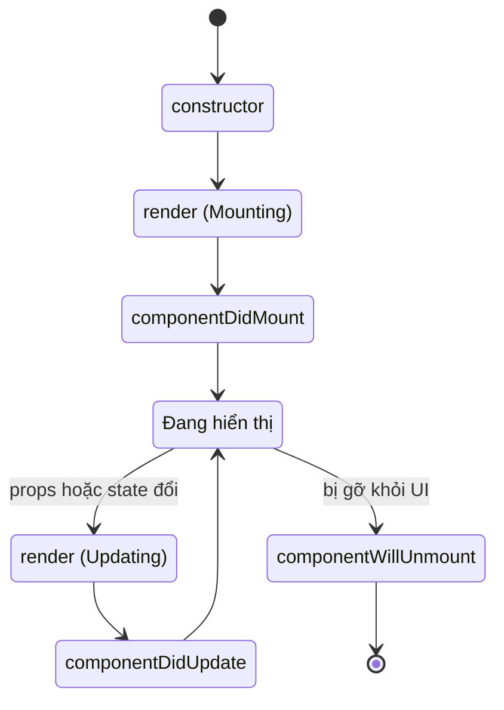

# Class Components (Legacy)

**Class component** (component viết dưới dạng lớp ES6) là cách tạo component cũ trong React, trước khi **hooks** (các hàm giúp dùng state và vòng đời trong functional component) ra đời năm 2019. Ngày nay hầu như không ai viết code mới bằng class component nữa, nhưng bạn vẫn nên hiểu nó để đọc code cũ và nắm được lý do hooks xuất hiện. Bài này giới thiệu cách khai báo class component, quản lý **state** (dữ liệu nội bộ thay đổi theo thời gian) và các **lifecycle method** (phương thức chạy ở từng giai đoạn vòng đời component).

---

## Mục lục

- [Vì sao (từng) có class component?](#vì-sao-từng-có-class-component)
- [Tại sao vẫn cần biết?](#tại-sao-vẫn-cần-biết)
- [Khai báo class component](#khai-báo-class-component)
- [State và setState](#state-và-setstate)
- [Lifecycle methods](#lifecycle-methods)
- [Khi nào còn gặp class component?](#khi-nào-còn-gặp-class-component)

---

## Vì sao (từng) có class component?

**Vấn đề:** Trước khi có Hooks (React < 16.8), functional component
**không giữ được state** và **không có lifecycle** — chỉ là "dumb
component" nhận props rồi render ra UI. Không có cách nào để component
có dữ liệu nội bộ thay đổi theo thời gian hay phản ứng theo vòng đời
(mount/update/unmount).

```jsx
// Trước Hooks: functional component chỉ render, không state
function Counter() {
  let count = 0; // reset mỗi lần render, không giữ được
  return <button onClick={() => count++}>Count: {count}</button>;
  // Bấm nút → count++ nhưng UI không cập nhật, không có gì re-render
}
```

**Giải pháp:** Class component (`extends React.Component`) cho component
một nơi giữ **state** riêng (`this.state` / `this.setState`) và bộ
**lifecycle method** (`componentDidMount`, `componentDidUpdate`,
`componentWillUnmount`...) để chạy logic ở từng giai đoạn vòng đời.

```jsx
import { Component } from "react";

class Counter extends Component {
  state = { count: 0 }; // state riêng, giữ qua các lần render

  render() {
    return (
      <button onClick={() => this.setState(p => ({ count: p.count + 1 }))}>
        Count: {this.state.count}
      </button>
    );
  }
}
```

Ngày nay phần lớn việc này đã được thay bằng Hooks, nhưng vẫn cần hiểu
class component vì còn trong codebase cũ và Error Boundary đến nay vẫn
phải dùng class.

:::tip[Dùng thực tế]

- **Đọc & bảo trì code cũ** — codebase trước 2019 đầy class component.
- **Error Boundary** — React vẫn chưa có hook tương đương, buộc dùng class.
- **Hiểu lịch sử lifecycle** — biết vì sao `useEffect` ra đời để thay thế.
- **Migrate dần sang hooks** — nắm class để convert an toàn từng phần.

:::

---

## Tại sao vẫn cần biết?

Hooks (React 16.8, 2019) đã thay thế class component cho 99% use case
mới. Nhưng vẫn nên biết để:

- **Đọc code legacy** — codebase trước 2019.
- **Maintain dự án cũ** — migrate dần sang hooks.
- **Hiểu khái niệm** — lifecycle, this, bind... để giải thích tại sao
  hooks ra đời.

:::warning[Cần lưu ý]

**Không viết code mới bằng class component.** React docs đã chuyển sang
hooks-first hoàn toàn. Hooks:

- Code ngắn hơn 30-50%.
- Không có `this` binding rắc rối.
- Reuse logic dễ qua custom hooks.
- Type-safe với TypeScript tốt hơn.

Class component **vẫn được hỗ trợ** vô thời hạn — không bị remove. Chỉ
là không khuyến nghị cho code mới.

:::

---

## Khai báo class component

```jsx
import { Component } from "react";

class Welcome extends Component {
  render() {
    return <h1>Hello, {this.props.name}</h1>;
  }
}

// Dùng
<Welcome name="An" />
```

Với TypeScript:

```tsx
interface Props { name: string; }
interface State { count: number; }

class Counter extends Component<Props, State> {
  state: State = { count: 0 };

  render() {
    return <p>Count: {this.state.count}</p>;
  }
}
```

---

## State và setState

State khởi tạo trong constructor hoặc class field:

```jsx
class Counter extends Component {
  state = { count: 0 };

  increment = () => {
    this.setState({ count: this.state.count + 1 });
  };

  render() {
    return (
      <button onClick={this.increment}>
        Count: {this.state.count}
      </button>
    );
  }
}
```

`setState` có 2 dạng:

```jsx
// Dạng 1: object — không nên khi update dựa vào state cũ
this.setState({ count: this.state.count + 1 });

// Dạng 2: updater function — đúng khi dựa vào state trước
this.setState(prev => ({ count: prev.count + 1 }));
```

:::warning[Cần lưu ý]

**`setState` là async + batched** — đừng dựa vào `this.state` ngay sau
khi gọi:

```jsx
this.setState({ count: 1 });
console.log(this.state.count); // có thể vẫn là giá trị cũ

// Multiple setState gộp lại
this.setState({ count: this.state.count + 1 });
this.setState({ count: this.state.count + 1 });
// Cả 2 thấy count cũ → kết quả +1, không phải +2

// Đúng cách
this.setState(prev => ({ count: prev.count + 1 }));
this.setState(prev => ({ count: prev.count + 1 }));
// +2
```

Cùng issue áp dụng cho hooks `useState` — nguyên tắc giống nhau.

:::

---

## Lifecycle methods

3 giai đoạn lifecycle:

| Phase | Method |
|-------|--------|
| **Mounting** | `constructor` → `render` → `componentDidMount` |
| **Updating** | `shouldComponentUpdate` → `render` → `componentDidUpdate` |
| **Unmounting** | `componentWillUnmount` |

Vòng đời của một class component đi qua các trạng thái sau:



```jsx
class DataLoader extends Component {
  state = { data: null, loading: true };

  componentDidMount() {
    // Chạy sau khi component mount
    fetch("/api").then(r => r.json()).then(data => {
      this.setState({ data, loading: false });
    });
  }

  componentDidUpdate(prevProps) {
    // Chạy sau khi update
    if (this.props.id !== prevProps.id) {
      this.reload();
    }
  }

  componentWillUnmount() {
    // Cleanup trước khi unmount
    this.abortController?.abort();
  }

  render() {
    if (this.state.loading) return <p>Loading...</p>;
    return <div>{JSON.stringify(this.state.data)}</div>;
  }
}
```

:::info[Phân tích]

**Hooks tương đương lifecycle:**

| Lifecycle | Hooks |
|-----------|-------|
| `constructor` | `useState` initial value |
| `componentDidMount` | `useEffect(() => {}, [])` |
| `componentDidUpdate` | `useEffect(() => {}, [deps])` |
| `componentWillUnmount` | `useEffect` return cleanup |
| `shouldComponentUpdate` | `React.memo` + `useMemo`/`useCallback` |
| `getDerivedStateFromProps` | Tính từ props trong render |
| `getSnapshotBeforeUpdate` | `useLayoutEffect` |

Một `useEffect` thay thế **3 lifecycle method** (mount, update, unmount)
trong một chỗ — dễ đọc, không bị tách logic.

Vd Pattern data fetching:

```jsx
// Class — 3 chỗ
class C extends Component {
  componentDidMount() { this.fetch(); }
  componentDidUpdate(prev) { if (prev.id !== this.props.id) this.fetch(); }
  componentWillUnmount() { this.controller.abort(); }
}

// Hook — 1 chỗ
function C({ id }) {
  useEffect(() => {
    const ctrl = new AbortController();
    fetchData(id, ctrl.signal);
    return () => ctrl.abort(); // cleanup
  }, [id]); // re-fetch khi id đổi
}
```

:::

---

## Khi nào còn gặp class component?

Năm 2026, gần như **chỉ còn 2 lý do**:

**1. Error Boundary** — đến nay React **vẫn chưa có hook tương đương**:

```jsx
class ErrorBoundary extends Component {
  state = { hasError: false };

  static getDerivedStateFromError() {
    return { hasError: true };
  }

  componentDidCatch(error, info) {
    logErrorToSentry(error, info);
  }

  render() {
    if (this.state.hasError) {
      return <p>Đã có lỗi</p>;
    }
    return this.props.children;
  }
}
```

Có thư viện `react-error-boundary` wrap thành component dễ dùng hơn.

**2. Codebase legacy** — không bao giờ migrate hết. Hiểu để đọc.

:::tip[Mẹo]

**Migrate class → hook**: làm dần từng component, không phải đập đi xây
lại toàn bộ. Tool hỗ trợ:

- **react-codemod** — script tự convert lifecycle → hooks.
- **VSCode refactor** — đôi khi work.
- Làm tay với pattern đã biết — an toàn nhất.

Ưu tiên migrate component có **logic đơn giản** trước. Component có
`shouldComponentUpdate`, `getSnapshotBeforeUpdate`, error boundary —
để cuối hoặc giữ class.

:::
