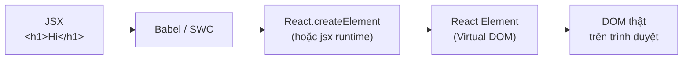

# JSX

**JSX** (cú pháp cho phép viết HTML ngay trong JavaScript) là cách React mô tả giao diện sẽ hiển thị. Nó trông giống HTML nhưng thực chất là JavaScript, nên được trình biên dịch (Babel hoặc SWC) chuyển thành các lời gọi hàm trước khi chạy trên trình duyệt. Bài này giải thích JSX là gì, các quy tắc cú pháp, cách nhúng JavaScript vào JSX và cách nó được biên dịch.

[](pathname:///img/react/jsx.webp)

---

:::note[Ghi nhớ nhanh]

- ⭐ **JSX là cú pháp giống HTML viết ngay trong JS** — được Babel/SWC biên dịch thành `React.createElement`, không phải string cũng không phải HTML thuần.
- **Quy tắc cú pháp** — chỉ 1 root element (hoặc Fragment), đóng mọi thẻ (``), attribute camelCase, inline style là object `{{ }}`.
- **Nhúng JS bằng `{}`** — chỉ nhận expression (ternary, `&&`, `.map`), không nhận statement (`if`, `for`).
- **Fragment `<>...</>`** — bọc nhiều element mà không tạo thêm DOM node.
- ⭐ **Từ React 17 không cần `import React`** — nhờ new JSX transform (`jsx: "react-jsx"`), bundle nhỏ hơn.

:::

---

## Mục lục

- [Vì sao có JSX?](#vì-sao-có-jsx)
- [JSX là gì?](#jsx-là-gì)
- [Quy tắc cú pháp](#quy-tắc-cú-pháp)
- [Embed JavaScript trong JSX](#embed-javascript-trong-jsx)
- [Fragment](#fragment)
- [JSX biên dịch thành gì?](#jsx-biên-dịch-thành-gì)
- [Câu hỏi phỏng vấn](#câu-hỏi-phỏng-vấn)

---

## Vì sao có JSX?

**Vấn đề:** tạo UI bằng `React.createElement(...)` lồng nhau rất khó đọc,
khó hình dung cây UI. Còn tách hẳn HTML và JS (template string) thì mất
type-check và dễ lỗi:

```jsx
// Lồng createElement — khó đọc, khó thấy cấu trúc cây
React.createElement("div", { className: "card" },
  React.createElement("h1", null, "Hello"),
  React.createElement("ul", null,
    React.createElement("li", null, "A"),
    React.createElement("li", null, "B")
  )
);

// Template string — không có type-check, dễ sai chính tả, dễ XSS
const html = `<div class="card"><h1>${name}</h1></div>`;
```

**Giải pháp:** JSX là cú pháp giống HTML viết **ngay trong JS**, được
Babel biên dịch thành `React.createElement`. Markup gắn liền với logic
của component, hỗ trợ biểu thức `{}`, dễ đọc và dễ bảo trì:

```jsx
function Card({ name, items }) {
  return (
    <div className="card">
      <h1>Hello {name}</h1>
      <ul>
        {items.map((item) => (
          <li key={item}>{item}</li>
        ))}
      </ul>
    </div>
  );
}
```

:::tip[Dùng thực tế]

- **Viết UI component trực quan**: cấu trúc JSX phản ánh đúng cây DOM, nhìn là hình dung được.
- **Nhúng biến/biểu thức**: dùng `{}` để chèn dữ liệu động vào giữa markup.
- **Render có điều kiện/danh sách**: kết hợp ternary, `&&`, `.map` ngay trong JSX.
- **IDE check JSX**: editor và TypeScript bắt lỗi attribute, kiểu dữ liệu, thẻ chưa đóng.

:::

---

## JSX là gì?

**JSX (JavaScript XML)** là cú pháp **mở rộng JavaScript** cho phép viết
"HTML" trong JS:

```jsx
const element = <h1>Hello, world!</h1>;
```

JSX không phải string, cũng không phải HTML thuần — nó được **biên dịch
thành function call**:

```jsx
const element = <h1 className="title">Hi</h1>;

// Biên dịch thành:
const element = React.createElement("h1", { className: "title" }, "Hi");
```

---

## Quy tắc cú pháp

**1. Chỉ trả về 1 root element**:

```jsx
// Sai — 2 root
return (
  <h1>Title</h1>
  <p>Body</p>
);

// Đúng — wrap trong div
return (
  <div>
    <h1>Title</h1>
    <p>Body</p>
  </div>
);

// Đúng — Fragment (không thêm DOM node)
return (
  <>
    <h1>Title</h1>
    <p>Body</p>
  </>
);
```

**2. Đóng mọi thẻ**:

```jsx
     // self-closing bắt buộc
<br />
<input type="text" /> // không phải <input>
```

**3. Attribute camelCase** (vì là JS property):

```jsx
<div className="box">        {/* không phải class */}
<label htmlFor="email">      {/* không phải for */}
<button onClick={handle}>    {/* không phải onclick */}
<input tabIndex={1} />       {/* không phải tabindex */}
<svg viewBox="...">          {/* SVG vẫn dùng kebab cho 1 số attr */}
```

**4. Inline style là object**:

```jsx
<div style={{ color: "red", fontSize: "16px" }}>
  Hello
</div>
```

Hai dấu ngoặc nhọn — ngoài là JSX expression, trong là object literal.

:::warning[Cần lưu ý]

**`class` là từ khoá JS** (cho ES6 class) → React dùng `className` thay thế.

Tương tự `for` (vòng lặp) → `htmlFor`.

Khi copy-paste HTML từ web vào JSX, **dùng tool convert** (nhiều plugin
VSCode có sẵn). Hoặc nhớ replace:

- `class=` → `className=`
- `for=` → `htmlFor=`
- `tabindex=` → `tabIndex=`
- `style="color: red"` → `style={{ color: "red" }}`

:::

---

## Embed JavaScript trong JSX

Dùng `{}` để chèn biểu thức JS:

```jsx
const name = "An";
const age = 25;
const isAdmin = true;

return (
  <div>
    <h1>Hello {name}</h1>
    <p>Age: {age}</p>
    <p>Status: {isAdmin ? "Admin" : "User"}</p>
    <p>Next year: {age + 1}</p>
    <p>Upper: {name.toUpperCase()}</p>
  </div>
);
```

**Không được dùng**:

- `if/else` statement (dùng ternary hoặc `&&`).
- `for` loop (dùng `.map`).
- Statement (only expression).

```jsx
// Sai — statement
return (
  <div>
    {if (cond) { ... }}
  </div>
);

// Đúng — expression
return (
  <div>
    {cond ? <A /> : <B />}
  </div>
);
```

:::tip[Mẹo]

**Render list bằng `.map`**:

```jsx
const items = ["Apple", "Banana", "Cherry"];

return (
  <ul>
    {items.map((item, index) => (
      <li key={index}>{item}</li>
    ))}
  </ul>
);
```

Mỗi item cần `key` duy nhất — sẽ học chi tiết ở phần Lists and Keys.

:::

---

## Fragment

`<>...</>` (short) hoặc `<Fragment>...</Fragment>` — wrap nhiều element
**không tạo extra DOM node**:

```jsx
return (
  <>
    <h1>Title</h1>
    <p>Body</p>
  </>
);
```

Khi cần `key` (trong list), dùng dạng đầy đủ:

```jsx
import { Fragment } from "react";

items.map(item => (
  <Fragment key={item.id}>
    <dt>{item.term}</dt>
    <dd>{item.desc}</dd>
  </Fragment>
));
```

---

## JSX biên dịch thành gì?

JSX **không chạy trực tiếp** trong trình duyệt — phải qua bundler (Vite,
Webpack) với plugin Babel/SWC.

Hành trình từ JSX đến DOM thật trên trình duyệt:



**Trước React 17:**

```jsx
<div className="box">
  <h1>Hi</h1>
</div>

// Compile thành:
React.createElement("div", { className: "box" },
  React.createElement("h1", null, "Hi")
);
```

→ Mọi file JSX phải `import React from "react"` dù không dùng `React`
trực tiếp.

**Từ React 17 (new JSX transform):**

```jsx
// Không cần import React
function App() {
  return <div>Hi</div>;
}

// Compile thành:
import { jsx as _jsx } from "react/jsx-runtime";
const App = () => _jsx("div", { children: "Hi" });
```

→ Không cần `import React`, bundle nhỏ hơn, tối ưu hơn.

:::info[Phân tích]

**Sự ra đời của JSX transform mới (React 17)** giải quyết:

1. **Bundle size**: cũ luôn cần `React` trong scope — bundler không
   loại bỏ được dù file chỉ dùng JSX không gọi method React.
2. **Phân biệt prop key reserved** — `children` được tách rõ ràng.
3. **Tối ưu compile**: phân biệt `jsx` (1 child static), `jsxs` (children
   là array), `jsxDEV` (chứa source location cho dev).

Để bật:

```json
// tsconfig.json
{
  "compilerOptions": {
    "jsx": "react-jsx"
  }
}
```

Phần lớn project mới (Vite, Next.js) đã bật mặc định. Bạn vẫn thấy
`import React from "react"` trong example cũ vì lý do legacy.

:::

:::tip[Mẹo]

**JSX không phải duy nhất của React** — Solid.js, Preact, Stencil đều
dùng JSX. Compiler khác nhau (Babel, SWC, esbuild, swc-jsx) nhưng cú
pháp giống nhau.

Vue có **template syntax** riêng, Svelte có **template Svelte** — không
phải JSX. Khi đọc tài liệu UI library, kiểm tra trước:

- React → JSX.
- Vue → `<template>`.
- Svelte → `.svelte` file format.
- Solid → JSX (giống React).

:::

---

## Câu hỏi phỏng vấn

Những câu thường gặp về chủ đề này. Tự trả lời trước, rồi bấm **Xem đáp án** để đối chiếu.

**1. `JSX` là gì? Nó là HTML, là string hay là JavaScript, và vì sao trình duyệt không chạy trực tiếp được?**

<details className="qa">
<summary>Xem đáp án</summary>

**JSX (JavaScript XML)** là cú pháp mở rộng của JavaScript, cho phép viết markup giống HTML ngay trong file JS. Nó **không phải HTML** (attribute là `className`, `htmlFor`, mọi thẻ phải đóng) và **không phải string** (không có dấu nháy bao quanh, IDE/TypeScript vẫn check được). Bản chất nó là **JavaScript**: mỗi thẻ JSX được Babel/SWC biên dịch thành một lời gọi hàm `React.createElement` (hoặc `_jsx` với new transform).

Trình duyệt chỉ hiểu JavaScript chuẩn ECMAScript. Với engine, đoạn `<h1>Hi</h1>` nằm giữa code JS là **lỗi cú pháp** — không có spec nào định nghĩa nó. Vì vậy JSX bắt buộc đi qua bước build (Vite, Webpack, Next.js... với plugin Babel/SWC) để chuyển về function call thuần trước khi chạy.

```jsx
const el = <h1>Hi</h1>;          // JSX — trình duyệt không hiểu
const el = _jsx("h1", { children: "Hi" }); // sau biên dịch — chạy được
```

</details>

**2. Đoạn `const el = <h1 className="title">Hi</h1>;` sau khi biên dịch trở thành gì?**

<details className="qa">
<summary>Xem đáp án</summary>

Tuỳ cấu hình transform:

Với transform cũ (trước React 17, `jsx: "react"`):

```jsx
const el = React.createElement("h1", { className: "title" }, "Hi");
```

Đối số lần lượt là: `type` (chuỗi `"h1"` vì là thẻ HTML), `props` (object attribute), rồi các `children`. Vì kết quả có nhắc tới `React`, file bắt buộc phải `import React from "react"`.

Với new JSX transform (React 17+, `jsx: "react-jsx"`):

```jsx
import { jsx as _jsx } from "react/jsx-runtime";

const el = _jsx("h1", { className: "title", children: "Hi" });
```

Ở dạng mới, `children` nằm luôn trong object props và hàm `_jsx` được compiler tự import — không cần `import React`. Cả hai cách đều trả về cùng một thứ: một **React element**, tức object JS mô tả UI.

</details>

**3. `React.createElement` trả về cái gì? React element khác DOM node thật ở điểm nào?**

<details className="qa">
<summary>Xem đáp án</summary>

Nó trả về một **React element** — object JavaScript thuần, bất biến, chỉ *mô tả* UI cần hiển thị:

```jsx
const el = <h1 className="title">Hi</h1>;

// el xấp xỉ:
// { type: "h1", key: null, ref: null,
//   props: { className: "title", children: "Hi" } }
```

Khác biệt với DOM node thật:

| | React element | DOM node |
|---|---|---|
| Bản chất | Object JS thuần (Virtual DOM) | Đối tượng do trình duyệt tạo |
| Chi phí | Rất nhẹ, tạo/vứt thoải mái | Nặng, tạo nhiều gây chậm |
| API | Không có `appendChild`, không đo được kích thước | Đầy đủ API DOM |
| Vòng đời | Bất biến — muốn đổi thì tạo element mới | Thay đổi trực tiếp tại chỗ |

React nhận cây element mới, so sánh với cây cũ (reconciliation), rồi mới sinh hoặc vá đúng phần DOM cần đổi. Nhờ vậy ta viết UI theo kiểu "mô tả trạng thái", còn thao tác DOM do React lo.

</details>

**4. Vì sao `JSX` dùng `className` thay cho `class` và `htmlFor` thay cho `for`?**

<details className="qa">
<summary>Xem đáp án</summary>

Vì JSX **là JavaScript**, mà `class` và `for` đều là **từ khoá dành riêng** của ngôn ngữ (`class` cho ES6 class, `for` cho vòng lặp). Attribute trong JSX được biên dịch thành key của object props, nên dùng thẳng từ khoá dễ gây xung đột và rắc rối cho parser thời JSX ra đời.

React chọn cách đặt tên theo **property của DOM API** thay vì theo tên attribute HTML — mà trong DOM, hai property tương ứng chính là `element.className` và `label.htmlFor`. Quy ước này khớp luôn với quy tắc camelCase chung của JSX (`onClick`, `tabIndex`, `readOnly`).

Hệ quả thực tế: khi copy HTML từ web dán vào JSX, phải nhớ đổi:

- `class=` thành `className=`
- `for=` thành `htmlFor=`
- `tabindex=` thành `tabIndex=`
- `style="color: red"` thành ``style={{ color: "red" }}``

Nhiều extension VSCode có sẵn lệnh convert HTML sang JSX để khỏi làm tay.

</details>

**5. Vì sao một component chỉ được trả về một root element? Có những cách nào để trả nhiều element cùng cấp?**

<details className="qa">
<summary>Xem đáp án</summary>

Vì JSX biên dịch thành **một lời gọi hàm**, và một hàm JavaScript chỉ `return` được **một giá trị**. Hai element viết cạnh nhau sẽ thành hai expression độc lập — không hợp lệ về cú pháp:

```jsx
// Sai — 2 root, không phải một expression
return (
  <h1>Title</h1>
  <p>Body</p>
);
```

Các cách trả về nhiều element cùng cấp:

- **Bọc trong một thẻ bao** (`div`, `section`...) — đơn giản nhưng thêm một DOM node.
- **Fragment ngắn** `<>...</>` — nhóm element mà không tạo node thật, lựa chọn mặc định.
- **Fragment đầy đủ** `<Fragment key={id}>` — khi cần truyền `key` trong list.
- **Trả về mảng** element, ví dụ kết quả của `.map()`; mỗi phần tử cần `key`.

```jsx
return (
  <>
    <h1>Title</h1>
    <p>Body</p>
  </>
);
```

</details>

**6. `Fragment` khác gì so với bọc bằng một thẻ `div`? Khi nào bắt buộc dùng dạng đầy đủ `<Fragment>` thay vì `<>`?**

<details className="qa">
<summary>Xem đáp án</summary>

| | Fragment | `div` bao ngoài |
|---|---|---|
| DOM sinh ra | Không có node nào | Thêm một node thật |
| Ảnh hưởng layout | Không — con vẫn là con trực tiếp của cha | Phá quan hệ cha–con của flex/grid |
| HTML hợp lệ | Giữ được `ul > li`, `tbody > tr` | Chèn `div` vào giữa là sai chuẩn |
| Style / ref | Không nhận `className`, `style`, `ref` | Nhận đầy đủ |

Nói ngắn: dùng Fragment khi chỉ cần **nhóm** element về mặt cú pháp; dùng `div` khi thật sự cần một node để style hoặc gắn `ref`.

Bắt buộc dùng dạng đầy đủ `<Fragment>` khi cần truyền **`key`** — điển hình là render list:

```jsx
import { Fragment } from "react";

items.map((item) => (
  <Fragment key={item.id}>
    <dt>{item.term}</dt>
    <dd>{item.desc}</dd>
  </Fragment>
));
```

Cú pháp ngắn `<>...</>` không nhận bất kỳ attribute nào, kể cả `key`.

</details>

**7. Trong cặp `{}` của JSX viết được những gì? Vì sao viết được ternary và `.map` nhưng không viết được `if` hay `for`?**

<details className="qa">
<summary>Xem đáp án</summary>

Trong `{}` viết được **mọi expression JavaScript** — thứ sinh ra một giá trị: biến, phép tính, gọi hàm, truy cập property, template literal, ternary, `&&`, `||`, `??`, `.map()`, thậm chí một JSX element khác.

Lý do: nội dung trong `{}` sau khi biên dịch trở thành **đối số** truyền vào `createElement`/`_jsx`. Đối số của hàm bắt buộc phải là một giá trị. Ternary và `.map()` là expression — chúng *trả về* giá trị (một element, một mảng element). Còn `if`, `for`, `switch`, `try` là **statement** — chúng điều khiển luồng chứ không sinh ra giá trị, nên không thể làm đối số.

```jsx
// Đúng — expression, có giá trị
<div>{cond ? <A /> : <B />}</div>
<ul>{items.map((i) => <li key={i}>{i}</li>)}</ul>

// Sai — statement, không có giá trị
<div>{if (cond) { ... }}</div>
```

Cần logic phức tạp thì đưa `if`/`for` ra **ngoài** phần JSX, gán kết quả vào biến rồi nhúng biến đó vào `{}`.

</details>

**8. Vì sao `style` trong JSX nhận một object (`style={{ color: "red" }}`) chứ không nhận string như HTML?**

<details className="qa">
<summary>Xem đáp án</summary>

Vì React đặt style qua **property của DOM** (`element.style.color = "red"`) chứ không gán chuỗi vào attribute. Property `style` của DOM vốn là một object, nên React nhận đúng hình dạng đó: các cặp key–value với key viết **camelCase** (`fontSize`, `backgroundColor`) đúng như tên property trong `CSSStyleDeclaration`.

Lưu ý hai lớp ngoặc nhọn: lớp ngoài là **JSX expression**, lớp trong là **object literal**.

```jsx
const color = "red";

<div style={{ color, fontSize: 16, marginTop: "1rem" }}>Hello</div>
```

Lợi ích của dạng object:

- Giá trị là JS nên tính động, ghép object, spread rất tự nhiên — không phải nối chuỗi.
- Tránh lỗi chính tả khó thấy trong string CSS; TypeScript check được tên property.
- React tự thêm đơn vị `px` cho các property số phù hợp (`fontSize: 16` thành `16px`), trừ các property không đơn vị như `lineHeight`, `zIndex`, `flex`.

Với style phức tạp, thực tế vẫn nên dùng class CSS thay vì inline style.

</details>

**9. Vì sao tên component phải viết hoa chữ cái đầu? Điều gì xảy ra nếu viết `<myButton />`?**

<details className="qa">
<summary>Xem đáp án</summary>

Vì compiler JSX dùng **chữ cái đầu** để phân biệt thẻ HTML với component:

- Chữ thường thành **chuỗi**: `<div />` biên dịch thành `_jsx("div", ...)` — React hiểu là thẻ DOM.
- Chữ hoa thành **biến JS**: `<Button />` biên dịch thành `_jsx(Button, ...)` — React hiểu là component và sẽ gọi hàm đó.

Nếu viết `<myButton />`, compiler sinh ra `_jsx("myButton", ...)`. React coi `"myButton"` là tên thẻ DOM, cố tạo một phần tử không tồn tại trong HTML, và cảnh báo đại loại *"The tag `<myButton>` is unrecognized in this browser"*. Component `myButton` bạn định nghĩa **không hề được gọi**, props truyền vào bị coi là attribute DOM lạ, và màn hình không render ra nội dung mong muốn.

```jsx
function myButton() { return <button>OK</button>; }

<myButton />  // sai — render thẻ DOM "myButton" rỗng
<MyButton />  // đúng — gọi component
```

Ngoại lệ: truy cập qua object như `<Form.Input />` vẫn được coi là component.

</details>

**10. Dự đoán kết quả: render `{null}`, `{undefined}`, `{false}`, `{0}`, `{""}` bên trong JSX — giá trị nào hiện ra màn hình?**

<details className="qa">
<summary>Xem đáp án</summary>

| Giá trị | Hiển thị |
|---|---|
| `null` | Không render gì |
| `undefined` | Không render gì |
| `false` (và `true`) | Không render gì |
| `0` | **Hiện ra chữ `0`** |
| `""` | Không thấy gì (chuỗi rỗng) |

React cố ý bỏ qua `null`, `undefined`, `true`, `false` để cú pháp `cond && <X />` hoạt động gọn gàng. Nhưng `0` là **số** — React render mọi số và chuỗi thành text node, nên `0` hiện lên màn hình.

Đây là cái bẫy kinh điển:

```jsx
{items.length && <List items={items} />}
// items rỗng → 0 && ... → trả về 0 → in ra "0" trên UI

{items.length > 0 && <List items={items} />}  // đúng
{items.length ? <List items={items} /> : null} // hoặc dùng ternary
```

Quy tắc an toàn: luôn ép vế trái của `&&` về boolean thật.

</details>

**11. Lỗi `Objects are not valid as a React child` xảy ra khi nào và sửa như thế nào?**

<details className="qa">
<summary>Xem đáp án</summary>

Xảy ra khi bạn nhúng một **object JS thường** vào vị trí children của JSX. React chỉ render được string, number, React element, mảng các thứ đó, hoặc `null`/`undefined`/boolean (bỏ qua) — chứ không biết biến một object bất kỳ thành text.

Các tình huống hay gặp:

- Quên truy cập property: viết `{user}` thay vì `{user.name}`.
- Render thẳng một `Date`, `Error`, `Map`, `Set`.
- Render kết quả `fetch` chưa xử lý, hoặc một Promise.
- Nhầm khi map: trả về object thay vì element.

```jsx
const user = { name: "An", age: 25 };

<p>{user}</p>                     // 💥 Objects are not valid as a React child
<p>{user.name}</p>                // ✅
<p>{JSON.stringify(user)}</p>     // ✅ để debug
<p>{date.toLocaleDateString()}</p> // ✅ với Date
```

Cách sửa chung: chuyển object thành thứ React hiểu — lấy đúng field, gọi phương thức format, hoặc `.map()` thành danh sách element.

</details>

**12. `new JSX transform` từ React 17 khác bản cũ ở chỗ nào? Vì sao không cần `import React` nữa và điều đó giúp gì cho bundle size?**

<details className="qa">
<summary>Xem đáp án</summary>

| | Transform cũ (`jsx: "react"`) | New transform (`jsx: "react-jsx"`) |
|---|---|---|
| Hàm sinh ra | `React.createElement(type, props, ...children)` | `_jsx` / `_jsxs` từ `react/jsx-runtime` |
| Import | Phải tự `import React from "react"` | Compiler tự chèn import |
| `children` | Là đối số riêng | Nằm trong object props |

Bản cũ luôn tạo ra code tham chiếu tới biến `React`, nên mọi file JSX bắt buộc có `React` trong scope — dù file đó không gọi API nào của React. New transform gọi thẳng hàm `_jsx` do compiler tự import từ `react/jsx-runtime`, nên dòng `import React` trở nên thừa.

Lợi ích:

- Bớt boilerplate và bớt lỗi "React is not defined".
- Bundler không phải giữ lại toàn bộ namespace `React` chỉ để render JSX, tree-shaking tốt hơn nên bundle nhỏ hơn một chút.
- Runtime có thể tối ưu riêng từng trường hợp (`jsx`, `jsxs`, `jsxDEV`).

Bật bằng `"jsx": "react-jsx"` trong `tsconfig.json`; Vite và Next.js đã bật sẵn.

</details>

**13. Phân biệt `jsx`, `jsxs`, `jsxDEV` trong `react/jsx-runtime` — mỗi hàm được dùng trong tình huống nào?**

<details className="qa">
<summary>Xem đáp án</summary>

Cả ba đều tạo ra React element, khác nhau ở tình huống compiler chọn dùng:

- **`jsx`** — dùng khi element có **0 hoặc 1 child tĩnh**. Đây là trường hợp phổ biến nhất, đường đi nhanh nhất.
- **`jsxs`** (s = static children) — dùng khi element có **nhiều child viết tĩnh trong code**. Vì mảng children do chính compiler sinh ra, React biết nó cố định và **bỏ qua kiểm tra `key`**, tiết kiệm công so với mảng động từ `.map()`.
- **`jsxDEV`** — phiên bản chỉ có trong **bản development**, nằm ở `react/jsx-dev-runtime`. Nó nhận thêm tham số `source` (tên file, dòng, cột) và cờ `self`, nhờ đó cảnh báo và stack trace chỉ đúng vị trí trong code gốc. Bản production không dùng hàm này để tránh phình bundle.

```jsx
_jsx("h1", { children: "Hi" });                    // 1 child
_jsxs("div", { children: [_jsx("h1", {}), <p />] }); // nhiều child tĩnh
```

Bạn không bao giờ gọi trực tiếp các hàm này — compiler tự chọn.

</details>

**14. JSX tự escape nội dung ra sao để chống `XSS`? `dangerouslySetInnerHTML` phá vỡ điều đó thế nào?**

<details className="qa">
<summary>Xem đáp án</summary>

Mọi giá trị nhúng bằng `{}` đều được React coi là **text thuần**, không phải markup. Khi dựng DOM, React gán chúng qua `textContent` (hoặc tạo text node), nên ký tự đặc biệt không bao giờ được trình duyệt parse thành thẻ:

```jsx
const input = "";

<div>{input}</div>
// Hiển thị nguyên văn chuỗi trên màn hình, không tạo thẻ img, không chạy JS
```

Nhờ vậy, mặc định React an toàn với XSS cho dữ liệu người dùng.

`dangerouslySetInnerHTML` bỏ qua toàn bộ cơ chế đó: React gán chuỗi thẳng vào `innerHTML`, trình duyệt **parse nó thành HTML thật**:

```jsx
<div dangerouslySetInnerHTML={{ __html: input }} />
// Thẻ img được tạo thật → onerror chạy → XSS
```

Tên prop dài dòng và chữ "dangerously" là cố ý, để bạn phải cân nhắc. Nếu buộc phải render HTML (nội dung từ CMS, rich text editor), hãy **sanitize** trước bằng thư viện như DOMPurify, và tuyệt đối không truyền thẳng dữ liệu người dùng vào.

</details>

**15. `JSX` có phải đặc quyền riêng của React không? So với template syntax của Vue hay Svelte thì khác biệt cốt lõi là gì?**

<details className="qa">
<summary>Xem đáp án</summary>

**Không.** JSX chỉ là cú pháp, ai cũng dùng được: Solid.js, Preact, Stencil, Qwik đều hỗ trợ JSX; compiler thì có Babel, SWC, esbuild, TypeScript. Ngữ nghĩa runtime mới là thứ khác nhau — ví dụ Solid biên dịch JSX thẳng thành thao tác DOM với hệ reactive, không dùng Virtual DOM như React.

Vue dùng **template syntax** riêng (`<template>` với `v-if`, `v-for`, `v-bind`), Svelte dùng **định dạng file `.svelte`**. Khác biệt cốt lõi:

| | JSX | Template (Vue, Svelte) |
|---|---|---|
| Bản chất | Là JavaScript | Là DSL riêng, compiler phân tích |
| Logic | Dùng trọn cú pháp JS: biến, hàm, ternary, `.map` | Dùng directive có sẵn (`v-if`, `each`) |
| Kiểm tra kiểu | TypeScript check tự nhiên | Cần tooling riêng của framework |
| Tối ưu | Khó đoán trước vì là code JS tuỳ ý | Compiler biết cấu trúc, tối ưu tốt hơn |

Tóm lại: JSX đánh đổi lấy **sự linh hoạt của ngôn ngữ**, template đánh đổi lấy **khả năng tối ưu và tính dễ đọc** cho người quen HTML.

</details>
