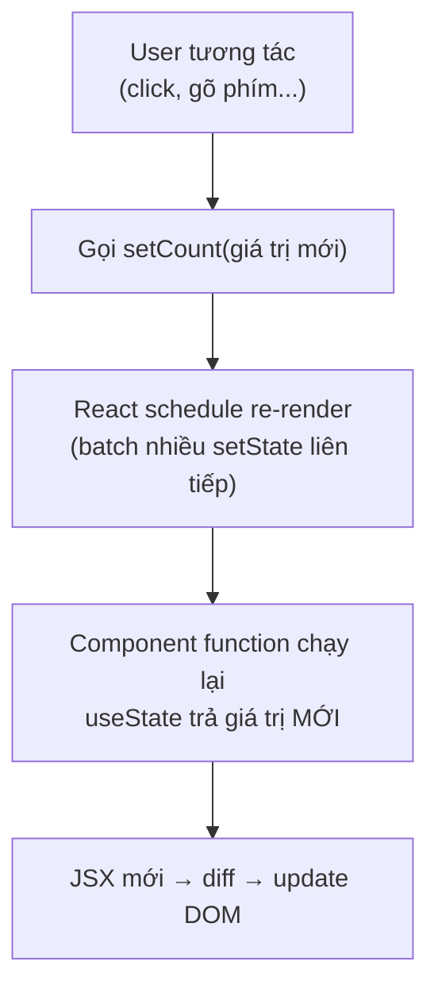
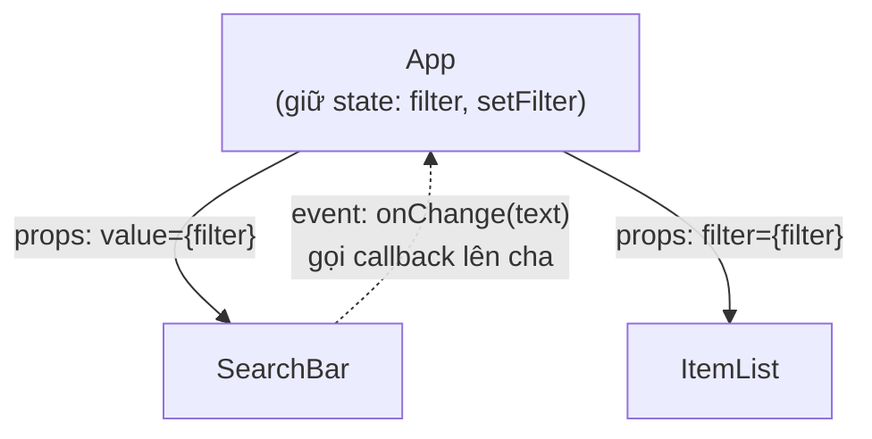

# Props vs State

**Props** (dữ liệu truyền từ component cha vào, không sửa được) và **state** (dữ liệu nội bộ của component, có thể thay đổi theo thời gian) là hai cách quản lý dữ liệu cốt lõi trong React. Hiểu rõ khi nào dùng props, khi nào dùng state giúp bạn tránh nhiều lỗi phổ biến khi mới học. Bài này so sánh hai khái niệm, cách cập nhật state đúng cách và kỹ thuật **lifting state up** (đưa state lên component cha để nhiều component cùng dùng chung).

---

:::note[Ghi nhớ nhanh]

- ⭐ **Props từ cha truyền xuống và readonly; state là dữ liệu nội bộ đổi qua setter** — gọi setter làm React re-render component.
- ⭐ **Mô hình cốt lõi: UI = f(state)** — mô tả UI theo dữ liệu, React lo cập nhật DOM cho khớp.
- **Setter async + batched** — dùng updater `setX(prev => ...)` khi state mới phụ thuộc state cũ.
- **Không mutate object/array trong state** — luôn tạo bản mới bằng spread (`[...items, item]`, `{...user, name}`) vì React dùng shallow comparison.
- **Ưu tiên derive thay vì tạo state thừa** — giữ state nhỏ nhất; nhiều component share thì dùng lifting state up (state down qua props, event up qua callback).

:::

---

## Mục lục

- [Vì sao có props & state?](#vì-sao-có-props--state)
- [Tổng quan](#tổng-quan)
- [Props](#props)
- [State](#state)
- [Khi nào dùng state vs props?](#khi-nào-dùng-state-vs-props)
- [Lifting state up](#lifting-state-up)

---

## Vì sao có props & state?

**Vấn đề:**

```jsx
// UI cần (1) tái dùng component với nội dung khác nhau, và
// (2) "nhớ" dữ liệu đổi theo thời gian rồi tự cập nhật màn hình.

// Viết cứng nội dung → không tái dùng được
function Greeting() {
  return <p>Xin chào An</p>; // chỉ hợp với "An"
}

// Tự quản dữ liệu đổi + sửa DOM thủ công → rối, dễ lệch UI-dữ liệu
let count = 0;
function increment() {
  count = count + 1;
  document.querySelector("#count").textContent = count; // dễ quên, dễ sai
}
```

**Giải pháp:**

```jsx
// props — dữ liệu cha truyền xuống, chỉ đọc → tái dùng component
function Greeting({ name }) {
  return <p>Xin chào {name}</p>;
}
<Greeting name="An" />
<Greeting name="Bình" />

// state — dữ liệu nội bộ, đổi qua setState/useState → React tự re-render
function Counter() {
  const [count, setCount] = useState(0);
  return <button onClick={() => setCount(count + 1)}>{count}</button>;
}

// Mô hình cốt lõi: UI = f(state). Bạn mô tả UI theo dữ liệu,
// React lo việc cập nhật DOM cho khớp.
```

:::tip[Dùng thực tế]

- **Truyền dữ liệu xuống con**: cha đưa `user`, `items` qua props cho con hiển thị.
- **Ô input / counter**: giá trị gõ vào, số đếm — giữ trong state.
- **Toggle modal**: `isOpen` là state, đổi `true/false` để mở/đóng.
- **Danh sách lọc**: state giữ `filter`, danh sách hiển thị tính lại theo state.

:::

---

## Tổng quan

| | Props | State |
|--|-------|-------|
| Nguồn | Parent component | Bên trong component |
| Sửa được? | **Không** (readonly) | **Có** (qua setter) |
| Ai control? | Parent | Chính component |
| Trigger re-render? | Có (parent re-render) | Có (setState gọi) |

---

## Props

Props là **dữ liệu truyền vào component** từ parent.

```jsx
function Avatar({ src, alt, size = 40 }) {
  return (
    
  );
}

<Avatar src="/me.jpg" alt="An" size={60} />
```

Props **không sửa được** trong component nhận:

```jsx
function Avatar({ size }) {
  size = 100; // KHÔNG nên — mutation props
  return ;
}
```

Nếu cần biến đổi, tạo biến mới:

```jsx
function Avatar({ size }) {
  const finalSize = Math.min(size, 200);
  return ;
}
```

---

## State

State là **dữ liệu nội bộ** của component, **thay đổi qua thời gian**.

Dùng hook `useState`:

```jsx
import { useState } from "react";

function Counter() {
  const [count, setCount] = useState(0);

  return (
    <div>
      <p>Count: {count}</p>
      <button onClick={() => setCount(count + 1)}>+1</button>
    </div>
  );
}
```

`useState(initial)` trả về:

- Giá trị hiện tại.
- Setter function — gọi để update state.

Khi setter được gọi → React **schedule re-render** → component chạy lại
→ JSX mới render.



:::warning[Cần lưu ý]

**Setter là async + batched**. Đừng dựa vào state cũ sau khi gọi:

```jsx
function increment() {
  setCount(count + 1);
  console.log(count); // vẫn giá trị cũ, chưa cập nhật
}

// Multiple calls bị gộp
function tripleIncrement() {
  setCount(count + 1); // count = 0 → set 1
  setCount(count + 1); // count = 0 → set 1 (không phải 2!)
  setCount(count + 1); // count = 0 → set 1
}

// Đúng — dùng updater function
function tripleIncrement() {
  setCount(c => c + 1); // 0 → 1
  setCount(c => c + 1); // 1 → 2
  setCount(c => c + 1); // 2 → 3
}
```

Quy tắc: khi state **mới phụ thuộc state cũ**, **luôn dùng updater
function** `setX(prev => ...)`.

:::

State có thể là bất kỳ kiểu:

```jsx
const [name, setName] = useState("");           // string
const [count, setCount] = useState(0);          // number
const [items, setItems] = useState([]);         // array
const [user, setUser] = useState({ name: "" }); // object
const [isOpen, setOpen] = useState(false);      // boolean
```

:::info[Phân tích]

**Update object/array trong state — không bao giờ mutate:**

```jsx
// Sai — mutation, React không detect change
function addItem(item) {
  items.push(item);    // mutation
  setItems(items);     // tham chiếu cũ → React không re-render
}

// Đúng — tạo array mới
function addItem(item) {
  setItems([...items, item]);
  // Hoặc updater
  setItems(prev => [...prev, item]);
}

// Update object
function updateUser(name) {
  setUser({ ...user, name }); // spread + override
}

// Nested — phức tạp hơn
setUser(prev => ({
  ...prev,
  address: { ...prev.address, city: "HN" },
}));
```

Lý do React dùng **shallow comparison** để detect change. Mutation không
đổi reference → React nghĩ không có gì thay đổi → skip re-render.

Với state nested sâu, cân nhắc:

- **Immer** — viết "mutating" syntax nhưng tự tạo immutable update.
- **Zustand / Jotai** — state management ngoài component.
- **Flatten state** — tránh nested khi có thể.

:::

---

## Khi nào dùng state vs props?

Hỏi 3 câu:

**1. Có thay đổi qua thời gian không?**
   - Không → không cần state, dùng const thường hoặc derive từ props.

**2. Có được tính từ props hay state khác không?**
   - Có → derive trong render, không cần state.

**3. Có được truyền từ parent không?**
   - Có → đó là props, không phải state.

Ví dụ — anti-pattern thường gặp:

```jsx
// Sai — tạo state cho thứ derive được
function UserCard({ firstName, lastName }) {
  const [fullName, setFullName] = useState(`${firstName} ${lastName}`);
  // Bug: fullName không update khi prop đổi

  return <p>{fullName}</p>;
}

// Đúng — tính trong render
function UserCard({ firstName, lastName }) {
  const fullName = `${firstName} ${lastName}`;
  return <p>{fullName}</p>;
}
```

:::tip[Mẹo]

**Quy tắc xác định state:**

- Có khi state là **biến nhỏ nhất, đủ để render** UI.
- Mọi thứ khác **tính ra** từ state + props.

Vd: list items có filter. State chỉ cần:

```jsx
const [items, setItems] = useState([]);       // dữ liệu gốc
const [filter, setFilter] = useState("");     // text filter
// KHÔNG cần state riêng cho filteredItems
const filteredItems = items.filter(x =>       // tính ra
  x.name.includes(filter)
);
```

Càng ít state, app càng dễ maintain và ít bug.

:::

---

## Lifting state up

Khi 2+ component cần share state, **đặt state ở parent** chung:

```jsx
// Parent giữ state
function App() {
  const [filter, setFilter] = useState("");

  return (
    <>
      <SearchBar value={filter} onChange={setFilter} />
      <ItemList filter={filter} />
    </>
  );
}

// Child read qua prop
function SearchBar({ value, onChange }) {
  return <input value={value} onChange={e => onChange(e.target.value)} />;
}

function ItemList({ filter }) {
  // dùng filter
}
```

Pattern:

- **State down** — prop.
- **Event up** — callback.

Đây chính là luồng dữ liệu **một chiều** của React — dữ liệu đi xuống qua
props, sự kiện báo ngược lên qua callback:



:::info[Phân tích]

**Khi nào lifting state up trở nên cồng kềnh?**

Khi prop phải pass qua **nhiều cấp** (prop drilling):

```jsx
<App>
  <Layout>
    <Header>
      <Nav>
        <UserMenu user={user} /> {/* user đến từ App, qua 3 cấp */}
      </Nav>
    </Header>
  </Layout>
</App>
```

Giải pháp:

1. **Context API** — state global cho subtree (xem phần State Management).
2. **State management lib** — Zustand, Jotai cho state phức tạp hơn.
3. **URL state** — query string cho state cần shareable (filter, page).
4. **Server state** — TanStack Query cho data từ API.

Phân biệt rõ **client state** (UI) vs **server state** (data) là kỹ năng
quan trọng — chọn đúng tool tránh over-engineer.

:::
