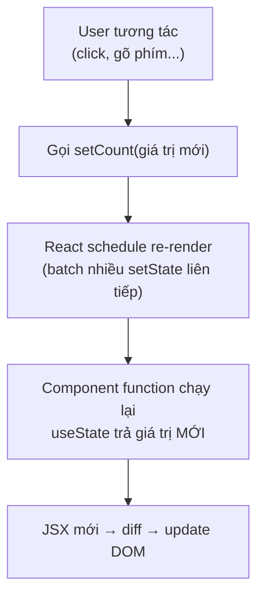
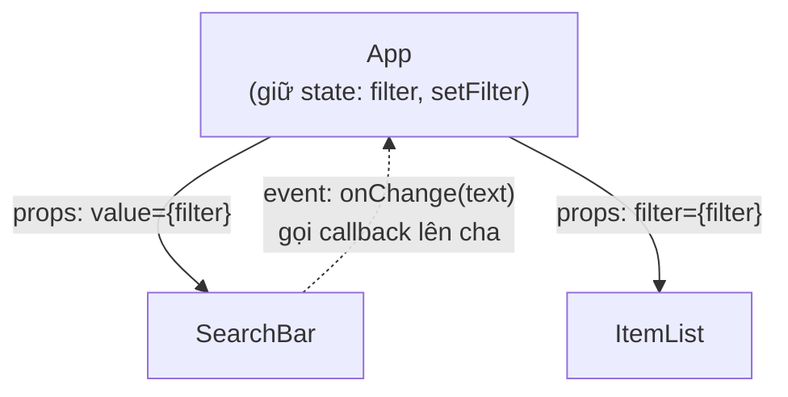

# Props vs State

**Props** (dữ liệu truyền từ component cha vào, không sửa được) và **state** (dữ liệu nội bộ của component, có thể thay đổi theo thời gian) là hai cách quản lý dữ liệu cốt lõi trong React. Hiểu rõ khi nào dùng props, khi nào dùng state giúp bạn tránh nhiều lỗi phổ biến khi mới học. Bài này so sánh hai khái niệm, cách cập nhật state đúng cách và kỹ thuật **lifting state up** (đưa state lên component cha để nhiều component cùng dùng chung).

[](pathname:///img/react/props-state.webp)

---

:::note[Ghi nhớ nhanh]

- ⭐ **Props từ cha truyền xuống và readonly; state là dữ liệu nội bộ đổi qua setter** — gọi setter làm React re-render component.
- ⭐ **Mô hình cốt lõi: UI = f(state)** — mô tả UI theo dữ liệu, React lo cập nhật DOM cho khớp.
- **Setter async + batched** — dùng updater `setX(prev => ...)` khi state mới phụ thuộc state cũ.
- **Không mutate object/array trong state** — luôn tạo bản mới bằng spread (`[...items, item]`, `{...user, name}`) vì React dùng shallow comparison.
- **Ưu tiên derive thay vì tạo state thừa** — giữ state nhỏ nhất; nhiều component share thì dùng lifting state up (state down qua props, event up qua callback).

:::

---

## Mục lục

- [Vì sao có props & state?](#vì-sao-có-props--state)
- [Tổng quan](#tổng-quan)
- [Props](#props)
- [State](#state)
- [Khi nào dùng state vs props?](#khi-nào-dùng-state-vs-props)
- [Lifting state up](#lifting-state-up)
- [Câu hỏi phỏng vấn](#câu-hỏi-phỏng-vấn)

---

## Vì sao có props & state?

**Vấn đề:**

```jsx
// UI cần (1) tái dùng component với nội dung khác nhau, và
// (2) "nhớ" dữ liệu đổi theo thời gian rồi tự cập nhật màn hình.

// Viết cứng nội dung → không tái dùng được
function Greeting() {
  return <p>Xin chào An</p>; // chỉ hợp với "An"
}

// Tự quản dữ liệu đổi + sửa DOM thủ công → rối, dễ lệch UI-dữ liệu
let count = 0;
function increment() {
  count = count + 1;
  document.querySelector("#count").textContent = count; // dễ quên, dễ sai
}
```

**Giải pháp:**

```jsx
// props — dữ liệu cha truyền xuống, chỉ đọc → tái dùng component
function Greeting({ name }) {
  return <p>Xin chào {name}</p>;
}
<Greeting name="An" />
<Greeting name="Bình" />

// state — dữ liệu nội bộ, đổi qua setState/useState → React tự re-render
function Counter() {
  const [count, setCount] = useState(0);
  return <button onClick={() => setCount(count + 1)}>{count}</button>;
}

// Mô hình cốt lõi: UI = f(state). Bạn mô tả UI theo dữ liệu,
// React lo việc cập nhật DOM cho khớp.
```

:::tip[Dùng thực tế]

- **Truyền dữ liệu xuống con**: cha đưa `user`, `items` qua props cho con hiển thị.
- **Ô input / counter**: giá trị gõ vào, số đếm — giữ trong state.
- **Toggle modal**: `isOpen` là state, đổi `true/false` để mở/đóng.
- **Danh sách lọc**: state giữ `filter`, danh sách hiển thị tính lại theo state.

:::

---

## Tổng quan

| | Props | State |
|--|-------|-------|
| Nguồn | Parent component | Bên trong component |
| Sửa được? | **Không** (readonly) | **Có** (qua setter) |
| Ai control? | Parent | Chính component |
| Trigger re-render? | Có (parent re-render) | Có (setState gọi) |

---

## Props

Props là **dữ liệu truyền vào component** từ parent.

```jsx
function Avatar({ src, alt, size = 40 }) {
  return (
    
  );
}

<Avatar src="/me.jpg" alt="An" size={60} />
```

Props **không sửa được** trong component nhận:

```jsx
function Avatar({ size }) {
  size = 100; // KHÔNG nên — mutation props
  return ;
}
```

Nếu cần biến đổi, tạo biến mới:

```jsx
function Avatar({ size }) {
  const finalSize = Math.min(size, 200);
  return ;
}
```

---

## State

State là **dữ liệu nội bộ** của component, **thay đổi qua thời gian**.

Dùng hook `useState`:

```jsx
import { useState } from "react";

function Counter() {
  const [count, setCount] = useState(0);

  return (
    <div>
      <p>Count: {count}</p>
      <button onClick={() => setCount(count + 1)}>+1</button>
    </div>
  );
}
```

`useState(initial)` trả về:

- Giá trị hiện tại.
- Setter function — gọi để update state.

Khi setter được gọi → React **schedule re-render** → component chạy lại
→ JSX mới render.



:::warning[Cần lưu ý]

**Setter là async + batched**. Đừng dựa vào state cũ sau khi gọi:

```jsx
function increment() {
  setCount(count + 1);
  console.log(count); // vẫn giá trị cũ, chưa cập nhật
}

// Multiple calls bị gộp
function tripleIncrement() {
  setCount(count + 1); // count = 0 → set 1
  setCount(count + 1); // count = 0 → set 1 (không phải 2!)
  setCount(count + 1); // count = 0 → set 1
}

// Đúng — dùng updater function
function tripleIncrement() {
  setCount(c => c + 1); // 0 → 1
  setCount(c => c + 1); // 1 → 2
  setCount(c => c + 1); // 2 → 3
}
```

Quy tắc: khi state **mới phụ thuộc state cũ**, **luôn dùng updater
function** `setX(prev => ...)`.

:::

State có thể là bất kỳ kiểu:

```jsx
const [name, setName] = useState("");           // string
const [count, setCount] = useState(0);          // number
const [items, setItems] = useState([]);         // array
const [user, setUser] = useState({ name: "" }); // object
const [isOpen, setOpen] = useState(false);      // boolean
```

:::info[Phân tích]

**Update object/array trong state — không bao giờ mutate:**

```jsx
// Sai — mutation, React không detect change
function addItem(item) {
  items.push(item);    // mutation
  setItems(items);     // tham chiếu cũ → React không re-render
}

// Đúng — tạo array mới
function addItem(item) {
  setItems([...items, item]);
  // Hoặc updater
  setItems(prev => [...prev, item]);
}

// Update object
function updateUser(name) {
  setUser({ ...user, name }); // spread + override
}

// Nested — phức tạp hơn
setUser(prev => ({
  ...prev,
  address: { ...prev.address, city: "HN" },
}));
```

Lý do React dùng **shallow comparison** để detect change. Mutation không
đổi reference → React nghĩ không có gì thay đổi → skip re-render.

Với state nested sâu, cân nhắc:

- **Immer** — viết "mutating" syntax nhưng tự tạo immutable update.
- **Zustand / Jotai** — state management ngoài component.
- **Flatten state** — tránh nested khi có thể.

:::

---

## Khi nào dùng state vs props?

Hỏi 3 câu:

**1. Có thay đổi qua thời gian không?**
   - Không → không cần state, dùng const thường hoặc derive từ props.

**2. Có được tính từ props hay state khác không?**
   - Có → derive trong render, không cần state.

**3. Có được truyền từ parent không?**
   - Có → đó là props, không phải state.

Ví dụ — anti-pattern thường gặp:

```jsx
// Sai — tạo state cho thứ derive được
function UserCard({ firstName, lastName }) {
  const [fullName, setFullName] = useState(`${firstName} ${lastName}`);
  // Bug: fullName không update khi prop đổi

  return <p>{fullName}</p>;
}

// Đúng — tính trong render
function UserCard({ firstName, lastName }) {
  const fullName = `${firstName} ${lastName}`;
  return <p>{fullName}</p>;
}
```

:::tip[Mẹo]

**Quy tắc xác định state:**

- Có khi state là **biến nhỏ nhất, đủ để render** UI.
- Mọi thứ khác **tính ra** từ state + props.

Vd: list items có filter. State chỉ cần:

```jsx
const [items, setItems] = useState([]);       // dữ liệu gốc
const [filter, setFilter] = useState("");     // text filter
// KHÔNG cần state riêng cho filteredItems
const filteredItems = items.filter(x =>       // tính ra
  x.name.includes(filter)
);
```

Càng ít state, app càng dễ maintain và ít bug.

:::

---

## Lifting state up

Khi 2+ component cần share state, **đặt state ở parent** chung:

```jsx
// Parent giữ state
function App() {
  const [filter, setFilter] = useState("");

  return (
    <>
      <SearchBar value={filter} onChange={setFilter} />
      <ItemList filter={filter} />
    </>
  );
}

// Child read qua prop
function SearchBar({ value, onChange }) {
  return <input value={value} onChange={e => onChange(e.target.value)} />;
}

function ItemList({ filter }) {
  // dùng filter
}
```

Pattern:

- **State down** — prop.
- **Event up** — callback.

Đây chính là luồng dữ liệu **một chiều** của React — dữ liệu đi xuống qua
props, sự kiện báo ngược lên qua callback:



:::info[Phân tích]

**Khi nào lifting state up trở nên cồng kềnh?**

Khi prop phải pass qua **nhiều cấp** (prop drilling):

```jsx
<App>
  <Layout>
    <Header>
      <Nav>
        <UserMenu user={user} /> {/* user đến từ App, qua 3 cấp */}
      </Nav>
    </Header>
  </Layout>
</App>
```

Giải pháp:

1. **Context API** — state global cho subtree (xem phần State Management).
2. **State management lib** — Zustand, Jotai cho state phức tạp hơn.
3. **URL state** — query string cho state cần shareable (filter, page).
4. **Server state** — TanStack Query cho data từ API.

Phân biệt rõ **client state** (UI) vs **server state** (data) là kỹ năng
quan trọng — chọn đúng tool tránh over-engineer.

:::

---

## Câu hỏi phỏng vấn

Những câu thường gặp về chủ đề này. Tự trả lời trước, rồi bấm **Xem đáp án** để đối chiếu.

**1. Phân biệt `props` và `state` theo bốn tiêu chí: nguồn dữ liệu, quyền sửa, ai điều khiển, và ảnh hưởng tới re-render.**

<details className="qa">
<summary>Xem đáp án</summary>

| Tiêu chí | Props | State |
|---|---|---|
| Nguồn dữ liệu | Từ component cha truyền xuống | Sinh ra và lưu bên trong chính component |
| Quyền sửa | **Readonly** — con không được gán lại | **Sửa được** nhưng chỉ qua setter (`setCount`) |
| Ai điều khiển | Component cha | Chính component đó |
| Re-render | Cha re-render với props mới thì con render lại | Gọi setter làm React schedule re-render component |

Cách nhớ: props giống **tham số của hàm** — bên ngoài đưa vào, hàm chỉ đọc; state giống **biến nhớ riêng** của component, tồn tại qua các lần render và đổi được theo thời gian.

Một dữ liệu là state ở component này hoàn toàn có thể trở thành props ở component con:

```jsx
function App() {
  const [filter, setFilter] = useState(""); // state của App
  return <ItemList filter={filter} />;      // props của ItemList
}
```

</details>

**2. Vì sao `props` là readonly? Điều gì xảy ra nếu gán trực tiếp `props.size = 100` bên trong component con?**

<details className="qa">
<summary>Xem đáp án</summary>

Vì React xây trên mô hình **luồng dữ liệu một chiều**: dữ liệu chỉ chảy từ cha xuống con. Nếu con sửa được props, cha sẽ không còn là nguồn sự thật duy nhất — UI và dữ liệu dễ lệch nhau, và việc truy vết "ai đã đổi giá trị này" trở nên rất khó. React yêu cầu component hành xử như **pure function**: cùng props thì cho cùng kết quả.

Gán `props.size = 100` thì: giá trị đó **không** làm React re-render (React không theo dõi việc gán này), lần render sau cha truyền xuống lại thì thay đổi của bạn biến mất, và ở Strict Mode / dev build React có thể cảnh báo do object props được đóng băng. Kết quả là một bug âm thầm, khó tìm.

Cách đúng: tạo biến mới, hoặc báo lên cha qua callback.

```jsx
function Avatar({ size }) {
  const finalSize = Math.min(size, 200); // biến mới, không đụng props
  return ;
}
```

</details>

**3. "Luồng dữ liệu một chiều" của React nghĩa là gì? Component con muốn báo thay đổi ngược lên cha thì làm thế nào?**

<details className="qa">
<summary>Xem đáp án</summary>

Nghĩa là dữ liệu chỉ đi theo **một hướng: từ trên xuống dưới** trong cây component. Cha giữ state, truyền xuống con bằng props; con chỉ đọc. Nhờ vậy mỗi mẩu dữ liệu có đúng **một nguồn sự thật**, và khi UI sai bạn chỉ cần lần ngược lên cây để tìm nơi state được giữ.

Con không sửa props được, nên muốn báo thay đổi lên cha thì cha phải **truyền xuống một callback**. Con gọi callback đó, cha tự cập nhật state của mình, rồi giá trị mới lại chảy xuống. Đây chính là cặp nguyên tắc **state down, event up**:

```jsx
function App() {
  const [filter, setFilter] = useState("");
  return <SearchBar value={filter} onChange={setFilter} />;
}

function SearchBar({ value, onChange }) {
  return <input value={value} onChange={(e) => onChange(e.target.value)} />;
}
```

Trái ngược với **two-way binding** của Angular/Vue (`v-model`), React chọn một chiều để đánh đổi lấy tính dự đoán được.

</details>

**4. `useState` trả về những gì? Vì sao React bắt buộc gọi hook ở top level, không được gọi trong `if` hay vòng lặp?**

<details className="qa">
<summary>Xem đáp án</summary>

`useState(initial)` trả về một **mảng hai phần tử**: giá trị state hiện tại và **hàm setter** để cập nhật nó. Ta thường destructure ngay:

```jsx
const [count, setCount] = useState(0);
```

React **không** lưu state theo tên biến — nó lưu theo **thứ tự gọi hook** trong mỗi component. Lần render đầu, React tạo một danh sách: hook thứ nhất giữ `count`, hook thứ hai giữ `name`... Ở các lần render sau, React duyệt lại danh sách theo đúng thứ tự đó để trả về đúng giá trị.

Vì vậy nếu đặt hook trong `if`, vòng lặp hay sau một `return` sớm, số lượng và thứ tự hook có thể khác nhau giữa các lần render — React sẽ trả nhầm state của hook này cho hook kia, sinh lỗi rất khó hiểu.

```jsx
if (isLoggedIn) {
  const [user, setUser] = useState(null); // 💥 sai
}
```

Quy tắc: luôn gọi hook ở **top level** của component; điều kiện đặt **bên trong** hook, không bọc ngoài hook.

</details>

**5. Vì sao setter của `useState` là bất đồng bộ? `console.log(count)` ngay sau `setCount(count + 1)` in ra giá trị nào?**

<details className="qa">
<summary>Xem đáp án</summary>

In ra **giá trị cũ** — nếu `count` đang là 0 thì in ra `0`.

Lý do: gọi setter **không** gán lại biến `count`. Nó chỉ **đặt lịch (schedule)** một lần render mới. Biến `count` trong lần render hiện tại là một hằng số thuộc closure của lần render đó — nó sẽ không bao giờ đổi giá trị. Chỉ khi component chạy lại, `useState` mới trả về giá trị mới.

React làm vậy để có thể **gộp nhiều lần cập nhật (batching)** trong cùng một sự kiện thành một lần render duy nhất, tránh render thừa và tránh UI nhấp nháy qua nhiều trạng thái trung gian.

```jsx
function increment() {
  setCount(count + 1);
  console.log(count); // 0 — vẫn là giá trị của render hiện tại
}
```

Muốn làm gì đó với giá trị mới, hãy tính ra biến riêng (`const next = count + 1`) hoặc xử lý trong `useEffect` phụ thuộc `count`.

</details>

**6. Dự đoán output: gọi `setCount(count + 1)` ba lần liên tiếp trong một event handler khi `count` đang là 0 — kết quả cuối cùng bằng bao nhiêu? Nếu đổi sang `setCount(c => c + 1)` thì sao?**

<details className="qa">
<summary>Xem đáp án</summary>

Kết quả lần lượt là **1** và **3**.

```jsx
// count đang là 0
setCount(count + 1); // count là 0 → yêu cầu set thành 1
setCount(count + 1); // count VẪN là 0 → set thành 1
setCount(count + 1); // count VẪN là 0 → set thành 1
// → kết quả cuối: 1
```

Vì `count` là hằng số của render hiện tại, cả ba lời gọi đều đọc cùng giá trị 0 và cùng yêu cầu "hãy đặt state thành 1". React gộp lại, kết quả là 1.

```jsx
setCount((c) => c + 1); // 0 → 1
setCount((c) => c + 1); // 1 → 2
setCount((c) => c + 1); // 2 → 3
// → kết quả cuối: 3
```

Dạng **updater function** khác ở chỗ React xếp các hàm này vào hàng đợi rồi chạy lần lượt, hàm sau nhận kết quả của hàm trước — không phụ thuộc biến trong closure.

Quy tắc: state mới phụ thuộc state cũ thì **luôn dùng `setX(prev => ...)`**.

</details>

**7. `batching` là gì? React 18 khác các bản trước thế nào khi gọi nhiều setter trong `setTimeout` hoặc trong promise?**

<details className="qa">
<summary>Xem đáp án</summary>

**Batching** là việc React gom nhiều lần gọi setter xảy ra gần nhau thành **một lần re-render duy nhất**, thay vì render lại sau mỗi setter. Mục đích: giảm số lần render, tránh UI nhấp nháy qua các trạng thái trung gian.

| | Trước React 18 | Từ React 18 |
|---|---|---|
| Trong event handler của React | Có batching | Có batching |
| Trong `setTimeout`, promise, `fetch().then` | **Không** batching — mỗi setter một lần render | Có batching |
| Trong native event listener | Không batching | Có batching |

React 18 gọi đây là **automatic batching** — bật mặc định khi dùng `createRoot`.

```jsx
setTimeout(() => {
  setCount((c) => c + 1);
  setFlag((f) => !f);
  // React 17: render 2 lần — React 18: render 1 lần
}, 0);
```

Nếu thật sự cần render ngay lập tức sau một setter (hiếm), React cung cấp `flushSync` từ `react-dom` để thoát khỏi batching.

</details>

**8. Vì sao không được `items.push(item)` rồi `setItems(items)`? React so sánh state cũ và mới bằng cơ chế nào?**

<details className="qa">
<summary>Xem đáp án</summary>

Vì `push` **mutate** mảng tại chỗ — nội dung đổi nhưng **tham chiếu vẫn là mảng cũ**. React so sánh state cũ và mới bằng **so sánh nông (shallow comparison)** với `Object.is`, tức chỉ nhìn tham chiếu chứ không duyệt sâu vào bên trong. Thấy cùng một tham chiếu, React kết luận "không có gì đổi" và **bỏ qua re-render** — dữ liệu đã thay đổi nhưng màn hình đứng yên.

```jsx
// Sai — mutate, React không nhận ra thay đổi
items.push(item);
setItems(items);

// Đúng — tạo mảng mới, tham chiếu mới
setItems([...items, item]);
setItems((prev) => [...prev, item]); // an toàn hơn

// Object cũng vậy
setUser((prev) => ({ ...prev, name }));
```

So sánh nông là lựa chọn có chủ đích: kiểm tra một tham chiếu chỉ tốn O(1), trong khi so sánh sâu mọi state sau mỗi lần cập nhật sẽ rất đắt. Đổi lại, lập trình viên phải tuân thủ nguyên tắc **bất biến (immutability)**. Nguyên tắc này cũng là nền tảng cho `React.memo`, `useMemo`, `useEffect` so sánh dependency.

</details>

**9. Cập nhật một object lồng nhiều tầng trong state thế nào cho đúng? Khi nào nên cân nhắc `Immer` hoặc flatten state?**

<details className="qa">
<summary>Xem đáp án</summary>

Phải **tạo bản sao mới cho mọi tầng nằm trên đường đi** tới field cần đổi — spread từng cấp một:

```jsx
setUser((prev) => ({
  ...prev,
  address: {
    ...prev.address,
    city: "HN",
  },
}));
```

Lý do: React chỉ so sánh tham chiếu ở tầng ngoài cùng, nên nếu bạn chỉ sửa `prev.address.city` mà giữ nguyên object `user`, React sẽ không thấy thay đổi. Ngoài ra, các component con đang nhận `address` làm prop cũng cần một tham chiếu mới để `React.memo` hoạt động đúng.

Khi nào cần giải pháp khác:

- **Immer** (hoặc `useImmer`): khi state lồng từ ba tầng trở lên, chuỗi spread trở nên dài và dễ sót. Immer cho viết cú pháp "mutate" trên bản nháp rồi tự sinh ra object bất biến.
- **Flatten state**: khi dữ liệu là danh sách có quan hệ, hãy chuẩn hoá về dạng phẳng (map theo `id`) thay vì lồng sâu — cập nhật và tra cứu đều nhanh hơn.
- **Tách state**: state không liên quan nhau thì nên là các `useState` riêng.

</details>

**10. Khi nào một dữ liệu nên là state, khi nào nên derive (tính ra) ngay trong lúc render? Nêu tiêu chí quyết định.**

<details className="qa">
<summary>Xem đáp án</summary>

Nguyên tắc: **giữ state nhỏ nhất có thể**, mọi thứ suy ra được thì tính lại trong render. Ba câu hỏi để quyết định:

1. **Có thay đổi theo thời gian không?** Không đổi thì dùng hằng số thường, không cần state.
2. **Có tính được từ props hoặc state khác không?** Có thì **derive**, đừng tạo state.
3. **Có được truyền từ cha xuống không?** Có thì đó là props.

Chỉ những gì còn lại — dữ liệu thay đổi theo thời gian, không suy ra được từ đâu khác — mới xứng đáng là state.

```jsx
const [items, setItems] = useState([]);
const [filter, setFilter] = useState("");

// KHÔNG tạo state cho filteredItems — tính ra là đủ
const filteredItems = items.filter((x) => x.name.includes(filter));
```

Vì sao quan trọng: mỗi state thừa là một nguồn sự thật thứ hai, và bạn phải tự tay đồng bộ nó — quên một nhánh là UI lệch ngay. Nếu phép tính thật sự nặng, bọc bằng `useMemo` chứ vẫn không nên biến nó thành state.

</details>

**11. Vì sao khởi tạo state từ props kiểu `useState(props.value)` thường là anti-pattern? Trường hợp nào chấp nhận được và xử lý ra sao khi prop đổi?**

<details className="qa">
<summary>Xem đáp án</summary>

Vì giá trị khởi tạo chỉ được dùng ở **lần render đầu tiên**. Những lần sau React bỏ qua nó hoàn toàn, nên khi cha truyền xuống prop mới, state bên trong vẫn giữ giá trị cũ — UI hiển thị dữ liệu lỗi thời. Đây là bug kinh điển:

```jsx
function UserCard({ firstName, lastName }) {
  const [fullName] = useState(`${firstName} ${lastName}`);
  return <p>{fullName}</p>; // không đổi khi prop đổi
}
```

Nếu giá trị **suy ra được** từ props, hãy tính thẳng trong render, đừng tạo state.

Trường hợp chấp nhận được: khi prop chỉ đóng vai trò **giá trị khởi tạo** rồi sau đó component tự quản — ví dụ ô input có `defaultValue`, form edit khởi tạo từ dữ liệu server. Quy ước là đặt tên prop có tiền tố `initial` hoặc `default` để nói rõ ý định.

Khi cần reset state lúc prop đổi, cách sạch nhất là **đổi `key`** của component để React tạo instance mới:

```jsx
<EditForm key={user.id} initialName={user.name} />
```

</details>

**12. Phân biệt `useState(computeExpensive())` và `useState(() => computeExpensive())` — lazy initialization giải quyết vấn đề gì?**

<details className="qa">
<summary>Xem đáp án</summary>

| | `useState(computeExpensive())` | `useState(() => computeExpensive())` |
|---|---|---|
| Khi nào hàm chạy | **Mọi lần render** | Chỉ **lần render đầu tiên** |
| React dùng kết quả | Chỉ lần đầu, các lần sau vứt đi | Lần đầu |

Ở dạng thứ nhất, bạn **gọi hàm ngay** rồi truyền kết quả vào `useState`. JavaScript phải thực thi nó trước, ở mọi lần render — dù từ lần thứ hai trở đi React đã có state và ném kết quả đi. Với phép tính nặng (đọc `localStorage`, parse JSON lớn, tạo mảng nghìn phần tử), đây là lãng phí thấy rõ.

Ở dạng thứ hai, bạn truyền **chính hàm** đó vào. React chỉ gọi nó đúng một lần, lúc khởi tạo state — gọi là **lazy initialization**.

```jsx
// Chạy mỗi lần render — lãng phí
const [data, setData] = useState(JSON.parse(localStorage.getItem("todos")));

// Chỉ chạy lần đầu
const [data, setData] = useState(() => JSON.parse(localStorage.getItem("todos")));
```

Lưu ý: nếu state là **một hàm**, bắt buộc dùng dạng `useState(() => myFn)`, nếu không React sẽ hiểu nhầm là initializer.

</details>

**13. Nếu gọi setter với đúng giá trị đang có, React có re-render không? Cơ chế `bail out` hoạt động thế nào?**

<details className="qa">
<summary>Xem đáp án</summary>

Về nguyên tắc là **không**. React so sánh giá trị mới với giá trị hiện tại bằng `Object.is`; nếu bằng nhau, nó **bail out** — bỏ qua việc cập nhật state và không render lại cây con.

```jsx
const [count, setCount] = useState(0);
setCount(0); // giá trị không đổi → bail out
```

Hai lưu ý quan trọng:

- So sánh là **theo tham chiếu** với object/array. `setUser({ ...user })` tạo object mới nên `Object.is` trả về `false` — React vẫn render lại dù nội dung y hệt.
- React có thể vẫn **chạy lại component thêm một lần** trước khi nhận ra không cần cập nhật, rồi mới dừng và không đụng tới DOM hay các component con. Vì vậy đừng đặt side effect ngay trong thân component và cho rằng nó chắc chắn không chạy.

Cơ chế này lý giải vì sao tính bất biến lại quan trọng cả hai chiều: mutate thì React bỏ sót thay đổi, còn tạo object mới vô tội vạ thì React render thừa.

</details>

**14. `lifting state up` là gì? Nguyên tắc chọn nơi đặt state khi hai component anh em cùng cần dữ liệu đó?**

<details className="qa">
<summary>Xem đáp án</summary>

**Lifting state up** là kỹ thuật **chuyển state lên component cha chung** khi từ hai component trở lên cần cùng một dữ liệu. Vì dữ liệu chỉ chảy xuống, hai component anh em không thể nói chuyện trực tiếp — chúng phải chia sẻ qua tổ tiên chung.

Nguyên tắc chọn chỗ đặt: tìm **tổ tiên chung gần nhất** của tất cả component cần dữ liệu đó, và đặt state ở đúng đó — không cao hơn. Đặt quá cao thì mọi thứ dưới nó render lại vô ích và sinh prop drilling.

```jsx
function App() {
  const [filter, setFilter] = useState(""); // tổ tiên chung của cả hai

  return (
    <>
      <SearchBar value={filter} onChange={setFilter} />
      <ItemList filter={filter} />
    </>
  );
}
```

Mô hình quen thuộc: **state down** qua props, **event up** qua callback. Component con trở thành controlled — nó chỉ hiển thị và báo sự kiện, còn nguồn sự thật duy nhất nằm ở cha.

</details>

**15. `prop drilling` là gì? Liệt kê các hướng xử lý (Context, thư viện state, URL state, server state) và đánh đổi của từng hướng.**

<details className="qa">
<summary>Xem đáp án</summary>

**Prop drilling** là tình trạng phải truyền một prop qua nhiều tầng component trung gian chỉ để tới được component thật sự cần nó — các tầng ở giữa "khuân hộ" mà chẳng dùng đến.

```jsx
<Layout>
  <Header>
    <Nav>
      <UserMenu user={user} /> {/* user đi từ App xuống, qua 3 cấp */}
    </Nav>
  </Header>
</Layout>
```

Các hướng xử lý và đánh đổi:

- **Context API** — chia sẻ giá trị cho cả một nhánh cây, không cần truyền tay. Đổi lại: mọi consumer re-render khi giá trị đổi, nên hợp với dữ liệu ít thay đổi (theme, locale, user đăng nhập) hơn là state đổi liên tục.
- **Thư viện state (Zustand, Jotai, Redux)** — có subscribe chọn lọc nên tối ưu re-render, devtools tốt. Đổi lại: thêm dependency và khái niệm mới.
- **URL state (query string)** — hợp với filter, phân trang, tab: chia sẻ link được, back/forward hoạt động đúng. Đổi lại: chỉ chứa được dữ liệu dạng chuỗi, đơn giản.
- **Server state (TanStack Query)** — lo cache, refetch, trạng thái loading/error cho dữ liệu từ API, khỏi nhét vào state toàn cục.

Đôi khi cách rẻ nhất là bố trí lại component hoặc dùng `children` để khỏi khoan qua nhiều tầng.

</details>

**16. Phân biệt controlled component và uncontrolled component. Vì sao React khuyến nghị controlled cho form, và khi nào uncontrolled lại hợp lý hơn?**

<details className="qa">
<summary>Xem đáp án</summary>

| | Controlled | Uncontrolled |
|---|---|---|
| Nguồn sự thật | State của React | DOM tự giữ giá trị |
| Cú pháp | `value` + `onChange` | `defaultValue` + `ref` |
| Đọc giá trị | Đọc state bất cứ lúc nào | Đọc qua `ref.current.value` khi cần |

```jsx
// Controlled
const [name, setName] = useState("");
<input value={name} onChange={(e) => setName(e.target.value)} />;

// Uncontrolled
const ref = useRef(null);
<input defaultValue="" ref={ref} />;
```

React khuyến nghị **controlled** vì giá trị nằm trong state nên bạn làm được mọi thứ ngay khi người dùng gõ: validate tức thời, format (viết hoa, thêm dấu phân cách), bật/tắt nút submit, đồng bộ nhiều field với nhau. UI luôn khớp dữ liệu, đúng tinh thần `UI = f(state)`.

**Uncontrolled** hợp lý khi: form đơn giản chỉ cần đọc lúc submit, `input type="file"` (bắt buộc uncontrolled), tích hợp thư viện bên thứ ba thao tác DOM trực tiếp, hoặc form rất lớn mà việc render lại mỗi ký tự gây chậm — đây cũng là lý do React Hook Form chọn hướng uncontrolled.

</details>

**17. Prop `key` có phải một prop bình thường không? Đổi `key` của một component gây ra chuyện gì với state bên trong nó?**

<details className="qa">
<summary>Xem đáp án</summary>

**Không.** `key` là một prop **dành riêng** cho React, giống `ref`. Nó không nằm trong object props mà component nhận được — đọc `props.key` bên trong component sẽ ra `undefined` (và React cảnh báo). `key` chỉ dành cho React dùng trong quá trình reconciliation để nhận diện "đây có phải cùng một component với lần render trước không".

Khi `key` đổi, React coi đó là **một component hoàn toàn khác**: nó **unmount** instance cũ (huỷ toàn bộ state, chạy cleanup của effect) và **mount** một instance mới với state khởi tạo lại từ đầu.

```jsx
// Đổi user → key đổi → form được tạo mới, state bên trong reset sạch
<EditForm key={user.id} initialName={user.name} />
```

Đây vừa là cái bẫy (dùng `Math.random()` làm key khiến component mount lại liên tục, mất state và mất focus), vừa là một kỹ thuật hữu ích — cách gọn gàng nhất để **reset state** một cây component mà không cần `useEffect` đồng bộ thủ công.

</details>

**18. Phân biệt `client state` và `server state` — vì sao nên dùng công cụ khác nhau cho hai loại này?**

<details className="qa">
<summary>Xem đáp án</summary>

| | Client state | Server state |
|---|---|---|
| Ví dụ | Modal đang mở, tab đang chọn, nội dung form, theme | Danh sách sản phẩm, thông tin user, đơn hàng |
| Chủ sở hữu | Chỉ trình duyệt này biết | Server — client chỉ giữ **bản sao** |
| Tính đồng bộ | Luôn chính xác, đồng bộ | Có thể **cũ** bất cứ lúc nào (người khác vừa sửa) |
| Vòng đời | Mất khi reload | Tồn tại độc lập với phiên làm việc |
| Thao tác | Gán giá trị là xong | Bất đồng bộ: loading, error, retry, refetch, cache |

Vì bản chất khác nhau nên công cụ cũng khác. `useState`/Context/Zustand được thiết kế cho dữ liệu **bạn sở hữu** — chỉ là nơi cất giá trị. Còn server state cần cả một bộ máy: cache theo key, khử trùng lặp request, đánh dấu dữ liệu cũ (stale), refetch khi quay lại tab, retry khi lỗi, cập nhật lạc quan. Tự viết những thứ này bằng `useState` + `useEffect` là tái phát minh một thư viện cache, và thường thiếu sót.

Vì vậy thực tế hay dùng TanStack Query (hoặc SWR, RTK Query) cho server state, và để client state ở `useState`/Context — app gọn hơn rất nhiều.

</details>
