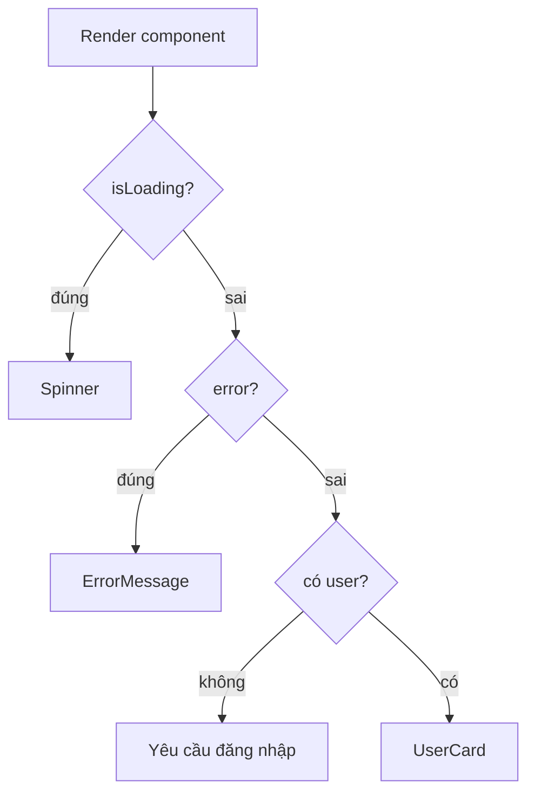

# Conditional Rendering

**Conditional rendering** (hiển thị giao diện có điều kiện) là việc quyết định hiển thị nội dung nào tùy theo trạng thái dữ liệu, ví dụ hiện vòng quay tải khi đang chờ hoặc hiện nội dung khi đã có dữ liệu. React không có cú pháp riêng cho việc này mà tận dụng chính JavaScript, như toán tử ba ngôi (`? :`), toán tử `&&` hay câu lệnh `return` sớm. Bài này giới thiệu các cách viết conditional rendering thông dụng cùng những lỗi thường gặp cần tránh.

---

:::note[Ghi nhớ nhanh]

- ⭐ **React không có template riêng — dùng chính JavaScript** để render có điều kiện: ternary `? :`, `&&`, early return, lookup object.
- **Cẩn thận `&&` với số 0** — `{items.length && ...}` sẽ render ra `0`; convert boolean (`items.length > 0 &&`) để tránh.
- **Early return / guard clauses** — loại case không hợp lệ trước, để happy path ở cuối, tránh lồng ternary sâu.
- **Nhiều nhánh dùng `switch` hoặc lookup object** — switch + TypeScript cho exhaustive check qua discriminated union.
- ⭐ **Không setState trong render** — gây vòng lặp vô hạn; render phải là pure function của props + state.

:::

---

## Mục lục

- [Vì sao cần conditional rendering?](#vì-sao-cần-conditional-rendering)
- [Tổng quan](#tổng-quan)
- [Ternary operator](#ternary-operator)
- [Logical && operator](#logical--operator)
- [Early return](#early-return)
- [Switch / lookup object](#switch--lookup-object)

---

## Vì sao cần conditional rendering?

**Vấn đề:** UI thực tế phải **hiển thị khác nhau** theo trạng thái — đang loading, có lỗi, có dữ liệu, hay chưa đăng nhập. Nếu cứ ẩn/hiện DOM thủ công, code sẽ rối và dễ lệch với state.

```jsx
// Ẩn/hiện DOM thủ công — rối, dễ quên đồng bộ với state
function ProfileWrong({ user, isLoading, error }) {
  const spinner = document.getElementById("spinner");
  const content = document.getElementById("content");

  if (isLoading) spinner.style.display = "block";
  else spinner.style.display = "none"; // quên dòng này → spinner kẹt mãi

  if (error) content.style.display = "none";
  // ...càng nhiều state càng nhiều lệnh ẩn/hiện chồng chéo
}
```

**Giải pháp:** Render có điều kiện ngay trong JSX bằng `? :`, `&&`, biến trả về JSX khác nhau, hoặc early return. UI tự khớp với state — không cần tay đụng vào DOM.

```jsx
function Profile({ user, isLoading, error }) {
  if (isLoading) return <Spinner />;
  if (error) return <ErrorMessage error={error} />;
  if (!user) return <p>Vui lòng đăng nhập</p>;

  return <UserCard user={user} />; // UI luôn đúng theo state
}
```

Luồng rẽ nhánh khi render theo từng trạng thái dữ liệu:



:::tip[Dùng thực tế]

- Hiện **spinner** khi đang tải dữ liệu, ẩn đi khi xong.
- Hiện **thông báo lỗi** khi gọi API thất bại.
- **Ẩn nút** (Sửa/Xóa) khi người dùng không đủ quyền.
- Hiện **empty state** ("Chưa có mục nào") khi danh sách rỗng.

:::

---

## Tổng quan

React không có template syntax đặc biệt — dùng **JavaScript** để
conditional render.

```jsx
function Greeting({ user }) {
  if (!user) {
    return <p>Vui lòng đăng nhập</p>;
  }
  return <p>Xin chào {user.name}</p>;
}
```

---

## Ternary operator

Trong JSX, dùng ternary cho conditional inline:

```jsx
function Status({ isOnline }) {
  return (
    <div>
      {isOnline ? <span className="green">●</span> : <span className="gray">●</span>}
    </div>
  );
}

// Hoặc render nội dung khác
return (
  <div>
    {isLoading ? <Spinner /> : <Content data={data} />}
  </div>
);
```

Lồng — đọc khó, hạn chế:

```jsx
{status === "loading" ? <Loading />
  : status === "error" ? <Error />
  : status === "success" ? <Content />
  : null}
```

→ Khi có 3+ nhánh, dùng `switch` hoặc lookup object.

---

## Logical && operator

Render khi điều kiện đúng (không có nhánh else):

```jsx
function Notification({ unread }) {
  return (
    <div>
      Inbox
      {unread > 0 && <span className="badge">{unread}</span>}
    </div>
  );
}
```

:::warning[Cần lưu ý]

**`&&` với số 0 sẽ render 0**:

```jsx
const items = [];

return (
  <div>
    {items.length && <List items={items} />}
  </div>
);
// Khi items.length = 0 → render số 0 trên màn hình!
```

Lý do: `0` là falsy nhưng vẫn là **giá trị hợp lệ** để render. React
render `0` thành text.

Fix:

```jsx
// 1. Convert sang boolean
{items.length > 0 && <List />}
{Boolean(items.length) && <List />}
{!!items.length && <List />}

// 2. Dùng ternary với null
{items.length > 0 ? <List /> : null}
```

Tương tự với `""`, `NaN`. Đáng ngạc nhiên: `null`, `undefined`, `false`,
`true` không render.

:::

---

## Early return

Khi component có **nhiều case "không render gì"**, dùng early return cho rõ:

```jsx
function UserProfile({ user, isLoading, error }) {
  if (isLoading) return <Spinner />;
  if (error) return <ErrorMessage error={error} />;
  if (!user) return null;

  // Happy path — đỡ lồng if
  return (
    <div>
      <Avatar src={user.avatar} />
      <h1>{user.name}</h1>
      <p>{user.bio}</p>
    </div>
  );
}
```

So với lồng ternary — dễ đọc hơn nhiều:

```jsx
// Tệ — pyramid
return isLoading
  ? <Spinner />
  : error
    ? <ErrorMessage error={error} />
    : !user
      ? null
      : <div>...</div>;
```

:::tip[Mẹo]

**Pattern "guard clauses"** áp dụng cho React component:

1. Loại bỏ case không hợp lệ **trước**.
2. Trả về sớm — không lồng.
3. **Happy path** ở cuối, không indent sâu.

Quy tắc: nếu indent > 3 cấp, refactor sang early return.

:::

---

## Switch / lookup object

Khi có nhiều branch, dùng **lookup object** thay switch:

```jsx
function StatusBadge({ status }) {
  const styles = {
    pending: "bg-yellow-500",
    active: "bg-green-500",
    done: "bg-blue-500",
    failed: "bg-red-500",
  };

  return (
    <span className={`badge ${styles[status]}`}>
      {status}
    </span>
  );
}
```

Lookup component:

```jsx
function Page({ route }) {
  const pages = {
    home: <HomePage />,
    about: <AboutPage />,
    contact: <ContactPage />,
  };

  return pages[route] ?? <NotFound />;
}
```

:::info[Phân tích]

**Lookup object vs switch — khi nào dùng cái nào?**

| Tình huống | Dùng |
|-----------|------|
| Map giá trị → giá trị tĩnh | Lookup object |
| Map giá trị → component | Lookup object |
| Logic phức tạp, fall-through | Switch |
| Cần exhaustive type check | Switch (với TypeScript) |

Với TypeScript, switch tận dụng **discriminated union** + exhaustive
check:

```tsx
type Status = "pending" | "active" | "done" | "failed";

function badge(s: Status): string {
  switch (s) {
    case "pending": return "yellow";
    case "active":  return "green";
    case "done":    return "blue";
    case "failed":  return "red";
    default:
      const _exhaustive: never = s; // ép check hết case
      throw new Error("Unhandled");
  }
}
```

Thêm `Status` mới → TS báo lỗi tại `_exhaustive` → buộc xử lý. Lookup
object không có cơ chế này.

:::

:::tip[Mẹo]

**Anti-pattern — set state trong render** để conditional:

```jsx
// SAI — infinite loop
function Component({ data }) {
  if (data.length === 0) {
    setHasData(false); // → re-render → check lại → re-render...
  }
  return <div />;
}

// ĐÚNG — dùng useEffect hoặc tính trong render
function Component({ data }) {
  const hasData = data.length > 0; // derive, không cần state
  return <div>{hasData ? <List /> : <Empty />}</div>;
}
```

Quy tắc vàng: **render phải là pure function của props + state**. Không
side effect trong render.

:::
