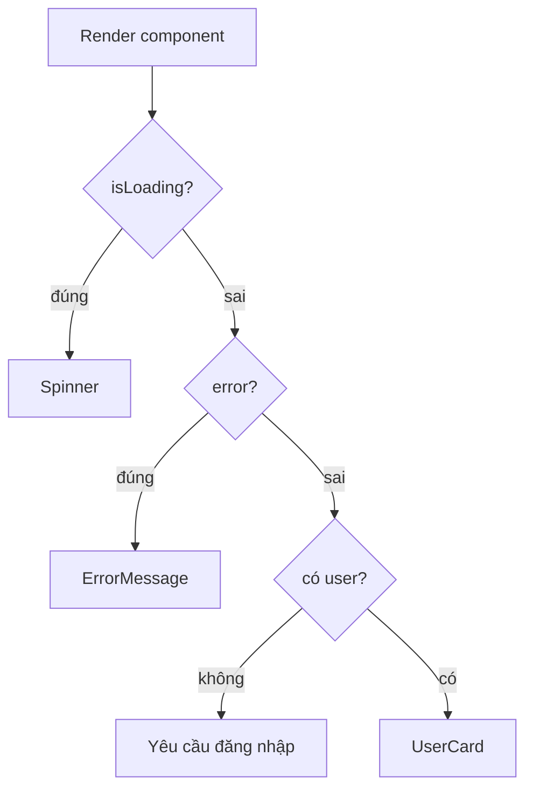

# Conditional Rendering

**Conditional rendering** (hiển thị giao diện có điều kiện) là việc quyết định hiển thị nội dung nào tùy theo trạng thái dữ liệu, ví dụ hiện vòng quay tải khi đang chờ hoặc hiện nội dung khi đã có dữ liệu. React không có cú pháp riêng cho việc này mà tận dụng chính JavaScript, như toán tử ba ngôi (`? :`), toán tử `&&` hay câu lệnh `return` sớm. Bài này giới thiệu các cách viết conditional rendering thông dụng cùng những lỗi thường gặp cần tránh.

[](pathname:///img/react/conditional-rendering.webp)

---

:::note[Ghi nhớ nhanh]

- ⭐ **React không có template riêng — dùng chính JavaScript** để render có điều kiện: ternary `? :`, `&&`, early return, lookup object.
- **Cẩn thận `&&` với số 0** — `{items.length && ...}` sẽ render ra `0`; convert boolean (`items.length > 0 &&`) để tránh.
- **Early return / guard clauses** — loại case không hợp lệ trước, để happy path ở cuối, tránh lồng ternary sâu.
- **Nhiều nhánh dùng `switch` hoặc lookup object** — switch + TypeScript cho exhaustive check qua discriminated union.
- ⭐ **Không setState trong render** — gây vòng lặp vô hạn; render phải là pure function của props + state.

:::

---

## Mục lục

- [Vì sao cần conditional rendering?](#vì-sao-cần-conditional-rendering)
- [Tổng quan](#tổng-quan)
- [Ternary operator](#ternary-operator)
- [Logical && operator](#logical--operator)
- [Early return](#early-return)
- [Switch / lookup object](#switch--lookup-object)
- [Câu hỏi phỏng vấn](#câu-hỏi-phỏng-vấn)

---

## Vì sao cần conditional rendering?

**Vấn đề:** UI thực tế phải **hiển thị khác nhau** theo trạng thái — đang loading, có lỗi, có dữ liệu, hay chưa đăng nhập. Nếu cứ ẩn/hiện DOM thủ công, code sẽ rối và dễ lệch với state.

```jsx
// Ẩn/hiện DOM thủ công — rối, dễ quên đồng bộ với state
function ProfileWrong({ user, isLoading, error }) {
  const spinner = document.getElementById("spinner");
  const content = document.getElementById("content");

  if (isLoading) spinner.style.display = "block";
  else spinner.style.display = "none"; // quên dòng này → spinner kẹt mãi

  if (error) content.style.display = "none";
  // ...càng nhiều state càng nhiều lệnh ẩn/hiện chồng chéo
}
```

**Giải pháp:** Render có điều kiện ngay trong JSX bằng `? :`, `&&`, biến trả về JSX khác nhau, hoặc early return. UI tự khớp với state — không cần tay đụng vào DOM.

```jsx
function Profile({ user, isLoading, error }) {
  if (isLoading) return <Spinner />;
  if (error) return <ErrorMessage error={error} />;
  if (!user) return <p>Vui lòng đăng nhập</p>;

  return <UserCard user={user} />; // UI luôn đúng theo state
}
```

Luồng rẽ nhánh khi render theo từng trạng thái dữ liệu:



:::tip[Dùng thực tế]

- Hiện **spinner** khi đang tải dữ liệu, ẩn đi khi xong.
- Hiện **thông báo lỗi** khi gọi API thất bại.
- **Ẩn nút** (Sửa/Xóa) khi người dùng không đủ quyền.
- Hiện **empty state** ("Chưa có mục nào") khi danh sách rỗng.

:::

---

## Tổng quan

React không có template syntax đặc biệt — dùng **JavaScript** để
conditional render.

```jsx
function Greeting({ user }) {
  if (!user) {
    return <p>Vui lòng đăng nhập</p>;
  }
  return <p>Xin chào {user.name}</p>;
}
```

---

## Ternary operator

Trong JSX, dùng ternary cho conditional inline:

```jsx
function Status({ isOnline }) {
  return (
    <div>
      {isOnline ? <span className="green">●</span> : <span className="gray">●</span>}
    </div>
  );
}

// Hoặc render nội dung khác
return (
  <div>
    {isLoading ? <Spinner /> : <Content data={data} />}
  </div>
);
```

Lồng — đọc khó, hạn chế:

```jsx
{status === "loading" ? <Loading />
  : status === "error" ? <Error />
  : status === "success" ? <Content />
  : null}
```

→ Khi có 3+ nhánh, dùng `switch` hoặc lookup object.

---

## Logical && operator

Render khi điều kiện đúng (không có nhánh else):

```jsx
function Notification({ unread }) {
  return (
    <div>
      Inbox
      {unread > 0 && <span className="badge">{unread}</span>}
    </div>
  );
}
```

:::warning[Cần lưu ý]

**`&&` với số 0 sẽ render 0**:

```jsx
const items = [];

return (
  <div>
    {items.length && <List items={items} />}
  </div>
);
// Khi items.length = 0 → render số 0 trên màn hình!
```

Lý do: `0` là falsy nhưng vẫn là **giá trị hợp lệ** để render. React
render `0` thành text.

Fix:

```jsx
// 1. Convert sang boolean
{items.length > 0 && <List />}
{Boolean(items.length) && <List />}
{!!items.length && <List />}

// 2. Dùng ternary với null
{items.length > 0 ? <List /> : null}
```

Tương tự với `""`, `NaN`. Đáng ngạc nhiên: `null`, `undefined`, `false`,
`true` không render.

:::

---

## Early return

Khi component có **nhiều case "không render gì"**, dùng early return cho rõ:

```jsx
function UserProfile({ user, isLoading, error }) {
  if (isLoading) return <Spinner />;
  if (error) return <ErrorMessage error={error} />;
  if (!user) return null;

  // Happy path — đỡ lồng if
  return (
    <div>
      <Avatar src={user.avatar} />
      <h1>{user.name}</h1>
      <p>{user.bio}</p>
    </div>
  );
}
```

So với lồng ternary — dễ đọc hơn nhiều:

```jsx
// Tệ — pyramid
return isLoading
  ? <Spinner />
  : error
    ? <ErrorMessage error={error} />
    : !user
      ? null
      : <div>...</div>;
```

:::tip[Mẹo]

**Pattern "guard clauses"** áp dụng cho React component:

1. Loại bỏ case không hợp lệ **trước**.
2. Trả về sớm — không lồng.
3. **Happy path** ở cuối, không indent sâu.

Quy tắc: nếu indent > 3 cấp, refactor sang early return.

:::

---

## Switch / lookup object

Khi có nhiều branch, dùng **lookup object** thay switch:

```jsx
function StatusBadge({ status }) {
  const styles = {
    pending: "bg-yellow-500",
    active: "bg-green-500",
    done: "bg-blue-500",
    failed: "bg-red-500",
  };

  return (
    <span className={`badge ${styles[status]}`}>
      {status}
    </span>
  );
}
```

Lookup component:

```jsx
function Page({ route }) {
  const pages = {
    home: <HomePage />,
    about: <AboutPage />,
    contact: <ContactPage />,
  };

  return pages[route] ?? <NotFound />;
}
```

:::info[Phân tích]

**Lookup object vs switch — khi nào dùng cái nào?**

| Tình huống | Dùng |
|-----------|------|
| Map giá trị → giá trị tĩnh | Lookup object |
| Map giá trị → component | Lookup object |
| Logic phức tạp, fall-through | Switch |
| Cần exhaustive type check | Switch (với TypeScript) |

Với TypeScript, switch tận dụng **discriminated union** + exhaustive
check:

```tsx
type Status = "pending" | "active" | "done" | "failed";

function badge(s: Status): string {
  switch (s) {
    case "pending": return "yellow";
    case "active":  return "green";
    case "done":    return "blue";
    case "failed":  return "red";
    default:
      const _exhaustive: never = s; // ép check hết case
      throw new Error("Unhandled");
  }
}
```

Thêm `Status` mới → TS báo lỗi tại `_exhaustive` → buộc xử lý. Lookup
object không có cơ chế này.

:::

:::tip[Mẹo]

**Anti-pattern — set state trong render** để conditional:

```jsx
// SAI — infinite loop
function Component({ data }) {
  if (data.length === 0) {
    setHasData(false); // → re-render → check lại → re-render...
  }
  return <div />;
}

// ĐÚNG — dùng useEffect hoặc tính trong render
function Component({ data }) {
  const hasData = data.length > 0; // derive, không cần state
  return <div>{hasData ? <List /> : <Empty />}</div>;
}
```

Quy tắc vàng: **render phải là pure function của props + state**. Không
side effect trong render.

:::

---

## Câu hỏi phỏng vấn

Những câu thường gặp về chủ đề này. Tự trả lời trước, rồi bấm **Xem đáp án** để đối chiếu.

**1. React có cú pháp template riêng cho điều kiện không? Kể các cách render có điều kiện thường dùng.**

<details className="qa">
<summary>Xem đáp án</summary>

**Không.** Khác với Vue (`v-if`, `v-else`) hay Angular (`*ngIf`), React **không có directive nào cho điều kiện**. Vì JSX chỉ là JavaScript, bạn dùng thẳng cú pháp sẵn có của ngôn ngữ — không phải học thêm DSL.

Các cách thường dùng:

- **Ternary `? :`** — có hai nhánh, viết inline ngay trong JSX.
- **Toán tử `&&`** — chỉ render khi điều kiện đúng, không cần nhánh else.
- **Early return** — trả về sớm cho các trạng thái loading, error, empty; happy path để cuối.
- **Biến trung gian** — gán JSX vào biến bằng `if/else` ở trên rồi nhúng biến vào JSX.
- **Lookup object hoặc `switch`** — khi có nhiều nhánh theo một giá trị.

```jsx
function Greeting({ user }) {
  if (!user) return <p>Vui lòng đăng nhập</p>;
  return <p>Xin chào {user.name}</p>;
}
```

Ưu điểm của cách tiếp cận này: mọi kỹ thuật JS bạn đã biết đều dùng lại được; nhược điểm: dễ viết ra JSX rối nếu không tự đặt kỷ luật.

</details>

**2. So sánh ternary, `&&`, early return và lookup object — mỗi cách hợp với tình huống nào?**

<details className="qa">
<summary>Xem đáp án</summary>

| Cách | Hợp với | Hạn chế |
|---|---|---|
| Ternary `? :` | Đúng hai nhánh, nội dung ngắn, viết inline | Lồng nhiều tầng là rất khó đọc |
| `&&` | Có thì hiện, không có thì thôi (badge, banner) | Bẫy với `0` và `""`; không có nhánh else |
| Early return | Component nhiều trạng thái loading/error/empty | Chỉ dùng được ở đầu component, không inline giữa JSX |
| Lookup object / `switch` | Từ ba nhánh trở lên theo một giá trị | Object tạo lại mỗi lần render; `switch` không viết được trong JSX |

Kinh nghiệm chọn nhanh:

- Một dòng, hai khả năng thì ternary.
- Chỉ hiện/ẩn một mẩu UI thì `&&` (nhớ ép boolean).
- Component rẽ theo trạng thái toàn cục của nó thì early return.
- Trạng thái dạng enum (`pending`, `active`, `done`...) thì lookup object, hoặc `switch` khi cần exhaustive check với TypeScript.

Quy tắc chung: ưu tiên cách khiến người đọc sau hiểu nhanh nhất, không phải cách ngắn nhất.

</details>

**3. Dự đoán output: `{items.length && <List />}` khi `items` là mảng rỗng — màn hình hiện gì và vì sao?**

<details className="qa">
<summary>Xem đáp án</summary>

Màn hình hiện ra **chữ số `0`**.

Lý do nằm ở ngữ nghĩa của `&&` trong JavaScript: nó **không trả về boolean**, mà trả về **toán hạng bên trái nếu toán hạng đó falsy**, ngược lại trả về toán hạng bên phải. Với mảng rỗng, `items.length` là `0` — falsy — nên biểu thức trả về chính số `0`.

Đến lượt React: nó bỏ qua `null`, `undefined`, `true`, `false`, nhưng **số và chuỗi thì render thành text node**. Vậy nên `0` hiện lên màn hình.

```jsx
const items = [];

<div>{items.length && <List items={items} />}</div>
// items.length là 0 → biểu thức trả về 0 → render "0"

<div>{items.length > 0 && <List items={items} />}</div>
// false && ... → false → React bỏ qua, không render gì
```

Cùng bẫy này xảy ra với chuỗi rỗng `""` và `NaN`. Đây là một trong những lỗi hay gặp nhất khi mới học React, và rất khó nhận ra vì con số `0` lọt thỏm giữa giao diện.

</details>

**4. Những giá trị nào React bỏ qua không render, những giá trị nào bị in ra thành text? Vì sao `0` render ra nhưng `false` thì không?**

<details className="qa">
<summary>Xem đáp án</summary>

| Giá trị | Kết quả |
|---|---|
| `null`, `undefined`, `true`, `false` | Bỏ qua, không render gì |
| Số (kể cả `0`, `NaN`) | Render thành text |
| Chuỗi (kể cả `""`) | Render thành text |
| Mảng | Render lần lượt từng phần tử |
| Object thường | **Lỗi** `Objects are not valid as a React child` |

Đây là quyết định thiết kế có chủ đích, **không liên quan tới truthy/falsy**. React cần một cách để nói "chỗ này không hiển thị gì", nên chọn bốn giá trị `null`, `undefined`, `true`, `false` làm ký hiệu cho ý đó — chính nhờ vậy mà `cond && <X />` và `cond ? <X /> : null` chạy gọn gàng.

Còn số và chuỗi là **nội dung thật**: nếu React bỏ qua mọi giá trị falsy thì `{count}` khi `count` bằng 0 sẽ mất luôn số 0 trên giao diện — điều đó còn tệ hơn nhiều. Vậy nên `0` hiển thị, `false` thì không.

Cách nhớ: React lọc theo **kiểu dữ liệu**, không lọc theo tính truthy.

</details>

**5. Nêu ba cách sửa lỗi `&&` với số 0 và cho biết cách nào an toàn nhất trong dự án thật.**

<details className="qa">
<summary>Xem đáp án</summary>

```jsx
// 1. So sánh tường minh — biểu thức trả về boolean thật
{items.length > 0 && <List items={items} />}

// 2. Ép kiểu boolean
{Boolean(items.length) && <List items={items} />}
{!!items.length && <List items={items} />}

// 3. Dùng ternary với null
{items.length > 0 ? <List items={items} /> : null}
```

**An toàn và dễ đọc nhất trong dự án thật là cách 1** — so sánh tường minh. Nó nói rõ ý định ("khi có ít nhất một phần tử"), không phụ thuộc vào việc người đọc nhớ quy tắc falsy, và không thêm ký hiệu lạ như `!!`.

Cách `!!` ngắn nhưng dễ bị hiểu nhầm hoặc bị người khác xoá nhầm khi refactor. Cách ternary với `null` rõ ràng nhưng dài hơn; nó đáng dùng khi sau này có thể cần thêm nhánh else.

Nguyên tắc chung nên ghi nhớ: **vế trái của `&&` trong JSX phải luôn là boolean**. Nếu dự án dùng ESLint, quy tắc `react/jsx-no-leaked-render` sẽ tự bắt lỗi này cho bạn.

</details>

**6. Vì sao lồng ternary nhiều tầng bị coi là code smell? Refactor theo hướng nào?**

<details className="qa">
<summary>Xem đáp án</summary>

Vì ternary lồng nhau tạo ra "kim tự tháp" — người đọc phải giữ nhiều điều kiện trong đầu cùng lúc mới biết nhánh nào đang chạy. Nó cũng khó thêm nhánh mới, khó debug (không đặt được breakpoint giữa chừng) và dễ sai dấu ngoặc:

```jsx
{status === "loading" ? <Loading />
  : status === "error" ? <Error />
  : status === "success" ? <Content />
  : null}
```

Các hướng refactor:

- **Early return / guard clause**: loại các trạng thái đặc biệt trước, happy path ở cuối. Đây là cách sạch nhất khi điều kiện chi phối toàn bộ component.
- **Lookup object**: ánh xạ giá trị sang component, tra cứu bằng key.
- **`switch`**: đặt trong một hàm phụ hoặc component con; kết hợp TypeScript để có exhaustive check.
- **Tách component con**: mỗi nhánh phức tạp thành một component riêng, tên component nói rõ ý nghĩa.

Kinh nghiệm: **một tầng ternary thì ổn, hai tầng nên xem lại, ba tầng thì refactor**. Nếu indent vượt quá ba cấp, gần như chắc chắn nên dùng early return.

</details>

**7. `early return` (guard clause) giúp gì cho component nhiều trạng thái loading / error / empty?**

<details className="qa">
<summary>Xem đáp án</summary>

Nó biến một khối điều kiện lồng nhau thành **danh sách phẳng, đọc từ trên xuống**. Mỗi dòng xử lý đúng một trạng thái bất thường rồi thoát ngay, nên phần còn lại của hàm luôn là **happy path** với các giả định đã được đảm bảo.

```jsx
function UserProfile({ user, isLoading, error }) {
  if (isLoading) return <Spinner />;
  if (error) return <ErrorMessage error={error} />;
  if (!user) return null;

  // Tới đây chắc chắn có user, không lo user?.name
  return (
    <div>
      <h1>{user.name}</h1>
      <p>{user.bio}</p>
    </div>
  );
}
```

Lợi ích cụ thể:

- Không indent sâu, không "pyramid of doom".
- Thêm trạng thái mới chỉ là thêm một dòng, không phải sửa cấu trúc.
- Phần chính không cần optional chaining phòng thủ khắp nơi.
- Thứ tự guard thể hiện rõ độ ưu tiên — ví dụ `error` phải được kiểm trước `empty`.

Lưu ý quan trọng: **mọi hook phải gọi trước dòng return đầu tiên**, nếu không sẽ vi phạm Rules of Hooks.

</details>

**8. Vì sao không được gọi hook sau một `return` có điều kiện? Rules of Hooks liên quan thế nào tới conditional rendering?**

<details className="qa">
<summary>Xem đáp án</summary>

Vì React lưu state của hook theo **thứ tự gọi** trong mỗi lần render, không theo tên. Nếu có một `return` sớm ở giữa, số lượng hook được gọi sẽ khác nhau giữa các lần render — React sẽ trả nhầm giá trị của hook này cho hook kia, hoặc báo lỗi *"Rendered fewer hooks than expected"*.

```jsx
function Profile({ user, isLoading }) {
  if (isLoading) return <Spinner />;   // lần này chỉ 0 hook chạy

  const [tab, setTab] = useState("info"); // 💥 lần khác mới chạy
  ...
}
```

Cách đúng: **đưa toàn bộ hook lên trên mọi guard clause**.

```jsx
function Profile({ user, isLoading }) {
  const [tab, setTab] = useState("info"); // hook luôn chạy

  if (isLoading) return <Spinner />;
  ...
}
```

Liên hệ với conditional rendering: early return là kỹ thuật rất tốt, nhưng nó tạo ra nhiều đường thoát khỏi hàm — mỗi lần thêm một hook mới, phải kiểm tra xem nó có bị đẩy xuống dưới guard không. ESLint plugin `react-hooks` bắt được lỗi này tự động, nên hãy bật nó.

</details>

**9. Component trả về `null` thì React xử lý ra sao? Khác gì với trả về `false` hoặc không return gì?**

<details className="qa">
<summary>Xem đáp án</summary>

Trả về `null` nghĩa là **"không render gì ra DOM"** — nhưng component vẫn **được mount bình thường**: nó vẫn nằm trong cây React, state vẫn giữ nguyên, các `useEffect` vẫn chạy. Đây khác hẳn với việc cha không render component đó (khi ấy component bị unmount, state mất sạch).

| Giá trị trả về | Kết quả |
|---|---|
| `null` | Không render gì — cách viết chuẩn, rõ ý định |
| `false` | Cũng không render gì; React đối xử y như `null` nhưng ý nghĩa mơ hồ hơn |
| Không `return` (tức `undefined`) | React 17 trở về trước **ném lỗi** *"Nothing was returned from render"*; từ React 18 được chấp nhận và coi như không render gì |

```jsx
function Banner({ show }) {
  if (!show) return null; // rõ ràng, nên dùng
  return <div className="banner">Khuyến mãi!</div>;
}
```

Quy ước: luôn viết `return null` cho tường minh. Trả về `undefined` vì quên `return` thường là **lỗi thật sự**, nên đừng dựa vào việc React 18 tha cho nó.

</details>

**10. Khi nào nên dùng `switch` thay cho lookup object? TypeScript discriminated union và exhaustive check hoạt động thế nào ở đây?**

<details className="qa">
<summary>Xem đáp án</summary>

| Tình huống | Nên dùng |
|---|---|
| Ánh xạ giá trị sang giá trị tĩnh hoặc component | Lookup object |
| Mỗi nhánh có logic riêng, nhiều dòng, có fall-through | `switch` |
| Cần TypeScript ép xử lý hết mọi nhánh | `switch` |

`switch` mạnh hơn ở chỗ TypeScript **thu hẹp kiểu (narrowing)** theo từng `case`. Với một discriminated union, trong mỗi nhánh TS biết chính xác object đang là biến thể nào, nên truy cập field an toàn. Kết hợp với biến `never` ở `default`, ta có **exhaustive check**:

```tsx
type Status = "pending" | "active" | "done" | "failed";

function badge(s: Status): string {
  switch (s) {
    case "pending": return "yellow";
    case "active":  return "green";
    case "done":    return "blue";
    case "failed":  return "red";
    default:
      const _exhaustive: never = s; // chỉ gán được khi đã xử lý hết
      throw new Error("Unhandled");
  }
}
```

Thêm một giá trị mới vào `Status`, TS lập tức báo lỗi tại `_exhaustive` vì `s` không còn là `never` — buộc bạn bổ sung nhánh. Lookup object không có cơ chế này (trừ khi khai báo `Record<Status, T>` để bắt thiếu key).

</details>

**11. Với lookup object dạng `pages = { home: <HomePage /> }`, tất cả element trong object có bị tạo hết không? Nên map sang component type thay vì element trong trường hợp nào?**

<details className="qa">
<summary>Xem đáp án</summary>

**Có** — object literal được dựng lại ở **mỗi lần render**, nên `_jsx(HomePage)`, `_jsx(AboutPage)`, `_jsx(ContactPage)` đều được gọi, kể cả với các trang không hiển thị. Cần phân biệt: việc này chỉ **tạo React element** (object mô tả nhẹ nhàng), **chưa gọi thân component** — `HomePage()` chỉ chạy khi React thật sự render nó.

Dù vậy, nên map sang **component type** khi:

- Danh sách nhánh dài, hoặc props truyền vào phải tính toán tốn kém.
- Mỗi nhánh cần props khác nhau — với element dựng sẵn thì props bị cố định.
- Muốn `React.lazy` để code-split từng trang.
- Muốn đặt object ra ngoài component để khỏi tạo lại mỗi render.

```jsx
const pages = { home: HomePage, about: AboutPage }; // map sang type

function Page({ route, user }) {
  const Component = pages[route] ?? NotFound;
  return <Component user={user} />;
}
```

Lưu ý cú pháp: biến chứa component phải **viết hoa chữ cái đầu** thì JSX mới coi là component.

</details>

**12. Ẩn element bằng CSS `display: none` khác gì với không render nó? Ảnh hưởng tới state con, DOM và hiệu năng ra sao?**

<details className="qa">
<summary>Xem đáp án</summary>

| | `display: none` | Không render (conditional) |
|---|---|---|
| DOM | Node vẫn tồn tại | Node bị gỡ khỏi DOM |
| State component con | **Giữ nguyên** | **Mất sạch** (unmount) |
| Effect | Vẫn chạy, không cleanup | Chạy cleanup khi unmount |
| Chi phí | Vẫn render, vẫn tốn bộ nhớ DOM | Không tốn gì khi đang ẩn |
| Accessibility | Screen reader bỏ qua, nhưng vẫn còn trong DOM | Sạch hoàn toàn |

Chọn `display: none` khi: nội dung **bật/tắt liên tục** (tab, accordion) và bạn muốn **giữ state** bên trong (nội dung form đang gõ dở, vị trí cuộn), hoặc khi việc dựng lại cây con tốn kém.

Chọn không render khi: nội dung nặng, ít khi hiện (modal, dialog), dữ liệu nhạy cảm không nên nằm trong DOM (HTML vẫn xem được bằng DevTools dù đang ẩn), hoặc khi mỗi lần mở cần trạng thái sạch.

Lưu ý một cái bẫy hiệu năng ngược: giữ hàng trăm node ẩn trong DOM cũng làm chậm trang, còn unmount/mount liên tục một cây lớn lại gây giật. Chọn theo tần suất bật/tắt và kích thước cây con.

</details>

**13. Vì sao gọi setter của state ngay trong thân render để rẽ nhánh lại gây vòng lặp vô hạn? Quy tắc "render phải pure" nghĩa là gì?**

<details className="qa">
<summary>Xem đáp án</summary>

Vì gọi setter làm React **đặt lịch render lại** component. Component chạy lại thì đoạn code đó lại chạy, lại gọi setter, lại render — vòng lặp không có điểm dừng. React thường chặn lại bằng lỗi *"Too many re-renders"*.

```jsx
// SAI — vòng lặp vô hạn
function Component({ data }) {
  if (data.length === 0) {
    setHasData(false); // → re-render → chạy lại → setState...
  }
  return <div />;
}

// ĐÚNG — derive, không cần state
function Component({ data }) {
  const hasData = data.length > 0;
  return <div>{hasData ? <List /> : <Empty />}</div>;
}
```

**"Render phải pure"** nghĩa là: với cùng props và state, thân component phải luôn trả về cùng JSX và **không gây tác dụng phụ** — không gọi setState, không sửa DOM, không gọi API, không mutate biến bên ngoài hay mutate props. Mọi side effect thuộc về event handler hoặc `useEffect`.

Tính thuần khiết này là điều kiện để React tự do gọi lại component nhiều lần, bỏ dở rồi chạy lại (concurrent rendering), hoặc chạy hai lần trong Strict Mode để phát hiện lỗi.

</details>

**14. Khi điều kiện đổi làm React unmount rồi mount lại một cây con, state bên trong cây con đó ra sao? `key` ảnh hưởng thế nào tới reconciliation trong tình huống này?**

<details className="qa">
<summary>Xem đáp án</summary>

State bên trong **mất hoàn toàn**: React chạy cleanup của các effect, huỷ instance, rồi tạo instance mới với state khởi tạo lại từ đầu. Refs cũng bị reset, focus bị mất.

Điều quyết định React giữ hay huỷ là **vị trí trong cây và kiểu component**, chứ không phải nội dung. Nếu cùng vị trí và cùng type, React **giữ lại** state dù props đổi:

```jsx
// Cùng vị trí, cùng type Input → state bên trong được giữ
{isEditing ? <Input label="Sửa" /> : <Input label="Xem" />}
```

`key` cho phép bạn can thiệp vào quyết định đó:

- **Đổi `key`** thì React coi là component khác hẳn, buộc unmount cái cũ và mount cái mới — cách gọn gàng để **reset state** chủ ý (ví dụ `<Form key={user.id} />` khi chuyển sang user khác).
- **Giữ `key` giống nhau** cho hai nhánh khác nhau thì React cố giữ lại state.

Trong danh sách, dùng index làm `key` khi thứ tự có thể đổi sẽ khiến state gán nhầm cho item khác — luôn ưu tiên id ổn định.

</details>

**15. Bạn xử lý bốn trạng thái loading / error / empty / success của một màn hình danh sách như thế nào cho dễ đọc và dễ mở rộng?**

<details className="qa">
<summary>Xem đáp án</summary>

Dùng **guard clause theo đúng thứ tự ưu tiên**, mỗi trạng thái một dòng, happy path ở cuối:

```jsx
function ItemList({ items, isLoading, error }) {
  if (isLoading) return <Skeleton />;
  if (error) return <ErrorMessage error={error} onRetry={refetch} />;
  if (items.length === 0) return <EmptyState />;

  return (
    <ul>
      {items.map((item) => (
        <li key={item.id}>{item.name}</li>
      ))}
    </ul>
  );
}
```

Vài nguyên tắc để dễ mở rộng:

- **Thứ tự quan trọng**: loading trước error, error trước empty — nếu không, lúc đang tải bạn sẽ chớp qua màn hình "chưa có dữ liệu".
- **Mỗi trạng thái là một component riêng** (`Skeleton`, `ErrorMessage`, `EmptyState`) để tái dùng và test độc lập.
- **Dùng `status` dạng union** (`"loading" | "error" | "empty" | "success"`) thay vì nhiều boolean rời rạc — tránh các tổ hợp vô nghĩa như vừa loading vừa error.
- **Tách logic ra hook** (`useItems`) để component chỉ còn việc hiển thị; thư viện như TanStack Query trả sẵn `isLoading`, `error`, `data`.

Với nhiều nhánh hơn nữa, chuyển sang `switch` trên `status` kèm exhaustive check của TypeScript.

</details>
