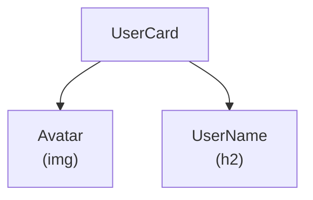
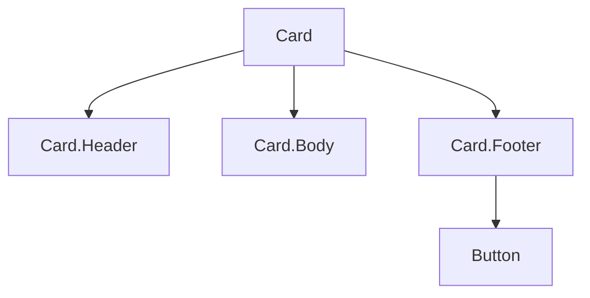

# Composition

**Composition** (tổ hợp component) là cách xây dựng giao diện phức tạp bằng cách lồng ghép và kết hợp nhiều component nhỏ lại với nhau, thay vì kế thừa. Trong React, ta thường truyền các component con qua **children prop** (nội dung nằm giữa thẻ mở và thẻ đóng) để tạo các thành phần linh hoạt, tái sử dụng được. Đây là cách tiếp cận chính thức được React khuyến khích để chia sẻ và tái dùng UI.

[](pathname:///img/react/composition.webp)

---

:::note[Ghi nhớ nhanh]

- ⭐ **Composition (ghép các component nhỏ) thay cho inheritance** — React khuyến nghị compose thay vì `class A extends B` để reuse UI.
- **`children` prop** — chứa JSX giữa thẻ mở/đóng, cho parent tự quyết định nội dung bên trong (Card, Modal, Layout).
- **Slot pattern** — truyền JSX qua nhiều props (`header`, `sidebar`, `footer`) khi cần nhiều vùng tùy biến.
- **Compound components** — nhóm component liên quan (`Card.Header`, `Card.Body`) chia sẻ state ngầm qua Context API.
- ⭐ **Custom hook là cách reuse logic ưa chuộng nhất (2026)** — gọn, type-safe; tránh `React.cloneElement` vì không type-safe, khó debug.

:::

---

## Mục lục

- [Vì sao ưu tiên composition?](#vì-sao-ưu-tiên-composition)
- [Composition là gì?](#composition-là-gì)
- [children prop](#children-prop)
- [Slot pattern](#slot-pattern)
- [Compound Components](#compound-components)
- [Composition vs Inheritance](#composition-vs-inheritance)
- [Câu hỏi phỏng vấn](#câu-hỏi-phỏng-vấn)

---

## Vì sao ưu tiên composition?

**Vấn đề:** Tái sử dụng UI bằng **kế thừa (inheritance)** class rất cứng
nhắc, dễ phình to và khó tùy biến. Một component cha "biết hết" về con
thì khó mở rộng:

```jsx
// Inheritance — cha "biết hết" về con, khó mở rộng
class Dialog extends Component {
  renderTitle() { return <h1>Title mặc định</h1>; }
  renderBody() { return <p>Body mặc định</p>; }
  render() {
    return (
      <div className="dialog">
        {this.renderTitle()}
        {this.renderBody()}
      </div>
    );
  }
}

// Muốn đổi title? Phải tạo subclass và override
class WarningDialog extends Dialog {
  renderTitle() { return <h1 className="warn">Cảnh báo</h1>; }
}
// Mỗi biến thể = một subclass mới → phình to, cứng nhắc
```

**Giải pháp:** Dùng **composition** — ghép các component nhỏ lại, dùng
`props.children` và truyền component qua props (slot pattern) để cha
không cần biết chi tiết con:

```jsx
// Composition — cha không cần biết chi tiết con
function Dialog({ title, children }) {
  return (
    <div className="dialog">
      {title}
      {children}
    </div>
  );
}

// Mọi biến thể đều dùng lại cùng một Dialog
<Dialog title={<h1 className="warn">Cảnh báo</h1>}>
  <p>Nội dung tùy ý ở đây.</p>
</Dialog>
```

React khuyến nghị composition thay vì inheritance.

:::tip[Dùng thực tế]

- **Card / Modal / Layout** bọc nội dung con qua `children` — không cần
  biết trước render gì bên trong.
- **Slot** (header / footer) truyền qua props để cha chừa sẵn nhiều "vùng"
  tùy biến.
- **Wrapper component** bọc thêm style/hành vi quanh một component có sẵn.
- **Specialized component** tạo từ generic — ví dụ `WarningDialog` chỉ là
  `Dialog` với props khác, không cần subclass.

:::

---

## Composition là gì?

**Composition** = ghép nhiều component lại thành component lớn hơn,
không phải kế thừa.

React **không khuyến khích inheritance** (vd `class A extends B` để
reuse UI). Composition là cách chính thức để reuse.

```jsx
// Component nhỏ
function Avatar({ src, alt }) {
  return ;
}

function UserName({ name }) {
  return <h2 className="font-bold">{name}</h2>;
}

// Ghép thành component lớn
function UserCard({ user }) {
  return (
    <div className="card">
      <Avatar src={user.avatar} alt={user.name} />
      <UserName name={user.name} />
    </div>
  );
}
```

Cây component sau khi ghép — `UserCard` gồm các component con:



---

## children prop

Mọi component **mặc định có prop `children`** — chứa JSX giữa thẻ:

```jsx
function Card({ children }) {
  return (
    <div className="card shadow-md p-4">
      {children}
    </div>
  );
}

// Dùng
<Card>
  <h1>Title</h1>
  <p>Body content</p>
</Card>
```

Cho phép parent **quyết định nội dung** trong Card mà không cần định
nghĩa trước.

---

## Slot pattern

Khi cần **nhiều "vùng" tùy biến** trong component, dùng prop dạng JSX:

```jsx
function Layout({ header, sidebar, main, footer }) {
  return (
    <div className="layout">
      <header>{header}</header>
      <div className="content">
        <aside>{sidebar}</aside>
        <main>{main}</main>
      </div>
      <footer>{footer}</footer>
    </div>
  );
}

<Layout
  header={<NavBar />}
  sidebar={<Sidebar />}
  main={<HomePage />}
  footer={<Footer />}
/>
```

Pattern "slot" này phổ biến trong Vue, Astro — React làm qua prop nhận
ReactNode.

---

## Compound Components

Pattern **phối hợp nhiều component liên quan**, chia sẻ state ngầm:

```jsx
<Card>
  <Card.Header>Title</Card.Header>
  <Card.Body>Content</Card.Body>
  <Card.Footer>
    <Button>Save</Button>
  </Card.Footer>
</Card>
```

Cấu trúc phân cấp của một compound component:



Implementation:

```jsx
function Card({ children }) {
  return <div className="card">{children}</div>;
}

Card.Header = function CardHeader({ children }) {
  return <header className="card-header">{children}</header>;
};

Card.Body = function CardBody({ children }) {
  return <div className="card-body">{children}</div>;
};

Card.Footer = function CardFooter({ children }) {
  return <footer className="card-footer">{children}</footer>;
};
```

Hoặc với named export:

```jsx
export function Card({ children }) { /* ... */ }
export function CardHeader({ children }) { /* ... */ }
export function CardBody({ children }) { /* ... */ }
export function CardFooter({ children }) { /* ... */ }

// Dùng
import { Card, CardHeader, CardBody, CardFooter } from "./Card";
```

:::info[Phân tích]

**Compound Components share state qua Context API:**

```jsx
import { createContext, useContext, useState } from "react";

const AccordionContext = createContext();

function Accordion({ children }) {
  const [openItem, setOpenItem] = useState(null);
  return (
    <AccordionContext.Provider value={{ openItem, setOpenItem }}>
      <div className="accordion">{children}</div>
    </AccordionContext.Provider>
  );
}

function AccordionItem({ id, title, children }) {
  const { openItem, setOpenItem } = useContext(AccordionContext);
  const isOpen = openItem === id;

  return (
    <div className="accordion-item">
      <button onClick={() => setOpenItem(isOpen ? null : id)}>
        {title}
      </button>
      {isOpen && <div>{children}</div>}
    </div>
  );
}

Accordion.Item = AccordionItem;
```

Dùng:

```jsx
<Accordion>
  <Accordion.Item id="1" title="Q1">A1</Accordion.Item>
  <Accordion.Item id="2" title="Q2">A2</Accordion.Item>
</Accordion>
```

Caller không phải biết về state — chỉ compose. Đây là pattern của **Radix
UI**, **Headless UI**, **Mantine** — cực kỳ powerful cho UI library.

:::

---

## Composition vs Inheritance

**React không có inheritance** trong hệ thống component (dù class JS
có `extends`).

```jsx
// Sai trong React — đừng làm
class FancyButton extends Button {}
```

Thay vào đó:

```jsx
// Composition — wrap component
function FancyButton(props) {
  return <Button {...props} className="fancy" />;
}
```

Lý do composition tốt hơn:

- **Flexible** — parent control 100% layout.
- **Loose coupling** — không phụ thuộc internal của base.
- **Easier to refactor** — đổi base không ảnh hưởng wrapper.

:::tip[Mẹo]

**Pattern phổ biến tận dụng composition**:

**1. Render props** — truyền function làm prop:

```jsx
<DataLoader render={data => <List data={data} />} />
```

**2. Higher-Order Component (HOC)** — function nhận component, trả về
component mới (xem phần Rendering):

```jsx
const EnhancedComponent = withAuth(MyComponent);
```

**3. Custom Hook** — share logic không phải UI:

```jsx
function useUser() {
  // logic chung
}

// Dùng trong nhiều component
function ComponentA() {
  const user = useUser();
}
```

Trong React hiện đại (2026), **custom hooks** là cách reuse logic ưa
chuộng nhất — gọn, linh hoạt, type-safe.

:::

:::warning[Cần lưu ý]

**`React.cloneElement` để inject prop vào children** — pattern cũ, nay
ít dùng:

```jsx
function Form({ children }) {
  return (
    <form>
      {React.Children.map(children, child =>
        React.cloneElement(child, { className: "field" })
      )}
    </form>
  );
}
```

Vấn đề:

- **Không type-safe** — TS không biết prop được inject.
- **Khó reason about** — debug đau đầu.
- **Buộc child là element**, không cho phép text/fragment.

→ Thay bằng **Context API**:

```jsx
const FormContext = createContext();

function Form({ children }) {
  return (
    <FormContext.Provider value={{ className: "field" }}>
      <form>{children}</form>
    </FormContext.Provider>
  );
}

function Field() {
  const { className } = useContext(FormContext);
  return <input className={className} />;
}
```

Type-safe, transparent, dễ test.

:::

---

## Câu hỏi phỏng vấn

Những câu thường gặp về chủ đề này. Tự trả lời trước, rồi bấm **Xem đáp án** để đối chiếu.

**1. Composition trong React là gì? Vì sao React khuyến nghị composition thay vì inheritance để tái sử dụng UI?**

<details className="qa">
<summary>Xem đáp án</summary>

**Composition** là ghép nhiều component nhỏ lại thành component lớn hơn, thay vì cho component này kế thừa component kia. Component cha chừa sẵn "chỗ trống" (`children`, props dạng JSX) để nơi sử dụng quyết định nội dung.

Vì sao không dùng inheritance:

- **Cứng nhắc**: mỗi biến thể lại phải tạo một subclass mới (`WarningDialog extends Dialog`), số lớp phình ra rất nhanh.
- **Coupling chặt**: subclass phụ thuộc vào chi tiết bên trong lớp cha; sửa lớp cha có nguy cơ làm vỡ mọi lớp con.
- **Khó tổ hợp**: cần hai hành vi từ hai lớp cha khác nhau thì bế tắc, còn composition chỉ việc lồng thêm.
- **Không hợp với function component**: React hiện đại không còn dùng class, nên `extends` cũng không còn chỗ đứng.

```jsx
function Dialog({ title, children }) {
  return <div className="dialog">{title}{children}</div>;
}

<Dialog title={<h1 className="warn">Cảnh báo</h1>}>
  <p>Nội dung tùy ý.</p>
</Dialog>
```

React docs nói rõ: chưa từng gặp trường hợp nào cần inheritance mà composition không giải quyết được.

</details>

**2. `children` là prop đặc biệt hay prop bình thường? Có mấy cách truyền nội dung vào bên trong một component?**

<details className="qa">
<summary>Xem đáp án</summary>

`children` là **một prop bình thường** — chỉ khác ở chỗ JSX có cú pháp riêng để gán cho nó: mọi thứ nằm giữa thẻ mở và thẻ đóng đều được compiler gom vào `props.children`. Hai cách viết dưới đây là tương đương:

```jsx
<Card>Nội dung</Card>
<Card children="Nội dung" />   // hợp lệ, nhưng không ai viết thế
```

Các cách truyền nội dung vào bên trong component:

- **`children`** — cách tự nhiên nhất khi chỉ có một vùng nội dung.
- **Props dạng JSX (slot pattern)** — `header={<NavBar />}` khi cần nhiều vùng riêng biệt.
- **Render props** — truyền một hàm, component gọi hàm đó với dữ liệu nội bộ để nơi dùng tự quyết định render gì.
- **`children` là hàm** — biến thể của render props: `` {(data) => <List data={data} />} ``.
- **Compound components** — nội dung là các sub-component chuyên biệt (`Card.Header`), chia sẻ state qua Context.

Chọn cách nào tuỳ số lượng vùng cần tuỳ biến và việc con có cần đọc state nội bộ của cha hay không.

</details>

**3. So sánh `children` prop và slot pattern (truyền JSX qua các props có tên) — khi nào chọn cách nào?**

<details className="qa">
<summary>Xem đáp án</summary>

| | `children` | Slot pattern |
|---|---|---|
| Số vùng tuỳ biến | Một | Nhiều, mỗi vùng một tên |
| Cú pháp nơi dùng | Tự nhiên, giống HTML | Dài hơn, dạng attribute |
| Ý nghĩa từng vùng | Ngầm hiểu | Tường minh qua tên prop |
| Kiểm soát thứ tự | Nơi dùng quyết định | Component quyết định vị trí từng slot |

```jsx
// children — một vùng
<Card><p>Nội dung</p></Card>

// slot — nhiều vùng có tên
<Layout
  header={<NavBar />}
  sidebar={<Sidebar />}
  main={<HomePage />}
/>
```

Chọn `children` khi component chỉ là lớp bọc quanh một khối nội dung: `Card`, `Modal`, `Button`, `Container`. Chọn slot khi bố cục có **nhiều vùng cố định** mà component phải tự đặt đúng chỗ: layout trang, bảng có toolbar và footer, dialog có title/body/actions.

Hai cách hoàn toàn kết hợp được: `children` cho phần thân chính, thêm vài prop slot cho các vùng phụ. Tránh dùng quá nhiều slot — trên bốn, năm vùng thì compound components thường dễ đọc hơn.

</details>

**4. `children` có thể mang những kiểu giá trị nào? `React.Children` cung cấp các tiện ích gì và vì sao chúng ít được khuyến khích?**

<details className="qa">
<summary>Xem đáp án</summary>

`children` có thể là bất cứ thứ gì React render được: chuỗi, số, một React element, **mảng** element, `null`/`undefined`/boolean (không render), Fragment, hoặc thậm chí **một hàm** (render props). Vì hình dạng không cố định, đừng bao giờ giả định `children` luôn là mảng hay luôn có đúng một phần tử.

`React.Children` là bộ tiện ích để xử lý sự lộn xộn đó:

- `React.Children.map` — duyệt an toàn dù `children` là một phần tử hay mảng, tự bỏ qua `null`.
- `React.Children.count` — đếm số con.
- `React.Children.toArray` — chuyển thành mảng phẳng, tự gán key.
- `React.Children.only` — khẳng định chỉ có đúng một con.

Vì sao ít khuyến khích: chúng khiến component **phụ thuộc vào hình dạng cây con**. Chỉ cần nơi dùng bọc thêm một `div` hay một Fragment, hoặc render qua `.map`, mọi giả định đều vỡ. Code cũng khó gõ kiểu với TypeScript và khó debug.

Hướng thay thế: dùng **Context** để chia sẻ dữ liệu xuống sâu bao nhiêu tầng cũng được, hoặc dùng **slot props** để nhận đúng thứ mình cần.

</details>

**5. Compound components là gì? Các sub-component chia sẻ state ngầm với nhau bằng cơ chế nào?**

<details className="qa">
<summary>Xem đáp án</summary>

**Compound components** là nhóm các component được thiết kế để dùng cùng nhau, mỗi cái đảm nhiệm một phần của một khối UI: `Accordion` với `Accordion.Item`, `Tabs` với `Tabs.List` và `Tabs.Panel`. Nơi dùng chỉ việc sắp xếp chúng như HTML, không phải truyền state qua lại.

Cơ chế chia sẻ state ngầm là **Context API**: component cha giữ state và bọc con trong một Provider; các sub-component gọi `useContext` để đọc.

```jsx
const AccordionContext = createContext();

function Accordion({ children }) {
  const [openItem, setOpenItem] = useState(null);
  return (
    <AccordionContext.Provider value={{ openItem, setOpenItem }}>
      <div className="accordion">{children}</div>
    </AccordionContext.Provider>
  );
}

function AccordionItem({ id, title, children }) {
  const { openItem, setOpenItem } = useContext(AccordionContext);
  const isOpen = openItem === id;
  ...
}

Accordion.Item = AccordionItem;
```

Nhờ Context, sub-component nằm sâu bao nhiêu tầng vẫn đọc được state, và nơi dùng có toàn quyền bố trí markup xen giữa. Nên kiểm tra context rỗng để báo lỗi rõ ràng khi ai đó dùng `Accordion.Item` ngoài `Accordion`.

</details>

**6. Vì sao Radix UI và Headless UI chọn compound components làm kiểu API chính? Ưu điểm cho người dùng thư viện là gì?**

<details className="qa">
<summary>Xem đáp án</summary>

Vì các thư viện này theo triết lý **headless**: cung cấp hành vi, trạng thái và accessibility, còn giao diện để người dùng tự quyết. Compound components là API hợp nhất với triết lý đó — mỗi phần của widget là một component riêng, người dùng tự sắp xếp và tự style.

Ưu điểm cho người dùng thư viện:

- **Toàn quyền về markup và style**: muốn chèn icon giữa title và nội dung, muốn đổi thứ tự, muốn bọc thêm lớp — cứ việc, không phải chờ thư viện thêm prop.
- **Tránh "bùng nổ props"**: thay vì một component nhận `titleClassName`, `bodyStyle`, `renderFooter`..., mỗi phần tự nhận props của mình.
- **API tự mô tả**: nhìn JSX là hiểu cấu trúc, gõ `Dialog.` là autocomplete gợi ra các phần.
- **Accessibility miễn phí**: thư viện tự lo `aria-*`, quản lý focus, điều hướng bàn phím — phần khó nhất và hay bị làm sai nhất.
- **Không phụ thuộc state thủ công**: trạng thái mở/đóng, tab đang chọn đi ngầm qua Context.

Đánh đổi: JSX dài hơn, và người dùng phải học cấu trúc của từng widget.

</details>

**7. `React.cloneElement` giải quyết vấn đề gì? Nêu ba nhược điểm và cách thay thế bằng Context.**

<details className="qa">
<summary>Xem đáp án</summary>

Nó được dùng để **tiêm thêm props vào các element con** mà component cha nhận qua `children` — cha muốn "cấu hình" con nhưng con lại do nơi khác viết ra:

```jsx
function Form({ children }) {
  return (
    <form>
      {React.Children.map(children, (child) =>
        React.cloneElement(child, { className: "field" })
      )}
    </form>
  );
}
```

Ba nhược điểm:

- **Không type-safe**: TypeScript không biết props nào được tiêm vào, nên không kiểm tra được gì.
- **Khó suy luận và debug**: đọc code nơi dùng không thấy props đó ở đâu ra; props tiêm vào có thể vô tình ghi đè props người dùng đặt.
- **Ràng buộc hình dạng children**: chỉ chạy khi con là element trực tiếp — bọc thêm một `div`, một Fragment hay một text node là hỏng.

Thay bằng **Context**: cha đặt giá trị vào Provider, con nào cần thì tự đọc — sâu bao nhiêu tầng cũng được, có kiểu rõ ràng, và nhìn code con là biết nó phụ thuộc gì.

```jsx
const FormContext = createContext();

function Form({ children }) {
  return (
    <FormContext.Provider value={{ className: "field" }}>
      <form>{children}</form>
    </FormContext.Provider>
  );
}
```

</details>

**8. `render props` là gì? Cho một ví dụ và so sánh với custom hook về khả năng tái dùng.**

<details className="qa">
<summary>Xem đáp án</summary>

**Render props** là kỹ thuật truyền **một hàm** làm prop; component giữ logic sẽ gọi hàm đó với dữ liệu nội bộ, còn nơi dùng quyết định render ra gì.

```jsx
function DataLoader({ url, render }) {
  const [data, setData] = useState(null);
  // ...gọi API rồi setData
  return render(data);
}

<DataLoader url="/api/users" render={(data) => <List data={data} />} />
```

So với custom hook:

| | Render props | Custom hook |
|---|---|---|
| Chia sẻ | Logic **và** một chỗ đặt UI | Chỉ logic |
| Cú pháp | Lồng nhiều tầng khi kết hợp nhiều nguồn | Gọi song song, phẳng |
| Kiểu dữ liệu | Gõ kiểu rườm rà hơn | Suy luận kiểu tự nhiên |
| Cây component | Tạo thêm tầng bọc | Không thêm tầng nào |

Ba render props lồng nhau tạo ra "callback hell" trong JSX, trong khi ba custom hook chỉ là ba dòng liền nhau. Vì vậy từ khi có hooks (React 16.8), custom hook gần như thay thế hoàn toàn render props cho việc tái dùng **logic**.

Render props vẫn còn giá trị khi component thật sự cần kiểm soát **thời điểm và vị trí** render — ví dụ danh sách ảo hoá tự quyết định render dòng nào.

</details>

**9. HOC là gì? Nêu nhược điểm (wrapper hell, mất `ref`, khó gõ kiểu) so với custom hook.**

<details className="qa">
<summary>Xem đáp án</summary>

**HOC (Higher-Order Component)** là hàm nhận vào một component và trả về một component mới đã được bổ sung hành vi hoặc props:

```jsx
const EnhancedComponent = withAuth(MyComponent);
```

Nhược điểm:

- **Wrapper hell**: chồng nhiều HOC (`withAuth(withTheme(withRouter(C)))`) làm React DevTools đầy các tầng bọc vô nghĩa, khó lần ra component thật.
- **Mất `ref`**: `ref` không đi qua HOC như props thường — phải bọc thêm `forwardRef` thì mới xuyên xuống được.
- **Khó gõ kiểu**: TypeScript phải mô tả "component nhận props X, trả về component nhận props X trừ đi Y", rất rối và dễ sai.
- **Xung đột tên props**: hai HOC cùng tiêm một tên prop thì cái sau ghi đè cái trước, âm thầm.
- **Không rõ nguồn gốc props**: nhìn component không biết prop đến từ HOC nào.

Custom hook giải quyết hết: không thêm tầng nào vào cây, `ref` không liên quan, kiểu suy luận tự nhiên, và dòng `const user = useAuth()` nói rõ dữ liệu từ đâu ra. HOC ngày nay chủ yếu còn thấy trong code cũ hoặc ở các API buộc phải bọc như `React.memo`.

</details>

**10. Nếu chỉ cần tái dùng logic chứ không phải UI thì nên dùng gì? Vì sao custom hook được ưa chuộng nhất hiện nay?**

<details className="qa">
<summary>Xem đáp án</summary>

Dùng **custom hook** — một hàm thường có tên bắt đầu bằng `use`, bên trong gọi các hook có sẵn của React và trả về dữ liệu hoặc hàm xử lý.

```jsx
function useUser(id) {
  const [user, setUser] = useState(null);
  const [isLoading, setLoading] = useState(true);
  // gọi API trong useEffect...
  return { user, isLoading };
}

function Profile({ id }) {
  const { user, isLoading } = useUser(id); // tái dùng ở bao nhiêu component cũng được
}
```

Vì sao được ưa chuộng nhất:

- **Không đụng tới cây component**: khác HOC và render props, hook không thêm tầng bọc nào.
- **Phẳng và dễ đọc**: gọi năm hook là năm dòng liền nhau, không lồng nhau.
- **Type-safe tự nhiên**: chỉ là hàm JS bình thường, TypeScript suy luận kiểu dễ dàng.
- **Ghép được**: hook này gọi hook kia thoải mái.
- **Tách rõ logic và UI**: component chỉ còn việc hiển thị, logic test được độc lập.

Lưu ý: hook chia sẻ **logic**, không chia sẻ **state** — mỗi component gọi hook sẽ có state riêng. Muốn dùng chung state thì cần Context hoặc thư viện quản lý state.

</details>

**11. "Specialization" (ví dụ tạo `WarningDialog` từ `Dialog`) được làm thế nào trong React mà không cần `extends`?**

<details className="qa">
<summary>Xem đáp án</summary>

Chỉ cần viết một component **bọc lại** component tổng quát và truyền sẵn props cụ thể — không cần kế thừa gì cả:

```jsx
function Dialog({ title, icon, children, ...rest }) {
  return (
    <div className="dialog" {...rest}>
      {icon}
      {title}
      {children}
    </div>
  );
}

function WarningDialog({ children, ...rest }) {
  return (
    <Dialog
      title={<h1 className="warn">Cảnh báo</h1>}
      icon={<WarningIcon />}
      {...rest}
    >
      {children}
    </Dialog>
  );
}
```

Đây chính là quan hệ "is-a" của inheritance được diễn đạt bằng composition: `WarningDialog` **dùng** `Dialog` thay vì **kế thừa** nó.

Vài lưu ý để bản chuyên biệt vẫn linh hoạt:

- **Spread `...rest`** xuống component gốc để nơi dùng vẫn truyền được props khác.
- Đặt `{...rest}` **sau** các props mặc định nếu muốn cho phép ghi đè, đặt trước nếu muốn khoá cứng.
- Giữ `children` nguyên vẹn để nội dung vẫn tuỳ biến được.

Cách này linh hoạt hơn subclass vì bạn bọc bao nhiêu tầng, kết hợp bao nhiêu component tuỳ ý.

</details>

**12. Truyền component qua prop (`component={Icon}`) khác gì truyền element (`icon={<Icon />}`)? Mỗi cách phù hợp khi nào?**

<details className="qa">
<summary>Xem đáp án</summary>

| | Truyền component (`component={Icon}`) | Truyền element (`icon={<Icon />}`) |
|---|---|---|
| Giá trị truyền đi | Chính hàm component | React element đã tạo sẵn |
| Ai quyết định props | Component nhận | Nơi dùng |
| Render nhiều lần với props khác nhau | Được | Không — element đã cố định |
| Biến trong JSX | Phải viết hoa: `const C = component` | Nhúng thẳng `{icon}` |

```jsx
// Truyền component — nơi nhận tự quyết props
function Button({ component: Icon, label }) {
  return <button><Icon size={16} /> {label}</button>;
}
<Button component={SearchIcon} label="Tìm" />

// Truyền element — nơi dùng đã quyết props
function Button({ icon, label }) {
  return <button>{icon} {label}</button>;
}
<Button icon={<SearchIcon size={24} color="red" />} label="Tìm" />
```

Chọn **truyền component** khi nơi nhận cần tự truyền props (kích thước, dữ liệu của từng dòng trong danh sách), hoặc cần render nó nhiều lần. Chọn **truyền element** khi nơi dùng muốn toàn quyền cấu hình và nơi nhận chỉ việc đặt vào đúng chỗ — đây cũng chính là slot pattern, đơn giản và đủ dùng trong đa số trường hợp.

</details>

**13. Vì sao truyền một cây JSX từ cha xuống qua `children` có thể giúp phần cây đó không re-render khi state của component bọc thay đổi?**

<details className="qa">
<summary>Xem đáp án</summary>

Vì `children` lúc đó là một **element đã được tạo ở component cha**. Khi state của component bọc đổi, chỉ mình nó chạy lại; nó không tạo lại element `children` mà chỉ nhận lại **đúng tham chiếu cũ**. React so sánh element mới với element cũ, thấy giống hệt nhau, nên **bỏ qua** việc render lại cây con đó.

```jsx
// Cây con nằm trong ExpensiveTree được tạo ở App, không phải trong Wrapper
function App() {
  return (
    <Wrapper>
      <ExpensiveTree />   {/* App không re-render → element này giữ nguyên */}
    </Wrapper>
  );
}

function Wrapper({ children }) {
  const [count, setCount] = useState(0); // state đổi liên tục
  return (
    <div onClick={() => setCount(count + 1)}>
      {count}
      {children}   {/* không render lại */}
    </div>
  );
}
```

Nếu viết `<ExpensiveTree />` **bên trong** `Wrapper`, mỗi lần `count` đổi element sẽ được tạo mới và cây con render lại.

Kỹ thuật này gọi là **"lifting content up"** hay "children as a prop" — một cách tối ưu hiệu năng không cần `memo`, chỉ cần bố trí lại component.

</details>

**14. Gán sub-component bằng dot notation (`Card.Header = ...`) so với named export — khác nhau thế nào về tree-shaking, kiểu dữ liệu và khả năng kiểm tra thứ tự con?**

<details className="qa">
<summary>Xem đáp án</summary>

| | Dot notation | Named export |
|---|---|---|
| Tree-shaking | Kém — import `Card` là kéo theo mọi sub-component | Tốt — bundler bỏ được phần không dùng |
| Kiểu dữ liệu (TS) | Phải khai báo thêm kiểu cho các thuộc tính gắn vào hàm | Mỗi component một kiểu độc lập, đơn giản |
| Khám phá API | Rất tốt — gõ `Card.` là thấy hết các phần | Phải nhớ tên hoặc xem tài liệu |
| Quan hệ nhóm | Thể hiện rõ ngay trong cú pháp | Chỉ thể hiện qua quy ước đặt tên |

```jsx
// Dot notation
Card.Header = function CardHeader({ children }) { ... };

// Named export
export function CardHeader({ children }) { ... }
```

Về **kiểm tra thứ tự / kiểu của children**: cả hai đều cho phép so sánh `child.type === CardHeader` khi duyệt `React.Children`, dot notation chỉ tiện hơn ở chỗ tham chiếu luôn sẵn trên `Card`. Nhưng đây là cách làm **không nên khuyến khích**: chỉ cần nơi dùng bọc thêm một lớp, dùng Fragment hay render qua `.map` là kiểm tra sai ngay. Muốn ràng buộc quan hệ cha–con, hãy dùng **Context** và báo lỗi khi sub-component không tìm thấy provider.

Thực tế nhiều thư viện dùng cả hai: export rời để tree-shake, đồng thời gắn dot notation cho tiện dùng.

</details>

**15. Dấu hiệu nào cho thấy bạn đã composition quá đà (over-abstraction)? Cân bằng giữa linh hoạt và đơn giản ra sao?**

<details className="qa">
<summary>Xem đáp án</summary>

Các dấu hiệu cảnh báo:

- Component chỉ có **một nơi dùng** nhưng đã có sáu, bảy props để "phòng khi cần".
- Phải mở ba, bốn file mới hiểu một khối UI đơn giản làm gì.
- Component bọc chỉ để truyền tiếp props, không thêm giá trị nào (`{...props}` rồi thôi).
- Props kiểu `renderX`, `isY`, `variantZ` chồng chất, nhiều tổ hợp không bao giờ được dùng.
- Sửa một yêu cầu nhỏ lại phải đụng vào nhiều tầng trừu tượng.
- Người mới vào dự án không đoán được nên dùng component nào.

Cách cân bằng:

- **Đợi tới lần thứ ba mới trừu tượng hoá**: lặp lại một lần thì cứ copy, ba lần mới rút ra pattern — lúc đó bạn đã đủ dữ kiện để thiết kế đúng.
- **Thêm props theo nhu cầu thật**, không theo dự đoán tương lai.
- Ưu tiên **nhiều component nhỏ, rõ ràng** hơn một component khổng lồ đầy `variant`.
- Trùng lặp một chút còn rẻ hơn một trừu tượng hoá sai — gỡ một abstraction sai tốn hơn nhiều so với viết lại vài dòng giống nhau.

Mục tiêu cuối cùng là **dễ đọc và dễ sửa**, không phải linh hoạt tối đa.

</details>
