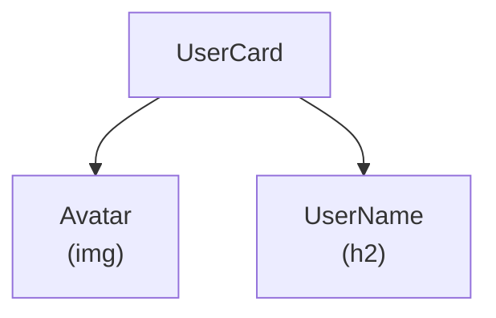
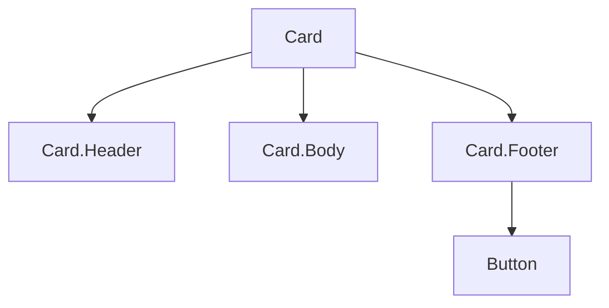

# Composition

**Composition** (tổ hợp component) là cách xây dựng giao diện phức tạp bằng cách lồng ghép và kết hợp nhiều component nhỏ lại với nhau, thay vì kế thừa. Trong React, ta thường truyền các component con qua **children prop** (nội dung nằm giữa thẻ mở và thẻ đóng) để tạo các thành phần linh hoạt, tái sử dụng được. Đây là cách tiếp cận chính thức được React khuyến khích để chia sẻ và tái dùng UI.

---

:::note[Ghi nhớ nhanh]

- ⭐ **Composition (ghép các component nhỏ) thay cho inheritance** — React khuyến nghị compose thay vì `class A extends B` để reuse UI.
- **`children` prop** — chứa JSX giữa thẻ mở/đóng, cho parent tự quyết định nội dung bên trong (Card, Modal, Layout).
- **Slot pattern** — truyền JSX qua nhiều props (`header`, `sidebar`, `footer`) khi cần nhiều vùng tùy biến.
- **Compound components** — nhóm component liên quan (`Card.Header`, `Card.Body`) chia sẻ state ngầm qua Context API.
- ⭐ **Custom hook là cách reuse logic ưa chuộng nhất (2026)** — gọn, type-safe; tránh `React.cloneElement` vì không type-safe, khó debug.

:::

---

## Mục lục

- [Vì sao ưu tiên composition?](#vì-sao-ưu-tiên-composition)
- [Composition là gì?](#composition-là-gì)
- [children prop](#children-prop)
- [Slot pattern](#slot-pattern)
- [Compound Components](#compound-components)
- [Composition vs Inheritance](#composition-vs-inheritance)
- [Câu hỏi phỏng vấn](#câu-hỏi-phỏng-vấn)

---

## Vì sao ưu tiên composition?

**Vấn đề:** Tái sử dụng UI bằng **kế thừa (inheritance)** class rất cứng
nhắc, dễ phình to và khó tùy biến. Một component cha "biết hết" về con
thì khó mở rộng:

```jsx
// Inheritance — cha "biết hết" về con, khó mở rộng
class Dialog extends Component {
  renderTitle() { return <h1>Title mặc định</h1>; }
  renderBody() { return <p>Body mặc định</p>; }
  render() {
    return (
      <div className="dialog">
        {this.renderTitle()}
        {this.renderBody()}
      </div>
    );
  }
}

// Muốn đổi title? Phải tạo subclass và override
class WarningDialog extends Dialog {
  renderTitle() { return <h1 className="warn">Cảnh báo</h1>; }
}
// Mỗi biến thể = một subclass mới → phình to, cứng nhắc
```

**Giải pháp:** Dùng **composition** — ghép các component nhỏ lại, dùng
`props.children` và truyền component qua props (slot pattern) để cha
không cần biết chi tiết con:

```jsx
// Composition — cha không cần biết chi tiết con
function Dialog({ title, children }) {
  return (
    <div className="dialog">
      {title}
      {children}
    </div>
  );
}

// Mọi biến thể đều dùng lại cùng một Dialog
<Dialog title={<h1 className="warn">Cảnh báo</h1>}>
  <p>Nội dung tùy ý ở đây.</p>
</Dialog>
```

React khuyến nghị composition thay vì inheritance.

:::tip[Dùng thực tế]

- **Card / Modal / Layout** bọc nội dung con qua `children` — không cần
  biết trước render gì bên trong.
- **Slot** (header / footer) truyền qua props để cha chừa sẵn nhiều "vùng"
  tùy biến.
- **Wrapper component** bọc thêm style/hành vi quanh một component có sẵn.
- **Specialized component** tạo từ generic — ví dụ `WarningDialog` chỉ là
  `Dialog` với props khác, không cần subclass.

:::

---

## Composition là gì?

**Composition** = ghép nhiều component lại thành component lớn hơn,
không phải kế thừa.

React **không khuyến khích inheritance** (vd `class A extends B` để
reuse UI). Composition là cách chính thức để reuse.

```jsx
// Component nhỏ
function Avatar({ src, alt }) {
  return ;
}

function UserName({ name }) {
  return <h2 className="font-bold">{name}</h2>;
}

// Ghép thành component lớn
function UserCard({ user }) {
  return (
    <div className="card">
      <Avatar src={user.avatar} alt={user.name} />
      <UserName name={user.name} />
    </div>
  );
}
```

Cây component sau khi ghép — `UserCard` gồm các component con:



---

## children prop

Mọi component **mặc định có prop `children`** — chứa JSX giữa thẻ:

```jsx
function Card({ children }) {
  return (
    <div className="card shadow-md p-4">
      {children}
    </div>
  );
}

// Dùng
<Card>
  <h1>Title</h1>
  <p>Body content</p>
</Card>
```

Cho phép parent **quyết định nội dung** trong Card mà không cần định
nghĩa trước.

---

## Slot pattern

Khi cần **nhiều "vùng" tùy biến** trong component, dùng prop dạng JSX:

```jsx
function Layout({ header, sidebar, main, footer }) {
  return (
    <div className="layout">
      <header>{header}</header>
      <div className="content">
        <aside>{sidebar}</aside>
        <main>{main}</main>
      </div>
      <footer>{footer}</footer>
    </div>
  );
}

<Layout
  header={<NavBar />}
  sidebar={<Sidebar />}
  main={<HomePage />}
  footer={<Footer />}
/>
```

Pattern "slot" này phổ biến trong Vue, Astro — React làm qua prop nhận
ReactNode.

---

## Compound Components

Pattern **phối hợp nhiều component liên quan**, chia sẻ state ngầm:

```jsx
<Card>
  <Card.Header>Title</Card.Header>
  <Card.Body>Content</Card.Body>
  <Card.Footer>
    <Button>Save</Button>
  </Card.Footer>
</Card>
```

Cấu trúc phân cấp của một compound component:



Implementation:

```jsx
function Card({ children }) {
  return <div className="card">{children}</div>;
}

Card.Header = function CardHeader({ children }) {
  return <header className="card-header">{children}</header>;
};

Card.Body = function CardBody({ children }) {
  return <div className="card-body">{children}</div>;
};

Card.Footer = function CardFooter({ children }) {
  return <footer className="card-footer">{children}</footer>;
};
```

Hoặc với named export:

```jsx
export function Card({ children }) { /* ... */ }
export function CardHeader({ children }) { /* ... */ }
export function CardBody({ children }) { /* ... */ }
export function CardFooter({ children }) { /* ... */ }

// Dùng
import { Card, CardHeader, CardBody, CardFooter } from "./Card";
```

:::info[Phân tích]

**Compound Components share state qua Context API:**

```jsx
import { createContext, useContext, useState } from "react";

const AccordionContext = createContext();

function Accordion({ children }) {
  const [openItem, setOpenItem] = useState(null);
  return (
    <AccordionContext.Provider value={{ openItem, setOpenItem }}>
      <div className="accordion">{children}</div>
    </AccordionContext.Provider>
  );
}

function AccordionItem({ id, title, children }) {
  const { openItem, setOpenItem } = useContext(AccordionContext);
  const isOpen = openItem === id;

  return (
    <div className="accordion-item">
      <button onClick={() => setOpenItem(isOpen ? null : id)}>
        {title}
      </button>
      {isOpen && <div>{children}</div>}
    </div>
  );
}

Accordion.Item = AccordionItem;
```

Dùng:

```jsx
<Accordion>
  <Accordion.Item id="1" title="Q1">A1</Accordion.Item>
  <Accordion.Item id="2" title="Q2">A2</Accordion.Item>
</Accordion>
```

Caller không phải biết về state — chỉ compose. Đây là pattern của **Radix
UI**, **Headless UI**, **Mantine** — cực kỳ powerful cho UI library.

:::

---

## Composition vs Inheritance

**React không có inheritance** trong hệ thống component (dù class JS
có `extends`).

```jsx
// Sai trong React — đừng làm
class FancyButton extends Button {}
```

Thay vào đó:

```jsx
// Composition — wrap component
function FancyButton(props) {
  return <Button {...props} className="fancy" />;
}
```

Lý do composition tốt hơn:

- **Flexible** — parent control 100% layout.
- **Loose coupling** — không phụ thuộc internal của base.
- **Easier to refactor** — đổi base không ảnh hưởng wrapper.

:::tip[Mẹo]

**Pattern phổ biến tận dụng composition**:

**1. Render props** — truyền function làm prop:

```jsx
<DataLoader render={data => <List data={data} />} />
```

**2. Higher-Order Component (HOC)** — function nhận component, trả về
component mới (xem phần Rendering):

```jsx
const EnhancedComponent = withAuth(MyComponent);
```

**3. Custom Hook** — share logic không phải UI:

```jsx
function useUser() {
  // logic chung
}

// Dùng trong nhiều component
function ComponentA() {
  const user = useUser();
}
```

Trong React hiện đại (2026), **custom hooks** là cách reuse logic ưa
chuộng nhất — gọn, linh hoạt, type-safe.

:::

:::warning[Cần lưu ý]

**`React.cloneElement` để inject prop vào children** — pattern cũ, nay
ít dùng:

```jsx
function Form({ children }) {
  return (
    <form>
      {React.Children.map(children, child =>
        React.cloneElement(child, { className: "field" })
      )}
    </form>
  );
}
```

Vấn đề:

- **Không type-safe** — TS không biết prop được inject.
- **Khó reason about** — debug đau đầu.
- **Buộc child là element**, không cho phép text/fragment.

→ Thay bằng **Context API**:

```jsx
const FormContext = createContext();

function Form({ children }) {
  return (
    <FormContext.Provider value={{ className: "field" }}>
      <form>{children}</form>
    </FormContext.Provider>
  );
}

function Field() {
  const { className } = useContext(FormContext);
  return <input className={className} />;
}
```

Type-safe, transparent, dễ test.

:::

---

## Câu hỏi phỏng vấn

Những câu thường gặp về chủ đề này. Tự trả lời trước, rồi đối chiếu lại với nội dung phía trên.

1. Composition trong React là gì? Vì sao React khuyến nghị composition thay vì inheritance để tái sử dụng UI?
2. `children` là prop đặc biệt hay prop bình thường? Có mấy cách truyền nội dung vào bên trong một component?
3. So sánh `children` prop và slot pattern (truyền JSX qua các props có tên) — khi nào chọn cách nào?
4. `children` có thể mang những kiểu giá trị nào? `React.Children` cung cấp các tiện ích gì và vì sao chúng ít được khuyến khích?
5. Compound components là gì? Các sub-component chia sẻ state ngầm với nhau bằng cơ chế nào?
6. Vì sao Radix UI và Headless UI chọn compound components làm kiểu API chính? Ưu điểm cho người dùng thư viện là gì?
7. `React.cloneElement` giải quyết vấn đề gì? Nêu ba nhược điểm và cách thay thế bằng Context.
8. `render props` là gì? Cho một ví dụ và so sánh với custom hook về khả năng tái dùng.
9. HOC là gì? Nêu nhược điểm (wrapper hell, mất `ref`, khó gõ kiểu) so với custom hook.
10. Nếu chỉ cần tái dùng logic chứ không phải UI thì nên dùng gì? Vì sao custom hook được ưa chuộng nhất hiện nay?
11. "Specialization" (ví dụ tạo `WarningDialog` từ `Dialog`) được làm thế nào trong React mà không cần `extends`?
12. Truyền component qua prop (`component={Icon}`) khác gì truyền element (`icon={<Icon />}`)? Mỗi cách phù hợp khi nào?
13. Vì sao truyền một cây JSX từ cha xuống qua `children` có thể giúp phần cây đó không re-render khi state của component bọc thay đổi?
14. Gán sub-component bằng dot notation (`Card.Header = ...`) so với named export — khác nhau thế nào về tree-shaking, kiểu dữ liệu và khả năng kiểm tra thứ tự con?
15. Dấu hiệu nào cho thấy bạn đã composition quá đà (over-abstraction)? Cân bằng giữa linh hoạt và đơn giản ra sao?
