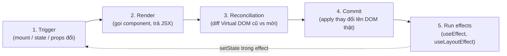
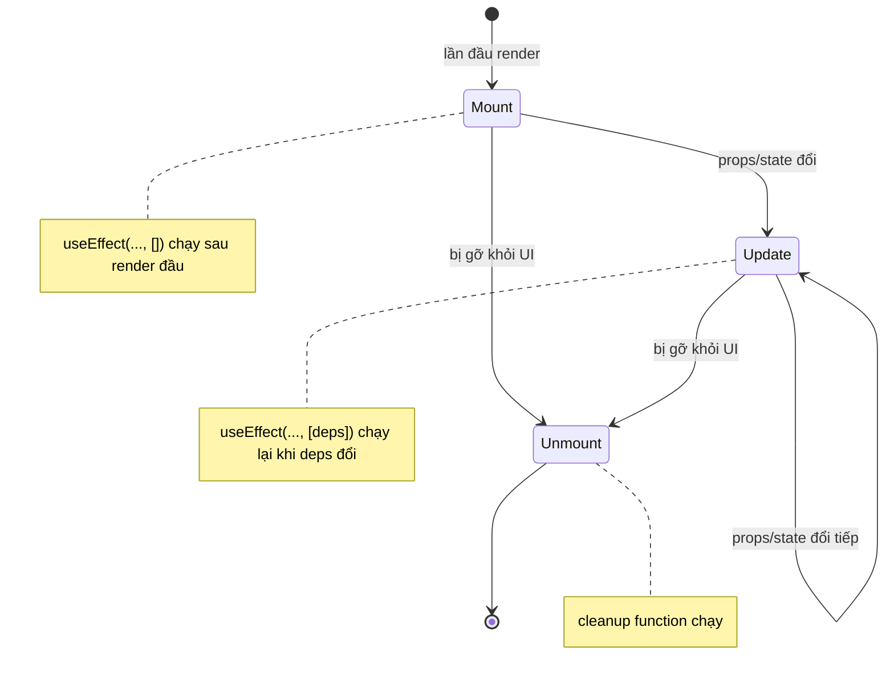

# Component Lifecycle

**Lifecycle** (vòng đời component) là chuỗi các giai đoạn mà một component trải qua: từ khi được tạo và hiển thị lần đầu (**mount** — gắn vào DOM), khi cập nhật do thay đổi state hoặc props (**update**), cho tới khi bị gỡ khỏi giao diện (**unmount** — gỡ khỏi DOM). Hiểu vòng đời giúp bạn biết khi nào component **render** (vẽ ra giao diện) và khi nào nên chạy các tác vụ phụ. Với component dạng hàm, ta điều khiển vòng đời này chủ yếu thông qua các hook.

---

:::note[Ghi nhớ nhanh]

- ⭐ **Vòng đời gồm 3 giai đoạn** — `mount` (vừa hiện), `update` (props/state đổi), `unmount` (bị gỡ); component hàm điều khiển bằng `useEffect`.
- ⭐ **`useEffect` là công cụ đồng bộ, không phải lifecycle hook 1-1** — hãy tư duy "sync với hệ thống ngoài", `[]` chạy 1 lần, `[deps]` chạy lại khi deps đổi.
- **Luôn viết cleanup** trong effect (return function) để huỷ timer/subscription, tránh leak và bug khi remount.
- **Re-render ≠ update DOM** — React dùng reconciliation nên re-render thường rất rẻ; chỉ tối ưu (`memo`, `useMemo`, `useCallback`) khi đo được vấn đề thực sự.
- **Strict Mode (dev)** chạy component + effect 2 lần để lộ side effect thiếu cleanup; không nên tắt.

:::

---

## Mục lục

- [Vì sao cần vòng đời (lifecycle)?](#vì-sao-cần-vòng-đời-lifecycle)
- [Render flow](#render-flow)
- [3 giai đoạn lifecycle](#3-giai-đoạn-lifecycle)
- [Lifecycle với hooks](#lifecycle-với-hooks)
- [Re-render khi nào?](#re-render-khi-nào)
- [Strict Mode](#strict-mode)

---

## Vì sao cần vòng đời (lifecycle)?

**Vấn đề:** Component cần làm việc **ở đúng thời điểm**: gọi API ngay khi
vừa hiện, dọn dẹp (huỷ timer, gỡ listener) khi biến mất, chạy lại khi dữ
liệu đổi. Làm sai thời điểm → rò rỉ bộ nhớ (leak), gọi API thừa, lỗi.

```jsx
// Gọi API ngay trong thân component → chạy lại MỖI lần render → API thừa
function Profile({ userId }) {
  const data = fetch(`/api/users/${userId}`); // sai thời điểm!

  // Tạo timer nhưng không có chỗ dọn dẹp → leak khi component biến mất
  setInterval(() => console.log("tick"), 1000);

  return <p>{data}</p>;
}
```

**Giải pháp:** Vòng đời chia thành 3 thời điểm — **mount** (vừa hiện),
**update** (dữ liệu đổi), **unmount** (biến mất). Class dùng
`componentDidMount` / `componentDidUpdate` / `componentWillUnmount`;
component dạng hàm dùng `useEffect` (cùng cơ chế: chạy **sau render**, và
**cleanup** khi unmount hoặc khi deps đổi).

```jsx
function Profile({ userId }) {
  const [data, setData] = useState(null);

  useEffect(() => {
    let active = true;
    fetch(`/api/users/${userId}`) // chạy khi mount + khi userId đổi
      .then(r => r.json())
      .then(d => { if (active) setData(d); });

    const id = setInterval(() => console.log("tick"), 1000);

    // Cleanup: huỷ timer + bỏ qua kết quả cũ khi unmount/đổi deps
    return () => {
      active = false;
      clearInterval(id);
    };
  }, [userId]);

  return <p>{data?.name}</p>;
}
```

:::tip[Dùng thực tế]

- **Fetch khi mount**: lấy dữ liệu lần đầu component hiện ra
  (`useEffect(..., [])`).
- **Subscribe / unsubscribe**: mở kết nối websocket khi mount, đóng lại
  ở cleanup để tránh nhiều kết nối song song.
- **Set / clear interval**: tạo `setInterval` (đồng hồ, polling) và
  `clearInterval` ở cleanup để không rò rỉ.
- **Đồng bộ theo prop đổi**: khi `userId` (hoặc filter, query) đổi thì
  fetch lại đúng dữ liệu mới (`useEffect(..., [userId])`).

:::

---

## Render flow

Quá trình React render component:

```
1. Trigger (mount đầu hoặc state/props đổi)
2. Render (gọi function component, trả JSX)
3. Reconciliation (so virtual DOM cũ vs mới)
4. Commit (apply thay đổi lên DOM thật)
5. Run effects (useEffect, useLayoutEffect)
```

Hình dung luồng render — chú ý vòng lặp: nếu effect lại gọi `setState`,
chu trình bắt đầu lại từ đầu:



---

## 3 giai đoạn lifecycle

| Giai đoạn | Khi nào | Hook tương ứng |
|-----------|--------|---------------|
| **Mount** | Lần đầu render | `useEffect(() => {}, [])` |
| **Update** | Props/state đổi | `useEffect(() => {}, [deps])` |
| **Unmount** | Component bị remove | `useEffect` return cleanup |

Ba giai đoạn này nối tiếp nhau như một máy trạng thái — component có thể
update nhiều lần trước khi unmount:



---

## Lifecycle với hooks

```jsx
import { useState, useEffect } from "react";

function Timer() {
  const [count, setCount] = useState(0);

  useEffect(() => {
    console.log("Mounted hoặc updated");

    const id = setInterval(() => {
      setCount(c => c + 1);
    }, 1000);

    // Cleanup chạy khi: dep đổi (trước effect mới) hoặc unmount
    return () => {
      console.log("Cleanup");
      clearInterval(id);
    };
  }, []); // dep rỗng → chỉ chạy 1 lần khi mount

  return <p>Count: {count}</p>;
}
```

3 dạng dependency:

```jsx
// 1. Không có deps → chạy mỗi render
useEffect(() => { /* ... */ });

// 2. [] → chỉ chạy 1 lần (mount + unmount cleanup)
useEffect(() => { /* ... */ }, []);

// 3. [a, b] → chạy khi a hoặc b đổi
useEffect(() => { /* ... */ }, [a, b]);
```

:::info[Phân tích]

**`useEffect` không phải là lifecycle hook 1-1.** Nó là **synchronization
primitive** — đồng bộ component với hệ thống bên ngoài (subscription,
API, DOM).

Trong tài liệu React mới (react.dev), hướng dẫn nghĩ về effect:

- **Mục đích**: đồng bộ với cái gì? (data, subscription, third-party widget)
- **Cleanup**: khi nào ngừng đồng bộ?

Vd không đúng:

```jsx
// "Run on mount" — sai tư duy
useEffect(() => {
  trackPageView();
}, []);
```

Đúng tư duy:

```jsx
// "Sync analytics với page URL"
useEffect(() => {
  trackPageView(url);
}, [url]); // re-sync khi URL đổi
```

Nhiều bug "stale closure" và "effect chạy nhiều lần" sinh ra vì coi
`useEffect` là `componentDidMount`. Tư duy theo "sync with external
system" sẽ tránh được.

:::

---

## Re-render khi nào?

Component **re-render** khi:

1. **State đổi** — gọi `setState`.
2. **Props đổi** — parent re-render → child nhận prop mới.
3. **Parent re-render** — mặc định mọi child cũng re-render (trừ khi
   `React.memo`).
4. **Context value đổi** — mọi consumer của context đó re-render.

```jsx
function Parent() {
  const [count, setCount] = useState(0);
  return (
    <>
      <button onClick={() => setCount(c => c + 1)}>+</button>
      <Child />  {/* Child cũng re-render dù không nhận prop */}
    </>
  );
}
```

:::warning[Cần lưu ý]

**Không phải mọi re-render đều update DOM.** React dùng **reconciliation**
(diff virtual DOM cũ vs mới) — chỉ commit thay đổi thực sự lên DOM.

Vì vậy:

- Re-render thường **rất rẻ** (function chạy lại + diff).
- Đừng tối ưu (memo, useMemo, useCallback) **trừ khi có vấn đề thực sự**
  đo được.
- Code đơn giản, dễ đọc > tối ưu premature.

Khi đo bằng React DevTools Profiler, chỉ tối ưu component:
- Render lâu (> 16ms).
- Re-render thường xuyên.
- Là parent của subtree lớn.

:::

---

## Strict Mode

React Strict Mode (dev only) **chạy component, useEffect, state setter
2 lần** để phát hiện side effect ngoài ý muốn:

```jsx
import { StrictMode } from "react";

createRoot(document.getElementById("root")).render(
  <StrictMode>
    <App />
  </StrictMode>
);
```

Hệ quả:

- Console log xuất hiện 2 lần.
- `useEffect` chạy → cleanup → chạy lại.

Lý do: trong React 18+ với offscreen rendering và Server Components,
component có thể **mount/unmount nhiều lần**. Strict Mode mô phỏng để
buộc dev viết effect đúng.

:::info[Phân tích]

**Strict Mode test cleanup đúng:**

```jsx
// Tệ — không cleanup → strict mode lộ bug
useEffect(() => {
  const sub = api.subscribe();
  // Quên unsubscribe
}, []);

// Strict mode mount lần 1 → subscribe (1)
// Strict mode unmount → KHÔNG cleanup
// Strict mode mount lần 2 → subscribe (2) → 2 subscription chạy song song!

// Tốt — có cleanup
useEffect(() => {
  const sub = api.subscribe();
  return () => sub.unsubscribe();
}, []);
```

Sau strict mode unmount → cleanup hủy sub đầu → mount lại tạo sub mới
→ chỉ 1 sub active.

Đây là **lý do React khuyên LUÔN có cleanup** trong effect — production
cũng có thể remount component (React Compiler, offscreen, fast refresh).

Tắt Strict Mode trong dev là **sai** — nó bảo vệ bạn khỏi bug production
lúc nào không hay.

:::

:::tip[Mẹo]

**Debug re-render thừa**:

1. Cài [React DevTools](https://react.dev/learn/react-developer-tools).
2. Mở tab **Profiler**.
3. Click "Record" → tương tác app → "Stop".
4. Xem flame chart — component nào render lâu, render bao nhiêu lần.
5. Highlight Updates (cài đặt) — tô màu component khi re-render.

Pattern phổ biến gây re-render thừa:

- Object/array literal làm prop: `<X opts={{ a: 1 }} />` → mỗi render
  tạo object mới.
- Function inline: `onClick={() => fn()}` → mỗi render function mới.
- Context value object: `<Ctx.Provider value={{ ... }}>` → toàn bộ
  consumer re-render.

Fix bằng `useMemo`, `useCallback` — nhưng **chỉ khi đo có vấn đề**.

:::
