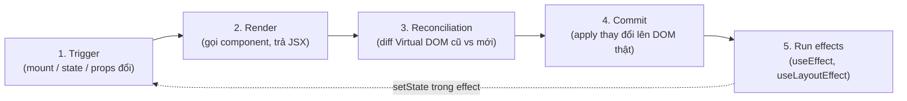
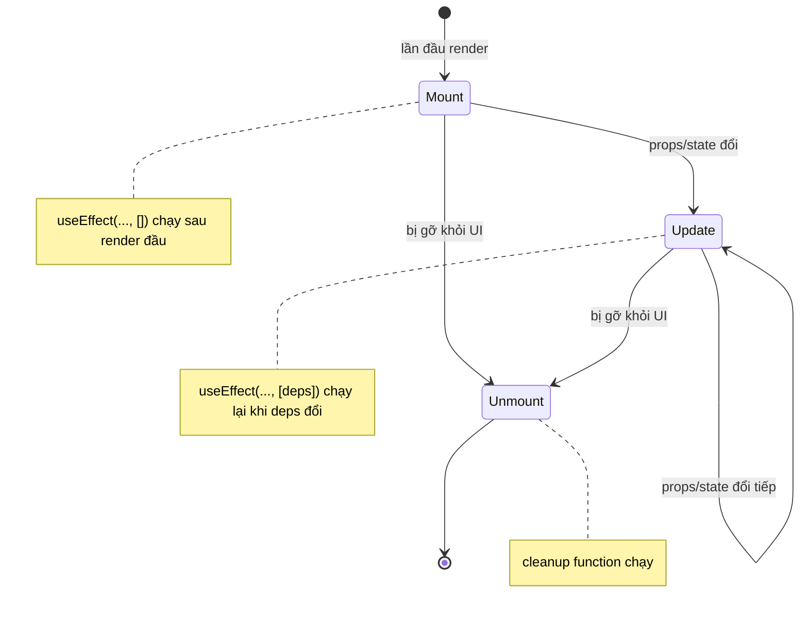

# Component Lifecycle

**Lifecycle** (vòng đời component) là chuỗi các giai đoạn mà một component trải qua: từ khi được tạo và hiển thị lần đầu (**mount** — gắn vào DOM), khi cập nhật do thay đổi state hoặc props (**update**), cho tới khi bị gỡ khỏi giao diện (**unmount** — gỡ khỏi DOM). Hiểu vòng đời giúp bạn biết khi nào component **render** (vẽ ra giao diện) và khi nào nên chạy các tác vụ phụ. Với component dạng hàm, ta điều khiển vòng đời này chủ yếu thông qua các hook.

[](pathname:///img/react/lifecycle.webp)

---

:::note[Ghi nhớ nhanh]

- ⭐ **Vòng đời gồm 3 giai đoạn** — `mount` (vừa hiện), `update` (props/state đổi), `unmount` (bị gỡ); component hàm điều khiển bằng `useEffect`.
- ⭐ **`useEffect` là công cụ đồng bộ, không phải lifecycle hook 1-1** — hãy tư duy "sync với hệ thống ngoài", `[]` chạy 1 lần, `[deps]` chạy lại khi deps đổi.
- **Luôn viết cleanup** trong effect (return function) để huỷ timer/subscription, tránh leak và bug khi remount.
- **Re-render ≠ update DOM** — React dùng reconciliation nên re-render thường rất rẻ; chỉ tối ưu (`memo`, `useMemo`, `useCallback`) khi đo được vấn đề thực sự.
- **Strict Mode (dev)** chạy component + effect 2 lần để lộ side effect thiếu cleanup; không nên tắt.

:::

---

## Mục lục

- [Vì sao cần vòng đời (lifecycle)?](#vì-sao-cần-vòng-đời-lifecycle)
- [Render flow](#render-flow)
- [3 giai đoạn lifecycle](#3-giai-đoạn-lifecycle)
- [Lifecycle với hooks](#lifecycle-với-hooks)
- [Re-render khi nào?](#re-render-khi-nào)
- [Strict Mode](#strict-mode)
- [Câu hỏi phỏng vấn](#câu-hỏi-phỏng-vấn)

---

## Vì sao cần vòng đời (lifecycle)?

**Vấn đề:** Component cần làm việc **ở đúng thời điểm**: gọi API ngay khi
vừa hiện, dọn dẹp (huỷ timer, gỡ listener) khi biến mất, chạy lại khi dữ
liệu đổi. Làm sai thời điểm → rò rỉ bộ nhớ (leak), gọi API thừa, lỗi.

```jsx
// Gọi API ngay trong thân component → chạy lại MỖI lần render → API thừa
function Profile({ userId }) {
  const data = fetch(`/api/users/${userId}`); // sai thời điểm!

  // Tạo timer nhưng không có chỗ dọn dẹp → leak khi component biến mất
  setInterval(() => console.log("tick"), 1000);

  return <p>{data}</p>;
}
```

**Giải pháp:** Vòng đời chia thành 3 thời điểm — **mount** (vừa hiện),
**update** (dữ liệu đổi), **unmount** (biến mất). Class dùng
`componentDidMount` / `componentDidUpdate` / `componentWillUnmount`;
component dạng hàm dùng `useEffect` (cùng cơ chế: chạy **sau render**, và
**cleanup** khi unmount hoặc khi deps đổi).

```jsx
function Profile({ userId }) {
  const [data, setData] = useState(null);

  useEffect(() => {
    let active = true;
    fetch(`/api/users/${userId}`) // chạy khi mount + khi userId đổi
      .then(r => r.json())
      .then(d => { if (active) setData(d); });

    const id = setInterval(() => console.log("tick"), 1000);

    // Cleanup: huỷ timer + bỏ qua kết quả cũ khi unmount/đổi deps
    return () => {
      active = false;
      clearInterval(id);
    };
  }, [userId]);

  return <p>{data?.name}</p>;
}
```

:::tip[Dùng thực tế]

- **Fetch khi mount**: lấy dữ liệu lần đầu component hiện ra
  (`useEffect(..., [])`).
- **Subscribe / unsubscribe**: mở kết nối websocket khi mount, đóng lại
  ở cleanup để tránh nhiều kết nối song song.
- **Set / clear interval**: tạo `setInterval` (đồng hồ, polling) và
  `clearInterval` ở cleanup để không rò rỉ.
- **Đồng bộ theo prop đổi**: khi `userId` (hoặc filter, query) đổi thì
  fetch lại đúng dữ liệu mới (`useEffect(..., [userId])`).

:::

---

## Render flow

Quá trình React render component:

```
1. Trigger (mount đầu hoặc state/props đổi)
2. Render (gọi function component, trả JSX)
3. Reconciliation (so virtual DOM cũ vs mới)
4. Commit (apply thay đổi lên DOM thật)
5. Run effects (useEffect, useLayoutEffect)
```

Hình dung luồng render — chú ý vòng lặp: nếu effect lại gọi `setState`,
chu trình bắt đầu lại từ đầu:



---

## 3 giai đoạn lifecycle

| Giai đoạn | Khi nào | Hook tương ứng |
|-----------|--------|---------------|
| **Mount** | Lần đầu render | `useEffect(() => {}, [])` |
| **Update** | Props/state đổi | `useEffect(() => {}, [deps])` |
| **Unmount** | Component bị remove | `useEffect` return cleanup |

Ba giai đoạn này nối tiếp nhau như một máy trạng thái — component có thể
update nhiều lần trước khi unmount:



---

## Lifecycle với hooks

```jsx
import { useState, useEffect } from "react";

function Timer() {
  const [count, setCount] = useState(0);

  useEffect(() => {
    console.log("Mounted hoặc updated");

    const id = setInterval(() => {
      setCount(c => c + 1);
    }, 1000);

    // Cleanup chạy khi: dep đổi (trước effect mới) hoặc unmount
    return () => {
      console.log("Cleanup");
      clearInterval(id);
    };
  }, []); // dep rỗng → chỉ chạy 1 lần khi mount

  return <p>Count: {count}</p>;
}
```

3 dạng dependency:

```jsx
// 1. Không có deps → chạy mỗi render
useEffect(() => { /* ... */ });

// 2. [] → chỉ chạy 1 lần (mount + unmount cleanup)
useEffect(() => { /* ... */ }, []);

// 3. [a, b] → chạy khi a hoặc b đổi
useEffect(() => { /* ... */ }, [a, b]);
```

:::info[Phân tích]

**`useEffect` không phải là lifecycle hook 1-1.** Nó là **synchronization
primitive** — đồng bộ component với hệ thống bên ngoài (subscription,
API, DOM).

Trong tài liệu React mới (react.dev), hướng dẫn nghĩ về effect:

- **Mục đích**: đồng bộ với cái gì? (data, subscription, third-party widget)
- **Cleanup**: khi nào ngừng đồng bộ?

Vd không đúng:

```jsx
// "Run on mount" — sai tư duy
useEffect(() => {
  trackPageView();
}, []);
```

Đúng tư duy:

```jsx
// "Sync analytics với page URL"
useEffect(() => {
  trackPageView(url);
}, [url]); // re-sync khi URL đổi
```

Nhiều bug "stale closure" và "effect chạy nhiều lần" sinh ra vì coi
`useEffect` là `componentDidMount`. Tư duy theo "sync with external
system" sẽ tránh được.

:::

---

## Re-render khi nào?

Component **re-render** khi:

1. **State đổi** — gọi `setState`.
2. **Props đổi** — parent re-render → child nhận prop mới.
3. **Parent re-render** — mặc định mọi child cũng re-render (trừ khi
   `React.memo`).
4. **Context value đổi** — mọi consumer của context đó re-render.

```jsx
function Parent() {
  const [count, setCount] = useState(0);
  return (
    <>
      <button onClick={() => setCount(c => c + 1)}>+</button>
      <Child />  {/* Child cũng re-render dù không nhận prop */}
    </>
  );
}
```

:::warning[Cần lưu ý]

**Không phải mọi re-render đều update DOM.** React dùng **reconciliation**
(diff virtual DOM cũ vs mới) — chỉ commit thay đổi thực sự lên DOM.

Vì vậy:

- Re-render thường **rất rẻ** (function chạy lại + diff).
- Đừng tối ưu (memo, useMemo, useCallback) **trừ khi có vấn đề thực sự**
  đo được.
- Code đơn giản, dễ đọc > tối ưu premature.

Khi đo bằng React DevTools Profiler, chỉ tối ưu component:
- Render lâu (> 16ms).
- Re-render thường xuyên.
- Là parent của subtree lớn.

:::

---

## Strict Mode

React Strict Mode (dev only) **chạy component, useEffect, state setter
2 lần** để phát hiện side effect ngoài ý muốn:

```jsx
import { StrictMode } from "react";

createRoot(document.getElementById("root")).render(
  <StrictMode>
    <App />
  </StrictMode>
);
```

Hệ quả:

- Console log xuất hiện 2 lần.
- `useEffect` chạy → cleanup → chạy lại.

Lý do: trong React 18+ với offscreen rendering và Server Components,
component có thể **mount/unmount nhiều lần**. Strict Mode mô phỏng để
buộc dev viết effect đúng.

:::info[Phân tích]

**Strict Mode test cleanup đúng:**

```jsx
// Tệ — không cleanup → strict mode lộ bug
useEffect(() => {
  const sub = api.subscribe();
  // Quên unsubscribe
}, []);

// Strict mode mount lần 1 → subscribe (1)
// Strict mode unmount → KHÔNG cleanup
// Strict mode mount lần 2 → subscribe (2) → 2 subscription chạy song song!

// Tốt — có cleanup
useEffect(() => {
  const sub = api.subscribe();
  return () => sub.unsubscribe();
}, []);
```

Sau strict mode unmount → cleanup hủy sub đầu → mount lại tạo sub mới
→ chỉ 1 sub active.

Đây là **lý do React khuyên LUÔN có cleanup** trong effect — production
cũng có thể remount component (React Compiler, offscreen, fast refresh).

Tắt Strict Mode trong dev là **sai** — nó bảo vệ bạn khỏi bug production
lúc nào không hay.

:::

:::tip[Mẹo]

**Debug re-render thừa**:

1. Cài [React DevTools](https://react.dev/learn/react-developer-tools).
2. Mở tab **Profiler**.
3. Click "Record" → tương tác app → "Stop".
4. Xem flame chart — component nào render lâu, render bao nhiêu lần.
5. Highlight Updates (cài đặt) — tô màu component khi re-render.

Pattern phổ biến gây re-render thừa:

- Object/array literal làm prop: `<X opts={{ a: 1 }} />` → mỗi render
  tạo object mới.
- Function inline: `onClick={() => fn()}` → mỗi render function mới.
- Context value object: `<Ctx.Provider value={{ ... }}>` → toàn bộ
  consumer re-render.

Fix bằng `useMemo`, `useCallback` — nhưng **chỉ khi đo có vấn đề**.

:::

---

## Câu hỏi phỏng vấn

Những câu thường gặp về chủ đề này. Tự trả lời trước, rồi bấm **Xem đáp án** để đối chiếu.

**1. Một component React đi qua những giai đoạn nào trong vòng đời của nó?**

<details className="qa">
<summary>Xem đáp án</summary>

Ba giai đoạn:

- **Mount** — component được tạo và gắn vào DOM lần đầu. React gọi hàm component, dựng virtual DOM, commit lên DOM thật, rồi chạy effect. Hook tương ứng: `useEffect(() => {}, [])`.
- **Update** — props hoặc state đổi (hoặc parent re-render, hoặc context value đổi). React gọi lại hàm component, diff virtual DOM cũ/mới, chỉ commit phần khác biệt. Hook tương ứng: `useEffect(() => {}, [deps])` — chạy lại khi deps đổi.
- **Unmount** — component bị gỡ khỏi UI. React chạy **cleanup function** (phần `return` trong effect) để huỷ timer, gỡ listener, đóng subscription.

Component có thể update nhiều lần trước khi unmount. Với component dạng hàm, ta không có ba hook riêng biệt như class (`componentDidMount`/`componentDidUpdate`/`componentWillUnmount`) mà dùng chung `useEffect` — và nên tư duy nó là công cụ **đồng bộ với hệ thống ngoài**, không phải ánh xạ 1-1 với ba giai đoạn trên.

</details>

**2. Phân biệt `render phase` và `commit phase`. React được phép làm gì và không được làm gì ở mỗi phase?**

<details className="qa">
<summary>Xem đáp án</summary>

| | Render phase | Commit phase |
|---|---|---|
| Việc làm | Gọi hàm component, trả JSX, diff virtual DOM (reconciliation) | Apply thay đổi lên DOM thật, rồi chạy effect |
| Tính chất | **Pure**, không side effect | Được phép side effect |
| Có thể bị huỷ / chạy lại? | Có (Strict Mode chạy 2 lần, concurrent có thể bỏ dở) | Không — chạy một lần, đồng bộ |
| Truy cập DOM thật? | Không (ref chưa gắn) | Có (ref đã gắn) |

Trong render phase **không được** gọi API, ghi vào biến ngoài, mutate props/state, `console.log` gây hiệu ứng phụ, hay đọc/ghi DOM — vì React có thể gọi lại hàm component nhiều lần hoặc vứt bỏ kết quả. Mọi side effect phải nằm ở commit phase: trong `useEffect` / `useLayoutEffect`, hoặc trong event handler.

</details>

**3. Vì sao hàm component phải là `pure` — không được gọi API hay sửa biến bên ngoài ngay trong thân hàm?**

<details className="qa">
<summary>Xem đáp án</summary>

Vì React coi hàm component là một **hàm thuần**: cùng props + state phải cho ra cùng JSX, không để lại dấu vết gì bên ngoài. React tự quyết định gọi hàm đó lúc nào và bao nhiêu lần — Strict Mode gọi 2 lần ở dev, concurrent rendering có thể render dở rồi bỏ, React Compiler có thể memo hoá kết quả.

```jsx
// Sai: fetch chạy lại MỖI lần render → gọi API thừa
function Profile({ userId }) {
  const data = fetch(`/api/users/${userId}`);
  setInterval(() => console.log("tick"), 1000); // leak, không có chỗ dọn
  return <p>{data}</p>;
}
```

Hậu quả khi không pure: gọi API thừa, timer chồng chất không được dọn, kết quả khác nhau giữa các lần render, bug chỉ hiện ở dev (do Strict Mode) hoặc chỉ hiện ở production. Giải pháp: đẩy side effect vào `useEffect` (đồng bộ với hệ thống ngoài, kèm cleanup) hoặc vào event handler (phản ứng với hành động người dùng).

</details>

**4. Những nguyên nhân nào khiến một component `re-render`? Đổi `props` có phải nguyên nhân duy nhất không?**

<details className="qa">
<summary>Xem đáp án</summary>

Không — props chỉ là một trong bốn nguyên nhân:

1. **State đổi** — gọi `setState` / setter của `useState` / dispatch của `useReducer` với giá trị mới.
2. **Props đổi** — parent render ra JSX với prop mới.
3. **Parent re-render** — mặc định mọi child cũng render lại, **kể cả khi không nhận prop nào**, trừ khi được bọc `React.memo`.
4. **Context value đổi** — mọi component đang `useContext` cho context đó re-render, bất kể memo.

```jsx
function Parent() {
  const [count, setCount] = useState(0);
  return (
    <>
      <button onClick={() => setCount(c => c + 1)}>+</button>
      <Child />  {/* Child re-render dù không nhận prop */}
    </>
  );
}
```

Lưu ý: re-render **không đồng nghĩa với update DOM**. React diff virtual DOM và chỉ commit phần thực sự khác — nên re-render thường rất rẻ. Chỉ tối ưu khi đo được vấn đề bằng React DevTools Profiler.

</details>

**5. Component cha re-render thì con có bắt buộc re-render theo không? Làm sao để chặn?**

<details className="qa">
<summary>Xem đáp án</summary>

Mặc định **có** — React render lại toàn bộ subtree bên dưới, kể cả child không nhận prop nào. Cách chặn:

- **`React.memo(Child)`** — so sánh props nông (shallow) giữa hai lần render; giống nhau thì bỏ qua render.
- Nhưng memo chỉ hiệu quả khi **props ổn định về tham chiếu**. Object/array/function tạo mới mỗi render sẽ phá vỡ memo:

```jsx
<Child opts={{ a: 1 }} onClick={() => fn()} />
// mỗi render tạo object và function mới → memo luôn thấy "props đổi"
```

Do đó memo thường phải đi kèm `useMemo` (cho object/array) và `useCallback` (cho function).

- **Đưa state xuống thấp hơn** hoặc **dùng `children` làm prop** — phần JSX truyền qua `children` được tạo ở parent của parent nên không bị render lại.

Quan trọng: đừng memo hoá mặc định. Re-render thường rẻ; chỉ tối ưu component render lâu (> 16ms), render rất thường xuyên, hoặc là gốc của một subtree lớn.

</details>

**6. `useEffect` với mảng dependency rỗng `[]`, có dependency, và không truyền dependency — khác nhau thế nào?**

<details className="qa">
<summary>Xem đáp án</summary>

```jsx
// 1. Không có deps → chạy sau MỖI lần render
useEffect(() => { /* ... */ });

// 2. [] → chỉ chạy 1 lần sau mount, cleanup khi unmount
useEffect(() => { /* ... */ }, []);

// 3. [a, b] → chạy khi mount và mỗi khi a hoặc b đổi
useEffect(() => { /* ... */ }, [a, b]);
```

| Dạng | Chạy khi | Cleanup chạy khi |
|---|---|---|
| Không deps | Sau mọi render | Trước mỗi lần chạy lại + unmount |
| `[]` | Sau render đầu tiên | Unmount |
| `[a, b]` | Mount + khi `a`/`b` đổi (so sánh `Object.is`) | Trước lần chạy tiếp + unmount |

React so sánh từng phần tử deps bằng `Object.is`, nên object/array/function tạo mới mỗi render sẽ luôn được coi là "đổi". Đừng nghĩ `[]` là "componentDidMount" — hãy hỏi *effect này đồng bộ với cái gì*, rồi deps tự nhiên là những giá trị mà việc đồng bộ phụ thuộc vào.

</details>

**7. Hàm `return` bên trong `useEffect` chạy vào lúc nào? Nêu một trường hợp quên viết nó sẽ gây rò rỉ bộ nhớ.**

<details className="qa">
<summary>Xem đáp án</summary>

Cleanup function chạy ở hai thời điểm: **trước khi effect chạy lại** (khi dependency đổi) và **khi component unmount**. Trong Strict Mode ở dev, nó còn chạy thêm một lần giữa hai lần mount giả lập.

```jsx
useEffect(() => {
  const id = setInterval(() => setCount(c => c + 1), 1000);
  return () => clearInterval(id); // thiếu dòng này → leak
}, []);
```

Nếu quên `clearInterval`, component unmount nhưng timer vẫn chạy: nó giữ tham chiếu tới closure (và cả state setter) nên bộ nhớ không được giải phóng, đồng thời gọi `setState` trên component đã chết. Điều hướng qua lại vài lần là có hàng loạt interval chạy song song.

Các trường hợp tương tự: `addEventListener` mà không `removeEventListener`, websocket/subscription không `unsubscribe`, `AbortController` không `abort`. Đây là lý do React khuyên **luôn viết cleanup** — production cũng có thể remount component (fast refresh, offscreen rendering).

</details>

**8. `useEffect` và `useLayoutEffect` chạy ở thời điểm khác nhau ra sao? Khi nào buộc phải dùng `useLayoutEffect`?**

<details className="qa">
<summary>Xem đáp án</summary>

| | `useEffect` | `useLayoutEffect` |
|---|---|---|
| Thời điểm | **Sau** khi browser đã paint | **Sau** commit DOM, **trước** khi browser paint |
| Tính chất | Bất đồng bộ, không chặn paint | Đồng bộ, chặn paint |
| Ảnh hưởng hiệu năng | Không làm chậm hiển thị | Chậm sẽ làm giật/đứng hình |
| SSR | Bỏ qua trên server | Cảnh báo trên server |

Dùng `useLayoutEffect` khi bạn cần **đo DOM rồi chỉnh lại ngay** mà không muốn người dùng thấy nhấp nháy: đo kích thước phần tử để đặt vị trí tooltip/popover, đồng bộ scroll position, đo chiều cao để tính layout. Vì nó chạy trước paint nên người dùng chỉ thấy kết quả cuối.

Mặc định vẫn nên dùng `useEffect` — gọi API, subscription, analytics, timer đều thuộc nhóm này. Chỉ đổi sang `useLayoutEffect` khi thấy hiện tượng nhấp nháy do đo-rồi-sửa DOM.

</details>

**9. Ánh xạ `componentDidMount`, `componentDidUpdate`, `componentWillUnmount` sang hook tương đương. Chỗ nào không ánh xạ được 1-1?**

<details className="qa">
<summary>Xem đáp án</summary>

```jsx
// componentDidMount
useEffect(() => { /* ... */ }, []);

// componentDidUpdate (khi deps đổi)
useEffect(() => { /* ... */ }, [deps]);

// componentWillUnmount
useEffect(() => {
  return () => { /* dọn dẹp */ };
}, []);
```

Những chỗ **không** ánh xạ 1-1:

- `componentDidUpdate` nhận `prevProps` / `prevState`; `useEffect` không có. Muốn so sánh với giá trị cũ phải tự lưu bằng `useRef`.
- `componentDidUpdate` **không** chạy ở lần mount, còn `useEffect(..., [deps])` **có** chạy ở mount.
- Class tách rõ mount/update/unmount, còn một `useEffect` gộp cả ba theo trục "đồng bộ / ngừng đồng bộ". Ngược lại, hooks cho phép chia nhiều effect theo *mối quan tâm* thay vì theo *thời điểm* — điều class không làm được.
- `componentWillUnmount` chỉ chạy một lần khi huỷ, còn cleanup của `useEffect` chạy cả giữa các lần deps đổi.

Kết luận: đừng cố dịch từng hàm class sang hook, hãy nghĩ theo "effect này đồng bộ với hệ thống nào".

</details>

**10. Vì sao `StrictMode` cố tình gọi hàm component và chạy effect hai lần ở môi trường development? Nó giúp phát hiện loại bug nào?**

<details className="qa">
<summary>Xem đáp án</summary>

Strict Mode (chỉ ở dev) gọi hàm component, `useState` initializer và effect **hai lần**, với chu trình `mount → cleanup → mount lại`. Mục đích là mô phỏng việc component có thể bị mount/unmount nhiều lần trong React 18+ (offscreen rendering, fast refresh, tương lai là các tính năng như state khôi phục), để lộ bug ngay trên máy dev thay vì trên production.

Nó phát hiện hai nhóm bug:

- **Hàm component không pure** — nếu thân hàm sửa biến ngoài, đẩy phần tử vào mảng dùng chung, hay gọi API, chạy 2 lần sẽ cho kết quả sai rõ ràng.
- **Effect thiếu cleanup:**

```jsx
useEffect(() => {
  const sub = api.subscribe(); // quên unsubscribe
}, []);
// mount(1) → unmount (không cleanup) → mount(2)
// ⇒ 2 subscription chạy song song
```

Viết cleanup đúng thì subscription đầu bị huỷ, chỉ còn một cái sống. Tắt Strict Mode là sai cách — nó đang bảo vệ bạn khỏi bug production.

</details>

**11. Code chạy đúng ở production nhưng ở dev thì gọi API hai lần — bạn xử lý thế nào, và có nên tắt `StrictMode` không?**

<details className="qa">
<summary>Xem đáp án</summary>

Không tắt `StrictMode`. Gọi hai lần ở dev là **hành vi cố ý** để kiểm tra effect có chịu được remount hay không. Nếu hai lần gọi gây ra lỗi thật (dữ liệu sai, ghi trùng), thì bug nằm ở effect chứ không ở Strict Mode.

Cách xử lý đúng là viết effect chịu được việc chạy lại:

```jsx
useEffect(() => {
  const ctrl = new AbortController();
  fetch(`/api/users/${userId}`, { signal: ctrl.signal })
    .then(r => r.json())
    .then(setData)
    .catch(e => { if (e.name !== "AbortError") throw e; });
  return () => ctrl.abort(); // request đầu bị huỷ khi remount
}, [userId]);
```

Hoặc dùng cờ `ignore` để bỏ qua kết quả của lần gọi cũ. Với các side effect **không idempotent** (thanh toán, gửi email, ghi log đơn hàng) thì chúng không nên nằm trong `useEffect` ngay từ đầu — hãy đặt trong event handler. Thực tế, dùng thư viện data-fetching (React Query, SWR, RTK Query) sẽ tự dedupe request và giải quyết luôn vấn đề này.

</details>

**12. `setState` bên trong `useEffect` không có dependency array dẫn tới hậu quả gì?**

<details className="qa">
<summary>Xem đáp án</summary>

Vòng lặp vô hạn. Effect không có deps chạy sau **mọi** render; `setState` bên trong lại kích hoạt render mới; render mới lại chạy effect — chu trình `render → effect → setState → render` lặp mãi cho tới khi React ném lỗi "Too many re-renders" hoặc tab bị treo.

```jsx
// Sai: lặp vô hạn
useEffect(() => {
  setCount(count + 1);
});
```

Cách xử lý, theo thứ tự ưu tiên:

- **Không cần effect** — nếu giá trị tính được từ props/state hiện có thì tính thẳng trong lúc render (derived state), đừng lưu vào state.
- Thêm **dependency array** đúng để effect chỉ chạy khi thứ nó đồng bộ thực sự đổi.
- Nếu buộc phải set trong effect, dùng **updater function** (`setCount(c => c + 1)`) để không phụ thuộc giá trị cũ, và đặt điều kiện thoát.

Lưu ý: React sẽ bỏ qua re-render nếu `setState` nhận đúng giá trị cũ (so sánh `Object.is`), nên đôi khi vòng lặp "tự dừng" — che giấu lỗi cho tới khi giá trị là object mới mỗi lần.

</details>

**13. Vì sao đổi `key` của một component lại khiến nó bị `unmount` rồi `mount` lại, và state cũ mất sạch? Khi nào nên tận dụng điều này?**

<details className="qa">
<summary>Xem đáp án</summary>

Trong reconciliation, React so khớp phần tử cũ và mới theo **vị trí + type + key**. Key khác nghĩa là "đây là một phần tử khác" — React không tái sử dụng instance cũ mà huỷ nó (chạy cleanup của effect) rồi tạo instance mới. State và ref sống trong instance nên biến mất theo.

```jsx
// Đổi userId → Profile bị reset hoàn toàn, form nhập dở bị xoá
<Profile key={userId} userId={userId} />
```

Khi nào nên tận dụng: khi bạn muốn **reset state theo một định danh**, thay vì viết `useEffect` để tự dọn state mỗi khi prop đổi.

- Form chỉnh sửa hồ sơ: đổi sang user khác thì mọi input phải trống trở lại.
- Reset một widget bên thứ ba, một canvas, một chat panel khi đổi phòng.
- Buộc remount để chạy lại animation vào (mount animation).

Nhưng đừng lạm dụng: remount tốn hơn re-render, và trong danh sách thì key phải **ổn định và duy nhất** — dùng index làm key rồi sắp xếp lại danh sách sẽ gây remount ngoài ý muốn.

</details>

**14. Fetch dữ liệu trong `useEffect` có thể gặp `race condition` ra sao? Nêu cách xử lý bằng cờ `ignore` hoặc `AbortController`.**

<details className="qa">
<summary>Xem đáp án</summary>

Race condition xảy ra khi deps đổi nhanh: effect chạy lần 1 cho `userId = 1`, chưa kịp về thì deps đổi thành `2` và effect chạy lần 2. Nếu response của request 1 về **sau** request 2, `setData` của nó sẽ ghi đè dữ liệu đúng — UI hiện thông tin của user 1 trong khi đang xem user 2.

Cách 1 — cờ `ignore` (bỏ qua kết quả cũ):

```jsx
useEffect(() => {
  let active = true;
  fetch(`/api/users/${userId}`)
    .then(r => r.json())
    .then(d => { if (active) setData(d); });
  return () => { active = false; };
}, [userId]);
```

Cách 2 — `AbortController` (huỷ hẳn request, tiết kiệm băng thông):

```jsx
useEffect(() => {
  const ctrl = new AbortController();
  fetch(url, { signal: ctrl.signal })
    .then(r => r.json())
    .then(setData)
    .catch(e => { if (e.name !== "AbortError") setError(e); });
  return () => ctrl.abort();
}, [url]);
```

Cả hai đều dựa vào cleanup function. Trong dự án thật, dùng React Query/SWR sẽ xử lý sẵn race condition, cache và dedupe.

</details>

**15. `stale closure` là gì? Cho một ví dụ với `setInterval` bên trong `useEffect` và cách khắc phục.**

<details className="qa">
<summary>Xem đáp án</summary>

`Stale closure` là khi một hàm được tạo ở lần render cũ vẫn "nhớ" giá trị props/state của **lần render đó**, nên đọc ra dữ liệu đã cũ khi chạy về sau.

```jsx
const [count, setCount] = useState(0);

useEffect(() => {
  const id = setInterval(() => {
    setCount(count + 1); // count luôn là 0 — closure của render đầu
  }, 1000);
  return () => clearInterval(id);
}, []); // deps rỗng → callback không bao giờ được tạo lại
```

Kết quả: count đứng ở 1 mãi mãi, vì mỗi giây đều tính `0 + 1`.

Cách khắc phục:

- **Updater function** — không đọc state từ closure nữa:

```jsx
setCount(c => c + 1); // luôn nhận giá trị mới nhất
```

- **Khai báo đủ dependency** (`[count]`) để effect tạo lại interval với closure mới — nhưng interval bị reset mỗi lần.
- **`useRef`** giữ giá trị/callback mới nhất, effect đọc qua `ref.current`.

Bật ESLint rule `react-hooks/exhaustive-deps` là cách phòng bug này hiệu quả nhất.

</details>

**16. React 18 gộp nhiều `setState` thành một lần re-render (`automatic batching`). Điều này khác gì so với React 17?**

<details className="qa">
<summary>Xem đáp án</summary>

**Batching** là gộp nhiều lần cập nhật state thành **một** lần re-render để tránh render thừa.

| | React 17 | React 18 |
|---|---|---|
| Trong React event handler | Có batching | Có batching |
| Trong `setTimeout` / `Promise.then` | **Không** — mỗi `setState` một render | Có |
| Trong callback của `fetch`, native event listener | **Không** | Có |

```jsx
function handleClick() {
  setCount(c => c + 1);
  setFlag(f => !f);
  // React 17 & 18: 1 lần re-render
}

setTimeout(() => {
  setCount(c => c + 1);
  setFlag(f => !f);
  // React 17: 2 lần re-render — React 18: 1 lần
}, 0);
```

React 18 gọi đây là **automatic batching** vì nó áp dụng cho mọi nơi, không chỉ trong event handler của React. Điều kiện: dùng `createRoot` (root API mới); dùng `ReactDOM.render` cũ thì vẫn giữ hành vi React 17. Nếu cần render ngay lập tức sau một update (hiếm, thường để đo DOM), có thể bọc bằng `flushSync`.

</details>
