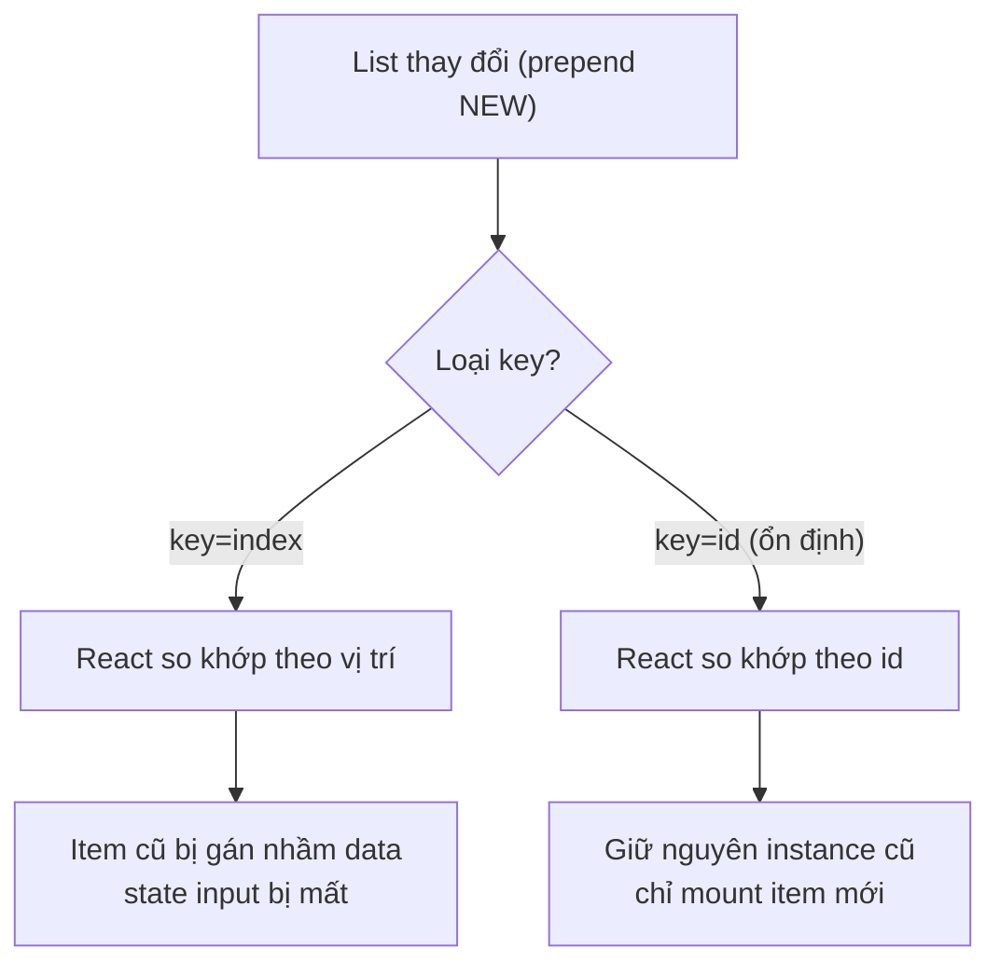

# Lists and Keys

Trong React, để hiển thị một **list** (danh sách nhiều phần tử), ta thường lặp qua mảng dữ liệu và trả về một component cho mỗi phần tử. Mỗi phần tử cần một **key** (khóa định danh duy nhất) để React nhận biết phần tử nào đã thêm, sửa hay xóa, từ đó cập nhật giao diện hiệu quả. Chọn key đúng giúp tránh lỗi hiển thị và tăng hiệu năng khi danh sách thay đổi.

---

:::note[Ghi nhớ nhanh]

- ⭐ **`key` giúp React nhận diện từng phần tử qua các lần render** để reconcile đúng, giữ nguyên state/instance khi list thêm, xoá hay đảo thứ tự.
- ⭐ **Ưu tiên id ổn định từ data** (DB id, UUID); chỉ dùng `index` cho list tĩnh không reorder/insert/delete giữa.
- **Key sai là lỗi correctness**, không chỉ hiệu năng — dùng `index` khi list động sẽ gán nhầm data, mất state input.
- **Không dùng `Math.random()` làm key** (đổi mỗi render → remount toàn bộ); key phải đặt trên element trả thẳng từ `.map`.
- **Fragment cần key** thì dùng `<Fragment key={...}>`; key chỉ cần unique trong cùng một `.map`, khi merge nhiều list nên thêm prefix.

:::

---

## Mục lục

- [Vì sao cần key khi render danh sách?](#vì-sao-cần-key-khi-render-danh-sách)
- [Render danh sách](#render-danh-sách)
- [Tại sao cần key?](#tại-sao-cần-key)
- [Chọn key đúng](#chọn-key-đúng)
- [Key trong Fragment](#key-trong-fragment)
- [Anti-pattern](#anti-pattern)
- [Câu hỏi phỏng vấn](#câu-hỏi-phỏng-vấn)

---

## Vì sao cần key khi render danh sách?

**Vấn đề:**

```jsx
// Render mảng thành nhiều element, không có key ổn định
function TodoList({ todos }) {
  return (
    <ul>
      {todos.map((todo, i) => (
        <li key={i}>
          <input defaultValue={todo.text} />
        </li>
      ))}
    </ul>
  );
}
```

Khi list thay đổi (thêm/xoá/sắp xếp), React không biết phần tử nào là phần
tử nào → re-render sai, mất state của input, hiệu năng kém. Dùng `index`
làm key gây bug ngay khi thứ tự đổi: item ở vị trí cũ bị gán nhầm dữ liệu
của item khác.

**Giải pháp:**

```jsx
// key ổn định & duy nhất (thường là id) → React nhận diện đúng từng phần tử
function TodoList({ todos }) {
  return (
    <ul>
      {todos.map(todo => (
        <li key={todo.id}>
          <input defaultValue={todo.text} />
        </li>
      ))}
    </ul>
  );
}
```

`key` duy nhất giúp React **nhận diện** từng phần tử qua các lần render để
reconcile chính xác, giữ đúng state của từng instance dù list thêm, xoá hay
đảo thứ tự.

Sơ đồ dưới đây so sánh reconciliation khi prepend một item với `key=index` và `key=id`:



:::tip[Dùng thực tế]

- **Render danh sách từ API**: dùng `key={item.id}` (id từ database) để
  React khớp đúng phần tử khi data cập nhật.
- **Todo list thêm/xoá**: key ổn định giúp giữ nguyên state các todo còn
  lại khi xoá một item ở giữa.
- **Bảng có sắp xếp/lọc**: khi sort hay filter, key theo id giữ đúng state
  từng dòng (checkbox, input) thay vì gán nhầm.
- **Tránh dùng index** làm key khi list động (reorder/insert/delete giữa) —
  chỉ dùng index cho list tĩnh, không đổi thứ tự.

:::

---

## Render danh sách

Dùng `.map()` trả về array element:

```jsx
function ProductList({ products }) {
  return (
    <ul>
      {products.map(product => (
        <li key={product.id}>{product.name}</li>
      ))}
    </ul>
  );
}
```

Có thể `.filter()` + `.map()` chain:

```jsx
{products
  .filter(p => p.inStock)
  .map(p => <ProductCard key={p.id} product={p} />)
}
```

---

## Tại sao cần key?

React dùng **key** để **identify** element giữa các lần render. Không có
key → React phải so sánh theo index → re-render thừa và mất state.

Vd: list với input.

```jsx
const [items, setItems] = useState(["a", "b", "c"]);

return items.map((item, i) => (
  <input key={i} defaultValue={item} />
));
```

**Khi prepend item mới** vào đầu list:

```jsx
setItems(["NEW", "a", "b", "c"]);
```

Với `key={index}`:

- Input ở index 0: defaultValue "a" → đổi thành "NEW"
- Input ở index 1: "b" → "a"
- ... → user gõ vào input bị mất hết text

Với `key={item.id}` (id ổn định):

- Input có id mới: tạo mới, defaultValue "NEW"
- Input id "a", "b", "c": **giữ nguyên** instance + state user gõ

:::info[Phân tích]

**Cơ chế reconciliation với key:**

React so sánh array cũ và mới qua **key**:

- Key giống nhau → **giữ nguyên** component instance (state, focus, scroll).
- Key mới → **mount** component mới.
- Key biến mất → **unmount** component.

Không có key → React fallback dùng index → coi mọi item như "cùng instance",
chỉ update props. Hậu quả:

- DOM input vẫn cùng element → state hệ điều hành (caret, IME...) còn nguyên.
- Component state (`useState`) bị nhầm.
- Effect không re-run khi cần.

→ Key đúng là **yêu cầu correctness**, không chỉ performance.

:::

---

## Chọn key đúng

**Ưu tiên** (tốt nhất xuống tệ nhất):

1. **ID từ data** (id từ database, UUID):

```jsx
{users.map(user => <li key={user.id}>{user.name}</li>)}
```

2. **Hash của nội dung** (nếu data không có id, không reorder):

```jsx
{tags.map(tag => <Tag key={tag} name={tag} />)}
```

3. **Index** (chỉ khi list **không reorder, không insert/delete giữa**):

```jsx
{staticList.map((item, i) => <li key={i}>{item}</li>)}
```

:::warning[Cần lưu ý]

**Khi nào KHÔNG được dùng `key={index}`:**

- List có thể **reorder** (sort, drag-drop).
- List có thể **insert/delete giữa** (không chỉ append/pop cuối).
- Item có **state nội bộ** (input, form, animation).

Đa số trường hợp gặp bug với key index là khi list "động". Quy tắc:
**nếu order item có thể đổi → tuyệt đối không dùng index làm key**.

:::

---

## Key trong Fragment

`<>...</>` không nhận `key`. Dùng `<Fragment>` đầy đủ:

```jsx
import { Fragment } from "react";

{items.map(item => (
  <Fragment key={item.id}>
    <dt>{item.term}</dt>
    <dd>{item.desc}</dd>
  </Fragment>
))}
```

---

## Anti-pattern

**1. Generate key bằng `Math.random()`**:

```jsx
// SAI — key đổi mỗi render → toàn bộ remount
{items.map(item => <li key={Math.random()}>{item.name}</li>)}
```

Bug:
- Input mất focus liên tục.
- Animation reset.
- Performance kém.

**2. Key nằm trong child, không ở element của `.map`**:

```jsx
// Sai — key trên div bên trong
{items.map(item => (
  <li>
    <div key={item.id}>{item.name}</div>
  </li>
))}

// Đúng — key trên element thẳng từ map
{items.map(item => (
  <li key={item.id}>
    <div>{item.name}</div>
  </li>
))}
```

**3. Key trùng**:

```jsx
{items.map(item => (
  <li key={item.category}>{item.name}</li>
))}
// Nhiều item cùng category → key trùng → React warning + bug
```

:::tip[Mẹo]

**Composite key khi không có id duy nhất**:

```jsx
{items.map((item, i) => (
  <li key={`${item.category}-${item.name}-${i}`}>
    {item.name}
  </li>
))}
```

Hoặc thêm `useId` cho client-generated ID (nhưng `useId` không ổn định
giữa render → không phù hợp làm key của data).

Tốt nhất: **đảm bảo data có id từ nguồn** (DB autoincrement, UUID, hash
content).

:::

:::info[Phân tích]

**Key chỉ unique trong cùng một `.map`** — không phải global:

```jsx
function App() {
  return (
    <>
      {usersA.map(u => <UserCard key={u.id} user={u} />)}
      {usersB.map(u => <UserCard key={u.id} user={u} />)}
    </>
  );
}
```

Hai list khác nhau → có thể trùng `id` nhưng React không nhầm vì chúng
thuộc 2 list riêng.

Nhưng nếu **merge thành 1 list**:

```jsx
{[...usersA, ...usersB].map(u => <UserCard key={u.id} user={u} />)}
// Nếu id trùng → bug
```

→ Prefix key khi merge: ``key={`a-${u.id}`}`` cho list A.

:::

---

## Câu hỏi phỏng vấn

Những câu thường gặp về chủ đề này. Tự trả lời trước, rồi đối chiếu lại với nội dung phía trên.

1. `key` trong React dùng để làm gì, và vì sao khi render danh sách lại bắt buộc phải có nó?
2. `key` có phải là một prop bình thường không — component con có đọc được `props.key` không?
3. `key` cần duy nhất trong phạm vi nào: toàn ứng dụng, toàn component, hay chỉ giữa các phần tử anh em (`sibling`)?
4. Điều gì xảy ra nếu render một mảng mà không truyền `key`? React cảnh báo gì và fallback theo cơ chế nào?
5. Giải thích cơ chế `reconciliation`: React so khớp element cũ và mới trong một list dựa trên cái gì?
6. Vì sao KHÔNG nên dùng `index` của mảng làm `key`? Hãy mô tả một bug cụ thể sinh ra từ việc này.
7. Dùng `index` làm `key` là vấn đề `correctness` hay chỉ là vấn đề `performance`? Vì sao?
8. Trong trường hợp nào thì dùng `index` làm `key` vẫn chấp nhận được? Nêu đủ các điều kiện.
9. Cho một todo list có checkbox và `key={index}`: khi xoá item đầu tiên, trạng thái checkbox bị sai như thế nào? Giải thích từng bước.
10. Vì sao dùng `Math.random()` hay `Date.now()` làm `key` là anti-pattern? Hậu quả cụ thể với focus và animation là gì?
11. `useId` có dùng làm `key` cho item của một danh sách data được không? Vì sao?
12. Đặt `key` sai vị trí — trên element con thay vì element ngoài cùng trả về từ `.map` — thì có tác dụng không? Vì sao?
13. Khi render danh sách bằng `Fragment`, vì sao không dùng được cú pháp rút gọn mà phải dùng dạng đầy đủ `Fragment`?
14. Điều gì xảy ra khi hai phần tử anh em có `key` trùng nhau?
15. Khi merge hai mảng từ hai nguồn khác nhau thành một list, làm sao tránh trùng `key`?
16. Nếu data không có id duy nhất, có những chiến lược nào để sinh `key` ổn định? Đánh đổi của từng cách là gì?
17. Đổi `key` của một component (dù giữ nguyên kiểu component) dẫn tới điều gì? Có thể tận dụng để reset state không, và khi nào nên hoặc không nên?
18. So sánh chi phí thao tác DOM khi reorder một list với `key` ổn định so với `key={index}`.
19. `key` ảnh hưởng thế nào tới việc React giữ hay huỷ DOM node, focus, vị trí scroll và giá trị của `uncontrolled input`?
20. Với danh sách rất lớn, ngoài việc chọn `key` đúng còn kỹ thuật nào để tối ưu render (ví dụ `virtualization`)?
