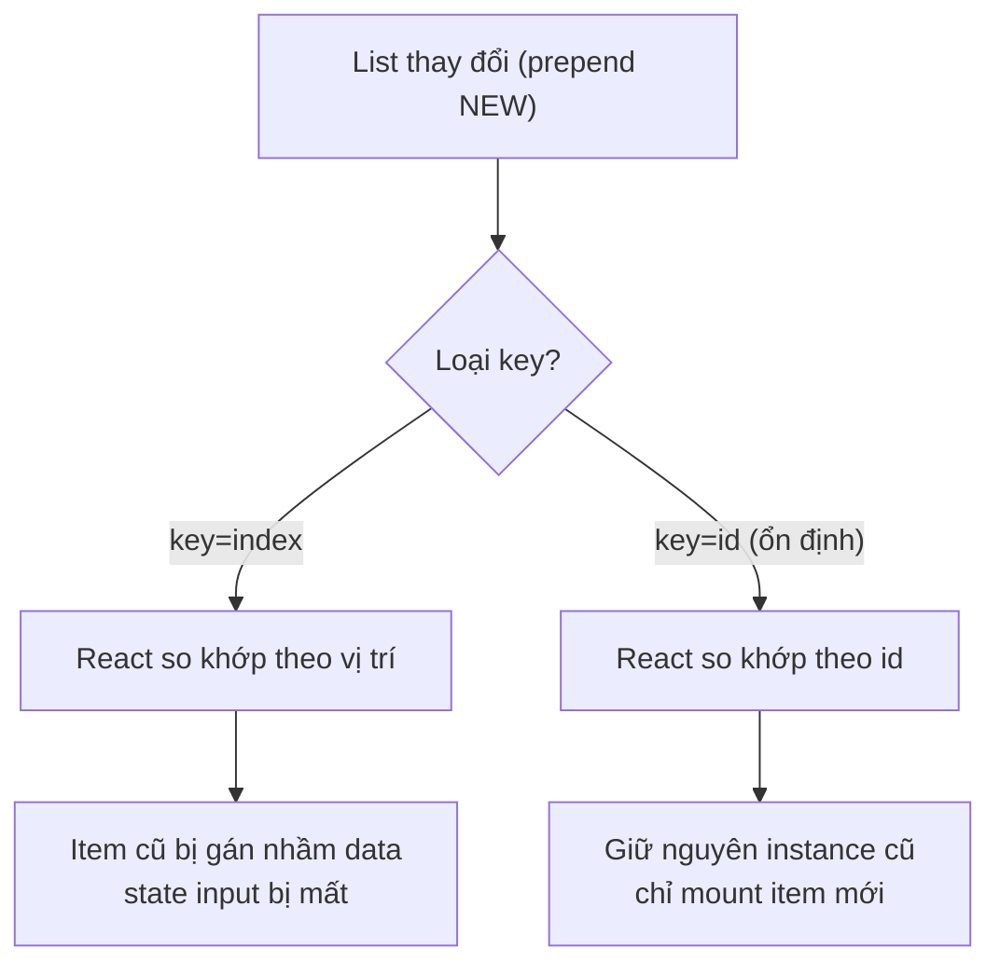

# Lists and Keys

Trong React, để hiển thị một **list** (danh sách nhiều phần tử), ta thường lặp qua mảng dữ liệu và trả về một component cho mỗi phần tử. Mỗi phần tử cần một **key** (khóa định danh duy nhất) để React nhận biết phần tử nào đã thêm, sửa hay xóa, từ đó cập nhật giao diện hiệu quả. Chọn key đúng giúp tránh lỗi hiển thị và tăng hiệu năng khi danh sách thay đổi.

[](pathname:///img/react/lists-keys.webp)

---

:::note[Ghi nhớ nhanh]

- ⭐ **`key` giúp React nhận diện từng phần tử qua các lần render** để reconcile đúng, giữ nguyên state/instance khi list thêm, xoá hay đảo thứ tự.
- ⭐ **Ưu tiên id ổn định từ data** (DB id, UUID); chỉ dùng `index` cho list tĩnh không reorder/insert/delete giữa.
- **Key sai là lỗi correctness**, không chỉ hiệu năng — dùng `index` khi list động sẽ gán nhầm data, mất state input.
- **Không dùng `Math.random()` làm key** (đổi mỗi render → remount toàn bộ); key phải đặt trên element trả thẳng từ `.map`.
- **Fragment cần key** thì dùng `<Fragment key={...}>`; key chỉ cần unique trong cùng một `.map`, khi merge nhiều list nên thêm prefix.

:::

---

## Mục lục

- [Vì sao cần key khi render danh sách?](#vì-sao-cần-key-khi-render-danh-sách)
- [Render danh sách](#render-danh-sách)
- [Tại sao cần key?](#tại-sao-cần-key)
- [Chọn key đúng](#chọn-key-đúng)
- [Key trong Fragment](#key-trong-fragment)
- [Anti-pattern](#anti-pattern)
- [Câu hỏi phỏng vấn](#câu-hỏi-phỏng-vấn)

---

## Vì sao cần key khi render danh sách?

**Vấn đề:**

```jsx
// Render mảng thành nhiều element, không có key ổn định
function TodoList({ todos }) {
  return (
    <ul>
      {todos.map((todo, i) => (
        <li key={i}>
          <input defaultValue={todo.text} />
        </li>
      ))}
    </ul>
  );
}
```

Khi list thay đổi (thêm/xoá/sắp xếp), React không biết phần tử nào là phần
tử nào → re-render sai, mất state của input, hiệu năng kém. Dùng `index`
làm key gây bug ngay khi thứ tự đổi: item ở vị trí cũ bị gán nhầm dữ liệu
của item khác.

**Giải pháp:**

```jsx
// key ổn định & duy nhất (thường là id) → React nhận diện đúng từng phần tử
function TodoList({ todos }) {
  return (
    <ul>
      {todos.map(todo => (
        <li key={todo.id}>
          <input defaultValue={todo.text} />
        </li>
      ))}
    </ul>
  );
}
```

`key` duy nhất giúp React **nhận diện** từng phần tử qua các lần render để
reconcile chính xác, giữ đúng state của từng instance dù list thêm, xoá hay
đảo thứ tự.

Sơ đồ dưới đây so sánh reconciliation khi prepend một item với `key=index` và `key=id`:



:::tip[Dùng thực tế]

- **Render danh sách từ API**: dùng `key={item.id}` (id từ database) để
  React khớp đúng phần tử khi data cập nhật.
- **Todo list thêm/xoá**: key ổn định giúp giữ nguyên state các todo còn
  lại khi xoá một item ở giữa.
- **Bảng có sắp xếp/lọc**: khi sort hay filter, key theo id giữ đúng state
  từng dòng (checkbox, input) thay vì gán nhầm.
- **Tránh dùng index** làm key khi list động (reorder/insert/delete giữa) —
  chỉ dùng index cho list tĩnh, không đổi thứ tự.

:::

---

## Render danh sách

Dùng `.map()` trả về array element:

```jsx
function ProductList({ products }) {
  return (
    <ul>
      {products.map(product => (
        <li key={product.id}>{product.name}</li>
      ))}
    </ul>
  );
}
```

Có thể `.filter()` + `.map()` chain:

```jsx
{products
  .filter(p => p.inStock)
  .map(p => <ProductCard key={p.id} product={p} />)
}
```

---

## Tại sao cần key?

React dùng **key** để **identify** element giữa các lần render. Không có
key → React phải so sánh theo index → re-render thừa và mất state.

Vd: list với input.

```jsx
const [items, setItems] = useState(["a", "b", "c"]);

return items.map((item, i) => (
  <input key={i} defaultValue={item} />
));
```

**Khi prepend item mới** vào đầu list:

```jsx
setItems(["NEW", "a", "b", "c"]);
```

Với `key={index}`:

- Input ở index 0: defaultValue "a" → đổi thành "NEW"
- Input ở index 1: "b" → "a"
- ... → user gõ vào input bị mất hết text

Với `key={item.id}` (id ổn định):

- Input có id mới: tạo mới, defaultValue "NEW"
- Input id "a", "b", "c": **giữ nguyên** instance + state user gõ

:::info[Phân tích]

**Cơ chế reconciliation với key:**

React so sánh array cũ và mới qua **key**:

- Key giống nhau → **giữ nguyên** component instance (state, focus, scroll).
- Key mới → **mount** component mới.
- Key biến mất → **unmount** component.

Không có key → React fallback dùng index → coi mọi item như "cùng instance",
chỉ update props. Hậu quả:

- DOM input vẫn cùng element → state hệ điều hành (caret, IME...) còn nguyên.
- Component state (`useState`) bị nhầm.
- Effect không re-run khi cần.

→ Key đúng là **yêu cầu correctness**, không chỉ performance.

:::

---

## Chọn key đúng

**Ưu tiên** (tốt nhất xuống tệ nhất):

1. **ID từ data** (id từ database, UUID):

```jsx
{users.map(user => <li key={user.id}>{user.name}</li>)}
```

2. **Hash của nội dung** (nếu data không có id, không reorder):

```jsx
{tags.map(tag => <Tag key={tag} name={tag} />)}
```

3. **Index** (chỉ khi list **không reorder, không insert/delete giữa**):

```jsx
{staticList.map((item, i) => <li key={i}>{item}</li>)}
```

:::warning[Cần lưu ý]

**Khi nào KHÔNG được dùng `key={index}`:**

- List có thể **reorder** (sort, drag-drop).
- List có thể **insert/delete giữa** (không chỉ append/pop cuối).
- Item có **state nội bộ** (input, form, animation).

Đa số trường hợp gặp bug với key index là khi list "động". Quy tắc:
**nếu order item có thể đổi → tuyệt đối không dùng index làm key**.

:::

---

## Key trong Fragment

`<>...</>` không nhận `key`. Dùng `<Fragment>` đầy đủ:

```jsx
import { Fragment } from "react";

{items.map(item => (
  <Fragment key={item.id}>
    <dt>{item.term}</dt>
    <dd>{item.desc}</dd>
  </Fragment>
))}
```

---

## Anti-pattern

**1. Generate key bằng `Math.random()`**:

```jsx
// SAI — key đổi mỗi render → toàn bộ remount
{items.map(item => <li key={Math.random()}>{item.name}</li>)}
```

Bug:
- Input mất focus liên tục.
- Animation reset.
- Performance kém.

**2. Key nằm trong child, không ở element của `.map`**:

```jsx
// Sai — key trên div bên trong
{items.map(item => (
  <li>
    <div key={item.id}>{item.name}</div>
  </li>
))}

// Đúng — key trên element thẳng từ map
{items.map(item => (
  <li key={item.id}>
    <div>{item.name}</div>
  </li>
))}
```

**3. Key trùng**:

```jsx
{items.map(item => (
  <li key={item.category}>{item.name}</li>
))}
// Nhiều item cùng category → key trùng → React warning + bug
```

:::tip[Mẹo]

**Composite key khi không có id duy nhất**:

```jsx
{items.map((item, i) => (
  <li key={`${item.category}-${item.name}-${i}`}>
    {item.name}
  </li>
))}
```

Hoặc thêm `useId` cho client-generated ID (nhưng `useId` không ổn định
giữa render → không phù hợp làm key của data).

Tốt nhất: **đảm bảo data có id từ nguồn** (DB autoincrement, UUID, hash
content).

:::

:::info[Phân tích]

**Key chỉ unique trong cùng một `.map`** — không phải global:

```jsx
function App() {
  return (
    <>
      {usersA.map(u => <UserCard key={u.id} user={u} />)}
      {usersB.map(u => <UserCard key={u.id} user={u} />)}
    </>
  );
}
```

Hai list khác nhau → có thể trùng `id` nhưng React không nhầm vì chúng
thuộc 2 list riêng.

Nhưng nếu **merge thành 1 list**:

```jsx
{[...usersA, ...usersB].map(u => <UserCard key={u.id} user={u} />)}
// Nếu id trùng → bug
```

→ Prefix key khi merge: ``key={`a-${u.id}`}`` cho list A.

:::

---

## Câu hỏi phỏng vấn

Những câu thường gặp về chủ đề này. Tự trả lời trước, rồi bấm **Xem đáp án** để đối chiếu.

**1. `key` trong React dùng để làm gì, và vì sao khi render danh sách lại bắt buộc phải có nó?**

<details className="qa">
<summary>Xem đáp án</summary>

`key` là định danh giúp React **nhận diện từng phần tử qua các lần render**. Khi so sánh mảng element cũ và mới trong reconciliation, React dùng key để biết phần tử nào được giữ lại, phần tử nào mới thêm, phần tử nào đã bị xoá:

- Key giống nhau → **giữ nguyên** component instance (state, focus, scroll, DOM node).
- Key mới xuất hiện → **mount** component mới.
- Key biến mất → **unmount** component cũ.

Không có key, React chỉ có thể so khớp theo **vị trí** trong mảng. Khi list thêm, xoá hoặc đảo thứ tự, phần tử ở vị trí cũ sẽ bị gán dữ liệu của phần tử khác — mất state input, checkbox tick nhầm dòng, animation chạy lại sai chỗ.

```jsx
{todos.map(todo => (
  <li key={todo.id}>
    <input defaultValue={todo.text} />
  </li>
))}
```

Vì vậy key không phải chuyện làm cho đẹp mà là điều kiện để React cập nhật UI **đúng**.

</details>

**2. `key` có phải là một prop bình thường không — component con có đọc được `props.key` không?**

<details className="qa">
<summary>Xem đáp án</summary>

Không. `key` (cùng với `ref`) là **thuộc tính đặc biệt do React giữ lại**, không được truyền xuống component con. Bên trong `MyItem`, `props.key` sẽ là `undefined` và React còn cảnh báo khi bạn cố đọc nó.

```jsx
// Sai: con không nhận được key
<Item key={item.id} />

// Đúng: muốn con dùng id thì truyền thêm prop riêng
<Item key={item.id} id={item.id} />
```

Lý do: key phục vụ **React** trong quá trình reconciliation, ở tầng cao hơn component — React đọc key từ React element rồi loại khỏi props trước khi gọi hàm component. Nếu key là prop bình thường thì việc component đọc/sửa nó sẽ phá vỡ cơ chế so khớp.

Hệ quả thực tế: mỗi khi cần chính giá trị đó trong component, phải truyền nó thêm một lần dưới tên khác (`id`, `itemId`...).

</details>

**3. `key` cần duy nhất trong phạm vi nào: toàn ứng dụng, toàn component, hay chỉ giữa các phần tử anh em (`sibling`)?**

<details className="qa">
<summary>Xem đáp án</summary>

Chỉ cần duy nhất **giữa các phần tử anh em** — tức trong cùng một mảng / cùng một `.map`. Không cần duy nhất toàn ứng dụng, cũng không cần duy nhất toàn component.

```jsx
function App() {
  return (
    <>
      {usersA.map(u => <UserCard key={u.id} user={u} />)}
      {usersB.map(u => <UserCard key={u.id} user={u} />)}
    </>
  );
}
```

Hai danh sách trên có thể trùng `id` mà React vẫn không nhầm, vì chúng là hai tập anh em riêng biệt.

Nhưng nếu **gộp** chúng lại thành một mảng thì key phải duy nhất trong mảng gộp đó:

```jsx
{[...usersA, ...usersB].map(u => <UserCard key={u.id} user={u} />)}
// id trùng giữa hai nguồn → bug
```

Cách xử lý: thêm prefix theo nguồn, ví dụ ``key={`a-${u.id}`}`` cho list A và ``key={`b-${u.id}`}`` cho list B.

</details>

**4. Điều gì xảy ra nếu render một mảng mà không truyền `key`? React cảnh báo gì và fallback theo cơ chế nào?**

<details className="qa">
<summary>Xem đáp án</summary>

React in cảnh báo trong console: *"Warning: Each child in a list should have a unique key prop"*, kèm tên component để bạn lần ra chỗ thiếu. App vẫn chạy — đây là warning chứ không phải lỗi.

Về cơ chế, React **fallback sang so khớp theo index** trong mảng: phần tử thứ 0 của lần render cũ được ghép với phần tử thứ 0 của lần render mới, thứ 1 với thứ 1... Nói cách khác, không truyền key tương đương ngầm dùng `key={index}`, kèm theo mọi bug của nó.

Hậu quả khi list thay đổi thứ tự hoặc chèn/xoá ở giữa:

- React coi các item như "vẫn là instance cũ", chỉ update props → dữ liệu bị gán nhầm dòng.
- DOM node được tái sử dụng → state của uncontrolled input, focus, caret, trạng thái IME ở lại sai chỗ.
- Component state (`useState` bên trong item) bị lệch; effect không chạy lại như mong đợi.

Vì vậy cảnh báo này không nên bỏ qua.

</details>

**5. Giải thích cơ chế `reconciliation`: React so khớp element cũ và mới trong một list dựa trên cái gì?**

<details className="qa">
<summary>Xem đáp án</summary>

Reconciliation là quá trình React so sánh cây element của lần render trước với lần render mới để tính ra tập thay đổi tối thiểu cần commit lên DOM thật. Với các phần tử anh em, React so khớp theo bộ ba:

- **Vị trí** trong cây (element đứng ở đâu).
- **Type** của element (`li`, `div`, hay component `UserCard`).
- **Key**, nếu có — key được ưu tiên hơn vị trí.

Quy tắc kết quả:

| Trường hợp | React làm gì |
|---|---|
| Cùng key, cùng type | Giữ instance cũ, chỉ cập nhật props |
| Cùng key, khác type | Unmount cũ, mount mới |
| Key mới | Mount component mới |
| Key cũ không còn | Unmount, chạy cleanup effect |

Không có key thì vị trí quyết định tất cả. Có key ổn định thì dù item nhảy từ vị trí 3 lên vị trí 0, React vẫn biết đó là cùng một item và chỉ di chuyển DOM node, giữ nguyên state.

</details>

**6. Vì sao KHÔNG nên dùng `index` của mảng làm `key`? Hãy mô tả một bug cụ thể sinh ra từ việc này.**

<details className="qa">
<summary>Xem đáp án</summary>

Vì index **gắn với vị trí chứ không gắn với dữ liệu**. Khi list đảo thứ tự hoặc chèn/xoá ở giữa, cùng một index lại trỏ vào một item khác, nên React tưởng "vẫn là phần tử cũ" và chỉ cập nhật props trên instance cũ.

Ví dụ prepend một item:

```jsx
const [items, setItems] = useState(["a", "b", "c"]);
items.map((item, i) => <input key={i} defaultValue={item} />);

setItems(["NEW", "a", "b", "c"]);
```

Với `key={index}`:

- Input key `0`: trước là "a", giờ là "NEW" — nhưng đây là `defaultValue`, DOM node cũ được tái sử dụng nên **text user đã gõ vẫn còn nguyên**, giờ đứng cạnh nhãn sai.
- Input key `1`: "b" → "a"; key `2`: "c" → "b"; và một input mới được thêm ở cuối.
- Kết quả: mọi giá trị người dùng nhập bị lệch một dòng.

Với `key={item.id}` ổn định, React chỉ mount thêm một input cho item "NEW" và giữ nguyên ba input cũ cùng state của chúng.

</details>

**7. Dùng `index` làm `key` là vấn đề `correctness` hay chỉ là vấn đề `performance`? Vì sao?**

<details className="qa">
<summary>Xem đáp án</summary>

Là vấn đề **correctness** — hiệu năng chỉ là hệ quả phụ.

Nhiều người tưởng key chỉ giúp React diff nhanh hơn, nên dùng index thì "chỉ chậm hơn chút". Thực tế, key quyết định React **giữ instance nào**, mà instance mang theo state. Khi key sai, React giữ nhầm instance và ghép nó với dữ liệu khác:

- `useState` bên trong item giữ giá trị của item cũ.
- Uncontrolled input (`defaultValue`), checkbox, focus, vị trí scroll, trạng thái animation đi theo DOM node cũ.
- Effect có `[item.id]` trong deps không chạy lại đúng lúc.

Đây là **hiển thị sai dữ liệu**, không phải chậm. Người dùng tick checkbox dòng 3 rồi xoá dòng 1, tick nhảy sang dòng khác — lỗi nghiệp vụ thật sự.

Về hiệu năng, index sai còn khiến React update nội dung của gần như mọi DOM node thay vì chỉ move node, nhưng đó là vấn đề nhỏ hơn nhiều.

</details>

**8. Trong trường hợp nào thì dùng `index` làm `key` vẫn chấp nhận được? Nêu đủ các điều kiện.**

<details className="qa">
<summary>Xem đáp án</summary>

Chấp nhận được khi **cả ba** điều kiện sau đồng thời đúng:

1. **Danh sách không bao giờ đổi thứ tự** — không sort, không filter làm đổi vị trí, không drag-drop.
2. **Không chèn/xoá ở giữa** — chỉ append hoặc pop ở cuối, hoặc danh sách hoàn toàn tĩnh.
3. **Item không có state nội bộ** — không chứa uncontrolled input, checkbox, focus, animation, `useState` riêng.

```jsx
// Chấp nhận được: menu tĩnh, render một lần, item thuần text
{["Trang chủ", "Sản phẩm", "Liên hệ"].map((label, i) => (
  <li key={i}>{label}</li>
))}
```

Ngoài ra còn một điều kiện ngầm: dữ liệu **thật sự không có id ổn định** để dùng. Nếu data có `id` thì cứ dùng `id`, không có lý do gì chọn index.

Quy tắc ghi nhớ: *nếu thứ tự item có thể đổi → tuyệt đối không dùng index*. Khi phân vân, chọn id — dùng id không bao giờ sai, dùng index thì có thể sai.

</details>

**9. Cho một todo list có checkbox và `key={index}`: khi xoá item đầu tiên, trạng thái checkbox bị sai như thế nào? Giải thích từng bước.**

<details className="qa">
<summary>Xem đáp án</summary>

Giả sử list là A, B, C; người dùng tick checkbox của **C**. Checkbox là uncontrolled (state nằm trong DOM node), key lần lượt là `0`, `1`, `2`.

Xoá A, list mới còn B, C với key `0`, `1`:

1. React so khớp theo key. Key `0` cũ (A) ghép với key `0` mới (B) — cùng type `li` nên **tái sử dụng DOM node của A**, chỉ đổi text thành "B".
2. Key `1` cũ (B) ghép với key `1` mới (C) — tái sử dụng DOM node của B, đổi text thành "C".
3. Key `2` (C) không còn trong list mới → React **unmount** node của C, kèm theo checkbox đang được tick.

Kết quả: dấu tick biến mất khỏi C, còn B/C hiển thị với node của A/B vốn chưa tick. Trạng thái tick "trôi" sai hoàn toàn so với dữ liệu.

Với `key={todo.id}`, React thấy key của A biến mất → chỉ unmount A; B và C giữ nguyên instance và dấu tick ở đúng chỗ.

</details>

**10. Vì sao dùng `Math.random()` hay `Date.now()` làm `key` là anti-pattern? Hậu quả cụ thể với focus và animation là gì?**

<details className="qa">
<summary>Xem đáp án</summary>

Vì chúng sinh **giá trị mới ở mỗi lần render**, nên không có key nào của lần render trước khớp với lần render sau.

```jsx
// SAI — key đổi mỗi render → toàn bộ list remount
{items.map(item => <li key={Math.random()}>{item.name}</li>)}
```

React kết luận: mọi item cũ đã bị xoá, mọi item mới vừa được thêm. Hệ quả ở mỗi lần render:

- **Unmount toàn bộ** DOM node cũ, chạy cleanup mọi effect, rồi **mount lại** từ đầu → chi phí cao nhất có thể, đúng thứ mà key sinh ra để tránh.
- **Focus**: input đang được gõ bị huỷ node → con trỏ nhảy ra ngoài, người dùng không gõ tiếp được; bộ gõ tiếng Việt/IME đứt giữa chừng.
- **Animation / transition**: node mới luôn bắt đầu lại từ trạng thái ban đầu, nên animation vào bị lặp vô hạn hoặc nhấp nháy; CSS transition không chạy vì không có trạng thái cũ để nội suy.
- State bên trong item, vị trí scroll, giá trị uncontrolled input đều bị reset.

Key phải **ổn định, duy nhất và suy ra được từ dữ liệu**, không phải sinh ngẫu nhiên lúc render.

</details>

**11. `useId` có dùng làm `key` cho item của một danh sách data được không? Vì sao?**

<details className="qa">
<summary>Xem đáp án</summary>

Không. `useId` sinh ra một chuỗi định danh duy nhất **cho một component instance**, mục đích là nối nhãn với input trong accessibility (`htmlFor` / `aria-describedby`) và giữ id khớp nhau giữa server và client khi hydrate.

Nó không hợp làm key vì:

- Là hook, nên phải gọi ở thân component — không gọi được bên trong callback của `.map`.
- Id được cấp theo **vị trí của component trong cây**, không gắn với dữ liệu. Item đổi chỗ thì id đổi theo vị trí, đúng y vấn đề của `key={index}`.
- Nó không giúp React nhận diện *dữ liệu nào là dữ liệu nào* — điều duy nhất key cần làm.

```jsx
// Đúng mục đích của useId
function Field({ label }) {
  const id = useId();
  return (
    <>
      <label htmlFor={id}>{label}</label>
      <input id={id} />
    </>
  );
}
```

Với key, hãy đảm bảo dữ liệu có id ổn định từ nguồn (DB autoincrement, UUID sinh lúc tạo record, hoặc hash nội dung).

</details>

**12. Đặt `key` sai vị trí — trên element con thay vì element ngoài cùng trả về từ `.map` — thì có tác dụng không? Vì sao?**

<details className="qa">
<summary>Xem đáp án</summary>

Không có tác dụng. React đọc key của các phần tử **trực tiếp nằm trong mảng** mà `.map` trả về. Key đặt sâu bên trong chỉ là key của phần tử con trong phạm vi anh em của nó — nơi vốn chỉ có một phần tử, nên vô nghĩa.

```jsx
// Sai — React vẫn cảnh báo thiếu key, vẫn fallback theo index
{items.map(item => (
  <li>
    <div key={item.id}>{item.name}</div>
  </li>
))}

// Đúng — key trên element trả thẳng từ map
{items.map(item => (
  <li key={item.id}>
    <div>{item.name}</div>
  </li>
))}
```

Dấu hiệu nhận biết: console vẫn in cảnh báo "Each child in a list should have a unique key prop" dù bạn thấy chữ `key` trong code.

Trường hợp hay gặp là khi tách component: nếu `.map` trả về `<Row item={item} />` thì key phải đặt trên `<Row>` tại chỗ gọi, không phải trên thẻ gốc bên trong `Row`.

</details>

**13. Khi render danh sách bằng `Fragment`, vì sao không dùng được cú pháp rút gọn mà phải dùng dạng đầy đủ `Fragment`?**

<details className="qa">
<summary>Xem đáp án</summary>

Cú pháp rút gọn `<>...</>` là đường cú pháp không nhận **bất kỳ thuộc tính nào** — kể cả `key`. Muốn gắn key thì phải import và dùng dạng đầy đủ:

```jsx
import { Fragment } from "react";

{items.map(item => (
  <Fragment key={item.id}>
    <dt>{item.term}</dt>
    <dd>{item.desc}</dd>
  </Fragment>
))}
```

Tình huống này xuất hiện khi mỗi item cần trả về **nhiều thẻ anh em** mà không được bọc thêm thẻ cha — ví dụ `dt`/`dd` trong `dl`, hay `td` trong một hàng bảng, vì chèn `div` vào giữa sẽ phá cấu trúc HTML hợp lệ và cả CSS Grid/Flex của cha.

Cần nhớ `Fragment` chỉ nhận đúng hai thuộc tính: `key` và `children`. Nó không tạo DOM node nào, chỉ tồn tại trong cây React để React có chỗ gắn key.

</details>

**14. Điều gì xảy ra khi hai phần tử anh em có `key` trùng nhau?**

<details className="qa">
<summary>Xem đáp án</summary>

React in cảnh báo *"Encountered two children with the same key"* và cho biết hành vi sau đó là không đảm bảo — chỉ phần tử đầu tiên mang key đó được xử lý đáng tin cậy.

```jsx
{items.map(item => (
  <li key={item.category}>{item.name}</li>
))}
// Nhiều item cùng category → key trùng
```

Hậu quả thường gặp:

- Có item **bị bỏ qua**, không hiển thị, hoặc hiển thị rồi biến mất khi list cập nhật.
- React so khớp nhầm instance giữa các lần render → state, focus, giá trị input dính sai phần tử.
- Xoá một item lại làm item khác biến mất theo.

Nguyên nhân phổ biến: lấy một trường không duy nhất làm key (category, tên, email), hoặc merge hai danh sách từ hai nguồn có id trùng nhau.

Cách xử lý: chọn trường thực sự duy nhất, hoặc ghép nhiều trường thành composite key, ví dụ ``key={`${item.category}-${item.name}`}``. Đừng bỏ qua cảnh báo này — nó luôn báo hiệu một bug đang chờ xảy ra.

</details>

**15. Khi merge hai mảng từ hai nguồn khác nhau thành một list, làm sao tránh trùng `key`?**

<details className="qa">
<summary>Xem đáp án</summary>

Khi để riêng, hai danh sách có thể trùng id mà không sao vì chúng thuộc hai tập anh em khác nhau. Nhưng khi gộp, chúng thành anh em với nhau nên key phải duy nhất trong mảng gộp.

Cách phổ biến nhất là **thêm prefix theo nguồn**:

```jsx
{[
  ...usersA.map(u => ({ ...u, key: `a-${u.id}` })),
  ...usersB.map(u => ({ ...u, key: `b-${u.id}` })),
].map(u => <UserCard key={u.key} user={u} />)}
```

Hoặc gắn prefix ngay lúc render nếu vẫn map riêng từng nguồn. Các hướng khác:

- Dùng một trường **đã duy nhất toàn cục** nếu có, ví dụ UUID thay cho id autoincrement của từng bảng.
- Ghép id với `type`/`source` sẵn có trong dữ liệu: ``key={`${u.type}-${u.id}`}``.

Điều cần tránh: dùng index của mảng gộp làm key — vì mảng gộp thường chính là thứ hay thay đổi thứ tự (sort, filter theo nguồn), đúng kịch bản sinh bug của index.

</details>

**16. Nếu data không có id duy nhất, có những chiến lược nào để sinh `key` ổn định? Đánh đổi của từng cách là gì?**

<details className="qa">
<summary>Xem đáp án</summary>

| Chiến lược | Ví dụ | Đánh đổi |
|---|---|---|
| Dùng chính nội dung nếu nó duy nhất | `key={tag}` cho danh sách tag | Đơn giản, nhưng sửa nội dung = đổi key → remount; nội dung trùng thì vỡ |
| Composite key ghép nhiều trường | ``key={`${item.category}-${item.name}`}`` | Giảm rủi ro trùng, nhưng vẫn không đảm bảo tuyệt đối và dài dòng |
| Hash nội dung | `key={hash(JSON.stringify(item))}` | Ổn định theo dữ liệu, nhưng tốn CPU và vẫn remount khi nội dung đổi |
| Sinh id một lần khi nạp dữ liệu | Gắn `crypto.randomUUID()` lúc fetch xong, lưu vào state | Ổn định qua các lần render, chuẩn nhất khi không sửa được backend |
| Index | `key={i}` | Chỉ chấp nhận với list tĩnh, không reorder, item không có state |

Điểm mấu chốt: key phải **được sinh từ dữ liệu, không sinh trong lúc render**. Sinh id ngay tại chỗ (`Math.random()` trong `.map`) luôn sai vì mỗi render lại ra giá trị khác.

Giải pháp tốt nhất vẫn là sửa từ gốc: **đảm bảo API/DB trả về id** (autoincrement, UUID). Mọi cách trên chỉ là phương án chữa cháy ở phía client.

</details>

**17. Đổi `key` của một component (dù giữ nguyên kiểu component) dẫn tới điều gì? Có thể tận dụng để reset state không, và khi nào nên hoặc không nên?**

<details className="qa">
<summary>Xem đáp án</summary>

React coi đó là **một component khác**: unmount instance cũ (chạy cleanup của mọi effect, huỷ DOM node) rồi mount instance mới. Toàn bộ state, ref, giá trị uncontrolled input, vị trí scroll đều mất sạch.

Đây là kỹ thuật reset state được React khuyến nghị:

```jsx
// Đổi user → form được làm mới hoàn toàn
<ProfileForm key={userId} userId={userId} />
```

Nên dùng khi:

- Form chỉnh sửa theo một đối tượng — đổi đối tượng thì mọi input phải trống trở lại.
- Reset widget bên thứ ba, canvas, chat panel khi đổi ngữ cảnh (đổi phòng, đổi tab).
- Muốn chạy lại animation vào của component.

Cách này gọn hơn nhiều so với viết `useEffect` theo dõi prop rồi tự set lại từng state.

Không nên dùng khi:

- Component nặng (biểu đồ lớn, bảng nhiều nghìn dòng) — remount đắt hơn re-render rất nhiều.
- Chỉ cần reset **một phần** state, hoặc muốn giữ dữ liệu đã fetch.
- Trong danh sách: đừng cố tình đổi key để "làm mới" — đó chính là bug của `key={index}`.

</details>

**18. So sánh chi phí thao tác DOM khi reorder một list với `key` ổn định so với `key={index}`.**

<details className="qa">
<summary>Xem đáp án</summary>

Giả sử đảo ngược một list `n` phần tử, mỗi phần tử là một subtree có nội dung.

Với **key ổn định**: React nhận ra tất cả key cũ vẫn còn, chỉ khác vị trí. Nó giữ nguyên mọi DOM node và component instance, chỉ phát ra các thao tác **move** (`insertBefore`) để sắp xếp lại. Props không đổi thì nội dung bên trong không phải đụng tới; state, focus, scroll giữ nguyên.

Với **`key={index}`**: key `0..n-1` vẫn khớp nhau nên React tưởng không có gì bị di chuyển — nhưng **props của mọi item đều đổi**. Nó phải render lại toàn bộ `n` component và cập nhật nội dung của gần như mọi DOM node trong subtree (text, thuộc tính, ảnh...).

| | Key ổn định | `key={index}` |
|---|---|---|
| Thao tác DOM | `n` lần move node | Cập nhật nội dung `n` subtree |
| Render lại component con | Có thể bỏ qua nếu props không đổi | Luôn render lại tất cả |
| State / focus / scroll | Giữ đúng theo item | Ở lại theo vị trí → sai |

Move node thường rẻ hơn ghi lại nội dung, nhưng khác biệt lớn nhất vẫn là **tính đúng đắn**, không phải tốc độ.

</details>

**19. `key` ảnh hưởng thế nào tới việc React giữ hay huỷ DOM node, focus, vị trí scroll và giá trị của `uncontrolled input`?**

<details className="qa">
<summary>Xem đáp án</summary>

Key quyết định React **tái sử dụng hay huỷ** DOM node. Mà những thứ dưới đây sống trong chính DOM node chứ không nằm trong React state, nên chúng đi theo node:

- **Focus**: trình duyệt giữ focus trên một element cụ thể. Node bị huỷ → focus mất, con trỏ nhảy về `body`, bộ gõ IME đứt giữa chừng. Node được tái sử dụng nhưng gán sai dữ liệu → người dùng đang gõ vào "đúng ô, sai dòng".
- **Vị trí scroll** của phần tử cuộn được: giữ nguyên nếu node được tái sử dụng, về `0` nếu node bị mount lại.
- **Uncontrolled input** (`defaultValue`, `defaultChecked`): giá trị do DOM giữ, React không quản. Đây là lý do bug với `key={index}` hiện rõ nhất ở nhóm này — text đã gõ ở lại theo vị trí chứ không theo dữ liệu.
- **Animation / transition**: node mới bắt đầu lại từ đầu; node cũ tiếp tục trạng thái đang có.

Tóm lại: key ổn định → node đi theo **dữ liệu**; key theo index hoặc ngẫu nhiên → node đi theo **vị trí** hoặc bị huỷ hết. Controlled input thì an toàn hơn vì giá trị nằm trong React state, nhưng focus và scroll vẫn bị ảnh hưởng.

</details>

**20. Với danh sách rất lớn, ngoài việc chọn `key` đúng còn kỹ thuật nào để tối ưu render (ví dụ `virtualization`)?**

<details className="qa">
<summary>Xem đáp án</summary>

- **Virtualization (windowing)** — chỉ render các dòng đang nằm trong viewport (cộng thêm một ít overscan), phần còn lại thay bằng khoảng trống có chiều cao tương ứng. Danh sách 10.000 dòng chỉ còn vài chục DOM node. Thư viện phổ biến: TanStack Virtual, `react-window`, `react-virtuoso`. Đây là kỹ thuật hiệu quả nhất và nên áp dụng đầu tiên.
- **Phân trang hoặc infinite scroll** — không nạp hết dữ liệu về client ngay từ đầu, giảm cả thời gian mạng lẫn thời gian render.
- **`React.memo` cho component dòng**, kết hợp `useCallback` cho handler và `useMemo` cho object prop, để khi list re-render thì các dòng không đổi được bỏ qua.
- **Đẩy việc nặng ra khỏi render**: sort/filter/tính toán bằng `useMemo`, hoặc làm sẵn ở server.
- **Tách state cục bộ xuống từng dòng** để gõ vào một input không kéo theo re-render cả danh sách.
- **`useDeferredValue` / `startTransition`** cho ô tìm kiếm trên danh sách lớn, giữ input mượt trong khi kết quả cập nhật ở mức ưu tiên thấp.
- **Giữ DOM mỗi dòng đơn giản** — số node trên mỗi dòng nhân với số dòng mới là chi phí thật.

</details>
