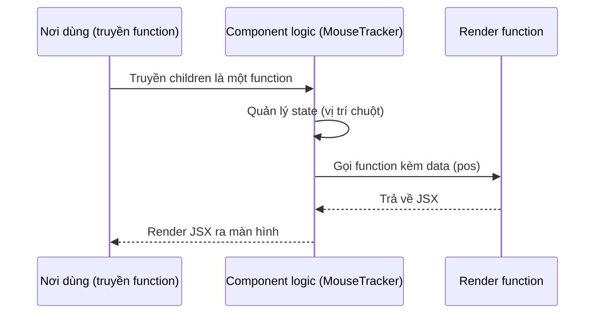

# Render Props

**Render props** (truyền hàm render qua prop) là kỹ thuật chia sẻ logic giữa các component bằng cách truyền vào một prop có giá trị là một hàm trả về JSX. Component cha sẽ gọi hàm này để quyết định nội dung được hiển thị, nhờ đó tách phần xử lý logic ra khỏi phần giao diện. Đây là một trong những cách tái sử dụng code phổ biến trước khi custom hook ra đời.

---

## Mục lục

- [Vì sao có render props?](#vì-sao-có-render-props)
- [Render Props là gì?](#render-props-là-gì)
- [Ví dụ cơ bản](#ví-dụ-cơ-bản)
- [Component có nhiều slot](#component-có-nhiều-slot)
- [Render Props vs Custom Hook](#render-props-vs-custom-hook)
- [Khi nào còn dùng?](#khi-nào-còn-dùng)

---

## Vì sao có render props?

**Vấn đề:** Bạn muốn **tái sử dụng logic** (ví dụ theo dõi vị trí chuột, fetch dữ liệu) giữa nhiều component, nhưng phần **hiển thị** lại khác nhau ở mỗi nơi. Trước khi có Hooks, React không có cách gọn gàng để chia sẻ logic stateful — bạn buộc phải lặp lại logic hoặc dùng HOC lồng nhau khó đọc.

```jsx
// Logic track chuột bị lặp lại ở mọi component cần dùng
function ComponentA() {
  const [pos, setPos] = useState({ x: 0, y: 0 });
  useEffect(() => {
    const h = (e) => setPos({ x: e.clientX, y: e.clientY });
    window.addEventListener("mousemove", h);
    return () => window.removeEventListener("mousemove", h);
  }, []);
  return <p>A: {pos.x}, {pos.y}</p>;
}

function ComponentB() {
  // ...lặp lại y hệt logic trên, chỉ khác phần render
}
```

**Giải pháp:** Dùng **render props** — truyền một **hàm** qua prop (thường là `children`) để component chứa logic **gọi** hàm đó và đưa dữ liệu ra ngoài. Phần render do nơi sử dụng quyết định, nên một component logic phục vụ được nhiều giao diện khác nhau. (Lưu ý: ngày nay phần lớn trường hợp đã được thay bằng custom hook, nhưng pattern này vẫn còn gặp trong nhiều thư viện.)

```jsx
// Logic gom vào một chỗ, render tùy nơi dùng
function MouseTracker({ children }) {
  const [pos, setPos] = useState({ x: 0, y: 0 });
  useEffect(() => {
    const h = (e) => setPos({ x: e.clientX, y: e.clientY });
    window.addEventListener("mousemove", h);
    return () => window.removeEventListener("mousemove", h);
  }, []);
  return children(pos); // đưa data ra, nơi dùng tự render
}

<MouseTracker>{({ x, y }) => <p>A: {x}, {y}</p>}</MouseTracker>
<MouseTracker>{({ x, y }) => <Dot left={x} top={y} />}</MouseTracker>
```

:::tip[Dùng thực tế]

- Component cấp dữ liệu: `<DataProvider>{data => /* render */}</DataProvider>`.
- Theo dõi trạng thái: mouse tracker, scroll tracker, kích thước cửa sổ.
- Thư viện cũ: **Formik**, **Downshift** dùng children-as-function.
- Tách logic khỏi UI để một logic phục vụ nhiều giao diện.

:::

---

## Render Props là gì?

**Render Props** = pattern truyền **function làm prop**, function này
trả về JSX. Component logic gọi function với data, function quyết định
render gì.

```jsx
<DataLoader render={data => <div>{data}</div>} />
```

Hoặc dùng `children` làm function:

```jsx
<DataLoader>
  {data => <div>{data}</div>}
</DataLoader>
```

Sơ đồ tương tác cho thấy component logic gọi ngược render function để đưa data ra ngoài:



---

## Ví dụ cơ bản

```jsx
function MouseTracker({ children }) {
  const [pos, setPos] = useState({ x: 0, y: 0 });

  useEffect(() => {
    const handle = (e) => setPos({ x: e.clientX, y: e.clientY });
    window.addEventListener("mousemove", handle);
    return () => window.removeEventListener("mousemove", handle);
  }, []);

  return children(pos); // gọi function với data
}

// Dùng
<MouseTracker>
  {({ x, y }) => (
    <p>Mouse at ({x}, {y})</p>
  )}
</MouseTracker>
```

Cho phép **logic** (track mouse) tách khỏi **render** (UI), reuse logic
nhiều UI khác nhau.

---

## Component có nhiều slot

Pattern Render Props phân thành nhiều **slot tùy biến**:

```jsx
function Form({ initialValues, onSubmit, renderField }) {
  const [values, setValues] = useState(initialValues);

  return (
    <form onSubmit={() => onSubmit(values)}>
      {Object.keys(values).map(key =>
        renderField({
          name: key,
          value: values[key],
          onChange: (v) => setValues({ ...values, [key]: v }),
        })
      )}
      <button type="submit">Save</button>
    </form>
  );
}

<Form
  initialValues={{ name: "", email: "" }}
  onSubmit={save}
  renderField={({ name, value, onChange }) => (
    <input
      key={name}
      value={value}
      onChange={(e) => onChange(e.target.value)}
      placeholder={name}
    />
  )}
/>
```

---

## Render Props vs Custom Hook

Trước hooks (React 16.8), render props là **cách chính** để share logic.
Sau hooks → **custom hook** thay thế cho **đa số use case**:

```jsx
// Cách cũ — Render Props
<MouseTracker>
  {({ x, y }) => <p>{x}, {y}</p>}
</MouseTracker>

// Cách mới — Custom Hook
function useMousePosition() {
  const [pos, setPos] = useState({ x: 0, y: 0 });
  useEffect(() => {
    const h = (e) => setPos({ x: e.clientX, y: e.clientY });
    window.addEventListener("mousemove", h);
    return () => window.removeEventListener("mousemove", h);
  }, []);
  return pos;
}

function MyComponent() {
  const { x, y } = useMousePosition();
  return <p>{x}, {y}</p>;
}
```

So sánh:

| | Render Props | Custom Hook |
|--|--------------|-------------|
| Cú pháp | Lồng JSX | Gọi như function |
| Type-safe (TS) | Khá | **Tốt hơn** |
| Multiple instance | Phải nesting | Đơn giản |
| Logic share giữa class component | OK | Không (chỉ function) |
| 2026 khuyến nghị | Hạn chế | **Có** |

:::info[Phân tích]

**Tại sao custom hook ưa chuộng hơn render props?**

1. **Đỡ nesting**: render props lồng nhiều cấp → "wrapper hell":

```jsx
<UserData>
  {user => (
    <OrderData userId={user.id}>
      {orders => (
        <PaymentData orderId={orders[0].id}>
          {payments => /* ... */}
        </PaymentData>
      )}
    </OrderData>
  )}
</UserData>
```

So với hook:

```jsx
function Page() {
  const user = useUser();
  const orders = useOrders(user.id);
  const payments = usePayments(orders[0]?.id);
  return /* ... */;
}
```

2. **TypeScript type inference**: hook return type được TS infer trực
   tiếp; render props phải khai báo type cho render function.

3. **Test dễ hơn**: hook có thể test bằng `renderHook` từ React Testing
   Library; render props phải mount cả component để test.

4. **Devtools**: hook hiện trong React DevTools với tên rõ; render props
   ẩn trong tree.

:::

---

## Khi nào còn dùng?

Render props **vẫn hữu dụng** trong vài trường hợp:

**1. Component cần render UI tùy biến cao**:

```jsx
<DataTable
  data={users}
  renderRow={(user) => (
    <tr>
      <td>{user.name}</td>
      <td>{user.email}</td>
      <td><Button onClick={() => edit(user)}>Edit</Button></td>
    </tr>
  )}
/>
```

Library: **React Window**, **React Virtuoso** (virtualization) dùng pattern này.

**2. Component nhận children là function** (function-as-child):

```jsx
<DataLoader url="/api/users">
  {({ data, loading, error }) => {
    if (loading) return <Spinner />;
    if (error) return <Error error={error} />;
    return <UserList users={data} />;
  }}
</DataLoader>
```

**3. Headless component** kết hợp:

```jsx
// React Query đôi khi dùng render props pattern
<Query queryKey={["user", id]} queryFn={fetchUser}>
  {({ data, isLoading }) => /* ... */}
</Query>
```

Tuy nhiên React Query hiện đại đã chuyển sang hook (`useQuery`).

:::tip[Mẹo]

**Quy tắc thực dụng 2026**:

- **Share state/logic** → Custom Hook.
- **Share JSX template với tùy biến** → Render Props hoặc compound component.
- **Render thay đổi theo state** → Conditional rendering.

Khi thiết kế API cho component reusable:

1. Thử custom hook trước.
2. Nếu cần wrap UI → compound component / children prop.
3. Cuối cùng mới đến render props.

Đừng dùng render props nếu hook làm được — vì lý do TS support + readability.

:::
