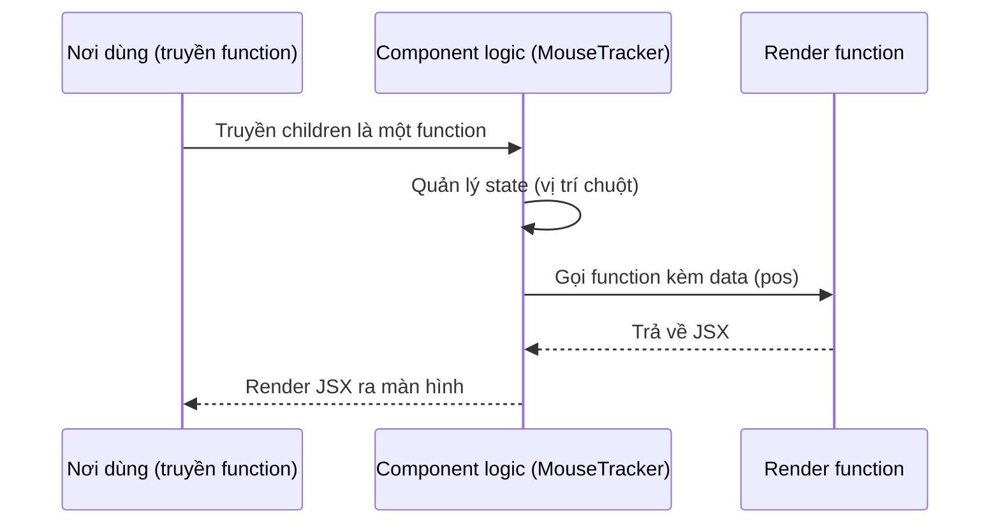

# Render Props

**Render props** (truyền hàm render qua prop) là kỹ thuật chia sẻ logic giữa các component bằng cách truyền vào một prop có giá trị là một hàm trả về JSX. Component cha sẽ gọi hàm này để quyết định nội dung được hiển thị, nhờ đó tách phần xử lý logic ra khỏi phần giao diện. Đây là một trong những cách tái sử dụng code phổ biến trước khi custom hook ra đời.

[](pathname:///img/react/render-props.webp)

---

:::note[Ghi nhớ nhanh]

- ⭐ **Render props = truyền một function làm prop** (thường là `children`) để component logic gọi ngược, tách logic khỏi UI và tái sử dụng cho nhiều giao diện.
- **Ra đời trước Hooks** để chia sẻ logic stateful; nay đa số use case đã được thay bằng custom hook.
- **Custom hook thường tốt hơn** — đỡ nesting ("wrapper hell"), TS infer type dễ, test bằng `renderHook`, hiện rõ trong DevTools.
- **Render props vẫn hữu dụng** cho UI tuỳ biến cao (`renderRow`), function-as-child (`DataLoader`), headless/virtualization (React Window, React Virtuoso).
- **Quy tắc 2026** — share logic dùng hook trước, cần wrap UI thì compound component, render props là lựa chọn cuối.

:::

---

## Mục lục

- [Vì sao có render props?](#vì-sao-có-render-props)
- [Render Props là gì?](#render-props-là-gì)
- [Ví dụ cơ bản](#ví-dụ-cơ-bản)
- [Component có nhiều slot](#component-có-nhiều-slot)
- [Render Props vs Custom Hook](#render-props-vs-custom-hook)
- [Khi nào còn dùng?](#khi-nào-còn-dùng)
- [Câu hỏi phỏng vấn](#câu-hỏi-phỏng-vấn)

---

## Vì sao có render props?

**Vấn đề:** Bạn muốn **tái sử dụng logic** (ví dụ theo dõi vị trí chuột, fetch dữ liệu) giữa nhiều component, nhưng phần **hiển thị** lại khác nhau ở mỗi nơi. Trước khi có Hooks, React không có cách gọn gàng để chia sẻ logic stateful — bạn buộc phải lặp lại logic hoặc dùng HOC lồng nhau khó đọc.

```jsx
// Logic track chuột bị lặp lại ở mọi component cần dùng
function ComponentA() {
  const [pos, setPos] = useState({ x: 0, y: 0 });
  useEffect(() => {
    const h = (e) => setPos({ x: e.clientX, y: e.clientY });
    window.addEventListener("mousemove", h);
    return () => window.removeEventListener("mousemove", h);
  }, []);
  return <p>A: {pos.x}, {pos.y}</p>;
}

function ComponentB() {
  // ...lặp lại y hệt logic trên, chỉ khác phần render
}
```

**Giải pháp:** Dùng **render props** — truyền một **hàm** qua prop (thường là `children`) để component chứa logic **gọi** hàm đó và đưa dữ liệu ra ngoài. Phần render do nơi sử dụng quyết định, nên một component logic phục vụ được nhiều giao diện khác nhau. (Lưu ý: ngày nay phần lớn trường hợp đã được thay bằng custom hook, nhưng pattern này vẫn còn gặp trong nhiều thư viện.)

```jsx
// Logic gom vào một chỗ, render tùy nơi dùng
function MouseTracker({ children }) {
  const [pos, setPos] = useState({ x: 0, y: 0 });
  useEffect(() => {
    const h = (e) => setPos({ x: e.clientX, y: e.clientY });
    window.addEventListener("mousemove", h);
    return () => window.removeEventListener("mousemove", h);
  }, []);
  return children(pos); // đưa data ra, nơi dùng tự render
}

<MouseTracker>{({ x, y }) => <p>A: {x}, {y}</p>}</MouseTracker>
<MouseTracker>{({ x, y }) => <Dot left={x} top={y} />}</MouseTracker>
```

:::tip[Dùng thực tế]

- Component cấp dữ liệu: `<DataProvider>{data => /* render */}</DataProvider>`.
- Theo dõi trạng thái: mouse tracker, scroll tracker, kích thước cửa sổ.
- Thư viện cũ: **Formik**, **Downshift** dùng children-as-function.
- Tách logic khỏi UI để một logic phục vụ nhiều giao diện.

:::

---

## Render Props là gì?

**Render Props** = pattern truyền **function làm prop**, function này
trả về JSX. Component logic gọi function với data, function quyết định
render gì.

```jsx
<DataLoader render={data => <div>{data}</div>} />
```

Hoặc dùng `children` làm function:

```jsx
<DataLoader>
  {data => <div>{data}</div>}
</DataLoader>
```

Sơ đồ tương tác cho thấy component logic gọi ngược render function để đưa data ra ngoài:



---

## Ví dụ cơ bản

```jsx
function MouseTracker({ children }) {
  const [pos, setPos] = useState({ x: 0, y: 0 });

  useEffect(() => {
    const handle = (e) => setPos({ x: e.clientX, y: e.clientY });
    window.addEventListener("mousemove", handle);
    return () => window.removeEventListener("mousemove", handle);
  }, []);

  return children(pos); // gọi function với data
}

// Dùng
<MouseTracker>
  {({ x, y }) => (
    <p>Mouse at ({x}, {y})</p>
  )}
</MouseTracker>
```

Cho phép **logic** (track mouse) tách khỏi **render** (UI), reuse logic
nhiều UI khác nhau.

---

## Component có nhiều slot

Pattern Render Props phân thành nhiều **slot tùy biến**:

```jsx
function Form({ initialValues, onSubmit, renderField }) {
  const [values, setValues] = useState(initialValues);

  return (
    <form onSubmit={() => onSubmit(values)}>
      {Object.keys(values).map(key =>
        renderField({
          name: key,
          value: values[key],
          onChange: (v) => setValues({ ...values, [key]: v }),
        })
      )}
      <button type="submit">Save</button>
    </form>
  );
}

<Form
  initialValues={{ name: "", email: "" }}
  onSubmit={save}
  renderField={({ name, value, onChange }) => (
    <input
      key={name}
      value={value}
      onChange={(e) => onChange(e.target.value)}
      placeholder={name}
    />
  )}
/>
```

---

## Render Props vs Custom Hook

Trước hooks (React 16.8), render props là **cách chính** để share logic.
Sau hooks → **custom hook** thay thế cho **đa số use case**:

```jsx
// Cách cũ — Render Props
<MouseTracker>
  {({ x, y }) => <p>{x}, {y}</p>}
</MouseTracker>

// Cách mới — Custom Hook
function useMousePosition() {
  const [pos, setPos] = useState({ x: 0, y: 0 });
  useEffect(() => {
    const h = (e) => setPos({ x: e.clientX, y: e.clientY });
    window.addEventListener("mousemove", h);
    return () => window.removeEventListener("mousemove", h);
  }, []);
  return pos;
}

function MyComponent() {
  const { x, y } = useMousePosition();
  return <p>{x}, {y}</p>;
}
```

So sánh:

| | Render Props | Custom Hook |
|--|--------------|-------------|
| Cú pháp | Lồng JSX | Gọi như function |
| Type-safe (TS) | Khá | **Tốt hơn** |
| Multiple instance | Phải nesting | Đơn giản |
| Logic share giữa class component | OK | Không (chỉ function) |
| 2026 khuyến nghị | Hạn chế | **Có** |

:::info[Phân tích]

**Tại sao custom hook ưa chuộng hơn render props?**

1. **Đỡ nesting**: render props lồng nhiều cấp → "wrapper hell":

```jsx
<UserData>
  {user => (
    <OrderData userId={user.id}>
      {orders => (
        <PaymentData orderId={orders[0].id}>
          {payments => /* ... */}
        </PaymentData>
      )}
    </OrderData>
  )}
</UserData>
```

So với hook:

```jsx
function Page() {
  const user = useUser();
  const orders = useOrders(user.id);
  const payments = usePayments(orders[0]?.id);
  return /* ... */;
}
```

2. **TypeScript type inference**: hook return type được TS infer trực
   tiếp; render props phải khai báo type cho render function.

3. **Test dễ hơn**: hook có thể test bằng `renderHook` từ React Testing
   Library; render props phải mount cả component để test.

4. **Devtools**: hook hiện trong React DevTools với tên rõ; render props
   ẩn trong tree.

:::

---

## Khi nào còn dùng?

Render props **vẫn hữu dụng** trong vài trường hợp:

**1. Component cần render UI tùy biến cao**:

```jsx
<DataTable
  data={users}
  renderRow={(user) => (
    <tr>
      <td>{user.name}</td>
      <td>{user.email}</td>
      <td><Button onClick={() => edit(user)}>Edit</Button></td>
    </tr>
  )}
/>
```

Library: **React Window**, **React Virtuoso** (virtualization) dùng pattern này.

**2. Component nhận children là function** (function-as-child):

```jsx
<DataLoader url="/api/users">
  {({ data, loading, error }) => {
    if (loading) return <Spinner />;
    if (error) return <Error error={error} />;
    return <UserList users={data} />;
  }}
</DataLoader>
```

**3. Headless component** kết hợp:

```jsx
// React Query đôi khi dùng render props pattern
<Query queryKey={["user", id]} queryFn={fetchUser}>
  {({ data, isLoading }) => /* ... */}
</Query>
```

Tuy nhiên React Query hiện đại đã chuyển sang hook (`useQuery`).

:::tip[Mẹo]

**Quy tắc thực dụng 2026**:

- **Share state/logic** → Custom Hook.
- **Share JSX template với tùy biến** → Render Props hoặc compound component.
- **Render thay đổi theo state** → Conditional rendering.

Khi thiết kế API cho component reusable:

1. Thử custom hook trước.
2. Nếu cần wrap UI → compound component / children prop.
3. Cuối cùng mới đến render props.

Đừng dùng render props nếu hook làm được — vì lý do TS support + readability.

:::

---

## Câu hỏi phỏng vấn

Những câu thường gặp về chủ đề này. Tự trả lời trước, rồi bấm **Xem đáp án** để đối chiếu.

**1. `Render props` là gì? Hãy mô tả pattern này bằng lời và bằng một ví dụ tối giản.**

<details className="qa">
<summary>Xem đáp án</summary>

Là pattern truyền một **function làm prop**, function đó trả về JSX. Component chứa logic không tự quyết định giao diện mà **gọi ngược** function này kèm dữ liệu; nơi sử dụng dựa vào dữ liệu để render theo ý mình. Nhờ vậy một component logic phục vụ được nhiều giao diện khác nhau.

```jsx
function MouseTracker({ children }) {
  const [pos, setPos] = useState({ x: 0, y: 0 });
  useEffect(() => {
    const h = (e) => setPos({ x: e.clientX, y: e.clientY });
    window.addEventListener("mousemove", h);
    return () => window.removeEventListener("mousemove", h);
  }, []);
  return children(pos); // đưa data ra, nơi dùng tự render
}

<MouseTracker>{({ x, y }) => <p>A: {x}, {y}</p>}</MouseTracker>
<MouseTracker>{({ x, y }) => <Dot left={x} top={y} />}</MouseTracker>
```

Điểm mấu chốt: **logic tách khỏi render**. Cùng một `MouseTracker`, nơi thì hiện toạ độ bằng chữ, nơi thì vẽ một chấm tròn.

</details>

**2. Pattern này ra đời để giải quyết vấn đề gì trong thời kỳ trước khi có Hooks?**

<details className="qa">
<summary>Xem đáp án</summary>

Trước React 16.8, **logic stateful** (state + lifecycle) chỉ tồn tại được bên trong class component, mà class thì không có cách nào chia sẻ phần logic đó cho class khác. Muốn dùng lại logic theo dõi chuột, fetch dữ liệu, đo kích thước cửa sổ... bạn chỉ có ba lựa chọn:

- **Copy-paste** logic vào từng component — lặp code, sửa một chỗ quên chỗ khác.
- **Mixins** — bị React bỏ vì xung đột tên và khó truy vết nguồn gốc state.
- **HOC** — bọc component, nhưng gây "wrapper hell", va chạm tên prop và mất kiểu dữ liệu.

Render props là lời giải thứ tư: gom logic vào một component, rồi **đưa kết quả ra ngoài qua một function** thay vì tự render. Nó giải quyết được chia sẻ logic mà vẫn giữ nguồn gốc dữ liệu rõ ràng (nhìn JSX là biết data đến từ đâu).

Hooks ra đời năm 2019 giải đúng bài toán này một cách gọn hơn, nên ngày nay render props chỉ còn dùng cho các tình huống đặc thù.

</details>

**3. Tên prop có bắt buộc phải là `render` không? Cách dùng `children` như một function khác gì về cú pháp và về trải nghiệm đọc code?**

<details className="qa">
<summary>Xem đáp án</summary>

Không bắt buộc. "Render props" là tên **pattern**, không phải tên prop. Prop có thể tên gì cũng được: `render`, `renderRow`, `renderItem`, `renderField`, hoặc chính `children`.

```jsx
// Dạng prop có tên
<DataLoader render={data => <div>{data}</div>} />

// Dạng children-as-function
<DataLoader>
  {data => <div>{data}</div>}
</DataLoader>
```

| | Prop có tên | `children` là function |
|---|---|---|
| Nhiều slot | Dễ — mỗi slot một prop (`renderHeader`, `renderRow`) | Chỉ có một slot |
| Đọc code | Rõ vai trò từng slot, nhưng JSX nằm trong thuộc tính nên khó nhìn khi dài | Tự nhiên hơn, JSX nằm đúng chỗ thân component |
| Nhược điểm | Hàm dài nhét trong attribute gây rối | Người mới dễ bất ngờ vì `children` không phải JSX |

Thực tế: cần **một** vùng tuỳ biến thì dùng `children`; cần **nhiều** vùng thì đặt tên rõ ràng cho từng prop.

</details>

**4. So sánh `render props` với `HOC`: ưu và nhược của từng cách khi cần chia sẻ logic?**

<details className="qa">
<summary>Xem đáp án</summary>

| | Render props | HOC |
|---|---|---|
| Cách hoạt động | Truyền function vào, component logic gọi ngược | Hàm nhận component, trả về component mới đã bọc |
| Nguồn gốc dữ liệu | Rõ ràng — nhìn JSX là biết prop đến từ đâu | Ẩn — props "từ trên trời rơi xuống" |
| Va chạm tên prop | Không, vì tham số do bạn đặt tên | Có — hai HOC cùng inject `data` là đè nhau |
| Thời điểm quyết định | Runtime, linh hoạt theo dữ liệu | Lúc định nghĩa component (tĩnh) |
| Cây component | Lồng JSX sâu | Nhiều lớp wrapper trong DevTools |
| TypeScript | Khai báo type cho render function hơi dài | Khó, phải xử lý generic + `Omit` props |

Cả hai đều mắc chung một bệnh: **lồng nhiều tầng** khi cần gộp nhiều logic. HOC lồng theo chiều ngang (`withA(withB(withC(X)))`), render props lồng theo chiều dọc trong JSX.

Ngày nay cả hai đều nhường chỗ cho **custom hook** trong việc chia sẻ logic stateful. HOC vẫn còn giá trị cho các việc mang tính cross-cutting như bọc error boundary hay gắn theming.

</details>

**5. So sánh `render props` với `custom hook` — vì sao React hiện đại ưu tiên hook cho việc chia sẻ logic stateful?**

<details className="qa">
<summary>Xem đáp án</summary>

```jsx
// Render props
<MouseTracker>
  {({ x, y }) => <p>{x}, {y}</p>}
</MouseTracker>

// Custom hook
function MyComponent() {
  const { x, y } = useMousePosition();
  return <p>{x}, {y}</p>;
}
```

| | Render Props | Custom Hook |
|---|---|---|
| Cú pháp | Lồng JSX | Gọi như một function thường |
| Type inference (TS) | Khá — phải khai báo type render function | **Tốt hơn**, TS suy ra trực tiếp |
| Dùng nhiều logic cùng lúc | Phải nesting nhiều tầng | Gọi nối tiếp nhiều dòng |
| Test | Phải mount cả component | `renderHook` của Testing Library |
| DevTools | Ẩn trong cây component | Hiện rõ tên hook và state |
| Chia sẻ cho class component | Được | Không (chỉ function component) |

Lý do cốt lõi: hook tách logic ra khỏi **cấu trúc cây UI**. Render props phải tạo thêm một component và một tầng JSX chỉ để lấy dữ liệu — vừa làm cây sâu thêm vừa khiến việc kết hợp nhiều nguồn dữ liệu trở nên rối. Hook không đụng gì tới cây, nên kết hợp bao nhiêu cũng chỉ là thêm dòng code.

</details>

**6. "Wrapper hell" khi lồng nhiều `render props` là gì, và nó gây khó khăn gì khi đọc code cũng như khi debug?**

<details className="qa">
<summary>Xem đáp án</summary>

Là tình trạng JSX thụt lề ngày càng sâu khi mỗi nguồn dữ liệu lại thêm một tầng render props:

```jsx
<UserData>
  {user => (
    <OrderData userId={user.id}>
      {orders => (
        <PaymentData orderId={orders[0].id}>
          {payments => /* ... */}
        </PaymentData>
      )}
    </OrderData>
  )}
</UserData>
```

So với hook:

```jsx
function Page() {
  const user = useUser();
  const orders = useOrders(user.id);
  const payments = usePayments(orders[0]?.id);
  return /* ... */;
}
```

Khó khăn khi đọc: nội dung thật nằm ở tầng sâu nhất, thụt lề mạnh; thêm một nguồn dữ liệu phải sửa cả khối; khó tách hàm con vì mọi thứ dính vào closure lồng nhau.

Khó khăn khi debug: React DevTools hiện một chuỗi wrapper không mang ý nghĩa nghiệp vụ; stack trace dài và giống nhau; đặt breakpoint phải lần qua nhiều tầng; sửa thứ tự phụ thuộc giữa các nguồn dữ liệu đồng nghĩa với việc viết lại toàn bộ khối JSX.

</details>

**7. `Render props` ảnh hưởng thế nào tới khả năng suy luận kiểu (`type inference`) của TypeScript so với custom hook?**

<details className="qa">
<summary>Xem đáp án</summary>

Với **custom hook**, TS suy ra kiểu trả về trực tiếp từ thân hàm — không cần khai báo gì thêm:

```ts
function useMousePosition() {
  const [pos, setPos] = useState({ x: 0, y: 0 });
  return pos; // TS tự biết: { x: number; y: number }
}

const { x, y } = useMousePosition(); // x, y là number
```

Với **render props**, bạn phải khai báo kiểu cho chính function đó trong props của component:

```ts
type MouseTrackerProps = {
  children: (pos: { x: number; y: number }) => React.ReactNode;
};
```

Vấn đề phát sinh khi component logic là **generic** (ví dụ `DataLoader<T>`): TS phải suy ra `T` từ prop khác rồi truyền vào tham số của render function. Việc này hay thất bại ở các trường hợp lồng nhau, khiến tham số rơi về `any` hoặc `unknown`, và lỗi báo ra thường rất khó đọc.

Ngoài ra, khi lồng nhiều tầng render props, mỗi tầng lại là một callback mới nên TS không thể "nối" kiểu xuyên tầng gọn như khi gọi hook tuần tự.

</details>

**8. Truyền một arrow function inline làm render prop có gây vấn đề performance không? Vì sao, và `React.memo` hay `useCallback` giúp được gì?**

<details className="qa">
<summary>Xem đáp án</summary>

Về nguyên tắc có, nhưng thực tế thường **không đáng kể**. Arrow function inline tạo một tham chiếu mới ở mỗi lần render của component cha:

```jsx
<DataLoader render={data => <div>{data}</div>} />
// mỗi render của cha → prop `render` là function mới
```

Hệ quả: nếu `DataLoader` được bọc `React.memo`, phép so sánh nông luôn thấy prop đổi nên memo trở nên vô nghĩa, và `DataLoader` render lại mỗi lần.

Cách xử lý: bọc render function bằng `useCallback` (nhớ khai báo đủ deps) rồi mới memo component logic. Nhưng nên cân nhắc:

- Bản thân việc tạo một function là cực rẻ; chi phí thật nằm ở việc render lại subtree bên dưới.
- `useCallback` cũng có chi phí và làm code rườm rà hơn.
- Nếu render function phụ thuộc vào nhiều giá trị hay đổi thì `useCallback` cũng không giữ được tham chiếu ổn định.

Nguyên tắc chung vẫn là: **chỉ tối ưu khi đo được vấn đề** bằng React DevTools Profiler, thường là với danh sách lớn hoặc component render nặng.

</details>

**9. Trong React DevTools, một component dùng `render props` hiện ra như thế nào so với một component dùng hook?**

<details className="qa">
<summary>Xem đáp án</summary>

Với **render props**, cây component có thêm một node cho component logic (`MouseTracker`, `DataLoader`), và phần UI thật nằm bên dưới nó. State hiển thị trên node wrapper chứ không phải trên component nghiệp vụ mà bạn quan tâm. Lồng ba tầng render props thì cây sâu thêm ba tầng toàn wrapper — đọc rất rối, và tên hiển thị có thể là `Anonymous` nếu component không được đặt tên.

Với **custom hook**, cây giữ nguyên độ sâu. Chọn component trong DevTools, panel bên phải liệt kê từng hook theo đúng thứ tự gọi, kèm giá trị state; DevTools còn hiển thị **tên custom hook** (ví dụ `MousePosition` cho `useMousePosition`) nên bạn nhìn ra ngay logic nào đang chạy và state của nó bằng bao nhiêu.

Nói gọn: render props đẩy thông tin ra **cấu trúc cây**, hook giữ thông tin **ngay tại component** — cách thứ hai dễ debug hơn nhiều, nhất là khi kết hợp nhiều logic.

</details>

**10. Test một component dùng `render props` khác gì test một custom hook bằng `renderHook`?**

<details className="qa">
<summary>Xem đáp án</summary>

Với **custom hook**, bạn test logic trực tiếp, không cần UI:

```jsx
const { result } = renderHook(() => useMousePosition());
act(() => {
  window.dispatchEvent(new MouseEvent("mousemove", { clientX: 10, clientY: 20 }));
});
expect(result.current).toEqual({ x: 10, y: 20 });
```

Với **render props**, bạn buộc phải mount cả component và dựng một render function giả chỉ để "bắt" dữ liệu:

```jsx
const spy = jest.fn(() => null);
render(<MouseTracker>{spy}</MouseTracker>);
// rồi kiểm tra spy được gọi với tham số nào
```

Khác biệt chính:

- Hook cho phép **test đơn vị đúng nghĩa** — chỉ logic, không phụ thuộc DOM hay JSX.
- Render props buộc test đi qua tầng render, nên chậm hơn và lẫn lộn giữa lỗi logic với lỗi UI.
- Kiểm tra kết quả của hook đọc thẳng từ `result.current`; với render props phải suy ra qua tham số của mock hoặc qua nội dung đã render.
- Hook dễ test các trạng thái trung gian (loading, error) hơn vì không phải render từng biến thể giao diện.

</details>

**11. Kể vài thư viện thực tế dùng `render props` (ví dụ `react-window`, `Formik`, `Downshift`) và lý do chúng chọn pattern này.**

<details className="qa">
<summary>Xem đáp án</summary>

- **React Window / React Virtuoso** (virtualization): nhận prop kiểu `renderRow` / `children` là function nhận `index` và `style`. Thư viện quản lý việc tính toán dòng nào cần render, còn nội dung mỗi dòng hoàn toàn do bạn quyết định — thư viện không thể biết trước UI của bạn.
- **Formik**: `<Formik>{({ values, errors, handleChange }) => ...}</Formik>` — thư viện giữ state form, validation, trạng thái submit; giao diện input thì mỗi dự án một khác.
- **Downshift**: headless combobox/autocomplete, trả về một bộ prop getter (`getInputProps`, `getItemProps`) để bạn gắn vào thẻ của mình. Thư viện lo logic bàn phím và accessibility, không áp đặt markup.
- **React Query (bản cũ)** từng có `<Query>` với children-as-function trước khi chuyển hẳn sang `useQuery`.

Điểm chung: đây đều là **headless component** — phần khó là logic (virtualization, quản lý form, ARIA), còn phần UI phải mở hoàn toàn cho người dùng thư viện. Render props là cách tự nhiên để trao quyền render ra ngoài. Đáng chú ý là Formik, Downshift và React Query đều đã bổ sung hoặc chuyển sang hook về sau.

</details>

**12. Khi nào `render props` vẫn tốt hơn custom hook? Cho ví dụ với `headless component` hoặc `virtualization`.**

<details className="qa">
<summary>Xem đáp án</summary>

Khi component không chỉ **cung cấp dữ liệu** mà còn **kiểm soát việc render**: quyết định render bao nhiêu lần, lúc nào, với tham số gì. Hook không làm được vì hook chạy một lần cho mỗi lần render của component gọi nó.

Virtualization là ví dụ điển hình — thư viện quyết định dòng nào đang trong viewport và render đúng những dòng đó:

```jsx
<DataTable
  data={users}
  renderRow={(user) => (
    <tr>
      <td>{user.name}</td>
      <td><Button onClick={() => edit(user)}>Edit</Button></td>
    </tr>
  )}
/>
```

Các trường hợp còn lại:

- **Function-as-child cho trạng thái tải dữ liệu** — `<DataLoader>` gọi children với `{ data, loading, error }` để nơi dùng tự chọn hiển thị spinner, lỗi hay danh sách.
- **Component cần nhiều slot tuỳ biến** — `renderHeader`, `renderRow`, `renderEmpty` trên cùng một bảng.
- **Cần chia sẻ logic cho class component** trong codebase cũ.

Ngược lại, nếu chỉ cần lấy dữ liệu rồi tự render, hook luôn là lựa chọn tốt hơn.

</details>

**13. `Render props` và `compound component` khác nhau ở điểm nào? Với tình huống nào thì chọn cái nào?**

<details className="qa">
<summary>Xem đáp án</summary>

| | Render props | Compound component |
|---|---|---|
| Cách truyền dữ liệu | Gọi function kèm tham số | Chia sẻ ngầm qua Context giữa cha và các con |
| Cú pháp nơi dùng | Một function trả JSX | Nhiều component con khai báo như JSX thường |
| Ví dụ | `<DataLoader>{({data}) => ...}</DataLoader>` | `<Tabs><Tabs.List/><Tabs.Panel/></Tabs>` |
| Tuỳ biến | Rất cao — bạn viết toàn bộ markup | Vừa phải — ghép các mảnh có sẵn |
| Dễ đọc | Kém khi lồng sâu | Tốt, JSX phẳng và khai báo |

Chọn **compound component** khi bộ phận UI đã có hình hài rõ ràng và người dùng chỉ cần sắp xếp, bỏ bớt hoặc thêm phần: tabs, accordion, modal, select, menu. Đây cũng là lựa chọn dễ đọc hơn nên thường ưu tiên.

Chọn **render props** khi markup không thể đoán trước: mỗi dòng trong bảng ảo hoá, mỗi ô của lịch, mỗi item trong danh sách kéo thả — nơi thư viện chỉ biết *khi nào* render chứ không biết *render cái gì*.

Hai pattern không loại trừ nhau: nhiều thư viện dùng compound component cho khung và render props cho phần nội dung bên trong.

</details>

**14. `Render props` có chia sẻ được logic cho `class component` không? Custom hook thì sao?**

<details className="qa">
<summary>Xem đáp án</summary>

**Render props: được.** Vì nó chỉ là truyền một prop và render JSX — cả class lẫn function component đều làm được cả hai đầu. Một class có thể dùng render props, và bản thân component chứa logic cũng có thể là class:

```jsx
class Page extends React.Component {
  render() {
    return <MouseTracker>{({ x, y }) => <p>{x}, {y}</p>}</MouseTracker>;
  }
}
```

**Custom hook: không.** Quy tắc của Hooks quy định hook chỉ được gọi ở cấp cao nhất của **function component** hoặc trong một hook khác. Class không có chỗ để React gắn danh sách hook, nên gọi hook trong `render()` sẽ lỗi.

Nếu bắt buộc phải dùng logic dạng hook trong class, cách làm là **bọc**: viết một function component nhỏ gọi hook rồi truyền kết quả xuống class qua prop (thực chất chính là dựng lại một HOC hoặc render props quanh hook).

Đây cũng là lý do render props và HOC vẫn còn tồn tại trong các codebase cũ chưa migrate hết sang function component.

</details>

**15. Nếu render function trả về `null`, hoặc component logic quên gọi nó, thì chuyện gì xảy ra và làm sao phòng ngừa?**

<details className="qa">
<summary>Xem đáp án</summary>

- **Trả về `null`**: hợp lệ — React hiểu là "không render gì". Giao diện trống nhưng không lỗi. Đây là cách chính thống để ẩn nội dung có điều kiện.
- **Quên gọi function**: nếu component logic `return children` thay vì `children(data)`, React nhận được một **function** làm children. React không render được function và ném lỗi kiểu *"Functions are not valid as a React child"*, thường kèm màn hình trắng.
- **Không truyền render function**: `children` là `undefined`, gọi nó sẽ ném `TypeError: children is not a function`.

Cách phòng ngừa:

```jsx
function DataLoader({ children, render }) {
  const fn = children ?? render;
  if (typeof fn !== "function") {
    throw new Error("DataLoader cần children hoặc render là một function");
  }
  return fn(data);
}
```

Kèm theo: khai báo kiểu chặt trong TypeScript (`children: (data: T) => React.ReactNode`) để bắt lỗi ngay lúc viết code; bọc `ErrorBoundary` để một lỗi render không làm sập cả trang; và viết test cho các nhánh loading/error/empty.

</details>

**16. Khi thiết kế API cho một component tái sử dụng, thứ tự cân nhắc nên là hook, rồi `children`/compound, cuối cùng mới `render props`. Giải thích lý do của thứ tự này.**

<details className="qa">
<summary>Xem đáp án</summary>

Thứ tự này đi từ **ít ràng buộc nhất** đến **nhiều ràng buộc nhất** với người dùng API.

- **Custom hook trước**: chỉ trả dữ liệu và hành vi, không áp đặt bất kỳ cấu trúc JSX nào. Người dùng render sao cũng được, kết hợp nhiều hook thoải mái, TypeScript suy kiểu tốt, test bằng `renderHook`, DevTools hiện rõ. Không làm cây component sâu thêm.
- **`children` / compound component tiếp theo**: khi bạn thật sự cần *bọc* UI — tức component phải render khung, layout, hoặc quản lý quan hệ cha-con (tabs, modal, accordion). Cú pháp JSX vẫn phẳng và khai báo, dễ đọc với mọi người.
- **Render props cuối cùng**: khi component cần **kiểm soát thời điểm và số lần render** phần nội dung, ví dụ virtualization hay bảng có slot tuỳ biến. Đổi lại là JSX lồng sâu, dễ rơi vào wrapper hell và TypeScript khó suy kiểu hơn.

Nói cách khác: chỉ leo lên nấc phức tạp hơn khi nấc dưới không giải quyết được. Nhiều component tốt nhất cung cấp **cả hai**: một hook cho người muốn tự do hoàn toàn, và một component tiện dụng dựng sẵn trên hook đó.

</details>
