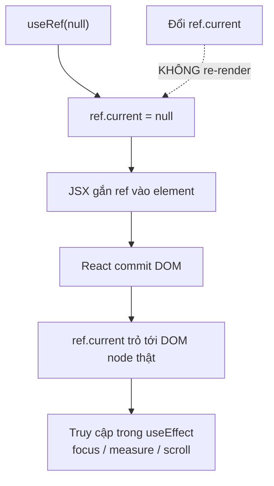
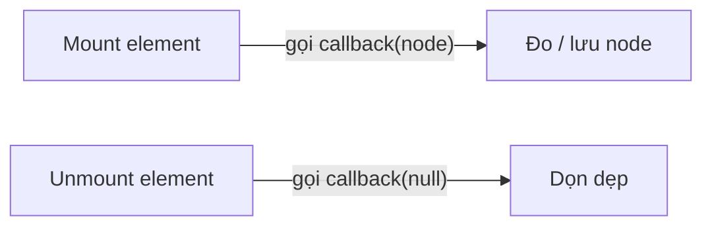

# Refs

**Ref** (tham chiếu tới phần tử DOM hoặc giá trị tồn tại qua các lần render) cho phép bạn truy cập trực tiếp một phần tử DOM hoặc lưu một giá trị mà không gây re-render khi nó thay đổi. Trong component dạng hàm, ta tạo ref bằng hook `useRef`. Ref thường dùng để focus ô input, đo kích thước phần tử, hoặc lưu các giá trị tạm như timer.

[](pathname:///img/react/refs.webp)

---

:::note[Ghi nhớ nhanh]

- ⭐ **`useRef` giữ giá trị persist qua các render mà không trigger re-render** — trả về object `{ current: ... }`, sửa `ref.current` không vẽ lại UI.
- ⭐ **Dùng ref để "với tay" vào DOM thật** (focus, scroll, measure, play video, tích hợp thư viện non-React) qua prop `ref`.
- **Không truy cập ref trong render** (chưa mount, `current` là null) — đo/dùng trong `useEffect` (hoặc `useLayoutEffect` để tránh flicker).
- **React 19** cho function component nhận `ref` qua props trực tiếp, không cần `forwardRef` nữa; class vẫn dùng `createRef`.
- **Đừng lạm dụng ref thay state** — nếu giá trị hiện trong UI thì dùng state; `useImperativeHandle` chỉ dùng khi thật cần expose method.

:::

---

## Mục lục

- [Vì sao có refs?](#vì-sao-có-refs)
- [Refs là gì?](#refs-là-gì)
- [useRef](#useref)
- [Truy cập DOM element](#truy-cập-dom-element)
- [Ref cho component](#ref-cho-component)
- [Callback ref](#callback-ref)
- [Câu hỏi phỏng vấn](#câu-hỏi-phỏng-vấn)

---

## Vì sao có refs?

**Vấn đề:** React quản lý DOM theo mô hình khai báo (UI = f(state)) — bạn mô tả UI muốn có, React tự cập nhật DOM. Nhưng đôi khi cần "với tay" trực tiếp vào DOM thật: focus ô input, đo kích thước, play video, tích hợp thư viện non-React. Ngoài ra cần lưu một giá trị qua các lần render mà **không** gây re-render.

```jsx
// Muốn focus input khi mở form — nhưng React không cho "chạm" DOM khai báo
function LoginForm() {
  // làm sao focus <input> ngay khi mount?
  return <input placeholder="Email" />;
}
```

**Giải pháp:** `useRef` (hoặc `createRef` cho class) — giữ tham chiếu tới DOM node (gắn qua prop `ref`) hoặc lưu một giá trị mutable bền vững (`ref.current`) mà không trigger render.

```jsx
import { useRef, useEffect } from "react";

function LoginForm() {
  const inputRef = useRef(null);

  useEffect(() => {
    inputRef.current.focus(); // với tay vào DOM thật
  }, []);

  return <input ref={inputRef} placeholder="Email" />;
}
```

:::tip[Dùng thực tế]

- **Focus ô input** khi mở form/modal (cải thiện UX nhập liệu).
- **Đo / scroll** một element (kích thước, `scrollIntoView`).
- **Lưu id timer** (`setInterval`/`setTimeout`) để clear sau này mà không re-render.
- **Tích hợp thư viện non-React**: chart, map, video player cần truy cập DOM node trực tiếp.

:::

---

## Refs là gì?

**Ref** = "tham chiếu" tới element DOM hoặc giá trị **persist giữa các
render** mà không trigger re-render khi đổi.

Use case chính:

- Truy cập **DOM element** thật (focus, scroll, measure).
- Lưu giá trị mutable không cần render (timer id, previous value).
- Imperative integration với thư viện non-React (chart, video player).

---

## useRef

Hook `useRef(initialValue)` trả về object `{ current: ... }`:

```jsx
import { useRef } from "react";

function Counter() {
  const renderCount = useRef(0);

  renderCount.current++;
  console.log("Render", renderCount.current);

  return <p>...</p>;
}
```

- `ref.current` sửa được, **không** trigger re-render.
- Giá trị persist qua mọi lần render.

Sơ đồ vòng đời của một DOM ref từ lúc tạo tới khi truy cập được node thật:



---

## Truy cập DOM element

```jsx
import { useRef, useEffect } from "react";

function AutoFocusInput() {
  const inputRef = useRef(null);

  useEffect(() => {
    inputRef.current.focus(); // truy cập DOM thật
  }, []);

  return <input ref={inputRef} />;
}
```

Pattern phổ biến:

```jsx
function VideoPlayer() {
  const videoRef = useRef(null);

  const play = () => videoRef.current.play();
  const pause = () => videoRef.current.pause();

  return (
    <>
      <video ref={videoRef} src="/movie.mp4" />
      <button onClick={play}>Play</button>
      <button onClick={pause}>Pause</button>
    </>
  );
}
```

Scroll to element:

```jsx
function Page() {
  const sectionRef = useRef(null);

  const scrollToSection = () => {
    sectionRef.current.scrollIntoView({ behavior: "smooth" });
  };

  return (
    <>
      <button onClick={scrollToSection}>Go to section</button>
      <div style={{ height: "2000px" }}></div>
      <section ref={sectionRef}>Target</section>
    </>
  );
}
```

:::warning[Cần lưu ý]

**Không truy cập ref trong render**:

```jsx
function Bad({ data }) {
  const ref = useRef(null);

  // SAI — ref.current là null khi render đầu, chưa mount
  const width = ref.current?.offsetWidth;

  return <div ref={ref}>{width}</div>;
}

// ĐÚNG — đo trong useEffect (sau khi commit DOM)
function Good() {
  const ref = useRef(null);
  const [width, setWidth] = useState(0);

  useEffect(() => {
    setWidth(ref.current.offsetWidth);
  }, []);

  return <div ref={ref}>{width}</div>;
}
```

Hoặc dùng `useLayoutEffect` để đo trước khi browser paint (tránh flicker).

:::

---

## Ref cho component

Trong React **19+** — function component có thể nhận `ref` qua props
trực tiếp:

```jsx
function MyInput({ ref, ...props }) {
  return <input ref={ref} {...props} />;
}

// Caller
function Form() {
  const inputRef = useRef(null);
  return <MyInput ref={inputRef} />;
}
```

Trước React 19 — phải dùng `forwardRef`:

```jsx
import { forwardRef } from "react";

const MyInput = forwardRef(function MyInput(props, ref) {
  return <input ref={ref} {...props} />;
});
```

:::info[Phân tích]

**React 19 đơn giản hoá ref** — không cần `forwardRef` cho function
component nữa:

```jsx
// React 18
const Button = forwardRef(({ children, ...props }, ref) => (
  <button ref={ref} {...props}>{children}</button>
));

// React 19
function Button({ children, ref, ...props }) {
  return <button ref={ref} {...props}>{children}</button>;
}
```

Migration: chạy codemod `react-codemod forward-refs-to-refs`. Hoặc làm
tay khi quay lại file.

Class component vẫn có `React.createRef()` và bind ref qua `ref={this.myRef}`
như cũ — không thay đổi.

:::

---

## Callback ref

Thay vì pass `ref` object, pass **function**:

```jsx
function Component() {
  const measureRef = (node) => {
    if (node) {
      console.log("Mounted, width:", node.offsetWidth);
    }
  };

  return <div ref={measureRef}>...</div>;
}
```

Callback ref được gọi:

- **Mount**: với DOM node.
- **Unmount**: với `null`.

Sơ đồ hai thời điểm React gọi callback ref:



Hữu dụng khi:

- Cần **đo element** ngay khi mount (không phải đợi effect).
- Cần **conditional ref**:

```jsx
<div ref={isMounted ? measureRef : null}>
```

- Dùng với **callback ref pattern** cho measure (`react-use-measure`):

```jsx
import useMeasure from "react-use-measure";

function Component() {
  const [ref, { width, height }] = useMeasure();
  return <div ref={ref}>{width} x {height}</div>;
}
```

:::tip[Mẹo]

**Use case "imperative handle"** — cho parent gọi method trên component:

```jsx
import { useImperativeHandle, useRef } from "react";

function FancyInput({ ref }) {
  const inputRef = useRef(null);

  useImperativeHandle(ref, () => ({
    focus: () => inputRef.current.focus(),
    clear: () => { inputRef.current.value = ""; },
  }));

  return <input ref={inputRef} />;
}

// Parent
function Form() {
  const fancyRef = useRef(null);

  return (
    <>
      <FancyInput ref={fancyRef} />
      <button onClick={() => fancyRef.current.focus()}>Focus</button>
      <button onClick={() => fancyRef.current.clear()}>Clear</button>
    </>
  );
}
```

Pattern này hữu ích cho **headless component** nhưng nên **tránh khi
có thể** — React khuyến khích flow data, không imperative.

Khi cần focus/scroll, ưu tiên: state-driven (prop `autoFocus`) →
imperative ref (last resort).

:::

:::warning[Cần lưu ý]

**Đừng abuse ref để thay state.** Ref không trigger re-render → component
sẽ "không thấy" thay đổi:

```jsx
// SAI
function Counter() {
  const count = useRef(0);

  return (
    <button onClick={() => count.current++}>
      Count: {count.current}  {/* hiển thị KHÔNG update */}
    </button>
  );
}

// ĐÚNG
function Counter() {
  const [count, setCount] = useState(0);
  return <button onClick={() => setCount(c => c + 1)}>{count}</button>;
}
```

Quy tắc: **nếu giá trị hiện trong UI → dùng state**, **nếu chỉ cần
behind-the-scenes → dùng ref**.

:::

---

## Câu hỏi phỏng vấn

Những câu thường gặp về chủ đề này. Tự trả lời trước, rồi bấm **Xem đáp án** để đối chiếu.

**1. `Ref` là gì trong React, và khác `state` ở những điểm nào?**

<details className="qa">
<summary>Xem đáp án</summary>

`Ref` là một "ô nhớ" tồn tại xuyên suốt các lần render của một component, dùng để tham chiếu tới DOM node thật hoặc lưu một giá trị mà UI không cần hiển thị.

| | `state` | `ref` |
|---|---|---|
| Gây re-render khi đổi | Có | **Không** |
| Cách cập nhật | Qua setter (`setCount`) | Gán thẳng `ref.current = ...` |
| Thời điểm giá trị mới có hiệu lực | Ở lần render kế tiếp | Ngay lập tức |
| Tính chất | Bất biến trong một lần render | Mutable |
| Dùng cho | Dữ liệu hiển thị lên UI | Dữ liệu "hậu trường", DOM node |

Điểm chung: cả hai đều được React giữ lại qua các lần render (khác với biến thường, vốn bị khởi tạo lại mỗi lần hàm component chạy).

Quy tắc: **giá trị có xuất hiện trong UI → dùng state; chỉ phục vụ hậu trường → dùng ref.**

</details>

**2. `useRef` trả về cái gì? Vì sao sửa `ref.current` lại không gây re-render?**

<details className="qa">
<summary>Xem đáp án</summary>

`useRef(initialValue)` trả về một **object cố định** dạng `{ current: initialValue }`. React tạo object này một lần khi mount và trả về **đúng object đó** ở mọi lần render sau — tham chiếu không bao giờ đổi.

```jsx
function Counter() {
  const renderCount = useRef(0);
  renderCount.current++;          // sửa thoải mái, không re-render
  console.log("Render", renderCount.current);
  return <p>...</p>;
}
```

Lý do không re-render: React chỉ lên lịch render lại khi bạn gọi **setter của state** hoặc `dispatch` của reducer — đó là những API báo cho React biết "có gì đó đổi". Gán `ref.current = x` chỉ là ghi vào một thuộc tính của một object JavaScript bình thường; React không theo dõi, không hay biết, nên không làm gì cả.

Hệ quả cần nhớ: nếu bạn hiển thị `ref.current` trong JSX, con số trên màn hình sẽ không cập nhật cho tới khi có nguyên nhân khác khiến component render lại.

</details>

**3. Khi nào nên dùng `useRef` thay vì `useState`, và ngược lại? Nêu quy tắc quyết định.**

<details className="qa">
<summary>Xem đáp án</summary>

Quy tắc một câu: **giá trị đó có cần vẽ ra màn hình không?** Có → `useState`. Không → `useRef`.

Dùng `useRef` khi:

- Giữ tham chiếu tới DOM node (focus, scroll, đo, play video).
- Lưu id của `setInterval` / `setTimeout` để clear sau này.
- Nhớ giá trị của lần render trước để so sánh.
- Giữ một instance của thư viện non-React (chart, map, editor).
- Đánh dấu cờ nội bộ như "đã submit rồi" mà UI không hiển thị.

Dùng `useState` khi giá trị ảnh hưởng tới những gì người dùng nhìn thấy: nội dung, trạng thái loading, mở/đóng modal, dữ liệu form controlled.

```jsx
// SAI — UI không bao giờ cập nhật
const count = useRef(0);
<button onClick={() => count.current++}>Count: {count.current}</button>

// ĐÚNG
const [count, setCount] = useState(0);
<button onClick={() => setCount(c => c + 1)}>{count}</button>
```

Dùng ref để "né" re-render cho dữ liệu hiển thị là bug chứ không phải tối ưu.

</details>

**4. Kể các use case hợp lệ của ref: focus, scroll, đo kích thước, lưu id timer, tích hợp thư viện non-React.**

<details className="qa">
<summary>Xem đáp án</summary>

- **Focus**: đưa con trỏ vào ô input khi mở form hay modal — `inputRef.current.focus()` trong `useEffect`.
- **Scroll**: cuộn tới một phần tử bằng `sectionRef.current.scrollIntoView({ behavior: "smooth" })`, hoặc lưu/khôi phục vị trí scroll của một danh sách.
- **Đo kích thước**: đọc `offsetWidth`, `getBoundingClientRect()` để tính vị trí tooltip, dropdown, hoặc layout phụ thuộc kích thước thật.
- **Điều khiển media**: gọi `videoRef.current.play()` / `pause()` — những hành động mệnh lệnh mà DOM API cung cấp chứ React không mô tả được bằng state.
- **Lưu id timer**: giữ kết quả của `setInterval` để `clearInterval` trong cleanup mà không làm component render lại.
- **Tích hợp thư viện non-React**: Chart.js, Leaflet, CodeMirror, video player... cần một DOM node để gắn vào; ref cung cấp node đó, còn instance của thư viện cũng lưu trong một ref khác.
- **Nhớ giá trị render trước** để so sánh trong effect.

Điểm chung: tất cả đều là việc **hậu trường** hoặc **mệnh lệnh**, không thuộc phần "UI = f(state)".

</details>

**5. Vì sao không nên đọc hoặc ghi `ref.current` ngay trong lúc render?**

<details className="qa">
<summary>Xem đáp án</summary>

Vì hàm component phải **pure**, còn đọc/ghi ref trong render phá vỡ điều đó.

Về mặt đọc: ở lần render đầu, DOM chưa được commit nên `ref.current` vẫn là `null`. Kết quả tính ra sẽ sai hoặc gây lỗi:

```jsx
function Bad() {
  const ref = useRef(null);
  const width = ref.current?.offsetWidth; // luôn undefined ở render đầu
  return <div ref={ref}>{width}</div>;
}
```

Về mặt ghi: React có thể gọi hàm component nhiều lần (Strict Mode gọi hai lần), render dở rồi bỏ, hoặc render ở mức ưu tiên thấp. Ghi vào ref trong render khiến kết quả phụ thuộc vào số lần React gọi hàm — bug rất khó lần.

Cách đúng: đọc/ghi ref trong `useEffect` (sau commit), trong `useLayoutEffect` (sau commit, trước paint — dùng khi cần đo rồi chỉnh để tránh nhấp nháy), hoặc trong event handler.

</details>

**6. Tại thời điểm nào `ref.current` mới thực sự trỏ tới DOM node? Giải thích theo vòng đời render và commit.**

<details className="qa">
<summary>Xem đáp án</summary>

Trình tự:

1. `useRef(null)` tạo object, `ref.current` là `null`.
2. **Render phase**: React gọi hàm component, nhận JSX có `ref={inputRef}`. Đây mới chỉ là mô tả — chưa có DOM node nào, `ref.current` vẫn `null`.
3. **Commit phase**: React tạo/cập nhật DOM thật, rồi **gán** `ref.current = node`. Việc gán này xảy ra trước khi effect chạy.
4. `useLayoutEffect` chạy — ref đã sẵn sàng, đọc được kích thước, chỉnh DOM trước khi browser paint.
5. Browser paint, rồi `useEffect` chạy — ref cũng đã sẵn sàng.

Khi element bị gỡ, React gán lại `ref.current = null` trong commit phase của lần cập nhật đó.

```jsx
useEffect(() => {
  inputRef.current.focus(); // an toàn: chạy sau commit
}, []);
```

Tóm lại: ref có giá trị **từ commit phase trở đi**, nên mọi thao tác với DOM node phải nằm trong effect hoặc event handler, không bao giờ trong thân hàm component.

</details>

**7. `useEffect` và `useLayoutEffect` khác nhau thế nào khi cần đo kích thước element qua ref? Khi nào bị flicker?**

<details className="qa">
<summary>Xem đáp án</summary>

| | `useEffect` | `useLayoutEffect` |
|---|---|---|
| Chạy khi | Sau khi browser đã paint | Sau commit DOM, **trước** paint |
| Chặn hiển thị | Không | Có (đồng bộ) |
| Rủi ro nhấp nháy khi đo-rồi-sửa | Có | Không |

Flicker xảy ra theo kịch bản: render lần 1 vẽ phần tử ở vị trí/kích thước mặc định → browser **paint** (người dùng đã thấy) → `useEffect` đo rồi `setState` → render lần 2 vẽ lại đúng chỗ. Giữa hai lần paint đó là một khung hình sai — mắt thường thấy như một cú giật hoặc nhảy vị trí.

```jsx
useLayoutEffect(() => {
  setWidth(ref.current.offsetWidth); // đo và sửa trước khi paint
}, []);
```

Với `useLayoutEffect`, cả đo lẫn cập nhật diễn ra trước paint nên người dùng chỉ thấy kết quả cuối.

Chọn thế nào: mặc định dùng `useEffect` (không chặn paint, không cảnh báo khi SSR). Chuyển sang `useLayoutEffect` khi và chỉ khi bạn **đo DOM rồi chỉnh ngay** — tooltip, popover, đồng bộ scroll. Với việc chỉ theo dõi kích thước liên tục, `ResizeObserver` là lựa chọn tốt hơn.

</details>

**8. `forwardRef` giải quyết vấn đề gì? Vì sao trước React 19 function component không nhận `ref` như một prop thường?**

<details className="qa">
<summary>Xem đáp án</summary>

`ref` (giống `key`) là thuộc tính **đặc biệt** được React giữ lại, không nằm trong `props`. Với thẻ DOM như `input`, React hiểu ngay là phải gắn node vào ref. Nhưng với một function component, React không biết nên gắn cái gì — component có thể render nhiều thẻ, hoặc không thẻ nào.

Trước React 19, viết `<MyInput ref={inputRef} />` sẽ khiến ref không tới được đâu cả và React cảnh báo "Function components cannot be given refs". `forwardRef` là cách nói rõ với React: hãy đưa ref vào **tham số thứ hai** để component tự quyết định gắn vào đâu.

```jsx
const MyInput = forwardRef(function MyInput(props, ref) {
  return <input ref={ref} {...props} />;
});
```

Nhu cầu này xuất hiện thường xuyên ở thư viện component: parent muốn focus, scroll hay đo một input/button đã được bọc trong component riêng.

Lý do React tách `ref` khỏi props ngay từ đầu là để việc gắn ref diễn ra ở tầng reconciliation, đồng thời tránh việc component vô tình truyền tiếp `ref` khi spread props.

</details>

**9. React 19 thay đổi gì về `ref` cho function component, và migrate từ `forwardRef` như thế nào?**

<details className="qa">
<summary>Xem đáp án</summary>

React 19 cho phép function component nhận `ref` **như một prop bình thường**, nên `forwardRef` không còn cần thiết cho code mới:

```jsx
// React 18
const Button = forwardRef(({ children, ...props }, ref) => (
  <button ref={ref} {...props}>{children}</button>
));

// React 19
function Button({ children, ref, ...props }) {
  return <button ref={ref} {...props}>{children}</button>;
}
```

Cách migrate:

- Chạy codemod `react-codemod forward-refs-to-refs` cho toàn bộ codebase, hoặc sửa tay dần mỗi khi mở lại file.
- Bỏ lớp bọc `forwardRef`, đưa `ref` vào phần destructure props, giữ nguyên phần thân.
- Với TypeScript, khai báo `ref` trong type props (`ref?: React.Ref<HTMLInputElement>`) thay cho generic của `forwardRef`.

Lưu ý: `forwardRef` vẫn hoạt động (chỉ bị đánh dấu là sẽ deprecated), nên có thể migrate từ từ. Class component **không đổi** — vẫn dùng `React.createRef()` và `ref={this.myRef}` như cũ.

</details>

**10. `Callback ref` là gì? React gọi nó vào những thời điểm nào và truyền vào giá trị gì?**

<details className="qa">
<summary>Xem đáp án</summary>

Thay vì truyền một object ref, bạn truyền thẳng một **function** vào prop `ref`. React sẽ gọi function đó và đưa DOM node vào làm tham số.

```jsx
function Component() {
  const measureRef = (node) => {
    if (node) {
      console.log("Mounted, width:", node.offsetWidth);
    }
  };
  return <div ref={measureRef}>...</div>;
}
```

React gọi callback ref ở hai thời điểm, đều trong commit phase:

- **Khi element được gắn vào DOM** — tham số là **DOM node**.
- **Khi element bị gỡ** — tham số là **`null`**.

Ngoài ra nếu chính function truyền vào thay đổi tham chiếu giữa hai lần render, React sẽ gọi function cũ với `null` rồi gọi function mới với node.

Từ React 19, callback ref có thể **return một cleanup function**; khi đó React gọi cleanup thay vì gọi lại callback với `null` — viết giống mô hình của `useEffect`, gọn và ít nhầm hơn.

</details>

**11. Vì sao một callback ref định nghĩa inline có thể bị gọi lại (với `null` rồi với node) sau mỗi lần re-render? Cách tránh?**

<details className="qa">
<summary>Xem đáp án</summary>

Vì hàm inline được **tạo mới ở mỗi lần render**, nên tham chiếu khác với lần trước. React so sánh tham chiếu và kết luận "ref đã đổi", nên phải gỡ ref cũ rồi gắn ref mới:

```jsx
// Mỗi render: gọi callback cũ với null, rồi callback mới với node
<div ref={(node) => setWidth(node?.offsetWidth)}>
```

Hậu quả: logic đo/khởi tạo chạy lại liên tục; nếu callback gọi `setState` thì rất dễ rơi vào vòng lặp render vô tận; thư viện non-React bị huỷ và khởi tạo lại mỗi render.

Cách tránh:

- Bọc callback bằng `useCallback` với dependency ổn định:

```jsx
const measureRef = useCallback((node) => {
  if (node) setWidth(node.offsetWidth);
}, []);
```

- Hoặc dùng ref object (`useRef`) khi không cần phản ứng ngay lúc gắn node — object ref có tham chiếu cố định nên React không bao giờ gọi lại.
- Trong React 19, tận dụng cleanup function trả về từ callback ref để dọn dẹp đúng cách thay vì kiểm tra `node === null`.

</details>

**12. Khi nào chọn `callback ref` thay vì ref object tạo bởi `useRef`?**

<details className="qa">
<summary>Xem đáp án</summary>

Chọn callback ref khi bạn cần **biết chính xác lúc node được gắn hoặc gỡ**, chứ không chỉ cần cầm node.

- **Đo ngay khi mount** mà không muốn đợi effect — callback chạy ngay trong commit, hữu ích khi node xuất hiện muộn (render có điều kiện) vì effect có `[]` sẽ không chạy lại.
- **Node thay đổi theo điều kiện** — `<div ref={isMounted ? measureRef : null}>`; với ref object bạn khó biết lúc nào nó vừa đổi.
- **Gắn/gỡ observer hoặc thư viện non-React** — khởi tạo `ResizeObserver`, `IntersectionObserver`, Chart.js khi có node và huỷ khi node biến mất. React 19 còn cho return cleanup nên rất hợp.
- **Gộp nhiều ref** vào một element — hàm merge nhận node rồi gán cho nhiều ref.
- **Ref cho từng item trong danh sách động** — callback gán node vào một `Map` theo id.

Ngược lại, dùng ref object khi chỉ cần "cầm node để dùng sau" (focus khi bấm nút, play video) — đơn giản và không có rủi ro gọi lại.

Nhiều thư viện đo kích thước như `react-use-measure` chính là callback ref đóng gói sẵn.

</details>

**13. `useImperativeHandle` dùng để làm gì? Vì sao React khuyên hạn chế dùng nó?**

<details className="qa">
<summary>Xem đáp án</summary>

Nó cho phép component con **tuỳ biến giá trị mà ref của cha nhận được** — thay vì trả DOM node thô, con trả ra một object chứa đúng những method muốn công khai:

```jsx
function FancyInput({ ref }) {
  const inputRef = useRef(null);
  useImperativeHandle(ref, () => ({
    focus: () => inputRef.current.focus(),
    clear: () => { inputRef.current.value = ""; },
  }));
  return <input ref={inputRef} />;
}
```

Cha chỉ gọi được `focus()` và `clear()`, không chạm được vào toàn bộ DOM node — đóng gói tốt hơn.

Vì sao nên hạn chế: nó là lối lập trình **mệnh lệnh**, ngược với mô hình khai báo "UI = f(state)" của React. Cha điều khiển con bằng lời gọi method khiến luồng dữ liệu khó lần, khó test, dễ lệch trạng thái giữa hai bên, và làm component khó tái sử dụng.

Thứ tự ưu tiên: dùng **prop/state** trước (ví dụ `autoFocus`, `value`), rồi mới tới ref mệnh lệnh như phương án cuối. `useImperativeHandle` chỉ thực sự xứng đáng với các hành động không mô tả được bằng state: focus, scroll, play/pause, mở dialog.

</details>

**14. Có thể truyền cùng một ref cho nhiều element không? Làm sao gộp nhiều ref vào cùng một element (`merge refs`)?**

<details className="qa">
<summary>Xem đáp án</summary>

Truyền cùng một ref object cho nhiều element thì **không có lỗi nhưng vô nghĩa**: mỗi lần commit React gán đè `ref.current`, nên cuối cùng chỉ còn node được gắn sau cùng. Không có cách nào lấy lại các node kia.

Ngược lại, gộp **nhiều ref vào một element** là nhu cầu có thật — ví dụ component vừa cần ref nội bộ để đo, vừa phải chuyển ref của cha xuống. Cách làm là dùng một callback ref phân phối node cho từng ref:

```jsx
function mergeRefs(...refs) {
  return (node) => {
    for (const ref of refs) {
      if (typeof ref === "function") ref(node);
      else if (ref) ref.current = node;
    }
  };
}

function Field({ ref }) {
  const innerRef = useRef(null);
  return <input ref={mergeRefs(innerRef, ref)} />;
}
```

Lưu ý bọc kết quả trong `useCallback` (hoặc `useMemo`) để hàm không đổi tham chiếu mỗi render, tránh việc React gỡ rồi gắn lại ref liên tục. Các thư viện như `react-merge-refs` cung cấp sẵn tiện ích này.

</details>

**15. Với một danh sách động, làm sao giữ ref cho từng item để có thể scroll hay focus đúng phần tử?**

<details className="qa">
<summary>Xem đáp án</summary>

Không gọi `useRef` trong `.map` được, vì vi phạm quy tắc Hooks (số lượng hook phải cố định giữa các lần render). Cách chuẩn là giữ **một ref chứa `Map`**, rồi dùng callback ref để đăng ký từng node theo id:

```jsx
function List({ items }) {
  const nodesRef = useRef(new Map());

  const scrollTo = (id) => {
    nodesRef.current.get(id)?.scrollIntoView({ behavior: "smooth" });
  };

  return items.map(item => (
    <li
      key={item.id}
      ref={(node) => {
        if (node) nodesRef.current.set(item.id, node);
        else nodesRef.current.delete(item.id); // dọn khi unmount
      }}
    >
      {item.name}
    </li>
  ));
}
```

Điểm quan trọng: **xoá khỏi `Map` khi node là `null`**, nếu không danh sách sẽ giữ tham chiếu tới các DOM node đã bị gỡ và gây rò rỉ bộ nhớ.

Tránh dùng mảng theo index (`refs.current[i]`) vì khi list sắp xếp lại hoặc xoá phần tử ở giữa, index trỏ nhầm node — đúng loại bug của `key={index}`.

</details>

**16. `createRef` khác `useRef` thế nào? Điều gì xảy ra nếu gọi `createRef` bên trong function component?**

<details className="qa">
<summary>Xem đáp án</summary>

| | `createRef` | `useRef` |
|---|---|---|
| Dùng cho | Class component | Function component |
| Tạo object | **Mới mỗi lần gọi** | Một lần, giữ nguyên qua mọi render |
| Nơi gọi | Trong `constructor` | Trong thân component (là hook) |

Trong class, `createRef()` được gọi ở constructor — chỉ chạy một lần cho mỗi instance — nên object ref bền vững suốt vòng đời component.

Nếu gọi `createRef()` trong thân một function component, nó chạy lại ở **mỗi lần render** và tạo một object mới toanh với `current` là `null`. Giá trị bạn lưu ở lần render trước biến mất, còn DOM node vừa gán cũng thuộc về object của lần render cũ:

```jsx
// SAI — ref bị tạo mới mỗi render, giá trị luôn mất
function Bad() {
  const ref = createRef();
  useEffect(() => console.log(ref.current), []); // dễ thành null
  return <input ref={ref} />;
}
```

Chính tính chất "tạo mới mỗi lần gọi" là lý do React cần một hook riêng: `useRef` lưu object vào bộ nhớ của component và trả lại đúng nó ở mọi lần render.

</details>

**17. Ref được gọi là "escape hatch" — khi nào việc phải dùng ref là dấu hiệu của một thiết kế state chưa tốt?**

<details className="qa">
<summary>Xem đáp án</summary>

Ref là "cửa thoát hiểm" khỏi mô hình khai báo: dùng khi React không mô tả được việc bạn cần làm. Nhưng nếu việc đó **mô tả được bằng state**, dùng ref là dấu hiệu thiết kế sai.

Các dấu hiệu:

- **Sửa DOM trực tiếp** để đổi nội dung, class, style — những thứ React sẽ ghi đè ở lần render sau. Hãy đưa vào state và render có điều kiện.
- **Đọc giá trị input qua `ref.current.value`** ở mọi nơi thay vì dùng controlled input, rồi phải tự đồng bộ validate và hiển thị lỗi.
- **Cha gọi method của con** (`childRef.current.reset()`) để điều khiển trạng thái con — thường nên nâng state lên cha (lifting state up) hoặc truyền prop `key` để reset.
- **Dùng ref để lưu giá trị hiển thị** nhằm né re-render — UI sẽ lệch dữ liệu.
- **Ref để chống vòng lặp effect** — thường che giấu một dependency array sai.

Ngược lại, ref là lựa chọn đúng cho focus, scroll, đo kích thước, play/pause media, tích hợp thư viện non-React — những hành động mệnh lệnh mà DOM cung cấp chứ state không biểu diễn được.

</details>

**18. `Strict Mode` ở môi trường dev gọi mount hai lần, điều đó ảnh hưởng thế nào tới callback ref và phần cleanup của nó?**

<details className="qa">
<summary>Xem đáp án</summary>

Ở dev, Strict Mode mô phỏng chu trình `mount → unmount → mount lại`. Với callback ref, nó thể hiện thành chuỗi: gọi với `node` → gọi với `null` (hoặc chạy cleanup, nếu callback trả về cleanup ở React 19) → gọi lại với `node`.

Điều này làm lộ ngay các callback ref viết ẩu:

- Callback đăng ký `ResizeObserver` / `IntersectionObserver` hoặc khởi tạo thư viện non-React mà **không huỷ** khi nhận `null` → sau hai lần mount có hai observer chạy song song.
- Callback đẩy node vào một mảng dùng chung mà không xoá → mảng có phần tử trùng, hoặc giữ tham chiếu tới node đã chết (rò rỉ bộ nhớ).
- Với danh sách dùng `Map`, quên `delete` khi node là `null` → `Map` phình lên với node cũ.

```jsx
ref={(node) => {
  if (node) map.current.set(id, node);
  else map.current.delete(id); // bắt buộc
}}
```

Cách xử lý đúng là viết callback ref **đối xứng**: mọi thứ tạo ra khi có node đều phải được huỷ khi nhận `null`. Không nên tắt Strict Mode — nó đang chỉ ra bug sẽ xuất hiện ở production khi component thực sự remount.

</details>
