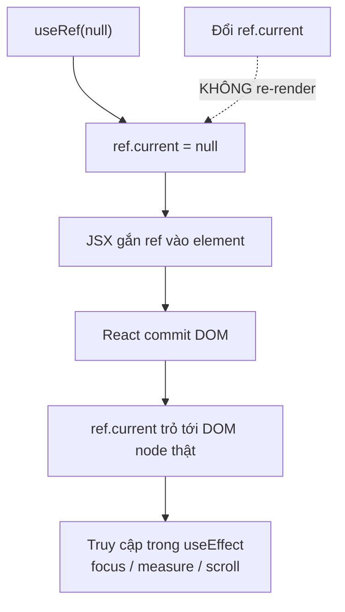
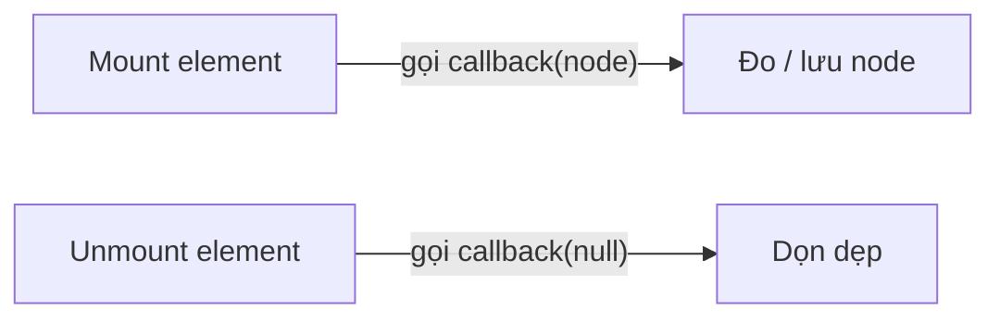

# Refs

**Ref** (tham chiếu tới phần tử DOM hoặc giá trị tồn tại qua các lần render) cho phép bạn truy cập trực tiếp một phần tử DOM hoặc lưu một giá trị mà không gây re-render khi nó thay đổi. Trong component dạng hàm, ta tạo ref bằng hook `useRef`. Ref thường dùng để focus ô input, đo kích thước phần tử, hoặc lưu các giá trị tạm như timer.

---

:::note[Ghi nhớ nhanh]

- ⭐ **`useRef` giữ giá trị persist qua các render mà không trigger re-render** — trả về object `{ current: ... }`, sửa `ref.current` không vẽ lại UI.
- ⭐ **Dùng ref để "với tay" vào DOM thật** (focus, scroll, measure, play video, tích hợp thư viện non-React) qua prop `ref`.
- **Không truy cập ref trong render** (chưa mount, `current` là null) — đo/dùng trong `useEffect` (hoặc `useLayoutEffect` để tránh flicker).
- **React 19** cho function component nhận `ref` qua props trực tiếp, không cần `forwardRef` nữa; class vẫn dùng `createRef`.
- **Đừng lạm dụng ref thay state** — nếu giá trị hiện trong UI thì dùng state; `useImperativeHandle` chỉ dùng khi thật cần expose method.

:::

---

## Mục lục

- [Vì sao có refs?](#vì-sao-có-refs)
- [Refs là gì?](#refs-là-gì)
- [useRef](#useref)
- [Truy cập DOM element](#truy-cập-dom-element)
- [Ref cho component](#ref-cho-component)
- [Callback ref](#callback-ref)
- [Câu hỏi phỏng vấn](#câu-hỏi-phỏng-vấn)

---

## Vì sao có refs?

**Vấn đề:** React quản lý DOM theo mô hình khai báo (UI = f(state)) — bạn mô tả UI muốn có, React tự cập nhật DOM. Nhưng đôi khi cần "với tay" trực tiếp vào DOM thật: focus ô input, đo kích thước, play video, tích hợp thư viện non-React. Ngoài ra cần lưu một giá trị qua các lần render mà **không** gây re-render.

```jsx
// Muốn focus input khi mở form — nhưng React không cho "chạm" DOM khai báo
function LoginForm() {
  // làm sao focus <input> ngay khi mount?
  return <input placeholder="Email" />;
}
```

**Giải pháp:** `useRef` (hoặc `createRef` cho class) — giữ tham chiếu tới DOM node (gắn qua prop `ref`) hoặc lưu một giá trị mutable bền vững (`ref.current`) mà không trigger render.

```jsx
import { useRef, useEffect } from "react";

function LoginForm() {
  const inputRef = useRef(null);

  useEffect(() => {
    inputRef.current.focus(); // với tay vào DOM thật
  }, []);

  return <input ref={inputRef} placeholder="Email" />;
}
```

:::tip[Dùng thực tế]

- **Focus ô input** khi mở form/modal (cải thiện UX nhập liệu).
- **Đo / scroll** một element (kích thước, `scrollIntoView`).
- **Lưu id timer** (`setInterval`/`setTimeout`) để clear sau này mà không re-render.
- **Tích hợp thư viện non-React**: chart, map, video player cần truy cập DOM node trực tiếp.

:::

---

## Refs là gì?

**Ref** = "tham chiếu" tới element DOM hoặc giá trị **persist giữa các
render** mà không trigger re-render khi đổi.

Use case chính:

- Truy cập **DOM element** thật (focus, scroll, measure).
- Lưu giá trị mutable không cần render (timer id, previous value).
- Imperative integration với thư viện non-React (chart, video player).

---

## useRef

Hook `useRef(initialValue)` trả về object `{ current: ... }`:

```jsx
import { useRef } from "react";

function Counter() {
  const renderCount = useRef(0);

  renderCount.current++;
  console.log("Render", renderCount.current);

  return <p>...</p>;
}
```

- `ref.current` sửa được, **không** trigger re-render.
- Giá trị persist qua mọi lần render.

Sơ đồ vòng đời của một DOM ref từ lúc tạo tới khi truy cập được node thật:



---

## Truy cập DOM element

```jsx
import { useRef, useEffect } from "react";

function AutoFocusInput() {
  const inputRef = useRef(null);

  useEffect(() => {
    inputRef.current.focus(); // truy cập DOM thật
  }, []);

  return <input ref={inputRef} />;
}
```

Pattern phổ biến:

```jsx
function VideoPlayer() {
  const videoRef = useRef(null);

  const play = () => videoRef.current.play();
  const pause = () => videoRef.current.pause();

  return (
    <>
      <video ref={videoRef} src="/movie.mp4" />
      <button onClick={play}>Play</button>
      <button onClick={pause}>Pause</button>
    </>
  );
}
```

Scroll to element:

```jsx
function Page() {
  const sectionRef = useRef(null);

  const scrollToSection = () => {
    sectionRef.current.scrollIntoView({ behavior: "smooth" });
  };

  return (
    <>
      <button onClick={scrollToSection}>Go to section</button>
      <div style={{ height: "2000px" }}></div>
      <section ref={sectionRef}>Target</section>
    </>
  );
}
```

:::warning[Cần lưu ý]

**Không truy cập ref trong render**:

```jsx
function Bad({ data }) {
  const ref = useRef(null);

  // SAI — ref.current là null khi render đầu, chưa mount
  const width = ref.current?.offsetWidth;

  return <div ref={ref}>{width}</div>;
}

// ĐÚNG — đo trong useEffect (sau khi commit DOM)
function Good() {
  const ref = useRef(null);
  const [width, setWidth] = useState(0);

  useEffect(() => {
    setWidth(ref.current.offsetWidth);
  }, []);

  return <div ref={ref}>{width}</div>;
}
```

Hoặc dùng `useLayoutEffect` để đo trước khi browser paint (tránh flicker).

:::

---

## Ref cho component

Trong React **19+** — function component có thể nhận `ref` qua props
trực tiếp:

```jsx
function MyInput({ ref, ...props }) {
  return <input ref={ref} {...props} />;
}

// Caller
function Form() {
  const inputRef = useRef(null);
  return <MyInput ref={inputRef} />;
}
```

Trước React 19 — phải dùng `forwardRef`:

```jsx
import { forwardRef } from "react";

const MyInput = forwardRef(function MyInput(props, ref) {
  return <input ref={ref} {...props} />;
});
```

:::info[Phân tích]

**React 19 đơn giản hoá ref** — không cần `forwardRef` cho function
component nữa:

```jsx
// React 18
const Button = forwardRef(({ children, ...props }, ref) => (
  <button ref={ref} {...props}>{children}</button>
));

// React 19
function Button({ children, ref, ...props }) {
  return <button ref={ref} {...props}>{children}</button>;
}
```

Migration: chạy codemod `react-codemod forward-refs-to-refs`. Hoặc làm
tay khi quay lại file.

Class component vẫn có `React.createRef()` và bind ref qua `ref={this.myRef}`
như cũ — không thay đổi.

:::

---

## Callback ref

Thay vì pass `ref` object, pass **function**:

```jsx
function Component() {
  const measureRef = (node) => {
    if (node) {
      console.log("Mounted, width:", node.offsetWidth);
    }
  };

  return <div ref={measureRef}>...</div>;
}
```

Callback ref được gọi:

- **Mount**: với DOM node.
- **Unmount**: với `null`.

Sơ đồ hai thời điểm React gọi callback ref:



Hữu dụng khi:

- Cần **đo element** ngay khi mount (không phải đợi effect).
- Cần **conditional ref**:

```jsx
<div ref={isMounted ? measureRef : null}>
```

- Dùng với **callback ref pattern** cho measure (`react-use-measure`):

```jsx
import useMeasure from "react-use-measure";

function Component() {
  const [ref, { width, height }] = useMeasure();
  return <div ref={ref}>{width} x {height}</div>;
}
```

:::tip[Mẹo]

**Use case "imperative handle"** — cho parent gọi method trên component:

```jsx
import { useImperativeHandle, useRef } from "react";

function FancyInput({ ref }) {
  const inputRef = useRef(null);

  useImperativeHandle(ref, () => ({
    focus: () => inputRef.current.focus(),
    clear: () => { inputRef.current.value = ""; },
  }));

  return <input ref={inputRef} />;
}

// Parent
function Form() {
  const fancyRef = useRef(null);

  return (
    <>
      <FancyInput ref={fancyRef} />
      <button onClick={() => fancyRef.current.focus()}>Focus</button>
      <button onClick={() => fancyRef.current.clear()}>Clear</button>
    </>
  );
}
```

Pattern này hữu ích cho **headless component** nhưng nên **tránh khi
có thể** — React khuyến khích flow data, không imperative.

Khi cần focus/scroll, ưu tiên: state-driven (prop `autoFocus`) →
imperative ref (last resort).

:::

:::warning[Cần lưu ý]

**Đừng abuse ref để thay state.** Ref không trigger re-render → component
sẽ "không thấy" thay đổi:

```jsx
// SAI
function Counter() {
  const count = useRef(0);

  return (
    <button onClick={() => count.current++}>
      Count: {count.current}  {/* hiển thị KHÔNG update */}
    </button>
  );
}

// ĐÚNG
function Counter() {
  const [count, setCount] = useState(0);
  return <button onClick={() => setCount(c => c + 1)}>{count}</button>;
}
```

Quy tắc: **nếu giá trị hiện trong UI → dùng state**, **nếu chỉ cần
behind-the-scenes → dùng ref**.

:::

---

## Câu hỏi phỏng vấn

Những câu thường gặp về chủ đề này. Tự trả lời trước, rồi đối chiếu lại với nội dung phía trên.

1. `Ref` là gì trong React, và khác `state` ở những điểm nào?
2. `useRef` trả về cái gì? Vì sao sửa `ref.current` lại không gây re-render?
3. Khi nào nên dùng `useRef` thay vì `useState`, và ngược lại? Nêu quy tắc quyết định.
4. Kể các use case hợp lệ của ref: focus, scroll, đo kích thước, lưu id timer, tích hợp thư viện non-React.
5. Vì sao không nên đọc hoặc ghi `ref.current` ngay trong lúc render?
6. Tại thời điểm nào `ref.current` mới thực sự trỏ tới DOM node? Giải thích theo vòng đời render và commit.
7. `useEffect` và `useLayoutEffect` khác nhau thế nào khi cần đo kích thước element qua ref? Khi nào bị flicker?
8. `forwardRef` giải quyết vấn đề gì? Vì sao trước React 19 function component không nhận `ref` như một prop thường?
9. React 19 thay đổi gì về `ref` cho function component, và migrate từ `forwardRef` như thế nào?
10. `Callback ref` là gì? React gọi nó vào những thời điểm nào và truyền vào giá trị gì?
11. Vì sao một callback ref định nghĩa inline có thể bị gọi lại (với `null` rồi với node) sau mỗi lần re-render? Cách tránh?
12. Khi nào chọn `callback ref` thay vì ref object tạo bởi `useRef`?
13. `useImperativeHandle` dùng để làm gì? Vì sao React khuyên hạn chế dùng nó?
14. Có thể truyền cùng một ref cho nhiều element không? Làm sao gộp nhiều ref vào cùng một element (`merge refs`)?
15. Với một danh sách động, làm sao giữ ref cho từng item để có thể scroll hay focus đúng phần tử?
16. `createRef` khác `useRef` thế nào? Điều gì xảy ra nếu gọi `createRef` bên trong function component?
17. Ref được gọi là "escape hatch" — khi nào việc phải dùng ref là dấu hiệu của một thiết kế state chưa tốt?
18. `Strict Mode` ở môi trường dev gọi mount hai lần, điều đó ảnh hưởng thế nào tới callback ref và phần cleanup của nó?
