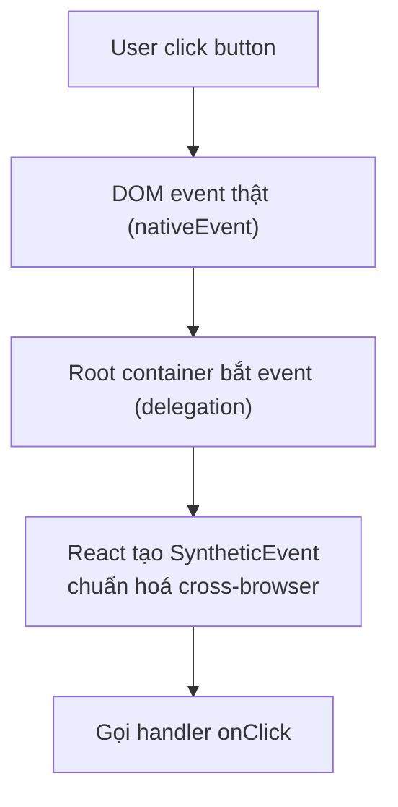
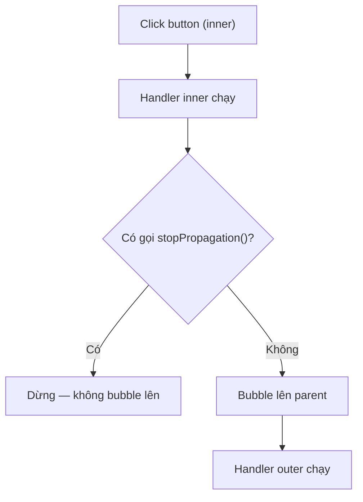

# Events

**Events** (sự kiện người dùng như click, gõ phím, di chuột) là cách React phản hồi lại các tương tác trên giao diện. Bạn gắn một **event handler** (hàm xử lý sự kiện) vào phần tử qua các prop như `onClick`, `onChange`. React bọc sự kiện gốc của trình duyệt trong **Synthetic Event** (sự kiện tổng hợp giúp hoạt động đồng nhất trên mọi trình duyệt).

[](pathname:///img/react/events.webp)

---

:::note[Ghi nhớ nhanh]

- ⭐ **Gắn handler khai báo trong JSX** bằng prop camelCase (`onClick`, `onChange`, `onSubmit`) và truyền function — không cần `addEventListener` thủ công.
- ⭐ **React bọc event trong Synthetic Event** — chuẩn hoá cross-browser và dùng event delegation tại root container (từ React 17, trước đó là `document`).
- **`preventDefault()`** chặn hành vi mặc định (form reload, navigate); **`stopPropagation()`** chặn bubble lên parent — nhưng đừng lạm dụng, nên kiểm tra `e.target`/`e.currentTarget`.
- **Pointer events** (`onPointerDown`...) hợp nhất mouse + touch, viết 1 lần chạy mọi thiết bị.
- **React 19 Actions** (`<form action>`, `useFormStatus`, `useOptimistic`) là cách handle form mới, phổ biến trong Next.js App Router.

:::

---

## Mục lục

- [Vì sao React dùng Synthetic Event?](#vì-sao-react-dùng-synthetic-event)
- [Event handler cơ bản](#event-handler-cơ-bản)
- [Synthetic Events](#synthetic-events)
- [Common events](#common-events)
- [preventDefault và stopPropagation](#preventdefault-và-stoppropagation)
- [Form events](#form-events)
- [Câu hỏi phỏng vấn](#câu-hỏi-phỏng-vấn)

---

## Vì sao React dùng Synthetic Event?

**Vấn đề:** Gắn `addEventListener` thủ công cho từng DOM node thì khó quản lý, dễ quên gỡ (gây memory leak), và mỗi trình duyệt lại có khác biệt nhỏ về event.

```jsx
// Tự gắn listener cho từng node — rườm rà, dễ leak
const btn = document.getElementById("save");
btn.addEventListener("click", handleClick);

// Quên gỡ → leak khi node bị xoá
// btn.removeEventListener("click", handleClick);

// Trình duyệt khác nhau, behavior event lệch nhau
```

**Giải pháp:** React dùng **Synthetic Event** — lớp bọc chuẩn hoá event của trình duyệt (API đồng nhất cross-browser). Bạn gắn handler khai báo ngay trong JSX (`onClick`...), React tự quản lý đăng ký/gỡ qua **event delegation** → gọn và nhất quán.

```jsx
// Khai báo handler ngay trong JSX
// React tự đăng ký/gỡ, tự chuẩn hoá event mọi trình duyệt
<button onClick={handleClick}>Save</button>
```

:::tip[Dùng thực tế]

- `onClick` / `onChange` / `onSubmit` — gắn handler khai báo, không cần `addEventListener`.
- `e.preventDefault()` trong `onSubmit` để chặn form reload page.
- `e.stopPropagation()` để chặn event bubble lên parent.
- Handler nhất quán mọi trình duyệt — không cần xử lý riêng cho Chrome/Firefox/Safari.

:::

---

## Event handler cơ bản

JSX dùng **camelCase** cho event, truyền **function** thay vì string:

```jsx
// HTML
<button onclick="handleClick()">Click</button>

// JSX
<button onClick={handleClick}>Click</button>
```

Inline function:

```jsx
<button onClick={() => alert("Hi")}>Click</button>

<button onClick={() => doSomething(item.id)}>Edit</button>
```

Với TypeScript:

```tsx
function Button() {
  const handleClick = (e: React.MouseEvent<HTMLButtonElement>) => {
    console.log(e.currentTarget);
  };

  return <button onClick={handleClick}>Click</button>;
}
```

---

## Synthetic Events

React **không gắn listener trực tiếp lên DOM** — nó dùng **synthetic
event system** với delegation tại root.

```jsx
function handleClick(e) {
  console.log(e);                    // SyntheticEvent
  console.log(e.nativeEvent);        // DOM event thật
  console.log(e.currentTarget);      // element gắn handler
  console.log(e.target);             // element thực sự gây event
}
```

Sơ đồ luồng một click đi từ DOM thật qua delegation tới handler:



Lợi ích:

- **Cross-browser normalize** — behavior giống nhau giữa Chrome, Firefox, Safari.
- **Event pooling** (đã loại bỏ từ React 17).
- **Tích hợp với React batching** — multiple state update trong handler được gộp.

:::info[Phân tích]

**React 17+ thay đổi event delegation:**

Trước React 17: gắn listener ở `document`.
React 17+: gắn ở **root container** (`#root`).

Khác biệt thực tế:

- Nếu có **multiple React app** trên cùng page, mỗi app có event system riêng.
- `e.stopPropagation()` trong React app **không** stop được listener gắn
  ngoài root (vd analytics gắn lên document).
- Khi dùng third-party widget với DOM event tay → cẩn thận timing.

:::

---

## Common events

**Mouse**:

```jsx
<div
  onClick={handle}
  onDoubleClick={handle}
  onMouseEnter={handle}
  onMouseLeave={handle}
  onMouseDown={handle}
  onMouseUp={handle}
  onMouseMove={handle}
/>
```

**Keyboard**:

```jsx
<input
  onKeyDown={handle}
  onKeyUp={handle}
  onKeyPress={handle}  // deprecated, dùng onKeyDown
/>

const handle = (e) => {
  if (e.key === "Enter") submit();
  if (e.key === "Escape") cancel();
  if (e.ctrlKey && e.key === "s") save();
};
```

**Form**:

```jsx
<input
  onChange={handle}    // mỗi keystroke
  onInput={handle}     // tương tự onChange
  onFocus={handle}
  onBlur={handle}
/>

<form onSubmit={handle}>...</form>
```

**Touch (mobile)**:

```jsx
<div
  onTouchStart={handle}
  onTouchMove={handle}
  onTouchEnd={handle}
/>
```

**Pointer (cross-device)**:

```jsx
<div
  onPointerDown={handle}
  onPointerMove={handle}
  onPointerUp={handle}
/>
```

:::tip[Mẹo]

**Pointer events** thay thế mouse + touch — viết 1 lần, chạy mọi device:

```jsx
// Tệ — viết 2 lần
<div onMouseDown={handle} onTouchStart={handle}>

// Tốt — pointer unified
<div onPointerDown={handle}>
```

Pointer events hỗ trợ:

- `pointerType` — `"mouse" | "pen" | "touch"`.
- `pressure` — áp lực bút stylus.
- `pointerId` — track multiple pointer.
- Cross-browser (Safari hỗ trợ từ 13+).

Modern app (Figma, Notion) đều dùng pointer events.

:::

---

## preventDefault và stopPropagation

**`preventDefault()`** — chặn behavior mặc định:

```jsx
<form onSubmit={(e) => {
  e.preventDefault();  // không reload page
  submitData();
}}>

<a onClick={(e) => {
  e.preventDefault();  // không navigate
  navigate("/custom");
}}>
```

**`stopPropagation()`** — chặn event bubble lên parent:

Sơ đồ cho thấy `stopPropagation()` quyết định event có bubble lên parent hay không:



```jsx
<div onClick={() => console.log("outer")}>
  <button onClick={(e) => {
    e.stopPropagation();  // không bubble
    console.log("inner");
  }}>
    Click
  </button>
</div>
```

:::warning[Cần lưu ý]

**Đừng abuse `stopPropagation`** — nó "ẩn" event khỏi:

- Parent component khác trong React.
- Library listener (modal close khi click outside).
- Analytics tracking listener ở root.

Pattern tốt hơn — **kiểm tra target**:

```jsx
<div onClick={(e) => {
  if (e.target === e.currentTarget) {
    // chỉ xử lý click thẳng vào div này
    closeModal();
  }
}}>
  <ModalContent />
</div>
```

Hoặc dùng `e.target.closest(".specific")` để biết click ở đâu.

:::

---

## Form events

Pattern controlled input:

```jsx
function ContactForm() {
  const [email, setEmail] = useState("");
  const [message, setMessage] = useState("");

  const handleSubmit = (e) => {
    e.preventDefault();
    api.send({ email, message });
  };

  return (
    <form onSubmit={handleSubmit}>
      <input
        value={email}
        onChange={(e) => setEmail(e.target.value)}
      />
      <textarea
        value={message}
        onChange={(e) => setMessage(e.target.value)}
      />
      <button type="submit">Send</button>
    </form>
  );
}
```

React 19 — Actions với `<form action>`:

```jsx
async function submit(formData) {
  "use server"; // server action
  await db.save({ email: formData.get("email") });
}

<form action={submit}>
  <input name="email" />
  <button type="submit">Send</button>
</form>
```

:::info[Phân tích]

**React 19 Actions** thay đổi cách handle form:

- **Server Actions** — function chạy trên server, gọi từ form/button.
- **Pending state** tự động via `useFormStatus`.
- **Error handling** tích hợp với Error Boundary.
- **Optimistic update** với `useOptimistic`.

```jsx
"use client";

import { useFormStatus } from "react-dom";

function SubmitButton() {
  const { pending } = useFormStatus();
  return (
    <button disabled={pending}>
      {pending ? "Saving..." : "Save"}
    </button>
  );
}

function Form() {
  return (
    <form action={saveAction}>
      <input name="title" />
      <SubmitButton />
    </form>
  );
}
```

Pattern này phổ biến trong Next.js App Router + React 19. Sẽ học chi tiết
ở phần Forms.

:::

:::tip[Mẹo]

**Cheat sheet event types với TypeScript**:

```tsx
React.MouseEvent<HTMLButtonElement>     // click button
React.MouseEvent<HTMLDivElement>        // click div
React.ChangeEvent<HTMLInputElement>     // input change
React.ChangeEvent<HTMLSelectElement>    // select change
React.FormEvent<HTMLFormElement>        // form submit
React.KeyboardEvent<HTMLInputElement>   // keydown trên input
React.FocusEvent<HTMLInputElement>      // focus/blur
React.DragEvent<HTMLDivElement>         // drag/drop
```

Hoặc dùng **inline inference**:

```tsx
<button onClick={(e) => {
  // e tự được TS infer thành MouseEvent<HTMLButtonElement>
  e.currentTarget.disabled = true;
}}>
```

VS Code autocomplete sẽ cho thấy type ngay khi hover. Không cần nhớ tên đầy đủ.

:::

---

## Câu hỏi phỏng vấn

Những câu thường gặp về chủ đề này. Tự trả lời trước, rồi bấm **Xem đáp án** để đối chiếu.

**1. `Synthetic Event` là gì và vì sao React phải bọc event gốc của trình duyệt lại?**

<details className="qa">
<summary>Xem đáp án</summary>

`SyntheticEvent` là lớp bọc (wrapper) của React quanh event gốc DOM, giữ nguyên bộ API quen thuộc: `type`, `target`, `preventDefault()`, `stopPropagation()`.

Lý do React bọc lại:

- **Chuẩn hoá cross-browser** — thời React ra đời, các trình duyệt có khác biệt nhỏ về tên thuộc tính và hành vi event. Synthetic Event cho một API đồng nhất, viết một lần chạy ở Chrome, Firefox, Safari như nhau.
- **Phục vụ event delegation** — React gắn listener thật ở root container rồi tự dựng lại luồng event theo cây React, nên cần một đối tượng event riêng do React kiểm soát.
- **Tích hợp với cơ chế của React** — gộp nhiều lệnh cập nhật state trong cùng handler (batching), phối hợp với priority của concurrent rendering.

Handler luôn nhận đúng một tham số là synthetic event:

```jsx
<button onClick={(e) => console.log(e.type)}>Save</button>
```

</details>

**2. Làm sao truy cập event gốc của DOM từ một synthetic event, và khi nào bạn thực sự cần tới nó?**

<details className="qa">
<summary>Xem đáp án</summary>

Dùng thuộc tính `e.nativeEvent`:

```jsx
function handleClick(e) {
  console.log(e);             // SyntheticEvent
  console.log(e.nativeEvent); // DOM event thật
}
```

Khi nào thực sự cần:

- Truy cập thuộc tính mà synthetic event không phơi ra, ví dụ `inputType` của `InputEvent` (phân biệt gõ phím với paste hay undo), hoặc `submitter` của `SubmitEvent`.
- Gọi `e.nativeEvent.stopImmediatePropagation()` để chặn luôn các listener DOM khác gắn trên cùng node.
- Phối hợp với thư viện bên ngoài đang làm việc trực tiếp với DOM event.
- Debug để xem event gốc trình duyệt phát ra trông thế nào.

Đa số trường hợp bạn không cần tới `nativeEvent` — synthetic event đã đủ. Nên coi việc phải chạm vào nó là dấu hiệu đang làm việc "ngoài luồng" React, cần cẩn thận về thứ tự và timing.

</details>

**3. `Event delegation` trong React hoạt động ra sao? React gắn listener thật ở đâu?**

<details className="qa">
<summary>Xem đáp án</summary>

React **không gọi `addEventListener` cho từng DOM node** ứng với mỗi prop `onClick` bạn viết. Thay vào đó nó gắn một bộ listener ở **root container** — element bạn truyền cho `createRoot` (thường là `#root`). Đây là hành vi từ React 17; trước đó listener nằm ở `document`.

Luồng xử lý một cú click:

1. Event gốc bubble từ node bị click lên tới root container.
2. Listener của React ở root bắt được event gốc.
3. React nhìn `event.target`, dò ngược cây Fiber để lấy danh sách component tổ tiên.
4. React tạo `SyntheticEvent` rồi gọi lần lượt các handler theo đúng thứ tự capture → target → bubble, mô phỏng lại luồng event của DOM nhưng theo **cây React**.

Lợi ích: số listener thật rất ít dù render hàng nghìn phần tử, React tự đăng ký và gỡ nên không rò rỉ bộ nhớ, đồng thời gộp được với cơ chế batching.

</details>

**4. React 17 chuyển nơi gắn listener từ `document` sang `root container` — thay đổi này gây ảnh hưởng thực tế gì?**

<details className="qa">
<summary>Xem đáp án</summary>

Những ảnh hưởng đáng nhớ:

- **Nhiều React app trên cùng một trang** sống chung được. Trước đây mọi app đều gắn ở `document` nên event có thể lọt chéo giữa các app; nay mỗi root có hệ event riêng. Đây cũng là điều kiện để nâng cấp dần từng phần của trang.
- **Tích hợp với code không phải React dễ đoán hơn** — khi nhúng widget jQuery hay thư viện DOM thuần, event của React dừng ở root, không "cướp" mất event của phần bên ngoài.
- **`e.stopPropagation()` trong React không chặn được** listener gắn ngoài root, ví dụ script analytics trên `document`. Lúc handler React chạy, event gốc mới ở tầng root và vẫn còn bubble tiếp.
- Vài hành vi biên thay đổi: `onScroll` không còn bubble, `onFocus`/`onBlur` chuyển sang dùng `focusin`/`focusout` ở bên dưới.

</details>

**5. `Event pooling` là gì, vì sao React từng dùng nó và vì sao React 17 loại bỏ?**

<details className="qa">
<summary>Xem đáp án</summary>

**Event pooling** là cơ chế của React cũ (từ 16 trở về trước): sau khi handler chạy xong, React xoá sạch mọi thuộc tính của `SyntheticEvent` rồi cất object vào một "hồ" để tái sử dụng cho event kế tiếp. Mục đích là **giảm áp lực cho garbage collector**, vì mỗi lần di chuột có thể sinh hàng trăm object event.

Hệ quả khó chịu: không dùng được event một cách bất đồng bộ.

```jsx
// React 16 — sai
const handle = (e) => {
  setTimeout(() => console.log(e.target), 0); // null
};
// Phải gọi e.persist() hoặc copy giá trị ra biến trước
```

React 17 **bỏ hẳn pooling** vì các engine JavaScript hiện đại đã tối ưu rất tốt việc cấp phát object nhỏ — lợi ích hiệu năng gần như không còn, trong khi đây lại là nguồn bug và nhầm lẫn phổ biến. Từ React 17, `e.persist()` chỉ còn là hàm rỗng giữ lại cho tương thích.

</details>

**6. `e.target` và `e.currentTarget` khác nhau thế nào? Cho một ví dụ mà chúng trả về hai element khác nhau.**

<details className="qa">
<summary>Xem đáp án</summary>

| Thuộc tính | Ý nghĩa |
|---|---|
| `e.target` | Element **thực sự gây ra** event — nơi người dùng bấm trúng |
| `e.currentTarget` | Element **đang gắn handler** đang chạy — luôn khớp với thẻ viết prop `onClick` |

Khi handler gắn ở cha còn người dùng bấm vào con, hai giá trị khác nhau:

```jsx
<div onClick={(e) => {
  console.log(e.currentTarget); // luôn là div — nơi gắn handler
  console.log(e.target);        // span nếu bấm trúng chữ bên trong
}}>
  <span>Bấm vào tôi</span>
</div>
```

Ứng dụng quen thuộc: chỉ đóng modal khi bấm đúng vùng nền, không phải bấm vào nội dung.

```jsx
<div onClick={(e) => {
  if (e.target === e.currentTarget) closeModal();
}}>
  <ModalContent />
</div>
```

Cách này an toàn hơn `stopPropagation()` vì không giấu event khỏi listener khác. Lưu ý với TypeScript: `e.currentTarget` có kiểu chính xác theo element, còn `e.target` chỉ là `EventTarget` nên thường phải ép kiểu.

</details>

**7. `preventDefault()` và `stopPropagation()` khác nhau ra sao? Khi nào dùng cái nào?**

<details className="qa">
<summary>Xem đáp án</summary>

Hai hàm giải quyết hai vấn đề hoàn toàn khác nhau:

| | `preventDefault()` | `stopPropagation()` |
|---|---|---|
| Chặn cái gì | Hành vi mặc định của trình duyệt | Việc event lan tiếp lên element cha |
| Không ảnh hưởng tới | Event vẫn bubble bình thường | Hành vi mặc định vẫn xảy ra |
| Ví dụ dùng | Form không reload trang, thẻ liên kết không điều hướng | Bấm nút bên trong card mà không kích hoạt handler của card |

```jsx
<form onSubmit={(e) => {
  e.preventDefault(); // không reload page
  submitData();
}}>
```

Kinh nghiệm: `preventDefault()` dùng thoải mái — đó là cách chuẩn để tự quản lý hành vi. Còn `stopPropagation()` nên hạn chế, vì nó "ẩn" event khỏi component cha, khỏi thư viện (modal đóng khi click ra ngoài) và khỏi analytics gắn ở root. Ưu tiên kiểm tra `e.target === e.currentTarget`, hoặc dùng `e.target.closest(".specific")` để biết click xuất phát từ đâu rồi mới quyết định xử lý.

</details>

**8. Vì sao trong React, `return false` trong handler không chặn được hành vi mặc định như trong HTML hay jQuery?**

<details className="qa">
<summary>Xem đáp án</summary>

`return false` chưa bao giờ là tính năng của chuẩn DOM. Nó chỉ mang ý nghĩa ở hai nơi:

- **Inline HTML attribute** — với `onclick="return false"`, trình duyệt tự dịch giá trị trả về thành lệnh gọi `preventDefault()`.
- **jQuery** — jQuery cố tình quy ước `return false` nghĩa là gọi cả `preventDefault()` lẫn `stopPropagation()`.

React không theo quy ước nào trong hai cái đó. Handler của React là một function JavaScript bình thường, được hệ synthetic event gọi, và giá trị trả về bị **bỏ qua hoàn toàn**. Muốn chặn hành vi mặc định thì phải gọi tường minh:

```jsx
// Không có tác dụng
<form onSubmit={() => false}>

// Đúng
<form onSubmit={(e) => { e.preventDefault(); save(); }}>
```

Cách tường minh thực ra tốt hơn: đọc code là biết ngay bạn đang chặn hành vi mặc định, chặn bubbling, hay cả hai — thay vì phải đoán ý nghĩa của một giá trị `false` mơ hồ.

</details>

**9. `stopPropagation()` trong React có chặn được listener gắn bằng `addEventListener` ở `document` không? Giải thích theo cơ chế delegation.**

<details className="qa">
<summary>Xem đáp án</summary>

**Không** — với React 17 trở lên. Lý do nằm ở chỗ React gắn listener thật tại **root container**, còn `document` nằm **cao hơn** root trên cây DOM.

Diễn biến khi bạn click:

1. Event gốc bubble từ node bị click lên tới root container.
2. Listener của React ở root bắt được, dựng `SyntheticEvent` và chạy các handler theo cây React.
3. Bạn gọi `e.stopPropagation()` — việc này chỉ dừng React gọi tiếp handler của các **component cha trong cây React**.
4. Nhưng event gốc vẫn đang ở tầng root và **tiếp tục bubble lên `document`**, nên listener analytics ở đó vẫn chạy.

Muốn chặn thật sự phải can thiệp vào event gốc:

```jsx
const handle = (e) => {
  e.nativeEvent.stopImmediatePropagation();
};
```

Với React 16 thì tình huống ngược lại: listener của React nằm ngay ở `document`, nên thứ tự chạy phụ thuộc listener nào đăng ký trước — một nguồn bug rất khó lần.

</details>

**10. `Bubbling` và `capturing` khác nhau thế nào, và React cho đăng ký phase capture bằng cú pháp nào?**

<details className="qa">
<summary>Xem đáp án</summary>

Một event DOM đi qua ba giai đoạn:

- **Capturing** — đi từ trên xuống, từ gốc tài liệu tới element đích (cha chạy trước con).
- **Target** — tới đúng element bị tác động.
- **Bubbling** — quay ngược từ element đích lên các cha (con chạy trước cha).

Mặc định handler chạy ở phase bubble. React mô phỏng đủ cả hai phase và cho đăng ký capture bằng hậu tố `Capture` trong tên prop:

```jsx
<div
  onClickCapture={() => console.log("cha - capture")}
  onClick={() => console.log("cha - bubble")}
>
  <button onClick={() => console.log("con - bubble")}>Click</button>
</div>
// Output: "cha - capture" → "con - bubble" → "cha - bubble"
```

Mọi event đều có bản capture tương ứng: `onMouseDownCapture`, `onKeyDownCapture`, `onFocusCapture`...

Phase capture hữu ích khi cha cần chặn hoặc ghi nhận event **trước khi** con kịp xử lý — ví dụ khoá toàn bộ tương tác lúc đang loading, hoặc log mọi click để phân tích hành vi.

</details>

**11. Vì sao viết `onClick={handleClick()}` là sai còn `onClick={handleClick}` là đúng?**

<details className="qa">
<summary>Xem đáp án</summary>

Prop event của React cần **một function để gọi sau**, không phải kết quả của một lời gọi hàm.

- `onClick={handleClick}` — truyền chính function đó. React giữ tham chiếu và gọi khi người dùng click.
- `onClick={handleClick()}` — JavaScript **thực thi ngay lúc render**, rồi gán *giá trị trả về* cho `onClick`. Hàm chạy sai thời điểm (ngay khi component render), còn `onClick` thường nhận `undefined` nên click không có tác dụng gì.

```jsx
// Sai: chạy ngay khi render, click không làm gì
<button onClick={alert("Hi")}>Click</button>

// Đúng: truyền tham chiếu function
<button onClick={handleClick}>Click</button>

// Đúng: cần truyền tham số thì bọc trong arrow function
<button onClick={() => doSomething(item.id)}>Edit</button>
```

Triệu chứng kinh điển của lỗi này: alert hiện ngay khi trang vừa load, hoặc gọi API lặp vô hạn vì hàm `setState` chạy lúc render kéo theo render lại.

</details>

**12. Cách truyền tham số cho handler mà không sinh bug? So sánh arrow function inline với `bind`.**

<details className="qa">
<summary>Xem đáp án</summary>

Hai cách phổ biến:

```jsx
// Arrow function inline — cách dùng phổ biến nhất hiện nay
<button onClick={() => deleteItem(item.id)}>Xoá</button>

// bind — di sản từ thời class component
<button onClick={this.deleteItem.bind(this, item.id)}>Xoá</button>
```

| | Arrow inline | `bind` |
|---|---|---|
| Dễ đọc | Cao, thấy rõ tham số | Thấp hơn, tham số nối sau `this` |
| Nhận event | Có, thêm `(e)` vào arrow | Event bị đẩy xuống tham số cuối |
| Tạo function mới mỗi render | Có | Có |
| Ngữ cảnh dùng | Function component | Class component cũ |

Lỗi hay gặp là quên bọc và viết `onClick={deleteItem(item.id)}` — hàm chạy ngay lúc render. Nếu vừa cần tham số vừa cần event thì viết `onClick={(e) => deleteItem(e, item.id)}`.

Cả hai cách đều sinh function mới mỗi lần render. Với component thường thì không đáng lo; chỉ cần cân nhắc khi truyền xuống component đã bọc `React.memo` hoặc render danh sách rất lớn.

</details>

**13. Arrow function inline trong JSX có làm component con re-render thừa không? Khi nào cần `useCallback` kết hợp `React.memo`?**

<details className="qa">
<summary>Xem đáp án</summary>

Mỗi lần render, arrow function inline tạo ra một object function **mới**, khác tham chiếu với lần trước. Hệ quả tuỳ vào con:

- **Component con bình thường** — vốn đã render lại mỗi khi cha render, nên prop function mới không gây thêm chi phí gì đáng kể. Trường hợp này inline là lựa chọn tốt: ngắn, dễ đọc.
- **Component con bọc `React.memo`** — memo so sánh props nông (`Object.is`). Function mới luôn khác tham chiếu cũ nên phép so sánh thất bại, memo mất tác dụng hoàn toàn.

Chỉ khi rơi vào trường hợp thứ hai mới cần `useCallback`:

```jsx
const Row = React.memo(function Row({ onSelect }) { /* ... */ });

function List({ items }) {
  const handleSelect = useCallback((id) => select(id), []);
  return items.map((it) => <Row key={it.id} onSelect={handleSelect} />);
}
```

Nguyên tắc: `useCallback` chỉ có giá trị khi đi **cặp** với `React.memo` (hoặc khi function là dependency của `useEffect`). Dùng rải rác khắp nơi chỉ thêm code và thêm chi phí so sánh dependency mà không đổi lại được gì.

</details>

**14. Nhiều lệnh cập nhật state trong cùng một handler được gộp (`batching`) như thế nào? React 18 `automatic batching` thay đổi gì so với trước?**

<details className="qa">
<summary>Xem đáp án</summary>

**Batching** là việc React gom nhiều lệnh `setState` trong cùng một lượt xử lý thành **một lần render duy nhất**, thay vì render lại sau mỗi lệnh.

```jsx
const handleClick = () => {
  setCount((c) => c + 1);
  setFlag(true);
  setName("A");
  // Chỉ một lần re-render, không phải ba
};
```

Khác biệt giữa hai thời kỳ:

| | React 17 và trước | React 18 |
|---|---|---|
| Trong event handler của React | Có gộp | Có gộp |
| Trong `setTimeout`, `Promise.then`, callback của `fetch` | **Không** gộp, render mỗi lệnh | **Có** gộp |
| Trong listener DOM gắn tay | Không gộp | Có gộp |

React 18 gọi đây là **automatic batching**: gộp ở mọi nơi, không chỉ trong synthetic event. Kết quả là ít lần render thừa hơn, giao diện ít nhấp nháy trạng thái trung gian.

Khi thực sự cần đọc DOM ngay sau khi state đổi, có thể thoát batching bằng `flushSync` từ `react-dom` — nhưng đây là ngoại lệ hiếm, dùng nhiều sẽ mất lợi ích hiệu năng.

</details>

**15. `onChange` của React khác `onchange` của DOM thuần ở chỗ nào?**

<details className="qa">
<summary>Xem đáp án</summary>

Khác nhau ở **thời điểm kích hoạt**:

- **`onchange` của DOM thuần** chỉ bắn khi giá trị đã thay đổi **và** input mất focus (hoặc người dùng nhấn Enter). Gõ 5 ký tự rồi bấm ra ngoài chỉ nhận đúng 1 event.
- **`onChange` của React** bắn **sau mỗi keystroke**, tức là ánh xạ sang event `input` của DOM chứ không phải `change`.

```jsx
<input value={text} onChange={(e) => setText(e.target.value)} />
// Gõ "abc" → onChange chạy 3 lần
```

React cố ý thiết kế như vậy để pattern controlled input hoạt động mượt: state luôn đồng bộ với những gì người dùng đang gõ, cho phép validate tức thời, format khi nhập, hay bật/tắt nút submit theo thời gian thực.

Hệ quả cần nhớ: React cũng có prop `onInput`, và trên thực tế hai prop này gần như trùng hành vi. Nếu cần đúng ngữ nghĩa "xong mới báo" của `change` gốc, hãy dùng `onBlur` — ví dụ khi muốn chỉ validate hoặc gọi API sau khi người dùng nhập xong.

</details>

**16. `Controlled` và `uncontrolled input` khác nhau ra sao trong cách xử lý `onChange`? Ưu nhược của từng loại?**

<details className="qa">
<summary>Xem đáp án</summary>

| | Controlled | Uncontrolled |
|---|---|---|
| Nguồn sự thật | React state | Chính DOM node |
| Cú pháp | `value` + `onChange` | `defaultValue` + `ref` |
| Mỗi keystroke | Gọi `setState` → re-render | Không đụng tới React |
| Đọc giá trị | Đọc thẳng biến state | `inputRef.current.value` |

```jsx
// Controlled
const [email, setEmail] = useState("");
<input value={email} onChange={(e) => setEmail(e.target.value)} />

// Uncontrolled
const ref = useRef(null);
<input defaultValue="" ref={ref} />
```

**Controlled** — ưu: dễ validate tức thời, format khi nhập, đồng bộ nhiều field, bật/tắt nút submit theo state. Nhược: re-render mỗi keystroke, form rất lớn có thể chậm nếu không chia nhỏ component.

**Uncontrolled** — ưu: ít code, không re-render, hợp với form đơn giản hoặc `input type="file"` (bắt buộc uncontrolled). Nhược: khó kiểm soát và validate liên tục, giá trị nằm ngoài luồng dữ liệu của React.

Lưu ý: đừng truyền `value` mà thiếu `onChange` — React sẽ cảnh báo vì input trở thành read-only. Thực tế nhiều team dùng thư viện form (React Hook Form) theo hướng uncontrolled để tối ưu hiệu năng.

</details>

**17. Khi nào buộc phải dùng `addEventListener` thủ công thay vì prop event của React (ví dụ với `window`, `document`, `passive listener`, hay node ngoài React)?**

<details className="qa">
<summary>Xem đáp án</summary>

Prop event của React chỉ gắn được lên element do React render. Những trường hợp phải tự gọi `addEventListener` trong `useEffect`:

- **Nghe event ở `window` / `document`** — resize, scroll toàn trang, phím tắt toàn cục, `online`/`offline`, `visibilitychange`.
- **Cần `passive: true`** để trình duyệt không phải chờ handler trước khi cuộn — prop React không cho truyền option này.
- **Cần `capture` với option đầy đủ**, `once`, hoặc `AbortSignal` để gỡ listener.
- **Node nằm ngoài cây React** — widget của bên thứ ba, element tạo bằng portal sang vùng DOM khác, hoặc code legacy.
- **Custom event** do web component phát ra, vì React không có prop tương ứng.

```jsx
useEffect(() => {
  const onKey = (e) => { if (e.key === "Escape") close(); };
  document.addEventListener("keydown", onKey);
  return () => document.removeEventListener("keydown", onKey);
}, []);
```

Điểm sống còn: luôn gỡ listener trong hàm cleanup, nếu không sẽ rò rỉ bộ nhớ và handler cũ vẫn chạy với state cũ.

</details>

**18. `Pointer events` so với `mouse` và `touch events` có lợi ích gì? Khi nào vẫn cần tách riêng?**

<details className="qa">
<summary>Xem đáp án</summary>

**Pointer events** hợp nhất chuột, cảm ứng và bút stylus vào một bộ API duy nhất, nên viết một lần là chạy trên mọi thiết bị:

```jsx
// Tệ — viết hai lần
<div onMouseDown={handle} onTouchStart={handle} />

// Tốt — pointer unified
<div onPointerDown={handle} />
```

Thông tin bổ sung mà pointer event mang theo:

- `pointerType` — `"mouse"`, `"pen"` hay `"touch"`, muốn phân biệt vẫn phân biệt được.
- `pressure` — áp lực của bút stylus, dùng cho ứng dụng vẽ.
- `pointerId` — theo dõi nhiều điểm chạm cùng lúc.
- `setPointerCapture()` — giữ nguyên mục tiêu khi kéo ra ngoài element, rất tiện cho drag.

Safari hỗ trợ từ phiên bản 13, các app hiện đại như Figma hay Notion đều dùng pointer events.

Khi nào vẫn cần tách riêng: cần cử chỉ đa chạm đặc thù của `touch` (pinch-zoom với `touches`), hoặc các event chỉ có ở chuột như `onMouseEnter`/`onMouseLeave` khi làm hover, `onWheel` khi xử lý cuộn.

</details>

**19. Về accessibility, vì sao chỉ gắn `onClick` lên một `div` là chưa đủ? Cần bổ sung những gì?**

<details className="qa">
<summary>Xem đáp án</summary>

Một `div` không có ngữ nghĩa nút bấm, nên chỉ gắn `onClick` sẽ loại bỏ toàn bộ người dùng bàn phím và trình đọc màn hình:

- Không nhận được focus khi nhấn Tab.
- Nhấn Enter hay Space không kích hoạt.
- Trình đọc màn hình đọc là "group" chứ không báo "button".
- Không có trạng thái `disabled`, không có focus ring mặc định.

Bù lại phải tự thêm khá nhiều thứ:

```jsx
<div
  role="button"
  tabIndex={0}
  onClick={handle}
  onKeyDown={(e) => {
    if (e.key === "Enter" || e.key === " ") {
      e.preventDefault();
      handle();
    }
  }}
>
  Lưu
</div>
```

Giải pháp đúng đắn hơn: **dùng thẻ `button` thật** rồi xoá style mặc định bằng CSS. Trình duyệt tặng sẵn focus, hỗ trợ bàn phím, ngữ nghĩa cho trình đọc màn hình và thuộc tính `disabled`. Quy tắc chung: chỉ mô phỏng bằng `role` khi thật sự không có thẻ HTML tương ứng.

</details>

**20. React 19 Actions (`form action`, `useFormStatus`, `useOptimistic`) thay đổi cách xử lý submit form như thế nào so với `onSubmit` truyền thống?**

<details className="qa">
<summary>Xem đáp án</summary>

Cách truyền thống: bạn tự làm mọi thứ trong `onSubmit` — gọi `preventDefault()`, tự giữ state `loading`, state `error`, tự đọc giá trị từ các controlled input.

React 19 chuyển sang mô hình **Actions**: truyền thẳng một hàm async vào prop `action` của form.

```jsx
async function submit(formData) {
  "use server";
  await db.save({ email: formData.get("email") });
}

<form action={submit}>
  <input name="email" />
  <button type="submit">Send</button>
</form>
```

Những gì React lo hộ:

- Tự chặn hành vi mặc định và gom dữ liệu thành `FormData` theo thuộc tính `name`.
- **`useFormStatus`** cho component con biết form cha có đang gửi hay không, không cần truyền prop `loading` xuyên nhiều tầng.
- **`useOptimistic`** cập nhật giao diện ngay theo kết quả kỳ vọng rồi tự hoàn tác nếu thất bại.
- Lỗi ném ra trong action được đưa tới Error Boundary.

Hàm action có thể là Server Action (`"use server"`) chạy trên server. Mô hình này rất phổ biến trong Next.js App Router.

</details>
