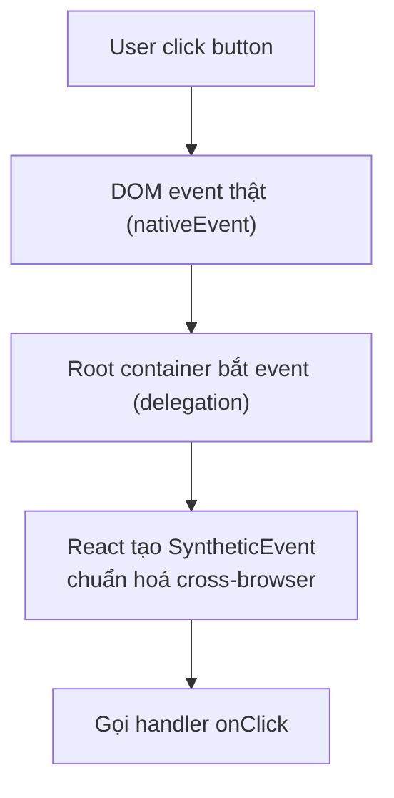
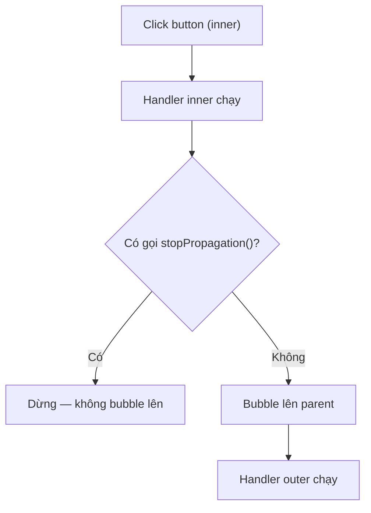

# Events

**Events** (sự kiện người dùng như click, gõ phím, di chuột) là cách React phản hồi lại các tương tác trên giao diện. Bạn gắn một **event handler** (hàm xử lý sự kiện) vào phần tử qua các prop như `onClick`, `onChange`. React bọc sự kiện gốc của trình duyệt trong **Synthetic Event** (sự kiện tổng hợp giúp hoạt động đồng nhất trên mọi trình duyệt).

---

:::note[Ghi nhớ nhanh]

- ⭐ **Gắn handler khai báo trong JSX** bằng prop camelCase (`onClick`, `onChange`, `onSubmit`) và truyền function — không cần `addEventListener` thủ công.
- ⭐ **React bọc event trong Synthetic Event** — chuẩn hoá cross-browser và dùng event delegation tại root container (từ React 17, trước đó là `document`).
- **`preventDefault()`** chặn hành vi mặc định (form reload, navigate); **`stopPropagation()`** chặn bubble lên parent — nhưng đừng lạm dụng, nên kiểm tra `e.target`/`e.currentTarget`.
- **Pointer events** (`onPointerDown`...) hợp nhất mouse + touch, viết 1 lần chạy mọi thiết bị.
- **React 19 Actions** (`<form action>`, `useFormStatus`, `useOptimistic`) là cách handle form mới, phổ biến trong Next.js App Router.

:::

---

## Mục lục

- [Vì sao React dùng Synthetic Event?](#vì-sao-react-dùng-synthetic-event)
- [Event handler cơ bản](#event-handler-cơ-bản)
- [Synthetic Events](#synthetic-events)
- [Common events](#common-events)
- [preventDefault và stopPropagation](#preventdefault-và-stoppropagation)
- [Form events](#form-events)
- [Câu hỏi phỏng vấn](#câu-hỏi-phỏng-vấn)

---

## Vì sao React dùng Synthetic Event?

**Vấn đề:** Gắn `addEventListener` thủ công cho từng DOM node thì khó quản lý, dễ quên gỡ (gây memory leak), và mỗi trình duyệt lại có khác biệt nhỏ về event.

```jsx
// Tự gắn listener cho từng node — rườm rà, dễ leak
const btn = document.getElementById("save");
btn.addEventListener("click", handleClick);

// Quên gỡ → leak khi node bị xoá
// btn.removeEventListener("click", handleClick);

// Trình duyệt khác nhau, behavior event lệch nhau
```

**Giải pháp:** React dùng **Synthetic Event** — lớp bọc chuẩn hoá event của trình duyệt (API đồng nhất cross-browser). Bạn gắn handler khai báo ngay trong JSX (`onClick`...), React tự quản lý đăng ký/gỡ qua **event delegation** → gọn và nhất quán.

```jsx
// Khai báo handler ngay trong JSX
// React tự đăng ký/gỡ, tự chuẩn hoá event mọi trình duyệt
<button onClick={handleClick}>Save</button>
```

:::tip[Dùng thực tế]

- `onClick` / `onChange` / `onSubmit` — gắn handler khai báo, không cần `addEventListener`.
- `e.preventDefault()` trong `onSubmit` để chặn form reload page.
- `e.stopPropagation()` để chặn event bubble lên parent.
- Handler nhất quán mọi trình duyệt — không cần xử lý riêng cho Chrome/Firefox/Safari.

:::

---

## Event handler cơ bản

JSX dùng **camelCase** cho event, truyền **function** thay vì string:

```jsx
// HTML
<button onclick="handleClick()">Click</button>

// JSX
<button onClick={handleClick}>Click</button>
```

Inline function:

```jsx
<button onClick={() => alert("Hi")}>Click</button>

<button onClick={() => doSomething(item.id)}>Edit</button>
```

Với TypeScript:

```tsx
function Button() {
  const handleClick = (e: React.MouseEvent<HTMLButtonElement>) => {
    console.log(e.currentTarget);
  };

  return <button onClick={handleClick}>Click</button>;
}
```

---

## Synthetic Events

React **không gắn listener trực tiếp lên DOM** — nó dùng **synthetic
event system** với delegation tại root.

```jsx
function handleClick(e) {
  console.log(e);                    // SyntheticEvent
  console.log(e.nativeEvent);        // DOM event thật
  console.log(e.currentTarget);      // element gắn handler
  console.log(e.target);             // element thực sự gây event
}
```

Sơ đồ luồng một click đi từ DOM thật qua delegation tới handler:



Lợi ích:

- **Cross-browser normalize** — behavior giống nhau giữa Chrome, Firefox, Safari.
- **Event pooling** (đã loại bỏ từ React 17).
- **Tích hợp với React batching** — multiple state update trong handler được gộp.

:::info[Phân tích]

**React 17+ thay đổi event delegation:**

Trước React 17: gắn listener ở `document`.
React 17+: gắn ở **root container** (`#root`).

Khác biệt thực tế:

- Nếu có **multiple React app** trên cùng page, mỗi app có event system riêng.
- `e.stopPropagation()` trong React app **không** stop được listener gắn
  ngoài root (vd analytics gắn lên document).
- Khi dùng third-party widget với DOM event tay → cẩn thận timing.

:::

---

## Common events

**Mouse**:

```jsx
<div
  onClick={handle}
  onDoubleClick={handle}
  onMouseEnter={handle}
  onMouseLeave={handle}
  onMouseDown={handle}
  onMouseUp={handle}
  onMouseMove={handle}
/>
```

**Keyboard**:

```jsx
<input
  onKeyDown={handle}
  onKeyUp={handle}
  onKeyPress={handle}  // deprecated, dùng onKeyDown
/>

const handle = (e) => {
  if (e.key === "Enter") submit();
  if (e.key === "Escape") cancel();
  if (e.ctrlKey && e.key === "s") save();
};
```

**Form**:

```jsx
<input
  onChange={handle}    // mỗi keystroke
  onInput={handle}     // tương tự onChange
  onFocus={handle}
  onBlur={handle}
/>

<form onSubmit={handle}>...</form>
```

**Touch (mobile)**:

```jsx
<div
  onTouchStart={handle}
  onTouchMove={handle}
  onTouchEnd={handle}
/>
```

**Pointer (cross-device)**:

```jsx
<div
  onPointerDown={handle}
  onPointerMove={handle}
  onPointerUp={handle}
/>
```

:::tip[Mẹo]

**Pointer events** thay thế mouse + touch — viết 1 lần, chạy mọi device:

```jsx
// Tệ — viết 2 lần
<div onMouseDown={handle} onTouchStart={handle}>

// Tốt — pointer unified
<div onPointerDown={handle}>
```

Pointer events hỗ trợ:

- `pointerType` — `"mouse" | "pen" | "touch"`.
- `pressure` — áp lực bút stylus.
- `pointerId` — track multiple pointer.
- Cross-browser (Safari hỗ trợ từ 13+).

Modern app (Figma, Notion) đều dùng pointer events.

:::

---

## preventDefault và stopPropagation

**`preventDefault()`** — chặn behavior mặc định:

```jsx
<form onSubmit={(e) => {
  e.preventDefault();  // không reload page
  submitData();
}}>

<a onClick={(e) => {
  e.preventDefault();  // không navigate
  navigate("/custom");
}}>
```

**`stopPropagation()`** — chặn event bubble lên parent:

Sơ đồ cho thấy `stopPropagation()` quyết định event có bubble lên parent hay không:



```jsx
<div onClick={() => console.log("outer")}>
  <button onClick={(e) => {
    e.stopPropagation();  // không bubble
    console.log("inner");
  }}>
    Click
  </button>
</div>
```

:::warning[Cần lưu ý]

**Đừng abuse `stopPropagation`** — nó "ẩn" event khỏi:

- Parent component khác trong React.
- Library listener (modal close khi click outside).
- Analytics tracking listener ở root.

Pattern tốt hơn — **kiểm tra target**:

```jsx
<div onClick={(e) => {
  if (e.target === e.currentTarget) {
    // chỉ xử lý click thẳng vào div này
    closeModal();
  }
}}>
  <ModalContent />
</div>
```

Hoặc dùng `e.target.closest(".specific")` để biết click ở đâu.

:::

---

## Form events

Pattern controlled input:

```jsx
function ContactForm() {
  const [email, setEmail] = useState("");
  const [message, setMessage] = useState("");

  const handleSubmit = (e) => {
    e.preventDefault();
    api.send({ email, message });
  };

  return (
    <form onSubmit={handleSubmit}>
      <input
        value={email}
        onChange={(e) => setEmail(e.target.value)}
      />
      <textarea
        value={message}
        onChange={(e) => setMessage(e.target.value)}
      />
      <button type="submit">Send</button>
    </form>
  );
}
```

React 19 — Actions với `<form action>`:

```jsx
async function submit(formData) {
  "use server"; // server action
  await db.save({ email: formData.get("email") });
}

<form action={submit}>
  <input name="email" />
  <button type="submit">Send</button>
</form>
```

:::info[Phân tích]

**React 19 Actions** thay đổi cách handle form:

- **Server Actions** — function chạy trên server, gọi từ form/button.
- **Pending state** tự động via `useFormStatus`.
- **Error handling** tích hợp với Error Boundary.
- **Optimistic update** với `useOptimistic`.

```jsx
"use client";

import { useFormStatus } from "react-dom";

function SubmitButton() {
  const { pending } = useFormStatus();
  return (
    <button disabled={pending}>
      {pending ? "Saving..." : "Save"}
    </button>
  );
}

function Form() {
  return (
    <form action={saveAction}>
      <input name="title" />
      <SubmitButton />
    </form>
  );
}
```

Pattern này phổ biến trong Next.js App Router + React 19. Sẽ học chi tiết
ở phần Forms.

:::

:::tip[Mẹo]

**Cheat sheet event types với TypeScript**:

```tsx
React.MouseEvent<HTMLButtonElement>     // click button
React.MouseEvent<HTMLDivElement>        // click div
React.ChangeEvent<HTMLInputElement>     // input change
React.ChangeEvent<HTMLSelectElement>    // select change
React.FormEvent<HTMLFormElement>        // form submit
React.KeyboardEvent<HTMLInputElement>   // keydown trên input
React.FocusEvent<HTMLInputElement>      // focus/blur
React.DragEvent<HTMLDivElement>         // drag/drop
```

Hoặc dùng **inline inference**:

```tsx
<button onClick={(e) => {
  // e tự được TS infer thành MouseEvent<HTMLButtonElement>
  e.currentTarget.disabled = true;
}}>
```

VS Code autocomplete sẽ cho thấy type ngay khi hover. Không cần nhớ tên đầy đủ.

:::

---

## Câu hỏi phỏng vấn

Những câu thường gặp về chủ đề này. Tự trả lời trước, rồi đối chiếu lại với nội dung phía trên.

1. `Synthetic Event` là gì và vì sao React phải bọc event gốc của trình duyệt lại?
2. Làm sao truy cập event gốc của DOM từ một synthetic event, và khi nào bạn thực sự cần tới nó?
3. `Event delegation` trong React hoạt động ra sao? React gắn listener thật ở đâu?
4. React 17 chuyển nơi gắn listener từ `document` sang `root container` — thay đổi này gây ảnh hưởng thực tế gì?
5. `Event pooling` là gì, vì sao React từng dùng nó và vì sao React 17 loại bỏ?
6. `e.target` và `e.currentTarget` khác nhau thế nào? Cho một ví dụ mà chúng trả về hai element khác nhau.
7. `preventDefault()` và `stopPropagation()` khác nhau ra sao? Khi nào dùng cái nào?
8. Vì sao trong React, `return false` trong handler không chặn được hành vi mặc định như trong HTML hay jQuery?
9. `stopPropagation()` trong React có chặn được listener gắn bằng `addEventListener` ở `document` không? Giải thích theo cơ chế delegation.
10. `Bubbling` và `capturing` khác nhau thế nào, và React cho đăng ký phase capture bằng cú pháp nào?
11. Vì sao viết `onClick={handleClick()}` là sai còn `onClick={handleClick}` là đúng?
12. Cách truyền tham số cho handler mà không sinh bug? So sánh arrow function inline với `bind`.
13. Arrow function inline trong JSX có làm component con re-render thừa không? Khi nào cần `useCallback` kết hợp `React.memo`?
14. Nhiều lệnh cập nhật state trong cùng một handler được gộp (`batching`) như thế nào? React 18 `automatic batching` thay đổi gì so với trước?
15. `onChange` của React khác `onchange` của DOM thuần ở chỗ nào?
16. `Controlled` và `uncontrolled input` khác nhau ra sao trong cách xử lý `onChange`? Ưu nhược của từng loại?
17. Khi nào buộc phải dùng `addEventListener` thủ công thay vì prop event của React (ví dụ với `window`, `document`, `passive listener`, hay node ngoài React)?
18. `Pointer events` so với `mouse` và `touch events` có lợi ích gì? Khi nào vẫn cần tách riêng?
19. Về accessibility, vì sao chỉ gắn `onClick` lên một `div` là chưa đủ? Cần bổ sung những gì?
20. React 19 Actions (`form action`, `useFormStatus`, `useOptimistic`) thay đổi cách xử lý submit form như thế nào so với `onSubmit` truyền thống?
