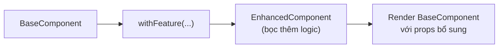
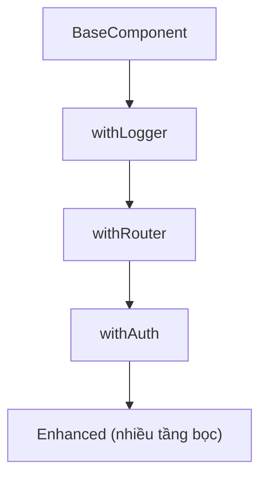

# Higher Order Components (HOC)

**HOC** (Higher-Order Component — component bậc cao) là một hàm nhận vào một component và trả về một component mới đã được bổ sung thêm tính năng. Đây là kỹ thuật tái sử dụng logic chung (như kiểm tra đăng nhập, theo dõi dữ liệu) cho nhiều component khác nhau mà không lặp lại code. HOC từng rất phổ biến và nay thường được thay thế bằng custom hook trong code hiện đại.

---

## Mục lục

- [Vì sao có HOC (Higher-Order Component)?](#vì-sao-có-hoc-higher-order-component)
- [HOC là gì?](#hoc-là-gì)
- [Ví dụ cơ bản](#ví-dụ-cơ-bản)
- [HOC nâng cao](#hoc-nâng-cao)
- [HOC vs Custom Hook](#hoc-vs-custom-hook)
- [Khi nào còn dùng HOC?](#khi-nào-còn-dùng-hoc)

---

## Vì sao có HOC (Higher-Order Component)?

**Vấn đề:** Nhiều component cần **cùng một logic bọc ngoài** — kiểm tra
đăng nhập, inject dữ liệu, ghi log. Lặp lại ở từng component thì trùng
code. Trước khi có Hooks, không có cách gọn để chia sẻ logic này.

```jsx
// Logic kiểm tra đăng nhập lặp lại ở mọi page
function Dashboard() {
  const user = useUser();
  if (!user) return <Login />;
  return <div>Dashboard...</div>;
}

function Settings() {
  const user = useUser();
  if (!user) return <Login />; // ← trùng code
  return <div>Settings...</div>;
}
```

**Giải pháp:** Dùng **HOC** — một **hàm** nhận vào component và trả về
một component **mới** đã được "bọc" thêm hành vi. Logic cross-cutting viết
một lần, dùng lại cho nhiều component.

```jsx
// Viết logic một lần trong HOC
function withAuth(Component) {
  return function Guarded(props) {
    const user = useUser();
    if (!user) return <Login />;
    return <Component {...props} user={user} />;
  };
}

// Bọc nhiều page, không lặp logic
const Dashboard = withAuth(Page);
const Settings = withAuth(SettingsPage);
```

(Nay phần lớn được thay bằng custom hook, nhưng HOC vẫn gặp: `connect`
của Redux, `withRouter` cũ.)

:::tip[Dùng thực tế]

- **`withAuth`** — bảo vệ route, chặn user chưa đăng nhập.
- **`connect(mapState, mapDispatch)`** — Redux inject state/dispatch vào props.
- **`withTheme`** — inject theme hiện tại cho component.
- **Logging / analytics wrapper** — tự động ghi log mỗi lần render hoặc tracking sự kiện.

:::

---

## HOC là gì?

**Higher-Order Component (HOC)** = function **nhận component, trả về
component mới** đã được enhance.

```jsx
const EnhancedComponent = withFeature(BaseComponent);
```

Pattern: `Component → HOC → Enhanced Component`.

Sơ đồ luồng biến đổi của một HOC:



---

## Ví dụ cơ bản

```jsx
// HOC thêm logging
function withLogger(Component) {
  return function LoggedComponent(props) {
    console.log("Render", Component.name, props);
    return <Component {...props} />;
  };
}

// Dùng
function Button({ label }) {
  return <button>{label}</button>;
}

const LoggedButton = withLogger(Button);

<LoggedButton label="Save" />
```

Convention naming:

- HOC bắt đầu bằng `with`: `withAuth`, `withRouter`, `withTheme`.
- Component trả về có `displayName = "WithX(BaseName)"` (cho devtools).

---

## HOC nâng cao

**HOC với config**:

```jsx
function withAuth(Component, requiredRole) {
  return function AuthGated(props) {
    const user = useUser();

    if (!user) return <Login />;
    if (user.role !== requiredRole) return <NoPermission />;

    return <Component {...props} user={user} />;
  };
}

const AdminPanel = withAuth(Panel, "admin");
```

**HOC inject props**:

```jsx
function withRouter(Component) {
  return function (props) {
    const navigate = useNavigate();
    const location = useLocation();
    return <Component {...props} navigate={navigate} location={location} />;
  };
}

// Component nhận navigate, location qua props
const PageWithRouter = withRouter(Page);
```

:::warning[Cần lưu ý]

**Vấn đề của HOC**:

**1. Prop collision** — HOC inject prop trùng với prop của user:

```jsx
const Enhanced = withRouter(MyComponent);

<Enhanced navigate={myCustomNavigate} />
// HOC inject navigate sẽ override → user mất quyền kiểm soát
```

**2. Type-safety kém với TypeScript**:

```tsx
const Enhanced = withAuth(withRouter(withLogger(BaseComponent)));
// Type của Enhanced rất khó infer — phải khai báo tay
```

**3. Wrapper hell trong DevTools**:

Compose nhiều HOC tạo ra nhiều tầng bọc lồng nhau, khó lần trong DevTools:



```
<WithAuth>
  <WithRouter>
    <WithLogger>
      <BaseComponent />
    </WithLogger>
  </WithRouter>
</WithAuth>
```

**4. Không share state giữa nhiều HOC** một cách dễ dàng.

Custom hooks giải quyết hầu hết các vấn đề này. Đó là lý do HOC bị
giảm phổ biến mạnh từ React 16.8.

:::

---

## HOC vs Custom Hook

```jsx
// Cách cũ — HOC
const UserPage = withAuth(withTheme(withRouter(Page)));

// Cách mới — Hook
function Page() {
  const user = useAuth();
  const theme = useTheme();
  const navigate = useNavigate();
  // ...
}
```

So sánh:

| | HOC | Custom Hook |
|--|-----|-------------|
| Cú pháp | Wrap | Gọi như function |
| Multiple feature | Lồng `withA(withB(...))` | Gọi nhiều `useA(); useB();` |
| TS type | Khó | **Dễ** (return inferred) |
| Devtools | Wrapper hell | Hiện rõ trong panel hook |
| Conditional | Khó (HOC compile-time) | **Dễ** (gọi tùy điều kiện*) |
| Share giữa class | OK | Không (chỉ function comp) |

(* hooks vẫn phải tuân **Rules of Hooks** — không trong if/loop. Sẽ học sau.)

---

## Khi nào còn dùng HOC?

Năm 2026, HOC chỉ còn vài use case hợp lý:

**1. Wrap toàn bộ component với boundary** (auth, error, theme):

```jsx
// Có thể viết cả hai cách
function ProtectedRoute({ children }) {
  const user = useAuth();
  if (!user) return <Login />;
  return children;
}

// HOC
const withProtected = (Component) => (props) => {
  const user = useAuth();
  if (!user) return <Login />;
  return <Component {...props} />;
};
```

→ Component wrapper thường rõ ràng hơn HOC.

**2. Integrate với library chưa hook-based**:

- Redux cũ: `connect(mapState, mapDispatch)(Component)` (chuyển sang `useSelector`/`useDispatch`).
- React Router v5: `withRouter` (v6 dùng hook).
- Material UI v4: `withStyles` (v5 dùng `styled` / `sx`).

Code legacy dùng HOC → migrate dần sang hook.

**3. Class component compatibility**:

```jsx
// Hook không gọi được trong class
class Old extends Component {
  // Không thể dùng useAuth() ở đây
}

// HOC vẫn được
const OldWithAuth = withAuth(Old);
```

:::info[Phân tích]

**HOC vẫn là khái niệm quan trọng** trong React functional programming:

- Là **higher-order function** áp dụng cho component.
- Mỗi HOC là một **transformation pure** component → component.
- Có thể **compose** nhiều HOC: `compose(withA, withB, withC)(Component)`.

Hiểu HOC giúp đọc code legacy và **tư duy functional** — nhiều pattern
trong custom hooks thực ra cũng là application của functional programming
principles.

Library hiện đại nào còn dùng HOC nhiều:

- **MobX** — `observer(Component)`.
- **Sentry** — `withSentry(Component)`.
- **React-Redux** — `connect()` (legacy, nhưng còn nhiều code dùng).
- **Storybook** — `withDecorator`.

:::

:::tip[Mẹo]

**Khi cần migrate HOC → hook**, làm theo bước:

1. Đảm bảo HOC hiện tại có test cover.
2. Viết custom hook **tương đương**.
3. Migrate từng component dùng HOC — đổi sang hook, xoá HOC khi không
   còn ai dùng.
4. Update test.
5. Loại HOC khỏi codebase.

Cẩn thận với HOC inject prop bị override — sau migrate hook cần verify
behavior không đổi.

:::
