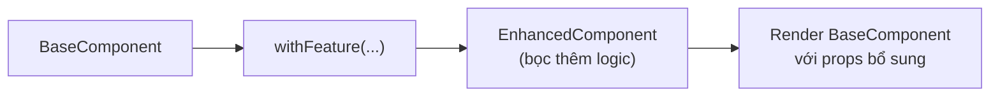
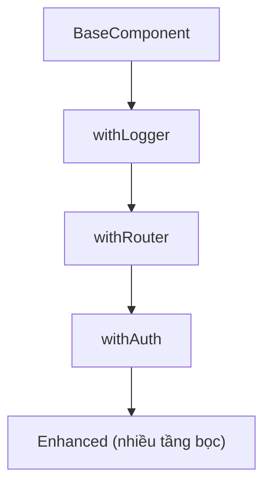

# Higher Order Components (HOC)

**HOC** (Higher-Order Component — component bậc cao) là một hàm nhận vào một component và trả về một component mới đã được bổ sung thêm tính năng. Đây là kỹ thuật tái sử dụng logic chung (như kiểm tra đăng nhập, theo dõi dữ liệu) cho nhiều component khác nhau mà không lặp lại code. HOC từng rất phổ biến và nay thường được thay thế bằng custom hook trong code hiện đại.

[](pathname:///img/react/hoc.webp)

---

:::note[Ghi nhớ nhanh]

- ⭐ **HOC = hàm nhận một component, trả về component mới** đã bọc thêm logic (`Component → HOC → Enhanced Component`), dùng chia sẻ logic cross-cutting.
- **Convention đặt tên `with...`** (`withAuth`, `withRouter`, `withTheme`) và set `displayName` cho DevTools.
- **Nhược điểm** — prop collision, TS infer type khó, "wrapper hell" khi compose nhiều tầng, khó share state; nên HOC giảm phổ biến từ React 16.8.
- ⭐ **Custom hook thay thế đa số use case** — gọi nhiều hook thay vì lồng `withA(withB(...))`, type dễ, hiện rõ trong DevTools.
- **HOC còn dùng** cho class component (không gọi được hook) và library legacy: Redux `connect`, MobX `observer`, Sentry `withSentry`.

:::

---

## Mục lục

- [Vì sao có HOC (Higher-Order Component)?](#vì-sao-có-hoc-higher-order-component)
- [HOC là gì?](#hoc-là-gì)
- [Ví dụ cơ bản](#ví-dụ-cơ-bản)
- [HOC nâng cao](#hoc-nâng-cao)
- [HOC vs Custom Hook](#hoc-vs-custom-hook)
- [Khi nào còn dùng HOC?](#khi-nào-còn-dùng-hoc)
- [Câu hỏi phỏng vấn](#câu-hỏi-phỏng-vấn)

---

## Vì sao có HOC (Higher-Order Component)?

**Vấn đề:** Nhiều component cần **cùng một logic bọc ngoài** — kiểm tra
đăng nhập, inject dữ liệu, ghi log. Lặp lại ở từng component thì trùng
code. Trước khi có Hooks, không có cách gọn để chia sẻ logic này.

```jsx
// Logic kiểm tra đăng nhập lặp lại ở mọi page
function Dashboard() {
  const user = useUser();
  if (!user) return <Login />;
  return <div>Dashboard...</div>;
}

function Settings() {
  const user = useUser();
  if (!user) return <Login />; // ← trùng code
  return <div>Settings...</div>;
}
```

**Giải pháp:** Dùng **HOC** — một **hàm** nhận vào component và trả về
một component **mới** đã được "bọc" thêm hành vi. Logic cross-cutting viết
một lần, dùng lại cho nhiều component.

```jsx
// Viết logic một lần trong HOC
function withAuth(Component) {
  return function Guarded(props) {
    const user = useUser();
    if (!user) return <Login />;
    return <Component {...props} user={user} />;
  };
}

// Bọc nhiều page, không lặp logic
const Dashboard = withAuth(Page);
const Settings = withAuth(SettingsPage);
```

(Nay phần lớn được thay bằng custom hook, nhưng HOC vẫn gặp: `connect`
của Redux, `withRouter` cũ.)

:::tip[Dùng thực tế]

- **`withAuth`** — bảo vệ route, chặn user chưa đăng nhập.
- **`connect(mapState, mapDispatch)`** — Redux inject state/dispatch vào props.
- **`withTheme`** — inject theme hiện tại cho component.
- **Logging / analytics wrapper** — tự động ghi log mỗi lần render hoặc tracking sự kiện.

:::

---

## HOC là gì?

**Higher-Order Component (HOC)** = function **nhận component, trả về
component mới** đã được enhance.

```jsx
const EnhancedComponent = withFeature(BaseComponent);
```

Pattern: `Component → HOC → Enhanced Component`.

Sơ đồ luồng biến đổi của một HOC:



---

## Ví dụ cơ bản

```jsx
// HOC thêm logging
function withLogger(Component) {
  return function LoggedComponent(props) {
    console.log("Render", Component.name, props);
    return <Component {...props} />;
  };
}

// Dùng
function Button({ label }) {
  return <button>{label}</button>;
}

const LoggedButton = withLogger(Button);

<LoggedButton label="Save" />
```

Convention naming:

- HOC bắt đầu bằng `with`: `withAuth`, `withRouter`, `withTheme`.
- Component trả về có `displayName = "WithX(BaseName)"` (cho devtools).

---

## HOC nâng cao

**HOC với config**:

```jsx
function withAuth(Component, requiredRole) {
  return function AuthGated(props) {
    const user = useUser();

    if (!user) return <Login />;
    if (user.role !== requiredRole) return <NoPermission />;

    return <Component {...props} user={user} />;
  };
}

const AdminPanel = withAuth(Panel, "admin");
```

**HOC inject props**:

```jsx
function withRouter(Component) {
  return function (props) {
    const navigate = useNavigate();
    const location = useLocation();
    return <Component {...props} navigate={navigate} location={location} />;
  };
}

// Component nhận navigate, location qua props
const PageWithRouter = withRouter(Page);
```

:::warning[Cần lưu ý]

**Vấn đề của HOC**:

**1. Prop collision** — HOC inject prop trùng với prop của user:

```jsx
const Enhanced = withRouter(MyComponent);

<Enhanced navigate={myCustomNavigate} />
// HOC inject navigate sẽ override → user mất quyền kiểm soát
```

**2. Type-safety kém với TypeScript**:

```tsx
const Enhanced = withAuth(withRouter(withLogger(BaseComponent)));
// Type của Enhanced rất khó infer — phải khai báo tay
```

**3. Wrapper hell trong DevTools**:

Compose nhiều HOC tạo ra nhiều tầng bọc lồng nhau, khó lần trong DevTools:



```
<WithAuth>
  <WithRouter>
    <WithLogger>
      <BaseComponent />
    </WithLogger>
  </WithRouter>
</WithAuth>
```

**4. Không share state giữa nhiều HOC** một cách dễ dàng.

Custom hooks giải quyết hầu hết các vấn đề này. Đó là lý do HOC bị
giảm phổ biến mạnh từ React 16.8.

:::

---

## HOC vs Custom Hook

```jsx
// Cách cũ — HOC
const UserPage = withAuth(withTheme(withRouter(Page)));

// Cách mới — Hook
function Page() {
  const user = useAuth();
  const theme = useTheme();
  const navigate = useNavigate();
  // ...
}
```

So sánh:

| | HOC | Custom Hook |
|--|-----|-------------|
| Cú pháp | Wrap | Gọi như function |
| Multiple feature | Lồng `withA(withB(...))` | Gọi nhiều `useA(); useB();` |
| TS type | Khó | **Dễ** (return inferred) |
| Devtools | Wrapper hell | Hiện rõ trong panel hook |
| Conditional | Khó (HOC compile-time) | **Dễ** (gọi tùy điều kiện*) |
| Share giữa class | OK | Không (chỉ function comp) |

(* hooks vẫn phải tuân **Rules of Hooks** — không trong if/loop. Sẽ học sau.)

---

## Khi nào còn dùng HOC?

Năm 2026, HOC chỉ còn vài use case hợp lý:

**1. Wrap toàn bộ component với boundary** (auth, error, theme):

```jsx
// Có thể viết cả hai cách
function ProtectedRoute({ children }) {
  const user = useAuth();
  if (!user) return <Login />;
  return children;
}

// HOC
const withProtected = (Component) => (props) => {
  const user = useAuth();
  if (!user) return <Login />;
  return <Component {...props} />;
};
```

→ Component wrapper thường rõ ràng hơn HOC.

**2. Integrate với library chưa hook-based**:

- Redux cũ: `connect(mapState, mapDispatch)(Component)` (chuyển sang `useSelector`/`useDispatch`).
- React Router v5: `withRouter` (v6 dùng hook).
- Material UI v4: `withStyles` (v5 dùng `styled` / `sx`).

Code legacy dùng HOC → migrate dần sang hook.

**3. Class component compatibility**:

```jsx
// Hook không gọi được trong class
class Old extends Component {
  // Không thể dùng useAuth() ở đây
}

// HOC vẫn được
const OldWithAuth = withAuth(Old);
```

:::info[Phân tích]

**HOC vẫn là khái niệm quan trọng** trong React functional programming:

- Là **higher-order function** áp dụng cho component.
- Mỗi HOC là một **transformation pure** component → component.
- Có thể **compose** nhiều HOC: `compose(withA, withB, withC)(Component)`.

Hiểu HOC giúp đọc code legacy và **tư duy functional** — nhiều pattern
trong custom hooks thực ra cũng là application của functional programming
principles.

Library hiện đại nào còn dùng HOC nhiều:

- **MobX** — `observer(Component)`.
- **Sentry** — `withSentry(Component)`.
- **React-Redux** — `connect()` (legacy, nhưng còn nhiều code dùng).
- **Storybook** — `withDecorator`.

:::

:::tip[Mẹo]

**Khi cần migrate HOC → hook**, làm theo bước:

1. Đảm bảo HOC hiện tại có test cover.
2. Viết custom hook **tương đương**.
3. Migrate từng component dùng HOC — đổi sang hook, xoá HOC khi không
   còn ai dùng.
4. Update test.
5. Loại HOC khỏi codebase.

Cẩn thận với HOC inject prop bị override — sau migrate hook cần verify
behavior không đổi.

:::

---

## Câu hỏi phỏng vấn

Những câu thường gặp về chủ đề này. Tự trả lời trước, rồi bấm **Xem đáp án** để đối chiếu.

**1. `HOC` là gì? Mô tả signature của nó bằng lời.**

<details className="qa">
<summary>Xem đáp án</summary>

**Higher-Order Component (HOC)** là một **hàm nhận vào một component và trả về một component mới** đã được bổ sung thêm tính năng. Nó không phải là component, không xuất hiện trong JSX — nó là một phép biến đổi chạy lúc định nghĩa module.

Signature nói bằng lời: "nhận một component, trả về một component" — tức là `Component → HOC → Enhanced Component`.

```jsx
function withLogger(Component) {
  return function LoggedComponent(props) {
    console.log("Render", Component.name, props);
    return <Component {...props} />;
  };
}

const LoggedButton = withLogger(Button);
```

Component trả về thường làm ba việc: chạy logic bổ sung (đọc context, gọi hook, kiểm tra điều kiện), truyền tiếp toàn bộ props gốc bằng `{...props}`, và có thể tiêm thêm props mới.

Mục đích: tái sử dụng **logic cross-cutting** (xác thực, logging, inject theme) cho nhiều component mà không lặp code. Theo quy ước, tên HOC bắt đầu bằng `with`.

</details>

**2. `HOC` khác một component bọc thông thường và khác `custom hook` ở những điểm nào?**

<details className="qa">
<summary>Xem đáp án</summary>

| | HOC | Wrapper component | Custom hook |
|---|---|---|---|
| Bản chất | Hàm nhận component, trả component | Component nhận `children` | Hàm gọi các hook khác |
| Cách dùng | `withAuth(Page)` — lúc định nghĩa | Viết trong JSX như thẻ thường | Gọi trong thân component |
| Chia sẻ cái gì | Cả logic lẫn cấu trúc render | Chủ yếu cấu trúc render | Chỉ logic và state |
| Nhiều tính năng | Lồng nhau `withA(withB(...))` | Lồng thẻ trong JSX | Gọi liên tiếp, phẳng |
| TypeScript | Khó suy luận kiểu | Dễ | Dễ (kiểu trả về tự suy ra) |
| DevTools | Thêm nhiều tầng bọc | Thêm một tầng rõ ràng | Không thêm tầng nào |

Wrapper component bọc **nội dung** — quyết định render gì quanh `children`. HOC bọc **chính component** — nó biết cả component đó là ai để tiêm props vào. Custom hook không đụng tới cây component: nó chỉ trả về dữ liệu, còn component tự quyết định render thế nào — nên linh hoạt nhất và là lựa chọn mặc định hiện nay.

</details>

**3. Kể các use case kinh điển của `HOC`: xác thực, logging, theme, data fetching.**

<details className="qa">
<summary>Xem đáp án</summary>

- **`withAuth`** — kiểm tra người dùng đã đăng nhập chưa, chưa thì render `Login`, rồi tiêm `user` xuống props. Có thể nhận thêm tham số vai trò để chặn theo quyền.
- **Logging / analytics** — ghi log mỗi lần render hoặc tracking sự kiện mà không phải sửa từng component.
- **`withTheme`** — đọc theme hiện tại từ context và tiêm xuống props, để component không cần biết context nằm ở đâu.
- **Data fetching** — HOC tự gọi API, quản lý trạng thái loading/error rồi tiêm dữ liệu xuống. Đây là mô hình của `connect` trong Redux.

```jsx
function withAuth(Component, requiredRole) {
  return function AuthGated(props) {
    const user = useUser();
    if (!user) return <Login />;
    if (user.role !== requiredRole) return <NoPermission />;
    return <Component {...props} user={user} />;
  };
}
```

Điểm chung: đây đều là logic **cross-cutting** — không thuộc về nghiệp vụ riêng của component nào, mà cần áp dụng lặp lại cho nhiều component. Hiện nay phần lớn các use case này được viết bằng custom hook.

</details>

**4. Vì sao `HOC` không được phép mutate component gốc? Hậu quả nếu vi phạm là gì?**

<details className="qa">
<summary>Xem đáp án</summary>

HOC phải là một **phép biến đổi thuần** (pure transformation): nhận component vào, trả component mới ra, **không sửa gì trên component đầu vào**.

Ví dụ vi phạm:

```jsx
// Sai — sửa thẳng component gốc
function withLogger(Component) {
  Component.prototype.componentDidMount = function () {
    console.log("mounted");
  };
  return Component; // trả về chính nó
}
```

Hậu quả:

- **Ô nhiễm toàn cục** — mọi nơi import component gốc đều bị ảnh hưởng, kể cả nơi không hề dùng HOC. Bug xuất hiện ở chỗ không ai ngờ tới.
- **Ghi đè lẫn nhau** — bọc bằng hai HOC cùng sửa một method thì cái sau xoá mất cái trước.
- **Mất khả năng composition** — HOC "sạch" có thể ghép tuỳ ý; HOC mutate thì kết quả phụ thuộc thứ tự và số lần gọi.
- **Không dự đoán được khi test** — thứ tự import ảnh hưởng tới kết quả test.

Cách đúng luôn là bọc: tạo component mới, render component gốc bên trong và truyền tiếp props bằng `{...props}`.

</details>

**5. Vì sao không được tạo `HOC` bên trong render (hoặc bên trong thân một component)? Điều gì xảy ra với state và DOM của cây con?**

<details className="qa">
<summary>Xem đáp án</summary>

Vì mỗi lần render, lời gọi HOC tạo ra một **kiểu component hoàn toàn mới** (một tham chiếu function khác). React so sánh kiểu component để quyết định cập nhật hay dựng lại; thấy kiểu khác, nó coi đây là component khác hẳn.

```jsx
// Sai
function Page(props) {
  const Enhanced = withAuth(Content); // tạo lại mỗi render
  return <Enhanced {...props} />;
}

// Đúng — tạo một lần ở module scope
const Enhanced = withAuth(Content);
function Page(props) {
  return <Enhanced {...props} />;
}
```

Hậu quả ở mỗi lần render cha:

- Toàn bộ cây con bị **unmount rồi mount lại**: state trong đó mất sạch, quay về giá trị khởi tạo.
- DOM thật bị **huỷ và dựng lại** — mất focus, mất vị trí cuộn, animation chạy lại từ đầu.
- Mọi `useEffect` chạy cleanup rồi chạy lại, kéo theo gọi API lặp.
- Hiệu năng tệ vì không tái sử dụng được gì.

Quy tắc: luôn áp dụng HOC ở cấp module, ngoài mọi component.

</details>

**6. `displayName` trong `HOC` dùng để làm gì, và đặt theo convention nào?**

<details className="qa">
<summary>Xem đáp án</summary>

`displayName` là tên mà React DevTools và các thông báo lỗi dùng để hiển thị component. Nếu HOC trả về một arrow function ẩn danh, DevTools chỉ hiện `Anonymous` hoặc `Unknown` — cây component thành một dãy hộp đen, rất khó debug.

Convention là `WithX(BaseName)`:

```jsx
function withAuth(Component) {
  function AuthGated(props) {
    const user = useUser();
    if (!user) return <Login />;
    return <Component {...props} user={user} />;
  }

  AuthGated.displayName =
    `WithAuth(${Component.displayName || Component.name || "Component"})`;

  return AuthGated;
}
```

Kết quả trong DevTools: `WithAuth(Dashboard)` — nhìn là biết ngay component nào đang bị bọc bởi HOC nào. Chuỗi fallback ba tầng là cần thiết vì component có thể đã được HOC khác đặt `displayName`, hoặc là function ẩn danh không có `name`.

Với các thư viện phổ biến, đây là thực hành chuẩn — bạn sẽ thấy `Connect(TodoList)` của Redux hay `withRouter(Page)` trong DevTools.

</details>

**7. Các `static method` của component gốc có tự động đi qua `HOC` không? Xử lý thế nào (ví dụ `hoist-non-react-statics`)?**

<details className="qa">
<summary>Xem đáp án</summary>

**Không.** HOC trả về một function mới hoàn toàn, nên mọi thuộc tính tĩnh gắn trên component gốc đều **biến mất** trên component đã bọc.

```jsx
Page.getInitialProps = async () => ({ data: 1 });

const Wrapped = withAuth(Page);
Wrapped.getInitialProps; // undefined — đã mất
```

Đây là vấn đề thật trong các framework dựa vào static, ví dụ `getInitialProps` của Next.js pages router hay các quy ước kiểu `Component.Layout`.

Cách xử lý:

- **Copy tay** từng static nếu chỉ có vài cái: `Wrapped.getInitialProps = Page.getInitialProps`.
- **Dùng `hoist-non-react-statics`** — thư viện nhỏ tự sao chép mọi static của component gốc sang component bọc, đồng thời **bỏ qua** các thuộc tính riêng của React (`propTypes`, `defaultProps`, `contextType`...) vì chúng có ý nghĩa khác trên lớp bọc.

```jsx
import hoistNonReactStatics from "hoist-non-react-statics";

function withAuth(Component) {
  function Wrapped(props) { /* ... */ }
  return hoistNonReactStatics(Wrapped, Component);
}
```

Custom hook không gặp vấn đề này vì nó không tạo ra component mới.

</details>

**8. `ref` có xuyên qua `HOC` tới component gốc được không? Vì sao, và cách khắc phục?**

<details className="qa">
<summary>Xem đáp án</summary>

Trong React 18 trở về trước thì **không**. `ref` không phải prop thường — nó bị React lấy ra khỏi object props, nên `{...props}` không mang theo `ref`. Kết quả là `ref` gắn vào component bọc, còn component gốc bên trong thì không nhận được gì.

Cách khắc phục cổ điển là `React.forwardRef`:

```jsx
function withLogger(Component) {
  const Wrapped = React.forwardRef((props, ref) => {
    console.log("render");
    return <Component {...props} ref={ref} />;
  });
  Wrapped.displayName = `WithLogger(${Component.name})`;
  return Wrapped;
}
```

Một cách khác từng phổ biến là đổi tên: truyền `forwardedRef` như một prop thường rồi gán lại bên trong — dùng khi không muốn phụ thuộc `forwardRef`.

Từ **React 19**, `ref` đã trở thành một prop bình thường của function component, nên nó đi theo `{...props}` một cách tự nhiên và `forwardRef` không còn cần thiết cho hầu hết trường hợp. Dù vậy, đọc code cũ vẫn thấy `forwardRef` rất nhiều, nên cần hiểu lý do nó tồn tại.

</details>

**9. `Prop collision` là gì? Có những chiến lược đặt tên hay namespacing nào để tránh?**

<details className="qa">
<summary>Xem đáp án</summary>

**Prop collision** là khi HOC tiêm một prop trùng tên với prop mà người dùng truyền vào, khiến một trong hai bị ghi đè một cách âm thầm.

```jsx
const Enhanced = withRouter(MyComponent);

<Enhanced navigate={myCustomNavigate} />
// HOC tiêm navigate đè lên giá trị của người dùng
```

Thứ tự trong JSX quyết định ai thắng — viết `<Component {...props} navigate={navigate} />` thì HOC thắng; đảo lại thì người dùng thắng. Cả hai đều là bug tiềm ẩn vì không ai đọc code mà đoán được.

Các chiến lược giảm thiểu:

- **Đặt tiền tố riêng** cho prop do HOC tiêm, ví dụ `routerNavigate`, `authUser` — giảm xác suất trùng.
- **Gom vào một namespace duy nhất**: tiêm `router={{ navigate, location }}` thay vì rải nhiều prop phẳng.
- **Cho phép đổi tên qua config**: `withRouter(Page, { propName: "myRouter" })`.
- **Ưu tiên props của người dùng**: đặt `{...props}` sau cùng để người dùng luôn ghi đè được.
- **Cảnh báo trong môi trường dev** khi phát hiện tên trùng.

Custom hook triệt tiêu vấn đề này hoàn toàn: bạn tự đặt tên biến khi hứng giá trị trả về.

</details>

**10. Vì sao `HOC` khó type với TypeScript, đặc biệt khi compose nhiều tầng?**

<details className="qa">
<summary>Xem đáp án</summary>

Vấn đề cốt lõi: HOC phải diễn tả được rằng "component bọc nhận đúng những props của component gốc **trừ đi** những props HOC tự tiêm vào". Phép "trừ" này phải viết bằng generic và các utility type:

```tsx
function withUser<P extends { user: User }>(
  Component: React.ComponentType<P>
): React.FC<Omit<P, "user">> {
  return function Wrapped(props) {
    const user = useUser();
    return <Component {...(props as P)} user={user} />;
  };
}
```

Ngay ví dụ đơn giản này đã cần `Omit` và một lần ép kiểu, vì TypeScript không chứng minh được `Omit<P, "user">` cộng `user` bằng đúng `P`.

Khi compose nhiều tầng thì tệ hơn hẳn:

```tsx
const Enhanced = withAuth(withRouter(withLogger(Base)));
// Kiểu phải lan truyền và trừ dần qua ba tầng — thường phải khai báo tay
```

Ngoài ra còn mất static, mất kiểu của `ref`, khó giữ generic của component gốc. Custom hook thì ngược lại: kiểu trả về được suy ra tự động, không có phép trừ props nào cả. Đây là một trong những lý do mạnh nhất khiến hook thay thế HOC.

</details>

**11. Compose nhiều `HOC` gây "wrapper hell" — ảnh hưởng thế nào tới DevTools và tới performance?**

<details className="qa">
<summary>Xem đáp án</summary>

Mỗi HOC thêm một tầng component thật vào cây React:

```
<WithAuth>
  <WithRouter>
    <WithLogger>
      <BaseComponent />
    </WithLogger>
  </WithRouter>
</WithAuth>
```

Ảnh hưởng tới DevTools:

- Cây component phình ra, phải bấm mở nhiều tầng mới tới component thật.
- Props bị "rải" qua nhiều tầng, khó biết prop nào do HOC nào tiêm vào.
- Nếu quên đặt `displayName`, các tầng hiện là `Anonymous` — gần như không debug được.
- Stack trace lỗi dài và nhiễu.

Ảnh hưởng tới hiệu năng: mỗi tầng là một component phải render, so sánh props và giữ Fiber node riêng. Với một component thì không đáng kể, nhưng nếu component bị bọc nằm trong danh sách render hàng nghìn dòng thì chi phí nhân lên theo số tầng.

Đáng lo hơn là hiệu ứng dây chuyền: một tầng render lại thì mọi tầng dưới render theo, và việc `React.memo` đặt ở tầng nào cũng trở nên khó suy luận. Gọi ba custom hook trong cùng một component thì không thêm tầng nào cả.

</details>

**12. So sánh `HOC`, `render props` và `custom hook`: ưu nhược và tiêu chí chọn trong từng tình huống.**

<details className="qa">
<summary>Xem đáp án</summary>

| | HOC | Render props | Custom hook |
|---|---|---|---|
| Cách dùng | `withX(Component)` | Truyền function làm `children` | `const x = useX()` |
| Thêm tầng trong cây | Có | Có | Không |
| Kết hợp nhiều tính năng | Lồng hàm | Lồng JSX sâu | Gọi liên tiếp, phẳng |
| TypeScript | Khó | Trung bình | Dễ |
| Prop collision | Có | Không | Không |
| Dùng trong class | Được | Được | Không |

```jsx
// Render props
<DataProvider render={(data) => <Chart data={data} />} />

// Custom hook
const data = useData();
```

Tiêu chí chọn:

- **Custom hook** — mặc định cho mọi logic tái sử dụng trong function component. Phẳng, dễ type, không đụng cây component.
- **HOC** — khi buộc phải hỗ trợ class component, hoặc khi tích hợp thư viện đã thiết kế theo hướng đó.
- **Render props** — khi cần chia sẻ cả logic lẫn quyền quyết định render, ví dụ component đo kích thước hay list ảo hoá. Nhiều trường hợp có thể thay bằng hook trả về dữ liệu.

</details>

**13. Vì sao `HOC` vẫn cần thiết cho `class component` trong khi hook thì không dùng được ở đó?**

<details className="qa">
<summary>Xem đáp án</summary>

Hook chỉ chạy được bên trong thân của function component (hoặc bên trong hook khác). React theo dõi hook bằng thứ tự gọi trong quá trình render function; class component không có "thân render dạng function" như vậy — nó có các lifecycle method và `this`, nên không có chỗ cho hook bám vào.

```jsx
class Old extends Component {
  render() {
    const user = useAuth(); // lỗi — không gọi hook trong class
  }
}
```

HOC thì không vướng gì, vì nó chỉ là một hàm bọc bên ngoài. Bản thân component bọc là function component, được phép gọi hook thoải mái, rồi tiêm kết quả xuống class bằng props:

```jsx
function withAuth(Component) {
  return function Wrapped(props) {
    const user = useAuth();        // hook chạy ở function component
    return <Component {...props} user={user} />;
  };
}

const OldWithAuth = withAuth(Old); // class nhận user qua props
```

Đây chính là lý do HOC vẫn sống trong các codebase còn class: nó là cầu nối cho phép code cũ hưởng logic viết bằng hook mà không phải viết lại toàn bộ component sang function.

</details>

**14. Kể vài thư viện thực tế còn dùng `HOC` (`connect` của Redux, `observer` của MobX, `withRouter` của React Router v5) và hướng migrate hiện nay.**

<details className="qa">
<summary>Xem đáp án</summary>

| Thư viện | HOC | Hướng thay thế hiện nay |
|---|---|---|
| React-Redux | `connect(mapState, mapDispatch)` | `useSelector` / `useDispatch` |
| React Router v5 | `withRouter` | Hook của v6: `useNavigate`, `useLocation`, `useParams` |
| Material UI v4 | `withStyles` | `styled` và prop `sx` của v5 |
| MobX | `observer(Component)` | Vẫn dùng `observer` — đây là HOC còn sống khoẻ |
| Sentry | `withSentry`, error boundary bọc app | Vẫn dùng HOC |
| Storybook | Decorator bọc story | Vẫn dùng dạng bọc |

Nhận xét: nhóm HOC **tiêm dữ liệu** vào props (`connect`, `withRouter`, `withStyles`) gần như đã bị hook thay thế hết, vì hook làm đúng việc đó mà gọn hơn. Nhóm HOC **thay đổi hành vi render** của chính component (`observer` của MobX theo dõi dependency để render lại, `withSentry` bọc error boundary) thì hook không làm thay được, nên vẫn tồn tại hợp lý.

Với code legacy: không cần đập đi làm lại, hãy migrate dần từng component, ưu tiên những chỗ đang phải lồng nhiều tầng HOC nhất.

</details>

**15. `HOC` có ảnh hưởng tới cách `React.memo` hay `shouldComponentUpdate` hoạt động không? Giải thích.**

<details className="qa">
<summary>Xem đáp án</summary>

Có, và điểm mấu chốt là **vị trí đặt việc tối ưu**. Sau khi bọc, cây có hai tầng: component bọc ở ngoài, component gốc ở trong. `React.memo` hay `shouldComponentUpdate` chỉ chặn render lại ở **đúng tầng nó được đặt**.

- Memo đặt ở **component gốc** — component bọc vẫn render lại mỗi lần, chỉ dừng lại ở tầng dưới. Vẫn đúng, nhưng phần công việc của HOC vẫn chạy.
- Memo đặt ở **component bọc** — chặn sớm hơn, nhưng chỉ so sánh những props đi từ ngoài vào, không thấy được props do HOC tiêm.

Nguy hiểm nhất là HOC tiêm props **không ổn định tham chiếu**:

```jsx
function withHandlers(Component) {
  return function Wrapped(props) {
    // object/function mới mỗi lần render → memo bên trong luôn thất bại
    return <Component {...props} actions={{ save: () => {} }} />;
  };
}
```

Khi đó `React.memo` ở component gốc mất tác dụng hoàn toàn dù props bên ngoài không đổi. Cách xử lý: trong HOC dùng `useMemo`/`useCallback` cho các giá trị tiêm xuống. Vấn đề này khó phát hiện vì nguyên nhân nằm trong HOC, còn triệu chứng lại lộ ra ở component gốc.

</details>

**16. Nêu các bước migrate an toàn một `HOC` sang `custom hook` mà không đổi behavior.**

<details className="qa">
<summary>Xem đáp án</summary>

Quy trình từng bước:

1. **Đảm bảo có test bao phủ** hành vi hiện tại của HOC trước khi động vào bất cứ thứ gì — đây là lưới an toàn để đối chiếu sau này.
2. **Viết custom hook tương đương**, chỉ chứa phần logic: state, effect, giá trị trả về. Phần render điều kiện (ví dụ trả về `Login`) để component tự xử lý.
3. **Giữ HOC chạy song song**, và viết lại HOC cũ thành lớp mỏng gọi hook mới — hai đường dùng chung một nguồn logic, tránh phân nhánh hành vi.
4. **Migrate từng component một**, không đổi hàng loạt. Mỗi lần đổi thì chạy test và kiểm tra thủ công màn hình liên quan.
5. **Đối chiếu các điểm dễ lệch**: prop do HOC tiêm bị ghi đè, static bị mất, `ref`, `displayName`, thứ tự chạy effect.
6. **Cập nhật test** theo cách dùng mới.
7. **Xoá HOC** khi không còn ai import, và dọn cả dependency chỉ phục vụ nó.

Lưu ý quan trọng: HOC có thể đang âm thầm ghi đè prop của người dùng; sau khi chuyển sang hook thì việc ghi đè đó biến mất, nên phải kiểm tra lại hành vi chứ không chỉ kiểm tra biên dịch được.

</details>

**17. `HOC` là ứng dụng của khái niệm nào trong lập trình hàm? "Pure transformation component sang component" nghĩa là gì?**

<details className="qa">
<summary>Xem đáp án</summary>

HOC là ứng dụng trực tiếp của **higher-order function** — hàm nhận hàm làm tham số hoặc trả về hàm. Vì trong React, component chính là function, nên "hàm bậc cao áp dụng cho component" ra đúng định nghĩa HOC. Quan hệ này giống hệt `map` hay `filter` với hàm thường.

**"Pure transformation component → component"** nghĩa là:

- HOC **không sửa đổi** component đầu vào, chỉ đọc nó.
- Cùng một đầu vào luôn cho ra kết quả hành vi giống nhau, không phụ thuộc trạng thái bên ngoài.
- Không gây tác dụng phụ lúc gọi (không ghi biến toàn cục, không gắn thứ gì vào prototype).

Nhờ tính thuần đó, HOC **composable** — ghép được như ghép hàm:

```jsx
const enhance = compose(withAuth, withRouter, withLogger);
const Enhanced = enhance(BaseComponent);
```

Tư duy này không mất đi khi chuyển sang hook: custom hook cũng là hàm tổ hợp từ các hàm nhỏ hơn, cũng nên thuần và không tác dụng phụ ngoài ý muốn. Hiểu HOC vì thế vẫn giá trị — vừa để đọc code cũ, vừa để giữ nếp tư duy functional.

</details>

**18. Khi nào một wrapper component nhận `children` sẽ rõ ràng hơn là viết một `HOC`?**

<details className="qa">
<summary>Xem đáp án</summary>

Khi việc bạn cần làm là **bọc quanh nội dung** chứ không phải **biến đổi chính component**. Điển hình là bảo vệ route, error boundary, layout, khung theme:

```jsx
// Wrapper component — đọc là hiểu ngay
function ProtectedRoute({ children }) {
  const user = useAuth();
  if (!user) return <Login />;
  return children;
}

<ProtectedRoute>
  <Dashboard />
</ProtectedRoute>
```

So với HOC, wrapper rõ hơn ở chỗ:

- Cấu trúc hiện ngay trong JSX, không phải lần ngược lên nơi gọi `withX()`.
- Không có prop collision, không mất static, không vướng `ref`.
- TypeScript chỉ cần kiểu `children`, không phải phép trừ props.
- DevTools hiện đúng một tầng có tên rõ ràng.

Ngược lại, HOC vẫn hợp lý khi bạn cần **tiêm props** dựa trên chính component được bọc, hoặc khi phải áp dụng cho class component. Nguyên tắc chọn: cần thêm dữ liệu thì ưu tiên hook; cần thêm khung bao quanh thì dùng wrapper component; chỉ chọn HOC khi hai cách kia không làm được.

</details>
