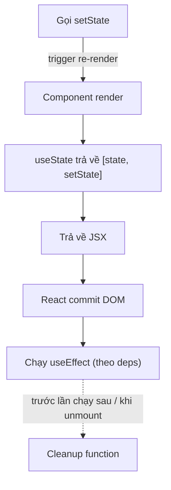

# useState và useEffect

`useState` và `useEffect` là hai **hook** (hàm đặc biệt cho phép dùng state và các tính năng của React trong functional component) cơ bản nhất. `useState` giúp bạn lưu và cập nhật **state** (trạng thái, dữ liệu thay đổi theo thời gian) bên trong component, khi state đổi thì giao diện tự render lại. `useEffect` cho phép chạy các **side effect** (tác vụ phụ như gọi API, đăng ký sự kiện, hẹn giờ) sau khi component render. Đây là nền tảng bạn cần nắm trước khi học các hook nâng cao hơn.

[](pathname:///img/react/basic-hooks.webp)

---

:::note[Ghi nhớ nhanh]

- ⭐ **`useState` lưu state, đổi thì UI tự render lại** — `useEffect` chạy side effect (fetch, subscribe, timer) sau khi render.
- ⭐ **Không mutate state** — luôn tạo object/array mới; update dựa giá trị cũ thì dùng updater function `setCount(c => c + 1)` để tránh stale state.
- **Dependency array** — `[]` chỉ chạy khi mount, `[a, b]` chạy lại khi `a`/`b` đổi, không có array thì chạy sau mọi render.
- **Khai báo MỌI biến dùng trong effect vào deps** — bật ESLint `react-hooks/exhaustive-deps` để bắt lỗi thiếu dep.
- **Cleanup function** — effect return một hàm dọn dẹp (timer, subscription, listener, abort fetch) trước lần chạy sau hoặc khi unmount.
- **Trước khi viết `useEffect` hãy hỏi "có cần effect không?"** — nhiều giá trị derive được trực tiếp từ state, không cần effect.

:::

---

## Mục lục

- [Vì sao Hooks ra đời?](#vì-sao-hooks-ra-đời)
- [Hook là gì?](#hook-là-gì)
- [useState](#usestate)
- [Update state đúng cách](#update-state-đúng-cách)
- [useEffect](#useeffect)
- [Dependency array](#dependency-array)
- [Cleanup function](#cleanup-function)
- [Câu hỏi phỏng vấn](#câu-hỏi-phỏng-vấn)

---

## Vì sao Hooks ra đời?

**Vấn đề:**

```jsx
// Trước Hooks: muốn có state/lifecycle PHẢI dùng class — dài dòng, this khó
class Counter extends React.Component {
  constructor(props) {
    super(props);
    this.state = { count: 0 };
    this.handleClick = this.handleClick.bind(this); // phải bind this
  }
  componentDidMount() { /* fetch data */ }
  componentDidUpdate() { /* logic liên quan bị xé lẻ qua nhiều method */ }
  componentWillUnmount() { /* cleanup ở chỗ khác */ }
  handleClick() { this.setState({ count: this.state.count + 1 }); }
  render() { return <button onClick={this.handleClick}>{this.state.count}</button>; }
}

// Tái sử dụng logic stateful phải HOC/render props → "wrapper hell"
<withUser>
  <withTheme>
    <withRouter>
      <Component /> {/* cây component lồng sâu, khó debug */}
    </withRouter>
  </withTheme>
</withUser>
```

**Giải pháp:**

```jsx
// Hooks (React 16.8): functional component có state & side effect
function Counter() {
  const [count, setCount] = useState(0); // state, không cần class/this

  useEffect(() => {
    // gom logic liên quan (mount + update + cleanup) vào MỘT chỗ
    const id = setInterval(() => tick(), 1000);
    return () => clearInterval(id);
  }, []);

  return <button onClick={() => setCount(c => c + 1)}>{count}</button>;
}

// Tái sử dụng bằng custom hook — KHÔNG thêm tầng component
function useUser(id) {
  const [user, setUser] = useState(null);
  useEffect(() => { fetchUser(id).then(setUser); }, [id]);
  return user;
}
```

:::tip[Dùng thực tế]

- **State cục bộ**: `useState` cho input form, toggle, counter — không cần class.
- **Fetch/subscribe**: `useEffect` gọi API, đăng ký WebSocket, kèm cleanup.
- **Tách logic dùng lại**: gom thành custom hook (`useUser`, `useFetch`) thay vì HOC.
- **Bỏ class**: viết toàn bộ component dạng hàm, ngắn gọn, không lo `this` binding.

:::

---

## Hook là gì?

**Hook** = function bắt đầu bằng `use*`, cho phép function component
"hook into" feature của React (state, lifecycle, context...).

```jsx
import { useState, useEffect } from "react";

function MyComponent() {
  const [count, setCount] = useState(0);
  useEffect(() => { /* ... */ });
  // ...
}
```

Có 3 loại hook:

- **Built-in**: `useState`, `useEffect`, `useRef`, `useContext`...
- **Custom**: hook bạn tự viết, vd `useUser()`, `useFetch()`.
- **Library**: từ thư viện, vd `useQuery` (TanStack), `useForm` (RHF).

Sơ đồ vị trí của `useState` và `useEffect` trong một chu kỳ render:



---

## useState

Khai báo state trong function component:

```jsx
const [count, setCount] = useState(0);
const [name, setName] = useState("");
const [user, setUser] = useState(null);
const [items, setItems] = useState([]);
```

Cú pháp:

- `useState(initialValue)` trả về `[state, setState]`.
- `state` — giá trị hiện tại.
- `setState` — function để update.

**Lazy initial state** — khi initial value cần tính:

```jsx
// Tệ — chạy mỗi render dù chỉ dùng lần đầu
const [data, setData] = useState(loadFromLocalStorage());

// Tốt — chỉ chạy lần đầu
const [data, setData] = useState(() => loadFromLocalStorage());
```

Truyền **function** vào `useState` → React chỉ gọi lần đầu để lấy initial.

---

## Update state đúng cách

**1. Object/Array — không mutate**:

```jsx
const [user, setUser] = useState({ name: "An", age: 25 });

// Sai
user.age = 26;
setUser(user); // React không detect change (cùng reference)

// Đúng
setUser({ ...user, age: 26 });
```

**2. Update dựa vào state cũ — dùng updater function**:

```jsx
// Sai — bị stale state khi gọi nhiều lần
setCount(count + 1);
setCount(count + 1);
setCount(count + 1);
// Kết quả +1, không phải +3

// Đúng — updater function nhận giá trị mới nhất
setCount(c => c + 1);
setCount(c => c + 1);
setCount(c => c + 1);
// +3
```

**3. Object lồng — spread từng cấp**:

```jsx
setUser(prev => ({
  ...prev,
  address: { ...prev.address, city: "HCM" },
}));
```

:::info[Phân tích]

**Tại sao React dùng shallow comparison?**

Tối ưu performance — kiểm tra `===` (reference) **nhanh hơn nhiều** so
với deep equality (`a.x === b.x && a.y === b.y && ...`).

Trade-off: dev phải **maintain immutability**. React cố ý design để dev
không thể "lười" mutation — đảm bảo render predictable.

Workaround cho state phức tạp:

- **Immer** — viết "mutating" syntax, Immer tự tạo immutable update:

```jsx
import { produce } from "immer";

setUser(produce(draft => {
  draft.address.city = "HCM"; // "mutate" draft
}));
// Tự sinh object mới với change
```

- **Zustand + Immer middleware** — kết hợp cho state management.
- **Redux Toolkit** — `createSlice` dùng Immer dưới hood.

Với state nhỏ, spread native đủ. Với nested sâu, Immer giúp giảm boilerplate
rất nhiều.

:::

---

## useEffect

Đồng bộ component với hệ thống bên ngoài (API, subscription, DOM):

```jsx
useEffect(() => {
  // Code chạy sau render (mount + update)
});

useEffect(() => {
  // Chỉ chạy 1 lần (mount)
}, []);

useEffect(() => {
  // Chạy khi userId đổi
}, [userId]);
```

Ví dụ — fetch data:

```jsx
function UserProfile({ userId }) {
  const [user, setUser] = useState(null);
  const [loading, setLoading] = useState(true);

  useEffect(() => {
    let cancelled = false;

    setLoading(true);
    fetch(`/api/users/${userId}`)
      .then(r => r.json())
      .then(data => {
        if (!cancelled) {
          setUser(data);
          setLoading(false);
        }
      });

    return () => { cancelled = true; }; // cleanup
  }, [userId]);

  if (loading) return <Spinner />;
  return <div>{user.name}</div>;
}
```

---

## Dependency array

Quy tắc cốt lõi:

- **`[]` rỗng** — effect chỉ chạy khi mount.
- **`[a, b]`** — effect chạy lại khi `a` hoặc `b` đổi.
- **Không có array** — chạy sau mọi render.

:::warning[Cần lưu ý]

**Phải khai báo MỌI biến dùng trong effect vào deps:**

```jsx
function UserCard({ userId }) {
  const [data, setData] = useState(null);

  useEffect(() => {
    fetch(`/api/users/${userId}`).then(r => r.json()).then(setData);
  }, []); // SAI — thiếu userId trong deps

  // Khi userId đổi, effect không chạy lại → data lỗi thời
}
```

ESLint plugin `react-hooks/exhaustive-deps` **bắt** lỗi này. **Luôn bật**
trong config:

```js
{
  rules: {
    "react-hooks/exhaustive-deps": "warn"
  }
}
```

Khi cố tình muốn không re-run, comment lý do:

```jsx
useEffect(() => {
  trackEvent("page_view"); // gọi 1 lần khi mount, không quan tâm dep
  // eslint-disable-next-line react-hooks/exhaustive-deps
}, []);
```

:::

---

## Cleanup function

Effect return một function để **cleanup** trước effect tiếp hoặc unmount:

```jsx
useEffect(() => {
  const id = setInterval(() => tick(), 1000);

  return () => clearInterval(id);
}, []);
```

Pattern cần cleanup:

- **Timer**: `setInterval`, `setTimeout`.
- **Subscription**: WebSocket, EventSource, observable.
- **Event listener**: `window.addEventListener`.
- **Abort fetch**: `AbortController`.

```jsx
useEffect(() => {
  const ctrl = new AbortController();

  fetch(url, { signal: ctrl.signal })
    .then(r => r.json())
    .then(setData)
    .catch(err => {
      if (err.name !== "AbortError") console.error(err);
    });

  return () => ctrl.abort();
}, [url]);
```

:::info[Phân tích]

**StrictMode + cleanup** — quan trọng cho production:

Trong StrictMode (dev only), React **chạy effect 2 lần** để test cleanup
đúng:

```
1. Mount → effect chạy (effect 1)
2. Unmount → cleanup chạy (cleanup 1)
3. Mount lại → effect chạy (effect 2)
```

Nếu effect không có cleanup, bug sẽ lộ ngay:

```jsx
useEffect(() => {
  socket.connect(); // không cleanup
  // Strict: connect → connect → 2 socket cùng chạy
}, []);

useEffect(() => {
  socket.connect();
  return () => socket.disconnect(); // cleanup
  // Strict: connect → disconnect → connect → chỉ 1 socket
}, []);
```

→ Effect không có cleanup mà gây side effect "vĩnh viễn" thường là bug.
Strict Mode bắt được.

Trong production (React 18+), component có thể mount/unmount/remount
nhiều lần do offscreen rendering, hot reload, fast refresh. Cleanup đúng
là yêu cầu, không phải optional.

:::

:::tip[Mẹo]

**Anti-pattern phổ biến với useEffect**:

```jsx
// 1. Derive từ state — không cần effect
const [items, setItems] = useState([]);
const [count, setCount] = useState(0);

useEffect(() => {
  setCount(items.length); // SAI — derive được
}, [items]);

// Đúng — tính trực tiếp
const count = items.length;

// 2. Sync state với prop — không cần effect
useEffect(() => {
  setValue(props.value); // SAI
}, [props.value]);

// Đúng — dùng key prop để reset state khi cần
<Component key={props.value} />

// 3. Update state trong effect dựa state khác
useEffect(() => {
  setFilteredItems(items.filter(...));
}, [items]); // SAI — derive

// Đúng
const filteredItems = items.filter(...);
```

Quy tắc: **trước khi viết useEffect, hỏi "có cần effect không?"**.
[Trang react.dev/learn/you-might-not-need-an-effect](https://react.dev/learn/you-might-not-need-an-effect)
liệt kê 8 anti-pattern phổ biến.

:::

---

## Câu hỏi phỏng vấn

Những câu thường gặp về chủ đề này. Tự trả lời trước, rồi bấm **Xem đáp án** để đối chiếu.

**1. `useState` trả về gì? Vì sao phải cập nhật qua hàm `set...` chứ không gán thẳng vào biến state?**

<details className="qa">
<summary>Xem đáp án</summary>

`useState(initialValue)` trả về một mảng hai phần tử: **giá trị state hiện tại** và **hàm cập nhật** nó.

```jsx
const [count, setCount] = useState(0);
```

Biến `count` chỉ là một giá trị cục bộ của lần render này — gán `count = 5` không làm gì cả:

- Nó chỉ đổi biến JavaScript trong phạm vi lần render hiện tại, React hoàn toàn không biết.
- Không có gì kích hoạt render lại, nên giao diện đứng yên.
- Lần render sau, `useState` vẫn trả về giá trị React đang giữ, mọi thay đổi bị mất.

Hàm `setCount` mới là cầu nối với React: nó lưu giá trị mới vào Fiber của component và **đánh dấu component cần render lại**. Sau lần render đó, `useState` trả về giá trị mới.

Nói cách khác, state không nằm trong biến của bạn — nó nằm trong React, còn biến chỉ là ảnh chụp của lần render hiện tại.

</details>

**2. Đoán output: trong một event handler gọi `setCount(count + 1)` rồi `console.log(count)` ngay dòng dưới thì in ra số nào? Vì sao?**

<details className="qa">
<summary>Xem đáp án</summary>

In ra **giá trị cũ**, chưa tăng.

```jsx
const [count, setCount] = useState(0);

const handleClick = () => {
  setCount(count + 1);
  console.log(count); // 0, không phải 1
};
```

Lý do: `count` là một **hằng số của lần render hiện tại**. Trong suốt handler này, `count` luôn bằng `0` — nó được "đóng băng" từ lúc component render ra hàm handler đó. `setCount` không gán lại biến `count`; nó chỉ báo cho React biết giá trị mới cho lần render **tiếp theo**.

Đây là điều nhiều người gọi nhầm là "setState bất đồng bộ". Thực chất không phải chuyện chờ đợi, mà là mỗi lần render có một bộ biến riêng — React gọi đây là snapshot của render.

Muốn dùng giá trị mới ngay trong handler thì tự tính ra biến:

```jsx
const next = count + 1;
setCount(next);
console.log(next); // 1
```

</details>

**3. Phân biệt `setCount(count + 1)` và `setCount(c => c + 1)`. Gọi `setCount(count + 1)` ba lần liên tiếp trong cùng một handler thì `count` tăng thêm mấy?**

<details className="qa">
<summary>Xem đáp án</summary>

| | `setCount(count + 1)` | `setCount(c => c + 1)` |
|---|---|---|
| Dựa trên | Biến `count` của lần render hiện tại | Giá trị mới nhất trong hàng đợi cập nhật |
| Gọi nhiều lần liên tiếp | Các lệnh ghi đè nhau | Các lệnh cộng dồn |
| Nên dùng khi | Giá trị mới không phụ thuộc giá trị cũ | Giá trị mới tính từ giá trị cũ |

Gọi ba lần dạng thứ nhất thì `count` chỉ **tăng thêm 1**:

```jsx
// count đang là 0
setCount(count + 1); // xếp hàng: gán 1
setCount(count + 1); // xếp hàng: gán 1 (count vẫn là 0)
setCount(count + 1); // xếp hàng: gán 1
// Kết quả: 1

setCount(c => c + 1); // 0 → 1
setCount(c => c + 1); // 1 → 2
setCount(c => c + 1); // 2 → 3
// Kết quả: 3
```

**Updater function** nhận tham số là giá trị mới nhất sau các cập nhật đã xếp hàng trước nó, nên luôn đúng kể cả khi React gộp nhiều lệnh. Quy tắc: hễ giá trị mới được tính từ giá trị cũ thì dùng dạng updater.

</details>

**4. Batching là gì? React 18 thay đổi gì về automatic batching so với React 17 (trong `setTimeout`, trong promise, trong native event listener)?**

<details className="qa">
<summary>Xem đáp án</summary>

**Batching** là việc React gom nhiều lệnh cập nhật state trong cùng một lượt xử lý thành **một lần render duy nhất**, thay vì render lại sau từng lệnh.

```jsx
const handleClick = () => {
  setCount(c => c + 1);
  setFlag(true);
  setName("A");
  // Chỉ một lần re-render
};
```

| Bối cảnh | React 17 và trước | React 18 |
|---|---|---|
| Event handler của React | Có gộp | Có gộp |
| Trong `setTimeout` | Không — render mỗi lệnh | Có gộp |
| Trong `.then()` của promise, callback `fetch` | Không | Có gộp |
| Trong listener DOM gắn tay | Không | Có gộp |

React 18 gọi đây là **automatic batching**: gộp ở mọi nơi, không chỉ trong synthetic event. Lợi ích là ít render thừa, giao diện không nhấp nháy qua các trạng thái trung gian — rất dễ thấy khi một hàm async gọi liên tiếp `setLoading(false)` và `setData(...)`.

Khi thực sự cần React render và cập nhật DOM ngay lập tức, có thể thoát batching bằng `flushSync` từ `react-dom`. Đây là ngoại lệ hiếm, dùng nhiều sẽ mất luôn lợi ích hiệu năng.

</details>

**5. Vì sao không được mutate state trực tiếp kiểu `arr.push(x)` rồi `setArr(arr)`? React so sánh state cũ và mới bằng cách nào?**

<details className="qa">
<summary>Xem đáp án</summary>

React so sánh state cũ và mới bằng **`Object.is`** — tức so sánh **tham chiếu** với object và array, chứ không duyệt vào bên trong.

```jsx
// Sai — cùng một object, React thấy "không đổi"
arr.push(4);
setArr(arr);

// Đúng — tạo mảng mới
setArr([...arr, 4]);
```

`push` sửa ngay trên mảng cũ nên tham chiếu không đổi. React so sánh thấy bằng nhau, bỏ qua lệnh render — giao diện đứng yên dù dữ liệu đã đổi. Tệ hơn, đôi khi nó vẫn "chạy đúng" nhờ một lần render vì lý do khác, tạo ra bug lúc có lúc không, rất khó lần.

Lý do React chọn so sánh nông: kiểm tra `===` nhanh hơn rất nhiều so với so sánh sâu từng thuộc tính, giúp render dự đoán được và tối ưu được. Cái giá là lập trình viên phải giữ tính bất biến.

Với object lồng sâu, phải spread từng cấp:

```jsx
setUser(prev => ({ ...prev, address: { ...prev.address, city: "HCM" } }));
```

Nếu boilerplate quá nhiều thì dùng **Immer** (hoặc Redux Toolkit vốn dùng Immer bên dưới) để viết theo cú pháp "mutate" mà vẫn sinh ra object mới.

</details>

**6. `useState(() => expensiveInit())` khác `useState(expensiveInit())` ở điểm nào? Kỹ thuật này tên là gì?**

<details className="qa">
<summary>Xem đáp án</summary>

Kỹ thuật này gọi là **lazy initial state**.

```jsx
// Tệ — expensiveInit() chạy ở MỌI lần render
const [data, setData] = useState(loadFromLocalStorage());

// Tốt — chỉ chạy đúng một lần lúc mount
const [data, setData] = useState(() => loadFromLocalStorage());
```

Điểm khác biệt nằm ở chỗ JavaScript đánh giá tham số trước khi gọi hàm. Ở dạng thứ nhất, `loadFromLocalStorage()` được thực thi mỗi lần component render; React chỉ dùng kết quả ở lần đầu rồi vứt đi những lần sau — lãng phí hoàn toàn.

Ở dạng thứ hai, bạn truyền vào **một function chưa chạy**. React tự nhận ra đây là initializer và chỉ gọi nó ở lần render đầu tiên.

Khi nào nên dùng: đọc `localStorage`, parse JSON lớn, tính toán nặng, tạo cấu trúc dữ liệu lớn. Với giá trị rẻ như `useState(0)` hay `useState("")` thì không cần, viết thẳng cho gọn.

Lưu ý phân biệt với updater function của `setState`: cùng là truyền hàm, nhưng một bên khởi tạo (không nhận tham số), một bên cập nhật (nhận giá trị cũ).

</details>

**7. Vì sao khởi tạo state từ props (`useState(props.value)`) thì state không tự cập nhật khi props đổi? Nêu các cách xử lý đúng.**

<details className="qa">
<summary>Xem đáp án</summary>

Vì tham số của `useState` chỉ được dùng ở **lần render đầu tiên**. Từ lần thứ hai trở đi React bỏ qua nó hoàn toàn và trả về giá trị đang giữ. Props đổi thì component render lại, nhưng state vẫn là giá trị cũ đã chốt lúc mount.

Các cách xử lý, theo thứ tự ưu tiên:

- **Đừng copy props vào state** nếu không cần. Dùng thẳng `props.value` khi nó chỉ là dữ liệu hiển thị hoặc derive được.
- **Dùng prop `key` để reset component** — cách được React khuyến nghị. Khi `key` đổi, React unmount component cũ và mount mới, toàn bộ state khởi tạo lại sạch sẽ.

```jsx
<ProfileForm key={userId} userId={userId} />
```

- **Đưa state lên component cha** (lifting state up) nếu cha mới là nơi sở hữu dữ liệu thật.
- **Điều chỉnh state ngay trong lúc render** khi chỉ cần reset một phần: lưu giá trị prop trước đó vào một state phụ, so sánh và gọi `setState` ngay trong thân component.

Cách hay bị lạm dụng nhất là `useEffect(() => setValue(props.value), [props.value])` — nó thêm một lần render thừa và dễ sinh vòng lặp, nên coi là phương án cuối.

</details>

**8. `useEffect` chạy vào thời điểm nào trong chu trình render? So sánh với `useLayoutEffect` về thời điểm chạy và trường hợp nên dùng.**

<details className="qa">
<summary>Xem đáp án</summary>

Thứ tự trong một lượt cập nhật: React chạy hàm component → tạo cây mới → commit thay đổi vào DOM → chạy `useLayoutEffect` (đồng bộ, **trước** khi trình duyệt vẽ) → trình duyệt vẽ → chạy `useEffect` (bất đồng bộ, **sau** khi vẽ).

| | `useEffect` | `useLayoutEffect` |
|---|---|---|
| Thời điểm | Sau khi trình duyệt vẽ xong | Sau khi commit DOM, trước khi vẽ |
| Chặn hiển thị | Không | Có — chạy lâu là giật khung hình |
| Dùng cho | Fetch, subscribe, timer, analytics, log | Đo kích thước/vị trí DOM rồi chỉnh ngay |
| Chạy trên server (SSR) | Không | Không, và còn cảnh báo |

Nguyên tắc: **mặc định dùng `useEffect`**. Chỉ chuyển sang `useLayoutEffect` khi hiệu ứng của bạn làm người dùng thấy giao diện nhấp nháy — ví dụ đo chiều cao tooltip rồi đặt vị trí, hoặc khôi phục vị trí cuộn. Vì `useLayoutEffect` chạy đồng bộ và chặn việc vẽ, dùng bừa sẽ làm chậm cảm giác phản hồi của trang.

</details>

**9. Ba dạng dependency array — không truyền array, truyền `[]`, truyền `[a, b]` — khác nhau ra sao?**

<details className="qa">
<summary>Xem đáp án</summary>

```jsx
useEffect(() => { /* ... */ });          // sau MỌI lần render
useEffect(() => { /* ... */ }, []);      // chỉ một lần khi mount
useEffect(() => { /* ... */ }, [a, b]);  // khi a hoặc b đổi
```

- **Không truyền array** — effect chạy sau mọi lần render. Rất dễ tạo vòng lặp vô hạn nếu bên trong có `setState`. Hiếm khi là thứ bạn thực sự muốn.
- **Truyền `[]`** — chạy một lần lúc mount, cleanup chạy lúc unmount. Hợp với việc đăng ký một lần: listener toàn cục, khởi tạo thư viện bên thứ ba, gửi sự kiện analytics. Cẩn thận: nếu bên trong dùng biến thay đổi được thì sẽ dính stale closure.
- **Truyền `[a, b]`** — React so sánh từng phần tử với lần trước; khác thì chạy cleanup cũ rồi chạy effect mới.

Cách nghĩ đúng không phải là "chọn lúc nào chạy", mà là: effect **đồng bộ component với hệ thống bên ngoài**, và deps là danh sách mọi giá trị mà việc đồng bộ đó phụ thuộc vào. Liệt kê đủ thì React tự biết khi nào cần đồng bộ lại.

</details>

**10. React so sánh dependency bằng thuật toán nào? Vì sao truyền một object hoặc array literal vào deps khiến effect chạy lại sau mọi render?**

<details className="qa">
<summary>Xem đáp án</summary>

React so sánh từng phần tử của deps bằng **`Object.is`** — tương đương `===` với vài khác biệt nhỏ ở `NaN` và `-0`. Đây là so sánh **nông theo tham chiếu**, không nhìn vào bên trong object.

Vì thế object hay array viết thẳng trong thân component là một tham chiếu **mới** ở mỗi lần render:

```jsx
function Chart({ userId }) {
  const options = { userId, theme: "dark" }; // object mới mỗi render

  useEffect(() => {
    load(options);
  }, [options]); // luôn "khác" → chạy lại mọi render
}
```

Cùng nội dung nhưng khác tham chiếu, nên `Object.is` trả về `false`. Nếu trong effect có `setState` thì thành vòng lặp vô hạn.

Các cách xử lý:

- **Liệt kê giá trị nguyên thuỷ** thay vì cả object: `}, [userId])`.
- **Bọc bằng `useMemo`** khi thật sự cần cả object: `const options = useMemo(() => ({ userId }), [userId])`.
- **Đưa việc tạo object vào trong effect**, để nó không phải là dependency.

Cùng lý do đó, function khai báo trong thân component cũng là tham chiếu mới mỗi render — cần `useCallback` nếu bắt buộc đưa vào deps.

</details>

**11. Cleanup function là gì và chạy vào những thời điểm nào? Kể các trường hợp bắt buộc phải cleanup.**

<details className="qa">
<summary>Xem đáp án</summary>

Cleanup là **hàm được return ra từ effect**, dùng để dọn dẹp những gì effect đã tạo ra.

```jsx
useEffect(() => {
  const id = setInterval(() => tick(), 1000);
  return () => clearInterval(id);
}, []);
```

Nó chạy ở hai thời điểm:

- **Trước mỗi lần effect chạy lại** (khi có dependency thay đổi) — dọn lần chạy cũ rồi mới thiết lập lần mới.
- **Khi component unmount**.

Các trường hợp bắt buộc:

- **Timer** — `setInterval`, `setTimeout`, `requestAnimationFrame`.
- **Subscription** — WebSocket, EventSource, observable, store bên ngoài.
- **Event listener** gắn tay lên `window`, `document` hay node DOM.
- **Request đang bay** — huỷ bằng `AbortController` hoặc cờ `ignore` để tránh ghi state sau khi component đã chết.
- **Tài nguyên của thư viện bên thứ ba** — instance chart, map, editor cần gọi `destroy()`.

Thiếu cleanup dẫn tới rò rỉ bộ nhớ, nhiều kết nối chồng lên nhau, timer chạy song song và cảnh báo cập nhật state trên component đã unmount. Mẹo tự kiểm: mỗi lệnh "tạo/đăng ký" trong effect phải có một lệnh "huỷ/gỡ" tương ứng trong cleanup.

</details>

**12. Vì sao ở môi trường development bật `StrictMode` thì `useEffect` chạy 2 lần khi mount? Nó giúp phát hiện loại bug nào, và điều đó có xảy ra trên production không?**

<details className="qa">
<summary>Xem đáp án</summary>

Trong StrictMode (chỉ ở development), React cố tình mô phỏng một vòng mount → unmount → mount lại:

```
1. Mount     → effect chạy
2. Unmount   → cleanup chạy
3. Mount lại → effect chạy lần nữa
```

Mục đích là **bắt lỗi thiếu cleanup**. Effect viết đúng thì hai lần chạy cho kết quả giống hệt một lần; effect thiếu cleanup thì lộ ngay:

```jsx
useEffect(() => {
  socket.connect();          // StrictMode: 2 socket cùng sống
}, []);

useEffect(() => {
  socket.connect();
  return () => socket.disconnect(); // connect → disconnect → connect: chỉ 1 socket
}, []);
```

Trên production, React **không** chạy đôi như vậy. Nhưng đừng coi đó là lý do để bỏ qua: component hoàn toàn có thể bị unmount rồi mount lại nhiều lần trong đời thật — điều hướng qua lại, offscreen rendering, fast refresh lúc phát triển. Effect chỉ đúng khi chạy một lần duy nhất là một quả bom hẹn giờ.

Vì vậy StrictMode chạy đôi không phải là bug cần "tắt đi", mà là công cụ giúp bạn phát hiện effect chưa idempotent.

</details>

**13. Stale closure là gì? Giải thích vì sao `setInterval` đặt trong `useEffect` với deps `[]` luôn đọc `count` bằng giá trị lúc mount.**

<details className="qa">
<summary>Xem đáp án</summary>

**Stale closure** là tình huống một hàm "ghi nhớ" biến của lần render cũ và tiếp tục dùng giá trị đã lỗi thời đó.

```jsx
const [count, setCount] = useState(0);

useEffect(() => {
  const id = setInterval(() => {
    console.log(count);      // luôn in 0
    setCount(count + 1);     // luôn đặt về 1
  }, 1000);
  return () => clearInterval(id);
}, []); // deps rỗng
```

Cơ chế: mỗi lần render tạo ra một phiên bản mới của hàm component, với một biến `count` riêng. Callback truyền cho `setInterval` được tạo trong lần render đầu tiên, nên nó **đóng gói** (closure) đúng biến `count` của lần đó — tức là `0`.

Vì deps là `[]`, effect không bao giờ chạy lại, `setInterval` cũ vẫn sống cùng callback cũ. Các lần render sau có `count` mới, nhưng callback đó không hề biết tới chúng — nó nhìn vào một biến đã bị "đóng băng".

Đây là bug kinh điển của hook, và đáng chú ý là ESLint đã cảnh báo sẵn: `count` được dùng trong effect nhưng không có trong deps.

</details>

**14. Nêu ít nhất ba cách sửa bug stale closure ở câu trên (updater function, thêm dependency, dùng `useRef`) và đánh đổi của từng cách.**

<details className="qa">
<summary>Xem đáp án</summary>

**Cách 1 — updater function** (thường tốt nhất):

```jsx
useEffect(() => {
  const id = setInterval(() => setCount(c => c + 1), 1000);
  return () => clearInterval(id);
}, []);
```

Không cần đọc `count` nữa nên không còn closure cũ. Interval chỉ tạo một lần. Hạn chế: chỉ dùng được khi bạn chỉ cần **ghi** state, không cần đọc giá trị để làm việc khác.

**Cách 2 — thêm `count` vào deps:**

```jsx
useEffect(() => {
  const id = setInterval(() => setCount(count + 1), 1000);
  return () => clearInterval(id);
}, [count]);
```

Luôn đọc đúng giá trị mới. Đánh đổi: mỗi lần `count` đổi thì clear và tạo lại interval — đồng hồ bị "đặt lại" liên tục, không phù hợp nếu cần nhịp chính xác.

**Cách 3 — `useRef` giữ giá trị mới nhất:**

```jsx
const countRef = useRef(count);
useEffect(() => { countRef.current = count; }, [count]);

useEffect(() => {
  const id = setInterval(() => console.log(countRef.current), 1000);
  return () => clearInterval(id);
}, []);
```

Đọc được giá trị mới mà không tạo lại interval. Đánh đổi: thêm code, và ref không kích hoạt render nên dễ khiến giao diện lệch với dữ liệu nếu dùng sai chỗ.

</details>

**15. Đoán hành vi: effect có deps `[]` mà bên trong gọi `setCount(count + 1)` thì chuyện gì xảy ra? Còn nếu deps là `[count]`?**

<details className="qa">
<summary>Xem đáp án</summary>

**Với deps `[]`:** effect chạy đúng một lần sau khi mount, `count` tăng từ `0` lên `1`, component render lại, rồi **dừng**. Effect không chạy lại vì deps rỗng. Không có vòng lặp.

```jsx
useEffect(() => {
  setCount(count + 1); // chạy 1 lần: 0 → 1
}, []);
```

(Ở StrictMode dev, effect chạy đôi nên có thể thấy `count` nhảy tới `2` — thêm một lý do để không viết kiểu này.)

**Với deps `[count]`:** **vòng lặp vô hạn**.

```jsx
useEffect(() => {
  setCount(count + 1);
}, [count]);
// render → effect → setCount → count đổi → render → effect → ...
```

Mỗi lần effect chạy lại đổi `count`, `count` đổi lại kích hoạt effect. React sẽ dừng lại và báo lỗi "Maximum update depth exceeded".

Bài học rút ra: đặt `setState` trong effect mà state đó cũng nằm trong deps là công thức của vòng lặp. Trước khi viết, hãy hỏi giá trị này có **derive** thẳng từ state khác được không — phần lớn trường hợp là có, và khi đó không cần effect lẫn state phụ.

</details>

**16. Race condition khi fetch dữ liệu trong `useEffect` xảy ra như thế nào? Trình bày cách xử lý bằng biến cờ `ignore` và bằng `AbortController`.**

<details className="qa">
<summary>Xem đáp án</summary>

Kịch bản: `userId` đổi nhanh từ 1 sang 2. Hai request cùng bay. Nếu request của user 1 về **sau**, nó ghi đè dữ liệu của user 2 — màn hình hiện sai người dùng. Mạng không đảm bảo thứ tự trả về theo thứ tự gửi đi.

**Cách 1 — biến cờ, bỏ qua kết quả cũ:**

```jsx
useEffect(() => {
  let ignore = false;

  fetch(`/api/users/${userId}`)
    .then(r => r.json())
    .then(data => { if (!ignore) setUser(data); });

  return () => { ignore = true; };
}, [userId]);
```

Cleanup chạy trước lần effect sau, bật cờ lên, nên kết quả về muộn bị bỏ qua. Đơn giản, luôn đúng, nhưng request vẫn chạy tới cùng.

**Cách 2 — `AbortController`, huỷ hẳn request:**

```jsx
useEffect(() => {
  const ctrl = new AbortController();

  fetch(url, { signal: ctrl.signal })
    .then(r => r.json())
    .then(setData)
    .catch(err => { if (err.name !== "AbortError") console.error(err); });

  return () => ctrl.abort();
}, [url]);
```

Tiết kiệm băng thông và tài nguyên server, nhưng phải nhớ lọc `AbortError` để không báo lỗi giả. Trong dự án thật, các thư viện như TanStack Query đã xử lý sẵn toàn bộ chuyện này.

</details>

**17. Khi nào KHÔNG nên dùng `useEffect`? Cho ví dụ một giá trị derive được trực tiếp từ state mà nhiều người viết nhầm thành effect kèm state phụ.**

<details className="qa">
<summary>Xem đáp án</summary>

Nguyên tắc: `useEffect` dùng để **đồng bộ với hệ thống bên ngoài React** (API, DOM thật, subscription, timer). Nếu việc bạn làm chỉ liên quan tới dữ liệu bên trong React thì gần như chắc chắn không cần effect.

Ví dụ kinh điển — tính số lượng từ mảng:

```jsx
// Sai — thừa state, thừa effect, thừa một lần render
const [items, setItems] = useState([]);
const [count, setCount] = useState(0);

useEffect(() => {
  setCount(items.length);
}, [items]);

// Đúng — tính thẳng lúc render
const count = items.length;
```

Các trường hợp khác cũng không cần effect:

- **Lọc, sắp xếp, tính tổng** từ state có sẵn — tính thẳng, nặng thì bọc `useMemo`.
- **Đồng bộ state theo prop** — dùng prop `key` để reset component.
- **Phản ứng với hành động của người dùng** — viết trong event handler, không viết trong effect.
- **Truyền dữ liệu lên cha khi state đổi** — gọi callback ngay trong handler.

Effect thừa gây thêm một lượt render, dễ sinh vòng lặp, và khiến luồng dữ liệu khó lần. Trang `react.dev/learn/you-might-not-need-an-effect` liệt kê đầy đủ các anti-pattern này.

</details>

**18. Rule `react-hooks/exhaustive-deps` cảnh báo điều gì? Vì sao việc thêm `eslint-disable` cho nó thường là che giấu bug thay vì sửa bug?**

<details className="qa">
<summary>Xem đáp án</summary>

Rule này cảnh báo khi effect (hoặc `useMemo`, `useCallback`) **dùng một giá trị phản ứng mà không khai báo trong deps** — biến props, state, hoặc hàm/biến khai báo trong thân component.

```jsx
useEffect(() => {
  fetch(`/api/users/${userId}`).then(r => r.json()).then(setData);
}, []); // cảnh báo: thiếu userId
```

Tại sao tắt cảnh báo là nguy hiểm: thiếu dependency nghĩa là effect vẫn đang dùng **giá trị của lần render cũ** — chính là stale closure. Ở ví dụ trên, `userId` đổi nhưng effect không chạy lại, dữ liệu hiển thị lỗi thời. Thêm `eslint-disable` không sửa gì, nó chỉ làm tắt tiếng chuông báo cháy.

Hướng xử lý đúng khi cảnh báo "phiền":

- Dùng **updater function** để không cần đọc state cũ.
- Bọc hàm bằng **`useCallback`**, giá trị bằng **`useMemo`** để tham chiếu ổn định.
- **Đưa việc tạo hàm/object vào trong effect** nếu chỉ effect đó dùng.
- **Tách effect** ra nhiều effect nhỏ, mỗi cái một mối quan tâm và bộ deps riêng.

Có trường hợp tắt là hợp lý — ví dụ gửi analytics đúng một lần lúc mount — nhưng phải kèm comment giải thích lý do.

</details>

**19. Vì sao không nên đưa thẳng một function khai báo trong thân component vào dependency array? Có những cách nào để giữ ổn định reference của nó?**

<details className="qa">
<summary>Xem đáp án</summary>

Vì function khai báo trong thân component được **tạo mới ở mỗi lần render**, nên tham chiếu luôn khác lần trước. React so sánh deps bằng `Object.is`, thấy khác, và chạy lại effect sau mọi lần render:

```jsx
function Room({ roomId }) {
  const connect = () => createConnection(roomId); // hàm mới mỗi render

  useEffect(() => {
    const conn = connect();
    return () => conn.disconnect();
  }, [connect]); // chạy lại liên tục → kết nối lại liên tục
}
```

Các cách xử lý:

- **Đưa hàm vào trong effect** — gọn nhất khi chỉ effect đó dùng. Lúc này deps chỉ còn các giá trị nguyên thuỷ như `roomId`.
- **Đưa hàm ra ngoài component** nếu nó không dùng props hay state — khi đó nó là hằng số, không cần vào deps.
- **Bọc bằng `useCallback`** với deps riêng của nó — dùng khi hàm phải chia sẻ cho nhiều nơi hoặc truyền xuống component đã `React.memo`.
- **Lưu vào `useRef`** để giữ phiên bản mới nhất mà không làm effect chạy lại — hợp với callback kiểu event, nhưng phải cẩn thận vì ref không kích hoạt render.

Nguyên tắc chung: ưu tiên **giảm số dependency** thay vì tìm cách "ổn định hoá" mọi thứ.

</details>

**20. Nên tách nhiều `useState` riêng lẻ hay gộp thành một object state? Đánh đổi là gì, và dấu hiệu nào cho thấy đã đến lúc chuyển sang `useReducer`?**

<details className="qa">
<summary>Xem đáp án</summary>

| | Nhiều `useState` riêng | Một object state |
|---|---|---|
| Cập nhật | Gọn: `setName(v)` | Phải spread: `setForm(p => ({ ...p, name: v }))` |
| Cập nhật nhiều field cùng lúc | Nhiều lệnh (React vẫn gộp render) | Một lệnh duy nhất |
| Nguy cơ mất field | Không | Có, nếu quên spread |
| Hợp với | Các giá trị độc lập | Các giá trị luôn đổi cùng nhau |

Nguyên tắc: **tách riêng theo mặc định**, gộp lại khi các giá trị thực sự luôn thay đổi cùng nhau (ví dụ toạ độ `x` và `y` của con trỏ).

Dấu hiệu nên chuyển sang `useReducer`:

- Các state **phụ thuộc lẫn nhau** — đổi cái này bắt buộc phải đổi cái kia để giữ dữ liệu hợp lệ.
- Một hành động của người dùng kéo theo **nhiều lệnh `setState`** lặp đi lặp lại ở nhiều chỗ.
- State có dạng **máy trạng thái** rõ rệt: `idle → loading → success | error`.
- Logic cập nhật phức tạp, muốn **tách khỏi component** để test riêng dễ dàng.
- Cần truyền hàm cập nhật xuống sâu — `dispatch` có tham chiếu ổn định, tiện hơn nhiều callback.

Với form đơn giản vài field thì `useState` vẫn dễ đọc hơn; đừng chuyển sang reducer chỉ vì thấy nó "chuyên nghiệp".

</details>

**21. Hai component anh em cùng cần một state thì đặt state ở đâu? Giải thích lifting state up và cái giá phải trả về re-render.**

<details className="qa">
<summary>Xem đáp án</summary>

Đặt state ở **component cha chung gần nhất** của hai anh em. Đây gọi là **lifting state up**: cha giữ state, truyền giá trị xuống qua props và truyền hàm cập nhật xuống cho con nào cần thay đổi.

```jsx
function Parent() {
  const [query, setQuery] = useState("");
  return (
    <>
      <SearchInput value={query} onChange={setQuery} />
      <ResultList query={query} />
    </>
  );
}
```

Dữ liệu chảy một chiều từ trên xuống, chỉ có một nguồn sự thật — hai con không bao giờ lệch nhau.

Cái giá phải trả: state nằm ở cha, nên **mỗi lần state đổi thì cha render lại, kéo theo toàn bộ cây con** render theo, kể cả các con không liên quan. Càng đẩy state lên cao thì vùng bị ảnh hưởng càng lớn.

Cách giảm nhẹ:

- Đặt state ở **cha chung gần nhất**, đừng đẩy lên cao hơn mức cần thiết.
- **Tách component** để cô lập phần thay đổi thường xuyên.
- Dùng **`children`** để phần không phụ thuộc state không bị render lại.
- Bọc `React.memo` cho con nặng, kèm `useCallback` cho callback truyền xuống.
- Khi phải truyền props qua quá nhiều tầng (prop drilling), cân nhắc Context hoặc thư viện quản lý state.

</details>
