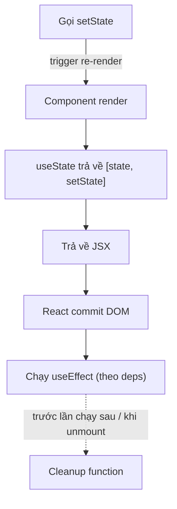

# useState và useEffect

`useState` và `useEffect` là hai **hook** (hàm đặc biệt cho phép dùng state và các tính năng của React trong functional component) cơ bản nhất. `useState` giúp bạn lưu và cập nhật **state** (trạng thái, dữ liệu thay đổi theo thời gian) bên trong component, khi state đổi thì giao diện tự render lại. `useEffect` cho phép chạy các **side effect** (tác vụ phụ như gọi API, đăng ký sự kiện, hẹn giờ) sau khi component render. Đây là nền tảng bạn cần nắm trước khi học các hook nâng cao hơn.

---

## Mục lục

- [Vì sao Hooks ra đời?](#vì-sao-hooks-ra-đời)
- [Hook là gì?](#hook-là-gì)
- [useState](#usestate)
- [Update state đúng cách](#update-state-đúng-cách)
- [useEffect](#useeffect)
- [Dependency array](#dependency-array)
- [Cleanup function](#cleanup-function)

---

## Vì sao Hooks ra đời?

**Vấn đề:**

```jsx
// Trước Hooks: muốn có state/lifecycle PHẢI dùng class — dài dòng, this khó
class Counter extends React.Component {
  constructor(props) {
    super(props);
    this.state = { count: 0 };
    this.handleClick = this.handleClick.bind(this); // phải bind this
  }
  componentDidMount() { /* fetch data */ }
  componentDidUpdate() { /* logic liên quan bị xé lẻ qua nhiều method */ }
  componentWillUnmount() { /* cleanup ở chỗ khác */ }
  handleClick() { this.setState({ count: this.state.count + 1 }); }
  render() { return <button onClick={this.handleClick}>{this.state.count}</button>; }
}

// Tái sử dụng logic stateful phải HOC/render props → "wrapper hell"
<withUser>
  <withTheme>
    <withRouter>
      <Component /> {/* cây component lồng sâu, khó debug */}
    </withRouter>
  </withTheme>
</withUser>
```

**Giải pháp:**

```jsx
// Hooks (React 16.8): functional component có state & side effect
function Counter() {
  const [count, setCount] = useState(0); // state, không cần class/this

  useEffect(() => {
    // gom logic liên quan (mount + update + cleanup) vào MỘT chỗ
    const id = setInterval(() => tick(), 1000);
    return () => clearInterval(id);
  }, []);

  return <button onClick={() => setCount(c => c + 1)}>{count}</button>;
}

// Tái sử dụng bằng custom hook — KHÔNG thêm tầng component
function useUser(id) {
  const [user, setUser] = useState(null);
  useEffect(() => { fetchUser(id).then(setUser); }, [id]);
  return user;
}
```

:::tip[Dùng thực tế]

- **State cục bộ**: `useState` cho input form, toggle, counter — không cần class.
- **Fetch/subscribe**: `useEffect` gọi API, đăng ký WebSocket, kèm cleanup.
- **Tách logic dùng lại**: gom thành custom hook (`useUser`, `useFetch`) thay vì HOC.
- **Bỏ class**: viết toàn bộ component dạng hàm, ngắn gọn, không lo `this` binding.

:::

---

## Hook là gì?

**Hook** = function bắt đầu bằng `use*`, cho phép function component
"hook into" feature của React (state, lifecycle, context...).

```jsx
import { useState, useEffect } from "react";

function MyComponent() {
  const [count, setCount] = useState(0);
  useEffect(() => { /* ... */ });
  // ...
}
```

Có 3 loại hook:

- **Built-in**: `useState`, `useEffect`, `useRef`, `useContext`...
- **Custom**: hook bạn tự viết, vd `useUser()`, `useFetch()`.
- **Library**: từ thư viện, vd `useQuery` (TanStack), `useForm` (RHF).

Sơ đồ vị trí của `useState` và `useEffect` trong một chu kỳ render:



---

## useState

Khai báo state trong function component:

```jsx
const [count, setCount] = useState(0);
const [name, setName] = useState("");
const [user, setUser] = useState(null);
const [items, setItems] = useState([]);
```

Cú pháp:

- `useState(initialValue)` trả về `[state, setState]`.
- `state` — giá trị hiện tại.
- `setState` — function để update.

**Lazy initial state** — khi initial value cần tính:

```jsx
// Tệ — chạy mỗi render dù chỉ dùng lần đầu
const [data, setData] = useState(loadFromLocalStorage());

// Tốt — chỉ chạy lần đầu
const [data, setData] = useState(() => loadFromLocalStorage());
```

Truyền **function** vào `useState` → React chỉ gọi lần đầu để lấy initial.

---

## Update state đúng cách

**1. Object/Array — không mutate**:

```jsx
const [user, setUser] = useState({ name: "An", age: 25 });

// Sai
user.age = 26;
setUser(user); // React không detect change (cùng reference)

// Đúng
setUser({ ...user, age: 26 });
```

**2. Update dựa vào state cũ — dùng updater function**:

```jsx
// Sai — bị stale state khi gọi nhiều lần
setCount(count + 1);
setCount(count + 1);
setCount(count + 1);
// Kết quả +1, không phải +3

// Đúng — updater function nhận giá trị mới nhất
setCount(c => c + 1);
setCount(c => c + 1);
setCount(c => c + 1);
// +3
```

**3. Object lồng — spread từng cấp**:

```jsx
setUser(prev => ({
  ...prev,
  address: { ...prev.address, city: "HCM" },
}));
```

:::info[Phân tích]

**Tại sao React dùng shallow comparison?**

Tối ưu performance — kiểm tra `===` (reference) **nhanh hơn nhiều** so
với deep equality (`a.x === b.x && a.y === b.y && ...`).

Trade-off: dev phải **maintain immutability**. React cố ý design để dev
không thể "lười" mutation — đảm bảo render predictable.

Workaround cho state phức tạp:

- **Immer** — viết "mutating" syntax, Immer tự tạo immutable update:

```jsx
import { produce } from "immer";

setUser(produce(draft => {
  draft.address.city = "HCM"; // "mutate" draft
}));
// Tự sinh object mới với change
```

- **Zustand + Immer middleware** — kết hợp cho state management.
- **Redux Toolkit** — `createSlice` dùng Immer dưới hood.

Với state nhỏ, spread native đủ. Với nested sâu, Immer giúp giảm boilerplate
rất nhiều.

:::

---

## useEffect

Đồng bộ component với hệ thống bên ngoài (API, subscription, DOM):

```jsx
useEffect(() => {
  // Code chạy sau render (mount + update)
});

useEffect(() => {
  // Chỉ chạy 1 lần (mount)
}, []);

useEffect(() => {
  // Chạy khi userId đổi
}, [userId]);
```

Ví dụ — fetch data:

```jsx
function UserProfile({ userId }) {
  const [user, setUser] = useState(null);
  const [loading, setLoading] = useState(true);

  useEffect(() => {
    let cancelled = false;

    setLoading(true);
    fetch(`/api/users/${userId}`)
      .then(r => r.json())
      .then(data => {
        if (!cancelled) {
          setUser(data);
          setLoading(false);
        }
      });

    return () => { cancelled = true; }; // cleanup
  }, [userId]);

  if (loading) return <Spinner />;
  return <div>{user.name}</div>;
}
```

---

## Dependency array

Quy tắc cốt lõi:

- **`[]` rỗng** — effect chỉ chạy khi mount.
- **`[a, b]`** — effect chạy lại khi `a` hoặc `b` đổi.
- **Không có array** — chạy sau mọi render.

:::warning[Cần lưu ý]

**Phải khai báo MỌI biến dùng trong effect vào deps:**

```jsx
function UserCard({ userId }) {
  const [data, setData] = useState(null);

  useEffect(() => {
    fetch(`/api/users/${userId}`).then(r => r.json()).then(setData);
  }, []); // SAI — thiếu userId trong deps

  // Khi userId đổi, effect không chạy lại → data lỗi thời
}
```

ESLint plugin `react-hooks/exhaustive-deps` **bắt** lỗi này. **Luôn bật**
trong config:

```js
{
  rules: {
    "react-hooks/exhaustive-deps": "warn"
  }
}
```

Khi cố tình muốn không re-run, comment lý do:

```jsx
useEffect(() => {
  trackEvent("page_view"); // gọi 1 lần khi mount, không quan tâm dep
  // eslint-disable-next-line react-hooks/exhaustive-deps
}, []);
```

:::

---

## Cleanup function

Effect return một function để **cleanup** trước effect tiếp hoặc unmount:

```jsx
useEffect(() => {
  const id = setInterval(() => tick(), 1000);

  return () => clearInterval(id);
}, []);
```

Pattern cần cleanup:

- **Timer**: `setInterval`, `setTimeout`.
- **Subscription**: WebSocket, EventSource, observable.
- **Event listener**: `window.addEventListener`.
- **Abort fetch**: `AbortController`.

```jsx
useEffect(() => {
  const ctrl = new AbortController();

  fetch(url, { signal: ctrl.signal })
    .then(r => r.json())
    .then(setData)
    .catch(err => {
      if (err.name !== "AbortError") console.error(err);
    });

  return () => ctrl.abort();
}, [url]);
```

:::info[Phân tích]

**StrictMode + cleanup** — quan trọng cho production:

Trong StrictMode (dev only), React **chạy effect 2 lần** để test cleanup
đúng:

```
1. Mount → effect chạy (effect 1)
2. Unmount → cleanup chạy (cleanup 1)
3. Mount lại → effect chạy (effect 2)
```

Nếu effect không có cleanup, bug sẽ lộ ngay:

```jsx
useEffect(() => {
  socket.connect(); // không cleanup
  // Strict: connect → connect → 2 socket cùng chạy
}, []);

useEffect(() => {
  socket.connect();
  return () => socket.disconnect(); // cleanup
  // Strict: connect → disconnect → connect → chỉ 1 socket
}, []);
```

→ Effect không có cleanup mà gây side effect "vĩnh viễn" thường là bug.
Strict Mode bắt được.

Trong production (React 18+), component có thể mount/unmount/remount
nhiều lần do offscreen rendering, hot reload, fast refresh. Cleanup đúng
là yêu cầu, không phải optional.

:::

:::tip[Mẹo]

**Anti-pattern phổ biến với useEffect**:

```jsx
// 1. Derive từ state — không cần effect
const [items, setItems] = useState([]);
const [count, setCount] = useState(0);

useEffect(() => {
  setCount(items.length); // SAI — derive được
}, [items]);

// Đúng — tính trực tiếp
const count = items.length;

// 2. Sync state với prop — không cần effect
useEffect(() => {
  setValue(props.value); // SAI
}, [props.value]);

// Đúng — dùng key prop để reset state khi cần
<Component key={props.value} />

// 3. Update state trong effect dựa state khác
useEffect(() => {
  setFilteredItems(items.filter(...));
}, [items]); // SAI — derive

// Đúng
const filteredItems = items.filter(...);
```

Quy tắc: **trước khi viết useEffect, hỏi "có cần effect không?"**.
[Trang react.dev/learn/you-might-not-need-an-effect](https://react.dev/learn/you-might-not-need-an-effect)
liệt kê 8 anti-pattern phổ biến.

:::
