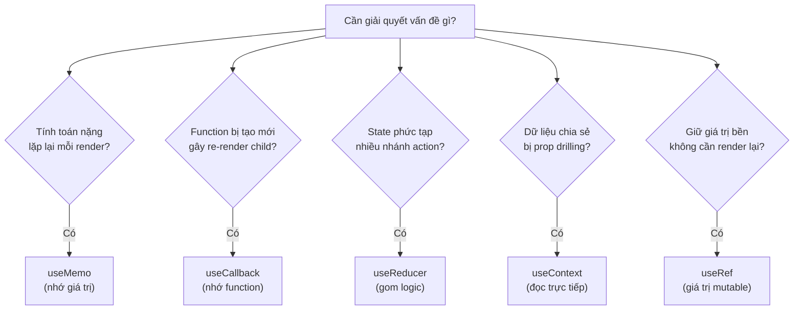
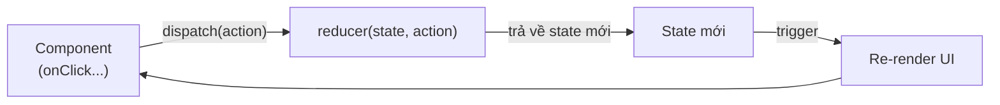

# useRef, useCallback, useMemo, useReducer, useContext

Đây là nhóm **hook** (hàm đặc biệt cho phép dùng state và tính năng React trong functional component) thường dùng sau khi đã nắm `useState` và `useEffect`. `useRef` giữ một giá trị không gây render lại (ví dụ tham chiếu tới phần tử DOM); `useMemo` và `useCallback` giúp **memoize** (ghi nhớ kết quả để tránh tính toán lại không cần thiết) nhằm tối ưu hiệu năng. `useReducer` quản lý state phức tạp theo kiểu **reducer** (hàm nhận state cũ và action rồi trả về state mới), còn `useContext` đọc dữ liệu được chia sẻ qua Context mà không cần truyền props từng cấp.

---

:::note[Ghi nhớ nhanh]

- ⭐ **`useMemo` nhớ giá trị tính toán nặng, `useCallback` nhớ function** — chỉ tính/tạo lại khi deps đổi, giúp giữ reference ổn định.
- ⭐ **`useReducer` gom state phức tạp nhiều nhánh action về một nơi dễ test; `useContext` đọc data chia sẻ không cần prop drilling.**
- **`useRef`** — giữ giá trị bền qua các render mà không gây re-render (tham chiếu DOM hoặc giá trị mutable).
- **Đừng memoize mặc định** — `useCallback`/`useMemo` đều có cost; chỉ dùng khi child đã `React.memo` hoặc function/value là dep của effect.
- **Context không phải state manager** — mọi consumer re-render khi value đổi và không có selector built-in.
- **React 19 thêm `use`** — đọc Context/Promise, được phép gọi trong `if`/`loop` (ngoại lệ của Rules of Hooks).

:::

---

## Mục lục

- [Vì sao cần các hook này?](#vì-sao-cần-các-hook-này)
- [useRef](#useref)
- [useCallback](#usecallback)
- [useMemo](#usememo)
- [useReducer](#usereducer)
- [useContext](#usecontext)

---

## Vì sao cần các hook này?

Mỗi hook trong nhóm này giải **một vấn đề cụ thể** mà `useState` và `useEffect` chưa lo trọn.

**Vấn đề:**

```jsx
function ProductList({ products, filter, theme, user }) {
  // 1. Mỗi render — lọc lại cả mảng (nặng) dù products/filter không đổi
  const filtered = products.filter(p => p.name.includes(filter));

  // 2. Mỗi render — function mới → Child (React.memo) vẫn re-render thừa
  const onSelect = (p) => console.log(p);

  // 3. State phức tạp nhiều nhánh — nhiều useState rời rạc, khó đồng bộ
  const [count, setCount] = useState(0);
  const [history, setHistory] = useState([]);
  const [error, setError] = useState(null);

  return <Child items={filtered} onSelect={onSelect} />;
}

// 4. theme, user phải truyền props qua nhiều cấp trung gian (prop drilling)
```

**Giải pháp:**

```jsx
function ProductList({ products, filter }) {
  // 1. useMemo — nhớ kết quả tính toán nặng, chỉ chạy lại khi deps đổi
  const filtered = useMemo(
    () => products.filter(p => p.name.includes(filter)),
    [products, filter]
  );

  // 2. useCallback — giữ ổn định tham chiếu hàm → Child memo không re-render thừa
  const onSelect = useCallback((p) => console.log(p), []);

  // 3. useReducer — gom logic state phức tạp về một nơi, dễ test
  const [state, dispatch] = useReducer(reducer, initialState);

  // 4. useContext — đọc dữ liệu chia sẻ, không prop drilling
  const theme = useContext(ThemeContext);

  // (useRef — giữ giá trị bền giữa các render, không gây re-render)
  const renderCount = useRef(0);

  return <Child items={filtered} onSelect={onSelect} />;
}
```

Sơ đồ dưới đây tóm tắt gặp vấn đề nào thì chọn hook nào:



:::tip[Dùng thực tế]

- **`useMemo`**: memo hoá danh sách đã lọc/sắp xếp trong bảng dữ liệu lớn, không tính lại mỗi lần gõ phím.
- **`useCallback`**: truyền callback ổn định xuống component đã `React.memo` để tránh render lại không cần thiết.
- **`useReducer`**: quản lý form nhiều bước hoặc máy trạng thái (loading → success → error) gọn gàng hơn nhiều `useState`.
- **`useContext`**: đọc theme, user đăng nhập, hoặc locale từ Provider mà không phải truyền props qua từng cấp.

:::

---

## useRef

Đã trình bày chi tiết ở phần [Refs](../05-rendering/4_refs.md). Tóm tắt:

```jsx
const ref = useRef(initial);

// Truy cập DOM
<input ref={ref} />
ref.current.focus();

// Lưu giá trị persist, không trigger re-render
const renderCount = useRef(0);
renderCount.current++;
```

---

## useCallback

Memoize **function** — trả về cùng reference giữa các render khi deps
không đổi:

```jsx
import { useCallback } from "react";

function Parent() {
  const [count, setCount] = useState(0);

  // Mỗi render — function mới
  const handleClick = () => setCount(c => c + 1);

  // Memoized — cùng reference nếu deps không đổi
  const handleClickMemo = useCallback(() => {
    setCount(c => c + 1);
  }, []); // không phụ thuộc gì → cùng function mãi

  return <Child onClick={handleClickMemo} />;
}
```

Khi dùng `useCallback`:

- Pass function làm prop xuống child đã `React.memo`.
- Function là dep của `useEffect` khác.

```jsx
const fetchData = useCallback(async () => {
  const r = await fetch(`/api/${id}`);
  setData(await r.json());
}, [id]);

useEffect(() => {
  fetchData();
}, [fetchData]); // dep ổn định khi id không đổi
```

:::warning[Cần lưu ý]

**Đừng dùng `useCallback` mặc định cho mọi function.** Tự nó có cost:

- Phải so deps mỗi render.
- Giữ closure cũ trong memory.
- Code khó đọc hơn.

Quy tắc: chỉ dùng khi **child đã memoized** hoặc function là **dep của
effect**. Còn lại bỏ qua.

React Compiler (sắp production-ready 2026) sẽ **tự động memoize** —
không cần viết tay `useCallback`/`useMemo` nữa.

:::

---

## useMemo

Memoize **giá trị tính toán** — chỉ compute lại khi deps đổi:

```jsx
import { useMemo } from "react";

function ProductList({ products, filter }) {
  // Recompute mỗi render
  const filtered = products.filter(p => p.name.includes(filter));

  // Memoized — chỉ recompute khi products hoặc filter đổi
  const filteredMemo = useMemo(() => {
    return products.filter(p => p.name.includes(filter));
  }, [products, filter]);

  return <List items={filteredMemo} />;
}
```

Dùng `useMemo` khi:

- Computation **thực sự nặng** (đo bằng Profiler).
- Cần **reference stability** cho dep của effect / memo child.

```jsx
// Object literal làm prop — mỗi render là object mới
<Child opts={{ ...config }} />

// Memo — cùng reference khi config không đổi
const opts = useMemo(() => ({ ...config }), [config]);
<Child opts={opts} />
```

:::info[Phân tích]

**`useCallback` vs `useMemo`:**

```jsx
useCallback(fn, deps);    // memoize FUNCTION
useMemo(() => fn, deps);  // memoize VALUE — value ở đây là function
```

Hai cái tương đương:

```jsx
useCallback(() => doSomething(), [a]);
useMemo(() => () => doSomething(), [a]);
```

`useCallback` chỉ là sugar cho `useMemo` trả function. Đọc source React
sẽ thấy implementation y hệt.

Quy tắc khi nào dùng cái nào:

- Memoize **function** → `useCallback`.
- Memoize **giá trị non-function** (object, array, computed) → `useMemo`.

Cả hai đều có cost. **Đo trước**, đừng memoize blanket.

:::

---

## useReducer

Alternative cho `useState` khi state phức tạp:

```jsx
import { useReducer } from "react";

const initialState = { count: 0, history: [] };

function reducer(state, action) {
  switch (action.type) {
    case "INCREMENT":
      return {
        count: state.count + 1,
        history: [...state.history, state.count + 1],
      };
    case "RESET":
      return initialState;
    default:
      throw new Error(`Unknown: ${action.type}`);
  }
}

function Counter() {
  const [state, dispatch] = useReducer(reducer, initialState);

  return (
    <div>
      <p>{state.count}</p>
      <button onClick={() => dispatch({ type: "INCREMENT" })}>+</button>
      <button onClick={() => dispatch({ type: "RESET" })}>Reset</button>
    </div>
  );
}
```

Luồng cập nhật state qua `dispatch` diễn ra như sau:



Khi nào dùng useReducer:

- State có **nhiều field** liên quan.
- **Transition phức tạp** (state machine).
- Update logic dùng nhiều nơi → tách ra reducer dễ test.
- Có **nhiều type action**.

:::tip[Mẹo]

**Pattern reducer + TypeScript discriminated union**:

```tsx
type State = { count: number; history: number[] };

type Action =
  | { type: "INCREMENT" }
  | { type: "SET"; value: number }
  | { type: "RESET" };

function reducer(state: State, action: Action): State {
  switch (action.type) {
    case "INCREMENT": return { ...state, count: state.count + 1 };
    case "SET":       return { ...state, count: action.value };
    case "RESET":     return { count: 0, history: [] };
  }
}
```

TS sẽ:
- Bắt thiếu case (exhaustive check).
- Type cho `action.value` rõ trong case `SET`.
- Autocomplete cho `dispatch({ type: "..." })`.

Đây là cách viết reducer **type-safe và scalable** nhất.

:::

---

## useContext

Đọc giá trị từ Context (state share xuống subtree):

```jsx
import { createContext, useContext } from "react";

const ThemeContext = createContext("light");

function App() {
  return (
    <ThemeContext.Provider value="dark">
      <Toolbar />
    </ThemeContext.Provider>
  );
}

function Toolbar() {
  return <Button />;
}

function Button() {
  const theme = useContext(ThemeContext); // "dark"
  return <button className={theme}>Click</button>;
}
```

Pattern tạo Context với typed hook:

```tsx
import { createContext, useContext, ReactNode } from "react";

interface AuthContextValue {
  user: User | null;
  login: (u: User) => void;
  logout: () => void;
}

const AuthContext = createContext<AuthContextValue | null>(null);

export function AuthProvider({ children }: { children: ReactNode }) {
  const [user, setUser] = useState<User | null>(null);

  const value: AuthContextValue = {
    user,
    login: setUser,
    logout: () => setUser(null),
  };

  return <AuthContext.Provider value={value}>{children}</AuthContext.Provider>;
}

export function useAuth() {
  const ctx = useContext(AuthContext);
  if (!ctx) throw new Error("useAuth phải dùng trong AuthProvider");
  return ctx;
}

// Dùng
function Profile() {
  const { user, logout } = useAuth();
  return <button onClick={logout}>{user?.name}</button>;
}
```

:::warning[Cần lưu ý]

**Context không phải state manager** — mỗi lần value đổi, **mọi consumer
re-render**. Không có selector built-in.

Vấn đề:

```jsx
<AppContext.Provider value={{ user, theme, settings, notifications }}>
  <App />
</AppContext.Provider>

// Đổi 1 field → mọi component đọc context đều re-render
```

Giải pháp:

1. **Tách nhiều context nhỏ** theo concern (UserContext, ThemeContext, ...).
2. **Zustand / Jotai** cho state phức tạp — có selector tự nhiên.
3. **`use` hook** (React 19) — đọc context có optimization tốt hơn.

Context phù hợp cho:

- Theme (đổi ít).
- Auth (đổi ít).
- Locale.
- Feature flag.

Không phù hợp:

- Form state thay đổi mỗi keystroke.
- Real-time data thay đổi liên tục.
- State có nhiều subscriber với pattern khác nhau.

:::

:::info[Phân tích]

**React 19 thêm `use` hook** — đọc context (và Promise) trong điều kiện:

```jsx
import { use } from "react";

function Item({ id }) {
  if (id) {
    const ctx = use(MyContext); // OK trong if
    return <p>{ctx.value}</p>;
  }
  return null;
}
```

Khác `useContext`:

- `use(Context)` được gọi trong `if`/`loop` (không bị Rules of Hooks).
- `use(Promise)` đọc Promise — kết hợp với Suspense:

```jsx
function Page() {
  const data = use(fetchPromise); // suspend nếu chưa resolve
  return <div>{data.title}</div>;
}
```

Đây là feature mới quan trọng của React 19 cho Server Components và
Suspense data fetching.

:::

:::tip[Mẹo]

**Cheat sheet hook builtin**:

| Hook | Mục đích |
|------|----------|
| `useState` | State đơn giản |
| `useReducer` | State phức tạp |
| `useEffect` | Side effect, sync với external |
| `useLayoutEffect` | Effect chạy đồng bộ trước paint (đo DOM) |
| `useRef` | Ref DOM hoặc giá trị mutable |
| `useContext` | Đọc context |
| `useCallback` | Memoize function |
| `useMemo` | Memoize value |
| `useId` | Generate ID unique (form labels, accessibility) |
| `useTransition` | Async state update non-blocking |
| `useDeferredValue` | Defer value cho concurrent rendering |
| `useImperativeHandle` | Expose method qua ref |
| `useDebugValue` | Hiển thị label trong React DevTools |
| `useSyncExternalStore` | Subscribe external store (Redux, Zustand impl) |
| `use` (React 19) | Đọc Promise / Context |

Học theo độ phổ biến — 5 hook đầu (state, effect, ref, context, reducer)
đủ cho 90% công việc.

:::
