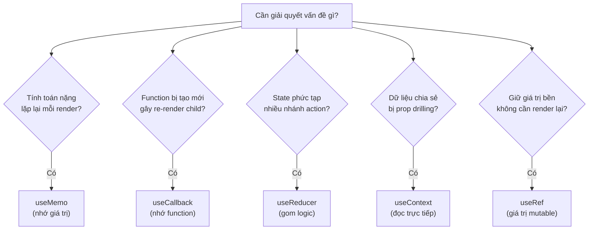
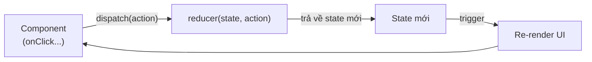

# useRef, useCallback, useMemo, useReducer, useContext

Đây là nhóm **hook** (hàm đặc biệt cho phép dùng state và tính năng React trong functional component) thường dùng sau khi đã nắm `useState` và `useEffect`. `useRef` giữ một giá trị không gây render lại (ví dụ tham chiếu tới phần tử DOM); `useMemo` và `useCallback` giúp **memoize** (ghi nhớ kết quả để tránh tính toán lại không cần thiết) nhằm tối ưu hiệu năng. `useReducer` quản lý state phức tạp theo kiểu **reducer** (hàm nhận state cũ và action rồi trả về state mới), còn `useContext` đọc dữ liệu được chia sẻ qua Context mà không cần truyền props từng cấp.

[](pathname:///img/react/common-hooks.webp)

---

:::note[Ghi nhớ nhanh]

- ⭐ **`useMemo` nhớ giá trị tính toán nặng, `useCallback` nhớ function** — chỉ tính/tạo lại khi deps đổi, giúp giữ reference ổn định.
- ⭐ **`useReducer` gom state phức tạp nhiều nhánh action về một nơi dễ test; `useContext` đọc data chia sẻ không cần prop drilling.**
- **`useRef`** — giữ giá trị bền qua các render mà không gây re-render (tham chiếu DOM hoặc giá trị mutable).
- **Đừng memoize mặc định** — `useCallback`/`useMemo` đều có cost; chỉ dùng khi child đã `React.memo` hoặc function/value là dep của effect.
- **Context không phải state manager** — mọi consumer re-render khi value đổi và không có selector built-in.
- **React 19 thêm `use`** — đọc Context/Promise, được phép gọi trong `if`/`loop` (ngoại lệ của Rules of Hooks).

:::

---

## Mục lục

- [Vì sao cần các hook này?](#vì-sao-cần-các-hook-này)
- [useRef](#useref)
- [useCallback](#usecallback)
- [useMemo](#usememo)
- [useReducer](#usereducer)
- [useContext](#usecontext)
- [Câu hỏi phỏng vấn](#câu-hỏi-phỏng-vấn)

---

## Vì sao cần các hook này?

Mỗi hook trong nhóm này giải **một vấn đề cụ thể** mà `useState` và `useEffect` chưa lo trọn.

**Vấn đề:**

```jsx
function ProductList({ products, filter, theme, user }) {
  // 1. Mỗi render — lọc lại cả mảng (nặng) dù products/filter không đổi
  const filtered = products.filter(p => p.name.includes(filter));

  // 2. Mỗi render — function mới → Child (React.memo) vẫn re-render thừa
  const onSelect = (p) => console.log(p);

  // 3. State phức tạp nhiều nhánh — nhiều useState rời rạc, khó đồng bộ
  const [count, setCount] = useState(0);
  const [history, setHistory] = useState([]);
  const [error, setError] = useState(null);

  return <Child items={filtered} onSelect={onSelect} />;
}

// 4. theme, user phải truyền props qua nhiều cấp trung gian (prop drilling)
```

**Giải pháp:**

```jsx
function ProductList({ products, filter }) {
  // 1. useMemo — nhớ kết quả tính toán nặng, chỉ chạy lại khi deps đổi
  const filtered = useMemo(
    () => products.filter(p => p.name.includes(filter)),
    [products, filter]
  );

  // 2. useCallback — giữ ổn định tham chiếu hàm → Child memo không re-render thừa
  const onSelect = useCallback((p) => console.log(p), []);

  // 3. useReducer — gom logic state phức tạp về một nơi, dễ test
  const [state, dispatch] = useReducer(reducer, initialState);

  // 4. useContext — đọc dữ liệu chia sẻ, không prop drilling
  const theme = useContext(ThemeContext);

  // (useRef — giữ giá trị bền giữa các render, không gây re-render)
  const renderCount = useRef(0);

  return <Child items={filtered} onSelect={onSelect} />;
}
```

Sơ đồ dưới đây tóm tắt gặp vấn đề nào thì chọn hook nào:



:::tip[Dùng thực tế]

- **`useMemo`**: memo hoá danh sách đã lọc/sắp xếp trong bảng dữ liệu lớn, không tính lại mỗi lần gõ phím.
- **`useCallback`**: truyền callback ổn định xuống component đã `React.memo` để tránh render lại không cần thiết.
- **`useReducer`**: quản lý form nhiều bước hoặc máy trạng thái (loading → success → error) gọn gàng hơn nhiều `useState`.
- **`useContext`**: đọc theme, user đăng nhập, hoặc locale từ Provider mà không phải truyền props qua từng cấp.

:::

---

## useRef

Đã trình bày chi tiết ở phần [Refs](../05-rendering/4_refs.md). Tóm tắt:

```jsx
const ref = useRef(initial);

// Truy cập DOM
<input ref={ref} />
ref.current.focus();

// Lưu giá trị persist, không trigger re-render
const renderCount = useRef(0);
renderCount.current++;
```

---

## useCallback

Memoize **function** — trả về cùng reference giữa các render khi deps
không đổi:

```jsx
import { useCallback } from "react";

function Parent() {
  const [count, setCount] = useState(0);

  // Mỗi render — function mới
  const handleClick = () => setCount(c => c + 1);

  // Memoized — cùng reference nếu deps không đổi
  const handleClickMemo = useCallback(() => {
    setCount(c => c + 1);
  }, []); // không phụ thuộc gì → cùng function mãi

  return <Child onClick={handleClickMemo} />;
}
```

Khi dùng `useCallback`:

- Pass function làm prop xuống child đã `React.memo`.
- Function là dep của `useEffect` khác.

```jsx
const fetchData = useCallback(async () => {
  const r = await fetch(`/api/${id}`);
  setData(await r.json());
}, [id]);

useEffect(() => {
  fetchData();
}, [fetchData]); // dep ổn định khi id không đổi
```

:::warning[Cần lưu ý]

**Đừng dùng `useCallback` mặc định cho mọi function.** Tự nó có cost:

- Phải so deps mỗi render.
- Giữ closure cũ trong memory.
- Code khó đọc hơn.

Quy tắc: chỉ dùng khi **child đã memoized** hoặc function là **dep của
effect**. Còn lại bỏ qua.

React Compiler (sắp production-ready 2026) sẽ **tự động memoize** —
không cần viết tay `useCallback`/`useMemo` nữa.

:::

---

## useMemo

Memoize **giá trị tính toán** — chỉ compute lại khi deps đổi:

```jsx
import { useMemo } from "react";

function ProductList({ products, filter }) {
  // Recompute mỗi render
  const filtered = products.filter(p => p.name.includes(filter));

  // Memoized — chỉ recompute khi products hoặc filter đổi
  const filteredMemo = useMemo(() => {
    return products.filter(p => p.name.includes(filter));
  }, [products, filter]);

  return <List items={filteredMemo} />;
}
```

Dùng `useMemo` khi:

- Computation **thực sự nặng** (đo bằng Profiler).
- Cần **reference stability** cho dep của effect / memo child.

```jsx
// Object literal làm prop — mỗi render là object mới
<Child opts={{ ...config }} />

// Memo — cùng reference khi config không đổi
const opts = useMemo(() => ({ ...config }), [config]);
<Child opts={opts} />
```

:::info[Phân tích]

**`useCallback` vs `useMemo`:**

```jsx
useCallback(fn, deps);    // memoize FUNCTION
useMemo(() => fn, deps);  // memoize VALUE — value ở đây là function
```

Hai cái tương đương:

```jsx
useCallback(() => doSomething(), [a]);
useMemo(() => () => doSomething(), [a]);
```

`useCallback` chỉ là sugar cho `useMemo` trả function. Đọc source React
sẽ thấy implementation y hệt.

Quy tắc khi nào dùng cái nào:

- Memoize **function** → `useCallback`.
- Memoize **giá trị non-function** (object, array, computed) → `useMemo`.

Cả hai đều có cost. **Đo trước**, đừng memoize blanket.

:::

---

## useReducer

Alternative cho `useState` khi state phức tạp:

```jsx
import { useReducer } from "react";

const initialState = { count: 0, history: [] };

function reducer(state, action) {
  switch (action.type) {
    case "INCREMENT":
      return {
        count: state.count + 1,
        history: [...state.history, state.count + 1],
      };
    case "RESET":
      return initialState;
    default:
      throw new Error(`Unknown: ${action.type}`);
  }
}

function Counter() {
  const [state, dispatch] = useReducer(reducer, initialState);

  return (
    <div>
      <p>{state.count}</p>
      <button onClick={() => dispatch({ type: "INCREMENT" })}>+</button>
      <button onClick={() => dispatch({ type: "RESET" })}>Reset</button>
    </div>
  );
}
```

Luồng cập nhật state qua `dispatch` diễn ra như sau:



Khi nào dùng useReducer:

- State có **nhiều field** liên quan.
- **Transition phức tạp** (state machine).
- Update logic dùng nhiều nơi → tách ra reducer dễ test.
- Có **nhiều type action**.

:::tip[Mẹo]

**Pattern reducer + TypeScript discriminated union**:

```tsx
type State = { count: number; history: number[] };

type Action =
  | { type: "INCREMENT" }
  | { type: "SET"; value: number }
  | { type: "RESET" };

function reducer(state: State, action: Action): State {
  switch (action.type) {
    case "INCREMENT": return { ...state, count: state.count + 1 };
    case "SET":       return { ...state, count: action.value };
    case "RESET":     return { count: 0, history: [] };
  }
}
```

TS sẽ:
- Bắt thiếu case (exhaustive check).
- Type cho `action.value` rõ trong case `SET`.
- Autocomplete cho `dispatch({ type: "..." })`.

Đây là cách viết reducer **type-safe và scalable** nhất.

:::

---

## useContext

Đọc giá trị từ Context (state share xuống subtree):

```jsx
import { createContext, useContext } from "react";

const ThemeContext = createContext("light");

function App() {
  return (
    <ThemeContext.Provider value="dark">
      <Toolbar />
    </ThemeContext.Provider>
  );
}

function Toolbar() {
  return <Button />;
}

function Button() {
  const theme = useContext(ThemeContext); // "dark"
  return <button className={theme}>Click</button>;
}
```

Pattern tạo Context với typed hook:

```tsx
import { createContext, useContext, ReactNode } from "react";

interface AuthContextValue {
  user: User | null;
  login: (u: User) => void;
  logout: () => void;
}

const AuthContext = createContext<AuthContextValue | null>(null);

export function AuthProvider({ children }: { children: ReactNode }) {
  const [user, setUser] = useState<User | null>(null);

  const value: AuthContextValue = {
    user,
    login: setUser,
    logout: () => setUser(null),
  };

  return <AuthContext.Provider value={value}>{children}</AuthContext.Provider>;
}

export function useAuth() {
  const ctx = useContext(AuthContext);
  if (!ctx) throw new Error("useAuth phải dùng trong AuthProvider");
  return ctx;
}

// Dùng
function Profile() {
  const { user, logout } = useAuth();
  return <button onClick={logout}>{user?.name}</button>;
}
```

:::warning[Cần lưu ý]

**Context không phải state manager** — mỗi lần value đổi, **mọi consumer
re-render**. Không có selector built-in.

Vấn đề:

```jsx
<AppContext.Provider value={{ user, theme, settings, notifications }}>
  <App />
</AppContext.Provider>

// Đổi 1 field → mọi component đọc context đều re-render
```

Giải pháp:

1. **Tách nhiều context nhỏ** theo concern (UserContext, ThemeContext, ...).
2. **Zustand / Jotai** cho state phức tạp — có selector tự nhiên.
3. **`use` hook** (React 19) — đọc context có optimization tốt hơn.

Context phù hợp cho:

- Theme (đổi ít).
- Auth (đổi ít).
- Locale.
- Feature flag.

Không phù hợp:

- Form state thay đổi mỗi keystroke.
- Real-time data thay đổi liên tục.
- State có nhiều subscriber với pattern khác nhau.

:::

:::info[Phân tích]

**React 19 thêm `use` hook** — đọc context (và Promise) trong điều kiện:

```jsx
import { use } from "react";

function Item({ id }) {
  if (id) {
    const ctx = use(MyContext); // OK trong if
    return <p>{ctx.value}</p>;
  }
  return null;
}
```

Khác `useContext`:

- `use(Context)` được gọi trong `if`/`loop` (không bị Rules of Hooks).
- `use(Promise)` đọc Promise — kết hợp với Suspense:

```jsx
function Page() {
  const data = use(fetchPromise); // suspend nếu chưa resolve
  return <div>{data.title}</div>;
}
```

Đây là feature mới quan trọng của React 19 cho Server Components và
Suspense data fetching.

:::

:::tip[Mẹo]

**Cheat sheet hook builtin**:

| Hook | Mục đích |
|------|----------|
| `useState` | State đơn giản |
| `useReducer` | State phức tạp |
| `useEffect` | Side effect, sync với external |
| `useLayoutEffect` | Effect chạy đồng bộ trước paint (đo DOM) |
| `useRef` | Ref DOM hoặc giá trị mutable |
| `useContext` | Đọc context |
| `useCallback` | Memoize function |
| `useMemo` | Memoize value |
| `useId` | Generate ID unique (form labels, accessibility) |
| `useTransition` | Async state update non-blocking |
| `useDeferredValue` | Defer value cho concurrent rendering |
| `useImperativeHandle` | Expose method qua ref |
| `useDebugValue` | Hiển thị label trong React DevTools |
| `useSyncExternalStore` | Subscribe external store (Redux, Zustand impl) |
| `use` (React 19) | Đọc Promise / Context |

Học theo độ phổ biến — 5 hook đầu (state, effect, ref, context, reducer)
đủ cho 90% công việc.

:::

---

## Câu hỏi phỏng vấn

Những câu thường gặp về chủ đề này. Tự trả lời trước, rồi bấm **Xem đáp án** để đối chiếu.

**1. `useRef` trả về gì? Vì sao gán lại `ref.current` không làm component re-render?**

<details className="qa">
<summary>Xem đáp án</summary>

`useRef(initial)` trả về một **object duy nhất** dạng `{ current: initial }`. React giữ chính object đó qua mọi lần render — bạn luôn nhận lại đúng một tham chiếu, không bao giờ là object mới.

```jsx
const renderCount = useRef(0);
renderCount.current++; // không gây render lại
```

Lý do không re-render: React chỉ lên lịch render khi bạn gọi hàm `set` của `useState` hoặc `dispatch` của `useReducer`. Ghi vào `ref.current` chỉ là một phép gán JavaScript thông thường trên một object bình thường — React hoàn toàn không theo dõi, không có cơ chế nào báo cho nó biết.

Đây vừa là điểm mạnh vừa là bẫy:

- **Mạnh** — giữ được giá trị bền qua các render mà không tốn một lượt render nào.
- **Bẫy** — nếu hiển thị `ref.current` trong JSX, giá trị trên màn hình sẽ lỗi thời cho tới khi có thứ khác kích hoạt render.

Quy tắc: thứ gì người dùng cần nhìn thấy thì để trong state; thứ gì chỉ code cần nhớ thì để trong ref.

</details>

**2. Khi nào dùng `useRef` thay cho `useState`? Cho ví dụ các giá trị nên nằm trong ref (id của timer, giá trị của render trước, cờ đã mount).**

<details className="qa">
<summary>Xem đáp án</summary>

Tiêu chí duy nhất: **giá trị này có cần hiển thị ra giao diện không?** Có thì dùng state, không thì dùng ref.

Các giá trị điển hình nên nằm trong ref:

- **Id của timer** — để cleanup, người dùng không bao giờ thấy nó.

```jsx
const timerRef = useRef(null);
timerRef.current = setInterval(tick, 1000);
useEffect(() => () => clearInterval(timerRef.current), []);
```

- **Giá trị của render trước** — để so sánh với giá trị hiện tại.

```jsx
const prevCount = useRef(count);
useEffect(() => { prevCount.current = count; }, [count]);
```

- **Cờ đã mount** — tránh cập nhật state sau khi component đã chết.
- **Tham chiếu tới DOM node** — để gọi `focus()`, `scrollIntoView()`, đo kích thước.
- **Instance của thư viện bên thứ ba** — chart, map, editor.
- **Giá trị mới nhất cho callback dài hạn**, dùng để phá stale closure.

Ngược lại, đừng dùng ref cho dữ liệu hiển thị: đổi ref mà giao diện không cập nhật là loại bug rất khó nhận ra vì đôi khi nó "tự đúng" nhờ một lần render vì lý do khác.

</details>

**3. Đoán khác biệt: một biến thường `let x = 0` khai báo trong thân component so với `useRef(0)` — sau nhiều lần render giá trị của chúng khác nhau thế nào?**

<details className="qa">
<summary>Xem đáp án</summary>

Biến thường **bị khởi tạo lại ở mọi lần render**, còn ref **giữ nguyên giá trị**.

```jsx
function Counter() {
  let plain = 0;
  const refCount = useRef(0);

  plain++;
  refCount.current++;

  console.log(plain, refCount.current);
  // Render 1: 1 1
  // Render 2: 1 2
  // Render 3: 1 3
}
```

Lý do: mỗi lần render là một lần **gọi lại hàm component**. Toàn bộ biến cục bộ được tạo mới từ đầu, nên `plain` luôn quay về `0` rồi tăng lên `1`. Trong khi đó `useRef` trả về đúng một object mà React cất giữ trong Fiber của component, nên `refCount.current` tích luỹ qua các lần render.

Điểm giống nhau: cả hai đều **không kích hoạt render lại** khi thay đổi.

Cách nhớ: biến thường sống trong **một lần render**; ref sống suốt **đời component**; state cũng sống suốt đời component nhưng thêm khả năng kích hoạt render.

</details>

**4. Vì sao đọc `ref.current` của một DOM node ngay trong thân render là sai? Thời điểm nào mới đọc được?**

<details className="qa">
<summary>Xem đáp án</summary>

Vì React chỉ gán DOM node vào `ref.current` **sau khi commit** cây vào DOM thật. Trong lúc thân component đang chạy, DOM tương ứng chưa tồn tại, nên ở lần render đầu tiên `ref.current` vẫn là `null`.

```jsx
function Input() {
  const inputRef = useRef(null);

  console.log(inputRef.current); // null ở lần render đầu
  // inputRef.current.focus();   // lỗi: đọc thuộc tính của null

  return <input ref={inputRef} />;
}
```

Ngoài ra, đọc hoặc ghi DOM trong lúc render vi phạm yêu cầu component phải thuần — nó là một side effect, và với concurrent rendering, React có thể render rồi bỏ dở một lượt mà không commit.

Thời điểm đọc được:

- Trong **`useEffect`** — sau khi DOM đã commit và trình duyệt đã vẽ. Đây là lựa chọn mặc định.
- Trong **`useLayoutEffect`** — sau commit nhưng trước khi vẽ, dùng khi cần đo kích thước rồi chỉnh vị trí ngay để tránh nhấp nháy.
- Trong **event handler** — lúc đó DOM chắc chắn đã có.

```jsx
useEffect(() => { inputRef.current.focus(); }, []);
```

</details>

**5. `useCallback(fn, deps)` tương đương cách viết nào bằng `useMemo`?**

<details className="qa">
<summary>Xem đáp án</summary>

Tương đương với một `useMemo` **trả về chính function đó**:

```jsx
useCallback(fn, deps);
// tương đương
useMemo(() => fn, deps);
```

Ví dụ cụ thể:

```jsx
const handler = useCallback(() => doSomething(a), [a]);
const handler = useMemo(() => () => doSomething(a), [a]);
```

Chú ý hai tầng arrow function ở dạng `useMemo`: tầng ngoài là hàm khởi tạo mà React gọi để lấy giá trị, tầng trong mới là function bạn muốn ghi nhớ. Đây chính là nguồn nhầm lẫn phổ biến — viết `useMemo(() => doSomething(a), [a])` là ghi nhớ **kết quả** của lời gọi, hoàn toàn khác.

`useCallback` sinh ra chỉ để tránh cú pháp lủng củng đó. Trong mã nguồn React, nó thực chất dùng cùng cơ chế với `useMemo`.

Quy tắc chọn: ghi nhớ một **function** thì dùng `useCallback`; ghi nhớ **giá trị** (object, array, kết quả tính toán) thì dùng `useMemo`.

</details>

**6. Phân biệt `useMemo` và `useCallback` — cái nào ghi nhớ giá trị, cái nào ghi nhớ chính function?**

<details className="qa">
<summary>Xem đáp án</summary>

| | `useMemo` | `useCallback` |
|---|---|---|
| Ghi nhớ | **Giá trị trả về** của hàm khởi tạo | **Chính function** được truyền vào |
| Tham số đầu | Hàm tính toán, React sẽ gọi | Function cần giữ ổn định, React không gọi |
| Dùng cho | Kết quả tính nặng, object, array | Event handler, callback truyền xuống con |

```jsx
// useMemo — React GỌI hàm và nhớ kết quả
const filtered = useMemo(
  () => products.filter(p => p.name.includes(filter)),
  [products, filter]
);

// useCallback — React KHÔNG gọi, chỉ giữ nguyên tham chiếu
const onSelect = useCallback((p) => console.log(p), []);
```

Điểm chung: cả hai đều chỉ tính/tạo lại khi dependency đổi (so sánh bằng `Object.is`), và cả hai đều có **hai mục đích** — tiết kiệm tính toán, và giữ **ổn định tham chiếu** để `React.memo` hoặc dependency array của effect hoạt động đúng.

Trên thực tế, mục đích thứ hai mới hay gặp hơn: phần lớn phép tính trong component đều rẻ, còn việc tham chiếu đổi mỗi render mới là thứ phá vỡ memoization.

</details>

**7. Vì sao bọc `useCallback` quanh callback truyền xuống child KHÔNG có tác dụng nếu child chưa được bọc `React.memo`?**

<details className="qa">
<summary>Xem đáp án</summary>

Vì component con **không bọc `React.memo` thì luôn render lại** mỗi khi cha render — bất kể props có đổi hay không. React không hề so sánh props trong trường hợp này.

```jsx
function Child({ onClick }) { /* không memo → luôn render lại */ }

function Parent() {
  const onClick = useCallback(() => {}, []); // vô ích ở đây
  return <Child onClick={onClick} />;
}
```

Kết quả là `useCallback` không tiết kiệm được gì, mà còn **thêm chi phí**: React phải lưu function cũ, so sánh mảng deps mỗi lần render, và closure cũ bị giữ lại trong bộ nhớ. Code cũng dài và khó đọc hơn.

`useCallback` chỉ có giá trị khi function đó đi vào một phép **so sánh tham chiếu**:

- Truyền xuống component đã bọc `React.memo`.
- Là dependency của `useEffect`, `useMemo` hay `useCallback` khác.
- Truyền vào một hook tuỳ biến có so sánh deps bên trong.

Ngoài ba trường hợp đó thì bỏ qua. Đây là ví dụ điển hình của tối ưu hoá sớm: trông có vẻ "cẩn thận" nhưng thực chất chỉ làm code nặng thêm.

</details>

**8. `React.memo` so sánh props bằng cách nào? Vì sao truyền một object literal làm props khiến `React.memo` gần như vô hiệu?**

<details className="qa">
<summary>Xem đáp án</summary>

`React.memo` so sánh **nông** (shallow): duyệt từng key của props và so bằng `Object.is`. Nó không nhìn vào bên trong object hay array.

Vì thế object literal viết thẳng trong JSX là tham chiếu **mới** ở mỗi lần render:

```jsx
// Mỗi render tạo object mới → memo luôn thất bại
<Child opts={{ ...config }} />

// Sửa — giữ ổn định tham chiếu
const opts = useMemo(() => ({ ...config }), [config]);
<Child opts={opts} />
```

Cùng nội dung nhưng khác tham chiếu, `Object.is` trả về `false`, memo cho rằng props đã đổi và render lại — công sức bọc memo thành vô nghĩa.

Các dạng props hay phá memo: object literal, array literal, arrow function inline, và giá trị JSX truyền qua prop.

Cách xử lý:

- Bọc `useMemo` cho object/array, `useCallback` cho function.
- Truyền **giá trị nguyên thuỷ** thay vì cả object khi được: `<Child id={user.id} name={user.name} />`.
- Truyền hàm so sánh tuỳ biến làm tham số thứ hai của `React.memo` — nhưng cẩn thận, so sánh sâu có thể đắt hơn cả việc render lại.

</details>

**9. Memoize có chi phí gì (bộ nhớ, thời gian so sánh deps)? Vì sao memoize mọi thứ là anti-pattern?**

<details className="qa">
<summary>Xem đáp án</summary>

Chi phí của mỗi lần memoize:

- **Bộ nhớ** — phải lưu giá trị cũ, mảng deps cũ, và giữ nguyên closure cũ cùng mọi biến nó tham chiếu. Với danh sách hàng nghìn dòng, chi phí này cộng dồn đáng kể.
- **Thời gian** — mỗi lần render vẫn phải tạo mảng deps và so sánh từng phần tử. Với phép tính rẻ, chi phí so sánh có thể còn lớn hơn chi phí tính lại.
- **Độ phức tạp** — thêm một mảng deps cần bảo trì, dễ viết thiếu và sinh stale closure, code khó đọc hơn.

Vì sao memoize mọi thứ là anti-pattern:

- Phần lớn tính toán trong component vốn đã rẻ; memoize chúng là lỗ vốn.
- Che giấu vấn đề thật — component chậm thường do render quá nhiều DOM hoặc cây con quá lớn, chứ không phải do tính toán.
- Một mắt xích hỏng là cả chuỗi hỏng: chỉ cần một prop không ổn định là toàn bộ memo phía dưới vô hiệu, nhưng chi phí vẫn phải trả.

Quy trình đúng: **đo trước bằng React DevTools Profiler**, tìm đúng component chậm, rồi mới tối ưu đúng chỗ đó.

</details>

**10. React Compiler ở React 19 thay đổi gì với `useMemo` và `useCallback`? Có nên gỡ hết memoize thủ công khi đã bật compiler không?**

<details className="qa">
<summary>Xem đáp án</summary>

**React Compiler** là một trình biên dịch chạy lúc build: nó phân tích component, hiểu giá trị nào phụ thuộc giá trị nào, rồi **tự chèn memoization** vào mã sinh ra. Mục tiêu là bạn viết code React thuần, không phải rải `useMemo`/`useCallback` khắp nơi mà vẫn có hiệu năng tốt — thậm chí tốt hơn, vì compiler memo hoá ở mức chi tiết hơn con người làm tay.

Điều kiện để compiler làm việc được: code phải tuân thủ **Rules of React** — component thuần, không mutate props/state, hook gọi đúng vị trí. Compiler sẽ bỏ qua (không tối ưu) những component nó thấy không an toàn.

Có nên gỡ hết memoize thủ công không? **Không nên gỡ ồ ạt.** Hướng hợp lý:

- **Code mới** — viết tự nhiên, không memo thủ công nữa.
- **Code cũ** — cứ để nguyên. `useMemo`/`useCallback` sẵn có không gây hại, chỉ là dư thừa.
- Gỡ dần **khi có lý do** (đang sửa file đó, code khó đọc), và **đo lại** sau khi gỡ.

Một số chỗ vẫn cần memo thủ công vì lý do ngữ nghĩa chứ không phải hiệu năng — ví dụ giá trị bắt buộc phải ổn định tham chiếu cho một thư viện bên ngoài.

</details>

**11. `useMemo` có đảm bảo giữ giá trị cache mãi mãi không? React được phép vứt bỏ cache trong trường hợp nào?**

<details className="qa">
<summary>Xem đáp án</summary>

**Không.** Tài liệu React nói rõ `useMemo` là một **tối ưu hoá hiệu năng**, không phải một đảm bảo về mặt ngữ nghĩa. React có quyền quên giá trị đã ghi nhớ và tính lại.

Các trường hợp cache bị bỏ:

- Component **unmount** — toàn bộ state, ref và memo biến mất.
- React quyết định **giải phóng bộ nhớ** cho cây nằm ngoài màn hình (offscreen), một hướng đang phát triển cùng các tính năng concurrent.
- Component bị **remount** vì `key` đổi, hoặc vì StrictMode chạy đôi lúc phát triển.
- Cơ chế nội bộ của React thay đổi trong tương lai.

Hệ quả thực tiễn, và đây là điểm phỏng vấn hay hỏi: **không được đặt logic bắt buộc phải chạy đúng một lần vào trong `useMemo`**.

```jsx
// Sai — side effect trong useMemo, có thể chạy lại bất cứ lúc nào
const id = useMemo(() => registerOnServer(), []);

// Đúng — side effect thuộc về effect
useEffect(() => { registerOnServer(); }, []);
```

Hãy viết code sao cho nó vẫn chạy đúng khi mọi `useMemo` bị bỏ và tính lại — memo chỉ được phép làm nó **nhanh hơn**, không được làm nó **đúng hơn**.

</details>

**12. `useReducer` gồm những thành phần nào? Mô tả chữ ký của một reducer và giải thích vì sao reducer bắt buộc phải pure.**

<details className="qa">
<summary>Xem đáp án</summary>

Ba thành phần: **state hiện tại**, hàm **reducer**, và hàm **dispatch**.

```jsx
const [state, dispatch] = useReducer(reducer, initialState);
```

Chữ ký reducer: `(state, action) => newState` — nhận state cũ và một object action mô tả "việc gì vừa xảy ra", trả về state mới.

```jsx
function reducer(state, action) {
  switch (action.type) {
    case "INCREMENT":
      return { ...state, count: state.count + 1 };
    case "RESET":
      return initialState;
    default:
      throw new Error(`Unknown: ${action.type}`);
  }
}
```

Reducer bắt buộc phải **thuần** (pure): cùng đầu vào luôn cho cùng đầu ra, không mutate `state`, không gọi API, không đọc `Date.now()` hay `Math.random()`, không chạm vào DOM.

Lý do:

- React có thể **gọi reducer nhiều lần** cho cùng một action — trong StrictMode ở chế độ phát triển, hoặc khi phải tính lại trong concurrent rendering. Reducer không thuần sẽ sinh ra kết quả khác nhau hoặc side effect nhân đôi.
- Mutate state khiến React so sánh tham chiếu thấy không đổi và bỏ qua render.
- Reducer thuần thì **test được như một hàm thường** — đây chính là lợi ích lớn nhất của `useReducer`.

Side effect thuộc về event handler hoặc `useEffect`, không bao giờ nằm trong reducer.

</details>

**13. Nêu tiêu chí cụ thể để quyết định chuyển từ `useState` sang `useReducer`.**

<details className="qa">
<summary>Xem đáp án</summary>

Các dấu hiệu rõ ràng:

- **Nhiều field liên quan chặt chẽ** — đổi cái này bắt buộc phải đổi cái kia để dữ liệu còn hợp lệ. Ví dụ `loading`, `data`, `error` phải luôn nhất quán với nhau.
- **Một hành động kéo theo nhiều lệnh `setState`**, và cụm lệnh đó lặp lại ở nhiều chỗ. Reducer gom chúng thành một `dispatch` duy nhất.
- **State có dạng máy trạng thái** — `idle → loading → success | error`, mỗi chuyển trạng thái có quy tắc riêng.
- **Nhiều loại action** khác nhau tác động lên cùng một khối dữ liệu.
- **Logic cập nhật phức tạp**, muốn tách khỏi component để viết unit test riêng — reducer là hàm thuần nên test rất dễ.
- **Phải truyền hàm cập nhật xuống sâu** — `dispatch` có tham chiếu ổn định, tiện hơn nhiều callback rời rạc.

Ngược lại, hãy giữ `useState` khi các giá trị **độc lập với nhau** và logic cập nhật đơn giản. Một form ba ô nhập dùng reducer chỉ khiến code dài ra mà không đổi lại lợi ích gì.

Có thể dùng cả hai trong một component: reducer cho cụm state nghiệp vụ phức tạp, `useState` cho các cờ giao diện lặt vặt.

</details>

**14. Hàm `dispatch` do `useReducer` trả về có ổn định reference qua các render không? Điều đó có ý nghĩa gì khi đưa nó vào dependency array?**

<details className="qa">
<summary>Xem đáp án</summary>

**Có** — React đảm bảo `dispatch` giữ nguyên tham chiếu suốt đời component, giống như hàm `set` của `useState`.

Ý nghĩa thực tiễn:

- Đưa `dispatch` vào deps là **vô hại** — nó không bao giờ đổi nên effect không chạy lại vì nó. ESLint có thể yêu cầu khai báo, cứ khai báo cho đúng.

```jsx
useEffect(() => {
  dispatch({ type: "INIT" });
}, [dispatch]); // an toàn, chỉ chạy một lần
```

- **Không cần bọc `useCallback`** cho các hàm chỉ gọi `dispatch`.
- Truyền `dispatch` xuống component đã bọc `React.memo` thì memo vẫn hoạt động, khác hẳn với việc truyền callback tạo mới mỗi render.
- Kết hợp với Context rất tốt: tách thành hai context — một cho state (đổi thường xuyên), một cho `dispatch` (không bao giờ đổi). Component chỉ cần gửi action thì đọc context `dispatch` và sẽ không render lại khi state đổi.

Đây là một trong những lý do khiến `useReducer` hợp với state dùng chung ở phạm vi rộng hơn là `useState` kèm nhiều callback.

</details>

**15. `useContext` giải quyết vấn đề gì? Prop drilling là gì và vì sao nó gây khó bảo trì?**

<details className="qa">
<summary>Xem đáp án</summary>

**Prop drilling** là việc truyền một prop qua nhiều tầng component trung gian chỉ để đưa nó xuống tầng sâu nhất, trong khi các tầng ở giữa hoàn toàn không dùng tới nó.

```jsx
<App theme={theme}>
  <Layout theme={theme}>       {/* không dùng, chỉ chuyển tiếp */}
    <Sidebar theme={theme}>    {/* không dùng, chỉ chuyển tiếp */}
      <Button theme={theme} /> {/* nơi thực sự cần */}
```

Vì sao khó bảo trì:

- Thêm hay đổi một prop phải sửa toàn bộ các tầng trung gian.
- Các component trung gian bị "ô nhiễm" bởi dữ liệu không thuộc về chúng, khó tái sử dụng ở nơi khác.
- Chữ ký props phình to, đọc code khó biết prop nào thực sự được dùng.
- Refactor cấu trúc cây là phải sửa lại cả chuỗi truyền.

`useContext` cắt đứt chuỗi đó: Provider đặt giá trị ở một tầng trên, mọi component con ở bất kỳ độ sâu nào đọc thẳng bằng `useContext(ThemeContext)`.

Lưu ý: không phải cứ truyền props hai ba tầng là phải dùng Context. Nhiều trường hợp chỉ cần tái cấu trúc bằng `children` để component cha dựng sẵn nội dung, là hết prop drilling mà không cần thêm Context.

</details>

**16. Vì sao mọi consumer của một Context đều re-render khi value đổi, kể cả khi component đó chỉ đọc một field nhỏ? Nêu các cách giảm thiểu (tách nhiều context, memo value, selector).**

<details className="qa">
<summary>Xem đáp án</summary>

Vì Context **không có cơ chế selector**. React chỉ theo dõi ở mức "giá trị của Provider này có đổi không" bằng `Object.is`. Đổi thì mọi component đang gọi `useContext` với context đó đều bị đánh dấu render lại — React không biết component nào đọc field nào.

```jsx
<AppContext.Provider value={{ user, theme, settings, notifications }}>
// Chỉ đổi notifications → mọi consumer đều render lại
```

Các cách giảm thiểu:

- **Tách nhiều context nhỏ** theo mối quan tâm — `UserContext`, `ThemeContext`, `SettingsContext`. Đây là cách đơn giản và hiệu quả nhất.
- **Tách state và dispatch thành hai context**: phần `dispatch` không bao giờ đổi nên các component chỉ gửi action sẽ không render lại.
- **Bọc value bằng `useMemo`** để không tạo object mới ở mỗi lần render của Provider.
- **Dùng `children`** để phần cây không phụ thuộc context không bị kéo theo render.
- **Chuyển sang Zustand hoặc Jotai** khi state đổi thường xuyên — các thư viện này có selector tự nhiên, component chỉ render lại khi đúng phần dữ liệu nó chọn thay đổi.

Kết luận: Context hợp với dữ liệu **ít thay đổi** như theme, người dùng đăng nhập, ngôn ngữ, feature flag.

</details>

**17. Vì sao truyền `value={{ user, setUser }}` trực tiếp vào Provider là bug hiệu năng? Sửa như thế nào?**

<details className="qa">
<summary>Xem đáp án</summary>

Vì object literal đó được **tạo mới ở mỗi lần render của Provider**. React so sánh value bằng `Object.is`, thấy khác tham chiếu, và bắt **toàn bộ consumer render lại** — kể cả khi `user` và `setUser` không hề đổi.

```jsx
// Bug — object mới mỗi render, mọi consumer render theo
function AuthProvider({ children }) {
  const [user, setUser] = useState(null);
  return (
    <AuthContext.Provider value={{ user, setUser }}>
      {children}
    </AuthContext.Provider>
  );
}
```

Tệ hơn nữa, component cha của Provider render vì bất kỳ lý do gì cũng kéo theo toàn bộ cây consumer render lại.

Sửa bằng `useMemo`:

```jsx
const value = useMemo(() => ({ user, setUser }), [user]);
return <AuthContext.Provider value={value}>{children}</AuthContext.Provider>;
```

`setUser` do `useState` trả về đã ổn định sẵn nên không cần đưa vào deps (đưa vào cũng không sao).

Hai kỹ thuật bổ trợ:

- Nhận `children` làm prop để phần cây đó không bị render lại theo Provider.
- Nếu value có cả dữ liệu hay đổi lẫn hàm không đổi, tách hẳn thành hai context riêng.

</details>

**18. Context có phải là state manager không? So sánh với Redux hoặc Zustand và cho biết khi nào nên chọn cái nào.**

<details className="qa">
<summary>Xem đáp án</summary>

**Không.** Context là cơ chế **truyền dữ liệu xuống cây component**, không phải công cụ quản lý state. Bản thân nó không lưu state (state vẫn nằm ở `useState`/`useReducer` trong Provider), không có selector, không có middleware, không có devtools.

| | Context + `useReducer` | Redux Toolkit | Zustand |
|---|---|---|---|
| Selector | Không có | Có (`useSelector`) | Có |
| Devtools | Không | Đầy đủ, có time-travel | Có qua middleware |
| Boilerplate | Ít | Nhiều hơn | Rất ít |
| Kích thước thêm vào bundle | 0 | Lớn nhất | Nhỏ |
| Dùng ngoài React | Không | Được | Được |

Khi nào chọn gì:

- **Context** — dữ liệu ít đổi và phạm vi rõ ràng: theme, người dùng đăng nhập, ngôn ngữ, feature flag.
- **Zustand / Jotai** — state dùng chung đổi thường xuyên, muốn selector mà không muốn nhiều boilerplate. Lựa chọn mặc định hợp lý cho phần lớn dự án mới.
- **Redux Toolkit** — ứng dụng lớn, nhiều người, cần quy ước chặt, devtools mạnh, middleware phức tạp.
- **TanStack Query** — với dữ liệu lấy từ server. Đây là điểm hay bị bỏ qua: rất nhiều "state toàn cục" thực chất chỉ là cache của server, và dùng đúng công cụ sẽ xoá bớt phần lớn nhu cầu state manager.

</details>

**19. Kết hợp `useContext` với `useReducer` tạo thành pattern gì? Ưu và nhược điểm so với dùng thư viện state chuyên dụng?**

<details className="qa">
<summary>Xem đáp án</summary>

Kết hợp này tạo ra một **store toàn cục thu nhỏ theo phong cách Redux**, viết hoàn toàn bằng React thuần: `useReducer` giữ state và logic cập nhật, Context đưa state cùng `dispatch` xuống toàn bộ cây.

```jsx
const StateContext = createContext(null);
const DispatchContext = createContext(null);

function AppProvider({ children }) {
  const [state, dispatch] = useReducer(reducer, initialState);
  return (
    <StateContext.Provider value={state}>
      <DispatchContext.Provider value={dispatch}>
        {children}
      </DispatchContext.Provider>
    </StateContext.Provider>
  );
}
```

**Ưu điểm:** không thêm dependency, không tăng kích thước bundle, dùng khái niệm React sẵn có nên ai đọc cũng hiểu, reducer là hàm thuần nên test dễ. Tách hai context giúp component chỉ gửi action không bị render lại khi state đổi.

**Nhược điểm:** không có selector nên mọi consumer của context state đều render lại khi bất kỳ field nào đổi; không có devtools hay time-travel; không có middleware sẵn cho tác vụ bất đồng bộ; state không truy cập được từ ngoài React.

Chọn pattern này khi state toàn cục **vừa phải và ít đổi**. Khi thấy phải tự viết selector hoặc tối ưu render liên miên, đó là lúc chuyển sang Zustand hoặc Redux Toolkit.

</details>

**20. Hook `use` của React 19 khác `useContext` ở điểm nào, và vì sao nó được phép gọi bên trong `if`?**

<details className="qa">
<summary>Xem đáp án</summary>

`use` là một API mới của React 19, đọc được **cả Context lẫn Promise**:

```jsx
import { use } from "react";

function Item({ id }) {
  if (id) {
    const ctx = use(MyContext); // hợp lệ bên trong if
    return <p>{ctx.value}</p>;
  }
  return null;
}

function Page() {
  const data = use(fetchPromise); // suspend cho tới khi resolve
  return <div>{data.title}</div>;
}
```

Khác biệt so với `useContext`:

- `useContext` chỉ đọc Context; `use` đọc được cả Promise, kết hợp với Suspense để làm data fetching.
- `useContext` phải gọi ở cấp cao nhất của component; `use` gọi được trong `if`, trong vòng lặp.

Vì sao được phép: Rules of Hooks tồn tại do các hook **có state** được React nhận diện theo **thứ tự gọi** — gọi có điều kiện sẽ làm lệch thứ tự và lẫn state giữa các hook. `use` thì khác: nó **không giữ state nội bộ theo vị trí**, chỉ đọc một giá trị đang có sẵn (giá trị của Provider gần nhất, hoặc kết quả của Promise). Không có ô state nào để lệch, nên ràng buộc thứ tự không cần thiết.

</details>

**21. `useSyncExternalStore` sinh ra để giải quyết vấn đề gì? Tearing trong concurrent rendering là gì?**

<details className="qa">
<summary>Xem đáp án</summary>

`useSyncExternalStore` là API chuẩn để **đăng ký vào một kho dữ liệu nằm ngoài React** — Redux, Zustand, `localStorage`, `window.matchMedia`, trạng thái online/offline của trình duyệt.

```jsx
const isOnline = useSyncExternalStore(
  (callback) => {
    window.addEventListener("online", callback);
    window.addEventListener("offline", callback);
    return () => {
      window.removeEventListener("online", callback);
      window.removeEventListener("offline", callback);
    };
  },
  () => navigator.onLine,        // đọc giá trị ở client
  () => true                     // giá trị dùng khi render trên server
);
```

**Tearing** (rách hình) là lỗi khi **các phần khác nhau của cùng một lần render hiển thị hai giá trị khác nhau** của cùng một nguồn dữ liệu. Với concurrent rendering, React có thể tạm dừng giữa chừng một lượt render để xử lý việc gấp hơn; nếu kho dữ liệu bên ngoài thay đổi đúng lúc đó, các component render trước thấy giá trị cũ, component render sau thấy giá trị mới — màn hình hiện dữ liệu không nhất quán.

`useSyncExternalStore` chặn điều này bằng cách buộc React đọc lại giá trị và, nếu phát hiện đã đổi, render lại đồng bộ để cả cây cùng thấy một giá trị. Trong ứng dụng thường bạn hiếm khi gọi trực tiếp — các thư viện state đã dùng nó bên dưới.

</details>

**22. Phân biệt `useTransition` và `useDeferredValue` — mỗi hook nhận đầu vào gì và phù hợp với tình huống nào?**

<details className="qa">
<summary>Xem đáp án</summary>

Cả hai đều đánh dấu một phần cập nhật là **không khẩn cấp**, để React ưu tiên giữ giao diện phản hồi mượt. Khác nhau ở chỗ bạn nắm quyền điều khiển phần nào.

| | `useTransition` | `useDeferredValue` |
|---|---|---|
| Đầu vào | Không có; trả về `[isPending, startTransition]` | Một **giá trị**, trả về bản "trễ" của nó |
| Bạn đánh dấu | Đoạn code cập nhật state | Giá trị đã có sẵn |
| Dùng khi | Bạn sở hữu lệnh `setState` | Giá trị đến từ props, không sửa được nơi tạo |
| Cờ chờ | Có `isPending` sẵn | Tự so sánh giá trị gốc với giá trị trễ |

```jsx
// useTransition — bạn kiểm soát setState
const [isPending, startTransition] = useTransition();
const onChange = (e) => {
  setQuery(e.target.value);                  // gấp: ô nhập phải mượt
  startTransition(() => setResults(find(e.target.value))); // không gấp
};

// useDeferredValue — chỉ có giá trị trong tay
function Results({ query }) {
  const deferred = useDeferredValue(query);
  const list = useMemo(() => find(deferred), [deferred]);
}
```

Chọn: sửa được chỗ gọi `setState` thì dùng `useTransition`; chỉ nhận được giá trị qua props thì dùng `useDeferredValue`.

</details>

**23. `useImperativeHandle` dùng để làm gì và vì sao nên hạn chế dùng?**

<details className="qa">
<summary>Xem đáp án</summary>

`useImperativeHandle` cho phép component con **tự quyết định ref của nó phơi ra cái gì** cho component cha, thay vì phơi thẳng DOM node.

```jsx
function FancyInput({ ref }) {
  const inputRef = useRef(null);

  useImperativeHandle(ref, () => ({
    focus: () => inputRef.current.focus(),
    clear: () => { inputRef.current.value = ""; },
  }), []);

  return <input ref={inputRef} />;
}

// Cha chỉ dùng được focus() và clear(), không chạm được vào DOM
```

Lợi ích: thu hẹp bề mặt API, cha không thể sửa style hay thuộc tính tuỳ tiện của DOM bên trong.

Vì sao nên hạn chế:

- Nó là **lập trình mệnh lệnh** trong một thư viện vốn khai báo. React thích "mô tả trạng thái mong muốn" hơn là "ra lệnh làm việc này".
- Tạo ràng buộc chặt giữa cha và con — con đổi cấu trúc là cha hỏng theo.
- Khó theo dõi luồng dữ liệu: trạng thái bị thay đổi từ bên ngoài, không đi qua props hay state.
- Phần lớn trường hợp **dùng prop là đủ**: thay vì gọi `ref.current.open()`, hãy truyền `isOpen`.

Chỉ dùng cho các hành động thực sự mang tính mệnh lệnh mà props diễn tả không tự nhiên: `focus()`, `scrollIntoView()`, `play()` của video, `reset()` của form.

</details>

**24. Cho một component render chậm khi gõ input: bạn sẽ chẩn đoán và tối ưu theo thứ tự nào (đo trước hay memo trước)?**

<details className="qa">
<summary>Xem đáp án</summary>

**Luôn đo trước.** Rải `useMemo` theo cảm tính thường không giải quyết được gì mà còn làm code khó đọc.

Thứ tự làm việc:

1. **Đo bằng React DevTools Profiler** — bật "Highlight updates", ghi lại một phiên gõ phím, xem component nào render và mỗi lần mất bao lâu. Câu hỏi cần trả lời: chậm vì **render quá nhiều component**, hay vì **một component tính toán nặng**?
2. **Kiểm tra đã bật bản production chưa** — bản development chậm hơn nhiều, dễ dẫn tới kết luận sai.
3. **Thu hẹp phạm vi render trước khi nghĩ tới memo** — đưa state của ô nhập xuống một component nhỏ chỉ chứa ô nhập, hoặc dùng `children` để phần cây không liên quan không render lại. Đây thường là cách hiệu quả nhất.
4. **Memo hoá đúng điểm nóng** — `useMemo` cho phép tính nặng đã đo được, `React.memo` kèm `useCallback` cho component con nặng.
5. **Giảm tần suất cập nhật** — `useDeferredValue` cho danh sách kết quả, hoặc debounce khi gọi API.
6. **Giảm số node phải render** — ảo hoá danh sách dài, phân trang.
7. **Đo lại** để xác nhận thay đổi có tác dụng thật; nếu không, hoàn tác.

Nếu dự án đã bật React Compiler thì bước 4 phần lớn là thừa — hãy tập trung vào bước 3 và 6.

</details>
