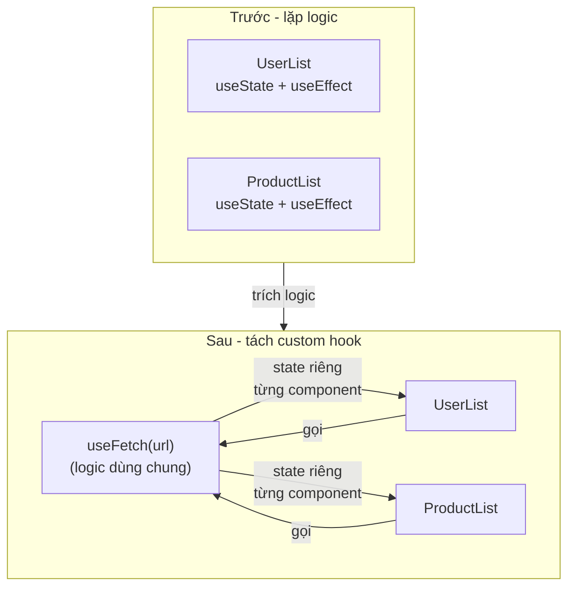
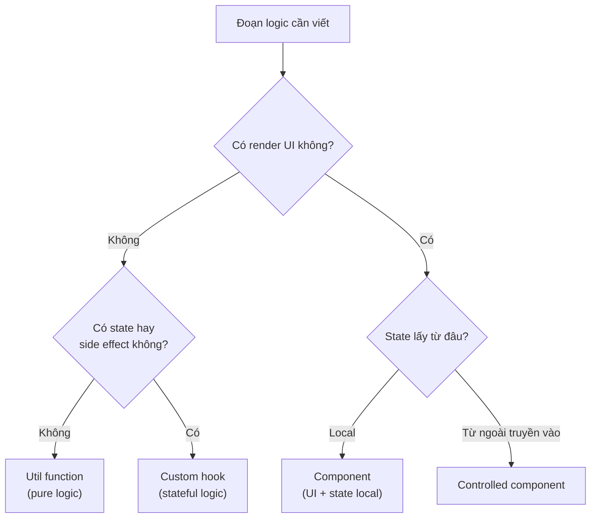

# Custom Hooks

**Custom hook** (hook tự viết) là một hàm JavaScript do bạn tự tạo, có tên bắt đầu bằng `use` và bên trong dùng lại các hook có sẵn của React. Mục đích là gom **logic** (đoạn xử lý) bị lặp lại ở nhiều component vào một chỗ để tái sử dụng, giúp code gọn gàng và dễ bảo trì hơn. Ví dụ bạn có thể viết `useFetch` để dùng lại logic gọi API ở nhiều nơi.

[](pathname:///img/react/custom-hooks.webp)

---

:::note[Ghi nhớ nhanh]

- ⭐ **Custom hook = function tên bắt đầu bằng `use`, gọi các hook khác bên trong** — để tái sử dụng logic stateful mà KHÔNG thêm tầng component bọc.
- ⭐ **Mỗi component gọi hook có state riêng độc lập** — muốn share state phải dùng Context hoặc state library (Zustand...).
- **Naming convention** — bắt đầu bằng `use` để ESLint áp Rules of Hooks; trả về tuple nếu ≤ 2 phần tử, object nếu nhiều hơn.
- **Ví dụ thường gặp** — `useDebounce`, `useLocalStorage`, `useFetch`, `usePrevious`, `useToggle`.
- **Phân biệt nơi đặt logic** — util function (pure), custom hook (stateful logic), component (UI + state).
- **Đừng tự viết lại hook phổ biến** — dùng thư viện sẵn có như usehooks-ts, react-use, ahooks.

:::

---

## Mục lục

- [Vì sao có custom hooks?](#vì-sao-có-custom-hooks)
- [Custom Hook là gì?](#custom-hook-là-gì)
- [Naming convention](#naming-convention)
- [Ví dụ thường gặp](#ví-dụ-thường-gặp)
- [Share state giữa các hook](#share-state-giữa-các-hook)
- [Best practices](#best-practices)
- [Câu hỏi phỏng vấn](#câu-hỏi-phỏng-vấn)

---

## Vì sao có custom hooks?

**Vấn đề:** Nhiều component lặp lại **cùng một logic stateful** — gọi API kèm `loading`/`error`, đọc/ghi localStorage, debounce, theo dõi kích thước cửa sổ. Copy-paste `useState` + `useEffect` khắp nơi → trùng lặp, sửa một chỗ phải sửa nhiều chỗ, khó bảo trì. Dùng HOC hay render props để chia sẻ thì lại thêm tầng component lồng nhau.

```jsx
// Component A — gọi API
function UserList() {
  const [data, setData] = useState(null);
  const [loading, setLoading] = useState(true);
  const [error, setError] = useState(null);

  useEffect(() => {
    fetch("/api/users")
      .then(r => r.json()).then(setData)
      .catch(setError)
      .finally(() => setLoading(false));
  }, []);
  // ...
}

// Component B — gọi API khác, LẶP LẠI y hệt logic trên
function ProductList() {
  const [data, setData] = useState(null);
  const [loading, setLoading] = useState(true);
  const [error, setError] = useState(null);

  useEffect(() => {
    fetch("/api/products")
      .then(r => r.json()).then(setData)
      .catch(setError)
      .finally(() => setLoading(false));
  }, []);
  // ...
}
```

**Giải pháp:** Tách logic dùng nhiều hook ra một **hàm bắt đầu bằng `use...`** — đó là custom hook. Nó **tái sử dụng logic mà KHÔNG thêm component bọc**, và mỗi component gọi hook đều có state riêng độc lập.

```jsx
function useFetch(url) {
  const [data, setData] = useState(null);
  const [loading, setLoading] = useState(true);
  const [error, setError] = useState(null);

  useEffect(() => {
    fetch(url)
      .then(r => r.json()).then(setData)
      .catch(setError)
      .finally(() => setLoading(false));
  }, [url]);

  return { data, loading, error };
}

// Hai component dùng lại — gọn, mỗi cái có state riêng
function UserList() {
  const { data, loading, error } = useFetch("/api/users");
}
function ProductList() {
  const { data, loading, error } = useFetch("/api/products");
}
```

Sơ đồ dưới đây mô tả việc trích logic lặp lại thành custom hook để dùng chung:



:::tip[Dùng thực tế]

- **`useFetch`** — gom `data` + `loading` + `error` cho mọi lời gọi API.
- **`useLocalStorage`** — đồng bộ state với localStorage, dùng lại ở nhiều màn hình.
- **`useDebounce`** — trì hoãn giá trị cho ô tìm kiếm, lọc danh sách.
- **`useWindowSize` / `useMediaQuery`** — theo dõi kích thước cửa sổ để render responsive.

:::

---

## Custom Hook là gì?

**Custom Hook** = function JS bắt đầu bằng `use*`, có thể gọi các hook
khác bên trong. Mục đích: **tái sử dụng logic** giữa nhiều component.

```jsx
function useCounter(initial = 0) {
  const [count, setCount] = useState(initial);
  const increment = () => setCount(c => c + 1);
  const decrement = () => setCount(c => c - 1);
  const reset = () => setCount(initial);

  return { count, increment, decrement, reset };
}

// Dùng
function App() {
  const { count, increment, decrement } = useCounter(10);

  return (
    <>
      <p>{count}</p>
      <button onClick={increment}>+</button>
      <button onClick={decrement}>-</button>
    </>
  );
}
```

---

## Naming convention

| Rule | Lý do |
|------|-------|
| Bắt đầu bằng `use` | Để ESLint biết áp dụng Rules of Hooks |
| `use<Noun>` cho data | `useUser`, `useTheme` |
| `use<Verb>` cho action | `useFetch`, `useDebounce` |

```jsx
// Đúng
function useUser() {}
function useDebounce(value, delay) {}
function useLocalStorage(key) {}

// Sai — ESLint sẽ không nhận ra là hook
function fetchUser() { useState(); } // không bắt đầu bằng `use`
```

---

## Ví dụ thường gặp

**`useDebounce`** — defer giá trị:

```jsx
function useDebounce(value, delay = 300) {
  const [debounced, setDebounced] = useState(value);

  useEffect(() => {
    const timer = setTimeout(() => setDebounced(value), delay);
    return () => clearTimeout(timer);
  }, [value, delay]);

  return debounced;
}

// Dùng — search input
function Search() {
  const [query, setQuery] = useState("");
  const debouncedQuery = useDebounce(query, 500);

  useEffect(() => {
    if (debouncedQuery) {
      search(debouncedQuery);
    }
  }, [debouncedQuery]);

  return <input value={query} onChange={e => setQuery(e.target.value)} />;
}
```

**`useLocalStorage`** — sync state với localStorage:

```jsx
function useLocalStorage(key, initial) {
  const [value, setValue] = useState(() => {
    try {
      const item = window.localStorage.getItem(key);
      return item ? JSON.parse(item) : initial;
    } catch {
      return initial;
    }
  });

  useEffect(() => {
    try {
      window.localStorage.setItem(key, JSON.stringify(value));
    } catch (err) {
      console.error(err);
    }
  }, [key, value]);

  return [value, setValue];
}

// Dùng
function Settings() {
  const [theme, setTheme] = useLocalStorage("theme", "light");
  return <button onClick={() => setTheme("dark")}>{theme}</button>;
}
```

**`useFetch`** — đơn giản (production nên dùng TanStack Query):

```jsx
function useFetch(url) {
  const [data, setData] = useState(null);
  const [error, setError] = useState(null);
  const [loading, setLoading] = useState(true);

  useEffect(() => {
    const ctrl = new AbortController();
    setLoading(true);
    setError(null);

    fetch(url, { signal: ctrl.signal })
      .then(r => {
        if (!r.ok) throw new Error(`HTTP ${r.status}`);
        return r.json();
      })
      .then(setData)
      .catch(err => {
        if (err.name !== "AbortError") setError(err);
      })
      .finally(() => setLoading(false));

    return () => ctrl.abort();
  }, [url]);

  return { data, error, loading };
}
```

**`usePrevious`** — track giá trị trước:

```jsx
function usePrevious(value) {
  const ref = useRef();

  useEffect(() => {
    ref.current = value;
  }, [value]);

  return ref.current;
}

function Counter() {
  const [count, setCount] = useState(0);
  const prevCount = usePrevious(count);

  return <p>Now: {count}, Before: {prevCount}</p>;
}
```

**`useToggle`** — boolean state:

```jsx
function useToggle(initial = false) {
  const [value, setValue] = useState(initial);
  const toggle = useCallback(() => setValue(v => !v), []);
  return [value, toggle, setValue];
}

function Modal() {
  const [isOpen, toggle] = useToggle();
  return (
    <>
      <button onClick={toggle}>{isOpen ? "Close" : "Open"}</button>
      {isOpen && <Dialog />}
    </>
  );
}
```

:::tip[Mẹo]

**Đừng tự viết lại các hook phổ biến** — đã có thư viện chất lượng cao:

| Thư viện | Có gì |
|----------|-------|
| **usehooks-ts** | 30+ hooks TS-first |
| **react-use** | 90+ hooks (hơi nặng) |
| **@uidotdev/usehooks** | Hooks chất lượng cao |
| **ahooks** | Của Alibaba, đầy đủ |

Cài và dùng:

```bash
npm install usehooks-ts
```

```jsx
import { useDebounce, useLocalStorage, useToggle } from "usehooks-ts";
```

Tự viết khi: cần custom hành vi, hoặc thư viện không có cái cần.

:::

---

## Share state giữa các hook

Custom hook **không tự share state** giữa nhiều component — mỗi component
gọi hook là một instance độc lập:

```jsx
function useCounter() {
  const [count, setCount] = useState(0);
  return { count, setCount };
}

function A() {
  const { count } = useCounter(); // count riêng cho A
}

function B() {
  const { count } = useCounter(); // count riêng cho B
}
```

Muốn share, dùng **Context** hoặc **state management library**:

```jsx
// Cách 1 — Context
const CounterContext = createContext();

function CounterProvider({ children }) {
  const [count, setCount] = useState(0);
  return (
    <CounterContext.Provider value={{ count, setCount }}>
      {children}
    </CounterContext.Provider>
  );
}

function useCounter() {
  return useContext(CounterContext);
}

// Cách 2 — Zustand
import { create } from "zustand";

const useCounterStore = create((set) => ({
  count: 0,
  increment: () => set(s => ({ count: s.count + 1 })),
}));

// Dùng — share state tự nhiên
function A() {
  const count = useCounterStore(s => s.count);
}
```

---

## Best practices

**1. Hook nên có 1 trách nhiệm rõ ràng:**

```jsx
// Tệ — làm quá nhiều
function useEverything() {
  // fetch + form + theme + auth
}

// Tốt — chia nhỏ
function useUser() { /* auth */ }
function useTheme() { /* theme */ }
function useForm() { /* form */ }
```

**2. Hook trả về object hoặc tuple — chọn theo số lượng:**

```jsx
// Tuple — 2 phần tử cố định (giống useState)
function useToggle() {
  return [value, toggle]; // user destructure tên tùy ý
}
const [isOpen, toggleOpen] = useToggle();
const [isDark, toggleDark] = useToggle();

// Object — > 2 phần tử
function useUser() {
  return { user, login, logout, isLoading };
}
const { user, login } = useUser();
```

**3. Memoize giá trị nếu user dùng làm dep:**

```jsx
function useUser() {
  const [user, setUser] = useState(null);

  // Tệ — function mới mỗi render
  const logout = () => setUser(null);

  // Tốt — useCallback
  const logout = useCallback(() => setUser(null), []);

  return { user, logout };
}
```

**4. Type rõ ràng (TypeScript):**

```tsx
interface UseFetchResult<T> {
  data: T | null;
  error: Error | null;
  loading: boolean;
  refetch: () => void;
}

function useFetch<T>(url: string): UseFetchResult<T> {
  // ...
}

// Dùng — TS infer được type
const { data } = useFetch<User>("/api/user"); // data: User | null
```

:::info[Phân tích]

**Custom hook là cốt lõi của "logic reuse" trong React.** Nguyên tắc:

- **Component** = render logic + state.
- **Custom hook** = stateful logic không phải UI.
- **Util function** = pure logic không có state.

Sơ đồ quyết định nên đặt logic vào đâu:



Khi viết code:

1. Logic pure → util function.
2. Logic có state + side effect → custom hook.
3. UI + state local → component.
4. UI nhận state từ ngoài → controlled component.

Phân biệt rõ 4 loại giúp codebase scale tốt — mỗi file 1 trách nhiệm,
dễ test, dễ refactor.

:::

---

## Câu hỏi phỏng vấn

Những câu thường gặp về chủ đề này. Tự trả lời trước, rồi bấm **Xem đáp án** để đối chiếu.

**1. Custom hook là gì? Vì sao tên bắt buộc phải bắt đầu bằng `use`, và chuyện gì xảy ra nếu đặt tên là `getSomething`?**

<details className="qa">
<summary>Xem đáp án</summary>

**Custom hook** là một function JavaScript bình thường, tên bắt đầu bằng `use`, bên trong có gọi các hook có sẵn của React (`useState`, `useEffect`, `useRef`...). Mục đích là gom **logic stateful** bị lặp lại vào một chỗ để tái sử dụng, mà **không thêm tầng component bọc** như HOC hay render props.

Tiền tố `use` là **quy ước** để công cụ nhận diện: plugin `eslint-plugin-react-hooks` dựa vào tên để biết đây là hook và áp **Rules of Hooks** cho nó (không gọi trong điều kiện/vòng lặp, chỉ gọi từ component hoặc hook khác).

Nếu đặt tên `getSomething` mà bên trong vẫn gọi `useState`:

```jsx
function getUser() {
  const [user, setUser] = useState(null); // ESLint không kiểm tra
  return user;
}
```

React **vẫn chạy** (React không đọc tên hàm), nhưng ESLint mất khả năng cảnh báo — bạn có thể vô tình gọi `getUser()` trong `if` và làm lệch thứ tự hook, gây bug rất khó truy.

</details>

**2. Custom hook khác util function thuần ở điểm nào? Khi nào chỉ cần hàm thường là đủ?**

<details className="qa">
<summary>Xem đáp án</summary>

Bài đã phân ba loại rõ ràng:

| | Util function | Custom hook |
|---|---|---|
| Có gọi hook React bên trong? | Không | Có (`useState`, `useEffect`...) |
| Có state / side effect? | Không, pure | Có |
| Ràng buộc Rules of Hooks | Không | Có |
| Gọi ở đâu cũng được? | Được (cả ngoài React) | Chỉ trong component hoặc hook khác |
| Test | Gọi trực tiếp | Cần `renderHook` |

**Chỉ cần hàm thường khi** logic là *pure* — vào cái gì ra cái đó, không giữ trạng thái, không đụng tới vòng đời component: format ngày, validate email, sort mảng, tính tổng giỏ hàng.

```js
// Util — không cần là hook
export function formatPrice(v) {
  return v.toLocaleString("vi-VN") + "đ";
}
```

Biến nó thành hook chỉ làm nó khó dùng lại hơn (không gọi được ngoài component). Nguyên tắc: **pure → util, stateful → hook, có UI → component**.

</details>

**3. Hai component cùng gọi `useCounter()` có dùng chung state không? Giải thích cơ chế isolation của state trong custom hook.**

<details className="qa">
<summary>Xem đáp án</summary>

**Không.** Mỗi component gọi hook là một **instance độc lập**:

```jsx
function useCounter() {
  const [count, setCount] = useState(0);
  return { count, setCount };
}

function A() { const { count } = useCounter(); } // count riêng của A
function B() { const { count } = useCounter(); } // count riêng của B
```

Lý do: custom hook chỉ là **code được nội suy vào** component gọi nó. State thực ra không nằm trong hook, mà nằm trong **fiber node của component** — React lưu một danh sách hook cho mỗi instance component và duyệt theo thứ tự gọi. Gọi `useCounter()` trong `A` nghĩa là `useState(0)` bên trong đăng ký một ô nhớ trên fiber của `A`; gọi trong `B` thì đăng ký ô nhớ trên fiber của `B`.

Vậy custom hook chia sẻ **logic**, không chia sẻ **state**. Ngay cả khi cùng một component gọi `useCounter()` hai lần cũng ra hai state tách biệt.

</details>

**4. Muốn chia sẻ THẬT sự cùng một state giữa nhiều component thì làm thế nào? Custom hook một mình có đủ không?**

<details className="qa">
<summary>Xem đáp án</summary>

Custom hook **một mình không đủ** — nó chỉ tái sử dụng logic, mỗi nơi gọi vẫn có state riêng. Muốn nhiều component nhìn thấy **cùng một giá trị**, state phải nằm ở một chỗ duy nhất bên ngoài các component đó:

- **Lift state up** — đưa state lên component cha chung, truyền xuống qua props. Đơn giản nhất, hợp khi cây component nông.
- **Context** — đặt state trong một Provider, các con đọc bằng `useContext`. Thường bọc lại thành custom hook cho gọn:

```jsx
const CounterContext = createContext();

function CounterProvider({ children }) {
  const [count, setCount] = useState(0);
  return (
    <CounterContext.Provider value={{ count, setCount }}>
      {children}
    </CounterContext.Provider>
  );
}

function useCounter() { return useContext(CounterContext); }
```

- **State library** (Zustand, Redux, Jotai) — store nằm ngoài React, component subscribe vào; không cần Provider bọc, và chọn lọc được phần state cần đọc nên ít re-render thừa.

Mẫu phổ biến: store/Context ở dưới, custom hook làm lớp API sạch ở trên.

</details>

**5. Custom hook nên trả về array hay object? Tiêu chí chọn là gì?**

<details className="qa">
<summary>Xem đáp án</summary>

Tiêu chí chính là **số lượng giá trị trả về và nhu cầu đặt lại tên**.

**Tuple (array)** — dùng khi có **≤ 2 giá trị cố định**, và người dùng thường muốn tự đặt tên. Giống `useState`:

```jsx
function useToggle(initial = false) {
  const [value, setValue] = useState(initial);
  const toggle = useCallback(() => setValue(v => !v), []);
  return [value, toggle, setValue];
}

const [isOpen, toggleOpen] = useToggle();
const [isDark, toggleDark] = useToggle(); // đổi tên thoải mái
```

**Object** — dùng khi có **nhiều hơn 2 giá trị**, hoặc một số giá trị là tùy chọn:

```jsx
function useFetch(url) {
  return { data, error, loading, refetch };
}
const { data, loading } = useFetch("/api/users"); // lấy đúng cái cần
```

Ưu điểm object: không phụ thuộc thứ tự, bỏ qua được field không dùng, thêm field mới không phá code cũ. Nhược: tên cố định, muốn đổi phải `const { data: users } = ...`.

</details>

**6. So sánh custom hook với HOC và render props — hooks giải quyết được vấn đề gì mà hai pattern kia gặp phải?**

<details className="qa">
<summary>Xem đáp án</summary>

Cả ba đều để **tái sử dụng logic stateful**, nhưng hai pattern cũ phải mượn *component* làm phương tiện:

| | HOC | Render props | Custom hook |
|---|---|---|---|
| Cách dùng | `withAuth(Component)` | `<Fetch render={...} />` | `const x = useAuth()` |
| Thêm tầng component? | Có | Có | Không |
| Lồng nhiều logic | Bọc chồng nhau | JSX lồng sâu | Gọi nhiều dòng liên tiếp |
| Nguồn gốc props/giá trị | Khó lần ra | Rõ hơn | Rõ ràng, tường minh |
| Xung đột tên | Props dễ đè nhau | Ít | Tự đặt tên khi destructure |

Vấn đề kinh điển của HOC là **"wrapper hell"** — React DevTools đầy `withRouter(withTheme(withAuth(Page)))`, và props từ đâu ra thì không rõ; render props thì gây **"pyramid of doom"** JSX lồng nhiều tầng.

Hook gộp ba logic chỉ là ba dòng phẳng:

```jsx
const user = useAuth();
const theme = useTheme();
const { data } = useFetch("/api/x");
```

Không thêm node nào vào cây, dễ đọc, dễ compose.

</details>

**7. Thiết kế `useDebounce(value, delay)`: cần state gì, effect gì, cleanup gì? Nếu thiếu cleanup thì bug ra sao?**

<details className="qa">
<summary>Xem đáp án</summary>

Cần một state giữ **giá trị đã trì hoãn**, một effect đặt `setTimeout`, và cleanup `clearTimeout`:

```jsx
function useDebounce(value, delay = 300) {
  const [debounced, setDebounced] = useState(value);

  useEffect(() => {
    const timer = setTimeout(() => setDebounced(value), delay);
    return () => clearTimeout(timer); // huỷ timer cũ
  }, [value, delay]);

  return debounced;
}
```

Cơ chế: mỗi khi `value` đổi, React chạy cleanup của lần trước (huỷ timer đang chờ) rồi mới đặt timer mới. Chỉ khi người dùng **ngừng gõ** đủ `delay` ms thì timer mới sống sót và `setDebounced` chạy.

**Thiếu cleanup:** gõ "hello" 5 ký tự sẽ tạo 5 timer, không cái nào bị huỷ → sau `delay` ms cả 5 lần lượt bắn ra, `debounced` nhảy qua "h", "he", "hel"... Tức là **debounce mất tác dụng hoàn toàn**, vẫn gọi API 5 lần. Thêm nữa, timer còn treo sau khi component unmount sẽ set state lên component đã chết.

</details>

**8. Thiết kế `usePrevious(value)`: vì sao phải dùng `useRef` chứ không phải `useState`, và cập nhật ref ở chỗ nào?**

<details className="qa">
<summary>Xem đáp án</summary>

```jsx
function usePrevious(value) {
  const ref = useRef();

  useEffect(() => {
    ref.current = value; // cập nhật SAU khi render xong
  }, [value]);

  return ref.current; // giá trị của lần render trước
}
```

**Vì sao `useRef` chứ không `useState`:** gán `ref.current` **không trigger re-render**. Nếu dùng `useState` thì mỗi lần lưu giá trị cũ lại kích hoạt một render mới, render đó lại lưu tiếp → **vòng lặp vô tận** (hoặc ít nhất là render thừa gấp đôi). Ref chính là "ô nhớ bền qua các lần render mà không tham gia vào render".

**Cập nhật ở đâu:** phải đặt trong `useEffect`, tức **sau khi render đã commit**. Trong lượt render hiện tại, `ref.current` vẫn giữ giá trị từ lượt trước — đó chính là thứ ta cần trả về. Nếu gán thẳng trong thân component (`ref.current = value` rồi `return ref.current`) thì luôn nhận lại giá trị hiện tại, hook mất ý nghĩa.

</details>

**9. Thiết kế `useLocalStorage(key, initial)`: cần xử lý những edge case nào (JSON parse lỗi, SSR không có `window`, đồng bộ giữa nhiều tab)?**

<details className="qa">
<summary>Xem đáp án</summary>

Các edge case chính:

- **JSON hỏng / giá trị rác** — `JSON.parse` ném lỗi, phải bọc `try/catch` và fallback về `initial`.
- **SSR** — trên server không có `window`, đọc thẳng sẽ crash. Phải kiểm tra `typeof window === "undefined"` và trả `initial`; lưu ý điều này có thể gây hydration mismatch, nên nhiều hook chỉ đọc localStorage trong `useEffect` sau khi mount.
- **Lazy initializer** — truyền hàm vào `useState(() => ...)` để chỉ đọc localStorage một lần, không đọc lại mỗi render.
- **Quota / chế độ riêng tư** — `setItem` có thể ném `QuotaExceededError`, cần `try/catch`.
- **Nhiều tab** — localStorage dùng chung giữa các tab nhưng React không tự biết. Lắng nghe sự kiện `storage` để đồng bộ.

```jsx
useEffect(() => {
  const onStorage = (e) => {
    if (e.key === key) setValue(JSON.parse(e.newValue));
  };
  window.addEventListener("storage", onStorage);
  return () => window.removeEventListener("storage", onStorage);
}, [key]);
```

Lưu ý sự kiện `storage` chỉ bắn ở **tab khác**, không bắn ở tab vừa ghi.

</details>

**10. Thiết kế `useFetch(url)`: làm sao tránh race condition và tránh set state sau khi component đã unmount?**

<details className="qa">
<summary>Xem đáp án</summary>

**Race condition** xảy ra khi `url` đổi nhanh: request cũ trả về *sau* request mới, ghi đè dữ liệu đúng bằng dữ liệu cũ. Hai cách xử lý, đều đặt trong cleanup của effect:

```jsx
useEffect(() => {
  const ctrl = new AbortController();
  setLoading(true);
  setError(null);

  fetch(url, { signal: ctrl.signal })
    .then(r => {
      if (!r.ok) throw new Error(`HTTP ${r.status}`);
      return r.json();
    })
    .then(setData)
    .catch(err => { if (err.name !== "AbortError") setError(err); })
    .finally(() => setLoading(false));

  return () => ctrl.abort(); // huỷ request cũ khi url đổi / unmount
}, [url]);
```

- **`AbortController`** — huỷ hẳn request cũ; nhớ bỏ qua `AbortError` để không hiện lỗi giả.
- **Cờ `ignore`** — biến cục bộ `let ignore = false`, cleanup đặt `ignore = true`, callback chỉ set state khi `!ignore`. Cách này chính React docs khuyến nghị và cũng chặn luôn việc set state sau unmount.

Production nên dùng TanStack Query — đã lo sẵn cache, dedupe, retry.

</details>

**11. Custom hook có được gọi có điều kiện không? Rules of Hooks áp dụng cho custom hook như thế nào?**

<details className="qa">
<summary>Xem đáp án</summary>

**Không.** Custom hook phải tuân thủ Rules of Hooks **y hệt hook built-in**, vì bên trong nó cũng gọi `useState`/`useEffect`:

- Chỉ gọi ở **top level** — không trong `if`, vòng lặp, hàm lồng, sau câu lệnh `return` sớm.
- Chỉ gọi từ **function component** hoặc **custom hook khác**, không gọi trong hàm thường hay event handler.

```jsx
// Sai — số hook thay đổi giữa các render
if (isLoggedIn) {
  const user = useUser(); // 💥
}

// Đúng — luôn gọi, xử lý điều kiện bên trong hook
const user = useUser(isLoggedIn);
```

Lý do: React nhận diện hook theo **thứ tự gọi** trên mỗi lần render, không theo tên. Gọi có điều kiện làm thứ tự lệch, state của hook này bị gán nhầm sang hook khác.

Đây cũng chính là lý do tên phải bắt đầu bằng `use` — ESLint dựa vào tên để biết `useUser()` là hook và bắt lỗi khi nó nằm trong `if`.

</details>

**12. Làm sao viết test cho một custom hook? Vai trò của `renderHook` và `act` trong React Testing Library.**

<details className="qa">
<summary>Xem đáp án</summary>

Hook không gọi trực tiếp được ngoài component, nên cần `renderHook` — nó dựng một component rỗng chỉ để chạy hook và trả về `result` chứa giá trị hook trả ra.

```jsx
import { renderHook, act } from "@testing-library/react";

test("useCounter tăng được", () => {
  const { result } = renderHook(() => useCounter(10));
  expect(result.current.count).toBe(10);

  act(() => { result.current.increment(); });
  expect(result.current.count).toBe(11);
});
```

- **`renderHook`** — mount hook, trả về `result.current` (giá trị mới nhất), `rerender` (render lại với props khác, để test khi dependency đổi) và `unmount` (test cleanup).
- **`act`** — bọc mọi thao tác gây cập nhật state, đảm bảo React xử lý xong update và chạy effect trước khi assert. Không bọc `act` thì `result.current` có thể còn là giá trị cũ, và React sẽ cảnh báo.

Với hook gọi API, `fetch` nên được mock; với hook cần Context, truyền `wrapper` là Provider.

</details>

**13. Đoán hành vi: một custom hook nhận object `options` được tạo mới ở mỗi render và dùng nó làm dependency của effect bên trong — chuyện gì xảy ra và sửa thế nào?**

<details className="qa">
<summary>Xem đáp án</summary>

Effect chạy lại **sau mỗi lần render** — và nếu effect có set state thì thành **vòng lặp vô tận**. Nguyên nhân: dependency được so sánh bằng `Object.is` (so sánh tham chiếu). Object literal tạo mới mỗi render luôn khác tham chiếu cũ, dù nội dung y hệt.

```jsx
function Search() {
  // object mới mỗi render → dep luôn "đổi"
  const data = useFetchWithOptions("/api", { retry: 3 });
}

function useFetchWithOptions(url, options) {
  useEffect(() => { fetch(url, options); }, [url, options]); // 💥 chạy mãi
}
```

Cách sửa:

- **Memo hoá ở phía người gọi**: ``const options = useMemo(() => ({ retry: 3 }), [])``.
- **Đưa hằng số ra ngoài component** nếu nó không phụ thuộc props/state.
- **Tách dep thành primitive** trong hook: `[url, options.retry, options.timeout]` — số/chuỗi so sánh theo giá trị nên ổn định.
- **Giữ trong ref** khi options chỉ cần đọc lúc effect chạy, không cần trigger lại.

Cách bền nhất là thiết kế API hook nhận primitive thay vì object.

</details>

**14. Dấu hiệu nào cho thấy một custom hook đã quá to và cần tách nhỏ? Nguyên tắc chia là gì?**

<details className="qa">
<summary>Xem đáp án</summary>

Dấu hiệu nhận biết:

- Tên hook mơ hồ, phải dùng "và" để mô tả (`useUserAndThemeAndForm`).
- Trả về quá nhiều giá trị không liên quan tới nhau.
- Chứa nhiều `useEffect` với các mảng dependency hoàn toàn khác nhau, mỗi effect lo một chuyện.
- Nhận cờ điều kiện (`useData(type)` rồi bên trong `if` rẽ nhánh xử lý khác hẳn).
- Component chỉ dùng 2 trong 8 thứ hook trả về.
- Test phải mock rất nhiều thứ mới chạy được.

**Nguyên tắc chia:** mỗi hook **một trách nhiệm rõ ràng** — đúng như bài đã nêu:

```jsx
// Tệ
function useEverything() { /* fetch + form + theme + auth */ }

// Tốt
function useUser() { /* auth */ }
function useTheme() { /* theme */ }
function useForm() { /* form */ }
```

Chia theo **mối quan tâm (concern)**, không chia theo số dòng. Sau khi tách, có thể compose lại: một hook cấp cao gọi nhiều hook nhỏ — vẫn gọn cho người dùng mà từng mảnh vẫn test được độc lập.

</details>

**15. Khi nào nên tự viết custom hook, khi nào nên dùng thư viện sẵn có như usehooks-ts, react-use hay TanStack Query?**

<details className="qa">
<summary>Xem đáp án</summary>

**Dùng thư viện khi** bài toán là **phổ biến và đã được giải kỹ**:

- `useDebounce`, `useLocalStorage`, `useMediaQuery`, `useOnClickOutside`... → usehooks-ts, `@uidotdev/usehooks`, react-use, ahooks. Chúng đã xử lý sẵn SSR, cleanup, edge case mà hook tự viết hay bỏ sót.
- **Data fetching** → TanStack Query (hoặc SWR). `useFetch` tự viết chỉ đủ dùng cho ví dụ; production cần cache, dedupe request trùng, retry, refetch on focus, pagination, optimistic update, invalidation — viết lại đủ những thứ này là viết lại cả một thư viện.

**Tự viết khi:**

- Logic gắn với **nghiệp vụ riêng** của dự án (`useCart`, `usePermission`, `useCheckoutFlow`) — không thư viện nào có.
- Cần hành vi **tuỳ biến** mà thư viện không hỗ trợ.
- Hook cực ngắn (`useToggle` vài dòng) mà không muốn thêm dependency.

Cân nhắc thêm: kích thước bundle, mức độ bảo trì của thư viện, và khả năng tree-shaking.

</details>
