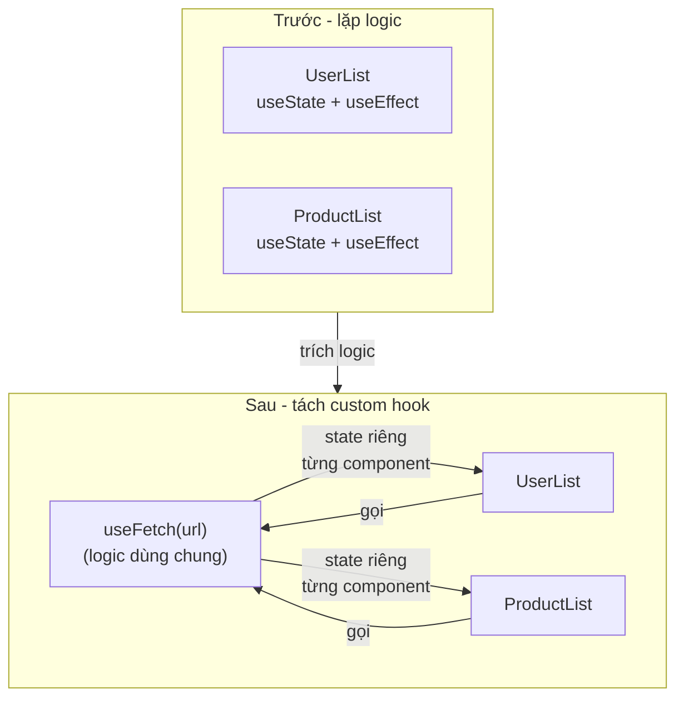
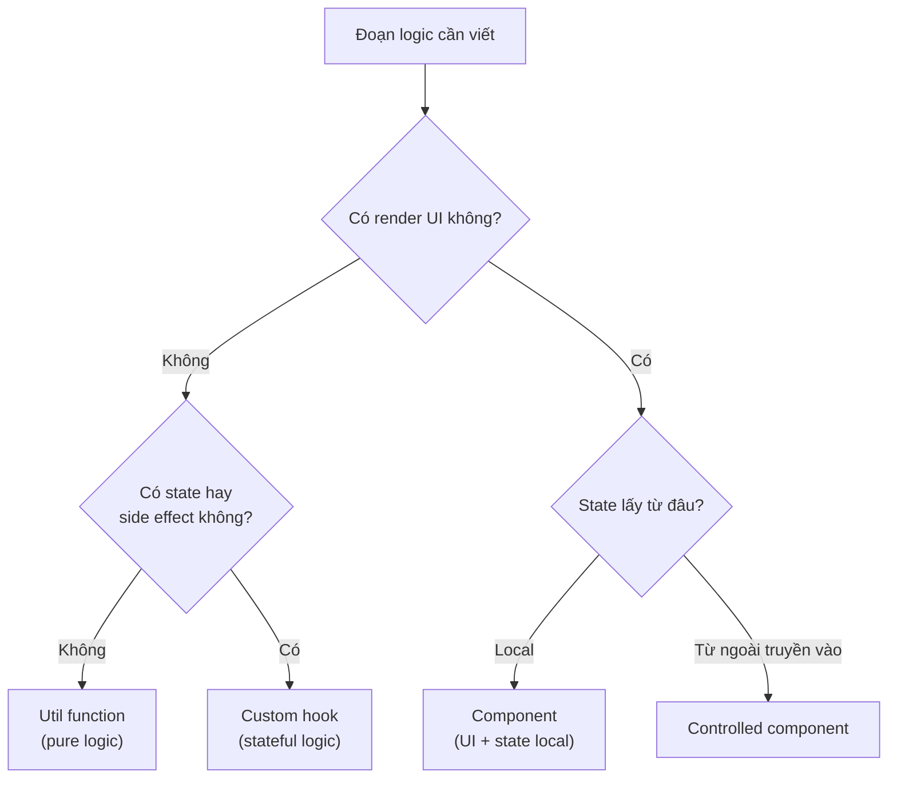

# Custom Hooks

**Custom hook** (hook tự viết) là một hàm JavaScript do bạn tự tạo, có tên bắt đầu bằng `use` và bên trong dùng lại các hook có sẵn của React. Mục đích là gom **logic** (đoạn xử lý) bị lặp lại ở nhiều component vào một chỗ để tái sử dụng, giúp code gọn gàng và dễ bảo trì hơn. Ví dụ bạn có thể viết `useFetch` để dùng lại logic gọi API ở nhiều nơi.

---

:::note[Ghi nhớ nhanh]

- ⭐ **Custom hook = function tên bắt đầu bằng `use`, gọi các hook khác bên trong** — để tái sử dụng logic stateful mà KHÔNG thêm tầng component bọc.
- ⭐ **Mỗi component gọi hook có state riêng độc lập** — muốn share state phải dùng Context hoặc state library (Zustand...).
- **Naming convention** — bắt đầu bằng `use` để ESLint áp Rules of Hooks; trả về tuple nếu ≤ 2 phần tử, object nếu nhiều hơn.
- **Ví dụ thường gặp** — `useDebounce`, `useLocalStorage`, `useFetch`, `usePrevious`, `useToggle`.
- **Phân biệt nơi đặt logic** — util function (pure), custom hook (stateful logic), component (UI + state).
- **Đừng tự viết lại hook phổ biến** — dùng thư viện sẵn có như usehooks-ts, react-use, ahooks.

:::

---

## Mục lục

- [Vì sao có custom hooks?](#vì-sao-có-custom-hooks)
- [Custom Hook là gì?](#custom-hook-là-gì)
- [Naming convention](#naming-convention)
- [Ví dụ thường gặp](#ví-dụ-thường-gặp)
- [Share state giữa các hook](#share-state-giữa-các-hook)
- [Best practices](#best-practices)
- [Câu hỏi phỏng vấn](#câu-hỏi-phỏng-vấn)

---

## Vì sao có custom hooks?

**Vấn đề:** Nhiều component lặp lại **cùng một logic stateful** — gọi API kèm `loading`/`error`, đọc/ghi localStorage, debounce, theo dõi kích thước cửa sổ. Copy-paste `useState` + `useEffect` khắp nơi → trùng lặp, sửa một chỗ phải sửa nhiều chỗ, khó bảo trì. Dùng HOC hay render props để chia sẻ thì lại thêm tầng component lồng nhau.

```jsx
// Component A — gọi API
function UserList() {
  const [data, setData] = useState(null);
  const [loading, setLoading] = useState(true);
  const [error, setError] = useState(null);

  useEffect(() => {
    fetch("/api/users")
      .then(r => r.json()).then(setData)
      .catch(setError)
      .finally(() => setLoading(false));
  }, []);
  // ...
}

// Component B — gọi API khác, LẶP LẠI y hệt logic trên
function ProductList() {
  const [data, setData] = useState(null);
  const [loading, setLoading] = useState(true);
  const [error, setError] = useState(null);

  useEffect(() => {
    fetch("/api/products")
      .then(r => r.json()).then(setData)
      .catch(setError)
      .finally(() => setLoading(false));
  }, []);
  // ...
}
```

**Giải pháp:** Tách logic dùng nhiều hook ra một **hàm bắt đầu bằng `use...`** — đó là custom hook. Nó **tái sử dụng logic mà KHÔNG thêm component bọc**, và mỗi component gọi hook đều có state riêng độc lập.

```jsx
function useFetch(url) {
  const [data, setData] = useState(null);
  const [loading, setLoading] = useState(true);
  const [error, setError] = useState(null);

  useEffect(() => {
    fetch(url)
      .then(r => r.json()).then(setData)
      .catch(setError)
      .finally(() => setLoading(false));
  }, [url]);

  return { data, loading, error };
}

// Hai component dùng lại — gọn, mỗi cái có state riêng
function UserList() {
  const { data, loading, error } = useFetch("/api/users");
}
function ProductList() {
  const { data, loading, error } = useFetch("/api/products");
}
```

Sơ đồ dưới đây mô tả việc trích logic lặp lại thành custom hook để dùng chung:



:::tip[Dùng thực tế]

- **`useFetch`** — gom `data` + `loading` + `error` cho mọi lời gọi API.
- **`useLocalStorage`** — đồng bộ state với localStorage, dùng lại ở nhiều màn hình.
- **`useDebounce`** — trì hoãn giá trị cho ô tìm kiếm, lọc danh sách.
- **`useWindowSize` / `useMediaQuery`** — theo dõi kích thước cửa sổ để render responsive.

:::

---

## Custom Hook là gì?

**Custom Hook** = function JS bắt đầu bằng `use*`, có thể gọi các hook
khác bên trong. Mục đích: **tái sử dụng logic** giữa nhiều component.

```jsx
function useCounter(initial = 0) {
  const [count, setCount] = useState(initial);
  const increment = () => setCount(c => c + 1);
  const decrement = () => setCount(c => c - 1);
  const reset = () => setCount(initial);

  return { count, increment, decrement, reset };
}

// Dùng
function App() {
  const { count, increment, decrement } = useCounter(10);

  return (
    <>
      <p>{count}</p>
      <button onClick={increment}>+</button>
      <button onClick={decrement}>-</button>
    </>
  );
}
```

---

## Naming convention

| Rule | Lý do |
|------|-------|
| Bắt đầu bằng `use` | Để ESLint biết áp dụng Rules of Hooks |
| `use<Noun>` cho data | `useUser`, `useTheme` |
| `use<Verb>` cho action | `useFetch`, `useDebounce` |

```jsx
// Đúng
function useUser() {}
function useDebounce(value, delay) {}
function useLocalStorage(key) {}

// Sai — ESLint sẽ không nhận ra là hook
function fetchUser() { useState(); } // không bắt đầu bằng `use`
```

---

## Ví dụ thường gặp

**`useDebounce`** — defer giá trị:

```jsx
function useDebounce(value, delay = 300) {
  const [debounced, setDebounced] = useState(value);

  useEffect(() => {
    const timer = setTimeout(() => setDebounced(value), delay);
    return () => clearTimeout(timer);
  }, [value, delay]);

  return debounced;
}

// Dùng — search input
function Search() {
  const [query, setQuery] = useState("");
  const debouncedQuery = useDebounce(query, 500);

  useEffect(() => {
    if (debouncedQuery) {
      search(debouncedQuery);
    }
  }, [debouncedQuery]);

  return <input value={query} onChange={e => setQuery(e.target.value)} />;
}
```

**`useLocalStorage`** — sync state với localStorage:

```jsx
function useLocalStorage(key, initial) {
  const [value, setValue] = useState(() => {
    try {
      const item = window.localStorage.getItem(key);
      return item ? JSON.parse(item) : initial;
    } catch {
      return initial;
    }
  });

  useEffect(() => {
    try {
      window.localStorage.setItem(key, JSON.stringify(value));
    } catch (err) {
      console.error(err);
    }
  }, [key, value]);

  return [value, setValue];
}

// Dùng
function Settings() {
  const [theme, setTheme] = useLocalStorage("theme", "light");
  return <button onClick={() => setTheme("dark")}>{theme}</button>;
}
```

**`useFetch`** — đơn giản (production nên dùng TanStack Query):

```jsx
function useFetch(url) {
  const [data, setData] = useState(null);
  const [error, setError] = useState(null);
  const [loading, setLoading] = useState(true);

  useEffect(() => {
    const ctrl = new AbortController();
    setLoading(true);
    setError(null);

    fetch(url, { signal: ctrl.signal })
      .then(r => {
        if (!r.ok) throw new Error(`HTTP ${r.status}`);
        return r.json();
      })
      .then(setData)
      .catch(err => {
        if (err.name !== "AbortError") setError(err);
      })
      .finally(() => setLoading(false));

    return () => ctrl.abort();
  }, [url]);

  return { data, error, loading };
}
```

**`usePrevious`** — track giá trị trước:

```jsx
function usePrevious(value) {
  const ref = useRef();

  useEffect(() => {
    ref.current = value;
  }, [value]);

  return ref.current;
}

function Counter() {
  const [count, setCount] = useState(0);
  const prevCount = usePrevious(count);

  return <p>Now: {count}, Before: {prevCount}</p>;
}
```

**`useToggle`** — boolean state:

```jsx
function useToggle(initial = false) {
  const [value, setValue] = useState(initial);
  const toggle = useCallback(() => setValue(v => !v), []);
  return [value, toggle, setValue];
}

function Modal() {
  const [isOpen, toggle] = useToggle();
  return (
    <>
      <button onClick={toggle}>{isOpen ? "Close" : "Open"}</button>
      {isOpen && <Dialog />}
    </>
  );
}
```

:::tip[Mẹo]

**Đừng tự viết lại các hook phổ biến** — đã có thư viện chất lượng cao:

| Thư viện | Có gì |
|----------|-------|
| **usehooks-ts** | 30+ hooks TS-first |
| **react-use** | 90+ hooks (hơi nặng) |
| **@uidotdev/usehooks** | Hooks chất lượng cao |
| **ahooks** | Của Alibaba, đầy đủ |

Cài và dùng:

```bash
npm install usehooks-ts
```

```jsx
import { useDebounce, useLocalStorage, useToggle } from "usehooks-ts";
```

Tự viết khi: cần custom hành vi, hoặc thư viện không có cái cần.

:::

---

## Share state giữa các hook

Custom hook **không tự share state** giữa nhiều component — mỗi component
gọi hook là một instance độc lập:

```jsx
function useCounter() {
  const [count, setCount] = useState(0);
  return { count, setCount };
}

function A() {
  const { count } = useCounter(); // count riêng cho A
}

function B() {
  const { count } = useCounter(); // count riêng cho B
}
```

Muốn share, dùng **Context** hoặc **state management library**:

```jsx
// Cách 1 — Context
const CounterContext = createContext();

function CounterProvider({ children }) {
  const [count, setCount] = useState(0);
  return (
    <CounterContext.Provider value={{ count, setCount }}>
      {children}
    </CounterContext.Provider>
  );
}

function useCounter() {
  return useContext(CounterContext);
}

// Cách 2 — Zustand
import { create } from "zustand";

const useCounterStore = create((set) => ({
  count: 0,
  increment: () => set(s => ({ count: s.count + 1 })),
}));

// Dùng — share state tự nhiên
function A() {
  const count = useCounterStore(s => s.count);
}
```

---

## Best practices

**1. Hook nên có 1 trách nhiệm rõ ràng:**

```jsx
// Tệ — làm quá nhiều
function useEverything() {
  // fetch + form + theme + auth
}

// Tốt — chia nhỏ
function useUser() { /* auth */ }
function useTheme() { /* theme */ }
function useForm() { /* form */ }
```

**2. Hook trả về object hoặc tuple — chọn theo số lượng:**

```jsx
// Tuple — 2 phần tử cố định (giống useState)
function useToggle() {
  return [value, toggle]; // user destructure tên tùy ý
}
const [isOpen, toggleOpen] = useToggle();
const [isDark, toggleDark] = useToggle();

// Object — > 2 phần tử
function useUser() {
  return { user, login, logout, isLoading };
}
const { user, login } = useUser();
```

**3. Memoize giá trị nếu user dùng làm dep:**

```jsx
function useUser() {
  const [user, setUser] = useState(null);

  // Tệ — function mới mỗi render
  const logout = () => setUser(null);

  // Tốt — useCallback
  const logout = useCallback(() => setUser(null), []);

  return { user, logout };
}
```

**4. Type rõ ràng (TypeScript):**

```tsx
interface UseFetchResult<T> {
  data: T | null;
  error: Error | null;
  loading: boolean;
  refetch: () => void;
}

function useFetch<T>(url: string): UseFetchResult<T> {
  // ...
}

// Dùng — TS infer được type
const { data } = useFetch<User>("/api/user"); // data: User | null
```

:::info[Phân tích]

**Custom hook là cốt lõi của "logic reuse" trong React.** Nguyên tắc:

- **Component** = render logic + state.
- **Custom hook** = stateful logic không phải UI.
- **Util function** = pure logic không có state.

Sơ đồ quyết định nên đặt logic vào đâu:



Khi viết code:

1. Logic pure → util function.
2. Logic có state + side effect → custom hook.
3. UI + state local → component.
4. UI nhận state từ ngoài → controlled component.

Phân biệt rõ 4 loại giúp codebase scale tốt — mỗi file 1 trách nhiệm,
dễ test, dễ refactor.

:::

---

## Câu hỏi phỏng vấn

Những câu thường gặp về chủ đề này. Tự trả lời trước, rồi đối chiếu lại với nội dung phía trên.

1. Custom hook là gì? Vì sao tên bắt buộc phải bắt đầu bằng `use`, và chuyện gì xảy ra nếu đặt tên là `getSomething`?
2. Custom hook khác util function thuần ở điểm nào? Khi nào chỉ cần hàm thường là đủ?
3. Hai component cùng gọi `useCounter()` có dùng chung state không? Giải thích cơ chế isolation của state trong custom hook.
4. Muốn chia sẻ THẬT sự cùng một state giữa nhiều component thì làm thế nào? Custom hook một mình có đủ không?
5. Custom hook nên trả về array hay object? Tiêu chí chọn là gì?
6. So sánh custom hook với HOC và render props — hooks giải quyết được vấn đề gì mà hai pattern kia gặp phải?
7. Thiết kế `useDebounce(value, delay)`: cần state gì, effect gì, cleanup gì? Nếu thiếu cleanup thì bug ra sao?
8. Thiết kế `usePrevious(value)`: vì sao phải dùng `useRef` chứ không phải `useState`, và cập nhật ref ở chỗ nào?
9. Thiết kế `useLocalStorage(key, initial)`: cần xử lý những edge case nào (JSON parse lỗi, SSR không có `window`, đồng bộ giữa nhiều tab)?
10. Thiết kế `useFetch(url)`: làm sao tránh race condition và tránh set state sau khi component đã unmount?
11. Custom hook có được gọi có điều kiện không? Rules of Hooks áp dụng cho custom hook như thế nào?
12. Làm sao viết test cho một custom hook? Vai trò của `renderHook` và `act` trong React Testing Library.
13. Đoán hành vi: một custom hook nhận object `options` được tạo mới ở mỗi render và dùng nó làm dependency của effect bên trong — chuyện gì xảy ra và sửa thế nào?
14. Dấu hiệu nào cho thấy một custom hook đã quá to và cần tách nhỏ? Nguyên tắc chia là gì?
15. Khi nào nên tự viết custom hook, khi nào nên dùng thư viện sẵn có như usehooks-ts, react-use hay TanStack Query?
