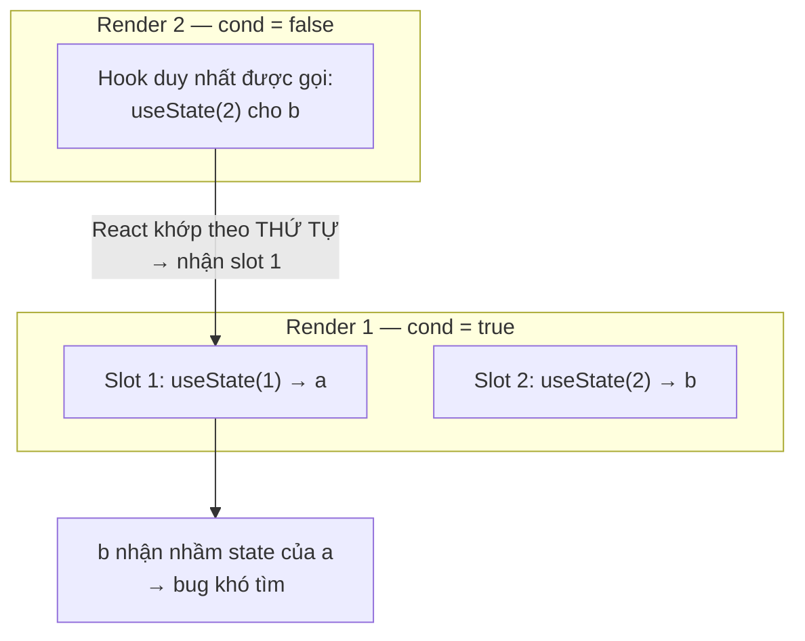

# Rules of Hooks

**Rules of Hooks** (các quy tắc dùng hook) là những nguyên tắc bắt buộc khi sử dụng **hook** (hàm đặc biệt cho phép dùng state và tính năng React trong functional component) để React hoạt động đúng. Hai quy tắc chính là: chỉ gọi hook ở **top level** (cấp ngoài cùng, không đặt trong vòng lặp, điều kiện hay hàm lồng nhau) và chỉ gọi hook từ component hoặc custom hook. Tuân thủ các quy tắc này giúp React giữ đúng thứ tự các hook qua mỗi lần render và tránh lỗi khó tìm.

[](pathname:///img/react/rules-of-hooks.webp)

---

:::note[Ghi nhớ nhanh]

- ⭐ **Chỉ gọi hook ở top level** — không đặt trong `if`/`for`/`while`, nested function, hay sau early return.
- ⭐ **Chỉ gọi hook từ function component hoặc custom hook** — không từ function thường, event handler, hay class.
- **Vì sao?** — React track hook theo THỨ TỰ GỌI (index), không theo tên; đổi thứ tự giữa các render → gán nhầm state → bug khó tìm.
- **Bật `eslint-plugin-react-hooks`** — hai rule `rules-of-hooks` + `exhaustive-deps`, nên chạy trong CI (`--max-warnings 0`).
- **`use` (React 19) là ngoại lệ duy nhất** — được gọi trong condition vì không có state riêng, chỉ đọc Promise/Context.

:::

---

## Mục lục

- [Vì sao có Rules of Hooks?](#vì-sao-có-rules-of-hooks)
- [Tổng quan 2 quy tắc](#tổng-quan-2-quy-tắc)
- [Rule 1: Chỉ gọi ở top level](#rule-1-chỉ-gọi-ở-top-level)
- [Rule 2: Chỉ gọi từ component/hook](#rule-2-chỉ-gọi-từ-componenthook)
- [Tại sao có quy tắc này?](#tại-sao-có-quy-tắc-này)
- [ESLint plugin](#eslint-plugin)
- [Câu hỏi phỏng vấn](#câu-hỏi-phỏng-vấn)

---

## Vì sao có Rules of Hooks?

**Vấn đề:**

```jsx
// React KHÔNG lưu state theo tên — chỉ theo THỨ TỰ GỌI hook mỗi render
function Component({ cond }) {
  if (cond) {
    const [a, setA] = useState(1); // hook 1 — đôi khi có, đôi khi không
  }
  const [b, setB] = useState(2);   // hook 2 — luôn có
}
// cond đổi giữa các render → thứ tự hook đổi
// → React gán nhầm state của hook này cho hook khác → bug rất khó tìm
```

**Giải pháp:**

```jsx
// Rules of Hooks giữ thứ tự hook ỔN ĐỊNH qua mọi render:
// (1) Chỉ gọi hook ở TOP LEVEL — không trong if / vòng lặp / hàm lồng nhau
// (2) Chỉ gọi trong React function component hoặc custom hook
function Component({ cond }) {
  const [a, setA] = useState(1); // luôn gọi
  const [b, setB] = useState(2); // luôn gọi

  if (cond) {
    // xử lý điều kiện BÊN TRONG, không bọc hook
  }
}
// eslint-plugin-react-hooks tự kiểm tra giúp bạn
```

:::tip[Dùng thực tế]

- Đặt mọi `useState` / `useEffect` ở **đầu hàm**, trước mọi `if` hay early return.
- Cần điều kiện thì xử lý **bên trong** hook (vd: `if` trong `useEffect`), đừng bọc quanh hook.
- Bật `eslint-plugin-react-hooks` (`rules-of-hooks` + `exhaustive-deps`) để bắt lỗi ngay khi viết.
- Viết **custom hook** đúng chuẩn (tên bắt đầu bằng `use`) để ESLint nhận diện và kiểm tra thứ tự hook.

:::

---

## Tổng quan 2 quy tắc

React Hooks có **2 quy tắc bắt buộc**:

1. **Chỉ gọi hook ở top level** — không trong `if`, `for`, `while`,
   nested function, sau `return`.
2. **Chỉ gọi hook từ** function component hoặc custom hook — không từ
   function thường, event handler, class.

Vi phạm → bug khó debug, code có thể không lỗi ngay nhưng sai logic.

---

## Rule 1: Chỉ gọi ở top level

**Sai**:

```jsx
function Component({ user }) {
  if (user) {
    const [data, setData] = useState(null); // SAI — trong if
  }

  for (let i = 0; i < 10; i++) {
    const ref = useRef(null); // SAI — trong loop
  }

  useEffect(() => {
    const [x, setX] = useState(0); // SAI — trong nested function
  }, []);
}
```

**Đúng**:

```jsx
function Component({ user }) {
  // Mọi hook ở top, không condition
  const [data, setData] = useState(null);

  useEffect(() => {
    // Logic conditional Ở TRONG hook, không bao quanh hook
    if (user) {
      fetchData(user.id);
    }
  }, [user]);
}
```

:::info[Phân tích]

**Tại sao quy tắc này?**

React **track hook bằng thứ tự gọi** trong mỗi render — không có ID hay
key cho hook. React Fiber dùng linked list:

```jsx
function Component() {
  const a = useState(1);  // hook 1
  const b = useState(2);  // hook 2
  const c = useEffect();  // hook 3
}
```

Mỗi render, React khớp hook theo **index**: lần 1 là useState, lần 2
là useState, lần 3 là useEffect.

Nếu hook bị skip:

```jsx
function Component({ cond }) {
  if (cond) {
    const a = useState(1); // hook 1 (đôi khi)
  }
  const b = useState(2);   // hook 2 (luôn)
}
```

- Khi `cond = true`: hook order = [useState, useState] ✓
- Khi `cond = false`: hook order = [useState] — React tưởng `b` là `a` cũ!

→ State bị nhầm lẫn, bug random.

Giải pháp: **luôn gọi cùng số lượng hook, theo cùng thứ tự, mỗi render**.

:::

Sơ đồ dưới cho thấy điều gì xảy ra khi thứ tự hook thay đổi giữa 2 lần
render — React khớp theo **index**, không theo tên biến:



---

## Rule 2: Chỉ gọi từ component/hook

**Sai**:

```jsx
// Function thường — không phải component
function fetchData() {
  const [data, setData] = useState(null); // SAI
}

// Class component
class Old extends Component {
  render() {
    useState(0); // SAI — class không gọi hook được
  }
}

// Event handler
<button onClick={() => {
  useState(0); // SAI — không trong render
}}>
```

**Đúng**:

```jsx
// Function component (PascalCase)
function MyComponent() {
  useState(0); // OK
}

// Custom hook (bắt đầu use*)
function useMyHook() {
  useState(0); // OK
}
```

ESLint dùng **chữ cái đầu** để phân biệt:

- PascalCase `MyComponent` → component.
- camelCase `useX` → custom hook.
- Khác → function thường, không cho gọi hook.

:::warning[Cần lưu ý]

**Pattern "conditional hook" sai trong khi tưởng đúng**:

```jsx
function Page({ id }) {
  if (!id) return null; // early return

  const [data, setData] = useState(null); // SAI — sau early return
  // ...
}
```

Hooks ở dưới early return = hook bị skip khi `!id` → vi phạm rule 1.

Fix — đặt hook lên trước early return:

```jsx
function Page({ id }) {
  const [data, setData] = useState(null);

  if (!id) return null; // OK — đã gọi hook xong

  return <div>{data?.title}</div>;
}
```

Hoặc tách component:

```jsx
function Page({ id }) {
  if (!id) return null;
  return <PageContent id={id} />;
}

function PageContent({ id }) {
  const [data, setData] = useState(null);
  // ...
}
```

:::

---

## Tại sao có quy tắc này?

Trade-off của design hooks dựa vào **call order**:

**Ưu điểm:**

- Cú pháp gọn — không cần API verbose như `useState("counter", 0)`.
- Composition tự nhiên — gọi hook giống gọi function.
- Tooling đơn giản — không cần map ID.

**Nhược điểm:**

- Phải tuân quy tắc nghiêm ngặt.
- Không cho conditional hook → đôi khi gây dài dòng.

React team đã cân nhắc API "named hook" (như `useState("count", 0)`)
nhưng thấy phức tạp hơn, không đáng.

:::info[Phân tích]

**React 19 + use hook — "ngoại lệ" có điều kiện:**

```jsx
import { use } from "react";

function Item({ promise, cond }) {
  if (cond) {
    const data = use(promise); // OK trong if!
    return <div>{data.title}</div>;
  }
  return null;
}
```

`use` **được phép** trong condition vì:

- Nó không có state riêng — chỉ đọc value (Promise/Context).
- React track theo Suspense boundary, không phải call order.

Các hook khác (`useState`, `useEffect`, `useRef`...) **vẫn phải tuân
Rules of Hooks**. `use` là exception duy nhất.

:::

---

## ESLint plugin

Cài plugin chính thức:

```bash
npm install --save-dev eslint-plugin-react-hooks
```

Bật rules:

```js
// eslint.config.js
import reactHooks from "eslint-plugin-react-hooks";

export default [
  {
    plugins: { "react-hooks": reactHooks },
    rules: {
      "react-hooks/rules-of-hooks": "error",
      "react-hooks/exhaustive-deps": "warn",
    },
  },
];
```

2 rule chính:

- **`rules-of-hooks`** — bắt vi phạm Rule 1 + 2.
- **`exhaustive-deps`** — bắt thiếu/thừa dep trong `useEffect`,
  `useCallback`, `useMemo`.

:::tip[Mẹo]

**Bật rule này trong CI** — fail PR nếu vi phạm:

```yaml
# .github/workflows/ci.yml
- name: Lint
  run: npm run lint -- --max-warnings 0
```

Sửa warning ngay khi viết, không tích lũy. Rule này cứu rất nhiều bug
production — không bỏ qua.

:::

:::warning[Cần lưu ý]

**Đừng dùng `// eslint-disable-line react-hooks/...`** trừ khi:

- Có lý do cực kỳ rõ.
- Comment giải thích tại sao.
- Đã thử mọi cách khác.

```jsx
// Hợp lý — track event chỉ 1 lần khi mount
useEffect(() => {
  trackEvent("page_view");
  // eslint-disable-next-line react-hooks/exhaustive-deps
}, []);

// Không hợp lý — lười fix
useEffect(() => {
  // dùng `data` nhưng không khai báo dep
  console.log(data);
  // eslint-disable-next-line react-hooks/exhaustive-deps
}, []);
```

Đa số trường hợp **"không muốn re-run effect khi dep đổi"** thực ra là
**design effect sai**. Nên refactor — không silence rule.

:::

---

## Câu hỏi phỏng vấn

Những câu thường gặp về chủ đề này. Tự trả lời trước, rồi bấm **Xem đáp án** để đối chiếu.

**1. Hai quy tắc của Rules of Hooks là gì? Phát biểu chính xác từng quy tắc.**

<details className="qa">
<summary>Xem đáp án</summary>

**Quy tắc 1 — Chỉ gọi hook ở top level.** Không gọi hook bên trong `if`, `for`, `while`, `switch`, hàm lồng nhau, hay sau một câu lệnh `return` sớm. Mọi lần render phải gọi **cùng số lượng hook, theo cùng thứ tự**.

**Quy tắc 2 — Chỉ gọi hook từ code React.** Cụ thể là từ **function component** (tên PascalCase) hoặc từ **custom hook** (tên bắt đầu bằng `use`). Không gọi từ function JS thường, event handler, class component, hay callback truyền cho thư viện ngoài.

```jsx
// Sai
function Component({ cond }) {
  if (cond) { const [a] = useState(1); }
  const [b] = useState(2);
}

// Đúng — hook luôn ở top, điều kiện xử lý bên trong
function Component({ cond }) {
  const [a] = useState(1);
  const [b] = useState(2);
  if (cond) { /* logic ở đây */ }
}
```

Cả hai đều phục vụ một mục đích: giữ **thứ tự gọi hook ổn định** qua mọi lần render.

</details>

**2. React lưu state của hook theo tên biến hay theo thứ tự gọi? Bên trong React dùng cấu trúc dữ liệu nào để lưu?**

<details className="qa">
<summary>Xem đáp án</summary>

Theo **thứ tự gọi (index)**, hoàn toàn không theo tên biến. React không hề biết bạn đặt tên là `count` hay `x` — nó chỉ đếm: lần gọi hook thứ nhất, thứ hai, thứ ba...

Bên trong, mỗi component instance có một **fiber node**, và fiber giữ một **linked list các hook** (trường `memoizedState`). Mỗi node trong danh sách lưu state/deps của một hook, trỏ tới node kế tiếp bằng `next`.

```jsx
function Component() {
  const a = useState(1);  // node 1
  const b = useState(2);  // node 1 → node 2
  useEffect(() => {}, []); // node 2 → node 3
}
```

- **Lần mount**: React *tạo* node mới cho mỗi lần gọi hook và nối vào danh sách.
- **Các lần render sau**: React *duyệt lại* danh sách theo đúng thứ tự, lấy node thứ N cho lần gọi hook thứ N.

Vì cơ chế là "đếm theo thứ tự" nên chỉ cần một lần render gọi thiếu/thừa hook là toàn bộ danh sách lệch.

</details>

**3. Đoán bug: gọi `useState` bên trong `if (cond)` rồi mới gọi một `useState` khác ở ngoài — chuyện gì xảy ra khi `cond` đổi từ đúng sang sai giữa hai lần render?**

<details className="qa">
<summary>Xem đáp án</summary>

```jsx
function Component({ cond }) {
  if (cond) {
    const [a, setA] = useState("A"); // slot 1 (đôi khi)
  }
  const [b, setB] = useState("B");   // slot 2 (luôn)
}
```

- **Render 1 (`cond = true`)**: gọi 2 hook → slot 1 giữ `"A"`, slot 2 giữ `"B"`.
- **Render 2 (`cond = false`)**: chỉ gọi 1 hook. React khớp theo **thứ tự**, nên lần gọi `useState("B")` này nhận **slot 1** — tức nhận lại giá trị `"A"`. Biến `b` đột nhiên bằng `"A"`, và `setB` giờ ghi vào ô nhớ của `a`.

Ngoài ra React thấy số hook giảm từ 2 xuống 1 nên thường ném luôn lỗi **`Rendered fewer hooks than expected. This may be caused by an accidental early return statement.`**

Nguy hiểm nhất là trường hợp *không* crash — ví dụ đổi từ `useState` sang `useState` cùng kiểu — lúc đó state chỉ đơn giản bị trộn lẫn, tạo ra bug ngẫu nhiên rất khó truy nguồn.

</details>

**4. Vì sao gọi hook sau một early return cũng vi phạm quy tắc, dù nhìn thì vẫn ở top level?**

<details className="qa">
<summary>Xem đáp án</summary>

Vì "top level" không phải chuyện **thụt lề**, mà là chuyện **hook có luôn được chạy hay không**. Early return biến đoạn code phía sau thành *có điều kiện*:

```jsx
function Page({ id }) {
  if (!id) return null;                    // render này dừng ở đây
  const [data, setData] = useState(null);  // SAI — bị skip khi !id
}
```

Khi `id` rỗng, React chạy 0 hook; khi có `id`, chạy 1 hook. Thứ tự và số lượng hook đổi giữa các render → đúng vi phạm Quy tắc 1, thường kèm lỗi `Rendered fewer hooks than expected`.

Hai cách sửa:

```jsx
// Cách 1 — đưa hook lên trước early return
function Page({ id }) {
  const [data, setData] = useState(null);
  if (!id) return null;
  return <div>{data?.title}</div>;
}

// Cách 2 — tách component con
function Page({ id }) {
  if (!id) return null;
  return <PageContent id={id} />;
}
```

Cách 2 hợp lệ vì `PageContent` là một component riêng — khi nó render thì luôn chạy đủ hook của nó.

</details>

**5. Gọi hook trong vòng lặp `for` sai ở chỗ nào? Nếu số lần lặp luôn cố định thì có an toàn không, và vì sao vẫn không nên làm?**

<details className="qa">
<summary>Xem đáp án</summary>

Sai vì **số lần lặp thường phụ thuộc dữ liệu**, mà dữ liệu thì đổi:

```jsx
function List({ items }) {
  for (let i = 0; i < items.length; i++) {
    const [open, setOpen] = useState(false); // SAI
  }
}
```

Mảng 3 phần tử → 3 hook; mảng 5 phần tử → 5 hook. Thứ tự hook lệch ngay khi danh sách thay đổi.

**Nếu số lần lặp cố định** (ví dụ luôn `i < 3`) thì về mặt kỹ thuật React vẫn chạy đúng, vì số lượng và thứ tự hook không đổi. Nhưng vẫn không nên:

- ESLint `rules-of-hooks` báo lỗi (nó phân tích cú pháp, không chứng minh được hằng số) — bạn sẽ phải disable rule.
- Rất mong manh: một ngày ai đó đổi `3` thành `items.length` là vỡ, mà lỗi lại xuất hiện ở chỗ khác.
- Khó đọc, khó suy luận về state.

Cách đúng: **tách mỗi phần tử thành một component con**, mỗi component tự giữ state của mình.

</details>

**6. Muốn chạy một effect có điều kiện thì đặt điều kiện ở đâu cho đúng?**

<details className="qa">
<summary>Xem đáp án</summary>

Đặt điều kiện **bên trong** hook, không bao quanh hook — hook luôn được gọi, chỉ phần việc bên trong mới có điều kiện:

```jsx
// Sai — bọc quanh hook
if (user) {
  useEffect(() => { fetchData(user.id); }, [user]);
}

// Đúng — hook luôn gọi, if nằm trong body
useEffect(() => {
  if (!user) return;
  fetchData(user.id);
}, [user]);
```

Nguyên tắc: `useEffect` vẫn "chạy" mỗi khi dependency đổi, nhưng thân effect tự quyết định có làm gì không. Dùng `return` sớm ngay đầu effect là cách viết gọn và phổ biến nhất.

Tương tự với `useMemo` / `useCallback`: luôn gọi hook, điều kiện nằm trong hàm tính toán. Với `useEffect`, dependency array chỉ kiểm soát **khi nào chạy lại**, không kiểm soát **có chạy hay không** — việc đó thuộc về logic bên trong.

</details>

**7. Vì sao không được gọi hook trong event handler, hay trong callback của `map`?**

<details className="qa">
<summary>Xem đáp án</summary>

Vì cả hai đều **không chạy trong pha render** theo thứ tự cố định.

**Event handler** chạy *sau khi* render xong, khi người dùng click. Lúc đó React không còn ở trong ngữ cảnh render của component nào, không có fiber "đang xử lý" để gắn hook vào — gọi hook sẽ ném lỗi `Invalid hook call`. Thêm nữa, handler chạy bao nhiêu lần là do người dùng quyết định, không thể ổn định thứ tự.

```jsx
<button onClick={() => {
  const [x, setX] = useState(0); // SAI
}}>
```

**Callback của `map`** thì chạy trong render, nhưng số lần chạy bằng độ dài mảng — y hệt vấn đề của vòng lặp `for`: mảng dài ngắn khác nhau → số hook khác nhau. Ngoài ra nó là **hàm lồng nhau**, ESLint chặn thẳng.

Cách đúng: với `map`, tách phần tử thành component con có state riêng; với event handler, gọi hook ở top level rồi dùng hàm setter (`setX`) bên trong handler.

</details>

**8. Liệt kê đầy đủ những nơi được phép gọi hook.**

<details className="qa">
<summary>Xem đáp án</summary>

Chỉ có **hai** nơi:

1. **Thân của một React function component** — hàm trả về JSX, tên viết PascalCase (`MyComponent`), gọi ở top level trước mọi early return.
2. **Thân của một custom hook** — hàm tên bắt đầu bằng `use` (`useCounter`, `useFetch`), cũng ở top level.

```jsx
function MyComponent() { useState(0); } // OK — component
function useMyHook()   { useState(0); } // OK — custom hook
```

Những nơi **không** được phép:

- Function JS thường (`fetchData`, `handleClick`, helper util).
- Class component — hook chỉ dành cho function component.
- Event handler, callback của `setTimeout`, `then`, `map`, `forEach`.
- Bên trong `useMemo`, `useCallback`, thân `useEffect` — đây là hàm lồng nhau.
- Code ở module scope, ngoài mọi component.
- Sau một `return` sớm, trong `if` / `for` / `try-catch`.

ESLint phân biệt component và hook bằng **chữ cái đầu**: PascalCase → component, `use` + camelCase → hook, còn lại → function thường.

</details>

**9. Class component có dùng được hook không? Vì sao? Muốn tái sử dụng logic hook trong class thì làm thế nào?**

<details className="qa">
<summary>Xem đáp án</summary>

**Không.** Hook được thiết kế riêng cho function component:

- React xác định hook thuộc về component nào bằng **fiber đang render**, và cơ chế "dispatcher" này chỉ được kích hoạt khi React gọi một function component. Trong `render()` của class, dispatcher là `null` → ném `Invalid hook call`.
- Về mặt khái niệm, class đã có sẵn cơ chế riêng: `this.state`, `setState`, các lifecycle method. Hook chính là bản thay thế cho những thứ đó, không phải bổ sung.

**Tái sử dụng logic hook trong class** — bọc hook lại bằng một function component rồi cho class dùng:

```jsx
// Bọc bằng HOC
function withUser(Wrapped) {
  return function (props) {
    const user = useUser();          // hook chạy trong function component
    return <Wrapped {...props} user={user} />;
  };
}

class Profile extends React.Component {
  render() { return <p>{this.props.user.name}</p>; }
}
export default withUser(Profile);
```

Cách khác: dùng **render props** — một function component gọi hook rồi truyền kết quả xuống qua children. Về lâu dài, giải pháp tốt nhất vẫn là chuyển class sang function component.

</details>

**10. `eslint-plugin-react-hooks` có những rule nào, mỗi rule bắt lỗi gì? Vì sao nên đặt mức error và chạy trong CI?**

<details className="qa">
<summary>Xem đáp án</summary>

Hai rule chính:

- **`react-hooks/rules-of-hooks`** — bắt vi phạm hai quy tắc: hook trong `if`/`for`/hàm lồng nhau/sau early return, và hook gọi từ nơi không phải component hay custom hook.
- **`react-hooks/exhaustive-deps`** — bắt **thiếu hoặc thừa dependency** trong `useEffect`, `useCallback`, `useMemo`, `useLayoutEffect`.

```js
rules: {
  "react-hooks/rules-of-hooks": "error",
  "react-hooks/exhaustive-deps": "warn",
}
```

`rules-of-hooks` để **error** vì vi phạm gần như luôn là bug thật, không có ngoại lệ hợp lệ. `exhaustive-deps` thường để **warn** vì đôi khi có lý do chính đáng để bỏ dep, nhưng phải kèm comment giải thích.

**Chạy trong CI** với `--max-warnings 0` để warning không tích luỹ rồi bị phớt lờ. Loại bug do hook gây ra (state nhầm lẫn, stale closure, effect không chạy lại) rất khó tái hiện và thường chỉ lộ trên production — chặn ngay ở PR là rẻ nhất.

</details>

**11. Vì sao hook `use` của React 19 được phép gọi trong `if` hoặc vòng lặp mà không phá vỡ thứ tự hook?**

<details className="qa">
<summary>Xem đáp án</summary>

Vì `use` **không chiếm một ô nhớ (slot) trong danh sách hook**. Hai lý do như bài đã nêu:

- Nó **không có state riêng** — chỉ *đọc* giá trị từ một Promise hoặc Context, không lưu gì giữa các lần render.
- React theo dõi nó qua **Suspense boundary** (khi Promise chưa resolve thì component suspend rồi render lại), chứ không qua call order.

```jsx
import { use } from "react";

function Item({ promise, cond }) {
  if (cond) {
    const data = use(promise); // hợp lệ trong if
    return <div>{data.title}</div>;
  }
  return null;
}
```

Vì không tham gia vào linked list hook, gọi `use` nhiều lần hay bỏ qua hoàn toàn đều không làm lệch index của các hook khác.

Đây là **ngoại lệ duy nhất**. Mọi hook còn lại (`useState`, `useEffect`, `useRef`, `useMemo`...) vẫn phải tuân thủ Rules of Hooks đầy đủ.

</details>

**12. Nếu component đặt tên viết thường như `myComponent` thì ESLint có kiểm tra Rules of Hooks cho nó không? Quy ước đặt tên ảnh hưởng thế nào tới linter?**

<details className="qa">
<summary>Xem đáp án</summary>

**Không** — tệ hơn, ESLint sẽ coi đó là **function thường** và báo lỗi ngay khi bạn gọi hook trong đó ("React Hook is called in function `myComponent` that is neither a React function component nor a custom React Hook function").

Linter không chạy code, không biết hàm nào trả về JSX một cách chắc chắn. Nó dựa hoàn toàn vào **chữ cái đầu của tên hàm**:

| Tên hàm | Linter hiểu là | Gọi hook được? |
|---|---|---|
| `MyComponent` (PascalCase) | Function component | Có, và được kiểm tra Rules of Hooks |
| `useMyHook` (`use` + camelCase) | Custom hook | Có, và được kiểm tra |
| `myComponent`, `fetchData` | Function thường | Không — báo lỗi |

Hệ quả thực tế: đặt tên sai quy ước là **mất lưới an toàn**. Custom hook tên `getUser()` chứa `useState` vẫn chạy được (React không đọc tên), nhưng ESLint không kiểm tra nữa — bạn có thể vô tình gọi nó trong `if` mà không ai cảnh báo. Vì vậy quy ước đặt tên trong React không chỉ là thẩm mỹ, nó là **hợp đồng với tooling**.

</details>

**13. Gặp lỗi runtime `Rendered fewer hooks than expected` thì nguyên nhân thường là gì và debug theo hướng nào?**

<details className="qa">
<summary>Xem đáp án</summary>

Lỗi này nghĩa là: lần render trước component gọi N hook, lần này chỉ gọi ít hơn N. Nguyên nhân phổ biến nhất chính là thông điệp React gợi ý — **early return nằm trước một hook**:

```jsx
function Page({ id }) {
  if (!id) return null;      // render sau chỉ chạy tới đây
  const [data] = useState(); // hook bị bỏ qua → lỗi
}
```

Các nguyên nhân khác: hook nằm trong `if`, trong `try/catch` có thể ném lỗi giữa chừng, trong vòng lặp có số vòng thay đổi, hoặc một `throw` xảy ra giữa chừng thân component.

Hướng debug:

1. Đọc stack trace để biết **component nào** đang render lỗi.
2. Quét toàn bộ thân component tìm mọi `return`, `throw`, `if`, `for` nằm **phía trên** một lời gọi hook.
3. Kiểm tra cả các custom hook mà component gọi — vi phạm có thể nằm trong đó.
4. Bật `eslint-plugin-react-hooks` và chạy lint; rule `rules-of-hooks` gần như luôn chỉ đúng chỗ.

Cách sửa: đưa mọi hook lên trên cùng, hoặc tách phần "có điều kiện" thành component con.

</details>

**14. Có cách nào để đạt hiệu quả gọi hook có điều kiện mà vẫn hợp lệ không? Vì sao tách thành component con hoặc custom hook riêng lại không vi phạm quy tắc?**

<details className="qa">
<summary>Xem đáp án</summary>

Có — bằng cách **đẩy điều kiện lên một cấp**, sang việc *component nào được render*, thay vì *hook nào được gọi*:

```jsx
function Page({ id }) {
  if (!id) return <Empty />;
  return <PageContent id={id} />; // chỉ render khi có id
}

function PageContent({ id }) {
  const { data } = useFetch(id);  // luôn chạy trong component này
  return <div>{data?.title}</div>;
}
```

**Vì sao hợp lệ:** Rules of Hooks áp dụng cho **từng component instance**, không cho cả cây. Mỗi instance có danh sách hook riêng. `PageContent` khi được render thì luôn gọi đủ hook theo đúng thứ tự; khi không được render, nó bị unmount và React vứt luôn cả danh sách hook của nó — không có chuyện "lệch index". Việc mount/unmount là chuyện bình thường, không phải vi phạm.

Các cách khác cùng tinh thần: truyền cờ điều kiện *vào* hook (`useFetch(url, { enabled })` — cách TanStack Query dùng), hoặc `return` sớm ngay trong thân `useEffect`.

</details>

**15. Rules of Hooks liên quan gì tới việc React có thể render lại, huỷ bỏ hoặc render đồng thời (concurrent) một component?**

<details className="qa">
<summary>Xem đáp án</summary>

Rất chặt chẽ. Cơ chế của React dựa trên giả định **render là thuần khiết và lặp lại được**: với cùng props/state, gọi component bao nhiêu lần cũng cho ra cùng kết quả và **cùng chuỗi hook**.

Với Concurrent React, giả định đó bị khai thác mạnh hơn:

- React có thể **bắt đầu render rồi bỏ dở** (khi có update ưu tiên cao hơn) và **render lại từ đầu** sau đó.
- **Transition** cho phép giữ giao diện cũ trong lúc chuẩn bị giao diện mới — component bị render nhiều lần với input khác nhau.
- **Suspense** làm component bị gián đoạn rồi tiếp tục.
- **StrictMode** trong dev cố tình render hai lần để phơi bày vi phạm.

Nếu số lượng/thứ tự hook thay đổi giữa các lần render, React không thể khớp lại danh sách hook sau khi huỷ và chạy lại — state gán nhầm, effect chạy sai. Rules of Hooks chính là **điều kiện để React được phép làm những việc đó một cách an toàn**. Đây cũng là lý do cùng nhóm với các quy tắc khác: không mutate props/state, không side effect trong thân render.

</details>
