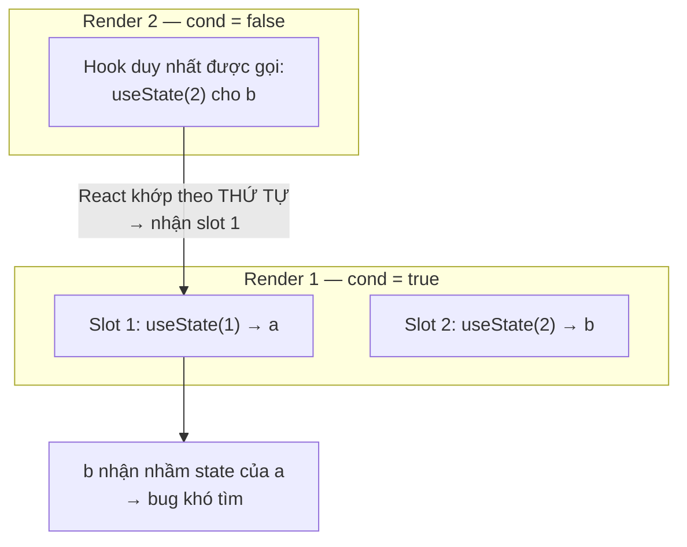

# Rules of Hooks

**Rules of Hooks** (các quy tắc dùng hook) là những nguyên tắc bắt buộc khi sử dụng **hook** (hàm đặc biệt cho phép dùng state và tính năng React trong functional component) để React hoạt động đúng. Hai quy tắc chính là: chỉ gọi hook ở **top level** (cấp ngoài cùng, không đặt trong vòng lặp, điều kiện hay hàm lồng nhau) và chỉ gọi hook từ component hoặc custom hook. Tuân thủ các quy tắc này giúp React giữ đúng thứ tự các hook qua mỗi lần render và tránh lỗi khó tìm.

---

:::note[Ghi nhớ nhanh]

- ⭐ **Chỉ gọi hook ở top level** — không đặt trong `if`/`for`/`while`, nested function, hay sau early return.
- ⭐ **Chỉ gọi hook từ function component hoặc custom hook** — không từ function thường, event handler, hay class.
- **Vì sao?** — React track hook theo THỨ TỰ GỌI (index), không theo tên; đổi thứ tự giữa các render → gán nhầm state → bug khó tìm.
- **Bật `eslint-plugin-react-hooks`** — hai rule `rules-of-hooks` + `exhaustive-deps`, nên chạy trong CI (`--max-warnings 0`).
- **`use` (React 19) là ngoại lệ duy nhất** — được gọi trong condition vì không có state riêng, chỉ đọc Promise/Context.

:::

---

## Mục lục

- [Vì sao có Rules of Hooks?](#vì-sao-có-rules-of-hooks)
- [Tổng quan 2 quy tắc](#tổng-quan-2-quy-tắc)
- [Rule 1: Chỉ gọi ở top level](#rule-1-chỉ-gọi-ở-top-level)
- [Rule 2: Chỉ gọi từ component/hook](#rule-2-chỉ-gọi-từ-componenthook)
- [Tại sao có quy tắc này?](#tại-sao-có-quy-tắc-này)
- [ESLint plugin](#eslint-plugin)
- [Câu hỏi phỏng vấn](#câu-hỏi-phỏng-vấn)

---

## Vì sao có Rules of Hooks?

**Vấn đề:**

```jsx
// React KHÔNG lưu state theo tên — chỉ theo THỨ TỰ GỌI hook mỗi render
function Component({ cond }) {
  if (cond) {
    const [a, setA] = useState(1); // hook 1 — đôi khi có, đôi khi không
  }
  const [b, setB] = useState(2);   // hook 2 — luôn có
}
// cond đổi giữa các render → thứ tự hook đổi
// → React gán nhầm state của hook này cho hook khác → bug rất khó tìm
```

**Giải pháp:**

```jsx
// Rules of Hooks giữ thứ tự hook ỔN ĐỊNH qua mọi render:
// (1) Chỉ gọi hook ở TOP LEVEL — không trong if / vòng lặp / hàm lồng nhau
// (2) Chỉ gọi trong React function component hoặc custom hook
function Component({ cond }) {
  const [a, setA] = useState(1); // luôn gọi
  const [b, setB] = useState(2); // luôn gọi

  if (cond) {
    // xử lý điều kiện BÊN TRONG, không bọc hook
  }
}
// eslint-plugin-react-hooks tự kiểm tra giúp bạn
```

:::tip[Dùng thực tế]

- Đặt mọi `useState` / `useEffect` ở **đầu hàm**, trước mọi `if` hay early return.
- Cần điều kiện thì xử lý **bên trong** hook (vd: `if` trong `useEffect`), đừng bọc quanh hook.
- Bật `eslint-plugin-react-hooks` (`rules-of-hooks` + `exhaustive-deps`) để bắt lỗi ngay khi viết.
- Viết **custom hook** đúng chuẩn (tên bắt đầu bằng `use`) để ESLint nhận diện và kiểm tra thứ tự hook.

:::

---

## Tổng quan 2 quy tắc

React Hooks có **2 quy tắc bắt buộc**:

1. **Chỉ gọi hook ở top level** — không trong `if`, `for`, `while`,
   nested function, sau `return`.
2. **Chỉ gọi hook từ** function component hoặc custom hook — không từ
   function thường, event handler, class.

Vi phạm → bug khó debug, code có thể không lỗi ngay nhưng sai logic.

---

## Rule 1: Chỉ gọi ở top level

**Sai**:

```jsx
function Component({ user }) {
  if (user) {
    const [data, setData] = useState(null); // SAI — trong if
  }

  for (let i = 0; i < 10; i++) {
    const ref = useRef(null); // SAI — trong loop
  }

  useEffect(() => {
    const [x, setX] = useState(0); // SAI — trong nested function
  }, []);
}
```

**Đúng**:

```jsx
function Component({ user }) {
  // Mọi hook ở top, không condition
  const [data, setData] = useState(null);

  useEffect(() => {
    // Logic conditional Ở TRONG hook, không bao quanh hook
    if (user) {
      fetchData(user.id);
    }
  }, [user]);
}
```

:::info[Phân tích]

**Tại sao quy tắc này?**

React **track hook bằng thứ tự gọi** trong mỗi render — không có ID hay
key cho hook. React Fiber dùng linked list:

```jsx
function Component() {
  const a = useState(1);  // hook 1
  const b = useState(2);  // hook 2
  const c = useEffect();  // hook 3
}
```

Mỗi render, React khớp hook theo **index**: lần 1 là useState, lần 2
là useState, lần 3 là useEffect.

Nếu hook bị skip:

```jsx
function Component({ cond }) {
  if (cond) {
    const a = useState(1); // hook 1 (đôi khi)
  }
  const b = useState(2);   // hook 2 (luôn)
}
```

- Khi `cond = true`: hook order = [useState, useState] ✓
- Khi `cond = false`: hook order = [useState] — React tưởng `b` là `a` cũ!

→ State bị nhầm lẫn, bug random.

Giải pháp: **luôn gọi cùng số lượng hook, theo cùng thứ tự, mỗi render**.

:::

Sơ đồ dưới cho thấy điều gì xảy ra khi thứ tự hook thay đổi giữa 2 lần
render — React khớp theo **index**, không theo tên biến:



---

## Rule 2: Chỉ gọi từ component/hook

**Sai**:

```jsx
// Function thường — không phải component
function fetchData() {
  const [data, setData] = useState(null); // SAI
}

// Class component
class Old extends Component {
  render() {
    useState(0); // SAI — class không gọi hook được
  }
}

// Event handler
<button onClick={() => {
  useState(0); // SAI — không trong render
}}>
```

**Đúng**:

```jsx
// Function component (PascalCase)
function MyComponent() {
  useState(0); // OK
}

// Custom hook (bắt đầu use*)
function useMyHook() {
  useState(0); // OK
}
```

ESLint dùng **chữ cái đầu** để phân biệt:

- PascalCase `MyComponent` → component.
- camelCase `useX` → custom hook.
- Khác → function thường, không cho gọi hook.

:::warning[Cần lưu ý]

**Pattern "conditional hook" sai trong khi tưởng đúng**:

```jsx
function Page({ id }) {
  if (!id) return null; // early return

  const [data, setData] = useState(null); // SAI — sau early return
  // ...
}
```

Hooks ở dưới early return = hook bị skip khi `!id` → vi phạm rule 1.

Fix — đặt hook lên trước early return:

```jsx
function Page({ id }) {
  const [data, setData] = useState(null);

  if (!id) return null; // OK — đã gọi hook xong

  return <div>{data?.title}</div>;
}
```

Hoặc tách component:

```jsx
function Page({ id }) {
  if (!id) return null;
  return <PageContent id={id} />;
}

function PageContent({ id }) {
  const [data, setData] = useState(null);
  // ...
}
```

:::

---

## Tại sao có quy tắc này?

Trade-off của design hooks dựa vào **call order**:

**Ưu điểm:**

- Cú pháp gọn — không cần API verbose như `useState("counter", 0)`.
- Composition tự nhiên — gọi hook giống gọi function.
- Tooling đơn giản — không cần map ID.

**Nhược điểm:**

- Phải tuân quy tắc nghiêm ngặt.
- Không cho conditional hook → đôi khi gây dài dòng.

React team đã cân nhắc API "named hook" (như `useState("count", 0)`)
nhưng thấy phức tạp hơn, không đáng.

:::info[Phân tích]

**React 19 + use hook — "ngoại lệ" có điều kiện:**

```jsx
import { use } from "react";

function Item({ promise, cond }) {
  if (cond) {
    const data = use(promise); // OK trong if!
    return <div>{data.title}</div>;
  }
  return null;
}
```

`use` **được phép** trong condition vì:

- Nó không có state riêng — chỉ đọc value (Promise/Context).
- React track theo Suspense boundary, không phải call order.

Các hook khác (`useState`, `useEffect`, `useRef`...) **vẫn phải tuân
Rules of Hooks**. `use` là exception duy nhất.

:::

---

## ESLint plugin

Cài plugin chính thức:

```bash
npm install --save-dev eslint-plugin-react-hooks
```

Bật rules:

```js
// eslint.config.js
import reactHooks from "eslint-plugin-react-hooks";

export default [
  {
    plugins: { "react-hooks": reactHooks },
    rules: {
      "react-hooks/rules-of-hooks": "error",
      "react-hooks/exhaustive-deps": "warn",
    },
  },
];
```

2 rule chính:

- **`rules-of-hooks`** — bắt vi phạm Rule 1 + 2.
- **`exhaustive-deps`** — bắt thiếu/thừa dep trong `useEffect`,
  `useCallback`, `useMemo`.

:::tip[Mẹo]

**Bật rule này trong CI** — fail PR nếu vi phạm:

```yaml
# .github/workflows/ci.yml
- name: Lint
  run: npm run lint -- --max-warnings 0
```

Sửa warning ngay khi viết, không tích lũy. Rule này cứu rất nhiều bug
production — không bỏ qua.

:::

:::warning[Cần lưu ý]

**Đừng dùng `// eslint-disable-line react-hooks/...`** trừ khi:

- Có lý do cực kỳ rõ.
- Comment giải thích tại sao.
- Đã thử mọi cách khác.

```jsx
// Hợp lý — track event chỉ 1 lần khi mount
useEffect(() => {
  trackEvent("page_view");
  // eslint-disable-next-line react-hooks/exhaustive-deps
}, []);

// Không hợp lý — lười fix
useEffect(() => {
  // dùng `data` nhưng không khai báo dep
  console.log(data);
  // eslint-disable-next-line react-hooks/exhaustive-deps
}, []);
```

Đa số trường hợp **"không muốn re-run effect khi dep đổi"** thực ra là
**design effect sai**. Nên refactor — không silence rule.

:::

---

## Câu hỏi phỏng vấn

Những câu thường gặp về chủ đề này. Tự trả lời trước, rồi đối chiếu lại với nội dung phía trên.

1. Hai quy tắc của Rules of Hooks là gì? Phát biểu chính xác từng quy tắc.
2. React lưu state của hook theo tên biến hay theo thứ tự gọi? Bên trong React dùng cấu trúc dữ liệu nào để lưu?
3. Đoán bug: gọi `useState` bên trong `if (cond)` rồi mới gọi một `useState` khác ở ngoài — chuyện gì xảy ra khi `cond` đổi từ đúng sang sai giữa hai lần render?
4. Vì sao gọi hook sau một early return cũng vi phạm quy tắc, dù nhìn thì vẫn ở top level?
5. Gọi hook trong vòng lặp `for` sai ở chỗ nào? Nếu số lần lặp luôn cố định thì có an toàn không, và vì sao vẫn không nên làm?
6. Muốn chạy một effect có điều kiện thì đặt điều kiện ở đâu cho đúng?
7. Vì sao không được gọi hook trong event handler, hay trong callback của `map`?
8. Liệt kê đầy đủ những nơi được phép gọi hook.
9. Class component có dùng được hook không? Vì sao? Muốn tái sử dụng logic hook trong class thì làm thế nào?
10. `eslint-plugin-react-hooks` có những rule nào, mỗi rule bắt lỗi gì? Vì sao nên đặt mức error và chạy trong CI?
11. Vì sao hook `use` của React 19 được phép gọi trong `if` hoặc vòng lặp mà không phá vỡ thứ tự hook?
12. Nếu component đặt tên viết thường như `myComponent` thì ESLint có kiểm tra Rules of Hooks cho nó không? Quy ước đặt tên ảnh hưởng thế nào tới linter?
13. Gặp lỗi runtime `Rendered fewer hooks than expected` thì nguyên nhân thường là gì và debug theo hướng nào?
14. Có cách nào để đạt hiệu quả gọi hook có điều kiện mà vẫn hợp lệ không? Vì sao tách thành component con hoặc custom hook riêng lại không vi phạm quy tắc?
15. Rules of Hooks liên quan gì tới việc React có thể render lại, huỷ bỏ hoặc render đồng thời (concurrent) một component?
