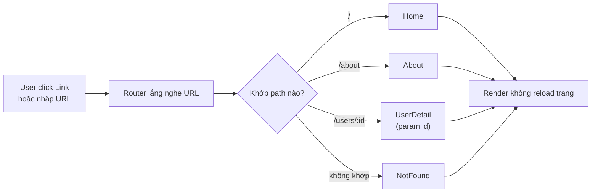
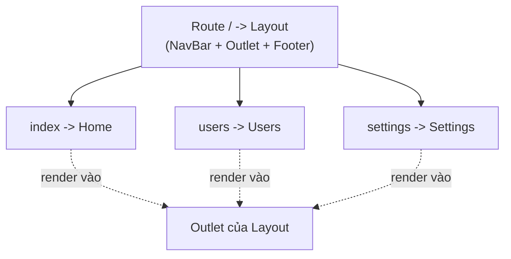
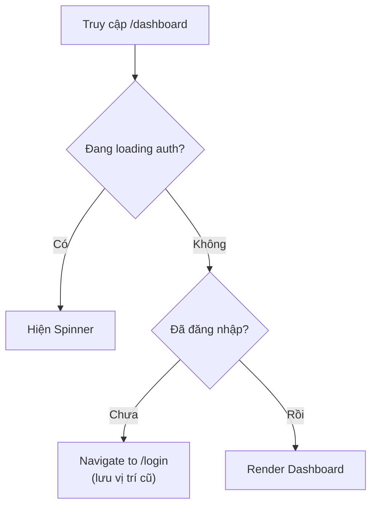

# Routing trong React

**Routing** (định tuyến) là cơ chế quyết định hiển thị giao diện nào tương ứng với từng đường dẫn URL trên trình duyệt. Vì React thường xây dựng **SPA** (single-page application, ứng dụng một trang, không tải lại toàn trang khi chuyển trang), nên ta cần thư viện routing để chuyển trang mượt mà mà không reload. Bài này giới thiệu các giải pháp phổ biến như React Router cùng cách lấy **route params** (tham số động trên URL, ví dụ id của một bài viết).

[](pathname:///img/react/routers.webp)

---

:::note[Ghi nhớ nhanh]

- ⭐ **Routing ánh xạ URL → component** để tạo nhiều "trang" trong SPA mà không reload; React core không có sẵn, phải dùng thư viện.
- **React Router phổ biến nhất** (`BrowserRouter`, `Routes`, `Route`, `Link`); TanStack Router type-safe end-to-end, file-based.
- **Route params** — đọc param động bằng `useParams`, query string bằng `useSearchParams`.
- **Nested routes** chia sẻ layout qua `<Outlet />`; **Protected route** wrap kiểm tra auth rồi `<Navigate to="/login">` nếu chưa đăng nhập.
- **Điều hướng** — `useNavigate` (imperative), `<Navigate>` (declarative), `<Link>`/`<NavLink>` thay `<a>` để không reload trang.
- ⭐ **React Router v7 đã merge Remix** — thêm loader/action và server rendering, opt-in; API client routing gần như không đổi.

:::

---

## Mục lục

- [Vì sao cần router?](#vì-sao-cần-router)
- [Tổng quan](#tổng-quan)
- [React Router (phổ biến nhất)](#react-router-phổ-biến-nhất)
- [TanStack Router](#tanstack-router)
- [Route params](#route-params)
- [Nested Routes](#nested-routes)
- [Protected Routes](#protected-routes)
- [Navigation và Redirect](#navigation-và-redirect)
- [Câu hỏi phỏng vấn](#câu-hỏi-phỏng-vấn)

---

## Vì sao cần router?

**Vấn đề:**

```jsx
// React mặc định là SPA — chỉ render MỘT trang duy nhất.
// Muốn nhiều "trang" (/, /about, /users/:id) ta phải tự lắng nghe URL,
// tự gọi History API để đổi địa chỉ, tự xử lý nút back/forward...
function App() {
  const [path, setPath] = useState(window.location.pathname);

  useEffect(() => {
    const onPop = () => setPath(window.location.pathname); // back/forward
    window.addEventListener("popstate", onPop);
    return () => window.removeEventListener("popstate", onPop);
  }, []);

  // Tự ánh xạ path → component, rất rối và dễ sai
  if (path === "/") return <Home />;
  if (path === "/about") return <About />;
  // còn /users/:id động? nested layout? route bảo vệ? → bế tắc
  return <NotFound />;
}

// Nếu dùng <a href> hoặc reload cả trang → mất luôn trải nghiệm SPA.
```

**Giải pháp:**

```jsx
// Router (React Router...) ánh xạ URL → component giúp ta.
// Điều hướng KHÔNG reload, hỗ trợ route động, nested layout, route bảo vệ.
import { BrowserRouter, Routes, Route } from "react-router-dom";

function App() {
  return (
    <BrowserRouter>
      <Routes>
        <Route path="/" element={<Home />} />
        <Route path="/about" element={<About />} />
        <Route path="/users/:id" element={<UserDetail />} /> {/* route động */}
        <Route path="*" element={<NotFound />} />
      </Routes>
    </BrowserRouter>
  );
}
// back/forward, link chia sẻ được URL, bookmark... router lo hết.
```

Sơ đồ dưới đây minh hoạ luồng router ánh xạ URL thành component tương ứng:



:::tip[Dùng thực tế]

- **Nhiều "trang" trong SPA**: tách `/`, `/about`, `/dashboard`... mà không reload toàn trang.
- **URL chia sẻ / bookmark được**: gửi link `/users/42` cho người khác, mở ra đúng trang đó.
- **Route động**: `/product/:id`, `/post/:slug` — một component phục vụ vô số URL.
- **Bảo vệ trang cần đăng nhập**: chặn `/dashboard`, tự chuyển về `/login` nếu chưa auth.

:::

---

## Tổng quan

React core **không có routing built-in**. Phải dùng thư viện:

| Thư viện | Đặc điểm |
|----------|----------|
| **React Router** | Phổ biến nhất, v7 mới có data API |
| **TanStack Router** | Type-safe, file-based, mới |
| **Next.js Router** | Built-in trong Next.js (file-based) |
| **Wouter** | Nhỏ gọn (~1KB), API tương tự RR |

---

## React Router (phổ biến nhất)

```bash
npm install react-router-dom
```

```jsx
import { BrowserRouter, Routes, Route, Link } from "react-router-dom";

function App() {
  return (
    <BrowserRouter>
      <nav>
        <Link to="/">Home</Link>
        <Link to="/about">About</Link>
        <Link to="/users">Users</Link>
      </nav>

      <Routes>
        <Route path="/" element={<Home />} />
        <Route path="/about" element={<About />} />
        <Route path="/users" element={<Users />} />
        <Route path="*" element={<NotFound />} />
      </Routes>
    </BrowserRouter>
  );
}
```

Element của `<Route>` là JSX component, không phải string component name.

---

## TanStack Router

[TanStack Router](https://tanstack.com/router) — router mới của TanStack
team, **type-safe end-to-end**, file-based.

```bash
npm install @tanstack/react-router
```

Cấu trúc file-based:

```
src/routes/
├── __root.tsx       # layout chung
├── index.tsx        # / 
├── about.tsx        # /about
├── users/
│   ├── index.tsx    # /users
│   └── $userId.tsx  # /users/:userId
```

:::info[Phân tích]

**Tại sao TanStack Router đáng chú ý?**

- **Type-safe param**: `useParams()` trả về object có type chính xác theo
  route definition, không phải `Record<string, string>`.
- **Search params type-safe**: query string được parse + validate qua
  Zod (`?page=2&filter=active` → `{ page: 2, filter: "active" }`).
- **Data loader**: load data trước khi render route (giống Remix).
- **Cache integration**: tích hợp tốt với TanStack Query.
- **Code splitting tự động** qua file-based.

```tsx
// users.$userId.tsx
import { createFileRoute } from "@tanstack/react-router";

export const Route = createFileRoute("/users/$userId")({
  loader: ({ params }) => fetchUser(params.userId),
  component: UserPage,
});

function UserPage() {
  const { userId } = Route.useParams(); // type: string, không null
  const user = Route.useLoaderData();    // type: User
  return <div>{user.name}</div>;
}
```

Trade-off: setup phức tạp hơn React Router, ecosystem nhỏ hơn (mới).
Phù hợp project mới TypeScript-first. Project có sẵn React Router → cứ
giữ.

:::

---

## Route params

```jsx
// React Router
<Route path="/users/:userId" element={<UserDetail />} />

function UserDetail() {
  const { userId } = useParams();
  return <p>User {userId}</p>;
}
```

Optional params:

```jsx
<Route path="/products/:category?" element={<Products />} />

// /products → category = undefined
// /products/electronics → category = "electronics"
```

Catch-all (splat):

```jsx
<Route path="/docs/*" element={<Docs />} />

function Docs() {
  const { "*": rest } = useParams();
  // /docs/a/b/c → rest = "a/b/c"
}
```

Query params:

```jsx
import { useSearchParams } from "react-router-dom";

function Search() {
  const [params, setParams] = useSearchParams();
  const query = params.get("q") ?? "";
  const page = parseInt(params.get("page") ?? "1");

  const next = () => setParams({ q: query, page: String(page + 1) });

  return /* ... */;
}
```

---

## Nested Routes

Route lồng nhau cho **shared layout**:

```jsx
function App() {
  return (
    <BrowserRouter>
      <Routes>
        <Route path="/" element={<Layout />}>
          <Route index element={<Home />} />
          <Route path="users" element={<Users />} />
          <Route path="settings" element={<Settings />} />
        </Route>
      </Routes>
    </BrowserRouter>
  );
}

function Layout() {
  return (
    <>
      <NavBar />
      <main>
        <Outlet />  {/* nơi render child route */}
      </main>
      <Footer />
    </>
  );
}
```

`<Outlet />` là placeholder render route con — pattern thay cho `children`
trong layout.

Sơ đồ cây route lồng nhau với layout dùng chung:



---

## Protected Routes

Luồng kiểm tra quyền truy cập trước khi vào trang được bảo vệ:



Pattern wrap route cần auth:

```jsx
function ProtectedRoute({ children }) {
  const { user, loading } = useAuth();

  if (loading) return <Spinner />;
  if (!user) return <Navigate to="/login" replace />;

  return children;
}

// Dùng
<Routes>
  <Route path="/login" element={<Login />} />
  <Route
    path="/dashboard"
    element={
      <ProtectedRoute>
        <Dashboard />
      </ProtectedRoute>
    }
  />
</Routes>
```

Hoặc qua **layout route**:

```jsx
<Route path="/" element={<ProtectedRoute><Layout /></ProtectedRoute>}>
  <Route path="dashboard" element={<Dashboard />} />
  <Route path="settings" element={<Settings />} />
</Route>
```

:::tip[Mẹo]

**Lưu vị trí trước khi redirect login** — sau khi login quay lại:

```jsx
function ProtectedRoute({ children }) {
  const { user } = useAuth();
  const location = useLocation();

  if (!user) {
    return <Navigate to="/login" state={{ from: location }} replace />;
  }
  return children;
}

function Login() {
  const navigate = useNavigate();
  const location = useLocation();
  const from = location.state?.from?.pathname ?? "/";

  const handleSubmit = async () => {
    await login(...);
    navigate(from, { replace: true });
  };
}
```

Pattern UX chuẩn — user không bị "đẩy về home" sau khi login.

:::

---

## Navigation và Redirect

**Imperative — `useNavigate`**:

```jsx
import { useNavigate } from "react-router-dom";

function LogoutButton() {
  const navigate = useNavigate();

  const handleLogout = async () => {
    await api.logout();
    navigate("/login", { replace: true });
  };

  return <button onClick={handleLogout}>Logout</button>;
}
```

`replace: true` — thay thế history entry hiện tại thay vì push (không
back được sau navigate).

**Declarative — `<Navigate>`**:

```jsx
function Home() {
  if (shouldRedirect) {
    return <Navigate to="/login" replace />;
  }
  return <div>Home</div>;
}
```

**`<Link>`** — thay cho `<a>` để không reload page:

```jsx
<Link to="/about">About</Link>

// Active state
<NavLink
  to="/about"
  className={({ isActive }) => isActive ? "font-bold" : ""}
>
  About
</NavLink>
```

:::warning[Cần lưu ý]

**Đừng dùng `<a href>` cho navigation nội bộ** — sẽ reload toàn trang,
mất state, tải lại bundle:

```jsx
// Sai
<a href="/about">About</a>

// Đúng
<Link to="/about">About</Link>
```

Chỉ dùng `<a>` cho:
- Link **ngoài domain** (`https://...`).
- Link đến file download.
- Link `mailto:`, `tel:`.

`<Link>` của React Router intercept click, dùng History API thay vì
reload — instant navigation.

:::

:::info[Phân tích]

**React Router v7 (2024)** đã merge với **Remix**:

- `react-router` package = full framework (như Remix).
- `react-router/dom` = chỉ routing client-side.
- Hỗ trợ loader, action, form action giống Remix.
- Server rendering built-in.

Migrate từ v6 → v7: docs có codemod sẵn. API client routing **không đổi**
nhiều. Server features là feature thêm, opt-in.

Lựa chọn 2026:

- **SPA thuần**: React Router v7 client-only hoặc TanStack Router.
- **SSR/full-stack**: Next.js (App Router) hoặc React Router v7 framework
  mode (formerly Remix).
- **Type-safe TS first**: TanStack Router.
- **Existing app**: stick with current → migrate khi cần.

:::

---

## Câu hỏi phỏng vấn

Những câu thường gặp về chủ đề này. Tự trả lời trước, rồi bấm **Xem đáp án** để đối chiếu.

**1. Vì sao SPA cần thư viện routing? React core có sẵn cơ chế routing không?**

<details className="qa">
<summary>Xem đáp án</summary>

**React core không có routing built-in** — nó chỉ lo render UI từ state. Một SPA chỉ có một file HTML duy nhất, nên muốn có nhiều "trang" (`/`, `/about`, `/users/42`) bạn phải tự:

- Lắng nghe URL hiện tại và sự kiện `popstate` (nút back/forward).
- Gọi History API để đổi địa chỉ mà không reload.
- Ánh xạ path → component, kể cả path động và nested layout.

```jsx
// Tự làm — rất nhanh bế tắc
const [path, setPath] = useState(window.location.pathname);
if (path === "/") return <Home />;
if (path === "/about") return <About />;
// còn /users/:id? nested layout? route bảo vệ? → rối
```

Thư viện router gói toàn bộ những việc đó lại: matching path động, nested route, điều hướng không reload, giữ được back/forward, bookmark và chia sẻ URL. Nếu dùng thẻ `a` thường hay reload trang thì mất luôn trải nghiệm SPA.

</details>

**2. Phân biệt `BrowserRouter`, `HashRouter` và `MemoryRouter` — mỗi loại phù hợp tình huống nào?**

<details className="qa">
<summary>Xem đáp án</summary>

Cả ba đều là router, chỉ khác **nơi lưu vị trí hiện tại**:

| | URL trông như | Cơ chế | Dùng khi |
|---|---|---|---|
| `BrowserRouter` | `/users/42` | History API (`pushState`) | Mặc định cho web; cần server cấu hình fallback về `index.html` |
| `HashRouter` | `/#/users/42` | Phần hash của URL | Host tĩnh không cấu hình được server (GitHub Pages cũ, mở file trực tiếp) |
| `MemoryRouter` | không đổi URL | Lưu history trong bộ nhớ | Test, React Native, Storybook, môi trường không có thanh địa chỉ |

`BrowserRouter` cho URL sạch, tốt cho SEO và chia sẻ link — nên là lựa chọn mặc định.

`HashRouter` đổi lại URL xấu, phần sau `#` **không được gửi lên server** nên crawler và SSR gặp khó, nhưng bù lại không bao giờ bị 404 khi F5.

`MemoryRouter` không đụng tới thanh địa chỉ, rất tiện để viết test: bạn truyền `initialEntries` để dựng sẵn trạng thái route mong muốn.

</details>

**3. `BrowserRouter` dựa trên API nào của trình duyệt? Vì sao deploy SPA lên host tĩnh mà không cấu hình fallback thì F5 ở route con bị 404?**

<details className="qa">
<summary>Xem đáp án</summary>

`BrowserRouter` dùng **History API**: `history.pushState`, `history.replaceState` và sự kiện `popstate`. Nhờ đó nó đổi được URL trên thanh địa chỉ **mà không gửi request nào lên server**.

Vấn đề nằm ở chỗ đó. Khi bạn điều hướng trong app (click `Link`), mọi thứ diễn ra ở client. Nhưng khi người dùng **F5 tại `/users/42`**, trình duyệt gửi một request GET thật tới server cho đường dẫn `/users/42`. Server tĩnh đi tìm file `/users/42/index.html` — không có → trả **404**.

Cách sửa: cấu hình server **fallback mọi route về `index.html`** để React Router tự match ở client:

```
# Nginx
location / {
  try_files $uri $uri/ /index.html;
}
```

- **Netlify** — file `_redirects`: `/*  /index.html  200`
- **Vercel** — rewrite trong `vercel.json`
- **Apache** — `.htaccess` với `RewriteRule`

Hoặc đổi sang `HashRouter`, vì phần sau `#` không được gửi lên server nên không bao giờ 404.

</details>

**4. Vì sao phải dùng `Link` thay cho thẻ `a` thường? Chuyện gì xảy ra nếu dùng thẻ `a` để chuyển trang trong SPA?**

<details className="qa">
<summary>Xem đáp án</summary>

Thẻ `a` mặc định gây **full page reload**: trình duyệt bỏ toàn bộ trang hiện tại, tải lại HTML, tải lại và chạy lại bundle JS, React mount lại từ đầu.

Hậu quả:

- **Mất toàn bộ state trong bộ nhớ** — giỏ hàng, form đang điền, cache của TanStack Query, Context.
- **Chậm rõ rệt** — màn hình trắng vài trăm ms, mất cảm giác "instant" của SPA.
- Tốn băng thông, chạy lại mọi effect khởi tạo.

```jsx
// Sai
<a href="/about">About</a>

// Đúng
<Link to="/about">About</Link>
```

`Link` thực chất vẫn render ra thẻ `a` (nên vẫn đúng chuẩn accessibility, vẫn mở tab mới được bằng Ctrl+click), nhưng nó **chặn sự kiện click mặc định** rồi gọi History API — chỉ component tương ứng được render lại.

Vẫn dùng thẻ `a` cho: link **ra ngoài domain**, link tải file, `mailto:`, `tel:`.

</details>

**5. `Link` và `NavLink` khác nhau ở điểm nào? `NavLink` thường dùng cho việc gì?**

<details className="qa">
<summary>Xem đáp án</summary>

`NavLink` là `Link` **có thêm khả năng biết mình đang active hay không**. Nó nhận `className`, `style` hoặc `children` dưới dạng hàm, và truyền vào trạng thái của link:

```jsx
<NavLink
  to="/about"
  className={({ isActive }) => isActive ? "font-bold" : ""}
>
  About
</NavLink>
```

Ngoài `isActive`, hàm còn nhận `isPending` (đang chờ loader trong data router) và `isTransitioning`. `NavLink` cũng tự thêm thuộc tính `aria-current="page"` khi active — tốt cho screen reader.

**Dùng khi nào:**

- `NavLink` — thanh điều hướng, sidebar, tab: những chỗ cần làm nổi bật mục đang xem.
- `Link` — mọi link còn lại trong nội dung, nút "Xem chi tiết", breadcrumb...

Mặc định `NavLink` match theo **tiền tố** (route `/users` cũng active khi ở `/users/42`); thêm prop `end` nếu muốn chỉ active khi khớp chính xác — đặc biệt cần cho link về `/`.

</details>

**6. `useNavigate` và component `Navigate` khác nhau thế nào? Khi nào dùng cái nào?**

<details className="qa">
<summary>Xem đáp án</summary>

| | `useNavigate` | `Navigate` |
|---|---|---|
| Kiểu | Hook, trả về hàm | Component, render ra là chuyển |
| Phong cách | Imperative (ra lệnh) | Declarative (khai báo) |
| Gọi ở đâu | Trong event handler, sau `await` | Trong phần return của component |

```jsx
// Imperative — điều hướng sau một hành động
function LogoutButton() {
  const navigate = useNavigate();
  const handleLogout = async () => {
    await api.logout();
    navigate("/login", { replace: true });
  };
  return <button onClick={handleLogout}>Logout</button>;
}

// Declarative — điều hướng là kết quả của render
function Home() {
  if (shouldRedirect) return <Navigate to="/login" replace />;
  return <div>Home</div>;
}
```

**Nguyên tắc chọn:** điều hướng xảy ra do **sự kiện** (click, submit, API trả về xong) → `useNavigate`. Điều hướng là **kết luận của việc render** (chưa đăng nhập, không có quyền, dữ liệu không tồn tại) → `Navigate`.

Không gọi `navigate()` trực tiếp trong thân component khi render — đó là side effect trong render, hãy dùng `Navigate` thay thế.

</details>

**7. `navigate(-1)` làm gì? Option `replace: true` khác gì so với điều hướng mặc định, và ảnh hưởng ra sao tới nút back?**

<details className="qa">
<summary>Xem đáp án</summary>

`navigate(-1)` **lùi một bước trong history**, tương đương nút Back của trình duyệt (`navigate(1)` là tiến, `navigate(-2)` lùi hai bước). Thường dùng cho nút "Quay lại" trong app.

**Mặc định (`push`)** — thêm một entry mới vào history stack:

```
/products → /products/42 → /checkout
(back đưa về /products/42)
```

**Với `replace: true`** — **thay thế** entry hiện tại, không thêm mới:

```jsx
navigate("/login", { replace: true });
```

```
/products → /products/42 → /checkout  (replace)
history:   /products → /checkout
(back đưa thẳng về /products)
```

Khi nào dùng `replace`:

- **Sau khi đăng nhập/đăng xuất** — không muốn back quay lại trang login.
- **Sau khi redirect** — trang trung gian không nên nằm trong lịch sử.
- **Sau khi submit form thành công** — tránh back về form rồi submit lại.
- Cập nhật query param của bộ lọc — tránh làm bẩn history với hàng chục entry.

</details>

**8. Đọc route param động bằng hook nào, đọc query string bằng hook nào? Giá trị mà `useParams` trả về luôn thuộc kiểu gì và điều đó dẫn tới bug nào?**

<details className="qa">
<summary>Xem đáp án</summary>

- **Route param động** (`/users/:userId`) → `useParams()`.
- **Query string** (`?q=abc&page=2`) → `useSearchParams()`, trả về cặp `[params, setParams]` với `params` là một `URLSearchParams`.

```jsx
function UserDetail() {
  const { userId } = useParams();          // "42" — CHUỖI
  const [params] = useSearchParams();
  const page = parseInt(params.get("page") ?? "1");
}
```

**Giá trị luôn là `string`** (hoặc `undefined` nếu param không tồn tại), vì nó được cắt ra từ URL. Các bug điển hình:

```jsx
userId === 42        // false! "42" !== 42
users.find(u => u.id === userId) // không tìm thấy nếu id là number
id + 1               // "421" thay vì 43 — nối chuỗi
```

Cách phòng: luôn ép kiểu tường minh (`Number(userId)`, `parseInt`) và kiểm tra `Number.isNaN`. Trong TypeScript, `useParams` của React Router trả về `string | undefined` nên vẫn phải tự validate — đây chính là điểm TanStack Router cải thiện bằng param type-safe và search param validate qua Zod.

</details>

**9. Nested routes hoạt động ra sao? `Outlet` đóng vai trò gì? Index route là gì?**

<details className="qa">
<summary>Xem đáp án</summary>

Nested route cho phép nhiều route **chia sẻ chung một layout**. Route cha khai báo layout, route con khai báo phần nội dung thay đổi:

```jsx
<Route path="/" element={<Layout />}>
  <Route index element={<Home />} />
  <Route path="users" element={<Users />} />
  <Route path="settings" element={<Settings />} />
</Route>
```

`Outlet` là **placeholder** đánh dấu vị trí route con sẽ được render trong layout cha:

```jsx
function Layout() {
  return (
    <>
      <NavBar />
      <main><Outlet /></main>
      <Footer />
    </>
  );
}
```

Khi vào `/users`, React Router render `Layout`, và `Users` được đặt vào chỗ `Outlet`. `NavBar` và `Footer` **không bị unmount** khi chuyển giữa các route con — giữ nguyên state, không nháy màn hình.

**Index route** (`<Route index ... />`) là route con mặc định — hiển thị khi URL khớp đúng path của cha mà không có đoạn nào thêm. Ở ví dụ trên, `/` render `Layout` + `Home`. Nó thay cho việc viết `path=""`.

Path của route con là **tương đối** với cha, nên viết `"users"` chứ không phải `"/users"`.

</details>

**10. Ký tự `*` trong path (splat / catch-all) dùng để làm gì? Trang 404 nên khai báo thế nào?**

<details className="qa">
<summary>Xem đáp án</summary>

`*` khớp với **toàn bộ phần đuôi còn lại** của URL, kể cả nhiều đoạn có dấu `/`:

```jsx
<Route path="/docs/*" element={<Docs />} />

function Docs() {
  const { "*": rest } = useParams();
  // /docs/a/b/c → rest = "a/b/c"
}
```

Dùng cho: trang tài liệu có cấu trúc thư mục tuỳ ý, file browser, hoặc gắn một sub-app vào một nhánh URL.

**Trang 404** chính là một splat ở cấp cao nhất:

```jsx
<Routes>
  <Route path="/" element={<Home />} />
  <Route path="/about" element={<About />} />
  <Route path="*" element={<NotFound />} />
</Routes>
```

React Router v6 trở đi dùng thuật toán **ranking**: nó chấm điểm mọi route rồi chọn route khớp *cụ thể nhất*, nên `path="*"` chỉ trúng khi không route nào khác khớp. Vì vậy thứ tự khai báo không quan trọng như v5 — không cần đặt nó ở cuối, dù đặt cuối vẫn dễ đọc hơn.

Có thể đặt `path="*"` cả trong nested route để làm 404 riêng cho một khu vực.

</details>

**11. Thiết kế một protected route: kiểm tra auth ở đâu, redirect ra sao, và làm sao nhớ được trang người dùng định vào để quay lại sau khi đăng nhập?**

<details className="qa">
<summary>Xem đáp án</summary>

Bọc route cần bảo vệ bằng một component kiểm tra auth. Điểm quan trọng: phải xử lý **trạng thái loading** trước, nếu không người dùng đã đăng nhập vẫn bị đá về `/login` trong khoảnh khắc app đang khôi phục phiên.

```jsx
function ProtectedRoute({ children }) {
  const { user, loading } = useAuth();
  const location = useLocation();

  if (loading) return <Spinner />;
  if (!user) {
    return <Navigate to="/login" state={{ from: location }} replace />;
  }
  return children;
}
```

**Nhớ trang đích:** truyền `location` hiện tại qua `state` của `Navigate`, rồi trang login đọc lại sau khi đăng nhập xong:

```jsx
function Login() {
  const navigate = useNavigate();
  const location = useLocation();
  const from = location.state?.from?.pathname ?? "/";

  const handleSubmit = async () => {
    await login();
    navigate(from, { replace: true });
  };
}
```

`replace` để người dùng không back ngược về trang login. Muốn gọn hơn, dùng **layout route**: `<Route element={<ProtectedRoute><Layout /></ProtectedRoute>}>` bọc cả nhóm route con.

Lưu ý: đây chỉ là bảo vệ ở UI — server vẫn phải kiểm tra quyền trên mọi API.

</details>

**12. React Router v5 lên v6 thay đổi những gì? Nêu các thay đổi lớn về `Switch`, `component`, `exact` và `useHistory`.**

<details className="qa">
<summary>Xem đáp án</summary>

| v5 | v6 | Ghi chú |
|---|---|---|
| `<Switch>` | `<Routes>` | Không còn chọn route đầu tiên khớp, mà chọn route **khớp cụ thể nhất** (ranking) |
| `component={Home}` / `render={...}` | `element={<Home />}` | Truyền thẳng JSX element, nên truyền prop dễ dàng |
| `exact` | (bỏ) | v6 mặc định khớp **chính xác**; muốn khớp tiền tố thì thêm `/*` |
| `useHistory()` | `useNavigate()` | `history.push(x)` → `navigate(x)`; `history.replace(x)` → `navigate(x, { replace: true })` |
| `<Redirect to>` | `<Navigate to>` | Mặc định là push, thêm `replace` nếu cần |

Thay đổi lớn khác:

- **Nested route thật sự** — route con khai báo lồng bên trong cha, render qua `<Outlet />`, thay cho kiểu lồng `<Route>` trong component con của v5.
- **Path tương đối** — `to="edit"` được hiểu tương đối với route hiện tại.
- **Bundle nhỏ hơn đáng kể.**
- `useRouteMatch` được thay bằng `useMatch`.

Đây là bản breaking change lớn; React Router có cung cấp codemod và gói `react-router-dom-v5-compat` để migrate dần.

</details>

**13. React Router v7 khác v6 ở đâu? Framework mode là gì và vì sao nói v7 đã merge Remix?**

<details className="qa">
<summary>Xem đáp án</summary>

Remix vốn được xây trên React Router. Ở v7, hai đội gộp lại: **mọi tính năng framework của Remix được đưa thẳng vào React Router**, nên Remix không còn phát triển như một package riêng — bản kế tiếp của Remix chính là React Router v7.

Những gì v7 mang thêm:

- **Framework mode** — chế độ dùng React Router như một full framework: có server rendering (SSR), route module quy ước theo file, `loader` / `action`, `Form`, code splitting và data prefetch tự động, kèm bundler tích hợp (Vite).
- **`react-router`** giờ là package framework, **`react-router/dom`** là phần routing client-side thuần.
- Cải thiện type inference cho param và loader data.

Quan trọng: **API client routing gần như không đổi** so với v6 — `BrowserRouter`, `Routes`, `Route`, `Link`, `useNavigate` vẫn y nguyên. Các tính năng server là **opt-in**: app SPA cũ chỉ cần migrate nhẹ (có codemod sẵn) và tiếp tục chạy ở "declarative mode" như trước.

</details>

**14. `loader` và `action` của data router giải quyết vấn đề gì so với fetch trong `useEffect`? Waterfall khi fetch là gì?**

<details className="qa">
<summary>Xem đáp án</summary>

**Waterfall** (thác nước) là hiện tượng các request xếp hàng nối đuôi thay vì chạy song song. Với `useEffect`, dữ liệu chỉ được gọi **sau khi component render**, mà component con chỉ render sau khi cha có dữ liệu:

```
render Layout → effect fetch user → render Dashboard → effect fetch stats → ...
```

Mỗi tầng cộng thêm một vòng round-trip, trang cứ nhảy spinner từng mảng một.

**`loader`** chạy **trước khi route render**, và React Router gọi loader của **tất cả các route khớp cùng lúc** (song song). Khi component render thì dữ liệu đã sẵn sàng:

```jsx
{
  path: "/users/:id",
  loader: ({ params }) => fetchUser(params.id),
  Component: UserPage,
}
// trong component: const user = useLoaderData();
```

Lợi ích kèm theo: không còn cảnh "render rồi mới biết thiếu data", không cần state `loading`/`error` thủ công (đã có `errorElement`, `useNavigation`), và hỗ trợ prefetch khi hover `Link`.

**`action`** là phía ghi: xử lý submit của `<Form>` (POST/PUT/DELETE), và sau khi chạy xong React Router **tự revalidate** các loader liên quan để UI đồng bộ — thay cho việc tự gọi lại API bằng tay.

</details>

**15. Lazy load một route bằng `React.lazy` và `Suspense` như thế nào? Lợi ích với bundle size và trải nghiệm lần tải đầu?**

<details className="qa">
<summary>Xem đáp án</summary>

`React.lazy` nhận một hàm trả về `import()` động; bundler tách component đó thành **chunk riêng**, chỉ tải khi route được truy cập. `Suspense` cung cấp UI chờ trong lúc chunk đang tải:

```jsx
import { lazy, Suspense } from "react";

const Dashboard = lazy(() => import("./pages/Dashboard"));
const Settings = lazy(() => import("./pages/Settings"));

<Routes>
  <Route path="/" element={<Home />} />
  <Route
    path="/dashboard"
    element={
      <Suspense fallback={<Spinner />}>
        <Dashboard />
      </Suspense>
    }
  />
</Routes>
```

**Lợi ích:**

- **Bundle ban đầu nhỏ hơn** — người dùng vào trang chủ không phải tải code của trang admin, trang thống kê với đủ thư viện biểu đồ.
- **First load nhanh hơn** — ít JS phải tải, parse và execute, cải thiện các chỉ số như LCP/TTI.

**Lưu ý:** đặt `Suspense` ở mức layout để tránh lặp lại; cân nhắc **prefetch** chunk khi hover link để chuyển trang vẫn mượt; và bọc `ErrorBoundary` để xử lý trường hợp tải chunk thất bại (hay gặp sau khi deploy bản mới).

</details>

**16. Làm sao giữ scroll position hoặc reset scroll về đầu trang khi chuyển route?**

<details className="qa">
<summary>Xem đáp án</summary>

SPA không reload nên trình duyệt **không tự reset scroll** — chuyển từ cuối một danh sách dài sang trang mới, bạn vẫn ở lưng chừng trang. Cách xử lý phổ biến là một component nhỏ nghe thay đổi `pathname`:

```jsx
function ScrollToTop() {
  const { pathname } = useLocation();

  useEffect(() => {
    window.scrollTo(0, 0);
  }, [pathname]);

  return null;
}
// đặt bên trong Router, thường ngay trong Layout
```

Với React Router ở framework/data mode, đã có sẵn component `ScrollRestoration` lo cả hai chiều: reset khi vào trang mới và **khôi phục vị trí cũ khi back/forward**.

Muốn tự làm phần khôi phục: lưu `window.scrollY` vào một `Map` theo `location.key` trước khi rời trang, rồi `scrollTo` lại khi quay về. Vài lưu ý:

- Chỉ nên reset khi `pathname` đổi, không reset khi chỉ đổi query param (ví dụ đổi bộ lọc).
- Nếu nội dung tải bất đồng bộ, phải chờ dữ liệu render xong mới khôi phục được đúng vị trí.

</details>

**17. So sánh React Router, TanStack Router và routing của Next.js App Router — mỗi lựa chọn phù hợp với dự án nào?**

<details className="qa">
<summary>Xem đáp án</summary>

| | React Router | TanStack Router | Next.js App Router |
|---|---|---|---|
| Khai báo route | Code-based (v7 có file-based ở framework mode) | File-based, sinh type tự động | File-based theo thư mục `app/` |
| Type safety | Param là `string \| undefined` | Type-safe end-to-end, search param validate qua Zod | Khá, nhưng param vẫn là string |
| Data loading | `loader` / `action` (data mode) | `loader`, tích hợp TanStack Query | Server Components, `fetch` ngay trong component |
| Server rendering | Có, opt-in (framework mode) | Có (TanStack Start) | Là mặc định |
| Hệ sinh thái | Lớn nhất, lâu đời | Mới, nhỏ hơn | Rất lớn, gắn với Vercel |

**Chọn thế nào:**

- **SPA thuần, team đã quen** → React Router (v7 client-only). An toàn, tài liệu nhiều, tuyển người dễ.
- **Dự án mới, TypeScript-first, cần type-safe param/search** → TanStack Router; đổi lại setup phức tạp hơn và ecosystem non hơn.
- **Cần SSR/SEO, full-stack, muốn framework lo hết** → Next.js App Router, hoặc React Router v7 framework mode nếu muốn giữ mental model React Router.
- **App đang chạy ổn** → cứ giữ, chỉ migrate khi có nhu cầu thật.

</details>
