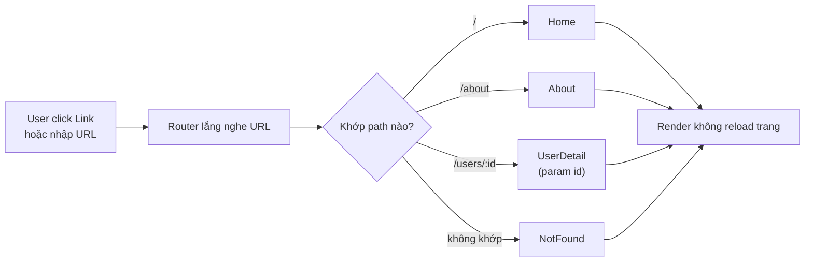
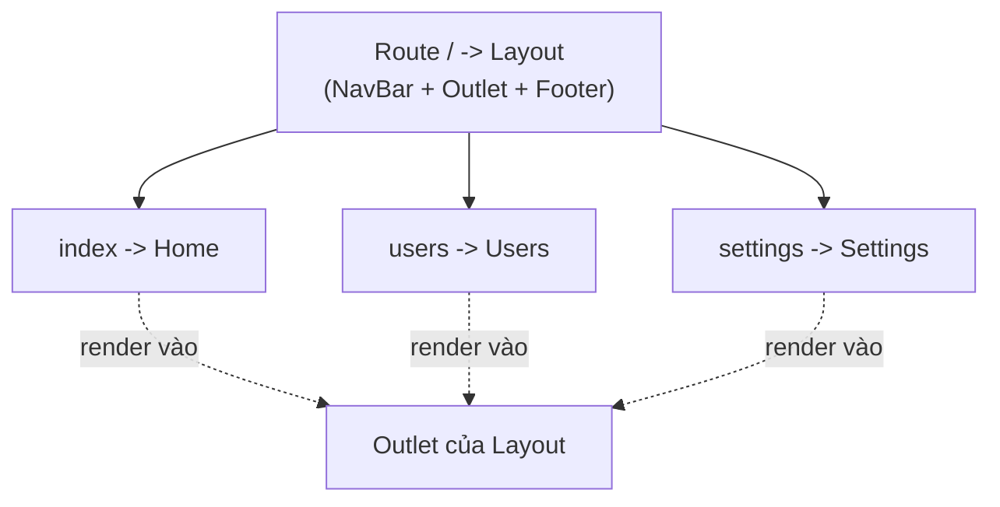
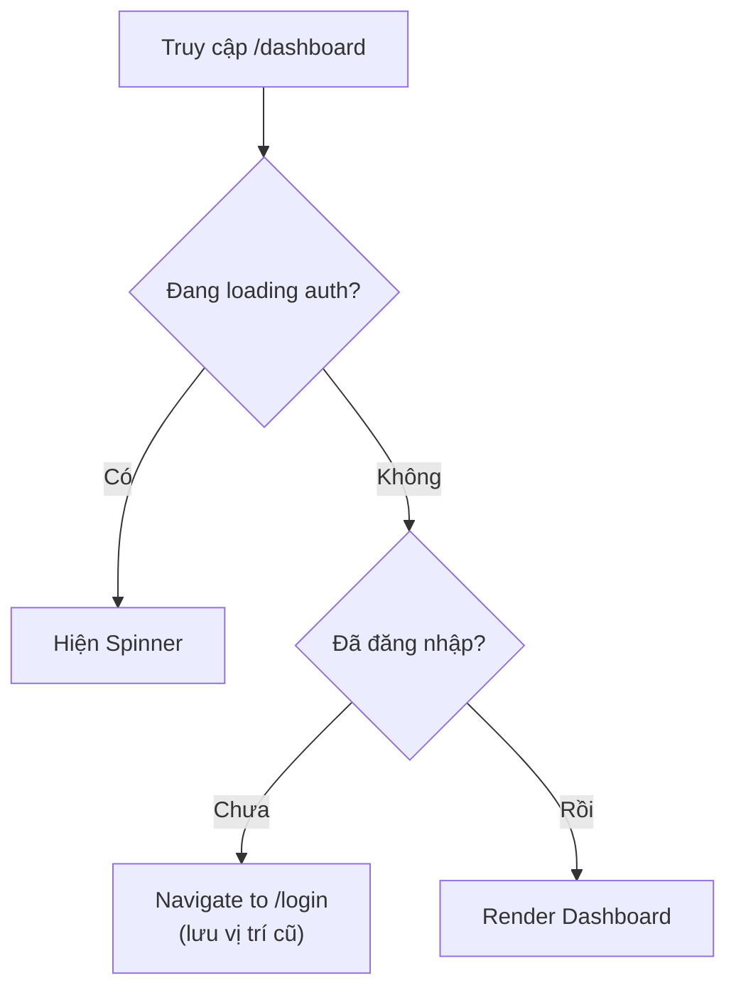

# Routing trong React

**Routing** (định tuyến) là cơ chế quyết định hiển thị giao diện nào tương ứng với từng đường dẫn URL trên trình duyệt. Vì React thường xây dựng **SPA** (single-page application, ứng dụng một trang, không tải lại toàn trang khi chuyển trang), nên ta cần thư viện routing để chuyển trang mượt mà mà không reload. Bài này giới thiệu các giải pháp phổ biến như React Router cùng cách lấy **route params** (tham số động trên URL, ví dụ id của một bài viết).

---

:::note[Ghi nhớ nhanh]

- ⭐ **Routing ánh xạ URL → component** để tạo nhiều "trang" trong SPA mà không reload; React core không có sẵn, phải dùng thư viện.
- **React Router phổ biến nhất** (`BrowserRouter`, `Routes`, `Route`, `Link`); TanStack Router type-safe end-to-end, file-based.
- **Route params** — đọc param động bằng `useParams`, query string bằng `useSearchParams`.
- **Nested routes** chia sẻ layout qua `<Outlet />`; **Protected route** wrap kiểm tra auth rồi `<Navigate to="/login">` nếu chưa đăng nhập.
- **Điều hướng** — `useNavigate` (imperative), `<Navigate>` (declarative), `<Link>`/`<NavLink>` thay `<a>` để không reload trang.
- ⭐ **React Router v7 đã merge Remix** — thêm loader/action và server rendering, opt-in; API client routing gần như không đổi.

:::

---

## Mục lục

- [Vì sao cần router?](#vì-sao-cần-router)
- [Tổng quan](#tổng-quan)
- [React Router (phổ biến nhất)](#react-router-phổ-biến-nhất)
- [TanStack Router](#tanstack-router)
- [Route params](#route-params)
- [Nested Routes](#nested-routes)
- [Protected Routes](#protected-routes)
- [Navigation và Redirect](#navigation-và-redirect)

---

## Vì sao cần router?

**Vấn đề:**

```jsx
// React mặc định là SPA — chỉ render MỘT trang duy nhất.
// Muốn nhiều "trang" (/, /about, /users/:id) ta phải tự lắng nghe URL,
// tự gọi History API để đổi địa chỉ, tự xử lý nút back/forward...
function App() {
  const [path, setPath] = useState(window.location.pathname);

  useEffect(() => {
    const onPop = () => setPath(window.location.pathname); // back/forward
    window.addEventListener("popstate", onPop);
    return () => window.removeEventListener("popstate", onPop);
  }, []);

  // Tự ánh xạ path → component, rất rối và dễ sai
  if (path === "/") return <Home />;
  if (path === "/about") return <About />;
  // còn /users/:id động? nested layout? route bảo vệ? → bế tắc
  return <NotFound />;
}

// Nếu dùng <a href> hoặc reload cả trang → mất luôn trải nghiệm SPA.
```

**Giải pháp:**

```jsx
// Router (React Router...) ánh xạ URL → component giúp ta.
// Điều hướng KHÔNG reload, hỗ trợ route động, nested layout, route bảo vệ.
import { BrowserRouter, Routes, Route } from "react-router-dom";

function App() {
  return (
    <BrowserRouter>
      <Routes>
        <Route path="/" element={<Home />} />
        <Route path="/about" element={<About />} />
        <Route path="/users/:id" element={<UserDetail />} /> {/* route động */}
        <Route path="*" element={<NotFound />} />
      </Routes>
    </BrowserRouter>
  );
}
// back/forward, link chia sẻ được URL, bookmark... router lo hết.
```

Sơ đồ dưới đây minh hoạ luồng router ánh xạ URL thành component tương ứng:



:::tip[Dùng thực tế]

- **Nhiều "trang" trong SPA**: tách `/`, `/about`, `/dashboard`... mà không reload toàn trang.
- **URL chia sẻ / bookmark được**: gửi link `/users/42` cho người khác, mở ra đúng trang đó.
- **Route động**: `/product/:id`, `/post/:slug` — một component phục vụ vô số URL.
- **Bảo vệ trang cần đăng nhập**: chặn `/dashboard`, tự chuyển về `/login` nếu chưa auth.

:::

---

## Tổng quan

React core **không có routing built-in**. Phải dùng thư viện:

| Thư viện | Đặc điểm |
|----------|----------|
| **React Router** | Phổ biến nhất, v7 mới có data API |
| **TanStack Router** | Type-safe, file-based, mới |
| **Next.js Router** | Built-in trong Next.js (file-based) |
| **Wouter** | Nhỏ gọn (~1KB), API tương tự RR |

---

## React Router (phổ biến nhất)

```bash
npm install react-router-dom
```

```jsx
import { BrowserRouter, Routes, Route, Link } from "react-router-dom";

function App() {
  return (
    <BrowserRouter>
      <nav>
        <Link to="/">Home</Link>
        <Link to="/about">About</Link>
        <Link to="/users">Users</Link>
      </nav>

      <Routes>
        <Route path="/" element={<Home />} />
        <Route path="/about" element={<About />} />
        <Route path="/users" element={<Users />} />
        <Route path="*" element={<NotFound />} />
      </Routes>
    </BrowserRouter>
  );
}
```

Element của `<Route>` là JSX component, không phải string component name.

---

## TanStack Router

[TanStack Router](https://tanstack.com/router) — router mới của TanStack
team, **type-safe end-to-end**, file-based.

```bash
npm install @tanstack/react-router
```

Cấu trúc file-based:

```
src/routes/
├── __root.tsx       # layout chung
├── index.tsx        # / 
├── about.tsx        # /about
├── users/
│   ├── index.tsx    # /users
│   └── $userId.tsx  # /users/:userId
```

:::info[Phân tích]

**Tại sao TanStack Router đáng chú ý?**

- **Type-safe param**: `useParams()` trả về object có type chính xác theo
  route definition, không phải `Record<string, string>`.
- **Search params type-safe**: query string được parse + validate qua
  Zod (`?page=2&filter=active` → `{ page: 2, filter: "active" }`).
- **Data loader**: load data trước khi render route (giống Remix).
- **Cache integration**: tích hợp tốt với TanStack Query.
- **Code splitting tự động** qua file-based.

```tsx
// users.$userId.tsx
import { createFileRoute } from "@tanstack/react-router";

export const Route = createFileRoute("/users/$userId")({
  loader: ({ params }) => fetchUser(params.userId),
  component: UserPage,
});

function UserPage() {
  const { userId } = Route.useParams(); // type: string, không null
  const user = Route.useLoaderData();    // type: User
  return <div>{user.name}</div>;
}
```

Trade-off: setup phức tạp hơn React Router, ecosystem nhỏ hơn (mới).
Phù hợp project mới TypeScript-first. Project có sẵn React Router → cứ
giữ.

:::

---

## Route params

```jsx
// React Router
<Route path="/users/:userId" element={<UserDetail />} />

function UserDetail() {
  const { userId } = useParams();
  return <p>User {userId}</p>;
}
```

Optional params:

```jsx
<Route path="/products/:category?" element={<Products />} />

// /products → category = undefined
// /products/electronics → category = "electronics"
```

Catch-all (splat):

```jsx
<Route path="/docs/*" element={<Docs />} />

function Docs() {
  const { "*": rest } = useParams();
  // /docs/a/b/c → rest = "a/b/c"
}
```

Query params:

```jsx
import { useSearchParams } from "react-router-dom";

function Search() {
  const [params, setParams] = useSearchParams();
  const query = params.get("q") ?? "";
  const page = parseInt(params.get("page") ?? "1");

  const next = () => setParams({ q: query, page: String(page + 1) });

  return /* ... */;
}
```

---

## Nested Routes

Route lồng nhau cho **shared layout**:

```jsx
function App() {
  return (
    <BrowserRouter>
      <Routes>
        <Route path="/" element={<Layout />}>
          <Route index element={<Home />} />
          <Route path="users" element={<Users />} />
          <Route path="settings" element={<Settings />} />
        </Route>
      </Routes>
    </BrowserRouter>
  );
}

function Layout() {
  return (
    <>
      <NavBar />
      <main>
        <Outlet />  {/* nơi render child route */}
      </main>
      <Footer />
    </>
  );
}
```

`<Outlet />` là placeholder render route con — pattern thay cho `children`
trong layout.

Sơ đồ cây route lồng nhau với layout dùng chung:



---

## Protected Routes

Luồng kiểm tra quyền truy cập trước khi vào trang được bảo vệ:



Pattern wrap route cần auth:

```jsx
function ProtectedRoute({ children }) {
  const { user, loading } = useAuth();

  if (loading) return <Spinner />;
  if (!user) return <Navigate to="/login" replace />;

  return children;
}

// Dùng
<Routes>
  <Route path="/login" element={<Login />} />
  <Route
    path="/dashboard"
    element={
      <ProtectedRoute>
        <Dashboard />
      </ProtectedRoute>
    }
  />
</Routes>
```

Hoặc qua **layout route**:

```jsx
<Route path="/" element={<ProtectedRoute><Layout /></ProtectedRoute>}>
  <Route path="dashboard" element={<Dashboard />} />
  <Route path="settings" element={<Settings />} />
</Route>
```

:::tip[Mẹo]

**Lưu vị trí trước khi redirect login** — sau khi login quay lại:

```jsx
function ProtectedRoute({ children }) {
  const { user } = useAuth();
  const location = useLocation();

  if (!user) {
    return <Navigate to="/login" state={{ from: location }} replace />;
  }
  return children;
}

function Login() {
  const navigate = useNavigate();
  const location = useLocation();
  const from = location.state?.from?.pathname ?? "/";

  const handleSubmit = async () => {
    await login(...);
    navigate(from, { replace: true });
  };
}
```

Pattern UX chuẩn — user không bị "đẩy về home" sau khi login.

:::

---

## Navigation và Redirect

**Imperative — `useNavigate`**:

```jsx
import { useNavigate } from "react-router-dom";

function LogoutButton() {
  const navigate = useNavigate();

  const handleLogout = async () => {
    await api.logout();
    navigate("/login", { replace: true });
  };

  return <button onClick={handleLogout}>Logout</button>;
}
```

`replace: true` — thay thế history entry hiện tại thay vì push (không
back được sau navigate).

**Declarative — `<Navigate>`**:

```jsx
function Home() {
  if (shouldRedirect) {
    return <Navigate to="/login" replace />;
  }
  return <div>Home</div>;
}
```

**`<Link>`** — thay cho `<a>` để không reload page:

```jsx
<Link to="/about">About</Link>

// Active state
<NavLink
  to="/about"
  className={({ isActive }) => isActive ? "font-bold" : ""}
>
  About
</NavLink>
```

:::warning[Cần lưu ý]

**Đừng dùng `<a href>` cho navigation nội bộ** — sẽ reload toàn trang,
mất state, tải lại bundle:

```jsx
// Sai
<a href="/about">About</a>

// Đúng
<Link to="/about">About</Link>
```

Chỉ dùng `<a>` cho:
- Link **ngoài domain** (`https://...`).
- Link đến file download.
- Link `mailto:`, `tel:`.

`<Link>` của React Router intercept click, dùng History API thay vì
reload — instant navigation.

:::

:::info[Phân tích]

**React Router v7 (2024)** đã merge với **Remix**:

- `react-router` package = full framework (như Remix).
- `react-router/dom` = chỉ routing client-side.
- Hỗ trợ loader, action, form action giống Remix.
- Server rendering built-in.

Migrate từ v6 → v7: docs có codemod sẵn. API client routing **không đổi**
nhiều. Server features là feature thêm, opt-in.

Lựa chọn 2026:

- **SPA thuần**: React Router v7 client-only hoặc TanStack Router.
- **SSR/full-stack**: Next.js (App Router) hoặc React Router v7 framework
  mode (formerly Remix).
- **Type-safe TS first**: TanStack Router.
- **Existing app**: stick with current → migrate khi cần.

:::
