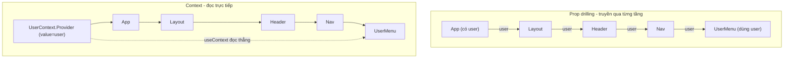
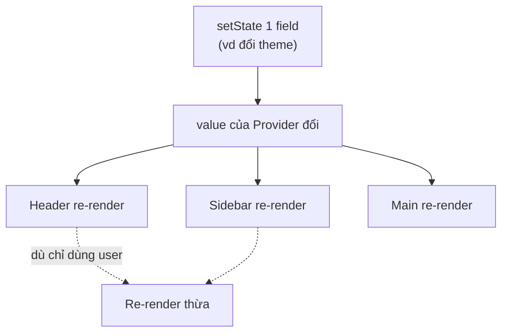

# Context API

**Context API** là tính năng có sẵn của React giúp chia sẻ dữ liệu giữa nhiều component mà không phải truyền **props** (dữ liệu truyền từ component cha xuống con) qua từng cấp một, tránh tình trạng **prop drilling** (truyền props lòng vòng qua nhiều tầng trung gian). Bạn tạo một Context, bọc cây component bằng **Provider** (thành phần cung cấp dữ liệu) rồi dùng `useContext` để đọc dữ liệu ở bất kỳ component con nào. Đây là cách quản lý state dùng chung đơn giản, không cần cài thêm thư viện ngoài.

---

:::note[Ghi nhớ nhanh]

- ⭐ **Context API chia sẻ data xuống subtree không cần prop drilling** — `createContext` → `Provider` bọc cây → `useContext` đọc ở bất kỳ component con nào.
- ⭐ **Mọi consumer re-render khi value đổi và không có selector** — chỉ hợp với data ít đổi (theme, auth, locale, feature flag).
- **Pattern chuẩn** — gói Context + Provider + custom hook trong 1 file; hook `throw` error nếu dùng ngoài Provider (type-safe, defensive).
- **Object literal làm value tạo mới mỗi render** → nên `useMemo` để tránh re-render thừa.
- **Không hợp với** form state (đổi mỗi keystroke), real-time data — nên dùng Zustand/Jotai/Redux Toolkit có selector.
- **Tránh Provider hell** — gộp/compose các provider; chia nhỏ context theo tần suất cập nhật, mỗi context một concern.

:::

---

## Mục lục

- [Vì sao có Context API?](#vì-sao-có-context-api)
- [Context là gì?](#context-là-gì)
- [createContext và Provider](#createcontext-và-provider)
- [useContext](#usecontext)
- [Pattern Context + custom hook](#pattern-context--custom-hook)
- [Hạn chế của Context](#hạn-chế-của-context)
- [Câu hỏi phỏng vấn](#câu-hỏi-phỏng-vấn)

---

## Vì sao có Context API?

**Vấn đề:** dữ liệu cần dùng ở nhiều component nằm sâu trong cây (theme, user đăng nhập, ngôn ngữ). Nếu truyền bằng props qua từng tầng → **prop drilling**: component trung gian phải nhận và chuyển tiếp props nó không hề dùng tới, code rối và khó bảo trì.

```jsx
// App đọc user, nhưng phải truyền tay qua từng tầng tới UserMenu
function App() {
  const [user, setUser] = useState();
  return <Layout user={user} />;        // Layout không dùng user
}

function Layout({ user }) {
  return <Header user={user} />;        // Header không dùng user
}

function Header({ user }) {
  return <Nav user={user} />;           // Nav không dùng user
}

function Nav({ user }) {
  return <UserMenu user={user} />;      // mãi tới đây mới dùng
}
```

**Giải pháp:** **Context API** — đặt một **Provider** ở trên cây để cung cấp giá trị, mọi component con đọc trực tiếp bằng `useContext` mà **không** cần truyền props qua từng tầng. Tầng trung gian không phải biết gì về `user`.

```jsx
const UserContext = createContext(null);

function App() {
  const [user, setUser] = useState();
  return (
    <UserContext.Provider value={user}>
      <Layout />                         {/* không cần prop user */}
    </UserContext.Provider>
  );
}

function UserMenu() {
  const user = useContext(UserContext); // đọc thẳng, bỏ qua các tầng trên
  return <span>{user?.name}</span>;
}
```

Sơ đồ so sánh prop drilling và Context Provider/Consumer:



Lưu ý: Context hợp cho dữ liệu **ít thay đổi** (global). Nếu giá trị đổi liên tục dễ gây re-render trên diện rộng.

:::tip[Dùng thực tế]

- **Theme sáng/tối** — chia sẻ chế độ giao diện cho mọi component.
- **User / auth** — thông tin người đăng nhập, hàm `login` / `logout`.
- **Ngôn ngữ (i18n)** — locale hiện tại và hàm dịch.
- **Cấu hình toàn cục** — feature flag, thông tin app dùng ở khắp nơi.

:::

---

## Context là gì?

**Context** = cơ chế built-in của React để **truyền data xuống subtree**
mà không phải pass prop từng cấp (prop drilling).

```
App
└── Layout
    └── Header
        └── Nav
            └── UserMenu  ← cần user data
```

Không có Context, phải pass `user` qua 4 cấp:

```jsx
<App>
  <Layout user={user}>
    <Header user={user}>
      <Nav user={user}>
        <UserMenu user={user} />
```

Với Context:

```jsx
<UserContext.Provider value={user}>
  <App />  {/* mọi component sâu trong subtree đọc được user */}
</UserContext.Provider>
```

---

## createContext và Provider

```jsx
import { createContext } from "react";

const ThemeContext = createContext("light"); // default value

function App() {
  const [theme, setTheme] = useState("dark");

  return (
    <ThemeContext.Provider value={theme}>
      <Layout />
    </ThemeContext.Provider>
  );
}
```

Provider có thể lồng nhau:

```jsx
<UserContext.Provider value={user}>
  <ThemeContext.Provider value={theme}>
    <LocaleContext.Provider value={locale}>
      <App />
    </LocaleContext.Provider>
  </ThemeContext.Provider>
</UserContext.Provider>
```

---

## useContext

```jsx
import { useContext } from "react";

function Button() {
  const theme = useContext(ThemeContext);
  return <button className={theme}>Click</button>;
}
```

Khi `value` của Provider đổi → **mọi consumer dùng `useContext`** re-render.

---

## Pattern Context + custom hook

Pattern chuẩn — wrap Context + Provider + custom hook trong 1 file:

```tsx
import { createContext, useContext, useState, ReactNode } from "react";

interface AuthContextValue {
  user: User | null;
  login: (email: string, pw: string) => Promise<void>;
  logout: () => void;
}

const AuthContext = createContext<AuthContextValue | null>(null);

export function AuthProvider({ children }: { children: ReactNode }) {
  const [user, setUser] = useState<User | null>(null);

  const login = async (email: string, pw: string) => {
    const u = await api.login(email, pw);
    setUser(u);
  };

  const logout = () => setUser(null);

  return (
    <AuthContext.Provider value={{ user, login, logout }}>
      {children}
    </AuthContext.Provider>
  );
}

export function useAuth() {
  const ctx = useContext(AuthContext);
  if (!ctx) {
    throw new Error("useAuth phải dùng trong AuthProvider");
  }
  return ctx;
}
```

Dùng:

```jsx
// Top-level
<AuthProvider>
  <App />
</AuthProvider>

// Bất kỳ component
function Profile() {
  const { user, logout } = useAuth();
  return <button onClick={logout}>{user.name}</button>;
}
```

:::info[Phân tích]

**Lợi ích pattern này:**

1. **Encapsulation** — implementation Context giấu trong file, caller
   chỉ thấy hook.
2. **Type-safe** — hook trả về type non-null, không cần check ở mọi
   call site.
3. **Defensive** — throw error nếu dùng ngoài Provider → bug rõ ràng,
   không silent.
4. **Refactor dễ** — đổi từ Context sang Zustand chỉ cần đổi `useAuth`
   implementation.

Đây là pattern de-facto cho mọi Context trong React app hiện đại.

:::

---

## Hạn chế của Context

**1. Mọi consumer re-render khi value đổi**:

Sơ đồ minh hoạ: chỉ cần một field trong value đổi, toàn bộ consumer đều re-render:



```jsx
const AppContext = createContext();

function App() {
  const [user, setUser] = useState();
  const [theme, setTheme] = useState();
  const [notifs, setNotifs] = useState([]);

  return (
    <AppContext.Provider value={{ user, theme, notifs, setUser, setTheme }}>
      <Header />   {/* re-render khi BẤT KỲ field đổi */}
      <Sidebar />
      <Main />
    </AppContext.Provider>
  );
}
```

**2. Object literal làm value → re-render mỗi render parent**:

```jsx
// Tệ — value mới mỗi render
<AppContext.Provider value={{ user, theme }}>

// Tốt — memoize
const value = useMemo(() => ({ user, theme }), [user, theme]);
<AppContext.Provider value={value}>
```

**3. Không có selector** — đọc 1 field cũng nhận toàn bộ value:

```jsx
// Component chỉ cần `theme` nhưng re-render khi `user` đổi
function ThemedButton() {
  const { theme } = useAuth();
  return <button className={theme} />;
}
```

:::warning[Cần lưu ý]

**Context phù hợp với data hiếm đổi:**

- Theme (đổi vài lần / session).
- Auth (đổi khi login/logout).
- Locale (đổi rare).
- Feature flag.

**Không phù hợp với:**

- Form state (đổi mỗi keystroke).
- Real-time data (đổi liên tục).
- App state phức tạp (nhiều subscriber với pattern khác nhau).

Với 3 case này, dùng **Zustand**, **Jotai**, hoặc **Redux Toolkit** —
có selector, optimization built-in.

:::

**4. Provider hell**:

```jsx
<AuthProvider>
  <ThemeProvider>
    <LocaleProvider>
      <ToastProvider>
        <ModalProvider>
          <App />
        </ModalProvider>
      </ToastProvider>
    </LocaleProvider>
  </ThemeProvider>
</AuthProvider>
```

→ Hard to read. Combine helper:

```jsx
function Providers({ children }) {
  return (
    <AuthProvider>
      <ThemeProvider>
        <LocaleProvider>
          <ToastProvider>
            <ModalProvider>
              {children}
            </ModalProvider>
          </ToastProvider>
        </LocaleProvider>
      </ThemeProvider>
    </AuthProvider>
  );
}

// Hoặc compose function — gọn hơn
const Providers = composeProviders(
  AuthProvider, ThemeProvider, LocaleProvider, ToastProvider, ModalProvider
);
```

:::tip[Mẹo]

**Chia nhỏ context theo "update frequency"**:

```jsx
// User ít đổi
<UserContext.Provider value={user}>

// Theme ít đổi
<ThemeContext.Provider value={theme}>

// Toast đổi nhiều — tách riêng để không re-render User/Theme consumer
<ToastContext.Provider value={toasts}>
```

Quy tắc: **mỗi Context = 1 concern**, không nhồi nhiều thứ vào cùng object.
Một số dev tách thêm:

- `UserStateContext` cho data.
- `UserDispatchContext` cho action (setter).

→ Component dùng `useUserState` re-render khi data đổi, dùng `useUserDispatch`
không re-render (vì dispatch ổn định).

:::

---

## Câu hỏi phỏng vấn

Những câu thường gặp về chủ đề này. Tự trả lời trước, rồi đối chiếu lại với nội dung phía trên.

1. Context API giải quyết vấn đề gì? Mô tả `prop drilling` và vì sao nó gây khó bảo trì khi cây component sâu.
2. Kể ba bước để dùng Context: `createContext`, `Provider`, `useContext` — mỗi bước làm gì?
3. Tham số `defaultValue` trong `createContext` được dùng khi nào? Nếu component không nằm trong `Provider` nào thì `useContext` trả về gì?
4. Vì sao nhiều team đặt `defaultValue` là `null` rồi cho custom hook `throw` error thay vì đưa một giá trị mặc định hợp lệ?
5. Giải thích cơ chế React quyết định component nào re-render khi `value` của `Provider` thay đổi. So sánh nó với cơ chế của `React.memo`.
6. Vì sao truyền object literal trực tiếp vào `value` lại gây re-render thừa? `useMemo` khắc phục điều đó ra sao và khi nào `useMemo` vẫn không cứu được?
7. `React.memo` bọc component con có chặn được re-render do Context gây ra không? Giải thích tại sao.
8. Context không có `selector`. Nêu ít nhất ba cách giải quyết khi chỉ muốn subscribe một phần của value.
9. Vì sao nên tách `StateContext` và `DispatchContext` thành hai context riêng? Lợi ích cụ thể về re-render là gì?
10. Khi nào bạn kết hợp `useReducer` với Context thay vì `useState`? Mô hình này giống và khác Redux ở điểm nào?
11. So sánh Context API và Redux: Context có phải là công cụ quản lý state không, hay chỉ là cơ chế truyền dữ liệu? Giải thích sự khác biệt.
12. Câu kinh điển: khi nào Context là đủ, khi nào bắt buộc phải chuyển sang Redux/Zustand/Jotai? Nêu tiêu chí cụ thể để ra quyết định.
13. Loại dữ liệu nào hợp với Context (theme, auth, locale, feature flag) và loại nào không (form state, real-time)? Nguyên tắc chung phía sau là gì?
14. `Provider hell` là gì? Bạn xử lý bằng cách nào — gộp provider, viết hàm `composeProviders`, hay chia lại context?
15. Nếu có hai `Provider` cùng loại context lồng nhau, component con đọc được giá trị nào? Cơ chế nào quyết định điều đó?
16. Trong React 19, có thể viết `Context` trực tiếp làm component provider thay cho `Context.Provider` — thay đổi này ảnh hưởng gì tới code cũ?
17. Context hoạt động thế nào với Server Components trong Next.js App Router? Vì sao provider thường phải đánh dấu `use client`?
18. Bạn test một component phụ thuộc Context như thế nào? Cách nào để cung cấp giá trị giả trong unit test mà không dựng cả cây app?
19. Một trang bị lag vì Context re-render diện rộng. Mô tả quy trình bạn dùng để chẩn đoán (React DevTools Profiler, `why-did-you-render`) và các bước tối ưu theo thứ tự ưu tiên.
