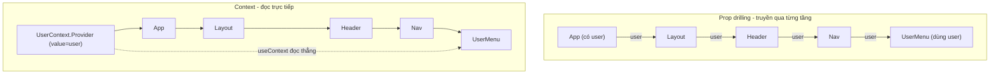
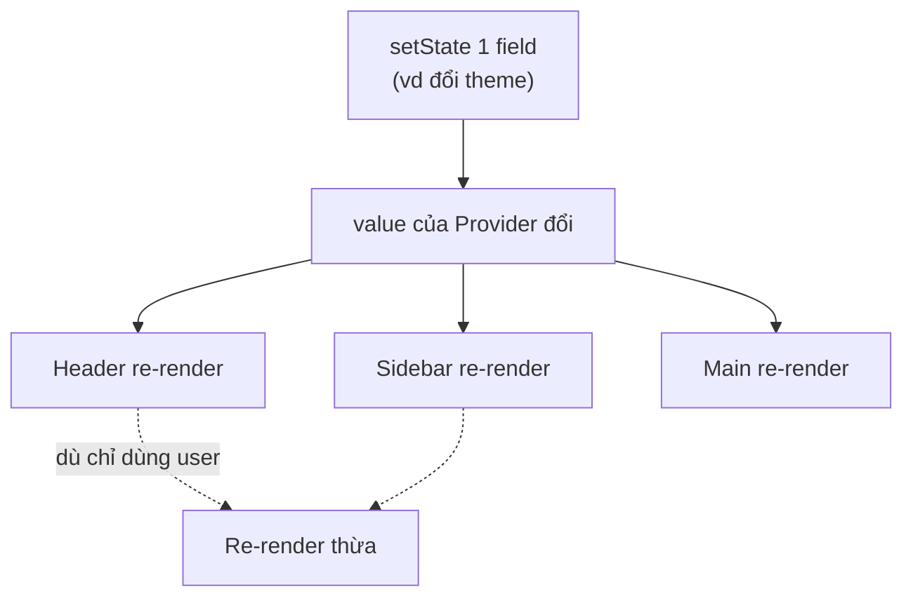

# Context API

**Context API** là tính năng có sẵn của React giúp chia sẻ dữ liệu giữa nhiều component mà không phải truyền **props** (dữ liệu truyền từ component cha xuống con) qua từng cấp một, tránh tình trạng **prop drilling** (truyền props lòng vòng qua nhiều tầng trung gian). Bạn tạo một Context, bọc cây component bằng **Provider** (thành phần cung cấp dữ liệu) rồi dùng `useContext` để đọc dữ liệu ở bất kỳ component con nào. Đây là cách quản lý state dùng chung đơn giản, không cần cài thêm thư viện ngoài.

[](pathname:///img/react/context-api.webp)

---

:::note[Ghi nhớ nhanh]

- ⭐ **Context API chia sẻ data xuống subtree không cần prop drilling** — `createContext` → `Provider` bọc cây → `useContext` đọc ở bất kỳ component con nào.
- ⭐ **Mọi consumer re-render khi value đổi và không có selector** — chỉ hợp với data ít đổi (theme, auth, locale, feature flag).
- **Pattern chuẩn** — gói Context + Provider + custom hook trong 1 file; hook `throw` error nếu dùng ngoài Provider (type-safe, defensive).
- **Object literal làm value tạo mới mỗi render** → nên `useMemo` để tránh re-render thừa.
- **Không hợp với** form state (đổi mỗi keystroke), real-time data — nên dùng Zustand/Jotai/Redux Toolkit có selector.
- **Tránh Provider hell** — gộp/compose các provider; chia nhỏ context theo tần suất cập nhật, mỗi context một concern.

:::

---

## Mục lục

- [Vì sao có Context API?](#vì-sao-có-context-api)
- [Context là gì?](#context-là-gì)
- [createContext và Provider](#createcontext-và-provider)
- [useContext](#usecontext)
- [Pattern Context + custom hook](#pattern-context--custom-hook)
- [Hạn chế của Context](#hạn-chế-của-context)
- [Câu hỏi phỏng vấn](#câu-hỏi-phỏng-vấn)

---

## Vì sao có Context API?

**Vấn đề:** dữ liệu cần dùng ở nhiều component nằm sâu trong cây (theme, user đăng nhập, ngôn ngữ). Nếu truyền bằng props qua từng tầng → **prop drilling**: component trung gian phải nhận và chuyển tiếp props nó không hề dùng tới, code rối và khó bảo trì.

```jsx
// App đọc user, nhưng phải truyền tay qua từng tầng tới UserMenu
function App() {
  const [user, setUser] = useState();
  return <Layout user={user} />;        // Layout không dùng user
}

function Layout({ user }) {
  return <Header user={user} />;        // Header không dùng user
}

function Header({ user }) {
  return <Nav user={user} />;           // Nav không dùng user
}

function Nav({ user }) {
  return <UserMenu user={user} />;      // mãi tới đây mới dùng
}
```

**Giải pháp:** **Context API** — đặt một **Provider** ở trên cây để cung cấp giá trị, mọi component con đọc trực tiếp bằng `useContext` mà **không** cần truyền props qua từng tầng. Tầng trung gian không phải biết gì về `user`.

```jsx
const UserContext = createContext(null);

function App() {
  const [user, setUser] = useState();
  return (
    <UserContext.Provider value={user}>
      <Layout />                         {/* không cần prop user */}
    </UserContext.Provider>
  );
}

function UserMenu() {
  const user = useContext(UserContext); // đọc thẳng, bỏ qua các tầng trên
  return <span>{user?.name}</span>;
}
```

Sơ đồ so sánh prop drilling và Context Provider/Consumer:



Lưu ý: Context hợp cho dữ liệu **ít thay đổi** (global). Nếu giá trị đổi liên tục dễ gây re-render trên diện rộng.

:::tip[Dùng thực tế]

- **Theme sáng/tối** — chia sẻ chế độ giao diện cho mọi component.
- **User / auth** — thông tin người đăng nhập, hàm `login` / `logout`.
- **Ngôn ngữ (i18n)** — locale hiện tại và hàm dịch.
- **Cấu hình toàn cục** — feature flag, thông tin app dùng ở khắp nơi.

:::

---

## Context là gì?

**Context** = cơ chế built-in của React để **truyền data xuống subtree**
mà không phải pass prop từng cấp (prop drilling).

```
App
└── Layout
    └── Header
        └── Nav
            └── UserMenu  ← cần user data
```

Không có Context, phải pass `user` qua 4 cấp:

```jsx
<App>
  <Layout user={user}>
    <Header user={user}>
      <Nav user={user}>
        <UserMenu user={user} />
```

Với Context:

```jsx
<UserContext.Provider value={user}>
  <App />  {/* mọi component sâu trong subtree đọc được user */}
</UserContext.Provider>
```

---

## createContext và Provider

```jsx
import { createContext } from "react";

const ThemeContext = createContext("light"); // default value

function App() {
  const [theme, setTheme] = useState("dark");

  return (
    <ThemeContext.Provider value={theme}>
      <Layout />
    </ThemeContext.Provider>
  );
}
```

Provider có thể lồng nhau:

```jsx
<UserContext.Provider value={user}>
  <ThemeContext.Provider value={theme}>
    <LocaleContext.Provider value={locale}>
      <App />
    </LocaleContext.Provider>
  </ThemeContext.Provider>
</UserContext.Provider>
```

---

## useContext

```jsx
import { useContext } from "react";

function Button() {
  const theme = useContext(ThemeContext);
  return <button className={theme}>Click</button>;
}
```

Khi `value` của Provider đổi → **mọi consumer dùng `useContext`** re-render.

---

## Pattern Context + custom hook

Pattern chuẩn — wrap Context + Provider + custom hook trong 1 file:

```tsx
import { createContext, useContext, useState, ReactNode } from "react";

interface AuthContextValue {
  user: User | null;
  login: (email: string, pw: string) => Promise<void>;
  logout: () => void;
}

const AuthContext = createContext<AuthContextValue | null>(null);

export function AuthProvider({ children }: { children: ReactNode }) {
  const [user, setUser] = useState<User | null>(null);

  const login = async (email: string, pw: string) => {
    const u = await api.login(email, pw);
    setUser(u);
  };

  const logout = () => setUser(null);

  return (
    <AuthContext.Provider value={{ user, login, logout }}>
      {children}
    </AuthContext.Provider>
  );
}

export function useAuth() {
  const ctx = useContext(AuthContext);
  if (!ctx) {
    throw new Error("useAuth phải dùng trong AuthProvider");
  }
  return ctx;
}
```

Dùng:

```jsx
// Top-level
<AuthProvider>
  <App />
</AuthProvider>

// Bất kỳ component
function Profile() {
  const { user, logout } = useAuth();
  return <button onClick={logout}>{user.name}</button>;
}
```

:::info[Phân tích]

**Lợi ích pattern này:**

1. **Encapsulation** — implementation Context giấu trong file, caller
   chỉ thấy hook.
2. **Type-safe** — hook trả về type non-null, không cần check ở mọi
   call site.
3. **Defensive** — throw error nếu dùng ngoài Provider → bug rõ ràng,
   không silent.
4. **Refactor dễ** — đổi từ Context sang Zustand chỉ cần đổi `useAuth`
   implementation.

Đây là pattern de-facto cho mọi Context trong React app hiện đại.

:::

---

## Hạn chế của Context

**1. Mọi consumer re-render khi value đổi**:

Sơ đồ minh hoạ: chỉ cần một field trong value đổi, toàn bộ consumer đều re-render:



```jsx
const AppContext = createContext();

function App() {
  const [user, setUser] = useState();
  const [theme, setTheme] = useState();
  const [notifs, setNotifs] = useState([]);

  return (
    <AppContext.Provider value={{ user, theme, notifs, setUser, setTheme }}>
      <Header />   {/* re-render khi BẤT KỲ field đổi */}
      <Sidebar />
      <Main />
    </AppContext.Provider>
  );
}
```

**2. Object literal làm value → re-render mỗi render parent**:

```jsx
// Tệ — value mới mỗi render
<AppContext.Provider value={{ user, theme }}>

// Tốt — memoize
const value = useMemo(() => ({ user, theme }), [user, theme]);
<AppContext.Provider value={value}>
```

**3. Không có selector** — đọc 1 field cũng nhận toàn bộ value:

```jsx
// Component chỉ cần `theme` nhưng re-render khi `user` đổi
function ThemedButton() {
  const { theme } = useAuth();
  return <button className={theme} />;
}
```

:::warning[Cần lưu ý]

**Context phù hợp với data hiếm đổi:**

- Theme (đổi vài lần / session).
- Auth (đổi khi login/logout).
- Locale (đổi rare).
- Feature flag.

**Không phù hợp với:**

- Form state (đổi mỗi keystroke).
- Real-time data (đổi liên tục).
- App state phức tạp (nhiều subscriber với pattern khác nhau).

Với 3 case này, dùng **Zustand**, **Jotai**, hoặc **Redux Toolkit** —
có selector, optimization built-in.

:::

**4. Provider hell**:

```jsx
<AuthProvider>
  <ThemeProvider>
    <LocaleProvider>
      <ToastProvider>
        <ModalProvider>
          <App />
        </ModalProvider>
      </ToastProvider>
    </LocaleProvider>
  </ThemeProvider>
</AuthProvider>
```

→ Hard to read. Combine helper:

```jsx
function Providers({ children }) {
  return (
    <AuthProvider>
      <ThemeProvider>
        <LocaleProvider>
          <ToastProvider>
            <ModalProvider>
              {children}
            </ModalProvider>
          </ToastProvider>
        </LocaleProvider>
      </ThemeProvider>
    </AuthProvider>
  );
}

// Hoặc compose function — gọn hơn
const Providers = composeProviders(
  AuthProvider, ThemeProvider, LocaleProvider, ToastProvider, ModalProvider
);
```

:::tip[Mẹo]

**Chia nhỏ context theo "update frequency"**:

```jsx
// User ít đổi
<UserContext.Provider value={user}>

// Theme ít đổi
<ThemeContext.Provider value={theme}>

// Toast đổi nhiều — tách riêng để không re-render User/Theme consumer
<ToastContext.Provider value={toasts}>
```

Quy tắc: **mỗi Context = 1 concern**, không nhồi nhiều thứ vào cùng object.
Một số dev tách thêm:

- `UserStateContext` cho data.
- `UserDispatchContext` cho action (setter).

→ Component dùng `useUserState` re-render khi data đổi, dùng `useUserDispatch`
không re-render (vì dispatch ổn định).

:::

---

## Câu hỏi phỏng vấn

Những câu thường gặp về chủ đề này. Tự trả lời trước, rồi bấm **Xem đáp án** để đối chiếu.

**1. Context API giải quyết vấn đề gì? Mô tả `prop drilling` và vì sao nó gây khó bảo trì khi cây component sâu.**

<details className="qa">
<summary>Xem đáp án</summary>

**Prop drilling** là việc truyền props qua nhiều tầng component trung gian chỉ để đưa dữ liệu tới một component nằm sâu, trong khi các tầng ở giữa **không hề dùng** dữ liệu đó:

```jsx
function App()    { return <Layout user={user} />; }   // Layout không dùng
function Layout({ user })  { return <Header user={user} />; }  // Header không dùng
function Header({ user })  { return <Nav user={user} />; }     // Nav không dùng
function Nav({ user })     { return <UserMenu user={user} />; } // mãi đây mới dùng
```

Vì sao khó bảo trì:

- Thêm một field mới phải sửa **mọi tầng** trên đường đi.
- Component trung gian bị "ô nhiễm" bởi prop không liên quan, khó tái sử dụng ở chỗ khác.
- Signature của component phình to, khó đọc, khó test.
- Refactor cấu trúc cây là phải đi lại toàn bộ chuỗi truyền.

**Context API** cắt đứt chuỗi đó: đặt một `Provider` ở trên cây, component nào cần thì gọi `useContext` đọc thẳng — các tầng trung gian không phải biết gì về dữ liệu.

</details>

**2. Kể ba bước để dùng Context: `createContext`, `Provider`, `useContext` — mỗi bước làm gì?**

<details className="qa">
<summary>Xem đáp án</summary>

**Bước 1 — `createContext(defaultValue)`**: tạo đối tượng context, thường đặt ở module scope để import được nhiều nơi.

```jsx
const ThemeContext = createContext("light");
```

**Bước 2 — `Provider`**: bọc phần cây cần chia sẻ dữ liệu và truyền giá trị qua prop `value`. Phạm vi ảnh hưởng đúng bằng subtree bên trong.

```jsx
function App() {
  const [theme, setTheme] = useState("dark");
  return (
    <ThemeContext.Provider value={theme}>
      <Layout />
    </ThemeContext.Provider>
  );
}
```

**Bước 3 — `useContext`**: đọc giá trị ở bất kỳ component con nào, dù sâu bao nhiêu tầng.

```jsx
function Button() {
  const theme = useContext(ThemeContext);
  return <button className={theme}>Click</button>;
}
```

Trong thực tế người ta gói cả ba vào **một file**, chỉ export `Provider` và một custom hook (`useTheme`) — phần còn lại giấu đi.

</details>

**3. Tham số `defaultValue` trong `createContext` được dùng khi nào? Nếu component không nằm trong `Provider` nào thì `useContext` trả về gì?**

<details className="qa">
<summary>Xem đáp án</summary>

`defaultValue` **chỉ được dùng khi component gọi `useContext` mà phía trên nó không có bất kỳ `Provider` nào** của context đó. Nếu có Provider, giá trị của Provider luôn thắng — kể cả khi Provider truyền `undefined`.

```jsx
const ThemeContext = createContext("light");

function Button() {
  const theme = useContext(ThemeContext);
  return <button className={theme} />;
}

// Không có Provider → theme = "light" (defaultValue)
<Button />

// Có Provider → theme = "dark"
<ThemeContext.Provider value="dark"><Button /></ThemeContext.Provider>
```

Nếu không truyền gì cho `createContext()` thì `defaultValue` là `undefined`.

Điểm hay gây bug: quên bọc Provider sẽ **không báo lỗi** — component âm thầm dùng default value, UI hiện sai mà không ai biết. Đó là lý do có câu hỏi tiếp theo về việc cố ý đặt default là `null`.

`defaultValue` cũng rất tiện khi viết test hoặc render component độc lập trong Storybook mà không muốn dựng Provider.

</details>

**4. Vì sao nhiều team đặt `defaultValue` là `null` rồi cho custom hook `throw` error thay vì đưa một giá trị mặc định hợp lệ?**

<details className="qa">
<summary>Xem đáp án</summary>

Vì một giá trị mặc định "hợp lệ" sẽ **che giấu lỗi**. Nếu ai đó quên bọc `AuthProvider`, component vẫn chạy với `user = null` giả và bạn phải đi truy tại sao màn hình trống — một **silent bug**. Đặt `null` + `throw` biến nó thành lỗi nổ ngay, kèm thông điệp chỉ đúng nguyên nhân:

```tsx
const AuthContext = createContext<AuthContextValue | null>(null);

export function useAuth() {
  const ctx = useContext(AuthContext);
  if (!ctx) {
    throw new Error("useAuth phải dùng trong AuthProvider");
  }
  return ctx; // TypeScript hiểu đây là non-null
}
```

Hai lợi ích:

- **Defensive** — sai là biết ngay lúc dev, không lọt ra production.
- **Type-safe** — nhờ narrowing, hook trả về type non-null, nên mọi nơi gọi `useAuth()` không phải kiểm tra `if (!ctx)` hay viết `ctx?.user` nữa.

Ngoại lệ: với context thực sự có mặc định hợp lý và dùng được độc lập (theme mặc định `"light"`, locale `"vi"`) thì đưa giá trị thật lại tiện hơn.

</details>

**5. Giải thích cơ chế React quyết định component nào re-render khi `value` của `Provider` thay đổi. So sánh nó với cơ chế của `React.memo`.**

<details className="qa">
<summary>Xem đáp án</summary>

Khi `value` của Provider đổi, React so sánh giá trị mới và cũ bằng **`Object.is`**. Nếu khác, React đi tìm **mọi component trong subtree đang subscribe context đó** (gọi `useContext` hoặc dùng `Context.Consumer`) và **đánh dấu chúng cần re-render** — bất kể chúng dùng field nào trong value, bất kể props của chúng có đổi hay không.

Điểm khác biệt cốt lõi so với `React.memo`:

| | Luồng props thông thường | Context |
|---|---|---|
| Lan truyền | Cha render → con render, theo từng tầng | Nhảy thẳng tới consumer, bỏ qua tầng giữa |
| `React.memo` | Chặn được nếu props không đổi | **Không chặn được** |
| Độ chi tiết | Theo từng prop | Theo cả object `value`, không có selector |

`React.memo` chỉ so sánh **props**. Việc một component đọc context là một kênh subscribe riêng, nằm ngoài props — nên memo không biết gì để so sánh và không thể ngăn cập nhật này. Đây chính là lý do Context không phải công cụ tối ưu re-render, và vì sao các thư viện như Zustand/Jotai với selector lại tồn tại.

</details>

**6. Vì sao truyền object literal trực tiếp vào `value` lại gây re-render thừa? `useMemo` khắc phục điều đó ra sao và khi nào `useMemo` vẫn không cứu được?**

<details className="qa">
<summary>Xem đáp án</summary>

Object literal tạo **tham chiếu mới ở mỗi lần render** của component chứa Provider. React so sánh `value` bằng `Object.is` nên luôn thấy "đã đổi", dù nội dung y hệt → mọi consumer re-render, kể cả khi `user` và `theme` chẳng thay đổi gì.

```jsx
// Tệ — object mới mỗi render
<AppContext.Provider value={{ user, theme }}>

// Tốt — chỉ tạo object mới khi user hoặc theme đổi
const value = useMemo(() => ({ user, theme }), [user, theme]);
<AppContext.Provider value={value}>
```

**Khi `useMemo` vẫn không cứu được:**

- Một trong các dependency bản thân nó đã **không ổn định** — ví dụ hàm `login` định nghĩa inline mỗi render; phải bọc thêm `useCallback`.
- **Giá trị thật sự đổi thường xuyên** (mỗi keystroke, mỗi tick). Lúc này memo hoá vô nghĩa, vấn đề nằm ở thiết kế: phải **chia nhỏ context** theo tần suất cập nhật, hoặc chuyển sang store có selector.
- Consumer chỉ dùng một field nhưng field khác đổi — memo giữ nguyên tham chiếu cũ thì không sao, nhưng khi field kia đổi thật thì cả nhóm vẫn re-render.

</details>

**7. `React.memo` bọc component con có chặn được re-render do Context gây ra không? Giải thích tại sao.**

<details className="qa">
<summary>Xem đáp án</summary>

**Không**, nếu chính component đó gọi `useContext`.

`React.memo` hoạt động bằng cách so sánh **props** cũ và mới; props giống nhau thì bỏ qua render. Nhưng `useContext` là một **kênh subscribe độc lập với props**. Khi value đổi, React đánh dấu trực tiếp từng consumer là "cần cập nhật", và cờ này được kiểm tra **trước** phép so sánh props của memo.

```jsx
const Child = React.memo(function Child() {
  const { theme } = useContext(AppContext); // vẫn re-render khi value đổi
  return <button className={theme} />;
});
```

`memo` **có** tác dụng trong một trường hợp: nó chặn re-render lan xuống **con của consumer**. Tức là khi `Child` re-render vì context, các con của `Child` được bọc `memo` và nhận props không đổi vẫn được bỏ qua.

Muốn thực sự chặn, phải giảm phạm vi subscribe: tách context nhỏ hơn, tách phần đọc context ra một component riêng bọc quanh phần nội dung (`children` truyền từ ngoài vào), hoặc dùng store có selector.

</details>

**8. Context không có `selector`. Nêu ít nhất ba cách giải quyết khi chỉ muốn subscribe một phần của value.**

<details className="qa">
<summary>Xem đáp án</summary>

1. **Chia nhỏ context theo concern / tần suất đổi** — mỗi context một việc: `UserContext`, `ThemeContext`, `ToastContext`. Component chỉ subscribe cái nó cần, `toast` đổi liên tục không đụng tới consumer của `user`.

2. **Tách state và dispatch thành hai context** — `UserStateContext` và `UserDispatchContext`. Component chỉ gọi action (không đọc data) sẽ không bao giờ re-render vì dispatch ổn định.

3. **Truyền `children` từ ngoài vào** — component đọc context chỉ bọc quanh, phần cây con được tạo ở tầng trên nên giữ nguyên element reference và không render lại.

```jsx
function ThemeWrapper({ children }) {
  const theme = useContext(ThemeContext);
  return <div className={theme}>{children}</div>;
}
```

4. **Dùng thư viện có selector** — Zustand, Jotai, Redux Toolkit với `useSelector`: chỉ re-render khi đúng mảnh state được chọn thay đổi. Đây là giải pháp triệt để cho state đổi nhiều.

5. **`use-context-selector`** — thư viện cộng đồng thêm khả năng selector cho Context (React chưa có API chính thức).

</details>

**9. Vì sao nên tách `StateContext` và `DispatchContext` thành hai context riêng? Lợi ích cụ thể về re-render là gì?**

<details className="qa">
<summary>Xem đáp án</summary>

Vì hai thứ này có **vòng đời hoàn toàn khác nhau**: state đổi liên tục, còn hàm dispatch (từ `useReducer`) hoặc các setter của `useState` là **ổn định — React đảm bảo giữ nguyên tham chiếu suốt vòng đời component**.

Nếu nhồi chung một object `{ state, dispatch }`, component chỉ cần gọi action cũng bị kéo theo mỗi lần state đổi.

```jsx
const StateContext = createContext(null);
const DispatchContext = createContext(null);

function Provider({ children }) {
  const [state, dispatch] = useReducer(reducer, initial);
  return (
    <DispatchContext.Provider value={dispatch}>
      <StateContext.Provider value={state}>{children}</StateContext.Provider>
    </DispatchContext.Provider>
  );
}
```

**Lợi ích cụ thể:** một nút "Thêm vào giỏ" chỉ cần `useDispatch()` — nó **không bao giờ re-render** khi giỏ hàng thay đổi, vì `dispatch` không đổi tham chiếu. Chỉ những component thật sự hiển thị dữ liệu (`useCartState()`) mới render lại.

Lợi ích phụ: không cần `useMemo` cho value dispatch, và ranh giới "đọc" / "ghi" trong code rõ ràng hơn.

</details>

**10. Khi nào bạn kết hợp `useReducer` với Context thay vì `useState`? Mô hình này giống và khác Redux ở điểm nào?**

<details className="qa">
<summary>Xem đáp án</summary>

Dùng `useReducer` + Context khi:

- State có **nhiều field liên quan lẫn nhau** và các bước chuyển trạng thái phức tạp (wizard nhiều bước, giỏ hàng, bộ lọc nhiều tiêu chí).
- Cập nhật tiếp theo **phụ thuộc state trước**, có nhiều loại hành động khác nhau.
- Muốn logic cập nhật tập trung tại một chỗ, dễ test (reducer là hàm thuần).

```jsx
const [state, dispatch] = useReducer(cartReducer, initialCart);
dispatch({ type: "add_item", payload: item });
```

**Giống Redux:** cùng mô hình một store dữ liệu, action mô tả "chuyện gì xảy ra", reducer thuần tính state mới, component gửi action qua `dispatch`.

**Khác Redux:**

| | useReducer + Context | Redux Toolkit |
|---|---|---|
| Phạm vi | Theo subtree của Provider | Một store toàn cục |
| Selector | Không có → re-render toàn bộ consumer | `useSelector`, chỉ re-render khi mảnh đã chọn đổi |
| Middleware, async | Tự lo | Thunk, listener, RTK Query |
| DevTools | Không có time-travel | Có |
| Chi phí | 0 dependency | Thêm thư viện, thêm boilerplate |

</details>

**11. So sánh Context API và Redux: Context có phải là công cụ quản lý state không, hay chỉ là cơ chế truyền dữ liệu? Giải thích sự khác biệt.**

<details className="qa">
<summary>Xem đáp án</summary>

Context **không phải là công cụ quản lý state** — nó là một **cơ chế vận chuyển (dependency injection)**. Bản thân Context không lưu gì cả: state vẫn nằm trong `useState` / `useReducer` của component Provider; Context chỉ làm nhiệm vụ đưa giá trị đó xuống subtree mà không qua props.

Một công cụ quản lý state đúng nghĩa (Redux, Zustand) cung cấp thêm:

- Nơi lưu state **nằm ngoài cây React**.
- **Selector** để subscribe chọn lọc, tối ưu re-render.
- Quy ước cập nhật (action, reducer, immutability).
- Middleware cho async, logging, persist.
- DevTools, time-travel debugging.

Cách nói gọn: **Redux = Context (vận chuyển) + store + selector + middleware**. Thực tế `react-redux` cũng dùng Context để đưa store xuống cây, nhưng phần subscribe thì nó tự làm để có được selector.

Vì vậy câu "dùng Context thay Redux" chỉ đúng khi nhu cầu của bạn thực sự chỉ là vận chuyển vài giá trị ít đổi.

</details>

**12. Câu kinh điển: khi nào Context là đủ, khi nào bắt buộc phải chuyển sang Redux/Zustand/Jotai? Nêu tiêu chí cụ thể để ra quyết định.**

<details className="qa">
<summary>Xem đáp án</summary>

**Context là đủ khi:**

- Dữ liệu **ít thay đổi** — theme, user đăng nhập, locale, feature flag.
- Số lượng consumer vừa phải, không có vấn đề hiệu năng đo được.
- Logic cập nhật đơn giản, không cần middleware hay async phức tạp.
- Muốn tránh thêm dependency.

**Nên chuyển sang thư viện khi gặp ít nhất một trong các dấu hiệu:**

- State **đổi với tần suất cao** (mỗi keystroke, dữ liệu real-time, con trỏ chuột) và Profiler cho thấy re-render diện rộng.
- Cần **subscribe chọn lọc** — nhiều component đọc các mảnh khác nhau của cùng một khối state lớn.
- Cần **middleware / async** có tổ chức: cache, retry, optimistic update, undo/redo, persist.
- Cần **DevTools, time-travel** để debug luồng state phức tạp.
- Số provider phình to thành "provider hell" và bạn đã bắt đầu tự viết lại selector bằng tay.

Một lưu ý quan trọng: rất nhiều "global state" thực chất là **server state** — thứ đó nên giao cho TanStack Query chứ không phải Context lẫn Redux. Sau khi tách server state ra, phần client state còn lại thường nhỏ tới mức Context là đủ.

</details>

**13. Loại dữ liệu nào hợp với Context (theme, auth, locale, feature flag) và loại nào không (form state, real-time)? Nguyên tắc chung phía sau là gì?**

<details className="qa">
<summary>Xem đáp án</summary>

**Hợp với Context:**

| Dữ liệu | Tần suất đổi |
|---|---|
| Theme sáng/tối | Vài lần mỗi phiên |
| User / auth | Khi login, logout |
| Locale (i18n) | Rất hiếm |
| Feature flag, cấu hình app | Gần như không đổi |

**Không hợp:**

- **Form state** — đổi mỗi lần gõ phím; dùng state cục bộ hoặc React Hook Form.
- **Real-time data** — giá cổ phiếu, chat, vị trí con trỏ; đổi liên tục.
- **App state phức tạp** với nhiều nhóm subscriber đọc các mảnh khác nhau.

**Nguyên tắc chung:** Context phát tán cập nhật tới **mọi** consumer và **không có selector**. Nên chi phí của một lần cập nhật tỉ lệ với số consumer. Công thức thô: *tần suất đổi × số consumer = chi phí*. Giữ tích số đó nhỏ thì Context rất tốt; tích số lớn thì phải chia nhỏ context hoặc chuyển sang store có selector.

Hệ quả thực tế: mỗi Context nên gói **một concern**, không nhồi nhiều thứ khác tần suất vào chung một object.

</details>

**14. `Provider hell` là gì? Bạn xử lý bằng cách nào — gộp provider, viết hàm `composeProviders`, hay chia lại context?**

<details className="qa">
<summary>Xem đáp án</summary>

**Provider hell** là tình trạng phần gốc của app bị lồng hàng chục tầng Provider, thụt lề sâu, khó đọc và khó thêm bớt:

```jsx
<AuthProvider>
  <ThemeProvider>
    <LocaleProvider>
      <ToastProvider>
        <ModalProvider>
          <App />
```

Các cách xử lý, theo thứ tự nên thử:

**Gom vào một component `Providers`** — vẫn lồng nhau nhưng giấu hết vào một file, phần `App` sạch sẽ:

```jsx
function Providers({ children }) {
  return <AuthProvider><ThemeProvider>{children}</ThemeProvider></AuthProvider>;
}
```

**Viết `composeProviders`** — gộp mảng provider thành một, phẳng và dễ thêm bớt:

```jsx
const Providers = composeProviders(
  AuthProvider, ThemeProvider, LocaleProvider, ToastProvider
);
```

**Chia lại context** — đây mới là cách trị gốc. Xem lại có provider nào thừa không, có thứ nào thực ra là server state (giao cho TanStack Query), có thứ nào chỉ dùng trong một nhánh nhỏ thì **đặt provider ngay tại nhánh đó** thay vì ở gốc app. Một số concern (toast, modal) có thể thay bằng store nhỏ ngoài React, không cần provider.

</details>

**15. Nếu có hai `Provider` cùng loại context lồng nhau, component con đọc được giá trị nào? Cơ chế nào quyết định điều đó?**

<details className="qa">
<summary>Xem đáp án</summary>

Component đọc giá trị của **Provider gần nhất phía trên nó** trong cây component. Provider bên trong **che** (shadow) Provider bên ngoài với toàn bộ subtree của nó.

```jsx
<ThemeContext.Provider value="light">
  <A />                                  {/* A đọc "light" */}
  <ThemeContext.Provider value="dark">
    <B />                                {/* B đọc "dark" */}
  </ThemeContext.Provider>
</ThemeContext.Provider>
```

Cơ chế: khi gặp `useContext`, React **đi ngược lên cây (fiber tree)** từ component hiện tại, dừng ở Provider đầu tiên của đúng context object đó và lấy `value`. Nếu không gặp Provider nào thì mới dùng `defaultValue` của `createContext`.

Lưu ý quan trọng: việc "gần nhất" tính theo **cây component lúc render**, không phải theo cấu trúc thư mục hay thứ tự import. Và hai context được tạo bởi hai lời gọi `createContext` khác nhau là **hai context hoàn toàn riêng biệt**, dù cùng tên biến.

Ứng dụng thực tế: ghi đè theme cho một khu vực (widget nhúng, modal nền tối), hay đổi locale cho một phần trang.

</details>

**16. Trong React 19, có thể viết `Context` trực tiếp làm component provider thay cho `Context.Provider` — thay đổi này ảnh hưởng gì tới code cũ?**

<details className="qa">
<summary>Xem đáp án</summary>

React 19 cho phép render thẳng chính context object làm provider, bỏ bớt `.Provider`:

```jsx
const ThemeContext = createContext("light");

// React 19
<ThemeContext value="dark">
  <App />
</ThemeContext>

// Cách cũ — vẫn chạy
<ThemeContext.Provider value="dark">
  <App />
</ThemeContext.Provider>
```

**Ảnh hưởng tới code cũ: gần như không có.** Đây là bổ sung cú pháp, không phải breaking change — `Context.Provider` vẫn hoạt động bình thường, chỉ bị đánh dấu là sẽ deprecated trong tương lai và React có codemod để chuyển đổi hàng loạt.

Cũng trong React 19: `Context.Consumer` (kiểu render props cũ) bị deprecated, khuyến khích dùng `useContext` — hoặc hook `use(Context)` mới, vốn còn gọi được trong điều kiện.

Hành vi thì **không đổi**: vẫn là Provider gần nhất thắng, vẫn so sánh `value` bằng `Object.is`, vẫn không có selector. Lưu ý dự án phải thực sự chạy React 19 mới dùng được cú pháp này.

</details>

**17. Context hoạt động thế nào với Server Components trong Next.js App Router? Vì sao provider thường phải đánh dấu `use client`?**

<details className="qa">
<summary>Xem đáp án</summary>

**Server Components không dùng được Context.** Chúng chạy một lần trên server, render ra kết quả rồi thôi — không có state, không có hook, không có vòng đời. Mà Context gắn chặt với cơ chế render và subscribe ở client.

Vì vậy mọi Provider phải là **Client Component**:

```jsx
"use client";

export function ThemeProvider({ children }) {
  const [theme, setTheme] = useState("light");
  const value = useMemo(() => ({ theme, setTheme }), [theme]);
  return <ThemeContext value={value}>{children}</ThemeContext>;
}
```

Điểm quan trọng và hay bị hiểu nhầm: đánh dấu `use client` cho Provider **không** biến toàn bộ cây con thành client. Nếu bạn truyền Server Component vào qua prop `children`, phần đó vẫn được render trên server rồi "cắm" vào chỗ `children` — đây chính là lý do nên bọc provider ở `layout.tsx` và truyền `children` xuống, thay vì import trực tiếp các trang vào trong provider.

Với dữ liệu lấy từ server, App Router khuyến khích fetch ngay trong Server Component hoặc truyền qua props, thay vì nhét vào Context.

</details>

**18. Bạn test một component phụ thuộc Context như thế nào? Cách nào để cung cấp giá trị giả trong unit test mà không dựng cả cây app?**

<details className="qa">
<summary>Xem đáp án</summary>

Cách đơn giản nhất: **bọc component cần test bằng chính Provider** và truyền value giả, dùng option `wrapper` của React Testing Library.

```jsx
function renderWithAuth(ui, value) {
  return render(
    <AuthContext value={value}>{ui}</AuthContext>
  );
}

test("hiện tên user", () => {
  renderWithAuth(<Profile />, { user: { name: "Thuan" }, logout: jest.fn() });
  expect(screen.getByText("Thuan")).toBeInTheDocument();
});
```

Vài lưu ý thực hành:

- Viết sẵn một helper `renderWithProviders` gom mọi provider hay dùng, nhận `overrides` cho từng test — tránh lặp lại setup.
- Nếu Provider thật có side effect (gọi API khi mount), hãy dùng context object trực tiếp với value giả thay vì dựng Provider thật, hoặc mock module chứa Provider.
- Test **custom hook** bằng `renderHook` kèm `wrapper` là Provider; nhớ test luôn nhánh `throw` khi dùng ngoài Provider.
- Ưu tiên test hành vi người dùng nhìn thấy, không test giá trị context trực tiếp.

</details>

**19. Một trang bị lag vì Context re-render diện rộng. Mô tả quy trình bạn dùng để chẩn đoán (React DevTools Profiler, `why-did-you-render`) và các bước tối ưu theo thứ tự ưu tiên.**

<details className="qa">
<summary>Xem đáp án</summary>

**Chẩn đoán trước, tối ưu sau** — đừng đoán.

1. **React DevTools Profiler** — ghi lại một tương tác bị lag, xem biểu đồ flamegraph: component nào render, render bao lâu, và quan trọng nhất là cột "Why did this render?" (bật trong Settings). Nếu lý do là *"Context changed"* thì đã xác định đúng thủ phạm.
2. **Bật "Highlight updates when components render"** để thấy trực quan vùng nào nhấp nháy mỗi lần gõ phím.
3. **`why-did-you-render`** (hoặc log trong dev) để bắt các re-render do tham chiếu đổi mà nội dung không đổi.

Thứ tự tối ưu:

1. **`useMemo` cho `value` của Provider** (kèm `useCallback` cho các hàm bên trong) — rẻ nhất, sửa ngay được lỗi object literal.
2. **Chia nhỏ context** theo concern và tần suất cập nhật; tách state/dispatch thành hai context.
3. **Thu hẹp phạm vi Provider** — đặt nó ở nhánh thật sự cần, không đặt ở gốc app.
4. **Truyền `children` từ ngoài vào** để phần cây con không render lại; dùng `React.memo` cho các nhánh con nặng.
5. **Đổi sang store có selector** (Zustand/Jotai) hoặc tách server state sang TanStack Query — khi các bước trên không đủ.

Sau mỗi bước, đo lại bằng Profiler để xác nhận có cải thiện thật.

</details>
