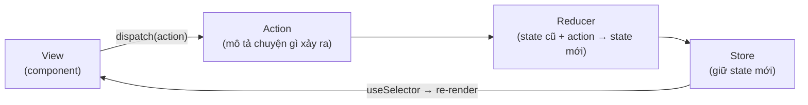

# State Management Libraries

**State management libraries** (thư viện quản lý state) là các thư viện ngoài giúp tổ chức và chia sẻ **state** (trạng thái, dữ liệu thay đổi theo thời gian) trên toàn ứng dụng một cách gọn gàng hơn khi dự án lớn dần. Khi state dùng chung trở nên phức tạp, Context API có thể chưa đủ tối ưu, nên ta dùng các thư viện như Zustand, Jotai hay Redux Toolkit. Bài này so sánh các lựa chọn phổ biến để bạn chọn công cụ phù hợp với nhu cầu.

---

:::note[Ghi nhớ nhanh]

- ⭐ **Thư viện state (Zustand, Jotai, Redux Toolkit, MobX) tối ưu re-render theo selector/atom** — kèm DevTools/middleware/persist khi Context không đủ.
- ⭐ **Zustand khuyến nghị cho ~90% trường hợp** — nhẹ ~1KB, không cần Provider, subscribe theo selector nên chỉ re-render đúng phần cần.
- **Jotai** atomic state (fine-grained, hợp form lớn); **Redux Toolkit** theo Flux, DevTools mạnh + RTK Query; **MobX** observable OOP-style.
- **Phân biệt 3 loại state** — server (TanStack Query), URL (`useSearchParams`), client (`useState`/Zustand); dùng đúng tool cho đúng loại.
- **Đừng over-engineer** — tiến trình tự nhiên: `useState` → lift state up → Context → state manager; đa số app dừng ở bước 2–3.

:::

---

## Mục lục

- [Vì sao cần thư viện state management?](#vì-sao-cần-thư-viện-state-management)
- [Tổng quan](#tổng-quan)
- [Zustand (khuyến nghị)](#zustand-khuyến-nghị)
- [Jotai](#jotai)
- [Redux Toolkit](#redux-toolkit)
- [MobX](#mobx)
- [Khi nào cần state management?](#khi-nào-cần-state-management)
- [Câu hỏi phỏng vấn](#câu-hỏi-phỏng-vấn)

---

## Vì sao cần thư viện state management?

**Vấn đề:** App lớn có nhiều state chia sẻ giữa các phần ở xa nhau. Chỉ dùng `useState` + Context khiến mọi consumer re-render khi 1 field đổi, luồng cập nhật khó debug, khó cắm middleware/devtools/persist.

```jsx
// Context "mập" — mọi consumer re-render khi BẤT KỲ field nào đổi
const AppContext = createContext(null);

function AppProvider({ children }) {
  const [user, setUser] = useState(null);
  const [cart, setCart] = useState([]);
  const [theme, setTheme] = useState("light");

  // Object value tạo mới mỗi render → re-render lan rộng
  const value = { user, setUser, cart, setCart, theme, setTheme };
  return <AppContext.Provider value={value}>{children}</AppContext.Provider>;
}

// Component chỉ cần theme vẫn re-render khi cart đổi
function ThemeToggle() {
  const { theme, setTheme } = useContext(AppContext);
  return <button onClick={() => setTheme(t => t === "light" ? "dark" : "light")}>{theme}</button>;
}
```

**Giải pháp:** Thư viện state (Redux Toolkit, Zustand, Jotai...) cho store tập trung hoặc atom, cập nhật có kỷ luật, tối ưu re-render theo **selector/atom**, kèm DevTools/middleware/persist. Mỗi thư viện đánh đổi khác nhau — Zustand/Jotai ít boilerplate, Redux Toolkit nhiều cấu trúc + devtools mạnh.

```jsx
import { create } from "zustand";

const useAppStore = create((set) => ({
  user: null,
  cart: [],
  theme: "light",
  toggleTheme: () => set(s => ({ theme: s.theme === "light" ? "dark" : "light" })),
}));

// Chỉ subscribe theme → KHÔNG re-render khi cart hay user đổi
function ThemeToggle() {
  const theme = useAppStore(s => s.theme);
  const toggleTheme = useAppStore(s => s.toggleTheme);
  return <button onClick={toggleTheme}>{theme}</button>;
}
```

:::tip[Dùng thực tế]

- **State toàn cục lớn** — giỏ hàng, auth/session, cache UI dùng chung khắp app.
- **Debug bằng DevTools** — xem từng action, time-travel để tìm bug luồng cập nhật.
- **Chia selector/atom** — mỗi component chỉ subscribe đúng phần cần, tránh re-render lan rộng.
- **App nhiều người phát triển** — store có kỷ luật, quy ước rõ giúp team phối hợp dễ hơn.

:::

---

## Tổng quan

| Lib | Style | Khuyến nghị | Khi nào? |
|-----|-------|-------------|----------|
| **Zustand** | Store đơn giản | **Có** | 90% trường hợp |
| **Jotai** | Atomic state | Có | Form lớn, fine-grained reactivity |
| **Redux Toolkit** | Flux pattern | Có | Codebase lớn, cần devtools mạnh |
| **MobX** | Observable/reactive | Có | OOP style, large state |
| **Recoil** | Atomic (FB) | Không | Maintain mode |

---

## Zustand (khuyến nghị)

[Zustand](https://zustand-demo.pmnd.rs) — nhẹ (~1KB), API đơn giản, **không
cần Provider**.

```bash
npm install zustand
```

```jsx
import { create } from "zustand";

const useCounterStore = create((set) => ({
  count: 0,
  increment: () => set(s => ({ count: s.count + 1 })),
  decrement: () => set(s => ({ count: s.count - 1 })),
  reset: () => set({ count: 0 }),
}));

// Dùng
function Counter() {
  const count = useCounterStore(s => s.count);
  const increment = useCounterStore(s => s.increment);

  return (
    <button onClick={increment}>
      Count: {count}
    </button>
  );
}
```

**Selector** — chỉ re-render khi field cụ thể đổi:

```jsx
// Chỉ subscribe count, không phải toàn bộ store
const count = useCounterStore(s => s.count);

// Multiple field
const { user, theme } = useCounterStore(s => ({ user: s.user, theme: s.theme }), shallow);
```

:::tip[Mẹo]

**Pattern slices** — chia store thành nhiều slice:

```jsx
const createUserSlice = (set) => ({
  user: null,
  login: (u) => set({ user: u }),
});

const createCartSlice = (set) => ({
  cart: [],
  addToCart: (item) => set(s => ({ cart: [...s.cart, item] })),
});

const useStore = create((set) => ({
  ...createUserSlice(set),
  ...createCartSlice(set),
}));
```

Cho phép store lớn vẫn tổ chức được — mỗi file 1 slice.

:::

:::info[Phân tích]

**Tại sao Zustand thắng?**

- **API tối giản** — `create()` + selector. Không action, reducer, dispatch.
- **No Provider** — không phải wrap `<Provider store={...}>`.
- **TS support** tốt từ ngày đầu.
- **Middleware** — persist, devtools, immer, subscribe.
- **Outside React** — gọi `useStore.getState()` từ utility, hook không phải component.
- **Bundle nhẹ** — ~1KB minified gzipped vs Redux ~10KB.

Trade-off: ít "structure" → team lớn cần quy ước. Đa số dự án hiện đại 2024+
chọn Zustand làm default cho client state.

:::

---

## Jotai

[Jotai](https://jotai.org) — **atomic state** từ Recoil team alumni.

```bash
npm install jotai
```

```jsx
import { atom, useAtom } from "jotai";

const countAtom = atom(0);
const doubleAtom = atom(get => get(countAtom) * 2);

function Counter() {
  const [count, setCount] = useAtom(countAtom);
  const [double] = useAtom(doubleAtom);

  return (
    <>
      <p>{count} × 2 = {double}</p>
      <button onClick={() => setCount(c => c + 1)}>+</button>
    </>
  );
}
```

Mỗi atom là **đơn vị nhỏ nhất** — chỉ component đọc atom mới re-render khi
atom đổi. Tốt cho:

- **Form lớn** — mỗi field 1 atom.
- **Real-time data** — fine-grained subscription.
- **Computed/derived** — atom phụ thuộc atom khác.

---

## Redux Toolkit

[Redux Toolkit (RTK)](https://redux-toolkit.js.org) — Redux **chính thức**
khuyến nghị từ team Redux. Đã bao gồm Immer + Thunk + DevTools.

```bash
npm install @reduxjs/toolkit react-redux
```

Redux theo **Flux pattern** — luồng dữ liệu một chiều khép kín, mọi thay
đổi state đều đi qua action → reducer nên dễ trace và debug:



```jsx
import { createSlice, configureStore } from "@reduxjs/toolkit";
import { Provider, useSelector, useDispatch } from "react-redux";

const counterSlice = createSlice({
  name: "counter",
  initialState: { count: 0 },
  reducers: {
    increment: (state) => { state.count++; }, // Immer cho phép "mutate"
    setCount: (state, action) => { state.count = action.payload; },
  },
});

const store = configureStore({
  reducer: { counter: counterSlice.reducer },
});

function App() {
  return (
    <Provider store={store}>
      <Counter />
    </Provider>
  );
}

function Counter() {
  const count = useSelector(s => s.counter.count);
  const dispatch = useDispatch();
  return (
    <button onClick={() => dispatch(counterSlice.actions.increment())}>
      {count}
    </button>
  );
}
```

:::info[Phân tích]

**RTK so với Zustand:**

| | Redux Toolkit | Zustand |
|--|---------------|---------|
| Boilerplate | Trung bình | Cực ít |
| DevTools | Cực mạnh (time-travel) | Có (qua middleware) |
| Middleware ecosystem | Phong phú (saga, observable...) | Cơ bản |
| Learning curve | Cao hơn | Thấp |
| RTK Query | Built-in data fetching | Phải kết hợp TanStack Query |
| Bundle size | ~10KB | ~1KB |
| 2026 popular | Vẫn nhiều legacy | Mới phổ biến |

Chọn RTK khi:

- Team đã quen Redux.
- Dự án rất lớn, cần devtools mạnh.
- Cần RTK Query (built-in caching).
- Cần middleware đặc biệt (saga, listener middleware).

Còn lại → Zustand đơn giản hơn.

:::

---

## MobX

[MobX](https://mobx.js.org) — reactive/observable state, OOP-style.

```bash
npm install mobx mobx-react
```

```jsx
import { makeAutoObservable } from "mobx";
import { observer } from "mobx-react";

class CounterStore {
  count = 0;

  constructor() {
    makeAutoObservable(this);
  }

  increment() {
    this.count++;
  }
}

const counter = new CounterStore();

const Counter = observer(() => (
  <button onClick={() => counter.increment()}>
    {counter.count}
  </button>
));
```

MobX dùng **getter/setter proxy** để track dependency tự động — viết JS
thường, MobX biết component nào dùng field nào.

Phù hợp:

- Codebase quen OOP (chuyển từ Angular, Java).
- State có quan hệ phức tạp (model, relationships).
- Game, editor — UI có nhiều state nested.

---

## Khi nào cần state management?

**Không cần** state management:

- App nhỏ, state cục bộ trong component.
- State chỉ share giữa parent-child gần.
- Server state — dùng **TanStack Query** thay vì state global.

**Cần** state management khi:

- State share giữa **nhiều subtree** không có quan hệ parent-child.
- Logic phức tạp (cart, checkout, multi-step form).
- Cần **persist** state (localStorage).
- Cần **time-travel debug** (Redux DevTools).
- State có **derived values** phức tạp (Jotai/MobX shine).

:::warning[Cần lưu ý]

**Đừng bê state management ngay từ ngày 1**:

```jsx
// Tệ — over-engineer cho counter đơn giản
const useCounter = create(set => ({
  count: 0,
  inc: () => set(s => ({ count: s.count + 1 })),
}));

// Tốt — local state đủ
function Counter() {
  const [count, setCount] = useState(0);
  return <button onClick={() => setCount(c => c + 1)}>{count}</button>;
}
```

Tiến trình tự nhiên:

1. `useState` local.
2. Lift state up khi share giữa siblings.
3. Context cho cross-tree (theme, auth).
4. State manager (Zustand/Jotai) khi context không đủ.

Hầu hết app stop ở bước 2-3. Bước 4 chỉ dành cho app phức tạp thật sự.

:::

:::tip[Mẹo]

**Phân biệt 3 loại state**:

| Loại | Mô tả | Tool |
|------|-------|------|
| **Server state** | Data từ API (user, posts, products) | **TanStack Query**, SWR |
| **URL state** | Filter, page, search trong URL | React Router `useSearchParams` |
| **Client state** | UI state, form, modal | `useState`, Zustand, Jotai |

Quy tắc: **dùng đúng tool cho đúng loại state**. Đa số bug "state management"
xảy ra vì lẫn lộn — vd lưu data từ API vào Redux thay vì TanStack Query.

:::

---

## Câu hỏi phỏng vấn

Những câu thường gặp về chủ đề này. Tự trả lời trước, rồi đối chiếu lại với nội dung phía trên.

1. Vì sao cần thư viện quản lý state khi React đã có `useState` và Context? Nêu những hạn chế cụ thể mà thư viện giải quyết.
2. Phân biệt ba loại state: `server state`, `URL state`, `client state`. Mỗi loại nên dùng công cụ nào và vì sao lẫn lộn chúng lại sinh bug?
3. Câu kinh điển: khi nào Context là đủ, khi nào cần Redux hoặc Zustand? Nêu các dấu hiệu cho thấy đã đến lúc phải đổi.
4. Mô tả luồng dữ liệu `Flux` trong Redux: `action` → `reducer` → `store` → `view`. Vì sao luồng một chiều giúp debug dễ hơn?
5. Redux Toolkit khác Redux thuần ở những điểm nào? `createSlice`, `configureStore` và `Immer` loại bỏ được bao nhiêu boilerplate?
6. Reducer trong Redux phải là hàm thuần (`pure function`). Điều đó nghĩa là gì và vi phạm nó gây hậu quả gì cho time-travel debugging?
7. Immer cho phép viết code trông như `mutate` trực tiếp state. Cơ chế bên dưới hoạt động ra sao và có bẫy nào cần tránh?
8. Zustand không cần `Provider`. Điều đó khả thi nhờ cơ chế nào, và nó tạo ra vấn đề gì với `SSR` hoặc test cần state cô lập?
9. Zustand tối ưu re-render bằng `selector`. Vì sao `useStore(s => ({ a: s.a, b: s.b }))` có thể gây re-render vô hạn, và `shallow` giải quyết ra sao?
10. So sánh mô hình atomic của Jotai với mô hình store tập trung của Zustand. Kịch bản nào Jotai thắng rõ rệt?
11. `derived atom` trong Jotai hoạt động thế nào? So sánh với `createSelector`/`reselect` của Redux về mặt memoization.
12. MobX theo dõi dependency tự động qua proxy. Ưu điểm và nhược điểm của cách tiếp cận ngầm này so với subscribe tường minh bằng selector?
13. Redux DevTools cho time-travel. Cơ chế nào khiến điều đó khả thi, và vì sao Zustand hay MobX khó đạt mức tương đương?
14. `middleware` trong Redux là gì? Mô tả chữ ký hàm ba tầng và một ca dùng thực tế như logging hoặc retry.
15. So sánh `redux-thunk`, `redux-saga` và `listener middleware` cho xử lý bất đồng bộ. Khi nào chi phí học saga là xứng đáng?
16. `RTK Query` và `TanStack Query` chồng lấn nhau ở đâu? Nếu đã dùng Redux Toolkit, bạn chọn cái nào và vì sao?
17. Bạn `persist` state vào `localStorage` như thế nào? Xử lý ra sao khi schema đổi giữa các phiên bản app (migration, versioning)?
18. Store toàn cục và `SSR`/Next.js: vì sao store dạng singleton nguy hiểm trên server, và cách khắc phục là gì?
19. Bạn migrate dần từ Redux sang Zustand trong một codebase lớn đang chạy production như thế nào mà không phải dừng phát triển tính năng?
20. Đội bạn đề xuất đưa Redux vào một app CRUD nhỏ. Bạn phản biện hay đồng ý? Trình bày lập luận dựa trên chi phí và lợi ích cụ thể.
