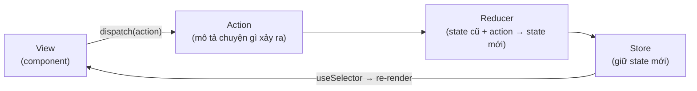

# State Management Libraries

**State management libraries** (thư viện quản lý state) là các thư viện ngoài giúp tổ chức và chia sẻ **state** (trạng thái, dữ liệu thay đổi theo thời gian) trên toàn ứng dụng một cách gọn gàng hơn khi dự án lớn dần. Khi state dùng chung trở nên phức tạp, Context API có thể chưa đủ tối ưu, nên ta dùng các thư viện như Zustand, Jotai hay Redux Toolkit. Bài này so sánh các lựa chọn phổ biến để bạn chọn công cụ phù hợp với nhu cầu.

[](pathname:///img/react/state-libraries.webp)

---

:::note[Ghi nhớ nhanh]

- ⭐ **Thư viện state (Zustand, Jotai, Redux Toolkit, MobX) tối ưu re-render theo selector/atom** — kèm DevTools/middleware/persist khi Context không đủ.
- ⭐ **Zustand khuyến nghị cho ~90% trường hợp** — nhẹ ~1KB, không cần Provider, subscribe theo selector nên chỉ re-render đúng phần cần.
- **Jotai** atomic state (fine-grained, hợp form lớn); **Redux Toolkit** theo Flux, DevTools mạnh + RTK Query; **MobX** observable OOP-style.
- **Phân biệt 3 loại state** — server (TanStack Query), URL (`useSearchParams`), client (`useState`/Zustand); dùng đúng tool cho đúng loại.
- **Đừng over-engineer** — tiến trình tự nhiên: `useState` → lift state up → Context → state manager; đa số app dừng ở bước 2–3.

:::

---

## Mục lục

- [Vì sao cần thư viện state management?](#vì-sao-cần-thư-viện-state-management)
- [Tổng quan](#tổng-quan)
- [Zustand (khuyến nghị)](#zustand-khuyến-nghị)
- [Jotai](#jotai)
- [Redux Toolkit](#redux-toolkit)
- [MobX](#mobx)
- [Khi nào cần state management?](#khi-nào-cần-state-management)
- [Câu hỏi phỏng vấn](#câu-hỏi-phỏng-vấn)

---

## Vì sao cần thư viện state management?

**Vấn đề:** App lớn có nhiều state chia sẻ giữa các phần ở xa nhau. Chỉ dùng `useState` + Context khiến mọi consumer re-render khi 1 field đổi, luồng cập nhật khó debug, khó cắm middleware/devtools/persist.

```jsx
// Context "mập" — mọi consumer re-render khi BẤT KỲ field nào đổi
const AppContext = createContext(null);

function AppProvider({ children }) {
  const [user, setUser] = useState(null);
  const [cart, setCart] = useState([]);
  const [theme, setTheme] = useState("light");

  // Object value tạo mới mỗi render → re-render lan rộng
  const value = { user, setUser, cart, setCart, theme, setTheme };
  return <AppContext.Provider value={value}>{children}</AppContext.Provider>;
}

// Component chỉ cần theme vẫn re-render khi cart đổi
function ThemeToggle() {
  const { theme, setTheme } = useContext(AppContext);
  return <button onClick={() => setTheme(t => t === "light" ? "dark" : "light")}>{theme}</button>;
}
```

**Giải pháp:** Thư viện state (Redux Toolkit, Zustand, Jotai...) cho store tập trung hoặc atom, cập nhật có kỷ luật, tối ưu re-render theo **selector/atom**, kèm DevTools/middleware/persist. Mỗi thư viện đánh đổi khác nhau — Zustand/Jotai ít boilerplate, Redux Toolkit nhiều cấu trúc + devtools mạnh.

```jsx
import { create } from "zustand";

const useAppStore = create((set) => ({
  user: null,
  cart: [],
  theme: "light",
  toggleTheme: () => set(s => ({ theme: s.theme === "light" ? "dark" : "light" })),
}));

// Chỉ subscribe theme → KHÔNG re-render khi cart hay user đổi
function ThemeToggle() {
  const theme = useAppStore(s => s.theme);
  const toggleTheme = useAppStore(s => s.toggleTheme);
  return <button onClick={toggleTheme}>{theme}</button>;
}
```

:::tip[Dùng thực tế]

- **State toàn cục lớn** — giỏ hàng, auth/session, cache UI dùng chung khắp app.
- **Debug bằng DevTools** — xem từng action, time-travel để tìm bug luồng cập nhật.
- **Chia selector/atom** — mỗi component chỉ subscribe đúng phần cần, tránh re-render lan rộng.
- **App nhiều người phát triển** — store có kỷ luật, quy ước rõ giúp team phối hợp dễ hơn.

:::

---

## Tổng quan

| Lib | Style | Khuyến nghị | Khi nào? |
|-----|-------|-------------|----------|
| **Zustand** | Store đơn giản | **Có** | 90% trường hợp |
| **Jotai** | Atomic state | Có | Form lớn, fine-grained reactivity |
| **Redux Toolkit** | Flux pattern | Có | Codebase lớn, cần devtools mạnh |
| **MobX** | Observable/reactive | Có | OOP style, large state |
| **Recoil** | Atomic (FB) | Không | Maintain mode |

---

## Zustand (khuyến nghị)

[Zustand](https://zustand-demo.pmnd.rs) — nhẹ (~1KB), API đơn giản, **không
cần Provider**.

```bash
npm install zustand
```

```jsx
import { create } from "zustand";

const useCounterStore = create((set) => ({
  count: 0,
  increment: () => set(s => ({ count: s.count + 1 })),
  decrement: () => set(s => ({ count: s.count - 1 })),
  reset: () => set({ count: 0 }),
}));

// Dùng
function Counter() {
  const count = useCounterStore(s => s.count);
  const increment = useCounterStore(s => s.increment);

  return (
    <button onClick={increment}>
      Count: {count}
    </button>
  );
}
```

**Selector** — chỉ re-render khi field cụ thể đổi:

```jsx
// Chỉ subscribe count, không phải toàn bộ store
const count = useCounterStore(s => s.count);

// Multiple field
const { user, theme } = useCounterStore(s => ({ user: s.user, theme: s.theme }), shallow);
```

:::tip[Mẹo]

**Pattern slices** — chia store thành nhiều slice:

```jsx
const createUserSlice = (set) => ({
  user: null,
  login: (u) => set({ user: u }),
});

const createCartSlice = (set) => ({
  cart: [],
  addToCart: (item) => set(s => ({ cart: [...s.cart, item] })),
});

const useStore = create((set) => ({
  ...createUserSlice(set),
  ...createCartSlice(set),
}));
```

Cho phép store lớn vẫn tổ chức được — mỗi file 1 slice.

:::

:::info[Phân tích]

**Tại sao Zustand thắng?**

- **API tối giản** — `create()` + selector. Không action, reducer, dispatch.
- **No Provider** — không phải wrap `<Provider store={...}>`.
- **TS support** tốt từ ngày đầu.
- **Middleware** — persist, devtools, immer, subscribe.
- **Outside React** — gọi `useStore.getState()` từ utility, hook không phải component.
- **Bundle nhẹ** — ~1KB minified gzipped vs Redux ~10KB.

Trade-off: ít "structure" → team lớn cần quy ước. Đa số dự án hiện đại 2024+
chọn Zustand làm default cho client state.

:::

---

## Jotai

[Jotai](https://jotai.org) — **atomic state** từ Recoil team alumni.

```bash
npm install jotai
```

```jsx
import { atom, useAtom } from "jotai";

const countAtom = atom(0);
const doubleAtom = atom(get => get(countAtom) * 2);

function Counter() {
  const [count, setCount] = useAtom(countAtom);
  const [double] = useAtom(doubleAtom);

  return (
    <>
      <p>{count} × 2 = {double}</p>
      <button onClick={() => setCount(c => c + 1)}>+</button>
    </>
  );
}
```

Mỗi atom là **đơn vị nhỏ nhất** — chỉ component đọc atom mới re-render khi
atom đổi. Tốt cho:

- **Form lớn** — mỗi field 1 atom.
- **Real-time data** — fine-grained subscription.
- **Computed/derived** — atom phụ thuộc atom khác.

---

## Redux Toolkit

[Redux Toolkit (RTK)](https://redux-toolkit.js.org) — Redux **chính thức**
khuyến nghị từ team Redux. Đã bao gồm Immer + Thunk + DevTools.

```bash
npm install @reduxjs/toolkit react-redux
```

Redux theo **Flux pattern** — luồng dữ liệu một chiều khép kín, mọi thay
đổi state đều đi qua action → reducer nên dễ trace và debug:



```jsx
import { createSlice, configureStore } from "@reduxjs/toolkit";
import { Provider, useSelector, useDispatch } from "react-redux";

const counterSlice = createSlice({
  name: "counter",
  initialState: { count: 0 },
  reducers: {
    increment: (state) => { state.count++; }, // Immer cho phép "mutate"
    setCount: (state, action) => { state.count = action.payload; },
  },
});

const store = configureStore({
  reducer: { counter: counterSlice.reducer },
});

function App() {
  return (
    <Provider store={store}>
      <Counter />
    </Provider>
  );
}

function Counter() {
  const count = useSelector(s => s.counter.count);
  const dispatch = useDispatch();
  return (
    <button onClick={() => dispatch(counterSlice.actions.increment())}>
      {count}
    </button>
  );
}
```

:::info[Phân tích]

**RTK so với Zustand:**

| | Redux Toolkit | Zustand |
|--|---------------|---------|
| Boilerplate | Trung bình | Cực ít |
| DevTools | Cực mạnh (time-travel) | Có (qua middleware) |
| Middleware ecosystem | Phong phú (saga, observable...) | Cơ bản |
| Learning curve | Cao hơn | Thấp |
| RTK Query | Built-in data fetching | Phải kết hợp TanStack Query |
| Bundle size | ~10KB | ~1KB |
| 2026 popular | Vẫn nhiều legacy | Mới phổ biến |

Chọn RTK khi:

- Team đã quen Redux.
- Dự án rất lớn, cần devtools mạnh.
- Cần RTK Query (built-in caching).
- Cần middleware đặc biệt (saga, listener middleware).

Còn lại → Zustand đơn giản hơn.

:::

---

## MobX

[MobX](https://mobx.js.org) — reactive/observable state, OOP-style.

```bash
npm install mobx mobx-react
```

```jsx
import { makeAutoObservable } from "mobx";
import { observer } from "mobx-react";

class CounterStore {
  count = 0;

  constructor() {
    makeAutoObservable(this);
  }

  increment() {
    this.count++;
  }
}

const counter = new CounterStore();

const Counter = observer(() => (
  <button onClick={() => counter.increment()}>
    {counter.count}
  </button>
));
```

MobX dùng **getter/setter proxy** để track dependency tự động — viết JS
thường, MobX biết component nào dùng field nào.

Phù hợp:

- Codebase quen OOP (chuyển từ Angular, Java).
- State có quan hệ phức tạp (model, relationships).
- Game, editor — UI có nhiều state nested.

---

## Khi nào cần state management?

**Không cần** state management:

- App nhỏ, state cục bộ trong component.
- State chỉ share giữa parent-child gần.
- Server state — dùng **TanStack Query** thay vì state global.

**Cần** state management khi:

- State share giữa **nhiều subtree** không có quan hệ parent-child.
- Logic phức tạp (cart, checkout, multi-step form).
- Cần **persist** state (localStorage).
- Cần **time-travel debug** (Redux DevTools).
- State có **derived values** phức tạp (Jotai/MobX shine).

:::warning[Cần lưu ý]

**Đừng bê state management ngay từ ngày 1**:

```jsx
// Tệ — over-engineer cho counter đơn giản
const useCounter = create(set => ({
  count: 0,
  inc: () => set(s => ({ count: s.count + 1 })),
}));

// Tốt — local state đủ
function Counter() {
  const [count, setCount] = useState(0);
  return <button onClick={() => setCount(c => c + 1)}>{count}</button>;
}
```

Tiến trình tự nhiên:

1. `useState` local.
2. Lift state up khi share giữa siblings.
3. Context cho cross-tree (theme, auth).
4. State manager (Zustand/Jotai) khi context không đủ.

Hầu hết app stop ở bước 2-3. Bước 4 chỉ dành cho app phức tạp thật sự.

:::

:::tip[Mẹo]

**Phân biệt 3 loại state**:

| Loại | Mô tả | Tool |
|------|-------|------|
| **Server state** | Data từ API (user, posts, products) | **TanStack Query**, SWR |
| **URL state** | Filter, page, search trong URL | React Router `useSearchParams` |
| **Client state** | UI state, form, modal | `useState`, Zustand, Jotai |

Quy tắc: **dùng đúng tool cho đúng loại state**. Đa số bug "state management"
xảy ra vì lẫn lộn — vd lưu data từ API vào Redux thay vì TanStack Query.

:::

---

## Câu hỏi phỏng vấn

Những câu thường gặp về chủ đề này. Tự trả lời trước, rồi bấm **Xem đáp án** để đối chiếu.

**1. Vì sao cần thư viện quản lý state khi React đã có `useState` và Context? Nêu những hạn chế cụ thể mà thư viện giải quyết.**

<details className="qa">
<summary>Xem đáp án</summary>

Context sinh ra để **truyền dữ liệu xuyên cây** (tránh prop drilling), không phải để tối ưu re-render. Hạn chế cụ thể:

- **Re-render lan rộng** — Context so sánh `value` theo tham chiếu. Một object `{ user, cart, theme }` tạo mới mỗi render khiến *mọi* consumer re-render dù chỉ `cart` đổi.
- **Provider hell** — muốn tách nhỏ phải lồng nhiều Provider.
- **Thiếu hạ tầng** — không có DevTools, middleware, persist sẵn; logic cập nhật rải rác trong nhiều `useState` nên khó trace.
- **Khó dùng ngoài React** — không đọc/ghi state từ utility hay event handler toàn cục được.

Thư viện state giải đúng các điểm này: subscribe theo **selector/atom** nên chỉ component cần đúng mẩu dữ liệu mới re-render; store tập trung có kỷ luật cập nhật; kèm middleware (persist, devtools, immer); và có API kiểu `useStore.getState()` gọi được bên ngoài component.

</details>

**2. Phân biệt ba loại state: `server state`, `URL state`, `client state`. Mỗi loại nên dùng công cụ nào và vì sao lẫn lộn chúng lại sinh bug?**

<details className="qa">
<summary>Xem đáp án</summary>

| Loại | Mô tả | Công cụ |
|---|---|---|
| **Server state** | Dữ liệu thuộc sở hữu của server (user, posts, products) | **TanStack Query**, SWR, RTK Query |
| **URL state** | Filter, page, search — thứ cần chia sẻ được bằng link | `useSearchParams` của React Router |
| **Client state** | UI state: modal mở/đóng, theme, form nháp | `useState`, Zustand, Jotai |

Vì sao lẫn lộn sinh bug: server state vốn là **bản sao có thể lỗi thời** của dữ liệu ở nơi khác, nên nó cần cache key, refetch, stale time, retry, deduplicate request. Nhét nó vào Redux/Zustand nghĩa là bạn phải tự viết lại toàn bộ những thứ đó — kết quả thường là dữ liệu cũ hiển thị mãi, hai component fetch trùng, hoặc quên invalidate sau khi mutate. Ngược lại, nhét filter vào store thay vì URL làm mất khả năng share link, back/forward và F5 mất trạng thái.

</details>

**3. Câu kinh điển: khi nào Context là đủ, khi nào cần Redux hoặc Zustand? Nêu các dấu hiệu cho thấy đã đến lúc phải đổi.**

<details className="qa">
<summary>Xem đáp án</summary>

**Context là đủ** khi state đổi **hiếm** và **đọc nhiều**: theme, locale, thông tin user đã đăng nhập, giá trị cấu hình. Số consumer ít, cây không sâu.

**Cần state manager** khi xuất hiện các dấu hiệu:

- State đổi liên tục (mỗi phím gõ, mỗi tick) mà nhiều subtree cùng đọc → re-render lan rộng, phải nhét `memo` khắp nơi.
- Bạn bắt đầu tách Context thành 3–4 Provider lồng nhau chỉ để giảm re-render.
- Logic cập nhật phức tạp (cart, checkout, multi-step form) rải rác qua nhiều `useState` và khó trace.
- Cần persist vào `localStorage`, cần time-travel debug, cần middleware.
- Cần đọc/ghi state từ ngoài React.

Đi theo tiến trình tự nhiên: `useState` → lift state up → Context → state manager. Hầu hết app dừng ở bước 2–3; nhảy thẳng lên bước 4 từ ngày đầu là over-engineer.

</details>

**4. Mô tả luồng dữ liệu `Flux` trong Redux: `action` → `reducer` → `store` → `view`. Vì sao luồng một chiều giúp debug dễ hơn?**

<details className="qa">
<summary>Xem đáp án</summary>

Luồng khép kín một chiều:

1. **View** phát ra `dispatch(action)` — action chỉ là object mô tả *chuyện gì đã xảy ra*, ví dụ `{ type: "cart/addItem", payload: item }`.
2. **Reducer** nhận `(state cũ, action)` và trả về **state mới** — thuần, không sửa state cũ.
3. **Store** lưu state mới và thông báo cho các subscriber.
4. **View** đọc qua `useSelector` và re-render.

Vì sao dễ debug: chỉ có **một đường duy nhất** để state thay đổi. Muốn biết vì sao dữ liệu sai, bạn không phải truy ngược hàng chục `setState` rải rác — chỉ cần nhìn danh sách action theo thứ tự thời gian. Mỗi action là một điểm chụp ảnh, và vì state bất biến nên state cũ vẫn còn nguyên để so sánh. Đó cũng chính là nền móng cho time-travel debugging.

</details>

**5. Redux Toolkit khác Redux thuần ở những điểm nào? `createSlice`, `configureStore` và `Immer` loại bỏ được bao nhiêu boilerplate?**

<details className="qa">
<summary>Xem đáp án</summary>

Redux thuần bắt bạn tự viết: hằng số action type, action creator, reducer với `switch`, spread lồng nhau để giữ tính bất biến, rồi `createStore` + `applyMiddleware` + `composeWithDevTools` thủ công.

RTK gộp lại:

- `createSlice` sinh **cả action type, action creator lẫn reducer** từ một object duy nhất — ba file thường gộp còn một.
- `configureStore` bật sẵn `redux-thunk`, DevTools, và middleware cảnh báo khi bạn mutate state hoặc nhét giá trị không serialize được.
- **Immer** nhúng sẵn nên viết `state.count++` được, khỏi spread nhiều tầng.

```js
const slice = createSlice({
  name: "counter",
  initialState: { count: 0 },
  reducers: { increment: (s) => { s.count++; } },
});
// slice.actions.increment() và slice.reducer đều có sẵn
```

Thực tế cắt được khoảng 60–75% dòng code so với Redux thuần. RTK là cách viết Redux **chính thức được khuyến nghị** hiện nay.

</details>

**6. Reducer trong Redux phải là hàm thuần (`pure function`). Điều đó nghĩa là gì và vi phạm nó gây hậu quả gì cho time-travel debugging?**

<details className="qa">
<summary>Xem đáp án</summary>

**Hàm thuần** nghĩa là: cùng `(state, action)` đầu vào thì luôn cho cùng kết quả, và **không gây side effect** — không gọi API, không đọc `Date.now()`/`Math.random()`, không ghi `localStorage`, không sửa trực tiếp state cũ.

Hậu quả khi vi phạm:

- **Time-travel không còn đúng.** DevTools tua lại bằng cách **chạy lại** chuỗi action từ state khởi tạo. Nếu reducer dùng `Date.now()`, mỗi lần replay ra một state khác — ảnh chụp không khớp thực tế.
- **Mutate state cũ** khiến `useSelector` so sánh tham chiếu thấy "không đổi" → UI không cập nhật; đồng thời các snapshot cũ bị hỏng vì chúng trỏ chung một object.
- Side effect bị **chạy lại** mỗi lần replay (gửi request trùng, ghi đè storage).

Cách đúng: đẩy mọi thứ không thuần ra thunk/middleware, và truyền giá trị như timestamp vào qua `action.payload`.

</details>

**7. Immer cho phép viết code trông như `mutate` trực tiếp state. Cơ chế bên dưới hoạt động ra sao và có bẫy nào cần tránh?**

<details className="qa">
<summary>Xem đáp án</summary>

Immer bọc state gốc trong một **`Proxy`** gọi là `draft`. Mọi thao tác ghi lên draft đều bị chặn lại và ghi nhận, không chạm vào state gốc. Cuối hàm, Immer dựng state mới bằng **structural sharing**: chỉ những nhánh thật sự bị sửa mới được sao chép, phần còn lại tái sử dụng nguyên tham chiếu — nên vừa viết ngắn vừa giữ bất biến và giữ được tối ưu so sánh tham chiếu.

Các bẫy thường gặp:

- **Vừa mutate vừa `return`** trong cùng một reducer → Immer báo lỗi. Chọn một trong hai.
- **Giữ draft ra ngoài** phạm vi producer (gán vào biến toàn cục, dùng trong callback bất đồng bộ) — draft bị "revoke" sau khi xong.
- **Thay cả state** bằng `state = newValue` không có tác dụng; phải `return newValue`.
- State chứa `Map`/`Set` cần bật `enableMapSet()`; class instance hay object không phải plain object thì Immer không xử lý.

</details>

**8. Zustand không cần `Provider`. Điều đó khả thi nhờ cơ chế nào, và nó tạo ra vấn đề gì với `SSR` hoặc test cần state cô lập?**

<details className="qa">
<summary>Xem đáp án</summary>

`create()` tạo một store **ở cấp module** — một closure giữ state, kèm `setState`, `getState` và `subscribe`. Hook chỉ việc đăng ký vào store đó (qua `useSyncExternalStore`) rồi chạy selector. Vì store sống ngoài cây React nên không cần Provider để "bơm" giá trị xuống.

Cái giá là store thành **singleton toàn module**:

- **SSR** — trên server, module được chia sẻ giữa các request. Store singleton khiến dữ liệu của người dùng A có thể rò sang request của người dùng B, và state còn sót lại giữa các lần render.
- **Test** — các test case dùng chung một store, chạy theo thứ tự khác nhau là kết quả khác nhau.

Cách khắc phục: dùng **store factory** — viết `createStore()` trả về store mới, tạo một instance cho mỗi request rồi truyền xuống bằng Context; trong test thì reset về state ban đầu ở `beforeEach`.

</details>

**9. Zustand tối ưu re-render bằng `selector`. Vì sao `useStore(s => ({ a: s.a, b: s.b }))` có thể gây re-render vô hạn, và `shallow` giải quyết ra sao?**

<details className="qa">
<summary>Xem đáp án</summary>

Zustand quyết định có re-render hay không bằng cách so sánh kết quả selector của lần trước và lần này, mặc định dùng `Object.is`. Selector trên **tạo một object mới mỗi lần chạy**, nên `Object.is(prev, next)` luôn `false` → luôn coi là "đã đổi". Với `useSyncExternalStore`, snapshot không ổn định như vậy khiến React render lại rồi lại thấy khác → vòng lặp không dừng (kèm cảnh báo "getSnapshot should be cached").

Cách xử lý:

```js
import { useShallow } from "zustand/react/shallow";

// Tách từng field — đơn giản và an toàn nhất
const a = useStore((s) => s.a);
const b = useStore((s) => s.b);

// Hoặc so sánh nông
const { a, b } = useStore(useShallow((s) => ({ a: s.a, b: s.b })));
```

`shallow` so sánh **từng key một cấp** thay vì so tham chiếu, nên object mới nhưng cùng nội dung được coi là không đổi.

</details>

**10. So sánh mô hình atomic của Jotai với mô hình store tập trung của Zustand. Kịch bản nào Jotai thắng rõ rệt?**

<details className="qa">
<summary>Xem đáp án</summary>

| | Jotai (atomic) | Zustand (store tập trung) |
|---|---|---|
| Đơn vị state | Nhiều `atom` nhỏ, độc lập | Một object store, cắt bằng selector |
| Cách subscribe | Tự động theo atom được đọc | Thủ công qua selector |
| Derived state | `atom(get => ...)`, tự theo dõi phụ thuộc | Tự viết selector, tự memo |
| Tổ chức | Atom rải theo feature | Store + slices |
| Provider | Có (tùy chọn, dùng để cô lập scope) | Không cần |

Jotai thắng rõ khi state **phân mảnh và độc lập, đổi rất thường xuyên**:

- **Form lớn hàng chục field** — mỗi field một atom, gõ vào field này không đụng field kia.
- **Dữ liệu real-time** nhiều nguồn cập nhật liên tục.
- **Chuỗi giá trị dẫn xuất** nhiều tầng — derived atom tự tính lại đúng nhánh phụ thuộc, không phải tự quản memo.

Zustand hợp hơn khi state là một khối nghiệp vụ gắn kết (cart, auth) với các action rõ ràng.

</details>

**11. `derived atom` trong Jotai hoạt động thế nào? So sánh với `createSelector`/`reselect` của Redux về mặt memoization.**

<details className="qa">
<summary>Xem đáp án</summary>

Derived atom nhận một hàm đọc với tham số `get`:

```js
const countAtom = atom(0);
const doubleAtom = atom((get) => get(countAtom) * 2);
```

Jotai **tự ghi nhận** những atom nào được `get` trong lúc tính, dựng thành đồ thị phụ thuộc. Khi `countAtom` đổi, chỉ `doubleAtom` và các component đọc nó được tính lại; giá trị được cache trong store cho tới khi phụ thuộc đổi.

So với `reselect`:

| | Derived atom (Jotai) | `createSelector` (reselect) |
|---|---|---|
| Khai báo phụ thuộc | Ngầm, tự phát hiện khi chạy | Tường minh, liệt kê input selector |
| Phạm vi cache | Theo store/Provider | Mặc định cache kích thước 1 |
| Rủi ro | Phụ thuộc động khó nhìn ra bằng mắt | Dùng chung một selector cho nhiều component khác tham số → cache liên tục miss, phải tạo selector theo instance |

Về bản chất cả hai đều là memo hóa giá trị dẫn xuất; Jotai làm việc đó tự động, reselect làm thủ công nhưng minh bạch hơn.

</details>

**12. MobX theo dõi dependency tự động qua proxy. Ưu điểm và nhược điểm của cách tiếp cận ngầm này so với subscribe tường minh bằng selector?**

<details className="qa">
<summary>Xem đáp án</summary>

MobX bọc state bằng proxy: khi component `observer` render và đọc `counter.count`, MobX ghi lại "component này phụ thuộc field này". Ghi vào field đó sau này chỉ báo cho đúng những observer đã đọc nó.

**Ưu điểm**

- Viết JS/OOP bình thường, mutate trực tiếp, không cần action hay spread.
- Độ mịn rất cao và **miễn phí** — không phải tự nghĩ ra selector đúng, khó viết sai dẫn tới re-render thừa.
- Rất hợp state có quan hệ phức tạp: model, relationship, editor, game.

**Nhược điểm**

- **Ngầm nên khó suy luận** — nhìn code không biết ngay cái gì kích hoạt cái gì; quên bọc `observer` là component im lặng không cập nhật.
- Dễ mất tracking khi destructure giá trị ra khỏi observable, hoặc đọc trong hàm bất đồng bộ ngoài `reaction`.
- Không có dòng lịch sử action bất biến → khó time-travel, khó review luồng thay đổi.
- Proxy thêm một lớp ma thuật, khó debug với người mới.

</details>

**13. Redux DevTools cho time-travel. Cơ chế nào khiến điều đó khả thi, và vì sao Zustand hay MobX khó đạt mức tương đương?**

<details className="qa">
<summary>Xem đáp án</summary>

Time-travel dựa trên ba điều kiện mà Redux ép buộc:

- **Mọi thay đổi đều là một action tuần tự**, serialize được và có `type` mô tả rõ ràng.
- **Reducer thuần** — chạy lại cùng chuỗi action từ state khởi tạo luôn cho ra cùng state.
- **State bất biến** — mỗi bước là một snapshot riêng, state cũ không bị ghi đè nên giữ lại được cả lịch sử.

Có đủ ba thứ đó, DevTools chỉ cần lưu danh sách action và phát lại từ đầu tới bước bất kỳ.

Zustand có middleware `devtools` nên xem được state đổi, nhưng `set()` mặc định **không mang tên action** và không bị ràng buộc phải thuần, nên lịch sử kém ý nghĩa hơn (phải tự đặt tên cho từng lần set). MobX thì **mutate tại chỗ** observable — không có chuỗi action bất biến để replay; công cụ của MobX thiên về xem reaction/dependency hơn là tua lại lịch sử.

</details>

**14. `middleware` trong Redux là gì? Mô tả chữ ký hàm ba tầng và một ca dùng thực tế như logging hoặc retry.**

<details className="qa">
<summary>Xem đáp án</summary>

Middleware là lớp chen giữa `dispatch` và reducer, cho phép chặn, sửa, hoãn hay nhân bản action. Chữ ký ba tầng:

```js
const logger = (store) => (next) => (action) => {
  console.group(action.type);
  console.log("trước:", store.getState());
  const result = next(action); // chuyển tiếp cho middleware kế / reducer
  console.log("sau:", store.getState());
  console.groupEnd();
  return result;
};
```

Ba tầng tương ứng ba thứ cần đóng gói: `store` (truy cập `getState`/`dispatch`), `next` (mắt xích kế tiếp trong chuỗi), `action` (thứ đang đi qua). Các middleware nối thành chuỗi — gọi `next` là đi tiếp, không gọi là chặn đứng action đó.

Ca dùng thực tế: logging, gắn analytics, chặn action khi chưa đăng nhập, gộp (debounce) action gõ phím, và **retry** — bắt action thất bại rồi tự `dispatch` lại sau một khoảng chờ, tăng dần số lần thử.

</details>

**15. So sánh `redux-thunk`, `redux-saga` và `listener middleware` cho xử lý bất đồng bộ. Khi nào chi phí học saga là xứng đáng?**

<details className="qa">
<summary>Xem đáp án</summary>

| | `redux-thunk` | `redux-saga` | `listener middleware` |
|---|---|---|---|
| Cách viết | Dispatch một hàm, viết `async/await` bình thường | Generator + hiệu ứng khai báo (`call`, `put`, `takeLatest`) | Đăng ký listener theo điều kiện/action |
| Học | Rất dễ | Khó nhất | Dễ vừa |
| Hủy tác vụ | Tự lo | Có sẵn, rất mạnh | Có (`AbortSignal`, `takeLatest` tương đương) |
| Test | Phải mock API | Rất dễ — generator trả về mô tả, so sánh trực tiếp | Trung bình |
| Kích thước | Siêu nhẹ, bật sẵn trong RTK | Nặng nhất | Nhẹ, nằm trong RTK |

Mặc định nên dùng thunk; khi cần phối hợp phức tạp thì dùng listener middleware — đây là thứ RTK khuyến nghị thay cho saga trong đa số trường hợp.

Saga xứng đáng khi bài toán thật sự là **luồng dài hạn**: chuỗi tác vụ nhiều bước có thể bị hủy giữa chừng, polling/websocket kèm backoff, race giữa nhiều nguồn sự kiện, hoặc khi đội đã có sẵn kinh nghiệm và một codebase saga lớn.

</details>

**16. `RTK Query` và `TanStack Query` chồng lấn nhau ở đâu? Nếu đã dùng Redux Toolkit, bạn chọn cái nào và vì sao?**

<details className="qa">
<summary>Xem đáp án</summary>

Cả hai giải cùng một bài toán **server state**: cache theo key, dedupe request trùng, loading/error state, refetch khi stale hoặc khi focus lại cửa sổ, invalidate sau mutation, retry. Phần chồng lấn gần như hoàn toàn — dùng cả hai cùng lúc cho cùng một nguồn dữ liệu là dư thừa và dễ lệch cache.

Khác biệt chính:

- **RTK Query** nằm trong Redux Toolkit, cache sống trong Redux store nên thấy được trong Redux DevTools cùng chuỗi action; định nghĩa endpoint tập trung, sinh sẵn hook; `invalidatesTags`/`providesTags` khai báo quan hệ dữ liệu.
- **TanStack Query** độc lập với thư viện state, API linh hoạt hơn, hỗ trợ infinite query, optimistic update và devtools riêng tốt; không phụ thuộc Redux.

Nếu dự án **đã dùng RTK**, chọn **RTK Query** — không thêm dependency, chung một DevTools, chung một mô hình tư duy. Chọn TanStack Query khi không dùng Redux, hoặc khi cần các tính năng nâng cao và hệ sinh thái rộng hơn của nó.

</details>

**17. Bạn `persist` state vào `localStorage` như thế nào? Xử lý ra sao khi schema đổi giữa các phiên bản app (migration, versioning)?**

<details className="qa">
<summary>Xem đáp án</summary>

Zustand có middleware `persist` làm sẵn việc đọc/ghi và hydrate:

```js
const useStore = create(
  persist(
    (set) => ({ user: null, token: null, theme: "light" }),
    {
      name: "app-store",
      version: 2,
      partialize: (s) => ({ theme: s.theme }), // chỉ lưu phần cần
      migrate: (old, from) => (from < 2 ? { theme: old.mode } : old),
    }
  )
);
```

Những điểm phải lưu ý:

- **Chỉ persist thứ cần** — dùng `partialize`. Đừng lưu token hay dữ liệu nhạy cảm vào `localStorage`.
- **Versioning** — mỗi lần đổi hình dạng state thì tăng `version`; `migrate` nhận state cũ và số version cũ để chuyển đổi. Không có migration, người dùng cũ sẽ hydrate ra state lệch schema và app crash.
- **Validate dữ liệu đọc lên** — nội dung `localStorage` có thể bị sửa tay hoặc hỏng; parse lỗi thì bỏ qua và quay về giá trị mặc định.
- **SSR** — chờ hydrate xong mới render phần phụ thuộc, tránh lệch giữa HTML server và client.

</details>

**18. Store toàn cục và `SSR`/Next.js: vì sao store dạng singleton nguy hiểm trên server, và cách khắc phục là gì?**

<details className="qa">
<summary>Xem đáp án</summary>

Trên trình duyệt, mỗi người dùng có một tiến trình riêng nên store singleton ở cấp module là an toàn. Trên server thì ngược lại: **một tiến trình Node phục vụ mọi request**, module chỉ được nạp một lần. Store singleton do đó bị **chia sẻ giữa các request** — dữ liệu người dùng A còn sót lại và có thể lộ sang trang render cho người dùng B, hoặc state của request trước làm bẩn request sau. Đây là lỗi bảo mật thật sự, không chỉ là bug hiển thị.

Cách khắc phục: **tạo store mới cho mỗi request** bằng factory, rồi đưa xuống cây bằng Context:

```jsx
const createAppStore = (initState) => createStore(() => ({ ...initState }));

function StoreProvider({ initState, children }) {
  const storeRef = useRef(null);
  if (!storeRef.current) storeRef.current = createAppStore(initState);
  return <Ctx.Provider value={storeRef.current}>{children}</Ctx.Provider>;
}
```

Kèm theo: truyền state khởi tạo từ server xuống để hydrate, và đảm bảo lần render đầu ở client khớp HTML của server để tránh hydration mismatch.

</details>

**19. Bạn migrate dần từ Redux sang Zustand trong một codebase lớn đang chạy production như thế nào mà không phải dừng phát triển tính năng?**

<details className="qa">
<summary>Xem đáp án</summary>

Nguyên tắc: **không big-bang rewrite**, cho hai hệ cùng tồn tại một thời gian.

1. **Đóng băng chiều mở rộng** — ra quy ước: tính năng mới viết bằng Zustand, Redux chỉ sửa lỗi.
2. **Tách server state ra trước** — phần lớn Redux trong dự án cũ thực ra là cache API. Chuyển sang TanStack Query/RTK Query thường xóa được nửa store mà không đụng tới Zustand.
3. **Migrate theo slice, không theo màn hình** — chọn slice ít phụ thuộc nhất (theme, UI flags) làm trước để chạy thử quy trình.
4. **Bọc bằng hook trung gian** — component chỉ gọi `useCart()`; bên trong hook đổi từ `useSelector` sang Zustand, component không phải sửa. Đây là chỗ giảm rủi ro nhiều nhất.
5. **Đồng bộ tạm thời nếu cần** — trong lúc giao thời, `subscribe` một chiều từ store nguồn sang store đích để hai bên không lệch; gỡ ngay khi slice cuối cùng chuyển xong.
6. **Có test bao quanh** trước khi đụng vào từng slice, và gỡ Redux Provider ở bước cuối.

</details>

**20. Đội bạn đề xuất đưa Redux vào một app CRUD nhỏ. Bạn phản biện hay đồng ý? Trình bày lập luận dựa trên chi phí và lợi ích cụ thể.**

<details className="qa">
<summary>Xem đáp án</summary>

Mặc định là **phản biện**, nhưng bằng câu hỏi chứ không bằng thành kiến: state chia sẻ thật sự là những gì? Có cần time-travel, middleware đặc biệt, hay RTK Query không? Đội đã quen Redux chưa?

**Chi phí** với một app CRUD nhỏ:

- Bundle lớn hơn (~10KB so với ~1KB của Zustand), thêm Provider và cấu trúc thư mục.
- Boilerplate và learning curve cho người mới.
- Nguy cơ lớn nhất: **nhét server state vào Redux** — tự viết lại cache, loading, refetch, invalidate, vốn là nguồn bug phổ biến nhất trong các dự án kiểu này.

**Lợi ích** chỉ thực sự xuất hiện khi app đủ lớn: kỷ luật cho nhiều người cùng làm, DevTools mạnh, hệ middleware phong phú.

**Đề xuất thay thế:** TanStack Query (hoặc RTK Query) cho dữ liệu API + `useState`/Context cho UI state — thường là xong. Nếu vẫn còn client state dùng chung, thêm Zustand. Và nếu đội đã thạo Redux, đã có sẵn quy ước thì RTK cũng là lựa chọn hợp lý — quan trọng là quyết định dựa trên nhu cầu thực tế, không phải theo thói quen.

</details>
