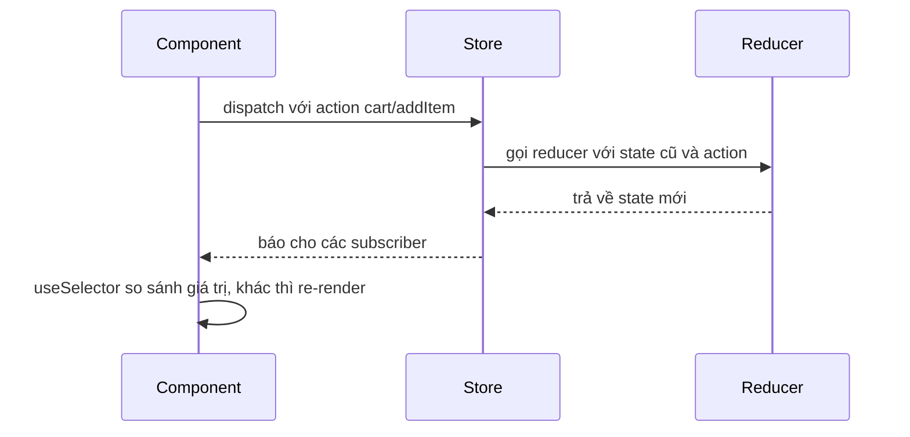
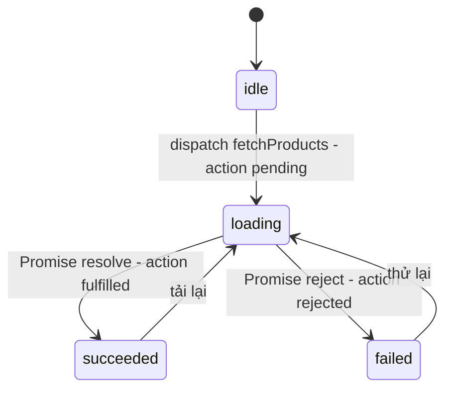

# Redux & Redux Toolkit

**Redux** là thư viện quản lý state theo mô hình **store tập trung** (một kho chứa duy nhất cho state dùng chung của cả app) và **luồng dữ liệu một chiều**: component chỉ được **dispatch action** (gửi đi một object mô tả "chuyện gì vừa xảy ra"), còn việc tính ra state mới do **reducer** (hàm thuần nhận state cũ + action, trả về state mới) đảm nhận. Ngày nay ta viết Redux thông qua **Redux Toolkit (RTK)**, bộ công cụ chính thức giúp bỏ gần hết boilerplate của Redux kiểu cũ, kèm sẵn **RTK Query** để gọi API và cache dữ liệu. Bài này đi từ khái niệm gốc đến cách dùng RTK trong một dự án React thực tế.

---

:::note[Ghi nhớ nhanh]

- ⭐ **Luồng một chiều: `dispatch(action)` → reducer → store → `useSelector` → re-render** — mọi thay đổi state đều đi qua đúng một đường nên dễ trace và debug.
- ⭐ **Viết Redux mới bằng Redux Toolkit** — `configureStore` + `createSlice`; Redux thuần (`createStore`, switch-case, action type string) chỉ còn để hiểu và đọc code cũ.
- **Reducer phải thuần và bất biến** — trong `createSlice` được "mutate" `state` vì Immer tự tạo bản sao mới; ngoài slice thì không.
- **`useSelector` chọn đúng mẩu state cần** — trả về object/array mới mỗi lần sẽ gây re-render thừa; dùng `createSelector` để memo dữ liệu dẫn xuất.
- **Dữ liệu từ API nên để RTK Query (hoặc TanStack Query)** — không tự viết loading/error/cache bằng tay trong slice nếu không cần.
- **Không phải app nào cũng cần Redux** — hợp với app lớn, nhiều người làm, cần DevTools và middleware; app nhỏ dùng `useState`/Context/Zustand là đủ.

:::

---

## Mục lục

- [Vì sao Redux ra đời?](#vì-sao-redux-ra-đời)
- [Các khái niệm cốt lõi](#các-khái-niệm-cốt-lõi)
- [Redux thuần: hiểu để đọc code cũ](#redux-thuần-hiểu-để-đọc-code-cũ)
- [Redux Toolkit: cách viết hiện đại](#redux-toolkit-cách-viết-hiện-đại)
- [Kết nối với React](#kết-nối-với-react)
- [Dùng với TypeScript](#dùng-với-typescript)
- [Selector và tối ưu re-render](#selector-và-tối-ưu-re-render)
- [Xử lý bất đồng bộ với createAsyncThunk](#xử-lý-bất-đồng-bộ-với-createasyncthunk)
- [RTK Query: gọi API và cache](#rtk-query-gọi-api-và-cache)
- [Middleware và DevTools](#middleware-và-devtools)
- [Tổ chức thư mục](#tổ-chức-thư-mục)
- [Lỗi thường gặp](#lỗi-thường-gặp)
- [Khi nào nên dùng Redux?](#khi-nào-nên-dùng-redux)
- [Câu hỏi phỏng vấn](#câu-hỏi-phỏng-vấn)

---

## Vì sao Redux ra đời?

**Vấn đề:** Khoảng năm 2014–2015, app React ngày càng lớn. State dùng chung (user đăng nhập, giỏ hàng, thông báo...) nằm rải rác trong nhiều component, được sửa từ nhiều chỗ khác nhau. Khi dữ liệu hiển thị sai, rất khó trả lời câu hỏi: **ai đã đổi state, lúc nào, vì sao?**

```jsx
// State giỏ hàng bị sửa từ nhiều nơi, mỗi nơi một kiểu
function ProductCard({ product, cart, setCart }) {
  const add = () => setCart([...cart, product]);           // chỗ 1
  return <button onClick={add}>Thêm</button>;
}

function CartPage({ cart, setCart }) {
  const clear = () => setCart([]);                         // chỗ 2
  const remove = (id) => setCart(cart.filter(p => p.id !== id)); // chỗ 3
  // ...
}

// Bug: tổng tiền sai. Chỗ nào đã đổi cart? Theo thứ tự nào?
// → Phải đặt console.log khắp nơi để đoán.
```

**Giải pháp:** Dan Abramov và Andrew Clark tạo ra Redux (2015), lấy ý tưởng từ kiến trúc **Flux** của Facebook và ngôn ngữ **Elm**. Ba nguyên tắc:

1. **Một nguồn sự thật duy nhất** — toàn bộ state dùng chung nằm trong một store.
2. **State chỉ đọc** — muốn đổi phải dispatch một action mô tả thay đổi.
3. **Thay đổi bằng hàm thuần** — reducer nhận state cũ + action, trả state mới.

```jsx
// Mọi thay đổi giỏ hàng đều là một action có tên rõ ràng
dispatch(cartActions.addItem(product));
dispatch(cartActions.removeItem(id));
dispatch(cartActions.clear());

// Redux DevTools ghi lại TỪNG action theo thứ tự, kèm state trước/sau
// → Nhìn là biết action nào làm tổng tiền sai, có thể tua lại (time-travel).
```

Redux thuần sau đó bị chê **quá nhiều boilerplate** (action type, action creator, switch-case, spread lồng nhau). Năm 2019, team Redux ra **Redux Toolkit** để giải quyết đúng nỗi đau này, và từ 2020 nó là cách viết Redux được khuyến nghị chính thức.

:::tip[Dùng thực tế]

- **App lớn, nhiều người cùng làm** — quy ước action/reducer rõ ràng giúp mọi người sửa state theo cùng một cách.
- **Debug luồng phức tạp** — checkout nhiều bước, dashboard real-time: xem lại chuỗi action trong DevTools.
- **Logic nghiệp vụ tách khỏi UI** — reducer là hàm thuần, test được mà không cần render component.
- **Cần middleware** — log, analytics, đồng bộ localStorage, xử lý WebSocket tập trung một chỗ.

:::

---

## Các khái niệm cốt lõi

| Khái niệm | Là gì | Ví dụ |
|---|---|---|
| **Store** | Object giữ toàn bộ state, có `getState()`, `dispatch()`, `subscribe()` | `configureStore({ reducer })` |
| **State** | Dữ liệu hiện tại, là object thường (plain object) | `{ cart: { items: [] }, user: null }` |
| **Action** | Object mô tả chuyện đã xảy ra, bắt buộc có `type` | `{ type: "cart/addItem", payload: item }` |
| **Action creator** | Hàm tạo ra action | `addItem(item)` → `{ type, payload }` |
| **Reducer** | Hàm thuần `(state, action) => newState` | Trả state mới, không sửa state cũ |
| **Dispatch** | Gửi action vào store để chạy reducer | `dispatch(addItem(item))` |
| **Selector** | Hàm đọc một phần state | `(state) => state.cart.items` |

Luồng chạy khi người dùng bấm nút:



Điểm quan trọng: component **không bao giờ sửa state trực tiếp**. Nó chỉ "kể lại" chuyện đã xảy ra (action), còn reducer quyết định state mới trông thế nào.

---

## Redux thuần: hiểu để đọc code cũ

Bạn **không nên** viết code mới theo kiểu này, nhưng sẽ gặp nó trong các dự án cũ và trong tài liệu, nên cần đọc được.

```js
// 1. Action type là string, khai báo hằng để tránh gõ sai
const ADD_ITEM = "cart/addItem";
const REMOVE_ITEM = "cart/removeItem";

// 2. Action creator
const addItem = (item) => ({ type: ADD_ITEM, payload: item });
const removeItem = (id) => ({ type: REMOVE_ITEM, payload: id });

// 3. Reducer: switch-case, phải tự copy state (bất biến)
const initialState = { items: [] };

function cartReducer(state = initialState, action) {
  switch (action.type) {
    case ADD_ITEM:
      return { ...state, items: [...state.items, action.payload] };
    case REMOVE_ITEM:
      return { ...state, items: state.items.filter(i => i.id !== action.payload) };
    default:
      return state; // action không liên quan → trả nguyên state cũ
  }
}

// 4. Store
import { createStore, combineReducers } from "redux";
const store = createStore(combineReducers({ cart: cartReducer }));

store.subscribe(() => console.log(store.getState()));
store.dispatch(addItem({ id: 1, name: "Áo" }));
```

Nỗi đau thấy rõ: 4 phần tách rời cho một tính năng nhỏ, spread lồng nhau dễ sai khi state sâu, quên `default` là bug, muốn gọi API phải tự cài thêm `redux-thunk`, muốn DevTools phải tự cấu hình. `createStore` giờ đã bị đánh dấu **deprecated** (không khuyến khích dùng nữa).

---

## Redux Toolkit: cách viết hiện đại

```bash
npm install @reduxjs/toolkit react-redux
```

### createSlice

`createSlice` gộp action type + action creator + reducer vào **một chỗ**:

```js
// features/cart/cartSlice.js
import { createSlice } from "@reduxjs/toolkit";

const initialState = { items: [] };

const cartSlice = createSlice({
  name: "cart", // tiền tố cho action type: "cart/addItem", "cart/removeItem"...
  initialState,
  reducers: {
    addItem(state, action) {
      const existing = state.items.find(i => i.id === action.payload.id);
      if (existing) {
        existing.quantity += 1; // "mutate" được nhờ Immer
      } else {
        state.items.push({ ...action.payload, quantity: 1 });
      }
    },
    removeItem(state, action) {
      state.items = state.items.filter(i => i.id !== action.payload);
    },
    clear() {
      return initialState; // hoặc trả về hẳn state mới
    },
  },
});

export const { addItem, removeItem, clear } = cartSlice.actions; // action creator tự sinh
export default cartSlice.reducer;
```

:::info[Immer làm gì?]

Trong reducer của `createSlice`, `state` thực chất là một **draft** (bản nháp) do thư viện **Immer** tạo ra. Bạn viết code như đang sửa trực tiếp, Immer ghi lại các thay đổi rồi sinh ra **object mới** bất biến. Nhờ vậy React/Redux vẫn so sánh tham chiếu được như bình thường.

Hai quy tắc khi dùng Immer:

- **Hoặc** sửa `state`, **hoặc** `return` state mới — không làm cả hai trong cùng một reducer.
- Chỉ "mutate" được **bên trong reducer của slice**. Ở component hay nơi khác, state vẫn là bất biến.

:::

### configureStore

```js
// app/store.js
import { configureStore } from "@reduxjs/toolkit";
import cartReducer from "../features/cart/cartSlice";
import authReducer from "../features/auth/authSlice";

export const store = configureStore({
  reducer: {
    cart: cartReducer, // state.cart
    auth: authReducer, // state.auth
  },
});
```

`configureStore` tự làm những việc trước đây phải cấu hình tay:

- Gộp reducer (thay `combineReducers`).
- Cài sẵn middleware **thunk** (cho code async).
- Bật **Redux DevTools** ở môi trường dev.
- Cài middleware kiểm tra lỗi ở dev: phát hiện khi bạn lỡ mutate state ngoài Immer, hoặc đưa giá trị không serialize được (Date, Map, class instance, function) vào state.

---

## Kết nối với React

Bọc app bằng `Provider` để mọi component đều truy cập được store:

```jsx
// main.jsx
import { Provider } from "react-redux";
import { store } from "./app/store";

createRoot(document.getElementById("root")).render(
  <Provider store={store}>
    <App />
  </Provider>
);
```

Đọc state bằng `useSelector`, gửi action bằng `useDispatch`:

```jsx
import { useSelector, useDispatch } from "react-redux";
import { addItem, removeItem } from "./cartSlice";

function ProductCard({ product }) {
  const dispatch = useDispatch();
  return <button onClick={() => dispatch(addItem(product))}>Thêm vào giỏ</button>;
}

function CartBadge() {
  // Chỉ re-render khi số lượng item thay đổi
  const count = useSelector(state => state.cart.items.length);
  return <span>{count}</span>;
}

function CartList() {
  const items = useSelector(state => state.cart.items);
  const dispatch = useDispatch();
  return (
    <ul>
      {items.map(item => (
        <li key={item.id}>
          {item.name} × {item.quantity}
          <button onClick={() => dispatch(removeItem(item.id))}>Xoá</button>
        </li>
      ))}
    </ul>
  );
}
```

Khác biệt lớn so với Context: `useSelector` **so sánh kết quả selector** (mặc định bằng `===`) sau mỗi lần dispatch. Kết quả không đổi thì component **không re-render**, dù phần state khác trong store vừa thay đổi.

---

## Dùng với TypeScript

Suy ra kiểu `RootState` và `AppDispatch` từ chính store, rồi tạo hook đã gắn kiểu để dùng khắp app:

```ts
// app/store.ts
export const store = configureStore({
  reducer: { cart: cartReducer, auth: authReducer },
});

export type RootState = ReturnType<typeof store.getState>;
export type AppDispatch = typeof store.dispatch;
```

```ts
// app/hooks.ts
import { useDispatch, useSelector } from "react-redux";
import type { RootState, AppDispatch } from "./store";

export const useAppDispatch = useDispatch.withTypes<AppDispatch>();
export const useAppSelector = useSelector.withTypes<RootState>();
```

```ts
// features/cart/cartSlice.ts
import { createSlice, type PayloadAction } from "@reduxjs/toolkit";

interface CartItem {
  id: number;
  name: string;
  price: number;
  quantity: number;
}

interface CartState {
  items: CartItem[];
}

const initialState: CartState = { items: [] };

const cartSlice = createSlice({
  name: "cart",
  initialState,
  reducers: {
    removeItem(state, action: PayloadAction<number>) {
      state.items = state.items.filter(i => i.id !== action.payload);
    },
  },
});
```

Trong component chỉ dùng `useAppSelector`/`useAppDispatch`: `state` được gợi ý kiểu đầy đủ, và `dispatch` hiểu cả thunk async.

---

## Selector và tối ưu re-render

### Lỗi kinh điển: selector trả về giá trị mới mỗi lần

```jsx
// ❌ filter() luôn tạo mảng MỚI → === luôn false → re-render sau MỌI dispatch
const expensiveItems = useSelector(state =>
  state.cart.items.filter(i => i.price > 1_000_000)
);

// ❌ Tương tự: object literal mới mỗi lần
const { items, user } = useSelector(state => ({
  items: state.cart.items,
  user: state.auth.user,
}));
```

### Cách sửa

```jsx
// ✅ Cách 1: tách thành nhiều useSelector, mỗi cái trả một giá trị có sẵn
const items = useSelector(state => state.cart.items);
const user = useSelector(state => state.auth.user);

// ✅ Cách 2: memo dữ liệu dẫn xuất bằng createSelector
import { createSelector } from "@reduxjs/toolkit";

const selectItems = state => state.cart.items;

export const selectExpensiveItems = createSelector(
  [selectItems],
  (items) => items.filter(i => i.price > 1_000_000) // chỉ chạy lại khi items đổi
);

export const selectCartTotal = createSelector(
  [selectItems],
  (items) => items.reduce((sum, i) => sum + i.price * i.quantity, 0)
);

// Trong component
const expensiveItems = useSelector(selectExpensiveItems);
const total = useSelector(selectCartTotal);
```

`createSelector` (từ thư viện **Reselect**, có sẵn trong RTK) nhớ đầu vào lần trước: nếu `items` vẫn là cùng tham chiếu thì trả lại **đúng mảng cũ**, không tính lại, không gây re-render.

:::tip[Quy tắc]

- **Chỉ lưu dữ liệu gốc vào store**, không lưu dữ liệu tính ra được (tổng tiền, danh sách đã lọc). Tính bằng selector.
- **Đặt selector cạnh slice** (export từ `cartSlice.js`) để component không phải biết hình dạng state.

:::

---

## Xử lý bất đồng bộ với createAsyncThunk

Reducer phải thuần nên **không được gọi API trong reducer**. Việc async đặt trong **thunk** (hàm chạy trước khi action vào reducer), và `createAsyncThunk` tự dispatch 3 action theo vòng đời của Promise:



```js
// features/products/productsSlice.js
import { createSlice, createAsyncThunk } from "@reduxjs/toolkit";

export const fetchProducts = createAsyncThunk(
  "products/fetchAll",
  async (category, { rejectWithValue }) => {
    const res = await fetch(`/api/products?category=${category}`);
    if (!res.ok) {
      return rejectWithValue(`Lỗi ${res.status}`); // payload cho action rejected
    }
    return res.json(); // payload cho action fulfilled
  }
);

const productsSlice = createSlice({
  name: "products",
  initialState: { items: [], status: "idle", error: null },
  reducers: {},
  // extraReducers: xử lý action KHÔNG do slice này tự sinh ra
  extraReducers: (builder) => {
    builder
      .addCase(fetchProducts.pending, (state) => {
        state.status = "loading";
        state.error = null;
      })
      .addCase(fetchProducts.fulfilled, (state, action) => {
        state.status = "succeeded";
        state.items = action.payload;
      })
      .addCase(fetchProducts.rejected, (state, action) => {
        state.status = "failed";
        state.error = action.payload ?? action.error.message;
      });
  },
});

export default productsSlice.reducer;
```

```jsx
function ProductList({ category }) {
  const dispatch = useDispatch();
  const { items, status, error } = useSelector(state => state.products);

  useEffect(() => {
    dispatch(fetchProducts(category));
  }, [category, dispatch]);

  if (status === "loading") return <Spinner />;
  if (status === "failed") return <p>Lỗi: {error}</p>;
  return items.map(p => <ProductCard key={p.id} product={p} />);
}
```

Cách này chạy tốt nhưng bạn vẫn tự lo: cache, tránh fetch trùng, refetch khi quay lại tab, huỷ request cũ khi `category` đổi nhanh... Đó là lý do có RTK Query.

---

## RTK Query: gọi API và cache

**RTK Query** là công cụ fetch dữ liệu có sẵn trong Redux Toolkit, cùng ý tưởng với TanStack Query: bạn **khai báo endpoint**, nó tự sinh hook và tự lo loading, cache, dedupe, refetch, invalidate.

```js
// services/productsApi.js
import { createApi, fetchBaseQuery } from "@reduxjs/toolkit/query/react";

export const productsApi = createApi({
  reducerPath: "productsApi",
  baseQuery: fetchBaseQuery({ baseUrl: "/api" }),
  tagTypes: ["Product"],
  endpoints: (builder) => ({
    getProducts: builder.query({
      query: (category) => `products?category=${category}`,
      providesTags: ["Product"],
    }),
    addProduct: builder.mutation({
      query: (body) => ({ url: "products", method: "POST", body }),
      invalidatesTags: ["Product"], // thêm xong → tự refetch getProducts
    }),
  }),
});

export const { useGetProductsQuery, useAddProductMutation } = productsApi;
```

Gắn vào store (thêm reducer và middleware của API):

```js
export const store = configureStore({
  reducer: {
    cart: cartReducer,
    [productsApi.reducerPath]: productsApi.reducer,
  },
  middleware: (getDefault) => getDefault().concat(productsApi.middleware),
});
```

Dùng trong component, không cần slice, không cần `useEffect`:

```jsx
function ProductList({ category }) {
  const { data = [], isLoading, error } = useGetProductsQuery(category);
  const [addProduct, { isLoading: isAdding }] = useAddProductMutation();

  if (isLoading) return <Spinner />;
  if (error) return <p>Không tải được sản phẩm</p>;

  return (
    <>
      <button disabled={isAdding} onClick={() => addProduct({ name: "Mới" })}>
        Thêm
      </button>
      {data.map(p => <ProductCard key={p.id} product={p} />)}
    </>
  );
}
```

:::info[RTK Query hay TanStack Query?]

| | RTK Query | TanStack Query |
|---|---|---|
| Đi kèm | Redux Toolkit (không cài thêm) | Thư viện riêng |
| Cách khai báo | Tập trung trong `createApi` | Rải theo từng `useQuery` |
| Invalidate | Theo **tag** | Theo **query key** |
| Hợp khi | App **đã dùng Redux** | App không dùng Redux |

Đã có Redux thì dùng RTK Query cho đồng bộ. Chưa có Redux thì đừng cài Redux chỉ để dùng RTK Query.

:::

---

## Middleware và DevTools

**Middleware** chen vào giữa lúc `dispatch` và lúc action tới reducer, dùng cho side effect (tác dụng phụ) như log, analytics, đồng bộ localStorage.

```js
// Middleware tự viết: log mỗi action
const logger = (store) => (next) => (action) => {
  console.log("dispatch", action.type);
  const result = next(action); // chuyển action cho middleware tiếp theo / reducer
  console.log("state mới", store.getState());
  return result;
};
```

Với side effect **phản ứng theo action**, RTK có sẵn **listener middleware**, thay cho `redux-saga` trong đa số trường hợp:

```js
import { createListenerMiddleware } from "@reduxjs/toolkit";
import { addItem, removeItem } from "../features/cart/cartSlice";

export const listener = createListenerMiddleware();

// Mỗi khi giỏ hàng đổi → lưu vào localStorage
listener.startListening({
  matcher: (action) => [addItem.type, removeItem.type].includes(action.type),
  effect: (action, api) => {
    localStorage.setItem("cart", JSON.stringify(api.getState().cart.items));
  },
});

// Trong configureStore:
// middleware: (getDefault) => getDefault().prepend(listener.middleware)
```

**Redux DevTools** (extension trình duyệt) được `configureStore` bật sẵn ở dev. Nó cho xem:

- Danh sách action theo thời gian, kèm payload.
- State trước/sau và phần **diff** của từng action.
- **Time-travel**: nhảy về bất kỳ action nào để xem UI lúc đó.
- Export/import chuỗi action để tái hiện bug trên máy khác.

---

## Tổ chức thư mục

Redux khuyến nghị tổ chức theo **feature** (tính năng), mỗi feature một slice:

```text
src/
├── app/
│   ├── store.js         # configureStore
│   └── hooks.js         # useAppDispatch, useAppSelector (TS)
├── features/
│   ├── cart/
│   │   ├── cartSlice.js # slice + selector
│   │   ├── CartList.jsx
│   │   └── CartBadge.jsx
│   └── auth/
│       ├── authSlice.js
│       └── LoginForm.jsx
└── services/
    └── productsApi.js   # RTK Query
```

Tránh kiểu cũ tách `actions/`, `reducers/`, `constants/` thành các thư mục riêng: sửa một tính năng phải mở 3–4 nơi.

---

## Lỗi thường gặp

| Lỗi | Hậu quả | Cách sửa |
|---|---|---|
| Vừa sửa `state` vừa `return` trong reducer của slice | Immer báo lỗi | Chọn một: sửa draft **hoặc** return state mới |
| Gọi API, `Math.random()`, `Date.now()` trong reducer | Reducer không thuần, time-travel sai | Đưa vào thunk / `prepare` callback |
| Lưu `Date`, `Map`, function, class instance vào state | Cảnh báo non-serializable, DevTools hiển thị sai | Lưu dạng thô: timestamp số, object thường, array |
| Selector trả về array/object mới mỗi lần | Re-render sau mọi dispatch | Tách `useSelector` hoặc dùng `createSelector` |
| Lưu dữ liệu dẫn xuất (tổng tiền) vào store | Dễ lệch với dữ liệu gốc | Tính bằng selector |
| Đưa mọi thứ vào Redux (cả state input, modal) | Store phình, code rườm rà | State chỉ một component dùng → `useState` |
| Tự viết cache API bằng slice + thunk | Bug dữ liệu cũ, fetch trùng | Dùng RTK Query |

---

## Khi nào nên dùng Redux?

**Nên dùng khi:**

- App lớn, nhiều màn hình cùng đọc/ghi một lượng state client đáng kể.
- Team đông, cần quy ước chặt về cách sửa state.
- Cần DevTools mạnh (time-travel, replay) để debug luồng phức tạp.
- Cần middleware tập trung (WebSocket, analytics, undo/redo).
- Dự án đã có sẵn Redux.

**Không cần khi:**

- App nhỏ/vừa, state dùng chung ít → `useState` + Context là đủ.
- Chủ yếu là dữ liệu từ API → TanStack Query + `useState`.
- Muốn store toàn cục nhưng gọn nhẹ → Zustand.

So sánh chi tiết Redux Toolkit với Zustand, Jotai, MobX xem ở bài [State Management Libraries](./2_libraries.md).

---

## Câu hỏi phỏng vấn

Những câu thường gặp về chủ đề này. Tự trả lời trước, rồi bấm **Xem đáp án** để đối chiếu.

**1. Nêu ba nguyên tắc của Redux và giải thích vì sao reducer bắt buộc phải là hàm thuần.**

<details className="qa">
<summary>Xem đáp án</summary>

Ba nguyên tắc:

1. **Single source of truth** — state dùng chung nằm trong một store.
2. **State is read-only** — chỉ đổi được bằng cách dispatch action.
3. **Changes are made with pure functions** — reducer `(state, action) => newState`.

Reducer phải thuần (cùng input luôn ra cùng output, không side effect, không sửa input) vì:

- **So sánh tham chiếu**: `useSelector` và React phát hiện thay đổi bằng `===`. Nếu reducer sửa trực tiếp object cũ, tham chiếu không đổi, UI không cập nhật.
- **Time-travel và replay**: DevTools tính lại state bằng cách chạy lại chuỗi action. Reducer có `Date.now()` hay gọi API thì chạy lại sẽ ra kết quả khác.
- **Test dễ**: truyền state + action, kiểm tra output, không cần mock.

</details>

**2. Redux Toolkit giải quyết những vấn đề gì của Redux thuần?**

<details className="qa">
<summary>Xem đáp án</summary>

- **Boilerplate**: `createSlice` sinh action type + action creator + reducer từ một khai báo, thay cho hằng string, hàm tạo action và switch-case viết tay.
- **Cập nhật bất biến khó viết**: Immer cho phép viết kiểu "mutate", tự sinh object mới.
- **Cấu hình store rườm rà**: `configureStore` gộp reducer, cài thunk, bật DevTools, thêm middleware bắt lỗi mutate và non-serializable ở dev.
- **Async**: `createAsyncThunk` tự dispatch `pending/fulfilled/rejected`.
- **Fetch dữ liệu**: RTK Query thay cho việc tự viết cache, loading, refetch trong slice.

</details>

**3. Trong `createSlice`, vì sao viết `state.count++` mà không vi phạm tính bất biến?**

<details className="qa">
<summary>Xem đáp án</summary>

Vì `state` trong reducer của slice là **draft** của Immer, không phải state thật. Immer dùng Proxy để ghi lại mọi thao tác trên draft, sau khi reducer chạy xong thì tạo ra một object **mới** chứa thay đổi; các nhánh không đổi được giữ nguyên tham chiếu (structural sharing). State cũ không bị đụng tới.

Lưu ý: chỉ đúng bên trong reducer của `createSlice`/`createReducer`. Và không được vừa sửa draft vừa `return` giá trị mới trong cùng một reducer.

</details>

**4. `useSelector` quyết định re-render thế nào? Vì sao selector trả về `state.items.filter(...)` gây vấn đề hiệu năng và sửa ra sao?**

<details className="qa">
<summary>Xem đáp án</summary>

Sau mỗi `dispatch`, `useSelector` chạy lại selector và so sánh kết quả mới với kết quả cũ bằng `===`. Khác thì re-render, giống thì bỏ qua.

`filter()` luôn trả về **mảng mới**, nên `===` luôn `false` → component re-render sau **mọi** action, kể cả action của slice không liên quan.

Cách sửa:

- Dùng `createSelector` để memo: chỉ tính lại khi đầu vào (`state.items`) đổi tham chiếu, ngược lại trả lại mảng cũ.
- Khi cần nhiều giá trị, tách thành nhiều `useSelector` thay vì trả về object literal.
- Truyền `shallowEqual` làm tham số thứ hai của `useSelector` khi kết quả là object phẳng.

</details>

**5. So sánh `useSelector` của Redux với `useContext` về cơ chế re-render.**

<details className="qa">
<summary>Xem đáp án</summary>

- **`useContext`**: khi `value` của Provider đổi tham chiếu, **mọi** component gọi `useContext` đó đều re-render, không có cách chỉ lấy một phần.
- **`useSelector`**: component đăng ký (subscribe) vào store và chỉ re-render khi **kết quả selector của chính nó** thay đổi.

Vì vậy với state đổi thường xuyên và nhiều nơi đọc các phần khác nhau, Redux hiệu quả hơn Context. Ngoài ra `react-redux` dùng `useSyncExternalStore` nên không bị lỗi "tearing" (các component đọc ra state lệch nhau) khi render đồng thời (concurrent rendering).

</details>

**6. `createAsyncThunk` hoạt động thế nào? Vì sao không gọi API trong reducer?**

<details className="qa">
<summary>Xem đáp án</summary>

`createAsyncThunk(type, payloadCreator)` trả về một thunk. Khi dispatch:

1. Dispatch `type/pending`.
2. Chạy `payloadCreator` (hàm async, thường gọi API).
3. Resolve → dispatch `type/fulfilled` với payload là kết quả. Reject hoặc `rejectWithValue` → dispatch `type/rejected`.

Slice xử lý ba action này trong `extraReducers` để cập nhật `status`, `data`, `error`.

Không gọi API trong reducer vì reducer phải **đồng bộ và thuần**: nó phải trả state mới ngay lập tức, và chạy lại cùng input phải ra cùng kết quả. Gọi API là side effect, bất đồng bộ, kết quả thay đổi theo thời gian.

</details>

**7. Khi nào dùng RTK Query thay vì `createAsyncThunk`?**

<details className="qa">
<summary>Xem đáp án</summary>

**RTK Query** cho **server state** kiểu đọc/ghi CRUD thông thường: danh sách, chi tiết, tạo/sửa/xoá. Nó tự lo cache theo tham số, dedupe request trùng, refetch khi focus lại hoặc reconnect, polling, invalidate theo tag sau mutation, xoá cache khi không còn component dùng.

**`createAsyncThunk`** cho luồng async **không phải "fetch và cache"**: quy trình nhiều bước (checkout: tạo đơn → thanh toán → cập nhật kho), logic cần đọc và ghi nhiều slice, hoặc tác vụ một lần như đăng nhập rồi lưu token.

Dùng thunk để tự viết cache API là làm lại những gì RTK Query đã có, và thường sinh bug dữ liệu cũ.

</details>

**8. Middleware trong Redux là gì? Cho ví dụ và so sánh listener middleware với redux-saga.**

<details className="qa">
<summary>Xem đáp án</summary>

Middleware là hàm dạng `store => next => action => {...}`, chen giữa `dispatch` và reducer. Nó có thể log, biến đổi, chặn action, hoặc chạy side effect. Ví dụ: `thunk` (cho phép dispatch hàm), logger, middleware của RTK Query, middleware đồng bộ localStorage.

**Listener middleware** (có sẵn trong RTK) cho phép "khi action X xảy ra thì chạy effect Y", hỗ trợ async/await, huỷ task, debounce. **redux-saga** dùng generator function, mạnh cho luồng rất phức tạp (race, fork, cancel lồng nhau) nhưng học khó và thêm dependency. Với đa số app hiện nay, listener middleware + RTK Query là đủ; saga chủ yếu còn trong dự án cũ.

</details>

**9. Cái gì nên và không nên đưa vào Redux store?**

<details className="qa">
<summary>Xem đáp án</summary>

**Nên:** client state dùng chung ở nhiều nơi xa nhau và cần tồn tại khi chuyển trang: user/session, giỏ hàng, cài đặt người dùng, trạng thái wizard nhiều bước.

**Không nên:**

- State chỉ một component dùng (input đang gõ, dropdown mở/đóng) → `useState`.
- Dữ liệu API → RTK Query/TanStack Query (vẫn nằm trong store nếu dùng RTK Query, nhưng do nó quản lý, bạn không viết tay).
- Filter, page, search cần share bằng link → URL.
- Giá trị không serialize được (Date, Map, Promise, DOM node, function).
- Dữ liệu dẫn xuất → tính bằng selector.

</details>

**10. Redux còn đáng dùng trong năm nay khi đã có Zustand, TanStack Query và Server Components không?**

<details className="qa">
<summary>Xem đáp án</summary>

Có, nhưng phạm vi hẹp hơn trước. Nhiều thứ trước đây nhét vào Redux giờ có công cụ chuyên biệt: dữ liệu server → TanStack Query hoặc fetch ở Server Components; state toàn cục đơn giản → Zustand.

Redux Toolkit vẫn hợp lý khi: codebase lớn và đội đông cần kỷ luật chặt; cần DevTools time-travel và middleware mạnh; muốn một bộ thống nhất cả client state lẫn server state (RTK + RTK Query); hoặc dự án đã dùng Redux, vì migrate tốn kém mà lợi ích không rõ.

Câu trả lời tốt trong phỏng vấn là không cực đoan: nêu được **đánh đổi** (bundle, boilerplate, learning curve với kỷ luật, DevTools, ecosystem) và chọn theo nhu cầu thực tế của dự án.

</details>
