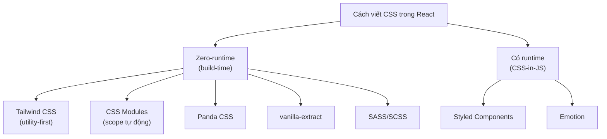
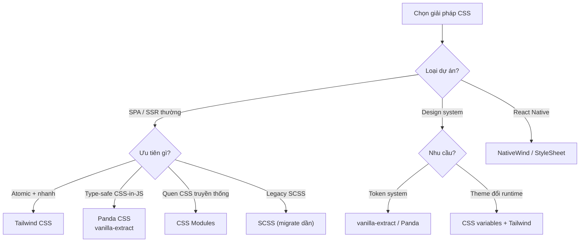

# Writing CSS trong React

Trong React có rất nhiều cách để viết CSS (định kiểu, tô màu sắc và bố cục cho giao diện). Bạn có thể dùng file CSS thường, **CSS Modules** (CSS đóng gói riêng cho từng component để tránh trùng tên lớp), **CSS-in-JS** (viết CSS ngay trong code JavaScript) như Styled Components, hoặc các tiện ích như **Tailwind CSS** (bộ lớp dựng sẵn giúp định kiểu nhanh ngay trên thẻ HTML). Bài này giúp người mới nắm bức tranh tổng quan để chọn cách phù hợp với dự án.

[](pathname:///img/react/writing-css.webp)

---

:::note[Ghi nhớ nhanh]

- ⭐ **Tailwind CSS là mặc định 2026** — utility-first, không runtime, tree-shaking nên bundle nhỏ; đáng học cú pháp.
- **CSS Modules** — tự sinh hash cho class nên không trùng tên toàn cục, built-in sẵn trong Vite/Next/CRA.
- ⭐ **CSS-in-JS (`styled-components`, Emotion) đang giảm phổ biến** — có runtime cost, kém tương thích Server Components; project mới không nên chọn trừ khi có lý do rõ.
- **Panda CSS / vanilla-extract** — type-safe, compile thành CSS tĩnh (zero-runtime) → lựa chọn thay CSS-in-JS.
- **SASS/SCSS ngày càng ít cần** — CSS thuần đã có nesting, `var()`, `calc()`; chỉ giữ khi cần mixin/function hoặc codebase legacy.

:::

---

## Mục lục

- [Vì sao có nhiều cách viết CSS trong React?](#vì-sao-có-nhiều-cách-viết-css-trong-react)
- [Tổng quan các cách](#tổng-quan-các-cách)
- [Tailwind CSS (khuyến nghị)](#tailwind-css-khuyến-nghị)
- [CSS Modules](#css-modules)
- [Styled Components / Emotion](#styled-components--emotion)
- [Panda CSS, vanilla-extract](#panda-css-vanilla-extract)
- [SASS/SCSS](#sassscss)
- [Câu hỏi phỏng vấn](#câu-hỏi-phỏng-vấn)

---

## Vì sao có nhiều cách viết CSS trong React?

**Vấn đề:**

CSS thường là toàn cục — class đặt ở đâu cũng áp cho cả trang. Khi nhiều component cùng đặt tên class giống nhau, chúng đụng độ và ghi đè lẫn nhau. Càng nhiều file CSS, càng khó biết class nào còn dùng (dead CSS) và khó style động theo props/state.

```css
/* Button.css */
.button { background: blue; }

/* Card.css — cùng tên .button, ghi đè ngầm! */
.button { background: gray; }
```

```jsx
// Muốn đổi màu theo props nhưng CSS tĩnh không làm được
function Button({ primary }) {
  // Phải tự nối class thủ công, dễ sai
  return <button className="button">Save</button>;
}
```

**Giải pháp:**

Các cách viết CSS theo component giải bài toán **scope** (giới hạn phạm vi) và **đồng bộ style với component**:

- **CSS Modules** — tự đặt hash cho class nên không bao giờ trùng tên.
- **styled-components / CSS-in-JS** — style gắn liền component, đổi động theo props.
- **Tailwind** — dùng utility class dựng sẵn, không phải tự đặt tên.

```css
/* Button.module.css — class tự sinh hash, không đụng .button của Card */
.button { background: blue; }
```

```jsx
// styled-components: style đổi theo props ngay trong component
const Button = styled.button`
  background: ${props => props.primary ? "blue" : "gray"};
`;
```

:::tip[Dùng thực tế]

- **Tránh đụng tên class** — hai component đều có `.title` mà không ghi đè nhau (CSS Modules).
- **Style theo props / biến theme** — nút đổi màu theo `primary`, theme sáng/tối (styled-components, CSS variables).
- **Xoá component là xoá luôn style** — không còn dead CSS lang thang vì style nằm cùng component.
- **Prototyping nhanh** — ghép utility class ngay trên JSX, không cần tạo file CSS riêng (Tailwind).

:::

---

## Tổng quan các cách

| Phương pháp | Runtime | Khuyến nghị | Đặc điểm |
|-------------|---------|-------------|----------|
| **Tailwind CSS** | Không | **Có** | Utility-first, phổ biến nhất |
| **CSS Modules** | Không | Có | Scope tự động, đơn giản |
| **Panda CSS** | Không | Có | Type-safe, zero-runtime |
| **vanilla-extract** | Không | Có | TypeScript-first |
| **Styled Components** | **Có** | Cân nhắc | CSS-in-JS, runtime cost |
| **Emotion** | **Có** | Cân nhắc | Tương tự Styled Components |
| **SASS/SCSS** | Không | Tùy | Vẫn dùng được với React |

Sơ đồ dưới đây phân loại các cách viết CSS theo nhóm:



---

## Tailwind CSS (khuyến nghị)

[Tailwind](https://tailwindcss.com) — utility-first CSS framework.

```bash
npm install -D tailwindcss postcss autoprefixer
npx tailwindcss init -p
```

```jsx
function Button({ children, primary }) {
  return (
    <button className={`
      px-4 py-2 rounded font-medium
      ${primary ? "bg-blue-600 text-white" : "bg-gray-200"}
      hover:opacity-80
    `}>
      {children}
    </button>
  );
}
```

Pattern với `clsx` / `cn`:

```jsx
import clsx from "clsx";

function Button({ primary, disabled, children }) {
  return (
    <button className={clsx(
      "px-4 py-2 rounded font-medium",
      primary && "bg-blue-600 text-white",
      disabled && "opacity-50 cursor-not-allowed"
    )}>
      {children}
    </button>
  );
}
```

:::info[Phân tích]

**Tại sao Tailwind thắng?**

1. **No naming overhead** — không phải nghĩ tên class.
2. **Co-location** — style ngay tại JSX, không nhảy file.
3. **Tree-shaking** — chỉ build CSS class đã dùng → bundle nhỏ.
4. **Consistent** — design system built-in (spacing, color scale).
5. **Responsive dễ** — `md:`, `lg:` prefix.
6. **Dark mode dễ** — `dark:` prefix.
7. **Editor tooling** — IntelliSense extension cực mạnh.

Phản đối thường gặp:

- "Class name quá dài" → đúng, dùng `clsx` + extract pattern (`btn`,
  `btn-primary`).
- "Khó đọc" → quen sau vài tuần.
- "Mixing concerns" → utility-first là cố ý — đổi tư duy.

Năm 2026, **Tailwind v4** (alpha→stable) đã ra với CSS-first config,
nhanh hơn nhiều, syntax mới hơn.

:::

---

## CSS Modules

Built-in trong Vite/Next/CRA — không cần cài thêm.

```css
/* Button.module.css */
.button {
  padding: 8px 16px;
  border-radius: 4px;
}

.primary {
  background: blue;
  color: white;
}
```

```jsx
import styles from "./Button.module.css";

function Button({ primary, children }) {
  return (
    <button className={`${styles.button} ${primary ? styles.primary : ""}`}>
      {children}
    </button>
  );
}
```

CSS Module **tự generate unique class name** → tránh xung đột global.

Phù hợp:

- Team quen viết CSS truyền thống.
- Component có style phức tạp (animation, pseudo-class).
- Không muốn dependency thêm.

---

## Styled Components / Emotion

CSS-in-JS — viết CSS thẳng trong JS file.

```bash
npm install styled-components
```

```jsx
import styled from "styled-components";

const Button = styled.button`
  padding: 8px 16px;
  background: ${props => props.primary ? "blue" : "gray"};
  color: white;
`;

<Button primary>Save</Button>
```

:::warning[Cần lưu ý]

**CSS-in-JS đang giảm phổ biến từ 2023+**. Lý do:

1. **Runtime cost** — generate CSS string runtime, slow on hydration.
2. **Server Components** không support tốt — phần lớn CSS-in-JS lib không
   compat với React Server Components.
3. **Bundle size** — runtime ~10-30KB.
4. **Maintain mode** — Styled Components đã giảm update.

Lựa chọn thay thế:

- **Tailwind** — utility, không runtime.
- **CSS Modules** — vanilla CSS, không runtime.
- **vanilla-extract** — type-safe, compile-time.
- **Panda CSS** — type-safe, atomic CSS compile-time.

Project mới năm 2026 **không nên chọn Styled Components / Emotion** trừ
khi có lý do rõ.

:::

---

## Panda CSS, vanilla-extract

**Panda CSS** — type-safe utility-CSS, compile-time, không runtime cost:

```tsx
import { css } from "../styled-system/css";

function Button() {
  return (
    <button className={css({ bg: "blue.500", color: "white", p: "4" })}>
      Click
    </button>
  );
}
```

**vanilla-extract** — viết CSS bằng TypeScript:

```tsx
// button.css.ts
import { style } from "@vanilla-extract/css";

export const button = style({
  padding: 16,
  background: "blue",
  ":hover": { opacity: 0.8 },
});
```

```tsx
import { button } from "./button.css";
<button className={button}>Click</button>
```

Cả hai compile thành **static CSS** tại build time → không có runtime
overhead. Type-safe → autocomplete, refactor an toàn.

---

## SASS/SCSS

Vẫn dùng được với React qua loader. Cài:

```bash
npm install -D sass
```

```scss
// styles.scss
.button {
  padding: 8px 16px;

  &.primary { background: blue; }
  &:hover    { opacity: 0.8; }
}
```

```jsx
import "./styles.scss";

<button className="button primary">Save</button>
```

:::info[Phân tích]

**SASS năm 2026 — có còn cần?**

CSS native đã có hầu hết feature SASS từng dẫn đầu:

- **Nesting** — CSS 2022+ hỗ trợ.
- **Variables** — `var(--name)` từ lâu.
- **Calc** — `calc()` native.
- **Color function** — `color-mix()`, `light-dark()` đang ra.
- **Custom property fallback** — `var(--x, default)`.

Lý do vẫn dùng SASS:

- **Mixin** — `@mixin` chưa có native equivalent đầy đủ.
- **Function** — `@function`, math operations.
- **Module system** — `@use`, `@forward`.
- **Codebase lớn legacy** — chi phí migrate cao.

Project mới ưu tiên CSS thuần + PostCSS plugin nếu cần feature đặc biệt.

:::

:::tip[Mẹo]

**Quy tắc chọn CSS solution 2026:**

```
SPA/SSR thông thường?
├─ Cần atomic + utility nhanh? → Tailwind CSS
├─ Cần type-safe CSS-in-JS? → Panda CSS / vanilla-extract
├─ Team quen CSS truyền thống? → CSS Modules
└─ Có codebase legacy SCSS? → SCSS (migrate dần)

Component library / design system?
├─ Token system → vanilla-extract / Panda
└─ Theme runtime đổi → CSS variables + Tailwind

Mobile (React Native)?
└─ NativeWind (Tailwind cho RN) / StyleSheet API
```

Sơ đồ hoá quy tắc chọn ở trên:



Đa số dự án **Tailwind là default** — học cú pháp đáng giá.

:::

---

## Câu hỏi phỏng vấn

Những câu thường gặp về chủ đề này. Tự trả lời trước, rồi bấm **Xem đáp án** để đối chiếu.

**1. Vì sao CSS toàn cục gây vấn đề trong ứng dụng React nhiều component? Nêu các triệu chứng thường gặp.**

<details className="qa">
<summary>Xem đáp án</summary>

CSS mặc định có **một không gian tên duy nhất cho cả trang**: class viết ở đâu cũng áp cho mọi phần tử khớp. Trong khi đó React khuyến khích chia nhỏ thành hàng trăm component độc lập — hai mô hình chống nhau.

Triệu chứng thường gặp:

- **Đụng tên class** — `Button.css` và `Card.css` cùng có `.button`, file nào load sau thì thắng, và thứ tự đó phụ thuộc vào thứ tự import nên rất khó đoán.
- **Sửa một chỗ vỡ chỗ khác** — đổi `.title` để hợp trang A thì trang B lệch theo.
- **Dead CSS** — xoá component nhưng không ai dám xoá CSS vì không biết còn chỗ nào dùng; file CSS chỉ phình lên.
- **Cuộc đua specificity** — để ghi đè thì viết selector dài hơn, rồi `!important`, rồi không ai ghi đè được nữa.
- **Không style động được theo props/state** nếu chỉ có CSS tĩnh.

Đó chính là lý do sinh ra CSS Modules, CSS-in-JS và Tailwind — đều nhằm giải bài toán **scope** và **gắn style với component**.

</details>

**2. CSS Modules tạo scope bằng cách nào? Class `.button` biến thành gì sau khi build và ai chịu trách nhiệm sinh ra tên đó?**

<details className="qa">
<summary>Xem đáp án</summary>

CSS Modules không phải tính năng của trình duyệt mà là **quy ước ở tầng build**. Khi bạn import một file `*.module.css`, bundler (Vite, webpack qua `css-loader`, Next.js — đều có sẵn, không cần cài thêm) sẽ:

1. Đọc file CSS, **đổi tên mọi class cục bộ** thành một tên duy nhất toàn dự án, thường theo mẫu `[tên file]_[tên class]__[hash]`, ví dụ `.button` thành `.Button_button__2f1a9`.
2. Xuất ra một **object ánh xạ** từ tên gốc sang tên đã băm.

```jsx
import styles from "./Button.module.css";
// styles = { button: "Button_button__2f1a9", primary: "Button_primary__7c3e1" }
console.log(styles.button);
```

Trình duyệt chỉ nhận CSS bình thường với tên class rất khó trùng. Ưu điểm: scope tự động, không runtime, vẫn là CSS thuần nên dùng được mọi thứ (animation, pseudo-class, media query). Cần dùng chung toàn cục thì bọc trong `:global(...)`.

</details>

**3. Giải thích `specificity` (độ ưu tiên) trong CSS và vì sao nó là nguyên nhân của phần lớn xung đột style trong dự án lớn.**

<details className="qa">
<summary>Xem đáp án</summary>

Khi nhiều rule cùng nhắm một phần tử, trình duyệt chọn rule có **specificity** cao hơn. Điểm số tính theo bộ ba (inline, id, class/attribute/pseudo-class, element):

| Selector | Điểm |
|---|---|
| `div` | 0-0-1 |
| `.btn` | 0-1-0 |
| `.card .btn` | 0-2-0 |
| `#main .btn` | 1-1-0 |
| `style="..."` | cao hơn mọi selector |
| `!important` | vượt ngoài thang điểm |

Bằng điểm thì rule **xuất hiện sau** thắng.

Vì sao gây rắc rối ở dự án lớn: muốn ghi đè, cách nhanh nhất là viết selector cụ thể hơn. Mỗi lần như vậy lại nâng "mức sàn" cho lần ghi đè kế tiếp, dẫn tới selector lồng bốn năm tầng, rồi `!important`, rồi không còn cách nào can thiệp sạch sẽ. Tailwind và CSS Modules tránh được vòng xoáy này vì gần như mọi selector đều **phẳng, cùng một mức specificity** — chỉ còn thứ tự quyết định.

</details>

**4. So sánh CSS Modules, CSS-in-JS và Tailwind trên bốn tiêu chí: scope, runtime cost, developer experience và khả năng tái sử dụng.**

<details className="qa">
<summary>Xem đáp án</summary>

| Tiêu chí | CSS Modules | CSS-in-JS (`styled-components`) | Tailwind |
|---|---|---|---|
| **Scope** | Tự động, băm tên class lúc build | Tự động, class sinh theo component | Không cần scope — utility dùng chung, không ai đặt tên |
| **Runtime cost** | Không | **Có** — sinh CSS và chèn `<style>` lúc chạy, thêm ~10–30KB runtime | Không, CSS sinh hoàn toàn lúc build |
| **DX** | Quen thuộc, nhưng phải nhảy qua lại hai file và vẫn phải nghĩ tên class | Style gắn liền component, đổi theo props rất tự nhiên; đổi lại lỗi khó đọc và build chậm hơn | Viết ngay trên JSX, IntelliSense mạnh, có design system sẵn; đổi lại class dài và phải học cú pháp |
| **Tái sử dụng** | Qua `composes` và chia file CSS | Qua kế thừa `styled(Button)` và theme provider | Qua **tách component React**, hoặc `cva`/`@apply` |

Bức tranh chung năm 2026: Tailwind là mặc định, CSS Modules là lựa chọn an toàn cho đội quen CSS truyền thống, CSS-in-JS runtime đang lùi dần vì chi phí runtime và vấn đề với Server Components.

</details>

**5. Tailwind là `utility-first`. Trả lời phản biện phổ biến rằng nó làm markup rối và giống việc quay lại inline style.**

<details className="qa">
<summary>Xem đáp án</summary>

Thừa nhận phần đúng: markup dài hơn thật, và nhìn lần đầu rất choáng.

Nhưng **không phải inline style**, vì Tailwind có những thứ `style=""` không có:

- **Responsive và state** — `md:`, `lg:`, `hover:`, `focus:`, `dark:`, `group-hover:` đều là thứ inline style không làm được.
- **Design system có ràng buộc** — `p-4`, `text-gray-700` lấy từ một thang giá trị định sẵn, nên cả đội tự động nhất quán, thay vì mỗi người gõ một con số tuỳ hứng.
- **CSS được gom và cache** — class lặp lại không nhân bản dung lượng như inline style; bundle còn được tree-shake theo class thực dùng.

Về chuyện "markup rối": giải pháp đúng trong React không phải đặt tên class mới, mà là **tách component**. Cụm class lặp lại ba lần là dấu hiệu nên có `<Button>`. Cần nhiều biến thể thì dùng `cva`. Còn về "trộn lẫn mối quan tâm": đó là chủ ý — trong React, component đã là đơn vị đóng gói cả markup, logic lẫn style rồi.

</details>

**6. Tailwind giữ bundle CSS nhỏ bằng cách nào? Giải thích cơ chế quét file và vì sao tên class ghép chuỗi động lại bị mất khi build.**

<details className="qa">
<summary>Xem đáp án</summary>

Tailwind chỉ sinh ra CSS cho **những class thực sự xuất hiện trong mã nguồn**. Lúc build, nó quét các file bạn khai báo (`content`) và tìm mọi **chuỗi ký tự trông giống tên class** — đây là thao tác so khớp văn bản thuần, Tailwind **không hề chạy hay hiểu code** của bạn. Nhờ vậy dù thư viện có hàng trăm nghìn utility, CSS xuất ra thường chỉ vài chục KB.

Hệ quả: tên class ghép động sẽ không được tìm thấy.

```jsx
// SAI — chuỗi "bg-red-500" chưa từng xuất hiện nguyên vẹn trong file
const color = "red";
<div className={`bg-${color}-500`} />

// ĐÚNG — viết đủ tên class để máy quét nhìn thấy
const COLORS = { red: "bg-red-500", blue: "bg-blue-500" };
<div className={COLORS[color]} />
```

Với class sinh từ dữ liệu ngoài (API, CMS) mà không liệt kê trước được, dùng `safelist` trong config để buộc Tailwind giữ lại.

</details>

**7. Bạn tái sử dụng một cụm class Tailwind lặp lại nhiều nơi như thế nào — tách component, dùng `@apply`, hay dùng biến thể với `cva`? Đánh đổi của mỗi cách?**

<details className="qa">
<summary>Xem đáp án</summary>

| Cách | Khi nào dùng | Đánh đổi |
|---|---|---|
| **Tách component React** | Mặc định, và hầu như luôn là câu trả lời đúng | Không có nhược điểm đáng kể; đây là cách Tailwind khuyến nghị |
| **`@apply`** | Style cho thẻ bạn không kiểm soát được markup (nội dung từ CMS, thư viện bên thứ ba) | Quay lại đúng bài toán đặt tên class và CSS toàn cục; lạm dụng là tự tay dựng lại một hệ CSS truyền thống bên trong Tailwind |
| **`cva` (class-variance-authority)** | Component có nhiều biến thể — size, intent, trạng thái | Thêm một dependency và một lớp khái niệm; thừa với component chỉ có một dáng |

```js
const button = cva("px-4 py-2 rounded font-medium", {
  variants: {
    intent: { primary: "bg-blue-600 text-white", ghost: "bg-transparent" },
    size: { sm: "text-sm", lg: "text-lg px-6" },
  },
  defaultVariants: { intent: "primary", size: "sm" },
});
```

Thứ tự ưu tiên thực tế: tách component trước, thêm `cva` khi biến thể nhiều lên, `@apply` chỉ dùng khi thật sự không chạm được vào markup.

</details>

**8. `clsx` và `tailwind-merge` giải quyết vấn đề gì? Vì sao chỉ nối chuỗi class là chưa đủ khi cần ghi đè?**

<details className="qa">
<summary>Xem đáp án</summary>

`clsx` (hoặc `classnames`) lo phần **ghép class có điều kiện** cho gọn và an toàn — tự bỏ qua `false`, `undefined`, `null`, khỏi phải nối chuỗi thủ công rồi dính khoảng trắng thừa.

`tailwind-merge` lo phần **xung đột giữa các utility cùng nhóm**. Vấn đề: trong CSS, thắng thua do **specificity và thứ tự trong file CSS**, chứ không do thứ tự trong thuộc tính `className`. Viết `"p-2 p-4"` thì kết quả phụ thuộc vào rule nào nằm sau trong bundle, chứ không phải `p-4` vì viết sau mà thắng.

```js
import { twMerge } from "tailwind-merge";

clsx("p-2", "p-4");    // "p-2 p-4" — vẫn xung đột, kết quả khó đoán
twMerge("p-2", "p-4"); // "p-4" — bỏ hẳn class bị ghi đè
```

Đây là chuyện sống còn với component có prop `className` cho bên ngoài tuỳ biến: người dùng truyền `bg-red-500` mà component đã có `bg-blue-600` thì phải loại được cái cũ đi. Hai thư viện này thường được gói chung thành hàm tiện ích `cn()`.

</details>

**9. Vì sao CSS-in-JS như `styled-components` bị coi là có `runtime cost`? Chi phí đó phát sinh ở thời điểm nào trong vòng đời render?**

<details className="qa">
<summary>Xem đáp án</summary>

Với CSS-in-JS runtime, CSS **chưa tồn tại lúc build** — nó được tạo ra trong lúc trang đang chạy. Cụ thể, khi một styled component render, thư viện phải:

1. Nội suy template literal với props hiện tại để ra chuỗi CSS.
2. Băm chuỗi đó thành tên class, tra cache xem đã sinh chưa.
3. Nếu chưa, **parse CSS, thêm prefix trình duyệt, rồi chèn rule vào một thẻ `<style>`** trong `document`.

Chi phí rơi vào **mỗi lần render** (chủ yếu lần đầu của mỗi tổ hợp props), và nặng nhất lúc **hydration** — trang vừa tải đã phải dựng lại toàn bộ stylesheet trên main thread, ngay giai đoạn nhạy cảm nhất với chỉ số hiệu năng.

Cộng thêm ~10–30KB runtime trong bundle, và việc chèn style làm trình duyệt phải tính lại style. Ngược lại, Tailwind hay CSS Modules gửi đi một file `.css` tĩnh — trình duyệt tải song song, cache được, và không tốn một chút JavaScript nào.

</details>

**10. Vì sao CSS-in-JS truyền thống không hợp với React Server Components? Cụ thể phần nào của thư viện cần chạy phía client?**

<details className="qa">
<summary>Xem đáp án</summary>

Server Component chạy trên server, **không gửi JavaScript xuống client** và không có state, effect hay context phía client. Nhưng CSS-in-JS runtime lại cần đúng những thứ đó:

- **Context của `ThemeProvider`** — theme được truyền qua React context phía client.
- **Stylesheet manager** — một đối tượng có trạng thái, giữ cache class đã sinh và chèn thẻ `<style>` vào `document`. Nó cần `useContext`/`useInsertionEffect` và truy cập DOM.
- **Nội suy theo props lúc render** — về bản chất là công việc runtime.

Vì vậy, dùng `styled-components` trong app Next.js App Router buộc phải đánh dấu `"use client"` cho component đó, kèm một registry riêng để gom style lúc SSR — nghĩa là đánh mất chính lợi ích của Server Components. Đây là một trong những lý do chính khiến hệ sinh thái chuyển sang các giải pháp **zero-runtime**: Tailwind, CSS Modules, Panda CSS, vanilla-extract — vì CSS đã là file tĩnh, chúng hoạt động với Server Components mà không cần thêm gì.

</details>

**11. `zero-runtime CSS-in-JS` (Panda CSS, vanilla-extract) hoạt động ra sao? Nó đánh đổi gì so với `styled-components` để đạt được điều đó?**

<details className="qa">
<summary>Xem đáp án</summary>

Bạn vẫn viết style bằng TypeScript, nhưng một **plugin build** sẽ đọc code đó lúc compile, tính ra CSS rồi **rút hẳn phần style ra thành file `.css` tĩnh**, chỉ để lại chuỗi tên class trong bundle JS. Kết quả là DX kiểu CSS-in-JS (type-safe, autocomplete, refactor an toàn, token theo design system) nhưng chi phí runtime bằng không, và chạy tốt với Server Components.

```ts
// button.css.ts — biến mất khỏi bundle JS sau khi build
export const button = style({ padding: 16, ":hover": { opacity: 0.8 } });
```

Cái giá phải trả:

- **Style phải tĩnh, phân tích được lúc build.** Không thể viết giá trị phụ thuộc dữ liệu runtime như `styled-components` làm với props. Phần động phải chuyển sang **biến thể định sẵn** (`variants`/`recipes`) hoặc **CSS variables**.
- Ràng buộc về cách viết — plugin phải "nhìn thấy" được lời gọi, nên không dùng được mọi trò động của JavaScript.
- Cấu hình build phức tạp hơn, phải sinh code (`styled-system`), hệ sinh thái nhỏ hơn.

</details>

**12. Bạn triển khai `dark mode` như thế nào với Tailwind, với CSS Modules và với CSS variables? So sánh ba cách.**

<details className="qa">
<summary>Xem đáp án</summary>

- **Tailwind** — thêm tiền tố `dark:` cho từng utility, kích hoạt bằng class `dark` trên thẻ gốc (hoặc theo `prefers-color-scheme`):

```jsx
<div className="bg-white text-gray-900 dark:bg-gray-900 dark:text-white" />
```

- **CSS Modules** — viết hai nhánh rule trong file module, phân biệt bằng selector tổ tiên hoặc media query:

```css
.card { background: #fff; }
:global(.dark) .card { background: #111; }
```

- **CSS variables** — định nghĩa token một lần, chỉ đổi giá trị biến; mọi component đọc `var(--bg)` nên tự đổi theo.

| | Ưu | Nhược |
|---|---|---|
| Tailwind | Nhanh, thấy ngay tại chỗ | Class dài gấp đôi, thêm theme thứ ba là bùng nổ |
| CSS Modules | CSS thuần, tự do | Phải lặp rule ở từng file component |
| CSS variables | Đổi theme tức thì, không rebuild, mở rộng sang nhiều theme dễ | Phải thiết kế hệ token trước, cần kỷ luật đặt tên |

Thực tế hay kết hợp: CSS variables làm tầng token, Tailwind ánh xạ vào token đó.

</details>

**13. CSS variables khác biến của SASS ở điểm cốt lõi nào? Vì sao điều đó quan trọng khi làm theming đổi lúc chạy?**

<details className="qa">
<summary>Xem đáp án</summary>

Khác biệt cốt lõi: **thời điểm tồn tại**.

- **Biến SASS (`$color`)** chỉ sống ở **build time**. Trình biên dịch thay thế nó bằng giá trị cụ thể rồi biến mất — CSS xuất ra không còn dấu vết nào của biến.
- **CSS variable (`--color`)** sống ở **runtime** trong trình duyệt. Nó là một custom property thật, **kế thừa theo cây DOM**, đọc/ghi được bằng JavaScript, và có thể khác nhau tuỳ scope.

```css
:root { --bg: #fff; }
.dark { --bg: #111; }
.card { background: var(--bg); } /* tự đổi theo tổ tiên */
```

Vì sao quan trọng với theming runtime: đổi theme chỉ cần đổi **một** giá trị biến ở thẻ gốc, trình duyệt tự tính lại mọi chỗ đang dùng — không cần build lại, không cần tải thêm stylesheet, không cần re-render React. Với biến SASS thì bất khả thi: muốn hai theme phải **biên dịch ra hai bộ CSS** rồi tráo file, hoặc nhân đôi toàn bộ rule. Đó là lý do mọi hệ design token hiện đại đều đặt nền trên CSS variables.

</details>

**14. SASS/SCSS ngày càng ít cần thiết. Những tính năng nào của CSS hiện đại đã thay thế nó, và trường hợp nào vẫn nên giữ SCSS?**

<details className="qa">
<summary>Xem đáp án</summary>

Những thứ từng là lý do chính để dùng SASS, nay CSS thuần đã có:

- **Nesting** — CSS hỗ trợ native từ 2023, cú pháp gần như y hệt.
- **Biến** — `var(--name)`, lại còn mạnh hơn vì sống ở runtime và kế thừa theo DOM.
- **Tính toán** — `calc()`, và nay có `min()`, `max()`, `clamp()`.
- **Xử lý màu** — `color-mix()`, `light-dark()`, `oklch()`.
- **Giá trị mặc định** — `var(--x, fallback)`.

Vẫn nên giữ SCSS khi:

- Cần **`@mixin`** với tham số — CSS chưa có thứ tương đương đầy đủ.
- Cần **`@function`** và các phép toán ở build time, hoặc vòng lặp `@each`/`@for` để sinh hàng loạt rule.
- Cần **hệ module** `@use`/`@forward` để tổ chức stylesheet lớn.
- **Codebase legacy** đã có hàng chục nghìn dòng SCSS — chi phí migrate không đáng.

Dự án mới: ưu tiên CSS thuần (kèm PostCSS nếu cần), hoặc Tailwind/CSS Modules.

</details>

**15. `FOUC` (nhấp nháy style chưa tải) xảy ra vì sao trong app SSR, và bạn xử lý ra sao với từng giải pháp CSS?**

<details className="qa">
<summary>Xem đáp án</summary>

FOUC xảy ra khi trình duyệt **vẽ HTML trước khi có CSS tương ứng**. Trong app SSR, server trả HTML rất sớm; nếu CSS chỉ được sinh ra sau khi JavaScript tải và hydrate xong, người dùng sẽ thấy một khoảnh khắc trang trần, rồi style nhảy vào — kèm layout shift.

Xử lý theo từng giải pháp:

- **Tailwind, CSS Modules, Panda, vanilla-extract** — CSS đã là file tĩnh được `<link>` ngay trong `<head>`, trình duyệt chặn render cho tới khi có CSS, nên gần như không bị. Đây là lợi thế lớn của zero-runtime.
- **CSS-in-JS** — phải cấu hình **SSR style extraction**: dùng registry/`ServerStyleSheet` của thư viện để thu CSS trong lúc render trên server rồi chèn thẳng vào HTML. Bỏ bước này là FOUC gần như chắc chắn.
- **Dark mode** có một biến thể riêng của lỗi này ("flash of wrong theme"): server không biết lựa chọn theme lưu trong `localStorage`. Cách chuẩn là chèn một script nhỏ **chạy đồng bộ trong `<head>`** để gắn class theme lên thẻ `html` trước khi trang được vẽ.

</details>

**16. Bạn được giao chọn giải pháp CSS cho một design system dùng chung nhiều sản phẩm. Bạn chọn gì và trình bày tiêu chí quyết định.**

<details className="qa">
<summary>Xem đáp án</summary>

Bối cảnh này khác app đơn lẻ: thư viện sẽ được nhiều đội tiêu thụ, nên tiêu chí quan trọng nhất là **không áp đặt ràng buộc lên phía tiêu dùng**.

Tiêu chí đánh giá:

1. **Zero-runtime** — bắt buộc. Không ai muốn nuốt thêm 20KB runtime chỉ để dùng một cái nút, và phải chạy được với Server Components.
2. **Hệ token đầu tiên** — màu, spacing, typography, radius phải là **CSS variables**, để sản phẩm đổi theme lúc chạy mà không build lại.
3. **Type-safe** — autocomplete và refactor an toàn khi API style thay đổi.
4. **Tuỳ biến và ghi đè được** — mọi component nhận `className`, và specificity phải đủ thấp để bên dùng ghi đè mà không cần `!important`.
5. **Không rò rỉ style toàn cục**, không bắt bên dùng phải cài đúng một bundler.

**Lựa chọn:** `vanilla-extract` hoặc **Panda CSS** cho tầng component, với **CSS variables** làm tầng token. Nếu mọi sản phẩm tiêu thụ đều đã dùng Tailwind, một hướng thực dụng hơn là phát hành component không style sẵn (headless) kèm preset Tailwind ánh xạ vào token — kiểu shadcn/ui.

</details>
