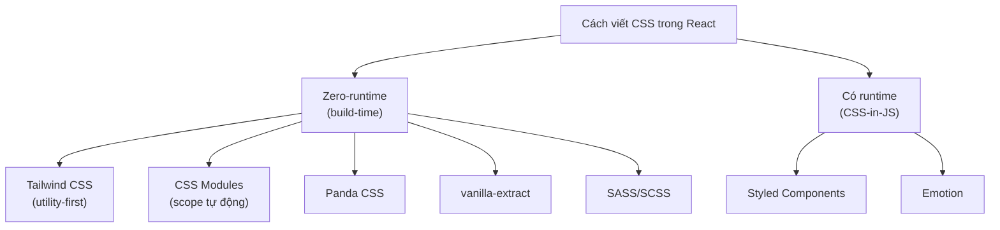
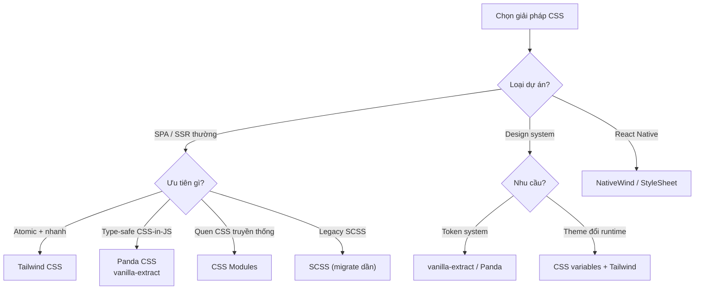

# Writing CSS trong React

Trong React có rất nhiều cách để viết CSS (định kiểu, tô màu sắc và bố cục cho giao diện). Bạn có thể dùng file CSS thường, **CSS Modules** (CSS đóng gói riêng cho từng component để tránh trùng tên lớp), **CSS-in-JS** (viết CSS ngay trong code JavaScript) như Styled Components, hoặc các tiện ích như **Tailwind CSS** (bộ lớp dựng sẵn giúp định kiểu nhanh ngay trên thẻ HTML). Bài này giúp người mới nắm bức tranh tổng quan để chọn cách phù hợp với dự án.

---

:::note[Ghi nhớ nhanh]

- ⭐ **Tailwind CSS là mặc định 2026** — utility-first, không runtime, tree-shaking nên bundle nhỏ; đáng học cú pháp.
- **CSS Modules** — tự sinh hash cho class nên không trùng tên toàn cục, built-in sẵn trong Vite/Next/CRA.
- ⭐ **CSS-in-JS (`styled-components`, Emotion) đang giảm phổ biến** — có runtime cost, kém tương thích Server Components; project mới không nên chọn trừ khi có lý do rõ.
- **Panda CSS / vanilla-extract** — type-safe, compile thành CSS tĩnh (zero-runtime) → lựa chọn thay CSS-in-JS.
- **SASS/SCSS ngày càng ít cần** — CSS thuần đã có nesting, `var()`, `calc()`; chỉ giữ khi cần mixin/function hoặc codebase legacy.

:::

---

## Mục lục

- [Vì sao có nhiều cách viết CSS trong React?](#vì-sao-có-nhiều-cách-viết-css-trong-react)
- [Tổng quan các cách](#tổng-quan-các-cách)
- [Tailwind CSS (khuyến nghị)](#tailwind-css-khuyến-nghị)
- [CSS Modules](#css-modules)
- [Styled Components / Emotion](#styled-components--emotion)
- [Panda CSS, vanilla-extract](#panda-css-vanilla-extract)
- [SASS/SCSS](#sassscss)
- [Câu hỏi phỏng vấn](#câu-hỏi-phỏng-vấn)

---

## Vì sao có nhiều cách viết CSS trong React?

**Vấn đề:**

CSS thường là toàn cục — class đặt ở đâu cũng áp cho cả trang. Khi nhiều component cùng đặt tên class giống nhau, chúng đụng độ và ghi đè lẫn nhau. Càng nhiều file CSS, càng khó biết class nào còn dùng (dead CSS) và khó style động theo props/state.

```css
/* Button.css */
.button { background: blue; }

/* Card.css — cùng tên .button, ghi đè ngầm! */
.button { background: gray; }
```

```jsx
// Muốn đổi màu theo props nhưng CSS tĩnh không làm được
function Button({ primary }) {
  // Phải tự nối class thủ công, dễ sai
  return <button className="button">Save</button>;
}
```

**Giải pháp:**

Các cách viết CSS theo component giải bài toán **scope** (giới hạn phạm vi) và **đồng bộ style với component**:

- **CSS Modules** — tự đặt hash cho class nên không bao giờ trùng tên.
- **styled-components / CSS-in-JS** — style gắn liền component, đổi động theo props.
- **Tailwind** — dùng utility class dựng sẵn, không phải tự đặt tên.

```css
/* Button.module.css — class tự sinh hash, không đụng .button của Card */
.button { background: blue; }
```

```jsx
// styled-components: style đổi theo props ngay trong component
const Button = styled.button`
  background: ${props => props.primary ? "blue" : "gray"};
`;
```

:::tip[Dùng thực tế]

- **Tránh đụng tên class** — hai component đều có `.title` mà không ghi đè nhau (CSS Modules).
- **Style theo props / biến theme** — nút đổi màu theo `primary`, theme sáng/tối (styled-components, CSS variables).
- **Xoá component là xoá luôn style** — không còn dead CSS lang thang vì style nằm cùng component.
- **Prototyping nhanh** — ghép utility class ngay trên JSX, không cần tạo file CSS riêng (Tailwind).

:::

---

## Tổng quan các cách

| Phương pháp | Runtime | Khuyến nghị | Đặc điểm |
|-------------|---------|-------------|----------|
| **Tailwind CSS** | Không | **Có** | Utility-first, phổ biến nhất |
| **CSS Modules** | Không | Có | Scope tự động, đơn giản |
| **Panda CSS** | Không | Có | Type-safe, zero-runtime |
| **vanilla-extract** | Không | Có | TypeScript-first |
| **Styled Components** | **Có** | Cân nhắc | CSS-in-JS, runtime cost |
| **Emotion** | **Có** | Cân nhắc | Tương tự Styled Components |
| **SASS/SCSS** | Không | Tùy | Vẫn dùng được với React |

Sơ đồ dưới đây phân loại các cách viết CSS theo nhóm:



---

## Tailwind CSS (khuyến nghị)

[Tailwind](https://tailwindcss.com) — utility-first CSS framework.

```bash
npm install -D tailwindcss postcss autoprefixer
npx tailwindcss init -p
```

```jsx
function Button({ children, primary }) {
  return (
    <button className={`
      px-4 py-2 rounded font-medium
      ${primary ? "bg-blue-600 text-white" : "bg-gray-200"}
      hover:opacity-80
    `}>
      {children}
    </button>
  );
}
```

Pattern với `clsx` / `cn`:

```jsx
import clsx from "clsx";

function Button({ primary, disabled, children }) {
  return (
    <button className={clsx(
      "px-4 py-2 rounded font-medium",
      primary && "bg-blue-600 text-white",
      disabled && "opacity-50 cursor-not-allowed"
    )}>
      {children}
    </button>
  );
}
```

:::info[Phân tích]

**Tại sao Tailwind thắng?**

1. **No naming overhead** — không phải nghĩ tên class.
2. **Co-location** — style ngay tại JSX, không nhảy file.
3. **Tree-shaking** — chỉ build CSS class đã dùng → bundle nhỏ.
4. **Consistent** — design system built-in (spacing, color scale).
5. **Responsive dễ** — `md:`, `lg:` prefix.
6. **Dark mode dễ** — `dark:` prefix.
7. **Editor tooling** — IntelliSense extension cực mạnh.

Phản đối thường gặp:

- "Class name quá dài" → đúng, dùng `clsx` + extract pattern (`btn`,
  `btn-primary`).
- "Khó đọc" → quen sau vài tuần.
- "Mixing concerns" → utility-first là cố ý — đổi tư duy.

Năm 2026, **Tailwind v4** (alpha→stable) đã ra với CSS-first config,
nhanh hơn nhiều, syntax mới hơn.

:::

---

## CSS Modules

Built-in trong Vite/Next/CRA — không cần cài thêm.

```css
/* Button.module.css */
.button {
  padding: 8px 16px;
  border-radius: 4px;
}

.primary {
  background: blue;
  color: white;
}
```

```jsx
import styles from "./Button.module.css";

function Button({ primary, children }) {
  return (
    <button className={`${styles.button} ${primary ? styles.primary : ""}`}>
      {children}
    </button>
  );
}
```

CSS Module **tự generate unique class name** → tránh xung đột global.

Phù hợp:

- Team quen viết CSS truyền thống.
- Component có style phức tạp (animation, pseudo-class).
- Không muốn dependency thêm.

---

## Styled Components / Emotion

CSS-in-JS — viết CSS thẳng trong JS file.

```bash
npm install styled-components
```

```jsx
import styled from "styled-components";

const Button = styled.button`
  padding: 8px 16px;
  background: ${props => props.primary ? "blue" : "gray"};
  color: white;
`;

<Button primary>Save</Button>
```

:::warning[Cần lưu ý]

**CSS-in-JS đang giảm phổ biến từ 2023+**. Lý do:

1. **Runtime cost** — generate CSS string runtime, slow on hydration.
2. **Server Components** không support tốt — phần lớn CSS-in-JS lib không
   compat với React Server Components.
3. **Bundle size** — runtime ~10-30KB.
4. **Maintain mode** — Styled Components đã giảm update.

Lựa chọn thay thế:

- **Tailwind** — utility, không runtime.
- **CSS Modules** — vanilla CSS, không runtime.
- **vanilla-extract** — type-safe, compile-time.
- **Panda CSS** — type-safe, atomic CSS compile-time.

Project mới năm 2026 **không nên chọn Styled Components / Emotion** trừ
khi có lý do rõ.

:::

---

## Panda CSS, vanilla-extract

**Panda CSS** — type-safe utility-CSS, compile-time, không runtime cost:

```tsx
import { css } from "../styled-system/css";

function Button() {
  return (
    <button className={css({ bg: "blue.500", color: "white", p: "4" })}>
      Click
    </button>
  );
}
```

**vanilla-extract** — viết CSS bằng TypeScript:

```tsx
// button.css.ts
import { style } from "@vanilla-extract/css";

export const button = style({
  padding: 16,
  background: "blue",
  ":hover": { opacity: 0.8 },
});
```

```tsx
import { button } from "./button.css";
<button className={button}>Click</button>
```

Cả hai compile thành **static CSS** tại build time → không có runtime
overhead. Type-safe → autocomplete, refactor an toàn.

---

## SASS/SCSS

Vẫn dùng được với React qua loader. Cài:

```bash
npm install -D sass
```

```scss
// styles.scss
.button {
  padding: 8px 16px;

  &.primary { background: blue; }
  &:hover    { opacity: 0.8; }
}
```

```jsx
import "./styles.scss";

<button className="button primary">Save</button>
```

:::info[Phân tích]

**SASS năm 2026 — có còn cần?**

CSS native đã có hầu hết feature SASS từng dẫn đầu:

- **Nesting** — CSS 2022+ hỗ trợ.
- **Variables** — `var(--name)` từ lâu.
- **Calc** — `calc()` native.
- **Color function** — `color-mix()`, `light-dark()` đang ra.
- **Custom property fallback** — `var(--x, default)`.

Lý do vẫn dùng SASS:

- **Mixin** — `@mixin` chưa có native equivalent đầy đủ.
- **Function** — `@function`, math operations.
- **Module system** — `@use`, `@forward`.
- **Codebase lớn legacy** — chi phí migrate cao.

Project mới ưu tiên CSS thuần + PostCSS plugin nếu cần feature đặc biệt.

:::

:::tip[Mẹo]

**Quy tắc chọn CSS solution 2026:**

```
SPA/SSR thông thường?
├─ Cần atomic + utility nhanh? → Tailwind CSS
├─ Cần type-safe CSS-in-JS? → Panda CSS / vanilla-extract
├─ Team quen CSS truyền thống? → CSS Modules
└─ Có codebase legacy SCSS? → SCSS (migrate dần)

Component library / design system?
├─ Token system → vanilla-extract / Panda
└─ Theme runtime đổi → CSS variables + Tailwind

Mobile (React Native)?
└─ NativeWind (Tailwind cho RN) / StyleSheet API
```

Sơ đồ hoá quy tắc chọn ở trên:



Đa số dự án **Tailwind là default** — học cú pháp đáng giá.

:::

---

## Câu hỏi phỏng vấn

Những câu thường gặp về chủ đề này. Tự trả lời trước, rồi đối chiếu lại với nội dung phía trên.

1. Vì sao CSS toàn cục gây vấn đề trong ứng dụng React nhiều component? Nêu các triệu chứng thường gặp.
2. CSS Modules tạo scope bằng cách nào? Class `.button` biến thành gì sau khi build và ai chịu trách nhiệm sinh ra tên đó?
3. Giải thích `specificity` (độ ưu tiên) trong CSS và vì sao nó là nguyên nhân của phần lớn xung đột style trong dự án lớn.
4. So sánh CSS Modules, CSS-in-JS và Tailwind trên bốn tiêu chí: scope, runtime cost, developer experience và khả năng tái sử dụng.
5. Tailwind là `utility-first`. Trả lời phản biện phổ biến rằng nó làm markup rối và giống việc quay lại inline style.
6. Tailwind giữ bundle CSS nhỏ bằng cách nào? Giải thích cơ chế quét file và vì sao tên class ghép chuỗi động lại bị mất khi build.
7. Bạn tái sử dụng một cụm class Tailwind lặp lại nhiều nơi như thế nào — tách component, dùng `@apply`, hay dùng biến thể với `cva`? Đánh đổi của mỗi cách?
8. `clsx` và `tailwind-merge` giải quyết vấn đề gì? Vì sao chỉ nối chuỗi class là chưa đủ khi cần ghi đè?
9. Vì sao CSS-in-JS như `styled-components` bị coi là có `runtime cost`? Chi phí đó phát sinh ở thời điểm nào trong vòng đời render?
10. Vì sao CSS-in-JS truyền thống không hợp với React Server Components? Cụ thể phần nào của thư viện cần chạy phía client?
11. `zero-runtime CSS-in-JS` (Panda CSS, vanilla-extract) hoạt động ra sao? Nó đánh đổi gì so với `styled-components` để đạt được điều đó?
12. Bạn triển khai `dark mode` như thế nào với Tailwind, với CSS Modules và với CSS variables? So sánh ba cách.
13. CSS variables khác biến của SASS ở điểm cốt lõi nào? Vì sao điều đó quan trọng khi làm theming đổi lúc chạy?
14. SASS/SCSS ngày càng ít cần thiết. Những tính năng nào của CSS hiện đại đã thay thế nó, và trường hợp nào vẫn nên giữ SCSS?
15. `FOUC` (nhấp nháy style chưa tải) xảy ra vì sao trong app SSR, và bạn xử lý ra sao với từng giải pháp CSS?
16. Bạn được giao chọn giải pháp CSS cho một design system dùng chung nhiều sản phẩm. Bạn chọn gì và trình bày tiêu chí quyết định.
