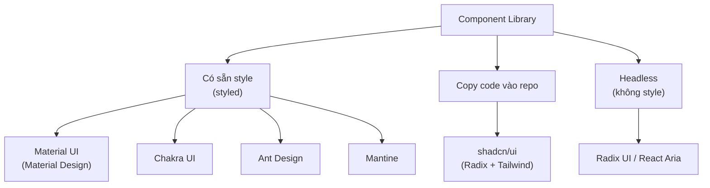
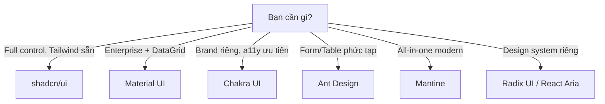

# Component Libraries

**Component library** (thư viện thành phần giao diện dựng sẵn) cung cấp các thành phần như nút bấm, bảng, hộp thoại... đã được thiết kế và lập trình sẵn để bạn ráp vào ứng dụng. Nhờ đó người mới không phải tự xây từng thành phần từ đầu, mà có ngay giao diện đẹp, nhất quán và đã được kiểm thử kỹ. Bài này giới thiệu các thư viện phổ biến như shadcn/ui, MUI, Chakra UI để bạn biết cách lựa chọn.

[](pathname:///img/react/component-libraries.webp)

---

:::note[Ghi nhớ nhanh]

- ⭐ **Component library giúp không phải tự xây UI từ đầu** — lo sẵn accessibility, keyboard, responsive và các trạng thái (hover, disabled, loading), đổi lại bundle to hơn và đôi khi khó tuỳ biến sâu.
- ⭐ **`shadcn/ui` là default cho React + TypeScript + Tailwind** — không phải npm package mà là code copy vào repo (dựng trên Radix + Tailwind), sửa thoải mái, không lock-in nhưng tự maintain.
- **Material UI (MUI)** hợp enterprise/dashboard (có MUI X DataGrid) nhưng bundle nặng và mang "chất" Material.
- **Chakra UI** mạnh về accessibility và style prop; **Ant Design** giàu Form/Table cho admin nhưng nặng nhất; **Mantine** all-in-one modern (120+ component, 50+ hook).
- **Tránh trộn nhiều UI lib** trong cùng project và cân nhắc kỹ (bundle, a11y, maintained, RSC) vì đổi UI library giữa chừng rất tốn công.

:::

---

## Mục lục

- [Vì sao dùng component library?](#vì-sao-dùng-component-library)
- [Tổng quan](#tổng-quan)
- [shadcn/ui (khuyến nghị)](#shadcnui-khuyến-nghị)
- [Material UI (MUI)](#material-ui-mui)
- [Chakra UI](#chakra-ui)
- [Ant Design](#ant-design)
- [Mantine](#mantine)
- [Cách chọn](#cách-chọn)
- [Câu hỏi phỏng vấn](#câu-hỏi-phỏng-vấn)

---

## Vì sao dùng component library?

**Vấn đề:** Tự xây mọi UI từ đầu — button, modal, dropdown, date picker,
table — rất tốn thời gian và khó làm đúng accessibility (a11y), keyboard,
responsive, các trạng thái (hover, disabled, loading, error). Dễ thiếu sót
và giao diện không nhất quán giữa các phần.

```jsx
// Dropdown tự viết — phải lo đủ thứ: click ngoài để đóng, phím Esc/mũi tên,
// focus trap, aria-expanded, aria-activedescendant... rất dễ sót.
function Dropdown({ options }) {
  const [open, setOpen] = useState(false);
  // ...quản lý keyboard, ARIA, click-outside, responsive bằng tay
  return (
    <div onClick={() => setOpen(!open)}>
      {/* a11y? keyboard? mobile? — tự lo hết */}
    </div>
  );
}
```

**Giải pháp:** Dùng component library (MUI, Ant Design, Chakra UI,
shadcn/ui...) — bộ component dựng sẵn đã lo a11y, responsive, theme và đồng
nhất giao diện, để bạn tập trung vào nghiệp vụ.

```jsx
import { Select } from "@mantine/core";

// Đã lo keyboard, ARIA, click-outside, mobile, theme sẵn.
<Select
  label="Quốc gia"
  data={["Việt Nam", "Nhật Bản", "Hàn Quốc"]}
/>
```

Đánh đổi: bundle size lớn hơn và đôi khi khó tuỳ biến sâu.

:::tip[Dùng thực tế]

- **Dựng dashboard/admin nhanh** — có sẵn Table, Form, Date Picker phức tạp.
- **Form phức tạp** nhiều trường, validate, trạng thái — dùng Form API có sẵn.
- **MVP/startup cần ra mắt nhanh** — ghép component thay vì xây từ số 0.
- **Cần đảm bảo a11y sẵn** — keyboard, screen reader đã được lo từ đầu.

:::

---

## Tổng quan

| Library | Style | Custom dễ? | Khuyến nghị | Best for |
|---------|-------|-----------|-------------|----------|
| **shadcn/ui** | Copy-paste, Tailwind | **Rất dễ** | **Có** | Project mới, full control |
| **Material UI** | Material Design | Trung bình | Có | Enterprise, dashboard |
| **Chakra UI** | Custom design | Dễ | Có | Brand-flexible |
| **Ant Design** | Ant Design system | Khó | Có | Admin dashboard, China market |
| **Mantine** | Custom design | Dễ | Có | Modern, đầy đủ hook |
| **Radix UI** | Headless | Cần style tay | Có | Build design system riêng |

Sơ đồ phân loại các thư viện theo cách tiếp cận:



---

## shadcn/ui (khuyến nghị)

[shadcn/ui](https://ui.shadcn.com) — **không phải npm package**, là **bộ
sưu tập component** bạn copy vào codebase.

```bash
npx shadcn@latest init
npx shadcn@latest add button
```

Sau khi add, code component nằm trong project (`components/ui/`):

```tsx
// components/ui/button.tsx — code TS đầy đủ trong repo
import { Slot } from "@radix-ui/react-slot";
import { cva, type VariantProps } from "class-variance-authority";

const buttonVariants = cva(/* ... */);

export function Button({ className, variant, ...props }) {
  return (
    <button className={cn(buttonVariants({ variant }), className)} {...props} />
  );
}
```

:::info[Phân tích]

**shadcn/ui khác library truyền thống** ở điểm quan trọng:

- **Component không phải dependency** — code trong repo bạn, sửa thoải mái.
- **Built trên Radix UI** (headless) + **Tailwind CSS** (styling).
- **Không có lock-in** — không phải maintain version, breaking change.
- **AI-friendly** — Cursor, Copilot, Claude đọc/sửa được vì code lộ thiên.

Trade-off:

- **Tự maintain** — bug fix không tự về (phải `add` lại).
- **Customize tự do** = tự chịu.
- Cần Tailwind sẵn trong project.

shadcn/ui đã thành **default choice** cho project React TypeScript +
Tailwind 2024+. AI agent code generator cũng ưa thích pattern này.

:::

---

## Material UI (MUI)

[Material UI](https://mui.com) — Google Material Design.

```bash
npm install @mui/material @emotion/react @emotion/styled
```

```jsx
import { Button, TextField } from "@mui/material";

<Button variant="contained" onClick={save}>Save</Button>
<TextField label="Email" />
```

Phù hợp:

- **Enterprise app** — đã quen Material Design.
- **Admin dashboard** với MUI X DataGrid (table powerful).
- **Cần component phong phú** — Date picker, autocomplete, transfer list.

Trade-off:

- Bundle khá nặng (~100KB cho core).
- Custom theme cần học MUI theming API.
- "Material" look — không phải mọi product muốn.

---

## Chakra UI

[Chakra UI](https://chakra-ui.com) — design tự chủ, focus accessibility.

```bash
npm install @chakra-ui/react @emotion/react @emotion/styled
```

```jsx
import { Button, Box, Text } from "@chakra-ui/react";

<Box bg="blue.500" p={4}>
  <Text color="white">Hi</Text>
  <Button colorScheme="green">Save</Button>
</Box>
```

Đặc điểm:

- **Style prop** — pass CSS qua prop (`bg`, `p`, `color`).
- **Accessibility** ngon nhất nhóm (focus, keyboard, ARIA).
- **Theme tokens** dễ custom.

Chakra UI v3 (2024) thay đổi nhiều — Chakra design hệ thống mới, dùng
Panda CSS thay Emotion.

---

## Ant Design

[Ant Design](https://ant.design) — design system từ Alibaba, phổ biến
trong dashboard.

```bash
npm install antd
```

```jsx
import { Button, Form, Input, Table } from "antd";

<Form>
  <Form.Item label="Email" name="email" rules={[{ required: true }]}>
    <Input />
  </Form.Item>
  <Button type="primary" htmlType="submit">Submit</Button>
</Form>
```

Phù hợp:

- **Admin dashboard, CRM** — có sẵn DataTable, Form, Date Picker phức tạp.
- **Form-heavy app** — Form API rất mạnh.
- **Thị trường Trung Quốc** — design phù hợp.

Trade-off:

- Bundle nặng nhất (~500KB nếu không tree-shake).
- Custom theme phức tạp (Less variables, CSS-in-JS).
- Look "rất AntD" — khó disguise.

---

## Mantine

[Mantine](https://mantine.dev) — modern, đầy đủ component + hook.

```bash
npm install @mantine/core @mantine/hooks
```

```jsx
import { Button, TextInput } from "@mantine/core";

<TextInput label="Email" placeholder="you@..." />
<Button onClick={save}>Save</Button>
```

Đặc điểm:

- **120+ component**, **50+ hook**.
- **Theme system** linh hoạt.
- **TypeScript-first**.
- **Light + dark mode** built-in.
- **Less heavy** than AntD.

Phù hợp project muốn batteries-included + modern API.

---

## Cách chọn

```
Bạn cần gì?

├─ Full control, copy code, Tailwind sẵn? → shadcn/ui
│
├─ Enterprise/dashboard với MUI X data grid? → Material UI
│
├─ Brand riêng, accessibility ưu tiên? → Chakra UI
│
├─ Admin với Form/Table phức tạp? → Ant Design
│
├─ All-in-one modern, ít compromise? → Mantine
│
└─ Build design system riêng từ đầu? → Radix UI / React Aria (headless)
```

Sơ đồ hoá cây quyết định trên:



:::tip[Mẹo]

**Quy tắc thực dụng 2026:**

1. **Project mới, TS + Tailwind**: shadcn/ui (mặc định).
2. **Enterprise legacy MUI**: stick với MUI.
3. **Cần component phong phú đặc biệt** (date picker phức tạp, DataGrid):
   bổ sung từ thư viện chuyên (TanStack Table, react-day-picker).
4. **Brand identity mạnh**: shadcn/ui + custom Tailwind theme, hoặc
   Radix UI + style tay.
5. **Không học Tailwind**: Mantine hoặc Chakra UI.

Tránh trộn nhiều UI lib trong cùng project — design ngắt nghé, bundle to,
maintain khó.

:::

:::warning[Cần lưu ý]

**Đánh giá lib trước khi commit**:

1. **Bundle size** — check trên bundlephobia.com.
2. **Accessibility** — keyboard nav, screen reader.
3. **Maintained?** — check commit gần nhất, issue, release.
4. **TypeScript support** — type quality.
5. **Server Components** — compat với React 19 / Next.js App Router.
6. **Customization** — sửa được không hay phải override CSS.

Đổi UI library giữa chừng dự án **cực kỳ tốn công** — chọn kỹ ngay từ đầu.

:::

---

## Câu hỏi phỏng vấn

Những câu thường gặp về chủ đề này. Tự trả lời trước, rồi bấm **Xem đáp án** để đối chiếu.

**1. Lợi ích và cái giá của việc dùng component library thay vì tự viết? Khi nào tự viết lại hợp lý hơn?**

<details className="qa">
<summary>Xem đáp án</summary>

**Lợi ích:** tiết kiệm rất nhiều thời gian và tránh những cái bẫy khó thấy. Một dropdown "đơn giản" tự viết phải lo click ra ngoài để đóng, phím `Esc` và mũi tên, focus trap, `aria-expanded`, hành vi trên mobile, trạng thái hover/disabled/loading — thư viện đã lo sẵn và đã được hàng nghìn dự án kiểm chứng. Kèm theo đó là giao diện nhất quán, theme, dark mode và tài liệu cho người mới vào dự án.

**Cái giá:** bundle lớn hơn, phải học API riêng của thư viện, đôi khi rất khó tuỳ biến sâu, phụ thuộc vào nhịp bảo trì của bên thứ ba, và đổi thư viện giữa chừng thì cực kỳ tốn công.

**Tự viết hợp lý khi:** chỉ cần vài component đơn giản (nút, input); thương hiệu có yêu cầu thiết kế rất đặc thù mà việc ghi đè thư viện còn tốn hơn xây mới; hoặc bạn đang xây design system dùng chung — khi đó nên đứng trên nền **headless** (Radix, React Aria) để vẫn hưởng phần a11y mà tự do hoàn toàn về style.

</details>

**2. shadcn/ui không phải npm package mà là code copy vào repo. Mô hình này thay đổi gì về nâng cấp, bảo trì và quyền kiểm soát?**

<details className="qa">
<summary>Xem đáp án</summary>

Chạy `npx shadcn@latest add button` không cài dependency — nó **ghi file nguồn** vào `components/ui/` của bạn. Từ đó component là **code của bạn**.

Thay đổi so với mô hình package:

| | Package truyền thống | shadcn/ui |
|---|---|---|
| Nâng cấp | `npm update`, bug fix tự về, đôi khi kèm breaking change | Không tự về; phải `add` lại và tự merge với phần đã sửa |
| Tuỳ biến | Qua theme API, prop, hoặc ghi đè CSS | Mở file ra sửa trực tiếp |
| Lock-in | Có — đổi thư viện là viết lại | Gần như không |
| Trách nhiệm | Maintainer lo | **Bạn lo** |

Được: kiểm soát tuyệt đối, không bị API của thư viện chặn đường, chỉ có đúng phần code bạn dùng nên bundle gọn, và code lộ thiên nên công cụ AI đọc/sửa rất tốt.

Mất: tự chịu trách nhiệm bảo trì. Nếu đội sửa lung tung mỗi nơi một kiểu, các component trong `components/ui/` sẽ trôi dạt khỏi nhau — cần quy ước rõ và review nghiêm.

</details>

**3. shadcn/ui đứng trên Radix và Tailwind. Vai trò của từng phần trong kiến trúc đó là gì?**

<details className="qa">
<summary>Xem đáp án</summary>

Ba tầng phân vai rất rạch ròi:

- **Radix UI** lo **hành vi và accessibility** — trạng thái đóng/mở, quản lý focus, điều hướng bằng bàn phím, thuộc tính ARIA, portal, click ra ngoài. Radix là **headless**: cung cấp toàn bộ logic nhưng gần như không có style.
- **Tailwind CSS** lo **hình thức** — màu, khoảng cách, bo góc, trạng thái hover/focus, responsive, dark mode; tất cả là class tĩnh, không có chi phí runtime.
- **`cva` + `cn`** lo **hệ biến thể** — ánh xạ prop (`variant`, `size`) sang cụm class, và gộp/ghi đè class khi bên dùng truyền `className` vào.
- **shadcn/ui** không phải tầng thứ tư mà là **công thức ráp** ba thứ trên lại, phát hành dưới dạng code copy được.

Giá trị của cách tách này: phần khó nhất và dễ làm sai nhất (a11y) do Radix đảm nhiệm và bạn hiếm khi cần đụng vào; phần bạn muốn sửa nhiều nhất (style) lại là phần dễ sửa nhất.

</details>

**4. `cva` (class-variance-authority) giải quyết vấn đề gì trong việc quản lý biến thể của component?**

<details className="qa">
<summary>Xem đáp án</summary>

Vấn đề: một `Button` thực tế có nhiều trục biến thể — `variant` (primary, ghost, destructive), `size` (sm, md, lg), cộng trạng thái disabled/loading. Nếu viết bằng toán tử ba ngôi lồng nhau thì nhanh chóng không đọc nổi và rất dễ sót tổ hợp.

`cva` biến chuyện đó thành một khai báo có cấu trúc, kèm giá trị mặc định và kiểu TypeScript sinh tự động:

```ts
const button = cva("inline-flex items-center rounded font-medium", {
  variants: {
    variant: { primary: "bg-blue-600 text-white", ghost: "bg-transparent" },
    size: { sm: "h-8 px-3 text-sm", lg: "h-11 px-6" },
  },
  defaultVariants: { variant: "primary", size: "sm" },
});
```

Cái được: base class tách khỏi phần biến thiên, các tổ hợp nhìn thấy được trong một chỗ, có `compoundVariants` cho ca đặc biệt, và `VariantProps` cho ra kiểu prop chính xác nên gõ sai biến thể là compiler báo ngay. Thường đi kèm `cn()` (`clsx` + `tailwind-merge`) để `className` truyền từ ngoài ghi đè được đúng cách.

</details>

**5. Material UI theming hoạt động ra sao? Giải thích `ThemeProvider`, token và cách ghi đè style của một component cụ thể.**

<details className="qa">
<summary>Xem đáp án</summary>

MUI có một **theme object** tập trung chứa các token: `palette` (màu), `typography`, `spacing`, `shape`, `breakpoints`. `ThemeProvider` bọc quanh app và đưa object đó xuống qua React context; mọi component MUI đọc token từ đây thay vì hardcode giá trị — đổi token một chỗ là cả app đổi theo.

Các mức ghi đè, từ hẹp tới rộng:

1. **Một chỗ dùng** — prop `sx` trên chính component đó. Nhanh nhất, phạm vi hẹp nhất.
2. **Một component tuỳ biến** — bọc bằng `styled(Button)` để tạo phiên bản riêng dùng lại.
3. **Toàn app** — `components.MuiButton.styleOverrides` và `defaultProps` trong theme: mọi `Button` trong app đổi theo, và đây là cách đúng khi muốn nhất quán.

Nguyên tắc: ưu tiên **đổi token** trước, rồi tới override trong theme, `sx` để xử lý ngoại lệ. Cách tệ nhất là nhắm vào class nội bộ do MUI sinh ra rồi chèn `!important` — tên class ấy là chi tiết cài đặt, nâng cấp phiên bản là vỡ.

</details>

**6. So sánh Material UI và Ant Design về triết lý thiết kế, mức độ tuỳ biến và loại dự án phù hợp.**

<details className="qa">
<summary>Xem đáp án</summary>

| | Material UI | Ant Design |
|---|---|---|
| Triết lý | Hiện thực hoá **Material Design** của Google — ngôn ngữ thiết kế cho cả web lẫn mobile, thiên về sản phẩm hướng người dùng cuối | Design system của Alibaba, sinh ra từ nhu cầu **ứng dụng nghiệp vụ nội bộ** — mật độ thông tin cao, form và bảng là trung tâm |
| Tuỳ biến | Trung bình — theming API mạnh nhưng cần học; "chất Material" vẫn lộ ra | Khó nhất nhóm — look "rất AntD" rất khó giấu |
| Bộ component | Phong phú, mạnh nhất ở MUI X DataGrid, Date Picker | Rất giàu cho admin: Form API mạnh, Table, Transfer, Tree |
| Bundle | Khá nặng (~100KB core) | Nặng nhất (~500KB nếu không tree-shake) |
| Hợp với | Enterprise app, dashboard, sản phẩm chấp nhận phong cách Material | Admin/CRM/back-office nhiều form và bảng, thị trường Trung Quốc |

Chọn nhanh: nếu sản phẩm là **back-office nặng form và bảng**, AntD giúp bạn đi nhanh nhất. Nếu cần một nền tảng cân bằng hơn giữa app nội bộ và sản phẩm hướng khách hàng, MUI hợp hơn. Còn nếu thương hiệu đòi hỏi bản sắc riêng, cả hai đều là lựa chọn kém — hãy nghĩ tới shadcn/ui hoặc headless.

</details>

**7. Vì sao Ant Design bị coi là khó tuỳ biến? Điều gì trong cách nó tổ chức style tạo ra rào cản đó?**

<details className="qa">
<summary>Xem đáp án</summary>

Nguyên nhân nằm ở chỗ AntD là một **design system trọn gói chứ không phải bộ nguyên liệu**:

- **Style nằm sâu bên trong component.** Mỗi component tự sinh DOM nhiều tầng với class nội bộ (`ant-btn`, `ant-btn-primary`...). Muốn đổi một chi tiết phải nhắm vào những class đó — vốn là chi tiết cài đặt, có thể đổi giữa các phiên bản.
- **Specificity cao và selector lồng nhau**, nên ghi đè thường phải viết selector cụ thể hơn hoặc dùng `!important` — đúng vòng xoáy đã nói ở phần CSS.
- **Token chỉ đi tới một mức.** Đổi màu chủ đạo hay bo góc thì dễ, nhưng đổi bố cục bên trong hay tương quan khoảng cách thì hệ token không với tới.
- **Cấu hình phức tạp** — trước đây tuỳ biến qua biến Less và phải chỉnh build; từ v5 dùng `ConfigProvider` với `theme.token`, dễ hơn nhưng vẫn là đổi giá trị trong khuôn AntD định sẵn.

Nói ngắn gọn: AntD tối ưu cho việc **dựng nhanh theo phong cách của nó**. Khi yêu cầu thiết kế lệch khỏi phong cách đó, chi phí tăng rất nhanh.

</details>

**8. Bạn đánh giá `bundle size` của một UI library như thế nào? `tree-shaking` giúp được đến đâu và khi nào nó thất bại?**

<details className="qa">
<summary>Xem đáp án</summary>

Cách đánh giá:

- Tra nhanh trên **bundlephobia.com** để biết kích thước minified + gzip và các dependency kéo theo.
- Quan trọng hơn là **đo trong chính dự án**: dựng một trang thật rồi xem `rollup-plugin-visualizer` hoặc `@next/bundle-analyzer`. Con số thực tế phụ thuộc vào bạn dùng bao nhiêu component.
- Đừng quên chi phí đi kèm: runtime CSS-in-JS, icon set, file locale, và **JavaScript phải parse** — với thiết bị yếu, thời gian parse còn đáng ngại hơn số KB.

**Tree-shaking** loại bỏ code không dùng, nhưng chỉ khi thư viện phát hành **ES module** và code không có side effect. Nó thất bại khi:

- Thư viện chỉ có bản CommonJS, hoặc bundle sẵn thành một file.
- `package.json` thiếu `"sideEffects": false`, nên bundler không dám cắt.
- Bạn import cả namespace hoặc từ barrel file khổng lồ.
- **CSS không được tree-shake theo cách đó** — nhiều thư viện yêu cầu import một file CSS tổng, và bạn tải đủ cả dù chỉ dùng hai component.

</details>

**9. Nhiều UI library dùng CSS-in-JS. Điều đó ảnh hưởng thế nào tới Server Components và Next.js App Router?**

<details className="qa">
<summary>Xem đáp án</summary>

CSS-in-JS runtime cần context (`ThemeProvider`), state và truy cập DOM để chèn thẻ style — toàn những thứ Server Component không có. Hệ quả trong App Router:

- Mọi component của thư viện phải nằm trong cây **`"use client"`**, thường phải tự bọc lại hoặc dùng bản bọc sẵn của thư viện.
- Cây client lan rộng: một `Button` từ thư viện kéo theo việc trang đó mất lợi ích của Server Components — vẫn phải gửi JavaScript xuống client.
- Cần **style registry** để thu CSS lúc SSR rồi chèn vào HTML; thiếu bước này là FOUC.
- Bundle client to hơn và hydration chậm hơn.

Vì vậy, với dự án dựng trên App Router, nên ưu tiên các thư viện **zero-runtime**: shadcn/ui (Tailwind), Radix (headless, phần lớn là component tương tác nên đằng nào cũng cần client), hoặc các thư viện đã chuyển sang CSS tĩnh. Cần lưu ý thêm: component có tương tác (dropdown, dialog) **bản chất đã là client component**, nên vấn đề thật sự không phải "có dùng client hay không" mà là **chi phí runtime và độ lan rộng** của nó.

</details>

**10. Bạn kiểm tra mức độ `accessibility` của một component library ra sao — kiểm gì bằng bàn phím, kiểm gì bằng screen reader?**

<details className="qa">
<summary>Xem đáp án</summary>

**Bằng bàn phím** (cất chuột đi và đi hết luồng):

- `Tab`/`Shift+Tab` đi qua đúng thứ tự, không nhảy cóc, không mắc kẹt.
- **Focus ring nhìn thấy được** ở mọi phần tử tương tác.
- Dialog/modal: focus tự vào trong khi mở, **bị giữ lại bên trong** (focus trap), `Esc` đóng được, và focus **trả về đúng nút đã mở** khi đóng.
- Menu, listbox, tab: điều hướng bằng phím mũi tên, `Home`/`End`, gõ chữ để nhảy tới mục.
- Kích hoạt được bằng `Enter` và `Space`.

**Bằng screen reader** (VoiceOver trên macOS, NVDA trên Windows):

- Mỗi control được đọc đúng **tên, vai trò, trạng thái** — ví dụ "Quốc gia, hộp tổ hợp, đã thu gọn".
- Lỗi form được thông báo và liên kết đúng với ô nhập.
- Nội dung xuất hiện động (toast, kết quả tìm kiếm) có được công bố qua live region không.

**Bổ trợ:** chạy `axe DevTools` hoặc Lighthouse, kiểm tra tương phản màu, thử phóng to 200%. Công cụ tự động chỉ bắt được phần nhỏ — kiểm thủ công bằng bàn phím vẫn giá trị nhất.

</details>

**11. Ghi đè style của component thư viện có mấy cách (prop `className`, theme override, CSS specificity, wrapper)? Cách nào dễ vỡ nhất khi nâng cấp phiên bản?**

<details className="qa">
<summary>Xem đáp án</summary>

Xếp theo độ bền, từ an toàn tới dễ vỡ:

1. **Đổi design token trong theme** — an toàn nhất, vì token là API công khai của thư viện.
2. **Theme override cho một loại component** (ví dụ `styleOverrides` của MUI) — vẫn là API chính thức, áp dụng nhất quán toàn app.
3. **Prop `className`/`sx`/style prop** — được thư viện hỗ trợ chính thức; với Tailwind nhớ dùng `tailwind-merge` để class truyền vào thắng được class mặc định.
4. **Component wrapper** — tự bọc `Button` của thư viện thành `Button` của dự án, tập trung mọi tuỳ biến vào một chỗ. Hơi tốn công ban đầu nhưng là **điểm tựa vàng khi cần migrate sau này**.
5. **Nhắm vào class nội bộ do thư viện sinh ra**, đua specificity hoặc rải `!important` — **dễ vỡ nhất**. Những class ấy là chi tiết cài đặt, không có cam kết ổn định; một bản nâng cấp đổi cấu trúc DOM là giao diện hỏng ở những chỗ không ai ngờ, và lỗi thường chỉ lộ ra khi người dùng gặp.

Nguyên tắc: chỉ ghi đè qua những gì thư viện **công khai coi là API**.

</details>

**12. Vì sao không nên trộn nhiều UI library trong cùng một dự án? Nêu các vấn đề cụ thể phát sinh.**

<details className="qa">
<summary>Xem đáp án</summary>

- **Giao diện không nhất quán** — nút của MUI và nút của AntD khác nhau về chiều cao, bo góc, font, hiệu ứng. Người dùng cảm nhận được sự chắp vá.
- **Bundle cộng dồn** — hai bộ component, có khi hai runtime CSS-in-JS, hai icon set.
- **Xung đột style toàn cục** — CSS reset của thư viện này đè lên thư viện kia; thứ tự import quyết định kết quả, mà thứ tự đó lại rất khó kiểm soát.
- **Hai hệ theme song song** — đổi màu thương hiệu phải làm hai lần, hai cách khác nhau, và vẫn lệch.
- **Z-index và portal đánh nhau** — modal của lib A nằm dưới dropdown của lib B là lỗi kinh điển.
- **Chi phí nhận thức** — lập trình viên phải nhớ hai API, và mỗi lần thêm component lại phải hỏi "lấy từ đâu".

Ngoại lệ hợp lý: bổ sung một **thư viện chuyên biệt** cho bài toán hẹp mà bộ chính làm chưa tốt — TanStack Table cho bảng, `react-day-picker` cho lịch. Đó khác hẳn việc dùng song song hai design system.

</details>

**13. Nêu checklist bạn dùng trước khi cam kết một UI library cho dự án dài hạn.**

<details className="qa">
<summary>Xem đáp án</summary>

1. **Bundle size** — kiểm trên bundlephobia, đo thử trong dự án; tree-shaking có hiệu quả không.
2. **Accessibility** — thử bàn phím và screen reader trên vài component khó (dialog, combobox, menu), đừng tin quảng cáo trên trang chủ.
3. **Còn được bảo trì không** — commit gần nhất, nhịp release, số issue tồn, có công ty đứng sau không.
4. **TypeScript** — chất lượng type thật sự, không phải chỉ có file `.d.ts` cho có.
5. **Tương thích React 19 / RSC / Next.js App Router** — nếu dự án dùng.
6. **Khả năng tuỳ biến** — thử ghi đè một component theo yêu cầu thiết kế khó nhất; đã phải `!important` ngay ở bước thử thì đừng chọn.
7. **Độ phủ component** — có đủ những thứ khó (DataGrid, date picker, combobox) không.
8. **Cộng đồng, tài liệu và giấy phép** — dễ tìm câu trả lời khi mắc kẹt không; chú ý phần tính phí (MUI X có bản thương mại).

Và quan trọng nhất: **dựng thử một màn hình thật** bằng thư viện đó trước khi quyết, vì đổi UI library giữa chừng cực kỳ tốn công.

</details>

**14. Dự án đang dùng Material UI và cần đổi sang shadcn/ui. Bạn lên kế hoạch migration từng bước thế nào để không đóng băng phát triển?**

<details className="qa">
<summary>Xem đáp án</summary>

Nguyên tắc: **chấp nhận hai thư viện cùng tồn tại một giai đoạn**, migrate theo component chứ không theo màn hình.

1. **Chuẩn bị nền** — cài Tailwind, khởi tạo shadcn/ui, ánh xạ design token của MUI (màu, spacing, radius, typography) sang token Tailwind. Bước này quyết định hai bên trông giống nhau tới đâu.
2. **Dựng lớp bọc** — tạo `components/ui/Button` của dự án, hiện tại chỉ re-export MUI. Rồi đổi mọi chỗ dùng sang import từ lớp bọc. Sau bước này, thay ruột một component là sửa **một file**.
3. **Đóng băng chiều mở rộng** — quy ước: code mới chỉ dùng shadcn/ui.
4. **Migrate từ lá lên gốc** — bắt đầu với component đơn giản, không trạng thái (Button, Badge, Card), rồi tới Dialog, Select, Form. Để **DataGrid và date picker sau cùng** — phần khó nhất, có khi nên thay bằng TanStack Table.
5. **Kiểm chứng** — so sánh ảnh chụp giao diện, kiểm thử a11y bằng bàn phím.
6. **Dọn dẹp** — hết import thì gỡ MUI và Emotion, đo lại bundle.

Xuyên suốt: chia thành nhiều PR nhỏ, mỗi PR một nhóm component, để tính năng vẫn ra đều.

</details>
