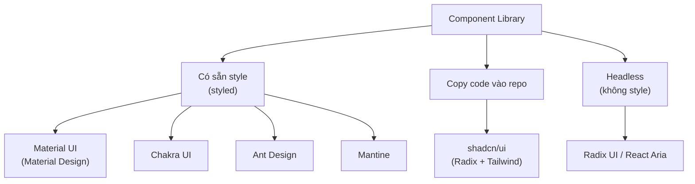
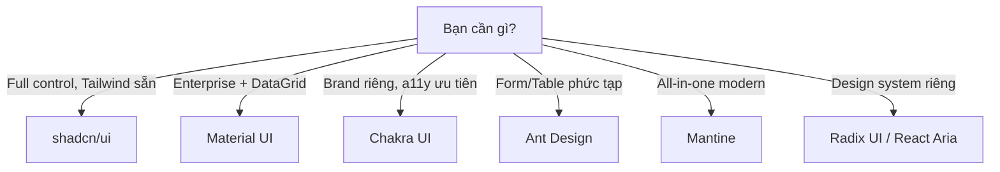

# Component Libraries

**Component library** (thư viện thành phần giao diện dựng sẵn) cung cấp các thành phần như nút bấm, bảng, hộp thoại... đã được thiết kế và lập trình sẵn để bạn ráp vào ứng dụng. Nhờ đó người mới không phải tự xây từng thành phần từ đầu, mà có ngay giao diện đẹp, nhất quán và đã được kiểm thử kỹ. Bài này giới thiệu các thư viện phổ biến như shadcn/ui, MUI, Chakra UI để bạn biết cách lựa chọn.

---

:::note[Ghi nhớ nhanh]

- ⭐ **Component library giúp không phải tự xây UI từ đầu** — lo sẵn accessibility, keyboard, responsive và các trạng thái (hover, disabled, loading), đổi lại bundle to hơn và đôi khi khó tuỳ biến sâu.
- ⭐ **`shadcn/ui` là default cho React + TypeScript + Tailwind** — không phải npm package mà là code copy vào repo (dựng trên Radix + Tailwind), sửa thoải mái, không lock-in nhưng tự maintain.
- **Material UI (MUI)** hợp enterprise/dashboard (có MUI X DataGrid) nhưng bundle nặng và mang "chất" Material.
- **Chakra UI** mạnh về accessibility và style prop; **Ant Design** giàu Form/Table cho admin nhưng nặng nhất; **Mantine** all-in-one modern (120+ component, 50+ hook).
- **Tránh trộn nhiều UI lib** trong cùng project và cân nhắc kỹ (bundle, a11y, maintained, RSC) vì đổi UI library giữa chừng rất tốn công.

:::

---

## Mục lục

- [Vì sao dùng component library?](#vì-sao-dùng-component-library)
- [Tổng quan](#tổng-quan)
- [shadcn/ui (khuyến nghị)](#shadcnui-khuyến-nghị)
- [Material UI (MUI)](#material-ui-mui)
- [Chakra UI](#chakra-ui)
- [Ant Design](#ant-design)
- [Mantine](#mantine)
- [Cách chọn](#cách-chọn)
- [Câu hỏi phỏng vấn](#câu-hỏi-phỏng-vấn)

---

## Vì sao dùng component library?

**Vấn đề:** Tự xây mọi UI từ đầu — button, modal, dropdown, date picker,
table — rất tốn thời gian và khó làm đúng accessibility (a11y), keyboard,
responsive, các trạng thái (hover, disabled, loading, error). Dễ thiếu sót
và giao diện không nhất quán giữa các phần.

```jsx
// Dropdown tự viết — phải lo đủ thứ: click ngoài để đóng, phím Esc/mũi tên,
// focus trap, aria-expanded, aria-activedescendant... rất dễ sót.
function Dropdown({ options }) {
  const [open, setOpen] = useState(false);
  // ...quản lý keyboard, ARIA, click-outside, responsive bằng tay
  return (
    <div onClick={() => setOpen(!open)}>
      {/* a11y? keyboard? mobile? — tự lo hết */}
    </div>
  );
}
```

**Giải pháp:** Dùng component library (MUI, Ant Design, Chakra UI,
shadcn/ui...) — bộ component dựng sẵn đã lo a11y, responsive, theme và đồng
nhất giao diện, để bạn tập trung vào nghiệp vụ.

```jsx
import { Select } from "@mantine/core";

// Đã lo keyboard, ARIA, click-outside, mobile, theme sẵn.
<Select
  label="Quốc gia"
  data={["Việt Nam", "Nhật Bản", "Hàn Quốc"]}
/>
```

Đánh đổi: bundle size lớn hơn và đôi khi khó tuỳ biến sâu.

:::tip[Dùng thực tế]

- **Dựng dashboard/admin nhanh** — có sẵn Table, Form, Date Picker phức tạp.
- **Form phức tạp** nhiều trường, validate, trạng thái — dùng Form API có sẵn.
- **MVP/startup cần ra mắt nhanh** — ghép component thay vì xây từ số 0.
- **Cần đảm bảo a11y sẵn** — keyboard, screen reader đã được lo từ đầu.

:::

---

## Tổng quan

| Library | Style | Custom dễ? | Khuyến nghị | Best for |
|---------|-------|-----------|-------------|----------|
| **shadcn/ui** | Copy-paste, Tailwind | **Rất dễ** | **Có** | Project mới, full control |
| **Material UI** | Material Design | Trung bình | Có | Enterprise, dashboard |
| **Chakra UI** | Custom design | Dễ | Có | Brand-flexible |
| **Ant Design** | Ant Design system | Khó | Có | Admin dashboard, China market |
| **Mantine** | Custom design | Dễ | Có | Modern, đầy đủ hook |
| **Radix UI** | Headless | Cần style tay | Có | Build design system riêng |

Sơ đồ phân loại các thư viện theo cách tiếp cận:



---

## shadcn/ui (khuyến nghị)

[shadcn/ui](https://ui.shadcn.com) — **không phải npm package**, là **bộ
sưu tập component** bạn copy vào codebase.

```bash
npx shadcn@latest init
npx shadcn@latest add button
```

Sau khi add, code component nằm trong project (`components/ui/`):

```tsx
// components/ui/button.tsx — code TS đầy đủ trong repo
import { Slot } from "@radix-ui/react-slot";
import { cva, type VariantProps } from "class-variance-authority";

const buttonVariants = cva(/* ... */);

export function Button({ className, variant, ...props }) {
  return (
    <button className={cn(buttonVariants({ variant }), className)} {...props} />
  );
}
```

:::info[Phân tích]

**shadcn/ui khác library truyền thống** ở điểm quan trọng:

- **Component không phải dependency** — code trong repo bạn, sửa thoải mái.
- **Built trên Radix UI** (headless) + **Tailwind CSS** (styling).
- **Không có lock-in** — không phải maintain version, breaking change.
- **AI-friendly** — Cursor, Copilot, Claude đọc/sửa được vì code lộ thiên.

Trade-off:

- **Tự maintain** — bug fix không tự về (phải `add` lại).
- **Customize tự do** = tự chịu.
- Cần Tailwind sẵn trong project.

shadcn/ui đã thành **default choice** cho project React TypeScript +
Tailwind 2024+. AI agent code generator cũng ưa thích pattern này.

:::

---

## Material UI (MUI)

[Material UI](https://mui.com) — Google Material Design.

```bash
npm install @mui/material @emotion/react @emotion/styled
```

```jsx
import { Button, TextField } from "@mui/material";

<Button variant="contained" onClick={save}>Save</Button>
<TextField label="Email" />
```

Phù hợp:

- **Enterprise app** — đã quen Material Design.
- **Admin dashboard** với MUI X DataGrid (table powerful).
- **Cần component phong phú** — Date picker, autocomplete, transfer list.

Trade-off:

- Bundle khá nặng (~100KB cho core).
- Custom theme cần học MUI theming API.
- "Material" look — không phải mọi product muốn.

---

## Chakra UI

[Chakra UI](https://chakra-ui.com) — design tự chủ, focus accessibility.

```bash
npm install @chakra-ui/react @emotion/react @emotion/styled
```

```jsx
import { Button, Box, Text } from "@chakra-ui/react";

<Box bg="blue.500" p={4}>
  <Text color="white">Hi</Text>
  <Button colorScheme="green">Save</Button>
</Box>
```

Đặc điểm:

- **Style prop** — pass CSS qua prop (`bg`, `p`, `color`).
- **Accessibility** ngon nhất nhóm (focus, keyboard, ARIA).
- **Theme tokens** dễ custom.

Chakra UI v3 (2024) thay đổi nhiều — Chakra design hệ thống mới, dùng
Panda CSS thay Emotion.

---

## Ant Design

[Ant Design](https://ant.design) — design system từ Alibaba, phổ biến
trong dashboard.

```bash
npm install antd
```

```jsx
import { Button, Form, Input, Table } from "antd";

<Form>
  <Form.Item label="Email" name="email" rules={[{ required: true }]}>
    <Input />
  </Form.Item>
  <Button type="primary" htmlType="submit">Submit</Button>
</Form>
```

Phù hợp:

- **Admin dashboard, CRM** — có sẵn DataTable, Form, Date Picker phức tạp.
- **Form-heavy app** — Form API rất mạnh.
- **Thị trường Trung Quốc** — design phù hợp.

Trade-off:

- Bundle nặng nhất (~500KB nếu không tree-shake).
- Custom theme phức tạp (Less variables, CSS-in-JS).
- Look "rất AntD" — khó disguise.

---

## Mantine

[Mantine](https://mantine.dev) — modern, đầy đủ component + hook.

```bash
npm install @mantine/core @mantine/hooks
```

```jsx
import { Button, TextInput } from "@mantine/core";

<TextInput label="Email" placeholder="you@..." />
<Button onClick={save}>Save</Button>
```

Đặc điểm:

- **120+ component**, **50+ hook**.
- **Theme system** linh hoạt.
- **TypeScript-first**.
- **Light + dark mode** built-in.
- **Less heavy** than AntD.

Phù hợp project muốn batteries-included + modern API.

---

## Cách chọn

```
Bạn cần gì?

├─ Full control, copy code, Tailwind sẵn? → shadcn/ui
│
├─ Enterprise/dashboard với MUI X data grid? → Material UI
│
├─ Brand riêng, accessibility ưu tiên? → Chakra UI
│
├─ Admin với Form/Table phức tạp? → Ant Design
│
├─ All-in-one modern, ít compromise? → Mantine
│
└─ Build design system riêng từ đầu? → Radix UI / React Aria (headless)
```

Sơ đồ hoá cây quyết định trên:



:::tip[Mẹo]

**Quy tắc thực dụng 2026:**

1. **Project mới, TS + Tailwind**: shadcn/ui (mặc định).
2. **Enterprise legacy MUI**: stick với MUI.
3. **Cần component phong phú đặc biệt** (date picker phức tạp, DataGrid):
   bổ sung từ thư viện chuyên (TanStack Table, react-day-picker).
4. **Brand identity mạnh**: shadcn/ui + custom Tailwind theme, hoặc
   Radix UI + style tay.
5. **Không học Tailwind**: Mantine hoặc Chakra UI.

Tránh trộn nhiều UI lib trong cùng project — design ngắt nghé, bundle to,
maintain khó.

:::

:::warning[Cần lưu ý]

**Đánh giá lib trước khi commit**:

1. **Bundle size** — check trên bundlephobia.com.
2. **Accessibility** — keyboard nav, screen reader.
3. **Maintained?** — check commit gần nhất, issue, release.
4. **TypeScript support** — type quality.
5. **Server Components** — compat với React 19 / Next.js App Router.
6. **Customization** — sửa được không hay phải override CSS.

Đổi UI library giữa chừng dự án **cực kỳ tốn công** — chọn kỹ ngay từ đầu.

:::

---

## Câu hỏi phỏng vấn

Những câu thường gặp về chủ đề này. Tự trả lời trước, rồi đối chiếu lại với nội dung phía trên.

1. Lợi ích và cái giá của việc dùng component library thay vì tự viết? Khi nào tự viết lại hợp lý hơn?
2. shadcn/ui không phải npm package mà là code copy vào repo. Mô hình này thay đổi gì về nâng cấp, bảo trì và quyền kiểm soát?
3. shadcn/ui đứng trên Radix và Tailwind. Vai trò của từng phần trong kiến trúc đó là gì?
4. `cva` (class-variance-authority) giải quyết vấn đề gì trong việc quản lý biến thể của component?
5. Material UI theming hoạt động ra sao? Giải thích `ThemeProvider`, token và cách ghi đè style của một component cụ thể.
6. So sánh Material UI và Ant Design về triết lý thiết kế, mức độ tuỳ biến và loại dự án phù hợp.
7. Vì sao Ant Design bị coi là khó tuỳ biến? Điều gì trong cách nó tổ chức style tạo ra rào cản đó?
8. Bạn đánh giá `bundle size` của một UI library như thế nào? `tree-shaking` giúp được đến đâu và khi nào nó thất bại?
9. Nhiều UI library dùng CSS-in-JS. Điều đó ảnh hưởng thế nào tới Server Components và Next.js App Router?
10. Bạn kiểm tra mức độ `accessibility` của một component library ra sao — kiểm gì bằng bàn phím, kiểm gì bằng screen reader?
11. Ghi đè style của component thư viện có mấy cách (prop `className`, theme override, CSS specificity, wrapper)? Cách nào dễ vỡ nhất khi nâng cấp phiên bản?
12. Vì sao không nên trộn nhiều UI library trong cùng một dự án? Nêu các vấn đề cụ thể phát sinh.
13. Nêu checklist bạn dùng trước khi cam kết một UI library cho dự án dài hạn.
14. Dự án đang dùng Material UI và cần đổi sang shadcn/ui. Bạn lên kế hoạch migration từng bước thế nào để không đóng băng phát triển?
