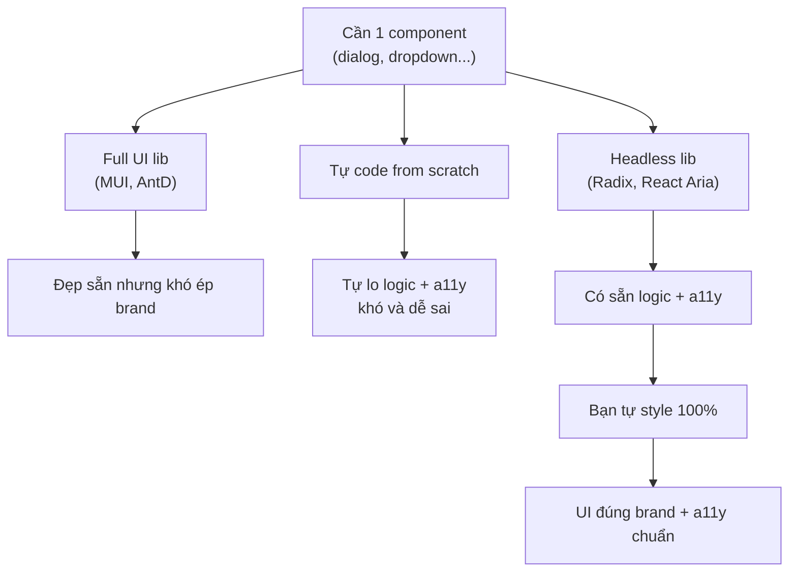
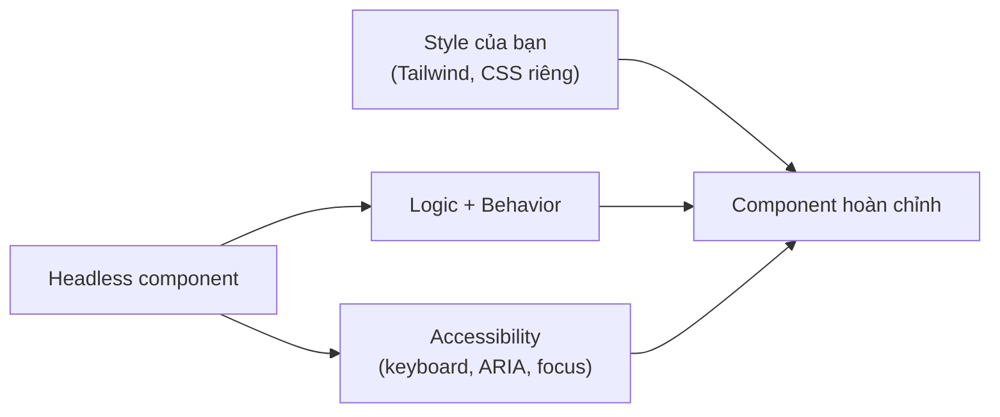

# Headless Component Libraries

**Headless library** (thư viện chỉ lo phần logic và khả năng truy cập, không kèm sẵn giao diện) cung cấp hành vi cho các thành phần như dropdown, dialog, tab... nhưng để bạn tự quyết định cách hiển thị. Khác với thư viện thành phần thông thường vốn áp sẵn kiểu dáng, headless cho bạn toàn quyền tự định kiểu (ví dụ bằng Tailwind) mà vẫn đảm bảo phần khó như **accessibility** (khả năng truy cập cho người khuyết tật) và xử lý bàn phím. Bài này giới thiệu các thư viện headless phổ biến như Radix UI, React Aria.

[](pathname:///img/react/headless-libraries.webp)

---

:::note[Ghi nhớ nhanh]

- ⭐ **Headless = logic + behavior + accessibility nhưng KHÔNG có style sẵn** — bạn tự tô 100% theo brand, giải bài toán "full UI lib đẹp sẵn nhưng khó ép theo design riêng".
- ⭐ **Radix UI phổ biến nhất (#1)** — chuẩn WAI-ARIA, compound component API, là nền của `shadcn/ui`.
- **React Aria (Adobe)** — accessibility mạnh nhất, hỗ trợ i18n/RTL, hợp app cần a11y nghiêm túc (gov, banking, healthcare).
- **Ark UI** chạy đa framework (React/Vue/Solid, dựa trên XState); **Headless UI** (của team Tailwind) ít component hơn và đang giảm.
- **Chọn headless khi cần brand riêng / design system riêng**; KHÔNG cần khi prototype nhanh hoặc cần component phong phú đặc biệt (DataGrid → MUI X tốt hơn).

:::

---

## Mục lục

- [Vì sao có headless UI?](#vì-sao-có-headless-ui)
- [Headless là gì?](#headless-là-gì)
- [Radix UI](#radix-ui)
- [React Aria](#react-aria)
- [Ark UI](#ark-ui)
- [Headless UI](#headless-ui)
- [Khi nào chọn headless?](#khi-nào-chọn-headless)
- [Câu hỏi phỏng vấn](#câu-hỏi-phỏng-vấn)

---

## Vì sao có headless UI?

**Vấn đề:** Thư viện component "full UI" (Material UI, Ant Design...) đẹp sẵn nhưng **khó ép theo design system riêng**. Muốn đổi look thì phải ghi đè style chồng chéo, vật lộn với specificity, và vẫn dính dáng dấp giao diện của thư viện.

```jsx
// MUI: ghi đè style vất vả, vẫn lộ "chất" Material
<Button
  sx={{
    backgroundColor: "#000 !important",
    borderRadius: 0,
    boxShadow: "none",
    "&:hover": { backgroundColor: "#333 !important" },
    // ...vẫn còn ripple, padding, font của MUI
  }}
>
  Save
</Button>
```

Còn tự code from scratch thì lại phải tự lo **logic phức tạp + accessibility** (keyboard nav, ARIA, focus trap) — phần khó và dễ sai nhất.

**Giải pháp:** **Headless UI** (Radix, Headless UI, React Aria, TanStack Table) cung cấp **logic + accessibility + tương tác bàn phím** nhưng **không áp style** → bạn tự tô 100% theo design. Tách hẳn logic khỏi giao diện.

```jsx
// Radix: lo logic + a11y, bạn tự style 100%
import * as Dialog from "@radix-ui/react-dialog";

<Dialog.Root>
  <Dialog.Trigger className="btn-cua-toi">Save</Dialog.Trigger>
  <Dialog.Portal>
    {/* class do bạn tự đặt — không dính style thư viện */}
    <Dialog.Content className="theme-rieng-cua-team">...</Dialog.Content>
  </Dialog.Portal>
</Dialog.Root>
```

Có thể hình dung ba hướng giải quyết khi cần một component như sau:



:::tip[Dùng thực tế]

- **Design system riêng** cho công ty: cần UI nhất quán theo brand, không muốn dính look của Material/AntD.
- **Dropdown/combobox/dialog** cần a11y chuẩn (keyboard, ARIA) nhưng style hoàn toàn tuỳ ý.
- **Table phức tạp** (sort, filter, pagination, virtual) dùng TanStack Table — logic mạnh, render tuỳ bạn.
- **Thương hiệu cần UI độc nhất** (landing, sản phẩm flagship) — không thể trông "giống mọi app khác".

:::

---

## Headless là gì?

**Headless component** = thư viện cung cấp **logic + behavior + accessibility**
nhưng **không có style sẵn**. Bạn tự style theo design.

Lý do dùng:

- **Brand identity** — không bị khoá vào look của Material/AntD.
- **Accessibility miễn phí** — keyboard nav, ARIA, focus trap đã làm sẵn.
- **Composition tốt** — flexible hơn opinionated lib.

Ví dụ: dropdown với keyboard navigation (↑↓ chọn, Enter confirm, Esc close,
ARIA labels) **là phần khó nhất** — headless lib làm hộ.

Sơ đồ dưới đây cho thấy headless tách phần logic + a11y ra khỏi phần style do bạn tự lo:



---

## Radix UI

[Radix UI](https://www.radix-ui.com) — phổ biến nhất, base của shadcn/ui.

```bash
npm install @radix-ui/react-dialog
```

```jsx
import * as Dialog from "@radix-ui/react-dialog";

<Dialog.Root>
  <Dialog.Trigger>Open</Dialog.Trigger>
  <Dialog.Portal>
    <Dialog.Overlay className="fixed inset-0 bg-black/50" />
    <Dialog.Content className="fixed top-1/2 left-1/2 -translate-x-1/2 -translate-y-1/2 bg-white p-6 rounded">
      <Dialog.Title>Title</Dialog.Title>
      <Dialog.Description>Description</Dialog.Description>
      <Dialog.Close>×</Dialog.Close>
    </Dialog.Content>
  </Dialog.Portal>
</Dialog.Root>
```

Component phong phú:

- Dialog, AlertDialog
- DropdownMenu, ContextMenu
- Tooltip, HoverCard
- Tabs, Accordion
- Select, Combobox
- Toggle, Switch, Checkbox, Radio
- Slider, Progress
- Toast

:::info[Phân tích]

**Tại sao Radix dominate?**

1. **Accessibility chuẩn WAI-ARIA** — keyboard, focus, screen reader.
2. **Composable API** — compound component pattern.
3. **Portal/Popper logic** chuẩn — không bị "ẩn sau modal" hay scroll lag.
4. **TypeScript first**.
5. **Maintained tích cực** — backed by Vercel/WorkOS.

shadcn/ui = Radix UI + Tailwind preset → đó là lý do shadcn boom 2024+.

:::

---

## React Aria

[React Aria](https://react-spectrum.adobe.com/react-aria) — của Adobe,
**accessibility hardcore nhất**.

```bash
npm install react-aria-components
```

```jsx
import { Button } from "react-aria-components";

<Button onPress={save}>Save</Button>
```

Đặc điểm:

- **Pointer Event** unified (mouse, touch, pen).
- **Internationalization** — RTL, locale-aware.
- **Cao cấp** — Date Picker, ComboBox, Tree, Table với keyboard nav.
- Dùng bởi Adobe Spectrum, Adobe Creative Cloud.

Phù hợp app cần a11y nghiêm túc (gov, healthcare, education).

---

## Ark UI

[Ark UI](https://ark-ui.com) — multi-framework (React, Vue, Solid),
state machine-based.

```jsx
import { Dialog } from "@ark-ui/react";

<Dialog.Root>
  <Dialog.Trigger>Open</Dialog.Trigger>
  <Dialog.Content>...</Dialog.Content>
</Dialog.Root>
```

Đặc điểm:

- Dùng **XState** dưới hood — state machine, robust.
- API tương tự Radix.
- Chạy được trên React, Vue, Solid → team share code dễ.

---

## Headless UI

[Headless UI](https://headlessui.com) — của team Tailwind CSS.

```bash
npm install @headlessui/react
```

```jsx
import { Menu } from "@headlessui/react";

<Menu>
  <Menu.Button>Options</Menu.Button>
  <Menu.Items>
    <Menu.Item>{({ active }) => <a>Profile</a>}</Menu.Item>
    <Menu.Item>{({ active }) => <a>Logout</a>}</Menu.Item>
  </Menu.Items>
</Menu>
```

Đặc điểm:

- Ít component hơn Radix (~10).
- Tích hợp tốt với Tailwind.
- API render prop (cũ hơn Radix).

→ Radix UI thường được chọn hơn cho project mới, Headless UI cho project
đã quen Tailwind ecosystem.

---

## Khi nào chọn headless?

**Chọn headless khi:**

- Cần **brand custom hoàn toàn** (logo, color, font đặc thù).
- Build **design system riêng** cho team/công ty.
- Cần **accessibility chuẩn** nhưng không muốn UI library bloated.
- Project có designer riêng — không dùng preset.

**KHÔNG cần headless khi:**

- Prototype nhanh, chấp nhận Material/AntD look.
- Team không có designer.
- Cần component phong phú đặc biệt (DataGrid, Pivot Table) → MUI X tốt hơn.

:::tip[Mẹo]

**Workflow chuẩn 2026 cho project mới:**

1. **Vite + React + TypeScript**.
2. **Tailwind CSS** cho styling.
3. **shadcn/ui** init — copy Radix + Tailwind components.
4. **Lucide React** cho icon.
5. **clsx + tailwind-merge** cho conditional class.
6. **TanStack Query** cho server state.
7. **TanStack Router** hoặc **React Router** cho routing.
8. **react-hook-form + Zod** cho form.

Stack này = "default 2026" — phần lớn project SaaS, dashboard, internal
tool đều dùng. shadcn/ui làm việc heavy lifting (component lib +
accessibility + composition).

:::

:::info[Phân tích]

**Headless lib so sánh nhanh:**

| | Radix | React Aria | Ark UI | Headless UI |
|--|-------|-----------|--------|-------------|
| Component count | ~30 | ~25 | ~25 | ~10 |
| A11y rating | Tốt | **Xuất sắc** | Tốt | Tốt |
| TypeScript | ✓ | ✓ | ✓ | ✓ |
| Multi-framework | React only | React only | **React + Vue + Solid** | React + Vue |
| Bundle | Trung bình | Lớn | Trung bình | Nhỏ |
| Popular 2026 | **#1** | Tăng | Mới | Giảm |

**Quy tắc**:

- React-only project, đã hoặc sẽ dùng shadcn → **Radix**.
- A11y compliance nghiêm túc (gov, banking) → **React Aria**.
- Multi-framework team → **Ark UI**.

:::

---

## Câu hỏi phỏng vấn

Những câu thường gặp về chủ đề này. Tự trả lời trước, rồi bấm **Xem đáp án** để đối chiếu.

**1. `Headless component` nghĩa là gì? Thư viện cung cấp phần nào và bạn phải tự lo phần nào?**

<details className="qa">
<summary>Xem đáp án</summary>

"Headless" nghĩa là **có thân mà không có mặt**: thư viện lo toàn bộ phần bên trong, còn phần hiển thị để bạn quyết định.

**Thư viện cung cấp:**

- **Logic và trạng thái** — đóng/mở, mục nào đang chọn, đang highlight cái gì.
- **Hành vi tương tác** — điều hướng bằng bàn phím, click ra ngoài để đóng, quản lý focus, định vị popup (Popper), portal để thoát khỏi `overflow: hidden`.
- **Accessibility** — vai trò và thuộc tính ARIA đúng chuẩn WAI-ARIA, liên kết nhãn, thông báo trạng thái cho screen reader.

**Bạn tự lo:**

- **Toàn bộ style** — màu, khoảng cách, bo góc, animation, responsive.
- **Cấu trúc markup** ở mức bạn muốn, và các quyết định thiết kế (trạng thái focus trông ra sao, tương phản màu).

Đổi lại công sức style, bạn được giao diện đúng 100% thương hiệu mà vẫn không phải tự viết phần khó và dễ sai nhất. Radix UI, React Aria, Ark UI, Headless UI đi theo hướng này; `shadcn/ui` chính là Radix cộng sẵn một lớp style Tailwind.

</details>

**2. Vì sao phần khó nhất của một dropdown không phải là style mà là keyboard navigation, focus management và ARIA? Kể các hành vi bắt buộc.**

<details className="qa">
<summary>Xem đáp án</summary>

Style một dropdown là vài chục dòng CSS và bạn **nhìn thấy ngay khi sai**. Phần hành vi thì ngược lại: rất nhiều quy tắc, chúng chỉ lộ ra khi dùng bàn phím hoặc screen reader, nên đội phát triển dùng chuột hàng tháng trời mà không biết mình đã làm hỏng.

Những hành vi bắt buộc:

- `Enter`/`Space`/`Mũi tên xuống` mở menu; mở xong **focus vào mục đầu tiên** (hoặc mục đang chọn).
- `Mũi tên lên/xuống` di chuyển giữa các mục, có hoặc không vòng lại đầu; `Home`/`End` nhảy về đầu/cuối.
- **Gõ chữ để nhảy tới mục** bắt đầu bằng chữ đó (typeahead).
- `Esc` đóng và **trả focus về đúng nút trigger**; click ra ngoài cũng đóng.
- `Tab` đóng menu và đi tiếp, không được để focus "lạc" vào nền.
- ARIA: `role="menu"`/`menuitem` hoặc `combobox`/`listbox` tuỳ ngữ nghĩa, `aria-expanded`, `aria-controls`, `aria-activedescendant`, mục disabled phải bỏ qua khi điều hướng.
- Định vị popup: lật chiều khi gần mép màn hình, đóng khi trang cuộn, và không bị `overflow` cắt mất.

Đó là hàng chục nhánh xử lý — chính là thứ headless library làm hộ.

</details>

**3. `focus trap` là gì và vì sao dialog bắt buộc phải có? Nếu tự viết thì các ca biên nào dễ làm sai?**

<details className="qa">
<summary>Xem đáp án</summary>

**Focus trap** là cơ chế giữ focus bàn phím **ở bên trong dialog** khi nó đang mở: nhấn `Tab` tới phần tử cuối thì vòng về phần tử đầu, `Shift+Tab` ở phần tử đầu thì vòng xuống cuối.

Vì sao bắt buộc: dialog là **modal** — về mặt thị giác nó chặn phần nền. Nếu focus vẫn đi ra ngoài được, người dùng bàn phím hoặc screen reader sẽ lạc vào phần nền bị overlay che, thao tác với những nút họ không nhìn thấy và mất phương hướng.

Các ca biên dễ sai khi tự viết:

- **Tính đúng tập phần tử focus được** — loại bỏ phần tử `disabled`, `hidden`, `tabindex="-1"`, phần tử kích thước bằng 0.
- **Nội dung thay đổi động** — thêm/bớt phần tử sau khi mở thì phải tính lại.
- **Trả focus đúng chỗ khi đóng** — quay về đúng phần tử đã mở dialog, kể cả khi nó đã unmount.
- **Dialog lồng nhau** — phải xếp chồng đúng thứ tự.
- **`aria-hidden`/`inert` cho phần nền** để screen reader không đọc xuyên qua.
- Khoá cuộn nền mà không gây nhảy layout; iOS Safari có hành vi riêng.

</details>

**4. So sánh headless library với component library có sẵn style: mỗi bên phù hợp với loại dự án nào?**

<details className="qa">
<summary>Xem đáp án</summary>

| | Headless (Radix, React Aria) | Có sẵn style (MUI, AntD, Mantine) |
|---|---|---|
| Nhận được | Logic, hành vi, a11y | Cả ba thứ đó **cộng** giao diện hoàn chỉnh |
| Công sức ban đầu | Cao — phải style từ số 0 | Rất thấp — ráp vào là chạy |
| Bản sắc thương hiệu | Tự do tuyệt đối | Bị khoá vào phong cách của thư viện |
| Bundle | Nhỏ, chỉ lấy đúng component cần | To hơn, kèm hệ theme và CSS |
| Độ phủ | Component nền tảng | Rất rộng, gồm cả DataGrid, date picker phức tạp |
| Bảo trì | Style là của bạn, nâng cấp ít rủi ro | Phụ thuộc nhịp phát hành và breaking change |

**Chọn headless khi:** xây design system riêng, thương hiệu có yêu cầu thiết kế đặc thù, có designer trong đội, cần a11y chuẩn mà không muốn bundle phình.

**Chọn thư viện có style khi:** làm prototype hoặc MVP cần ra nhanh, không có designer, hoặc cần những component rất nặng như DataGrid, pivot table — MUI X vẫn là lựa chọn tốt hơn.

Điểm giữa thực dụng là `shadcn/ui`: Radix cho phần lõi, kèm sẵn một lớp style Tailwind mà bạn sửa thoải mái.

</details>

**5. Radix UI dùng pattern `asChild`. Nó hoạt động ra sao và giải quyết vấn đề gì so với việc bọc thêm một thẻ DOM?**

<details className="qa">
<summary>Xem đáp án</summary>

Mặc định `Dialog.Trigger` render ra một thẻ `button` của riêng nó. Truyền `asChild`, Radix **không render thẻ nào cả** — nó dùng component `Slot` để **hợp nhất props, ref và event handler vào chính phần tử con bạn đưa vào**.

```jsx
// Không có asChild — sinh ra button lồng button, HTML không hợp lệ
<Dialog.Trigger>
  <MyButton>Mở</MyButton>
</Dialog.Trigger>

// Có asChild — MyButton nhận thẳng onClick, aria-expanded, ref của trigger
<Dialog.Trigger asChild>
  <MyButton>Mở</MyButton>
</Dialog.Trigger>
```

Vấn đề nó giải quyết, so với việc bọc thêm một thẻ:

- Tránh **HTML không hợp lệ** như `button` lồng trong `button`, hoặc thẻ `a` lồng trong `button`.
- Tránh **thẻ thừa làm vỡ layout** — một `div` chen vào giữa là đủ phá flex/grid.
- Giữ nguyên **cây DOM bạn thiết kế**, không có phần tử "lạ" chen vào giữa selector CSS.
- Cho phép dùng component của bạn hoặc của thư viện khác (ví dụ `Link` của router) làm trigger mà vẫn nhận đủ hành vi và ARIA.

</details>

**6. Phân biệt component `controlled` và `uncontrolled` trong các thư viện headless. Khi nào bạn cần chuyển sang controlled?**

<details className="qa">
<summary>Xem đáp án</summary>

- **Uncontrolled** — thư viện **tự giữ state** bên trong. Bạn chỉ đặt giá trị khởi tạo qua `defaultOpen`/`defaultValue` và lắng nghe thay đổi nếu muốn. Viết ngắn, ít lỗi, là mặc định nên dùng.
- **Controlled** — **bạn giữ state**, truyền xuống qua `open`/`value` và cập nhật trong `onOpenChange`/`onValueChange`. Component trở thành thuần hiển thị, chỉ phản ánh state của bạn.

```jsx
// Uncontrolled
<Dialog.Root defaultOpen={false}>...</Dialog.Root>

// Controlled
const [open, setOpen] = useState(false);
<Dialog.Root open={open} onOpenChange={setOpen}>...</Dialog.Root>
```

Chuyển sang controlled khi:

- Cần **mở/đóng từ nơi khác** — sau khi gọi API thành công, từ một phím tắt toàn cục, hay từ một component ở nhánh khác.
- Trạng thái phải **đồng bộ với URL** hoặc với state toàn cục (deep link tới một tab, một dialog).
- Cần **chặn hoặc can thiệp** trước khi đóng — ví dụ hỏi "bạn có chắc muốn huỷ?" khi form còn dữ liệu chưa lưu.
- Cần nhiều thành phần cùng phản ứng theo một trạng thái.

Lưu ý: đã controlled thì phải **luôn** cập nhật state trong callback, nếu không component sẽ "đơ" vì không bao giờ đổi giá trị.

</details>

**7. React Aria theo hướng hook, Radix theo hướng component. So sánh hai cách tiếp cận về tính linh hoạt và độ khó sử dụng.**

<details className="qa">
<summary>Xem đáp án</summary>

- **Radix** đưa cho bạn các **component đã dựng sẵn cấu trúc** theo kiểu compound: `Dialog.Root`, `Dialog.Trigger`, `Dialog.Content`. Cây DOM cơ bản do Radix quyết định, bạn gắn style vào. Học nhanh, viết ngắn, khó sai.
- **React Aria (bản hook)** đưa cho bạn các hook như `useButton`, `useSelect`, `useOverlay`; chúng **trả về những bộ props** để bạn tự rải lên các thẻ do bạn tự render. Bạn kiểm soát từng thẻ HTML.

| | Radix | React Aria (hook) |
|---|---|---|
| Linh hoạt | Cao, nhưng trong khuôn cấu trúc của Radix | Cao nhất — bạn quyết định từng thẻ |
| Độ khó | Thấp | Cao hơn hẳn; phải hiểu hook nào ghép với hook nào |
| Lượng code | Ít | Nhiều hơn đáng kể |
| Hợp với | Đa số dự án sản phẩm | Xây design system nền tảng, yêu cầu a11y khắt khe |

Lưu ý thực tế: Adobe đã phát hành `react-aria-components` — một tầng component phía trên các hook, nên ranh giới này ngày nay mờ hơn trước. Chọn hook khi bạn thật sự cần kiểm soát tới từng thẻ; còn lại dùng tầng component cho nhanh.

</details>

**8. Vì sao React Aria được đánh giá là chuẩn accessibility cao nhất? Nó xử lý thêm những gì mà thư viện khác bỏ qua (i18n, RTL, khác biệt nền tảng)?**

<details className="qa">
<summary>Xem đáp án</summary>

React Aria sinh ra từ nhu cầu nội bộ của Adobe cho Spectrum và Creative Cloud — sản phẩm toàn cầu, phải tuân thủ nghiêm ngặt. Vì vậy nó đi xa hơn mức "gắn đúng thuộc tính ARIA":

- **Quốc tế hoá** — định dạng ngày, số, tiền tệ theo locale; nhiều hệ lịch; sắp xếp chuỗi theo ngôn ngữ; **RTL** đúng nghĩa, đảo cả chiều phím mũi tên chứ không chỉ layout.
- **Khác biệt giữa nền tảng và screen reader** — VoiceOver, NVDA, JAWS hành vi khác nhau; React Aria có rất nhiều xử lý riêng.
- **Thiết bị nhập liệu hợp nhất** — chuột, cảm ứng, bút, bàn phím qua một mô hình chung, tránh lỗi kinh điển như `click` nhân đôi hay hover kẹt trên thiết bị cảm ứng.
- **Phân biệt nguồn focus** — chỉ hiện focus ring khi dùng bàn phím, không hiện khi click chuột.
- Xử lý lựa chọn văn bản, kéo thả, long-press trên mobile.

Cái giá: bundle lớn hơn, API nhiều tầng hơn. Xứng đáng với ứng dụng chính phủ, ngân hàng, y tế, giáo dục — nơi tuân thủ a11y là yêu cầu pháp lý.

</details>

**9. Ark UI hỗ trợ nhiều framework nhờ `state machine`. Kiến trúc đó đem lại lợi ích và chi phí gì?**

<details className="qa">
<summary>Xem đáp án</summary>

Ark UI đặt toàn bộ logic component vào các **state machine** viết bằng XState, hoàn toàn không phụ thuộc framework. Mỗi framework (React, Vue, Solid) chỉ cần lớp mỏng kết nối machine với hệ thống render của mình.

**Lợi ích:**

- **Một logic, nhiều framework** — đội có cả React lẫn Vue dùng chung một hành vi, sửa bug một lần là cả ba nơi cùng được.
- **Trạng thái tường minh** — trạng thái và chuyển tiếp khai báo rõ, nên các tổ hợp kỳ quặc (đang mở thì bị disabled, đang loading vẫn bấm tiếp) được xử lý nhất quán thay vì phụ thuộc thứ tự cờ boolean.

**Chi phí:**

- Thêm một tầng trừu tượng và dung lượng runtime state machine.
- Debug khó hơn — lỗi nằm trong định nghĩa machine, không phải component bạn viết.
- Hệ sinh thái và cộng đồng còn nhỏ hơn Radix nhiều; ít ví dụ, ít câu trả lời sẵn.

Chọn Ark UI chủ yếu khi bài toán **đa framework** là có thật. Dự án thuần React thì Radix vẫn là lựa chọn an toàn hơn.

</details>

**10. Vì sao Headless UI của Tailwind Labs đang giảm phổ biến so với Radix? So sánh phạm vi component của hai thư viện.**

<details className="qa">
<summary>Xem đáp án</summary>

| | Headless UI | Radix UI |
|---|---|---|
| Số component | Khoảng 10 — Menu, Listbox, Combobox, Dialog, Popover, Tabs, Switch, Disclosure... | Khoảng 30 — thêm Tooltip, HoverCard, ContextMenu, Accordion, Slider, Progress, Toast, Toggle Group, Navigation Menu... |
| API | Thiên về render prop, cách viết cũ hơn | Compound component kèm `asChild`, hợp với cách viết React hiện đại |
| Hệ sinh thái | Gắn với Tailwind | Là nền của `shadcn/ui` — cú hích lớn nhất |
| Nhịp phát triển | Chậm hơn | Tích cực |

Lý do chính khiến Headless UI lùi lại: **thiếu component**. Dự án thật gần như chắc chắn sẽ cần Tooltip, Accordion hay Toast, và khi phải đi tìm thư viện khác bù vào thì lợi thế "một bộ thống nhất" mất đi. Cộng thêm việc `shadcn/ui` bùng nổ từ 2024 đã kéo cả hệ sinh thái về phía Radix — mọi ví dụ, mọi hướng dẫn, mọi công cụ sinh code đều mặc định Radix.

Headless UI vẫn hợp lý cho dự án nhỏ, đã ở sâu trong hệ Tailwind và chỉ cần vài component cơ bản.

</details>

**11. Headless library đảm bảo ARIA đúng, nhưng vẫn có thể làm hỏng accessibility bằng cách style sai. Kể vài lỗi phổ biến (contrast, focus ring, kích thước vùng chạm).**

<details className="qa">
<summary>Xem đáp án</summary>

Thư viện lo phần ngữ nghĩa và hành vi, nhưng **phần nhìn là của bạn** — đó cũng là nơi a11y hay bị phá:

- **Xoá focus ring** — `outline: none` cho "đẹp" mà không thay bằng chỉ báo khác; người dùng bàn phím mất dấu ngay. Muốn ring chỉ hiện khi dùng bàn phím thì dùng `:focus-visible`, đừng xoá hẳn.
- **Tương phản màu không đạt** — chữ xám nhạt trên nền trắng, placeholder quá mờ. WCAG AA yêu cầu tối thiểu 4.5:1 cho chữ thường, 3:1 cho chữ lớn; viền ô nhập và nút cũng cần đủ tương phản.
- **Vùng chạm quá nhỏ** — nút đóng 16×16 pixel rất khó bấm trên điện thoại; nên tối thiểu 44×44 pixel, mở rộng bằng padding trong suốt.
- **Chỉ dùng màu để truyền thông tin** — ô lỗi chỉ viền đỏ, không kèm chữ hay biểu tượng, người mù màu không nhận ra.
- **Ẩn nội dung sai cách** — `display: none` khiến screen reader cũng không đọc; cần chữ riêng cho screen reader thì dùng `sr-only`.
- **Animation quá mạnh** mà không tôn trọng `prefers-reduced-motion`.
- **Trạng thái disabled** mờ tới mức không đọc nổi.

</details>

**12. TanStack Table cũng là headless nhưng cho dữ liệu chứ không phải UI. Điểm chung về triết lý với Radix là gì?**

<details className="qa">
<summary>Xem đáp án</summary>

Điểm chung cốt lõi: **tách phần khó và ổn định (logic) khỏi phần hay thay đổi và mang tính thẩm mỹ (hiển thị)**, rồi chỉ phát hành phần thứ nhất.

- **Radix** giữ trạng thái mở/đóng, điều hướng bàn phím, quản lý focus, ARIA — rồi trả về các props để bạn gắn vào thẻ do bạn tự render.
- **TanStack Table** giữ mô hình cột, sắp xếp, lọc, gom nhóm, phân trang, chọn dòng, ảo hoá — rồi trả về một đối tượng `table` để bạn tự render ra thẻ `table`, `div`, hay danh sách trên mobile.

Cả hai đều **không render giao diện của riêng mình**, đều trả về "nguyên liệu" thay vì thành phẩm. Lợi ích giống nhau: bundle chỉ chứa thứ bạn dùng, không có CSS áp đặt, hợp mọi design system, và nâng cấp hiếm khi làm vỡ giao diện vì giao diện vốn là code của bạn. Cái giá cũng giống nhau: viết nhiều hơn ở lần đầu.

Đây chính là ý nghĩa rộng của "headless": **logic là thư viện, hiển thị là của bạn** — dù đối tượng là một dropdown hay một bảng dữ liệu.

</details>

**13. Bạn đánh giá và chọn giữa Radix, React Aria và Ark UI cho một dự án cụ thể theo tiêu chí nào?**

<details className="qa">
<summary>Xem đáp án</summary>

Các câu hỏi cần trả lời theo thứ tự:

1. **Dự án dùng mấy framework?** Có cả Vue hoặc Solid bên cạnh React thì Ark UI là lựa chọn duy nhất hợp lý.
2. **Mức yêu cầu về a11y?** Nếu tuân thủ là yêu cầu pháp lý (chính phủ, ngân hàng, y tế, giáo dục) hoặc sản phẩm phát hành đa ngôn ngữ có RTL, chọn **React Aria**.
3. **Có dùng `shadcn/ui` không?** Nếu có, coi như đã chọn **Radix** — đừng chồng thêm một headless lib thứ hai.
4. **Cần những component nào?** Liệt kê danh sách thật rồi đối chiếu độ phủ; thiếu một component quan trọng là phải chắp vá.
5. **Ngân sách bundle** — React Aria nặng nhất, Radix trung bình.
6. **Nhịp bảo trì và cộng đồng** — commit gần nhất, chất lượng tài liệu, số ví dụ tìm được khi mắc kẹt.
7. **Kinh nghiệm của đội** và thời gian có thể bỏ ra để học.

Mặc định thực dụng năm 2026: **Radix** (thường qua `shadcn/ui`) cho dự án React thông thường; **React Aria** khi a11y và i18n là yêu cầu bắt buộc; **Ark UI** khi cần chạy đa framework.

</details>

**14. Team muốn tự viết dropdown thay vì dùng headless library để giảm dependency. Bạn phản biện thế nào bằng chi phí thực tế của việc tự làm a11y?**

<details className="qa">
<summary>Xem đáp án</summary>

Trước hết, làm rõ cái được: bớt một dependency, khoảng vài KB. Rồi đặt lên bàn cái mất.

**Chi phí thật của việc tự làm:** một dropdown đúng chuẩn cần điều hướng bằng mũi tên, `Home`/`End`, typeahead, `Esc` đóng và trả focus, `Tab` thoát đúng cách, bỏ qua mục disabled, `aria-expanded`/`aria-activedescendant`, định vị popup có lật chiều khi chạm mép màn hình, portal để không bị `overflow` cắt, click ra ngoài, và chạy đúng trên cả cảm ứng lẫn ba loại screen reader. Đó không phải một buổi chiều — đó là nhiều ngày làm và **nhiều tháng phát hiện dần lỗi**, vì phần lớn lỗi chỉ lộ ra khi người dùng thật gặp phải.

**Chi phí không dừng ở lần đầu:** mỗi component tự viết là khoản nợ bảo trì mãi mãi, và người mới phải học lại.

**So sánh công bằng:** Radix cài riêng từng component nên phần thêm vào bundle rất nhỏ, và đã được kiểm chứng ở hàng chục nghìn dự án.

**Điểm đồng thuận:** nếu đội thật sự muốn kiểm soát code, dùng `shadcn/ui` — code nằm trong repo, sửa thoải mái, mà phần a11y vẫn do Radix lo. Được cả hai.

</details>
