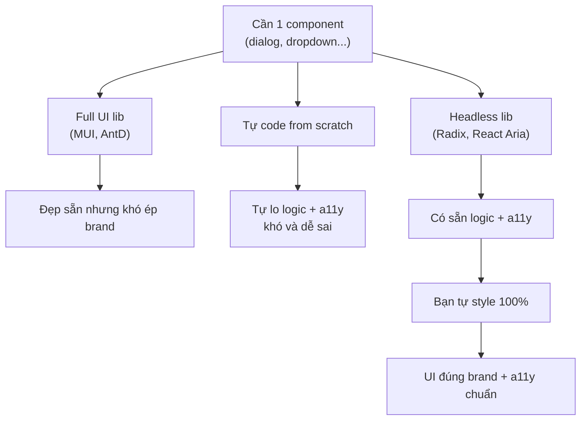
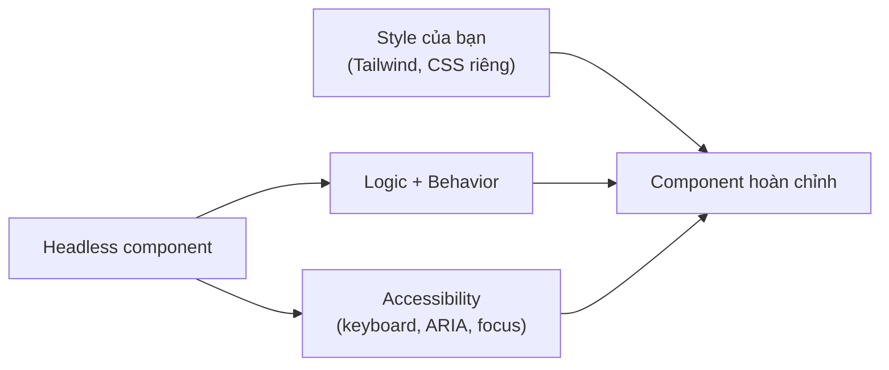

# Headless Component Libraries

**Headless library** (thư viện chỉ lo phần logic và khả năng truy cập, không kèm sẵn giao diện) cung cấp hành vi cho các thành phần như dropdown, dialog, tab... nhưng để bạn tự quyết định cách hiển thị. Khác với thư viện thành phần thông thường vốn áp sẵn kiểu dáng, headless cho bạn toàn quyền tự định kiểu (ví dụ bằng Tailwind) mà vẫn đảm bảo phần khó như **accessibility** (khả năng truy cập cho người khuyết tật) và xử lý bàn phím. Bài này giới thiệu các thư viện headless phổ biến như Radix UI, React Aria.

---

:::note[Ghi nhớ nhanh]

- ⭐ **Headless = logic + behavior + accessibility nhưng KHÔNG có style sẵn** — bạn tự tô 100% theo brand, giải bài toán "full UI lib đẹp sẵn nhưng khó ép theo design riêng".
- ⭐ **Radix UI phổ biến nhất (#1)** — chuẩn WAI-ARIA, compound component API, là nền của `shadcn/ui`.
- **React Aria (Adobe)** — accessibility mạnh nhất, hỗ trợ i18n/RTL, hợp app cần a11y nghiêm túc (gov, banking, healthcare).
- **Ark UI** chạy đa framework (React/Vue/Solid, dựa trên XState); **Headless UI** (của team Tailwind) ít component hơn và đang giảm.
- **Chọn headless khi cần brand riêng / design system riêng**; KHÔNG cần khi prototype nhanh hoặc cần component phong phú đặc biệt (DataGrid → MUI X tốt hơn).

:::

---

## Mục lục

- [Vì sao có headless UI?](#vì-sao-có-headless-ui)
- [Headless là gì?](#headless-là-gì)
- [Radix UI](#radix-ui)
- [React Aria](#react-aria)
- [Ark UI](#ark-ui)
- [Headless UI](#headless-ui)
- [Khi nào chọn headless?](#khi-nào-chọn-headless)
- [Câu hỏi phỏng vấn](#câu-hỏi-phỏng-vấn)

---

## Vì sao có headless UI?

**Vấn đề:** Thư viện component "full UI" (Material UI, Ant Design...) đẹp sẵn nhưng **khó ép theo design system riêng**. Muốn đổi look thì phải ghi đè style chồng chéo, vật lộn với specificity, và vẫn dính dáng dấp giao diện của thư viện.

```jsx
// MUI: ghi đè style vất vả, vẫn lộ "chất" Material
<Button
  sx={{
    backgroundColor: "#000 !important",
    borderRadius: 0,
    boxShadow: "none",
    "&:hover": { backgroundColor: "#333 !important" },
    // ...vẫn còn ripple, padding, font của MUI
  }}
>
  Save
</Button>
```

Còn tự code from scratch thì lại phải tự lo **logic phức tạp + accessibility** (keyboard nav, ARIA, focus trap) — phần khó và dễ sai nhất.

**Giải pháp:** **Headless UI** (Radix, Headless UI, React Aria, TanStack Table) cung cấp **logic + accessibility + tương tác bàn phím** nhưng **không áp style** → bạn tự tô 100% theo design. Tách hẳn logic khỏi giao diện.

```jsx
// Radix: lo logic + a11y, bạn tự style 100%
import * as Dialog from "@radix-ui/react-dialog";

<Dialog.Root>
  <Dialog.Trigger className="btn-cua-toi">Save</Dialog.Trigger>
  <Dialog.Portal>
    {/* class do bạn tự đặt — không dính style thư viện */}
    <Dialog.Content className="theme-rieng-cua-team">...</Dialog.Content>
  </Dialog.Portal>
</Dialog.Root>
```

Có thể hình dung ba hướng giải quyết khi cần một component như sau:



:::tip[Dùng thực tế]

- **Design system riêng** cho công ty: cần UI nhất quán theo brand, không muốn dính look của Material/AntD.
- **Dropdown/combobox/dialog** cần a11y chuẩn (keyboard, ARIA) nhưng style hoàn toàn tuỳ ý.
- **Table phức tạp** (sort, filter, pagination, virtual) dùng TanStack Table — logic mạnh, render tuỳ bạn.
- **Thương hiệu cần UI độc nhất** (landing, sản phẩm flagship) — không thể trông "giống mọi app khác".

:::

---

## Headless là gì?

**Headless component** = thư viện cung cấp **logic + behavior + accessibility**
nhưng **không có style sẵn**. Bạn tự style theo design.

Lý do dùng:

- **Brand identity** — không bị khoá vào look của Material/AntD.
- **Accessibility miễn phí** — keyboard nav, ARIA, focus trap đã làm sẵn.
- **Composition tốt** — flexible hơn opinionated lib.

Ví dụ: dropdown với keyboard navigation (↑↓ chọn, Enter confirm, Esc close,
ARIA labels) **là phần khó nhất** — headless lib làm hộ.

Sơ đồ dưới đây cho thấy headless tách phần logic + a11y ra khỏi phần style do bạn tự lo:



---

## Radix UI

[Radix UI](https://www.radix-ui.com) — phổ biến nhất, base của shadcn/ui.

```bash
npm install @radix-ui/react-dialog
```

```jsx
import * as Dialog from "@radix-ui/react-dialog";

<Dialog.Root>
  <Dialog.Trigger>Open</Dialog.Trigger>
  <Dialog.Portal>
    <Dialog.Overlay className="fixed inset-0 bg-black/50" />
    <Dialog.Content className="fixed top-1/2 left-1/2 -translate-x-1/2 -translate-y-1/2 bg-white p-6 rounded">
      <Dialog.Title>Title</Dialog.Title>
      <Dialog.Description>Description</Dialog.Description>
      <Dialog.Close>×</Dialog.Close>
    </Dialog.Content>
  </Dialog.Portal>
</Dialog.Root>
```

Component phong phú:

- Dialog, AlertDialog
- DropdownMenu, ContextMenu
- Tooltip, HoverCard
- Tabs, Accordion
- Select, Combobox
- Toggle, Switch, Checkbox, Radio
- Slider, Progress
- Toast

:::info[Phân tích]

**Tại sao Radix dominate?**

1. **Accessibility chuẩn WAI-ARIA** — keyboard, focus, screen reader.
2. **Composable API** — compound component pattern.
3. **Portal/Popper logic** chuẩn — không bị "ẩn sau modal" hay scroll lag.
4. **TypeScript first**.
5. **Maintained tích cực** — backed by Vercel/WorkOS.

shadcn/ui = Radix UI + Tailwind preset → đó là lý do shadcn boom 2024+.

:::

---

## React Aria

[React Aria](https://react-spectrum.adobe.com/react-aria) — của Adobe,
**accessibility hardcore nhất**.

```bash
npm install react-aria-components
```

```jsx
import { Button } from "react-aria-components";

<Button onPress={save}>Save</Button>
```

Đặc điểm:

- **Pointer Event** unified (mouse, touch, pen).
- **Internationalization** — RTL, locale-aware.
- **Cao cấp** — Date Picker, ComboBox, Tree, Table với keyboard nav.
- Dùng bởi Adobe Spectrum, Adobe Creative Cloud.

Phù hợp app cần a11y nghiêm túc (gov, healthcare, education).

---

## Ark UI

[Ark UI](https://ark-ui.com) — multi-framework (React, Vue, Solid),
state machine-based.

```jsx
import { Dialog } from "@ark-ui/react";

<Dialog.Root>
  <Dialog.Trigger>Open</Dialog.Trigger>
  <Dialog.Content>...</Dialog.Content>
</Dialog.Root>
```

Đặc điểm:

- Dùng **XState** dưới hood — state machine, robust.
- API tương tự Radix.
- Chạy được trên React, Vue, Solid → team share code dễ.

---

## Headless UI

[Headless UI](https://headlessui.com) — của team Tailwind CSS.

```bash
npm install @headlessui/react
```

```jsx
import { Menu } from "@headlessui/react";

<Menu>
  <Menu.Button>Options</Menu.Button>
  <Menu.Items>
    <Menu.Item>{({ active }) => <a>Profile</a>}</Menu.Item>
    <Menu.Item>{({ active }) => <a>Logout</a>}</Menu.Item>
  </Menu.Items>
</Menu>
```

Đặc điểm:

- Ít component hơn Radix (~10).
- Tích hợp tốt với Tailwind.
- API render prop (cũ hơn Radix).

→ Radix UI thường được chọn hơn cho project mới, Headless UI cho project
đã quen Tailwind ecosystem.

---

## Khi nào chọn headless?

**Chọn headless khi:**

- Cần **brand custom hoàn toàn** (logo, color, font đặc thù).
- Build **design system riêng** cho team/công ty.
- Cần **accessibility chuẩn** nhưng không muốn UI library bloated.
- Project có designer riêng — không dùng preset.

**KHÔNG cần headless khi:**

- Prototype nhanh, chấp nhận Material/AntD look.
- Team không có designer.
- Cần component phong phú đặc biệt (DataGrid, Pivot Table) → MUI X tốt hơn.

:::tip[Mẹo]

**Workflow chuẩn 2026 cho project mới:**

1. **Vite + React + TypeScript**.
2. **Tailwind CSS** cho styling.
3. **shadcn/ui** init — copy Radix + Tailwind components.
4. **Lucide React** cho icon.
5. **clsx + tailwind-merge** cho conditional class.
6. **TanStack Query** cho server state.
7. **TanStack Router** hoặc **React Router** cho routing.
8. **react-hook-form + Zod** cho form.

Stack này = "default 2026" — phần lớn project SaaS, dashboard, internal
tool đều dùng. shadcn/ui làm việc heavy lifting (component lib +
accessibility + composition).

:::

:::info[Phân tích]

**Headless lib so sánh nhanh:**

| | Radix | React Aria | Ark UI | Headless UI |
|--|-------|-----------|--------|-------------|
| Component count | ~30 | ~25 | ~25 | ~10 |
| A11y rating | Tốt | **Xuất sắc** | Tốt | Tốt |
| TypeScript | ✓ | ✓ | ✓ | ✓ |
| Multi-framework | React only | React only | **React + Vue + Solid** | React + Vue |
| Bundle | Trung bình | Lớn | Trung bình | Nhỏ |
| Popular 2026 | **#1** | Tăng | Mới | Giảm |

**Quy tắc**:

- React-only project, đã hoặc sẽ dùng shadcn → **Radix**.
- A11y compliance nghiêm túc (gov, banking) → **React Aria**.
- Multi-framework team → **Ark UI**.

:::

---

## Câu hỏi phỏng vấn

Những câu thường gặp về chủ đề này. Tự trả lời trước, rồi đối chiếu lại với nội dung phía trên.

1. `Headless component` nghĩa là gì? Thư viện cung cấp phần nào và bạn phải tự lo phần nào?
2. Vì sao phần khó nhất của một dropdown không phải là style mà là keyboard navigation, focus management và ARIA? Kể các hành vi bắt buộc.
3. `focus trap` là gì và vì sao dialog bắt buộc phải có? Nếu tự viết thì các ca biên nào dễ làm sai?
4. So sánh headless library với component library có sẵn style: mỗi bên phù hợp với loại dự án nào?
5. Radix UI dùng pattern `asChild`. Nó hoạt động ra sao và giải quyết vấn đề gì so với việc bọc thêm một thẻ DOM?
6. Phân biệt component `controlled` và `uncontrolled` trong các thư viện headless. Khi nào bạn cần chuyển sang controlled?
7. React Aria theo hướng hook, Radix theo hướng component. So sánh hai cách tiếp cận về tính linh hoạt và độ khó sử dụng.
8. Vì sao React Aria được đánh giá là chuẩn accessibility cao nhất? Nó xử lý thêm những gì mà thư viện khác bỏ qua (i18n, RTL, khác biệt nền tảng)?
9. Ark UI hỗ trợ nhiều framework nhờ `state machine`. Kiến trúc đó đem lại lợi ích và chi phí gì?
10. Vì sao Headless UI của Tailwind Labs đang giảm phổ biến so với Radix? So sánh phạm vi component của hai thư viện.
11. Headless library đảm bảo ARIA đúng, nhưng vẫn có thể làm hỏng accessibility bằng cách style sai. Kể vài lỗi phổ biến (contrast, focus ring, kích thước vùng chạm).
12. TanStack Table cũng là headless nhưng cho dữ liệu chứ không phải UI. Điểm chung về triết lý với Radix là gì?
13. Bạn đánh giá và chọn giữa Radix, React Aria và Ark UI cho một dự án cụ thể theo tiêu chí nào?
14. Team muốn tự viết dropdown thay vì dùng headless library để giảm dependency. Bạn phản biện thế nào bằng chi phí thực tế của việc tự làm a11y?
