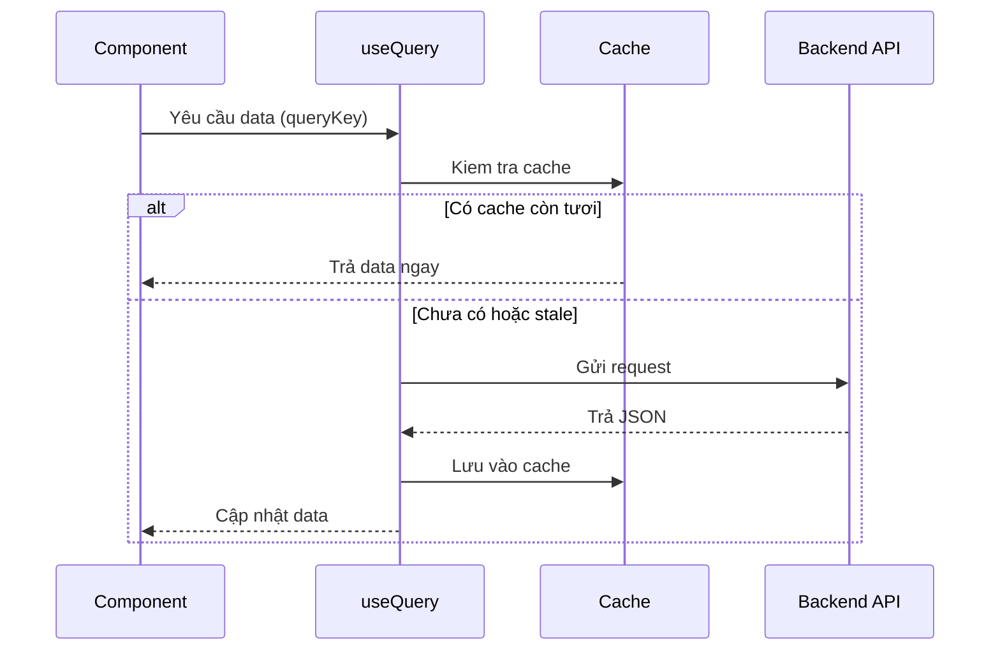
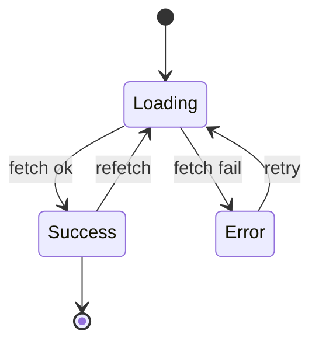

# API Calls trong React

**API call** (lời gọi tới máy chủ để lấy hoặc gửi dữ liệu) là cách ứng dụng React giao tiếp với backend, ví dụ tải danh sách sản phẩm hay gửi form đăng ký. Bạn có thể gọi thủ công bằng `fetch`/Axios, hoặc dùng các thư viện quản lý dữ liệu như **TanStack Query** (tự lo việc tải, lưu đệm và làm mới dữ liệu giúp bạn). Bài này giúp người mới hiểu các lựa chọn từ đơn giản đến mạnh mẽ.

---

:::note[Ghi nhớ nhanh]

- ⭐ **`useEffect` + `fetch` thủ công OK cho project nhỏ nhưng đuối khi scale** — phải tự lo cache, retry, refetch, race condition ở từng component.
- ⭐ **`TanStack Query` là default cho fetch data** — tự cache/dedupe, refetch khi focus/reconnect, retry, `useMutation` + `invalidateQueries`, optimistic update, infinite scroll.
- **Axios** chỉ giải vấn đề nhỏ (interceptor, tự parse JSON, tự throw khi HTTP ≥ 400) — thay `fetch` nhưng KHÔNG lo cache/refetch.
- **SWR (Vercel)** nhẹ hơn, API đơn giản, hợp project nhỏ-trung; **RTK Query** khi đã dùng Redux; **tRPC** cho full-stack TypeScript type-safe end-to-end.
- **Server state ≠ client state** — đừng nhét data API vào Redux/Zustand; dùng thư viện server-state chuyên trị vì data có thể stale, async, shared, cần caching policy.

:::

---

## Mục lục

- [Vì sao cần thư viện data fetching?](#vì-sao-cần-thư-viện-data-fetching)
- [Fetch thủ công (đơn giản)](#fetch-thủ-công-đơn-giản)
- [Axios](#axios)
- [TanStack Query (khuyến nghị)](#tanstack-query-khuyến-nghị)
- [SWR (Vercel)](#swr-vercel)
- [RTK Query](#rtk-query)
- [tRPC](#trpc)
- [Câu hỏi phỏng vấn](#câu-hỏi-phỏng-vấn)

---

## Vì sao cần thư viện data fetching?

**Vấn đề:** Tự gọi API bằng `useEffect` + `fetch` buộc bạn tự xử lý mọi thứ — và lặp lại ở từng component:

```jsx
function ProductList() {
  const [products, setProducts] = useState([]);
  const [loading, setLoading] = useState(true);
  const [error, setError] = useState(null);

  useEffect(() => {
    const ctrl = new AbortController();
    setLoading(true);

    fetch("/api/products", { signal: ctrl.signal })
      .then(r => {
        if (!r.ok) throw new Error(`HTTP ${r.status}`);
        return r.json();
      })
      .then(setProducts)
      .catch(err => {
        if (err.name !== "AbortError") setError(err); // tự xử lý error
      })
      .finally(() => setLoading(false));        // tự xử lý loading

    return () => ctrl.abort();                   // tự chống race condition
  }, []);

  // Không cache → component khác fetch lại từ đầu.
  // Không refetch khi focus/reconnect. Không retry. Không dedupe.
  // Dữ liệu cũ (stale) không tự làm mới. Phân trang phải tự code.
}
```

**Giải pháp:** Thư viện **server-state** (TanStack Query / SWR) lo hết phần lặp đi lặp lại đó — bạn chỉ khai báo "lấy data nào", còn lại tự động:

```jsx
import { useQuery } from "@tanstack/react-query";

function ProductList() {
  const { data: products, isLoading, error } = useQuery({
    queryKey: ["products"],
    queryFn: () => fetch("/api/products").then(r => r.json()),
  });
  // Tự cache + dedupe, tự loading/error, tự refetch khi focus,
  // tự retry, invalidation, optimistic update → code gọn, data luôn tươi.

  if (isLoading) return <Spinner />;
  if (error) return <Error error={error} />;
  return <ul>{products.map(p => <li key={p.id}>{p.name}</li>)}</ul>;
}
```

Luồng lấy data qua một server-state library (như TanStack Query) diễn ra như sau:



> Lưu ý: **Axios** giải quyết vấn đề nhỏ hơn — interceptor, tự parse JSON, tự throw khi HTTP error (xem mục [Axios](#axios)). Nó thay `fetch`, nhưng **không** lo cache/refetch/retry như server-state library.

:::tip[Dùng thực tế]

Khi nào lợi ích thấy rõ ngay:

- **Cache danh sách** — list sản phẩm fetch một lần, mọi component dùng chung, không gọi trùng.
- **Refetch sau mutation** — tạo/sửa/xóa xong, `invalidateQueries` tự làm mới danh sách liên quan.
- **Optimistic update** — bấm "Like" là UI đổi ngay, lỗi thì tự rollback, không chờ server.
- **Phân trang / infinite scroll** — `useInfiniteQuery` lo trang kế, gộp data và cache từng trang.

:::

---

## Fetch thủ công (đơn giản)

```jsx
function UserProfile({ id }) {
  const [user, setUser] = useState(null);
  const [loading, setLoading] = useState(true);
  const [error, setError] = useState(null);

  useEffect(() => {
    const ctrl = new AbortController();
    setLoading(true);

    fetch(`/api/users/${id}`, { signal: ctrl.signal })
      .then(r => {
        if (!r.ok) throw new Error(`HTTP ${r.status}`);
        return r.json();
      })
      .then(setUser)
      .catch(err => {
        if (err.name !== "AbortError") setError(err);
      })
      .finally(() => setLoading(false));

    return () => ctrl.abort();
  }, [id]);

  if (loading) return <Spinner />;
  if (error) return <Error error={error} />;
  return <div>{user.name}</div>;
}
```

Dù tự fetch hay dùng thư viện, một request luôn đi qua các trạng thái sau:



:::warning[Cần lưu ý]

Pattern này **OK cho project nhỏ** nhưng tốn công khi scale:

- Không cache → mỗi component fetch riêng.
- Không retry tự động.
- Không refetch khi window focus/reconnect.
- Khó share state giữa nhiều component.
- Race condition khi user thao tác nhanh.

→ Production app **luôn** dùng **TanStack Query** hoặc **SWR**.

:::

---

## Axios

```bash
npm install axios
```

```jsx
import axios from "axios";

const api = axios.create({
  baseURL: "/api",
  headers: { "Content-Type": "application/json" },
});

// Interceptor — add auth, log, transform
api.interceptors.request.use(config => {
  config.headers.Authorization = `Bearer ${getToken()}`;
  return config;
});

// Dùng
const res = await api.get("/users");
const user = res.data;
```

Axios tự throw cho HTTP error (status ≥ 400) — không như Fetch:

```js
try {
  const res = await api.get("/users/999");
} catch (err) {
  if (err.response) {
    console.log(err.response.status); // 404
    console.log(err.response.data);
  }
}
```

---

## TanStack Query (khuyến nghị)

[TanStack Query](https://tanstack.com/query) (trước là React Query) —
**server state** library. Cache, retry, refetch tự động.

```bash
npm install @tanstack/react-query
```

Setup:

```jsx
import { QueryClient, QueryClientProvider } from "@tanstack/react-query";

const queryClient = new QueryClient();

function App() {
  return (
    <QueryClientProvider client={queryClient}>
      <YourApp />
    </QueryClientProvider>
  );
}
```

Dùng:

```jsx
import { useQuery } from "@tanstack/react-query";

function UserProfile({ id }) {
  const { data: user, isLoading, error } = useQuery({
    queryKey: ["user", id],
    queryFn: () => fetch(`/api/users/${id}`).then(r => r.json()),
  });

  if (isLoading) return <Spinner />;
  if (error) return <Error error={error} />;
  return <div>{user.name}</div>;
}
```

Mutation — POST/PUT/DELETE:

```jsx
import { useMutation, useQueryClient } from "@tanstack/react-query";

function CreateUser() {
  const queryClient = useQueryClient();

  const { mutate, isPending } = useMutation({
    mutationFn: (data) => fetch("/api/users", {
      method: "POST",
      body: JSON.stringify(data),
    }),
    onSuccess: () => {
      queryClient.invalidateQueries({ queryKey: ["users"] });
    },
  });

  return (
    <button onClick={() => mutate({ name: "An" })} disabled={isPending}>
      Create
    </button>
  );
}
```

:::info[Phân tích]

**TanStack Query giải quyết:**

- **Caching** — query cùng key share data, không fetch duplicate.
- **Stale-while-revalidate** — hiển thị data cũ, refetch background.
- **Refetch on**: window focus, reconnect, mount.
- **Retry** với exponential backoff.
- **Pagination, infinite scroll** — `useInfiniteQuery`.
- **Optimistic update** — UI update ngay, rollback nếu fail.
- **Devtools** — inspect query state real-time.

Cốt lõi: tách **server state** (data từ API) khỏi **client state** (UI state).
Hai loại có pattern khác nhau — server state cần cache + sync, client state
chỉ cần store thường.

Năm 2026, **TanStack Query là default** cho mọi React app cần fetch data.
Không có lý do để fetch thủ công trong production.

:::

---

## SWR (Vercel)

[SWR](https://swr.vercel.app) — alternative gọn hơn TanStack Query, từ Vercel.

```bash
npm install swr
```

```jsx
import useSWR from "swr";

const fetcher = url => fetch(url).then(r => r.json());

function UserProfile({ id }) {
  const { data, error, isLoading } = useSWR(`/api/users/${id}`, fetcher);

  if (isLoading) return <Spinner />;
  if (error) return <Error error={error} />;
  return <div>{data.name}</div>;
}
```

So với TanStack Query:

- **Nhẹ hơn** (~5KB vs ~12KB).
- **API đơn giản hơn**.
- Ít feature hơn — không có `useMutation`, infinite query API đơn giản hơn.
- Tích hợp tốt với Next.js (cùng Vercel).

→ Project nhỏ-trung, **prefer SWR**. Project lớn, **TanStack Query** mạnh hơn.

---

## RTK Query

Built-in trong Redux Toolkit. Phù hợp khi đã dùng Redux.

```jsx
import { createApi, fetchBaseQuery } from "@reduxjs/toolkit/query/react";

export const userApi = createApi({
  reducerPath: "userApi",
  baseQuery: fetchBaseQuery({ baseUrl: "/api" }),
  endpoints: (builder) => ({
    getUser: builder.query({
      query: (id) => `/users/${id}`,
    }),
    createUser: builder.mutation({
      query: (data) => ({
        url: "/users",
        method: "POST",
        body: data,
      }),
    }),
  }),
});

// Dùng
function Component({ id }) {
  const { data, isLoading } = userApi.useGetUserQuery(id);
}
```

Phù hợp:

- App đã dùng Redux.
- Cần state management + data fetching trong cùng store.
- Cần generated hook type-safe.

---

## tRPC

[tRPC](https://trpc.io) — **end-to-end type-safe API**, không cần code gen
hay schema riêng.

```ts
// server
import { initTRPC } from "@trpc/server";

const t = initTRPC.create();

export const router = t.router({
  getUser: t.procedure
    .input(z.object({ id: z.number() }))
    .query(({ input }) => db.user.findUnique({ where: { id: input.id } })),

  createUser: t.procedure
    .input(z.object({ name: z.string() }))
    .mutation(({ input }) => db.user.create({ data: input })),
});

export type AppRouter = typeof router;
```

```tsx
// client
import { trpc } from "./utils/trpc";

function UserProfile({ id }) {
  const { data: user, isLoading } = trpc.getUser.useQuery({ id });
  return <div>{user?.name}</div>;
}
```

**Type-safe end-to-end**: backend đổi schema → client TS báo lỗi compile-time.

Phù hợp:

- Full-stack TypeScript (Next.js + TypeScript backend).
- Monorepo có share type.
- Internal API, không expose ra ngoài.

:::tip[Mẹo]

**Quy tắc chọn:**

```
Project type?

├─ SPA + REST API ngoài → TanStack Query / SWR
├─ Next.js + đã dùng Redux → RTK Query
├─ Full-stack TS, control cả 2 đầu → tRPC + TanStack Query
├─ GraphQL backend → Apollo Client / urql
└─ Server Components (RSC) → fetch trực tiếp trong RSC + revalidate
```

Đa số dự án mới: **TanStack Query** + **Axios/Fetch** đủ. Add tRPC khi
team control cả backend + frontend.

:::

:::warning[Cần lưu ý]

**Server state ≠ Redux/Zustand:**

```jsx
// Tệ — lưu data API vào Redux
const dispatch = useDispatch();
useEffect(() => {
  fetch("/api/users").then(r => r.json()).then(data => {
    dispatch(setUsers(data));
  });
}, []);

// Tốt — TanStack Query xử lý server state riêng
const { data } = useQuery({ queryKey: ["users"], queryFn: fetchUsers });
```

Server state có đặc điểm khác client state:

- Có thể **stale** — cần refetch định kỳ.
- **Async** — loading, error states.
- **Shared** giữa nhiều component.
- **Caching policy** — TTL, invalidation.

→ Dùng tool chuyên trị. Đừng dùng Redux/Zustand cho server state.

:::

---

## Câu hỏi phỏng vấn

Những câu thường gặp về chủ đề này. Tự trả lời trước, rồi đối chiếu lại với nội dung phía trên.

1. Vì sao gọi API bằng `useEffect` + `fetch` thủ công lại nhanh chóng đuối khi ứng dụng lớn dần?
2. Phân biệt **server state** và **client state**. Vì sao không nên nhét dữ liệu API vào `Redux`/`Zustand`?
3. `AbortController` giải quyết vấn đề gì trong `useEffect`? Race condition xảy ra như thế nào nếu thiếu nó?
4. Khác nhau giữa `fetch` và `axios` khi server trả về mã lỗi HTTP ≥ 400? Vì sao điều này hay gây bug?
5. `interceptor` của Axios thường dùng để làm gì? Mô tả luồng tự động refresh token bằng interceptor.
6. Trong `TanStack Query`, `queryKey` đóng vai trò gì? Điều gì xảy ra khi một phần tử trong `queryKey` thay đổi?
7. Phân biệt `staleTime` và `gcTime` (trước đây là `cacheTime`). Đặt sai hai giá trị này gây hậu quả gì?
8. Giải thích cơ chế **stale-while-revalidate**: người dùng nhìn thấy gì trong lúc dữ liệu đang được làm mới nền?
9. **Request deduplication** hoạt động ra sao khi ba component cùng gọi một `queryKey` trong cùng một lần render?
10. Mô tả luồng ghi dữ liệu với `useMutation` + `invalidateQueries`. Vì sao cần `invalidate` thay vì tự `setState`?
11. **Optimistic update** là gì? Trình bày các bước `onMutate` → `onError` (rollback) → `onSettled`.
12. `refetchOnWindowFocus` và `refetchOnReconnect` mang lại lợi ích gì, và khi nào bạn nên tắt chúng?
13. Cơ chế retry với **exponential backoff** hoạt động thế nào? Với loại lỗi nào thì KHÔNG nên retry?
14. `useInfiniteQuery` khác `useQuery` ở điểm nào khi làm infinite scroll hoặc phân trang?
15. So sánh `SWR` và `TanStack Query`: khác biệt về tính năng mutation, retry, devtools. Khi nào chọn `SWR`?
16. Khi nào `RTK Query` là lựa chọn hợp lý hơn `TanStack Query`?
17. `tRPC` đạt được type-safety end-to-end bằng cách nào? Hạn chế của nó là gì?
18. Với React 19 / Next.js Server Components, việc fetch dữ liệu ở server có làm thư viện client-side data fetching trở nên thừa không? Giải thích.
