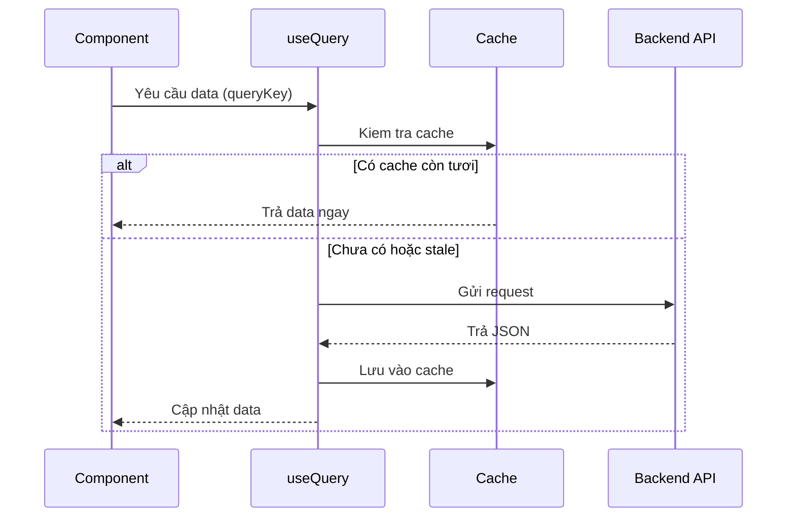
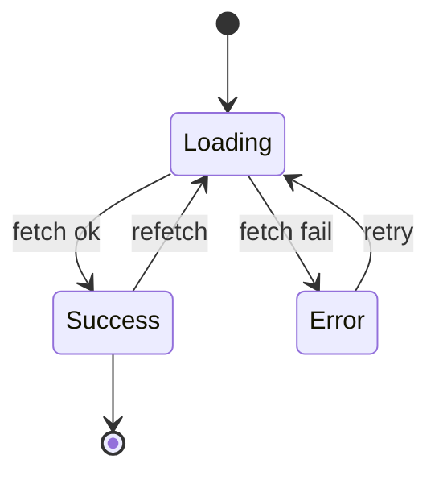

# API Calls trong React

**API call** (lời gọi tới máy chủ để lấy hoặc gửi dữ liệu) là cách ứng dụng React giao tiếp với backend, ví dụ tải danh sách sản phẩm hay gửi form đăng ký. Bạn có thể gọi thủ công bằng `fetch`/Axios, hoặc dùng các thư viện quản lý dữ liệu như **TanStack Query** (tự lo việc tải, lưu đệm và làm mới dữ liệu giúp bạn). Bài này giúp người mới hiểu các lựa chọn từ đơn giản đến mạnh mẽ.

[](pathname:///img/react/api-calls.webp)

---

:::note[Ghi nhớ nhanh]

- ⭐ **`useEffect` + `fetch` thủ công OK cho project nhỏ nhưng đuối khi scale** — phải tự lo cache, retry, refetch, race condition ở từng component.
- ⭐ **`TanStack Query` là default cho fetch data** — tự cache/dedupe, refetch khi focus/reconnect, retry, `useMutation` + `invalidateQueries`, optimistic update, infinite scroll.
- **Axios** chỉ giải vấn đề nhỏ (interceptor, tự parse JSON, tự throw khi HTTP ≥ 400) — thay `fetch` nhưng KHÔNG lo cache/refetch.
- **SWR (Vercel)** nhẹ hơn, API đơn giản, hợp project nhỏ-trung; **RTK Query** khi đã dùng Redux; **tRPC** cho full-stack TypeScript type-safe end-to-end.
- **Server state ≠ client state** — đừng nhét data API vào Redux/Zustand; dùng thư viện server-state chuyên trị vì data có thể stale, async, shared, cần caching policy.

:::

---

## Mục lục

- [Vì sao cần thư viện data fetching?](#vì-sao-cần-thư-viện-data-fetching)
- [Fetch thủ công (đơn giản)](#fetch-thủ-công-đơn-giản)
- [Axios](#axios)
- [TanStack Query (khuyến nghị)](#tanstack-query-khuyến-nghị)
- [SWR (Vercel)](#swr-vercel)
- [RTK Query](#rtk-query)
- [tRPC](#trpc)
- [Câu hỏi phỏng vấn](#câu-hỏi-phỏng-vấn)

---

## Vì sao cần thư viện data fetching?

**Vấn đề:** Tự gọi API bằng `useEffect` + `fetch` buộc bạn tự xử lý mọi thứ — và lặp lại ở từng component:

```jsx
function ProductList() {
  const [products, setProducts] = useState([]);
  const [loading, setLoading] = useState(true);
  const [error, setError] = useState(null);

  useEffect(() => {
    const ctrl = new AbortController();
    setLoading(true);

    fetch("/api/products", { signal: ctrl.signal })
      .then(r => {
        if (!r.ok) throw new Error(`HTTP ${r.status}`);
        return r.json();
      })
      .then(setProducts)
      .catch(err => {
        if (err.name !== "AbortError") setError(err); // tự xử lý error
      })
      .finally(() => setLoading(false));        // tự xử lý loading

    return () => ctrl.abort();                   // tự chống race condition
  }, []);

  // Không cache → component khác fetch lại từ đầu.
  // Không refetch khi focus/reconnect. Không retry. Không dedupe.
  // Dữ liệu cũ (stale) không tự làm mới. Phân trang phải tự code.
}
```

**Giải pháp:** Thư viện **server-state** (TanStack Query / SWR) lo hết phần lặp đi lặp lại đó — bạn chỉ khai báo "lấy data nào", còn lại tự động:

```jsx
import { useQuery } from "@tanstack/react-query";

function ProductList() {
  const { data: products, isLoading, error } = useQuery({
    queryKey: ["products"],
    queryFn: () => fetch("/api/products").then(r => r.json()),
  });
  // Tự cache + dedupe, tự loading/error, tự refetch khi focus,
  // tự retry, invalidation, optimistic update → code gọn, data luôn tươi.

  if (isLoading) return <Spinner />;
  if (error) return <Error error={error} />;
  return <ul>{products.map(p => <li key={p.id}>{p.name}</li>)}</ul>;
}
```

Luồng lấy data qua một server-state library (như TanStack Query) diễn ra như sau:



> Lưu ý: **Axios** giải quyết vấn đề nhỏ hơn — interceptor, tự parse JSON, tự throw khi HTTP error (xem mục [Axios](#axios)). Nó thay `fetch`, nhưng **không** lo cache/refetch/retry như server-state library.

:::tip[Dùng thực tế]

Khi nào lợi ích thấy rõ ngay:

- **Cache danh sách** — list sản phẩm fetch một lần, mọi component dùng chung, không gọi trùng.
- **Refetch sau mutation** — tạo/sửa/xóa xong, `invalidateQueries` tự làm mới danh sách liên quan.
- **Optimistic update** — bấm "Like" là UI đổi ngay, lỗi thì tự rollback, không chờ server.
- **Phân trang / infinite scroll** — `useInfiniteQuery` lo trang kế, gộp data và cache từng trang.

:::

---

## Fetch thủ công (đơn giản)

```jsx
function UserProfile({ id }) {
  const [user, setUser] = useState(null);
  const [loading, setLoading] = useState(true);
  const [error, setError] = useState(null);

  useEffect(() => {
    const ctrl = new AbortController();
    setLoading(true);

    fetch(`/api/users/${id}`, { signal: ctrl.signal })
      .then(r => {
        if (!r.ok) throw new Error(`HTTP ${r.status}`);
        return r.json();
      })
      .then(setUser)
      .catch(err => {
        if (err.name !== "AbortError") setError(err);
      })
      .finally(() => setLoading(false));

    return () => ctrl.abort();
  }, [id]);

  if (loading) return <Spinner />;
  if (error) return <Error error={error} />;
  return <div>{user.name}</div>;
}
```

Dù tự fetch hay dùng thư viện, một request luôn đi qua các trạng thái sau:



:::warning[Cần lưu ý]

Pattern này **OK cho project nhỏ** nhưng tốn công khi scale:

- Không cache → mỗi component fetch riêng.
- Không retry tự động.
- Không refetch khi window focus/reconnect.
- Khó share state giữa nhiều component.
- Race condition khi user thao tác nhanh.

→ Production app **luôn** dùng **TanStack Query** hoặc **SWR**.

:::

---

## Axios

```bash
npm install axios
```

```jsx
import axios from "axios";

const api = axios.create({
  baseURL: "/api",
  headers: { "Content-Type": "application/json" },
});

// Interceptor — add auth, log, transform
api.interceptors.request.use(config => {
  config.headers.Authorization = `Bearer ${getToken()}`;
  return config;
});

// Dùng
const res = await api.get("/users");
const user = res.data;
```

Axios tự throw cho HTTP error (status ≥ 400) — không như Fetch:

```js
try {
  const res = await api.get("/users/999");
} catch (err) {
  if (err.response) {
    console.log(err.response.status); // 404
    console.log(err.response.data);
  }
}
```

---

## TanStack Query (khuyến nghị)

[TanStack Query](https://tanstack.com/query) (trước là React Query) —
**server state** library. Cache, retry, refetch tự động.

```bash
npm install @tanstack/react-query
```

Setup:

```jsx
import { QueryClient, QueryClientProvider } from "@tanstack/react-query";

const queryClient = new QueryClient();

function App() {
  return (
    <QueryClientProvider client={queryClient}>
      <YourApp />
    </QueryClientProvider>
  );
}
```

Dùng:

```jsx
import { useQuery } from "@tanstack/react-query";

function UserProfile({ id }) {
  const { data: user, isLoading, error } = useQuery({
    queryKey: ["user", id],
    queryFn: () => fetch(`/api/users/${id}`).then(r => r.json()),
  });

  if (isLoading) return <Spinner />;
  if (error) return <Error error={error} />;
  return <div>{user.name}</div>;
}
```

Mutation — POST/PUT/DELETE:

```jsx
import { useMutation, useQueryClient } from "@tanstack/react-query";

function CreateUser() {
  const queryClient = useQueryClient();

  const { mutate, isPending } = useMutation({
    mutationFn: (data) => fetch("/api/users", {
      method: "POST",
      body: JSON.stringify(data),
    }),
    onSuccess: () => {
      queryClient.invalidateQueries({ queryKey: ["users"] });
    },
  });

  return (
    <button onClick={() => mutate({ name: "An" })} disabled={isPending}>
      Create
    </button>
  );
}
```

:::info[Phân tích]

**TanStack Query giải quyết:**

- **Caching** — query cùng key share data, không fetch duplicate.
- **Stale-while-revalidate** — hiển thị data cũ, refetch background.
- **Refetch on**: window focus, reconnect, mount.
- **Retry** với exponential backoff.
- **Pagination, infinite scroll** — `useInfiniteQuery`.
- **Optimistic update** — UI update ngay, rollback nếu fail.
- **Devtools** — inspect query state real-time.

Cốt lõi: tách **server state** (data từ API) khỏi **client state** (UI state).
Hai loại có pattern khác nhau — server state cần cache + sync, client state
chỉ cần store thường.

Năm 2026, **TanStack Query là default** cho mọi React app cần fetch data.
Không có lý do để fetch thủ công trong production.

:::

---

## SWR (Vercel)

[SWR](https://swr.vercel.app) — alternative gọn hơn TanStack Query, từ Vercel.

```bash
npm install swr
```

```jsx
import useSWR from "swr";

const fetcher = url => fetch(url).then(r => r.json());

function UserProfile({ id }) {
  const { data, error, isLoading } = useSWR(`/api/users/${id}`, fetcher);

  if (isLoading) return <Spinner />;
  if (error) return <Error error={error} />;
  return <div>{data.name}</div>;
}
```

So với TanStack Query:

- **Nhẹ hơn** (~5KB vs ~12KB).
- **API đơn giản hơn**.
- Ít feature hơn — không có `useMutation`, infinite query API đơn giản hơn.
- Tích hợp tốt với Next.js (cùng Vercel).

→ Project nhỏ-trung, **prefer SWR**. Project lớn, **TanStack Query** mạnh hơn.

---

## RTK Query

Built-in trong Redux Toolkit. Phù hợp khi đã dùng Redux.

```jsx
import { createApi, fetchBaseQuery } from "@reduxjs/toolkit/query/react";

export const userApi = createApi({
  reducerPath: "userApi",
  baseQuery: fetchBaseQuery({ baseUrl: "/api" }),
  endpoints: (builder) => ({
    getUser: builder.query({
      query: (id) => `/users/${id}`,
    }),
    createUser: builder.mutation({
      query: (data) => ({
        url: "/users",
        method: "POST",
        body: data,
      }),
    }),
  }),
});

// Dùng
function Component({ id }) {
  const { data, isLoading } = userApi.useGetUserQuery(id);
}
```

Phù hợp:

- App đã dùng Redux.
- Cần state management + data fetching trong cùng store.
- Cần generated hook type-safe.

---

## tRPC

[tRPC](https://trpc.io) — **end-to-end type-safe API**, không cần code gen
hay schema riêng.

```ts
// server
import { initTRPC } from "@trpc/server";

const t = initTRPC.create();

export const router = t.router({
  getUser: t.procedure
    .input(z.object({ id: z.number() }))
    .query(({ input }) => db.user.findUnique({ where: { id: input.id } })),

  createUser: t.procedure
    .input(z.object({ name: z.string() }))
    .mutation(({ input }) => db.user.create({ data: input })),
});

export type AppRouter = typeof router;
```

```tsx
// client
import { trpc } from "./utils/trpc";

function UserProfile({ id }) {
  const { data: user, isLoading } = trpc.getUser.useQuery({ id });
  return <div>{user?.name}</div>;
}
```

**Type-safe end-to-end**: backend đổi schema → client TS báo lỗi compile-time.

Phù hợp:

- Full-stack TypeScript (Next.js + TypeScript backend).
- Monorepo có share type.
- Internal API, không expose ra ngoài.

:::tip[Mẹo]

**Quy tắc chọn:**

```
Project type?

├─ SPA + REST API ngoài → TanStack Query / SWR
├─ Next.js + đã dùng Redux → RTK Query
├─ Full-stack TS, control cả 2 đầu → tRPC + TanStack Query
├─ GraphQL backend → Apollo Client / urql
└─ Server Components (RSC) → fetch trực tiếp trong RSC + revalidate
```

Đa số dự án mới: **TanStack Query** + **Axios/Fetch** đủ. Add tRPC khi
team control cả backend + frontend.

:::

:::warning[Cần lưu ý]

**Server state ≠ Redux/Zustand:**

```jsx
// Tệ — lưu data API vào Redux
const dispatch = useDispatch();
useEffect(() => {
  fetch("/api/users").then(r => r.json()).then(data => {
    dispatch(setUsers(data));
  });
}, []);

// Tốt — TanStack Query xử lý server state riêng
const { data } = useQuery({ queryKey: ["users"], queryFn: fetchUsers });
```

Server state có đặc điểm khác client state:

- Có thể **stale** — cần refetch định kỳ.
- **Async** — loading, error states.
- **Shared** giữa nhiều component.
- **Caching policy** — TTL, invalidation.

→ Dùng tool chuyên trị. Đừng dùng Redux/Zustand cho server state.

:::

---

## Câu hỏi phỏng vấn

Những câu thường gặp về chủ đề này. Tự trả lời trước, rồi bấm **Xem đáp án** để đối chiếu.

**1. Vì sao gọi API bằng `useEffect` + `fetch` thủ công lại nhanh chóng đuối khi ứng dụng lớn dần?**

<details className="qa">
<summary>Xem đáp án</summary>

Vì mọi thứ ngoài "gửi request" đều phải tự code, và phải lặp lại ở **từng component**:

- **Không cache** — hai component cùng cần danh sách sản phẩm là hai lần gọi API.
- **Không dedupe** — ba component mount cùng lúc bắn ba request trùng nhau.
- **Tự lo `loading` / `error`** — ba `useState` cho mỗi lần fetch, lặp khắp nơi.
- **Không retry**, không **refetch khi window focus / reconnect** — data cũ nằm im trên màn hình.
- **Race condition** — user đổi `id` liên tục, response về không đúng thứ tự; phải tự `AbortController`.
- **Khó share state** — muốn nhiều component dùng chung data thì phải nâng lên context/store.
- **Phân trang, infinite scroll, optimistic update** phải tự viết từ đầu.

Pattern này vẫn OK cho project nhỏ, nhưng ở production app thì lượng code hạ tầng lặp lại lớn hơn code nghiệp vụ. Đó là lý do dùng thư viện **server-state** như TanStack Query hoặc SWR — khai báo "lấy data nào", phần còn lại tự động.

</details>

**2. Phân biệt server state và client state. Vì sao không nên nhét dữ liệu API vào `Redux`/`Zustand`?**

<details className="qa">
<summary>Xem đáp án</summary>

| Tiêu chí | Client state | Server state |
|---|---|---|
| Nguồn sở hữu | Do chính app tạo ra và sở hữu | Do backend sở hữu, app chỉ mượn một bản sao |
| Ví dụ | Theme, tab đang mở, giá trị input, modal open | Danh sách user, chi tiết đơn hàng |
| Tính chất | Đồng bộ, luôn đúng | Bất đồng bộ, có thể **stale** bất cứ lúc nào |
| Nhu cầu | Chỉ cần một store thường | Cần cache, dedupe, refetch, invalidation, retry |

Nhét data API vào Redux/Zustand nghĩa là bạn phải **tự viết lại** toàn bộ lớp caching: khi nào coi data là cũ, khi nào refetch, làm sao không gọi trùng, làm sao rollback khi mutation lỗi. Kết quả là hàng đống action/thunk/reducer chỉ để chép JSON vào store, và store dần chứa một bản sao lỗi thời của database.

Dùng đúng công cụ: TanStack Query/SWR cho server state, Redux/Zustand chỉ giữ client state thuần.

</details>

**3. `AbortController` giải quyết vấn đề gì trong `useEffect`? Race condition xảy ra như thế nào nếu thiếu nó?**

<details className="qa">
<summary>Xem đáp án</summary>

`AbortController` cho phép **hủy request đang bay** khi effect cleanup — tức khi dependency đổi hoặc component unmount.

```jsx
useEffect(() => {
  const ctrl = new AbortController();
  fetch(`/api/users/${id}`, { signal: ctrl.signal })
    .then(r => r.json())
    .then(setUser)
    .catch(err => { if (err.name !== "AbortError") setError(err); });
  return () => ctrl.abort();
}, [id]);
```

**Race condition khi thiếu nó:** user bấm nhanh user 1 rồi user 2. Request cho `id = 1` gửi trước nhưng server chậm, request `id = 2` gửi sau nhưng về trước. Thứ tự `setUser` thành: data 2 → data 1. Màn hình đang ở user 2 nhưng hiển thị thông tin user 1 — bug rất khó tái hiện vì phụ thuộc độ trễ mạng.

Ngoài ra `abort()` còn tránh gọi `setState` sau khi component đã unmount và tiết kiệm băng thông. Với TanStack Query, việc này được lo sẵn.

</details>

**4. Khác nhau giữa `fetch` và `axios` khi server trả về mã lỗi HTTP ≥ 400? Vì sao điều này hay gây bug?**

<details className="qa">
<summary>Xem đáp án</summary>

- **`fetch`**: chỉ reject khi lỗi **mạng** (mất kết nối, DNS sai, CORS). Response 404 hay 500 vẫn là một promise **resolve thành công**, chỉ khác ở `res.ok === false` và `res.status`.
- **`axios`**: tự **throw** khi status ≥ 400; thông tin lỗi nằm trong `err.response.status` và `err.response.data`.

```js
// fetch — phải tự kiểm tra, nếu quên thì bug
const res = await fetch("/api/users/999");
if (!res.ok) throw new Error(`HTTP ${res.status}`);
const user = await res.json();

// axios — tự throw
try {
  const res = await api.get("/users/999");
} catch (err) {
  if (err.response) console.log(err.response.status); // 404
}
```

**Vì sao hay gây bug:** dev quen viết `fetch(...).then(r => r.json())` rồi `.catch` — nhánh `catch` không bao giờ chạy với lỗi 404/500. Body lỗi (thường là JSON `{ message: ... }`) bị đưa thẳng vào state như thể là dữ liệu hợp lệ, và UI vỡ ở chỗ khác, rất xa nguyên nhân thật.

</details>

**5. `interceptor` của Axios thường dùng để làm gì? Mô tả luồng tự động refresh token bằng interceptor.**

<details className="qa">
<summary>Xem đáp án</summary>

`interceptor` là "chốt chặn" chạy trước mỗi request hoặc sau mỗi response, giúp gom logic chung về một chỗ thay vì lặp ở từng lời gọi:

- **Request interceptor**: gắn header `Authorization`, thêm `locale`/`trace-id`, log, chuẩn hóa payload.
- **Response interceptor**: bóc `res.data`, chuẩn hóa format lỗi, hiện toast, xử lý 401/403.

**Luồng refresh token:**

1. Request interceptor gắn access token hiện tại vào header.
2. Response interceptor bắt lỗi có `err.response.status === 401`.
3. Nếu request đó chưa từng retry, đánh dấu nó và gọi endpoint refresh bằng refresh token.
4. Refresh thành công → lưu access token mới → **gửi lại chính request cũ** với token mới, user không thấy gì bất thường.
5. Refresh thất bại → xóa token, điều hướng về trang đăng nhập.

Lưu ý quan trọng: khi nhiều request cùng 401 một lúc, phải **hàng đợi** chúng lại và chỉ refresh **một lần**, sau đó phát lại toàn bộ — nếu không sẽ có nhiều lời gọi refresh song song và token bị vô hiệu chéo nhau.

</details>

**6. Trong `TanStack Query`, `queryKey` đóng vai trò gì? Điều gì xảy ra khi một phần tử trong `queryKey` thay đổi?**

<details className="qa">
<summary>Xem đáp án</summary>

`queryKey` là **định danh của một mẩu dữ liệu trong cache**. Nó quyết định ba việc: lưu kết quả ở đâu, các component nào được share chung data, và `invalidateQueries` sẽ chạm tới query nào.

```jsx
useQuery({
  queryKey: ["user", id],       // khóa gồm phần loại + tham số
  queryFn: () => fetchUser(id),
});
```

Key được so sánh **theo cấu trúc** (deep compare), nên thứ tự phần tử trong mảng có ý nghĩa, còn thứ tự property trong object thì không.

**Khi một phần tử đổi** (ví dụ `id` từ 1 sang 2): đó trở thành một query **khác hoàn toàn**. Query cũ bị bỏ theo dõi và nằm trong cache chờ `gcTime`; query mới hoặc lấy ngay từ cache nếu đã từng fetch, hoặc chạy `queryFn` để tải mới.

Quy tắc thực dụng: **mọi biến mà `queryFn` dùng đều phải nằm trong `queryKey`** (id, filter, trang, từ khóa tìm kiếm). Thiếu một biến là data cũ dính lại với tham số mới. Nên chuẩn hóa khóa từ tổng quát tới chi tiết: `["users"]`, `["users", "list", filters]`, `["users", "detail", id]` để invalidate theo nhóm dễ dàng.

</details>

**7. Phân biệt `staleTime` và `gcTime` (trước đây là `cacheTime`). Đặt sai hai giá trị này gây hậu quả gì?**

<details className="qa">
<summary>Xem đáp án</summary>

| | `staleTime` | `gcTime` |
|---|---|---|
| Ý nghĩa | Data được coi là **còn tươi** trong bao lâu | Data **không còn component nào dùng** được giữ trong bộ nhớ bao lâu rồi mới bị dọn |
| Mặc định | `0` — stale ngay lập tức | 5 phút |
| Ảnh hưởng | Có refetch khi mount/focus/reconnect hay không | Lần sau quay lại có data cũ hiển thị ngay hay phải chờ loading |

Data **fresh** thì mọi lần mount/focus đều lấy thẳng từ cache, không gọi API. Data **stale** thì vẫn hiển thị ngay nhưng kích hoạt refetch nền.

**Đặt sai gây gì:**

- `staleTime` quá nhỏ (để mặc định 0) cho dữ liệu ít đổi → refetch liên tục mỗi lần đổi tab, tốn request vô ích.
- `staleTime` quá lớn cho dữ liệu biến động (số dư, tồn kho) → user nhìn số liệu cũ mà không hay.
- `gcTime` nhỏ hơn `staleTime` → cache bị dọn trước khi kịp coi là cũ, gần như mất tác dụng cache; mỗi lần quay lại đều thấy spinner.
- `gcTime` quá lớn với nhiều query nặng → phình bộ nhớ.

</details>

**8. Giải thích cơ chế stale-while-revalidate: người dùng nhìn thấy gì trong lúc dữ liệu đang được làm mới nền?**

<details className="qa">
<summary>Xem đáp án</summary>

**Stale-while-revalidate** nghĩa là: nếu trong cache đã có data (dù cũ), hiển thị **ngay lập tức**, đồng thời âm thầm gọi API ở nền; khi response về thì thay thế và re-render.

Người dùng thấy gì:

- **Không có spinner toàn màn hình** ở lần thứ hai trở đi — nội dung có ngay, cảm giác app tức thì.
- Nếu muốn báo hiệu tinh tế, dùng cờ `isFetching` để hiện thanh mảnh hoặc làm mờ nhẹ nội dung; còn `isLoading` chỉ `true` khi **chưa có data nào** trong cache.
- Khi data mới về, nội dung được cập nhật tại chỗ. Nếu không đổi gì thì user không nhận ra điều gì đã xảy ra.

Đánh đổi: trong vài trăm mili giây đầu, thứ đang hiển thị có thể đã lỗi thời. Với dữ liệu nhạy cảm về tính chính xác (giá tiền, số dư) nên giảm `staleTime` và làm rõ trạng thái đang cập nhật; với danh sách thông thường thì đây là trải nghiệm tốt nhất: **nhanh trước, đúng ngay sau đó**.

</details>

**9. Request deduplication hoạt động ra sao khi ba component cùng gọi một `queryKey` trong cùng một lần render?**

<details className="qa">
<summary>Xem đáp án</summary>

TanStack Query giữ **một cache entry cho mỗi `queryKey`**, không phải mỗi `useQuery` một bản. Khi ba component cùng khai báo `queryKey: ["users"]`:

1. Component đầu tiên đăng ký, cache chưa có data → query chuyển sang trạng thái fetching và `queryFn` chạy **một lần**.
2. Hai component sau đăng ký vào **cùng entry** đó, thấy đang có request in-flight nên **không bắn thêm request** — chúng chỉ subscribe.
3. Response về, cache được cập nhật, cả ba component cùng re-render với đúng một bộ dữ liệu.

```jsx
// Ba component khác nhau, cùng khóa → chỉ 1 request mạng
const { data } = useQuery({ queryKey: ["users"], queryFn: fetchUsers });
```

Hệ quả thực tế rất đáng giá: không cần nâng data lên component cha rồi truyền props xuống chỉ để tránh gọi trùng — mỗi component cứ "hỏi" data nó cần, thư viện lo phần còn lại. Đây cũng là lý do `queryKey` phải ổn định (không tạo object mới mỗi render với giá trị khác nhau), vì khóa khác nhau nghĩa là entry khác nhau và dedupe không xảy ra.

</details>

**10. Mô tả luồng ghi dữ liệu với `useMutation` + `invalidateQueries`. Vì sao cần `invalidate` thay vì tự `setState`?**

<details className="qa">
<summary>Xem đáp án</summary>

```jsx
const queryClient = useQueryClient();
const { mutate, isPending } = useMutation({
  mutationFn: (data) => api.post("/users", data),
  onSuccess: () => {
    queryClient.invalidateQueries({ queryKey: ["users"] });
  },
});
```

Luồng: gọi `mutate(data)` → `isPending` bật để khóa nút → `mutationFn` gửi request → thành công thì `onSuccess` đánh dấu các query khớp khóa `["users"]` là **stale**; query nào đang được component hiển thị sẽ refetch ngay, query không active thì refetch ở lần dùng tới.

**Vì sao không tự `setState` để nhét record mới vào danh sách:**

- Server thường trả về nhiều thứ mà client không biết: `id` thật, `createdAt`, slug, trạng thái sau khi chạy business rule.
- Mutation có thể ảnh hưởng **nhiều query** cùng lúc (danh sách, bộ đếm, thống kê). Invalidate theo prefix xử lý hết một lần.
- Tự ghép state là tự duy trì một bản sao của logic backend — sắp xếp, phân trang, lọc dễ lệch dần.

`invalidateQueries` giữ **server là nguồn chân lý duy nhất**. Nếu cần nhanh hơn thì kết hợp optimistic update, chứ không thay thế bước invalidate.

</details>

**11. Optimistic update là gì? Trình bày các bước `onMutate` → `onError` (rollback) → `onSettled`.**

<details className="qa">
<summary>Xem đáp án</summary>

**Optimistic update** là cập nhật UI **ngay khi user thao tác**, giả định server sẽ thành công, rồi sửa lại nếu sai. Hợp cho hành động nhanh và ít rủi ro: like, toggle, đánh dấu đã đọc, kéo thả sắp xếp.

```jsx
useMutation({
  mutationFn: toggleLike,
  onMutate: async (vars) => {
    await queryClient.cancelQueries({ queryKey: ["post", vars.id] });
    const prev = queryClient.getQueryData(["post", vars.id]);
    queryClient.setQueryData(["post", vars.id], old => ({ ...old, liked: true }));
    return { prev };                       // context cho onError
  },
  onError: (err, vars, ctx) => {
    queryClient.setQueryData(["post", vars.id], ctx.prev);  // rollback
  },
  onSettled: (data, err, vars) => {
    queryClient.invalidateQueries({ queryKey: ["post", vars.id] });
  },
});
```

- **`onMutate`**: hủy refetch đang chạy (tránh nó ghi đè giá trị lạc quan), **chụp lại** state cũ, ghi state mới, trả về context.
- **`onError`**: khôi phục đúng bản chụp đó.
- **`onSettled`**: chạy dù thành công hay thất bại, invalidate để đồng bộ lại với server.

</details>

**12. `refetchOnWindowFocus` và `refetchOnReconnect` mang lại lợi ích gì, và khi nào bạn nên tắt chúng?**

<details className="qa">
<summary>Xem đáp án</summary>

Cả hai đều phục vụ một mục tiêu: **data trên màn hình không được cũ hơn thực tế mà user vừa rời khỏi**.

- **`refetchOnWindowFocus`**: user chuyển sang tab khác, sửa dữ liệu ở chỗ khác rồi quay lại — khi tab lấy lại focus, query stale được làm mới. Rất hợp với dashboard, danh sách đơn hàng, inbox.
- **`refetchOnReconnect`**: mất mạng rồi có lại → tự đồng bộ, user không phải F5.

Lưu ý: chúng chỉ kích hoạt với query **đang stale**, nên chỉnh `staleTime` thường là cách điều tiết đúng đắn hơn là tắt hẳn.

**Khi nên tắt:**

- Query rất **tốn kém** (báo cáo tổng hợp, truy vấn tính tiền theo lượt gọi).
- Dữ liệu gần như **bất biến**: danh mục tỉnh thành, cấu hình, enum.
- Màn hình có **form đang nhập** mà refetch có thể làm nhảy nội dung dưới chân người dùng.
- Môi trường dev có DevTools bật/tắt liên tục gây refetch gây nhiễu khi debug.

</details>

**13. Cơ chế retry với exponential backoff hoạt động thế nào? Với loại lỗi nào thì KHÔNG nên retry?**

<details className="qa">
<summary>Xem đáp án</summary>

**Exponential backoff**: sau mỗi lần thất bại, thời gian chờ trước lần thử kế tiếp **tăng theo cấp số nhân** thay vì thử lại dồn dập — ví dụ 1s, 2s, 4s, 8s… và thường có mức trần. Mục đích là cho hệ thống phía sau thời gian hồi phục; nếu hàng nghìn client cùng retry ngay lập tức thì server đang quá tải sẽ sập hẳn. Thêm **jitter** (nhiễu ngẫu nhiên) giúp các client không cùng thức dậy một lúc.

TanStack Query mặc định retry query vài lần theo backoff tăng dần, và có thể cấu hình số lần/độ trễ, kể cả theo từng query.

**Không nên retry khi:**

- Lỗi **4xx do client**: 400 (payload sai), 401/403 (thiếu quyền), 404 (không tồn tại), 422 (validation) — thử lại bao nhiêu lần cũng vẫn sai.
- **Mutation không idempotent** (tạo đơn hàng, trừ tiền) — retry có thể tạo bản ghi trùng; nếu buộc phải retry thì dùng idempotency key.
- 429 thì nên **tôn trọng `Retry-After`** thay vì backoff tự chế.

Đáng retry là lỗi **tạm thời**: mất mạng, timeout, 500/502/503/504.

</details>

**14. `useInfiniteQuery` khác `useQuery` ở điểm nào khi làm infinite scroll hoặc phân trang?**

<details className="qa">
<summary>Xem đáp án</summary>

`useQuery` lưu **một kết quả** cho một `queryKey`. `useInfiniteQuery` lưu **một danh sách các trang** dưới cùng một khóa, và biết cách xin trang kế tiếp.

Khác biệt chính:

- **Hình dạng data**: thay vì một mảng, bạn nhận một cấu trúc gồm `pages` (mảng các trang đã tải) và `pageParams`. Render thì gộp các trang lại.
- **Con trỏ trang**: khai báo `getNextPageParam` để lấy cursor/offset cho trang sau từ trang hiện tại; trả về `undefined` nghĩa là hết dữ liệu.
- **API điều khiển**: có `fetchNextPage`, cùng các cờ `hasNextPage` và `isFetchingNextPage` để hiện spinner ở cuối danh sách và khóa việc gọi trùng.
- **Cache theo nhóm**: toàn bộ các trang là một entry — quay lại màn hình vẫn còn nguyên vị trí đã cuộn, không phải tải lại từ trang 1.

Nếu dùng `useQuery` cho việc này, bạn phải tự giữ mảng tích lũy trong state, và mọi lợi ích cache/invalidation sẽ vỡ khi component unmount.

</details>

**15. So sánh `SWR` và `TanStack Query`: khác biệt về tính năng mutation, retry, devtools. Khi nào chọn `SWR`?**

<details className="qa">
<summary>Xem đáp án</summary>

| Tiêu chí | SWR (Vercel) | TanStack Query |
|---|---|---|
| Kích thước | Nhẹ hơn (~5KB) | Lớn hơn (~12KB) |
| API | Tối giản, học rất nhanh | Nhiều tùy chọn, nhiều khái niệm hơn |
| Mutation | Không có `useMutation` riêng — ghi qua `mutate` và revalidate thủ công | `useMutation` đầy đủ với `onMutate`/`onError`/`onSettled`, `invalidateQueries` |
| Retry | Có retry khi lỗi, cấu hình đơn giản hơn | Retry + exponential backoff, cấu hình chi tiết theo query |
| Infinite | Có nhưng API đơn giản hơn | `useInfiniteQuery` với `getNextPageParam`, cờ trạng thái đầy đủ |
| Devtools | Hạn chế hơn | Devtools mạnh, xem trạng thái từng query real-time |
| Hệ sinh thái | Gắn chặt Next.js (cùng Vercel) | Không phụ thuộc framework, hỗ trợ nhiều nền tảng |

**Chọn SWR khi:** project nhỏ đến trung, chủ yếu là đọc dữ liệu, ưu tiên bundle nhẹ và API tối giản, đã ở trong hệ Next.js. **Chọn TanStack Query khi:** app lớn, nhiều thao tác ghi, cần optimistic update, invalidation theo nhóm, phân trang phức tạp và devtools để debug cache.

</details>

**16. Khi nào `RTK Query` là lựa chọn hợp lý hơn `TanStack Query`?**

<details className="qa">
<summary>Xem đáp án</summary>

`RTK Query` là lớp data fetching **có sẵn trong Redux Toolkit**, nên nó hợp lý khi:

- **App đã dùng Redux** cho client state. Thêm RTK Query không tốn dependency mới, không phải nuôi hai hệ cache song song và hai bộ devtools.
- Muốn **server state và client state nằm chung một store**, cùng đi qua Redux DevTools — tiện cho việc trace action, time-travel debugging, ghi log tập trung.
- Thích cách khai báo **tập trung theo API slice**: định nghĩa `endpoints` một chỗ, thư viện **sinh sẵn hook** (`useGetUserQuery`, `useCreateUserMutation`) type-safe, thay vì mỗi nơi tự viết `queryFn`.
- Cần cơ chế **tag/invalidation** gắn liền với định nghĩa endpoint hơn là gọi invalidate rải rác.

Ngược lại, nếu app **không dùng Redux**, kéo cả Redux về chỉ để lấy RTK Query là thừa — TanStack Query nhẹ hơn về khái niệm, độc lập framework và linh hoạt hơn trong cấu hình cache. Nói ngắn: chọn theo **hệ sinh thái đang có**, không phải theo tính năng thuần.

</details>

**17. `tRPC` đạt được type-safety end-to-end bằng cách nào? Hạn chế của nó là gì?**

<details className="qa">
<summary>Xem đáp án</summary>

**Cách nó hoạt động:** server định nghĩa router với các `procedure` (`query` cho đọc, `mutation` cho ghi), input được validate bằng schema như Zod. Kiểu của toàn bộ router được **export ra dưới dạng type** (`export type AppRouter = typeof router`), client import đúng type đó và suy ra kiểu input/output cho từng lời gọi. Không có code generation, không cần schema trung gian như OpenAPI hay GraphQL SDL — type "chảy" trực tiếp từ code server sang code client qua TypeScript. Đổi tên field ở backend là client **báo lỗi compile-time** ngay.

**Hạn chế:**

- Bắt buộc **TypeScript cả hai đầu**, và thực tế cần chung repo/monorepo để chia sẻ type.
- Không hợp cho **public API** hay client không phải TS (mobile native, đối tác ngoài) — lúc đó vẫn cần REST/GraphQL có hợp đồng ngôn ngữ trung lập.
- **Coupling chặt** giữa frontend và backend; deploy lệch phiên bản không được kiểm tra lúc chạy, type-safety chỉ là compile-time.
- Type phức tạp với router rất lớn có thể làm chậm TS server trong IDE.

</details>

**18. Với React 19 / Next.js Server Components, việc fetch dữ liệu ở server có làm thư viện client-side data fetching trở nên thừa không? Giải thích.**

<details className="qa">
<summary>Xem đáp án</summary>

Không thừa — phạm vi hai bên khác nhau.

**Server Components giải quyết tốt:** lần tải đầu tiên. Fetch ngay trên server, gần database, không tốn waterfall từ trình duyệt, không gửi code fetch xuống client, tốt cho SEO và bundle size. Với trang chủ yếu là đọc và ít tương tác (blog, trang sản phẩm, dashboard tĩnh), RSC + cơ chế cache/revalidate của framework là đủ, không cần thư viện nào.

**Nhưng client-side library vẫn cần khi:** dữ liệu thay đổi sau khi trang đã hiển thị — bộ lọc, tìm kiếm gõ tới đâu hiện tới đó, infinite scroll, polling, refetch khi focus/reconnect, optimistic update, cache chia sẻ giữa các màn hình trong một SPA. Đó đều là những thứ RSC không phụ trách.

Mô hình phổ biến hiện nay là **kết hợp**: RSC tải data ban đầu và truyền xuống làm dữ liệu khởi tạo (hydrate) cho TanStack Query, phần tương tác sau đó do client lo. Với SPA thuần (Vite, React Router, React Native) thì không có RSC, và server-state library vẫn là mặc định.

</details>
