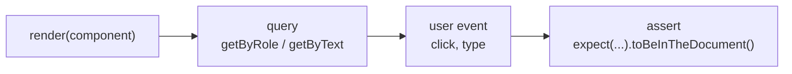
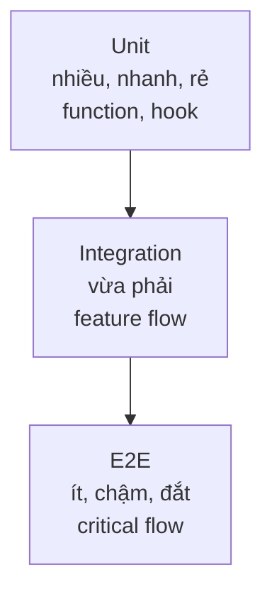

# Testing React App

**Testing** (kiểm thử, tức viết code để tự động kiểm tra xem ứng dụng có chạy đúng không) giúp bạn phát hiện lỗi sớm và yên tâm khi sửa đổi code. Trong React thường có nhiều mức kiểm thử: kiểm thử từng đơn vị nhỏ với **test runner** (công cụ chạy test) như Vitest, kiểm thử giao diện với React Testing Library, và **E2E** (kiểm thử đầu-cuối, mô phỏng người dùng thật thao tác trên trình duyệt) với Playwright. Bài này giới thiệu các công cụ và chiến lược kiểm thử cho người mới.

---

## Mục lục

- [Vì sao cần test React component?](#vì-sao-cần-test-react-component)
- [Test Runners](#test-runners)
- [Vitest (khuyến nghị)](#vitest-khuyến-nghị)
- [React Testing Library](#react-testing-library)
- [Playwright (E2E)](#playwright-e2e)
- [Storybook](#storybook)
- [Testing strategy](#testing-strategy)

---

## Vì sao cần test React component?

**Vấn đề:** Test thủ công bằng tay sau mỗi thay đổi vừa chậm vừa dễ sót. Khi refactor hay nâng cấp, một tính năng cũ có thể hỏng âm thầm (regression) mà không ai biết — cho tới khi user gặp lỗi trong production.

```tsx
// Mỗi lần sửa Counter, phải tự mở app, click thử, nhìn bằng mắt...
// Quên test luồng cũ → bug lọt ra production
function Counter() {
  const [count, setCount] = useState(0);
  // refactor logic này → ai đảm bảo nút increment vẫn chạy?
  return <button onClick={() => setCount(count + 1)}>Count: {count}</button>;
}
```

**Giải pháp:** Viết test tự động chạy lại trong vài giây sau mỗi thay đổi. React Testing Library kiểm thử theo **góc nhìn người dùng** (render, click, kỳ vọng UI) thay vì chi tiết nội bộ → test bền khi refactor. Vitest/Jest chạy nhanh ở mức unit/component; Playwright (E2E) chạy luồng thật trên trình duyệt.

```tsx
import { describe, it, expect } from "vitest";
import { render, screen } from "@testing-library/react";
import userEvent from "@testing-library/user-event";
import { Counter } from "./Counter";

describe("Counter", () => {
  it("tăng số đếm khi click", async () => {
    const user = userEvent.setup();
    render(<Counter />);

    expect(screen.getByText("Count: 0")).toBeInTheDocument();
    await user.click(screen.getByRole("button"));
    expect(screen.getByText("Count: 1")).toBeInTheDocument();
  });
});
```

Một bài test theo React Testing Library thường đi theo luồng bốn bước:



:::tip[Dùng thực tế]

- **Form submit / validation** — kiểm tra nhập sai báo lỗi, nhập đúng gọi API.
- **Render theo props** — component hiển thị đúng với từng `variant`, `disabled`, `loading`.
- **Chống regression khi refactor** — đổi code nội bộ, test cũ vẫn xanh là yên tâm.
- **Luồng critical (E2E)** — đăng nhập, thanh toán, đăng ký chạy đúng đầu-cuối với Playwright.

:::

---

## Test Runners

| Tool | Đặc điểm | Khuyến nghị |
|------|----------|-------------|
| **Vitest** | Dùng Vite, nhanh, API giống Jest | **Có** |
| **Jest** | Chuẩn cũ, cộng đồng lớn | Cho project legacy |
| **Bun test** | Tích hợp Bun, cực nhanh | Project Bun |
| **Node test runner** | Built-in Node 20+ | Project Node thuần |

---

## Vitest (khuyến nghị)

```bash
npm install -D vitest @testing-library/react @testing-library/jest-dom jsdom
```

Config:

```ts
// vitest.config.ts
import { defineConfig } from "vitest/config";
import react from "@vitejs/plugin-react";

export default defineConfig({
  plugins: [react()],
  test: {
    environment: "jsdom",
    globals: true,
    setupFiles: ["./src/test/setup.ts"],
  },
});
```

```ts
// src/test/setup.ts
import "@testing-library/jest-dom/vitest";
```

Viết test:

```tsx
import { describe, it, expect } from "vitest";
import { render, screen } from "@testing-library/react";
import { Button } from "./Button";

describe("Button", () => {
  it("hiển thị label", () => {
    render(<Button>Save</Button>);
    expect(screen.getByText("Save")).toBeInTheDocument();
  });
});
```

Chạy:

```bash
npx vitest         # watch mode
npx vitest run     # 1 lần
npx vitest --ui    # UI dashboard
```

:::tip[Mẹo]

**Vitest vs Jest** — API gần như giống hệt:

- `describe`, `it`, `expect`, `vi.fn()`, `vi.mock()`.
- Snapshot, coverage, parallel test.
- Khác biệt nhỏ: `vi` thay `jest` cho mock util.

Migration Jest → Vitest:

```bash
# Đổi tên import jest → vi
# Update config
```

Vitest **nhanh hơn 3-10 lần** với Vite project. Project mới luôn dùng
Vitest, project Jest cũ migrate dần.

:::

---

## React Testing Library

[RTL](https://testing-library.com/react) — test theo cách user tương tác,
không test implementation detail.

```tsx
import { render, screen, fireEvent } from "@testing-library/react";
import userEvent from "@testing-library/user-event";

it("increment khi click", async () => {
  const user = userEvent.setup();
  render(<Counter />);

  expect(screen.getByText("Count: 0")).toBeInTheDocument();

  await user.click(screen.getByRole("button", { name: /increment/i }));

  expect(screen.getByText("Count: 1")).toBeInTheDocument();
});
```

**Query priority** (ưu tiên giống user):

1. `getByRole` — `<button>`, `<input>`, `<heading>` — đúng a11y.
2. `getByLabelText` — input với `<label>`.
3. `getByPlaceholderText`.
4. `getByText`.
5. `getByDisplayValue`.
6. `getByAltText` (image).
7. `getByTitle`.
8. `getByTestId` — **last resort**.

Variant:

- `getBy*` — sync, throw nếu không tìm thấy.
- `queryBy*` — sync, trả `null` nếu không có (test "không có").
- `findBy*` — async, retry trong 1 giây (chờ async).

:::info[Phân tích]

**Triết lý RTL — "test giống user dùng app"**:

```tsx
// Tệ — test implementation
expect(component.state.count).toBe(1);  // truy cập state
expect(component.find("Counter").props().count).toBe(1);  // truy cập props
expect(wrapper.html()).toContain("count-1");  // CSS class internal

// Tốt — test behavior user thấy
expect(screen.getByText("Count: 1")).toBeInTheDocument();
expect(screen.getByRole("button")).toBeEnabled();
```

Lợi ích:

- Refactor internal không phá test.
- Test catch bug **user thực sự gặp**, không phải bug technical.
- A11y mặc định test luôn — `getByRole` chỉ chạy nếu có ARIA đúng.

Pattern: **viết test theo "user story"**, không theo function name.

:::

---

## Playwright (E2E)

[Playwright](https://playwright.dev) — E2E testing chạy real browser
(Chromium, Firefox, WebKit).

```bash
npm init playwright@latest
```

```ts
// tests/login.spec.ts
import { test, expect } from "@playwright/test";

test("login flow", async ({ page }) => {
  await page.goto("/login");
  await page.getByLabel("Email").fill("user@example.com");
  await page.getByLabel("Password").fill("password");
  await page.getByRole("button", { name: "Sign in" }).click();

  await expect(page).toHaveURL("/dashboard");
  await expect(page.getByRole("heading", { name: "Dashboard" })).toBeVisible();
});
```

Đặc điểm:

- Test trên **real browser** — đúng behavior production.
- **Auto-wait** — không cần `sleep`/`waitFor` thủ công.
- **Network mocking** — intercept request.
- **Trace viewer** — debug step-by-step, screenshot, video.
- **Codegen** — record interaction thành code test.

Playwright thay thế **Cypress** trong nhiều project 2024+ vì:

- Hỗ trợ multi-browser native.
- Parallel test nhanh.
- Network mocking mạnh hơn.

---

## Storybook

[Storybook](https://storybook.js.org) — develop + test component isolation.

```bash
npx storybook@latest init
```

```tsx
// Button.stories.tsx
import { Button } from "./Button";

export default { component: Button };

export const Primary = {
  args: { variant: "primary", children: "Save" },
};

export const Disabled = {
  args: { disabled: true, children: "Disabled" },
};
```

Lợi ích:

- **Develop component** không cần render trong context của app.
- **Document** — auto generate doc từ props.
- **Visual regression test** — Chromatic / Percy.
- **Interaction test** — test stories với Playwright/Testing Library.
- **Design system showcase**.

Phù hợp:

- Team có design system.
- Component library cần document cho team.
- Test component isolated khỏi context phức tạp.

---

## Testing strategy

**Testing Pyramid:**

```
       /\
      /E2E\          (ít, chậm, đắt) — critical flow
     /------\
    /  Integ \       (vừa, vừa nhanh) — feature flow
   /----------\
  /    Unit    \     (nhiều, nhanh, rẻ) — function, hook
 /--------------\
```

Cùng ý tưởng kim tự tháp test, biểu diễn dưới dạng sơ đồ từ dưới lên:



| Loại | Mục tiêu | Tool |
|------|----------|------|
| **Unit** | Pure function, hook | Vitest |
| **Component** | UI component | Vitest + RTL |
| **Integration** | Multiple component + API | Vitest + MSW |
| **E2E** | User flow đầy đủ | Playwright |
| **Visual** | UI không đổi ngoài ý muốn | Chromatic / Percy |

:::tip[Mẹo]

**Quy tắc thực dụng cho project React 2026:**

1. **Unit test** cho util/hook quan trọng → Vitest.
2. **Component test** cho UI có logic → Vitest + RTL.
3. **E2E test** cho 3-5 critical flow → Playwright (login, checkout, signup).
4. **Skip** unit test cho code trivial (JSX render đơn giản).
5. **MSW** để mock API trong test → consistent giữa dev và test.

Đừng cố 100% coverage — Effort > reward khi cao quá 80%. Focus vào:
- Logic phức tạp.
- Bug đã gặp (regression test).
- Critical business flow.

:::

:::warning[Cần lưu ý]

**Test cần update — không phải obstacle**:

Khi refactor, test fail là **normal**. Đừng:

- Comment test ra.
- Đặt `.skip` "tạm thời".
- Sửa test để pass mà không hiểu vì sao.

→ Hiểu vì sao fail trước. Hoặc test đúng (sửa code), hoặc test sai (sửa
test). Đừng "im lặng" — cuối cùng tạo nợ kỹ thuật lớn.

:::
