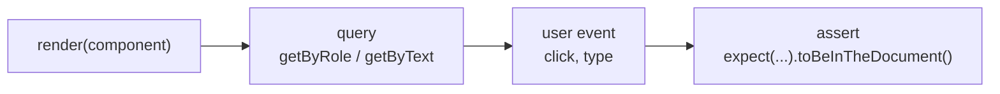
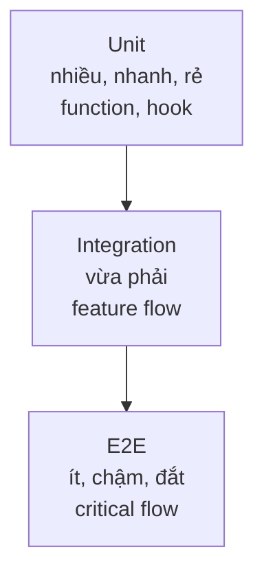

# Testing React App

**Testing** (kiểm thử, tức viết code để tự động kiểm tra xem ứng dụng có chạy đúng không) giúp bạn phát hiện lỗi sớm và yên tâm khi sửa đổi code. Trong React thường có nhiều mức kiểm thử: kiểm thử từng đơn vị nhỏ với **test runner** (công cụ chạy test) như Vitest, kiểm thử giao diện với React Testing Library, và **E2E** (kiểm thử đầu-cuối, mô phỏng người dùng thật thao tác trên trình duyệt) với Playwright. Bài này giới thiệu các công cụ và chiến lược kiểm thử cho người mới.

[](pathname:///img/react/testing.webp)

---

:::note[Ghi nhớ nhanh]

- ⭐ **Test tự động chống regression** — chạy lại trong vài giây sau mỗi thay đổi, thay cho việc mở app click bằng tay và dễ sót.
- ⭐ **`Vitest` là test runner mặc định cho project mới** — dùng Vite, nhanh hơn Jest 3-10 lần, API gần giống hệt (`vi` thay `jest`).
- **React Testing Library test theo góc nhìn người dùng** — ưu tiên `getByRole` > `getByText` > `getByTestId`; test behavior chứ không test implementation → bền khi refactor.
- **Playwright cho E2E** — chạy trên real browser đa nền (Chromium/Firefox/WebKit), auto-wait, trace viewer, dần thay Cypress; chỉ viết cho 3-5 luồng critical.
- **Theo Testing Pyramid**: nhiều unit (Vitest) → vừa integration (+ MSW) → ít E2E (Playwright); đừng cố 100% coverage, ~80% là đủ. **Storybook** để develop/document component isolated.

:::

---

## Mục lục

- [Vì sao cần test React component?](#vì-sao-cần-test-react-component)
- [Test Runners](#test-runners)
- [Vitest (khuyến nghị)](#vitest-khuyến-nghị)
- [React Testing Library](#react-testing-library)
- [Playwright (E2E)](#playwright-e2e)
- [Storybook](#storybook)
- [Testing strategy](#testing-strategy)
- [Câu hỏi phỏng vấn](#câu-hỏi-phỏng-vấn)

---

## Vì sao cần test React component?

**Vấn đề:** Test thủ công bằng tay sau mỗi thay đổi vừa chậm vừa dễ sót. Khi refactor hay nâng cấp, một tính năng cũ có thể hỏng âm thầm (regression) mà không ai biết — cho tới khi user gặp lỗi trong production.

```tsx
// Mỗi lần sửa Counter, phải tự mở app, click thử, nhìn bằng mắt...
// Quên test luồng cũ → bug lọt ra production
function Counter() {
  const [count, setCount] = useState(0);
  // refactor logic này → ai đảm bảo nút increment vẫn chạy?
  return <button onClick={() => setCount(count + 1)}>Count: {count}</button>;
}
```

**Giải pháp:** Viết test tự động chạy lại trong vài giây sau mỗi thay đổi. React Testing Library kiểm thử theo **góc nhìn người dùng** (render, click, kỳ vọng UI) thay vì chi tiết nội bộ → test bền khi refactor. Vitest/Jest chạy nhanh ở mức unit/component; Playwright (E2E) chạy luồng thật trên trình duyệt.

```tsx
import { describe, it, expect } from "vitest";
import { render, screen } from "@testing-library/react";
import userEvent from "@testing-library/user-event";
import { Counter } from "./Counter";

describe("Counter", () => {
  it("tăng số đếm khi click", async () => {
    const user = userEvent.setup();
    render(<Counter />);

    expect(screen.getByText("Count: 0")).toBeInTheDocument();
    await user.click(screen.getByRole("button"));
    expect(screen.getByText("Count: 1")).toBeInTheDocument();
  });
});
```

Một bài test theo React Testing Library thường đi theo luồng bốn bước:



:::tip[Dùng thực tế]

- **Form submit / validation** — kiểm tra nhập sai báo lỗi, nhập đúng gọi API.
- **Render theo props** — component hiển thị đúng với từng `variant`, `disabled`, `loading`.
- **Chống regression khi refactor** — đổi code nội bộ, test cũ vẫn xanh là yên tâm.
- **Luồng critical (E2E)** — đăng nhập, thanh toán, đăng ký chạy đúng đầu-cuối với Playwright.

:::

---

## Test Runners

| Tool | Đặc điểm | Khuyến nghị |
|------|----------|-------------|
| **Vitest** | Dùng Vite, nhanh, API giống Jest | **Có** |
| **Jest** | Chuẩn cũ, cộng đồng lớn | Cho project legacy |
| **Bun test** | Tích hợp Bun, cực nhanh | Project Bun |
| **Node test runner** | Built-in Node 20+ | Project Node thuần |

---

## Vitest (khuyến nghị)

```bash
npm install -D vitest @testing-library/react @testing-library/jest-dom jsdom
```

Config:

```ts
// vitest.config.ts
import { defineConfig } from "vitest/config";
import react from "@vitejs/plugin-react";

export default defineConfig({
  plugins: [react()],
  test: {
    environment: "jsdom",
    globals: true,
    setupFiles: ["./src/test/setup.ts"],
  },
});
```

```ts
// src/test/setup.ts
import "@testing-library/jest-dom/vitest";
```

Viết test:

```tsx
import { describe, it, expect } from "vitest";
import { render, screen } from "@testing-library/react";
import { Button } from "./Button";

describe("Button", () => {
  it("hiển thị label", () => {
    render(<Button>Save</Button>);
    expect(screen.getByText("Save")).toBeInTheDocument();
  });
});
```

Chạy:

```bash
npx vitest         # watch mode
npx vitest run     # 1 lần
npx vitest --ui    # UI dashboard
```

:::tip[Mẹo]

**Vitest vs Jest** — API gần như giống hệt:

- `describe`, `it`, `expect`, `vi.fn()`, `vi.mock()`.
- Snapshot, coverage, parallel test.
- Khác biệt nhỏ: `vi` thay `jest` cho mock util.

Migration Jest → Vitest:

```bash
# Đổi tên import jest → vi
# Update config
```

Vitest **nhanh hơn 3-10 lần** với Vite project. Project mới luôn dùng
Vitest, project Jest cũ migrate dần.

:::

---

## React Testing Library

[RTL](https://testing-library.com/react) — test theo cách user tương tác,
không test implementation detail.

```tsx
import { render, screen, fireEvent } from "@testing-library/react";
import userEvent from "@testing-library/user-event";

it("increment khi click", async () => {
  const user = userEvent.setup();
  render(<Counter />);

  expect(screen.getByText("Count: 0")).toBeInTheDocument();

  await user.click(screen.getByRole("button", { name: /increment/i }));

  expect(screen.getByText("Count: 1")).toBeInTheDocument();
});
```

**Query priority** (ưu tiên giống user):

1. `getByRole` — `<button>`, `<input>`, `<heading>` — đúng a11y.
2. `getByLabelText` — input với `<label>`.
3. `getByPlaceholderText`.
4. `getByText`.
5. `getByDisplayValue`.
6. `getByAltText` (image).
7. `getByTitle`.
8. `getByTestId` — **last resort**.

Variant:

- `getBy*` — sync, throw nếu không tìm thấy.
- `queryBy*` — sync, trả `null` nếu không có (test "không có").
- `findBy*` — async, retry trong 1 giây (chờ async).

:::info[Phân tích]

**Triết lý RTL — "test giống user dùng app"**:

```tsx
// Tệ — test implementation
expect(component.state.count).toBe(1);  // truy cập state
expect(component.find("Counter").props().count).toBe(1);  // truy cập props
expect(wrapper.html()).toContain("count-1");  // CSS class internal

// Tốt — test behavior user thấy
expect(screen.getByText("Count: 1")).toBeInTheDocument();
expect(screen.getByRole("button")).toBeEnabled();
```

Lợi ích:

- Refactor internal không phá test.
- Test catch bug **user thực sự gặp**, không phải bug technical.
- A11y mặc định test luôn — `getByRole` chỉ chạy nếu có ARIA đúng.

Pattern: **viết test theo "user story"**, không theo function name.

:::

---

## Playwright (E2E)

[Playwright](https://playwright.dev) — E2E testing chạy real browser
(Chromium, Firefox, WebKit).

```bash
npm init playwright@latest
```

```ts
// tests/login.spec.ts
import { test, expect } from "@playwright/test";

test("login flow", async ({ page }) => {
  await page.goto("/login");
  await page.getByLabel("Email").fill("user@example.com");
  await page.getByLabel("Password").fill("password");
  await page.getByRole("button", { name: "Sign in" }).click();

  await expect(page).toHaveURL("/dashboard");
  await expect(page.getByRole("heading", { name: "Dashboard" })).toBeVisible();
});
```

Đặc điểm:

- Test trên **real browser** — đúng behavior production.
- **Auto-wait** — không cần `sleep`/`waitFor` thủ công.
- **Network mocking** — intercept request.
- **Trace viewer** — debug step-by-step, screenshot, video.
- **Codegen** — record interaction thành code test.

Playwright thay thế **Cypress** trong nhiều project 2024+ vì:

- Hỗ trợ multi-browser native.
- Parallel test nhanh.
- Network mocking mạnh hơn.

---

## Storybook

[Storybook](https://storybook.js.org) — develop + test component isolation.

```bash
npx storybook@latest init
```

```tsx
// Button.stories.tsx
import { Button } from "./Button";

export default { component: Button };

export const Primary = {
  args: { variant: "primary", children: "Save" },
};

export const Disabled = {
  args: { disabled: true, children: "Disabled" },
};
```

Lợi ích:

- **Develop component** không cần render trong context của app.
- **Document** — auto generate doc từ props.
- **Visual regression test** — Chromatic / Percy.
- **Interaction test** — test stories với Playwright/Testing Library.
- **Design system showcase**.

Phù hợp:

- Team có design system.
- Component library cần document cho team.
- Test component isolated khỏi context phức tạp.

---

## Testing strategy

**Testing Pyramid:**

```
       /\
      /E2E\          (ít, chậm, đắt) — critical flow
     /------\
    /  Integ \       (vừa, vừa nhanh) — feature flow
   /----------\
  /    Unit    \     (nhiều, nhanh, rẻ) — function, hook
 /--------------\
```

Cùng ý tưởng kim tự tháp test, biểu diễn dưới dạng sơ đồ từ dưới lên:



| Loại | Mục tiêu | Tool |
|------|----------|------|
| **Unit** | Pure function, hook | Vitest |
| **Component** | UI component | Vitest + RTL |
| **Integration** | Multiple component + API | Vitest + MSW |
| **E2E** | User flow đầy đủ | Playwright |
| **Visual** | UI không đổi ngoài ý muốn | Chromatic / Percy |

:::tip[Mẹo]

**Quy tắc thực dụng cho project React 2026:**

1. **Unit test** cho util/hook quan trọng → Vitest.
2. **Component test** cho UI có logic → Vitest + RTL.
3. **E2E test** cho 3-5 critical flow → Playwright (login, checkout, signup).
4. **Skip** unit test cho code trivial (JSX render đơn giản).
5. **MSW** để mock API trong test → consistent giữa dev và test.

Đừng cố 100% coverage — Effort > reward khi cao quá 80%. Focus vào:
- Logic phức tạp.
- Bug đã gặp (regression test).
- Critical business flow.

:::

:::warning[Cần lưu ý]

**Test cần update — không phải obstacle**:

Khi refactor, test fail là **normal**. Đừng:

- Comment test ra.
- Đặt `.skip` "tạm thời".
- Sửa test để pass mà không hiểu vì sao.

→ Hiểu vì sao fail trước. Hoặc test đúng (sửa code), hoặc test sai (sửa
test). Đừng "im lặng" — cuối cùng tạo nợ kỹ thuật lớn.

:::

---

## Câu hỏi phỏng vấn

Những câu thường gặp về chủ đề này. Tự trả lời trước, rồi bấm **Xem đáp án** để đối chiếu.

**1. Regression là gì và vì sao test tự động là cách phòng chống hiệu quả hơn test tay?**

<details className="qa">
<summary>Xem đáp án</summary>

**Regression** là tình huống một tính năng **đang chạy đúng bỗng hỏng** sau khi ta sửa chỗ khác — refactor, nâng version thư viện, thêm feature mới. Nó nguy hiểm vì hỏng **âm thầm**: không ai nghĩ tới việc kiểm tra lại phần đó, và bug chỉ lộ ra khi user gặp trong production.

Test tay không chống được vì:

- **Chậm** — mỗi lần đổi code phải mở app, click lại toàn bộ luồng.
- **Dễ sót** — người ta chỉ kiểm tra phần vừa sửa, không kiểm tra phần liên quan.
- **Không đều** — kết quả phụ thuộc người test, hôm nay kỹ, mai vội.

Test tự động thì ngược lại: chạy **toàn bộ** bộ test trong vài giây sau mỗi thay đổi, luôn kiểm tra đúng những gì đã viết, và chạy được trong CI trước khi merge. Mỗi bug từng gặp nên được viết thành một test — đó là cách bộ test lớn dần thành lưới an toàn, giúp refactor mà không sợ.

</details>

**2. Trình bày Testing Pyramid. Tỉ lệ hợp lý giữa unit, integration và E2E trong một dự án React?**

<details className="qa">
<summary>Xem đáp án</summary>

**Testing Pyramid** sắp xếp các loại test theo chi phí và tốc độ:

| Tầng | Số lượng | Tốc độ / chi phí | Tool | Kiểm gì |
|---|---|---|---|---|
| Unit | Nhiều nhất | Rất nhanh, rẻ | Vitest | Pure function, hook, util |
| Component / Integration | Vừa | Trung bình | Vitest + RTL (+ MSW) | Component có logic, nhiều component ghép với API giả |
| E2E | Ít nhất | Chậm, đắt, dễ flaky | Playwright | Luồng người dùng đầu-cuối |

Ý tưởng: càng lên cao càng giống thật nhưng càng chậm và càng khó chẩn đoán khi fail — nên đặt phần lớn niềm tin ở tầng dưới.

**Tỉ lệ thực dụng cho dự án React:** phần lớn là unit + component test; một lớp integration vừa phải cho các feature có gọi API (mock bằng MSW); và chỉ **3-5 luồng critical** cho E2E — đăng nhập, đăng ký, thanh toán. Đừng viết E2E cho mọi thứ: nó biến CI thành 40 phút chờ đợi và một hàng dài test đỏ không rõ nguyên nhân.

</details>

**3. So sánh `Vitest` và `Jest`. Vì sao `Vitest` chạy nhanh hơn và cần ít cấu hình hơn trong dự án Vite?**

<details className="qa">
<summary>Xem đáp án</summary>

Về API, hai bên gần như giống hệt: `describe`, `it`, `expect`, snapshot, coverage, chạy song song. Khác biệt lớn nhất trên bề mặt là util mock — `vi.fn()`, `vi.mock()` thay cho `jest.fn()`, `jest.mock()`.

**Vì sao Vitest nhanh hơn:** nó chạy **trên chính Vite**, dùng esbuild để transform file, nạp module theo cơ chế ESM gốc và chỉ transform những gì test thực sự import, cộng thêm HMR cho watch mode — sửa file nào thì chỉ chạy lại test liên quan. Jest truyền thống phải transform qua Babel/ts-jest và dựng lại môi trường module riêng, nên tốn thời gian khởi động hơn đáng kể. Tài liệu bài này nêu mức chênh **3-10 lần** với project Vite.

**Vì sao ít cấu hình:** Vitest **dùng lại `vite.config.ts`** — alias, plugin (`@vitejs/plugin-react`), biến môi trường, xử lý CSS/asset đều có sẵn. Với Jest bạn phải khai báo lại `transform`, `moduleNameMapper`, mock file tĩnh... Kết luận thực dụng: project mới dùng Vitest; project Jest cũ migrate dần, chi phí chủ yếu là đổi `jest` thành `vi`.

</details>

**4. Phân biệt `toBe` và `toEqual`. Trường hợp nào dùng `toBe` sẽ fail dù giá trị nhìn giống nhau?**

<details className="qa">
<summary>Xem đáp án</summary>

- **`toBe`**: so sánh **cùng một tham chiếu / cùng một giá trị nguyên thủy** (tương đương `Object.is`).
- **`toEqual`**: so sánh **đệ quy theo cấu trúc** — duyệt từng property của object/array.

```js
expect(2 + 2).toBe(4);                        // pass — số nguyên thủy

expect({ a: 1 }).toBe({ a: 1 });              // FAIL — hai object khác tham chiếu
expect({ a: 1 }).toEqual({ a: 1 });           // pass

const u = { id: 1 };
expect(u).toBe(u);                            // pass — đúng cùng một object

expect([1, 2]).toEqual([1, 2]);               // pass
```

**Trường hợp `toBe` fail dù nhìn giống nhau:** mọi so sánh giữa hai **object, array, Date, Map** được tạo riêng biệt — chúng giống nhau về nội dung nhưng khác địa chỉ trong bộ nhớ. Đây là lỗi kinh điển khi assert kết quả trả về của một hàm.

Lưu ý thêm: `toEqual` **bỏ qua** property có giá trị `undefined`; nếu cần chặt chẽ đến từng key thì dùng `toStrictEqual`, nó còn kiểm tra cả class/prototype của object.

</details>

**5. Triết lý của React Testing Library là 'test behavior chứ không test implementation'. Điều đó nghĩa là gì trong thực tế?**

<details className="qa">
<summary>Xem đáp án</summary>

Nghĩa là test chỉ chạm vào những gì **người dùng thấy và làm được** — text trên màn hình, vai trò của phần tử, kết quả sau khi click — chứ không chạm vào state, props, tên hàm nội bộ hay CSS class.

```tsx
// Tệ — test implementation
expect(component.state.count).toBe(1);
expect(wrapper.find("Counter").props().count).toBe(1);
expect(wrapper.html()).toContain("count-1");

// Tốt — test behavior
await user.click(screen.getByRole("button", { name: /increment/i }));
expect(screen.getByText("Count: 1")).toBeInTheDocument();
```

Lợi ích trong thực tế:

- **Bền khi refactor** — đổi `useState` sang `useReducer`, tách component con, đổi tên biến: test vẫn xanh vì hành vi không đổi.
- **Bắt đúng bug user gặp**, không phải bug kỹ thuật vô hại.
- **Kiểm a11y miễn phí** — `getByRole` chỉ tìm được khi markup có role/label đúng, nên viết test kiểu này ép markup phải chuẩn.

Nguyên tắc đi kèm: viết test theo **user story** ("nhập sai email thì hiện lỗi"), không theo tên hàm.

</details>

**6. Vì sao thứ tự ưu tiên query là `getByRole` rồi mới tới `getByText`, cuối cùng mới `getByTestId`?**

<details className="qa">
<summary>Xem đáp án</summary>

Thứ tự này phản ánh mức độ **giống cách người dùng thực sự tìm phần tử**:

1. `getByRole` — cách cả người dùng chuột lẫn người dùng screen reader nhận ra phần tử ("nút tên Lưu", "ô nhập Email"). Kết hợp `{ name: ... }` là truy vấn vừa chính xác vừa kiểm tra a11y.
2. `getByLabelText` — đúng cách người dùng nhận ra một ô nhập trong form.
3. `getByPlaceholderText`, `getByText`, `getByDisplayValue`, `getByAltText`, `getByTitle` — vẫn là thứ hiển thị ra ngoài, nhưng kém ổn định hơn (placeholder không thay được label, text dễ đổi theo copywriting/i18n).
4. `getByTestId` — **phương án cuối**, vì `data-testid` là thứ **chỉ test nhìn thấy**. Nó không chứng minh gì về trải nghiệm thật: markup có thể hỏng hoàn toàn về a11y mà test vẫn xanh.

Hệ quả tích cực: ưu tiên `getByRole` khiến những markup sai (div gắn `onClick` thay vì `button`, input không có label) **lộ ra ngay lúc viết test**. `data-testid` vẫn hợp lý cho phần tử không có role/text ổn định, ví dụ một container biểu đồ.

</details>

**7. Phân biệt `getBy*`, `queryBy*` và `findBy*`. Dùng cái nào khi muốn khẳng định một phần tử KHÔNG tồn tại?**

<details className="qa">
<summary>Xem đáp án</summary>

| Query | Đồng bộ? | Không tìm thấy thì | Dùng khi |
|---|---|---|---|
| `getBy*` | Sync | **Throw** lỗi ngay | Khẳng định phần tử **có** mặt, đang hiển thị sẵn |
| `queryBy*` | Sync | Trả về `null` | Khẳng định phần tử **không** có |
| `findBy*` | Async (trả Promise, retry khoảng 1 giây) | Reject sau timeout | Phần tử xuất hiện **sau** một tác vụ bất đồng bộ |

```tsx
expect(screen.getByRole("heading")).toBeInTheDocument();
expect(screen.queryByText("Lỗi")).not.toBeInTheDocument();   // không tồn tại
expect(await screen.findByText("Đã lưu")).toBeInTheDocument(); // chờ async
```

**Khẳng định KHÔNG tồn tại → dùng `queryBy*`.** Lý do: `getBy*` ném lỗi ngay khi không tìm thấy nên không bao giờ chạy tới assertion; còn `queryBy*` trả `null` để `not.toBeInTheDocument()` kiểm tra được.

Ngoài ra mỗi nhóm có biến thể `*AllBy*` trả về mảng, dùng khi mong đợi nhiều phần tử. Nếu cần chờ **một phần tử biến mất**, dùng `waitForElementToBeRemoved` thay vì tự lặp.

</details>

**8. `fireEvent` khác `userEvent` ở đâu? Vì sao `userEvent` phản ánh hành vi người dùng thật hơn?**

<details className="qa">
<summary>Xem đáp án</summary>

- **`fireEvent`**: bắn **đúng một DOM event** vào phần tử, ví dụ `fireEvent.click(btn)` chỉ gửi sự kiện `click`.
- **`userEvent`**: mô phỏng **cả chuỗi tương tác** mà trình duyệt sinh ra cho một thao tác người dùng.

```tsx
const user = userEvent.setup();
await user.click(button);           // pointerdown → mousedown → focus → pointerup → mouseup → click
await user.type(input, "hello");    // focus, rồi từng phím keydown/keypress/input/keyup
```

Vì sao thực tế hơn:

- Một cú click thật kéo theo `focus`, `blur` phần tử cũ, thay đổi trạng thái hover/active. Nhiều bug chỉ lộ ra ở các bước đó — ví dụ validation chạy ở `blur`.
- `userEvent.type` gõ **từng ký tự**, kích hoạt mọi handler `onChange`, đúng với input có debounce hoặc format khi gõ. `fireEvent.change` chỉ set thẳng giá trị một lần.
- `userEvent` **tôn trọng khả năng tương tác**: không click được vào phần tử `disabled` hay bị che — đúng như người dùng thật; `fireEvent` thì vẫn bắn.

Mặc định nên dùng `userEvent` (nhớ `setup()` và `await`); chỉ dùng `fireEvent` cho sự kiện không đến từ người dùng như `scroll`, `resize`.

</details>

**9. Cảnh báo `act(...)` xuất hiện khi nào và cách xử lý đúng là gì?**

<details className="qa">
<summary>Xem đáp án</summary>

Cảnh báo xuất hiện khi **state của component được cập nhật ngoài phạm vi React biết trước trong môi trường test** — điển hình là một promise, timer hoặc callback bất đồng bộ resolve **sau khi** test đã kết thúc phần đồng bộ, khiến React re-render mà chưa được "bao" trong `act`.

Nguyên nhân thường gặp:

- Fetch dữ liệu trong `useEffect` nhưng test không chờ kết quả.
- `setTimeout`/debounce chạy sau khi assertion đã xong.
- Quên `await` trước một thao tác `userEvent`.

Cách xử lý đúng — **chờ đúng thứ mình mong đợi**, đừng bọc `act` thủ công:

```tsx
await user.click(saveButton);                       // luôn await userEvent
expect(await screen.findByText("Đã lưu")).toBeInTheDocument();  // chờ kết quả async
await waitFor(() => expect(mockApi).toHaveBeenCalled());
```

`render` và các API của RTL đã tự bọc `act` sẵn, nên gần như không cần gọi trực tiếp. Nếu cảnh báo vẫn còn, thường là test đang bỏ sót một tác vụ async: hoặc chưa mock nó, hoặc chưa chờ nó. Xử lý sai là **tắt cảnh báo đi** — nó gần như luôn chỉ ra một assertion đang chạy trên UI chưa ổn định.

</details>

**10. So sánh `waitFor` và `findBy*`. Khi nào bắt buộc phải dùng `waitFor`?**

<details className="qa">
<summary>Xem đáp án</summary>

Cả hai đều **poll lại cho tới khi điều kiện đúng hoặc hết timeout**. Thực chất `findBy*` chính là `waitFor` bọc quanh một query, nên nó ngắn gọn và thông báo lỗi rõ hơn.

```tsx
// findBy — chờ một phần tử xuất hiện
expect(await screen.findByText("Đã lưu")).toBeInTheDocument();

// waitFor — chờ một điều kiện bất kỳ
await waitFor(() => expect(mockSave).toHaveBeenCalledWith({ id: 1 }));
```

**Bắt buộc dùng `waitFor` khi điều kiện chờ không phải là "một phần tử xuất hiện":**

- Chờ một **mock function được gọi** (hoặc gọi với tham số nào đó).
- Chờ **nhiều điều kiện** cùng đúng trong một lần kiểm tra.
- Chờ một **thứ biến mất** — tuy trường hợp này nên dùng `waitForElementToBeRemoved` cho rõ nghĩa.
- Chờ trạng thái ngoài DOM, ví dụ giá trị trong store hoặc URL đổi.

Lưu ý: callback của `waitFor` phải **không có side effect** vì nó chạy nhiều lần; và đừng nhét nhiều thao tác `userEvent` vào trong đó. Ưu tiên `findBy*` bất cứ khi nào mục tiêu là một phần tử.

</details>

**11. Phân biệt `vi.fn()` / `vi.mock()` / `vi.spyOn()` (tương ứng `jest.*`). Mỗi cái phù hợp tình huống nào?**

<details className="qa">
<summary>Xem đáp án</summary>

| API | Làm gì | Dùng khi |
|---|---|---|
| `vi.fn()` | Tạo một **hàm giả** rỗng, ghi lại số lần gọi và tham số | Truyền vào props/callback: `onClick`, `onSubmit`, hoặc inject dependency |
| `vi.mock()` | Thay **cả một module** bằng bản giả, áp dụng cho mọi import của module đó | Cắt đứt phụ thuộc nặng: module gọi API, thư viện bên thứ ba, module đọc file |
| `vi.spyOn()` | **Theo dõi** một method có sẵn trên object, giữ nguyên hoặc thay tạm phần thân | Quan sát `console.error`, `localStorage.setItem`, hay một method của service mà vẫn muốn khôi phục sau |

```tsx
const onSubmit = vi.fn();
render(<Form onSubmit={onSubmit} />);
await user.click(screen.getByRole("button", { name: /gửi/i }));
expect(onSubmit).toHaveBeenCalledTimes(1);

const spy = vi.spyOn(window.localStorage, "setItem");
// ...
spy.mockRestore();   // trả lại bản gốc
```

Nguyên tắc: **mock càng ít càng tốt** và mock ở **ranh giới hệ thống**, không mock code nghiệp vụ của chính mình — mock nhiều quá thì test xanh nhưng chẳng chứng minh được gì. Nhớ reset mock giữa các test để tránh rò rỉ trạng thái.

</details>

**12. Vì sao mock ở tầng network bằng `MSW` thường tốt hơn mock trực tiếp module `fetch` hay `axios`?**

<details className="qa">
<summary>Xem đáp án</summary>

`MSW` (Mock Service Worker) chặn request ở **tầng mạng** và trả về response giả, thay vì thay thế hàm `fetch`/`axios` trong code.

Ưu điểm:

- **Không phụ thuộc cách gọi API**. Đổi từ `fetch` sang `axios`, hay bọc thêm một lớp service, test vẫn chạy — vì hợp đồng được mock là **URL + method + response**, thứ thật sự ổn định.
- **Test đi qua code thật** của bạn: hàm build URL, header, xử lý lỗi, parse JSON đều được thực thi. Mock module `fetch` thì bỏ qua hết phần đó, tức là bỏ qua đúng chỗ hay có bug.
- **Mô phỏng được tình huống thật**: status 500, 401, response chậm, dữ liệu rỗng, phân trang — chỉ bằng cách khai báo handler.
- **Dùng chung một bộ handler cho dev, test và Storybook**, nên hành vi nhất quán; frontend làm việc được khi backend chưa xong.
- Sạch hơn: không rải `vi.mock` và `mockResolvedValue` khắp các file test.

Đánh đổi: tốn công dựng ban đầu và phải giữ handler khớp với API thật — nên kết hợp với contract test hoặc sinh handler từ schema nếu có.

</details>

**13. Snapshot testing có ưu điểm gì và những cạm bẫy nào khiến nó dễ trở thành test vô nghĩa?**

<details className="qa">
<summary>Xem đáp án</summary>

**Snapshot testing** ghi lại output (thường là cây DOM render ra) vào file, lần chạy sau so sánh với bản đã lưu và báo lỗi nếu khác.

Ưu điểm: viết rất nhanh, bao phủ rộng, tốt để phát hiện **thay đổi ngoài ý muốn** trong markup, và hợp với những output khó assert thủ công như cấu hình sinh tự động hay chuỗi lỗi định dạng.

Cạm bẫy khiến nó vô nghĩa:

- **Bấm update theo phản xạ** — test đỏ thì chạy `-u` cho xanh mà không đọc diff. Lúc đó snapshot chỉ ghi lại hiện trạng, kể cả hiện trạng đang sai.
- **Snapshot quá lớn** — chụp cả trang vài trăm dòng, diff không ai đọc nổi, và đổi một chi tiết nhỏ là hàng loạt test đỏ.
- **Không diễn đạt ý định** — người đọc test không biết điều gì đang được bảo vệ; test fail cũng không nói được "cái gì hỏng".
- **Dính chi tiết dễ đổi**: class sinh tự động, id ngẫu nhiên, timestamp → flaky.

Dùng đúng: snapshot **nhỏ và có chủ đích** (`toMatchInlineSnapshot` cho một mẩu output), còn hành vi quan trọng thì assert tường minh bằng `getByRole`/`getByText`.

</details>

**14. Test coverage 100% có đảm bảo code không có bug không? Vì sao ~80% thường được xem là hợp lý?**

<details className="qa">
<summary>Xem đáp án</summary>

**Không.** Coverage chỉ đo **dòng code nào đã được chạy qua** trong lúc test, không đo **đã được kiểm tra đúng hay chưa**. Một test gọi hàm rồi không assert gì vẫn cho 100% coverage dòng đó. Coverage cũng không nói gì về:

- **Tổ hợp input** chưa thử — giá trị biên, mảng rỗng, `null`, số âm.
- **Lỗi tích hợp** giữa các module dù từng module đều được cover.
- **Yêu cầu bị hiểu sai** — code chạy đúng như đã viết, nhưng viết sai ý.
- Vấn đề hiệu năng, a11y, race condition.

Ngưỡng **~80%** hợp lý vì đường cong chi phí/lợi ích: phần cuối luôn là những nhánh khó dựng nhất (error handler hiếm, code phòng thủ, glue code trivial) — tốn nhiều công mà bắt được ít bug, còn sinh ra test mong manh phải bảo trì.

Cách dùng coverage cho đúng: xem nó như **công cụ tìm vùng trắng** ("module thanh toán chưa có test nào?"), không phải mục tiêu. Ưu tiên test cho logic phức tạp, luồng nghiệp vụ quan trọng, và mọi bug đã từng gặp.

</details>

**15. Cách test một custom hook mà không cần dựng component giả?**

<details className="qa">
<summary>Xem đáp án</summary>

Dùng `renderHook` của React Testing Library — nó tự dựng một component tối giản bên trong để chạy hook và trả về `result` cùng các hàm điều khiển.

```tsx
import { renderHook, act, waitFor } from "@testing-library/react";
import { useCounter } from "./useCounter";

it("tăng giá trị khi gọi increment", () => {
  const { result } = renderHook(() => useCounter(0));

  expect(result.current.count).toBe(0);
  act(() => result.current.increment());
  expect(result.current.count).toBe(1);
});
```

Những điểm cần nhớ:

- `result.current` luôn trỏ tới **giá trị mới nhất** sau mỗi lần render — đừng destructure ra biến rồi dùng lại, giá trị đó đã cũ.
- Mọi thao tác làm đổi state phải bọc trong `act`; với hook bất đồng bộ thì dùng `waitFor` để chờ.
- Hook cần context (query client, theme, store) thì truyền qua tùy chọn `wrapper` của `renderHook`.
- `rerender` cho phép truyền props mới để kiểm tra hook phản ứng khi tham số đổi.

Với hook chỉ gói logic thuần, nhiều khi tách phần tính toán ra thành hàm thường rồi unit test trực tiếp còn đơn giản hơn.

</details>

**16. So sánh `Playwright` và `Cypress` về kiến trúc, đa trình duyệt và cơ chế auto-wait.**

<details className="qa">
<summary>Xem đáp án</summary>

| Tiêu chí | Playwright | Cypress |
|---|---|---|
| Kiến trúc | Điều khiển trình duyệt **từ bên ngoài** qua giao thức debug; test chạy trong Node | Test chạy **bên trong** trình duyệt, cùng ngữ cảnh với app |
| Đa trình duyệt | Chromium, Firefox, **WebKit** (Safari) đều là hỗ trợ gốc | Chromium và Firefox; WebKit hỗ trợ hạn chế hơn |
| Nhiều tab / nhiều origin | Xử lý tự nhiên, mở được nhiều tab, nhiều context | Bị ràng buộc hơn do chạy trong trang |
| Auto-wait | Có — chờ phần tử hiện, ổn định, nhận được tương tác rồi mới thao tác | Cũng có cơ chế retry cho lệnh và assertion |
| Chạy song song | Song song theo worker, miễn phí | Mạnh nhất khi dùng dịch vụ trả phí |
| Debug | Trace viewer xem lại từng bước, screenshot, video; có codegen | Test runner trực quan, time-travel trong UI rất tốt |

Điểm chung quan trọng: **cả hai đều auto-wait**, nên trong E2E hiện đại không cần `sleep` cứng — đó là nguồn flaky số một.

Tài liệu bài này ghi nhận Playwright dần thay Cypress trong nhiều dự án nhờ hỗ trợ đa trình duyệt gốc, chạy song song nhanh và network mocking mạnh hơn. Cypress vẫn được yêu thích vì trải nghiệm debug trực quan.

</details>

**17. Flaky test là gì? Kể ba nguyên nhân thường gặp và hướng khắc phục cho từng nguyên nhân.**

<details className="qa">
<summary>Xem đáp án</summary>

**Flaky test** là test **lúc xanh lúc đỏ dù code không đổi**. Nó độc hại hơn test đỏ hẳn, vì team dần mất niềm tin và tập thói quen "chạy lại là qua" — rồi bỏ qua cả những lần đỏ thật.

Ba nguyên nhân phổ biến và cách sửa:

1. **Chờ theo thời gian cố định.** Test đợi 500ms rồi assert; máy CI chậm hơn là đỏ. → Bỏ `sleep`, chờ **theo điều kiện**: `findBy*`, `waitFor`, hoặc auto-wait của Playwright.
2. **Phụ thuộc trạng thái dùng chung.** Test chạy đúng khi đứng một mình nhưng đỏ khi chạy cả bộ, vì test trước để lại dữ liệu trong store, `localStorage`, database hay mock chưa reset. → Mỗi test tự dựng và dọn dữ liệu riêng; reset mock và store giữa các test; không phụ thuộc thứ tự chạy.
3. **Dữ liệu và môi trường không tất định.** `Date.now()`, số ngẫu nhiên, múi giờ, gọi API thật qua mạng. → Dùng fake timer, seed cố định, cố định timezone, và mock mạng bằng MSW thay vì gọi server thật.

Nguyên tắc xử lý: quarantine tạm rồi **sửa dứt điểm**, không để `.skip` vĩnh viễn.

</details>

**18. Vì sao test cần chạy độc lập (test isolation)? Điều gì xảy ra nếu state rò rỉ giữa các test?**

<details className="qa">
<summary>Xem đáp án</summary>

Một test phải cho **cùng một kết quả dù chạy một mình, chạy chung cả bộ, hay chạy theo thứ tự ngẫu nhiên**. Đó là điều kiện để khi test đỏ, ta biết chắc lỗi nằm ở phần code nó kiểm tra.

Nếu state rò rỉ giữa các test:

- **Kết quả phụ thuộc thứ tự** — test B chỉ xanh vì test A đã tạo sẵn dữ liệu cho nó; đổi thứ tự hoặc chạy song song là đỏ.
- **Flaky và khó chẩn đoán** — test đỏ ở nơi không liên quan gì tới nguyên nhân thật.
- **Đỏ dây chuyền** — một test hỏng kéo theo mười test khác, che mất lỗi gốc.
- **Che bug thật** — mock chưa reset khiến assertion đếm số lần gọi cộng dồn từ test trước, hoặc ngược lại, code hỏng vẫn xanh nhờ dữ liệu sót lại.

Cách giữ isolation: dựng dữ liệu trong `beforeEach` chứ không dùng biến chung ở module scope; `cleanup` sau mỗi render (RTL làm tự động); reset mock, timer, `localStorage`, store và handler MSW; mỗi test dùng dữ liệu riêng; và thỉnh thoảng chạy bộ test theo thứ tự ngẫu nhiên để phát hiện phụ thuộc ngầm.

</details>

**19. `Storybook` đóng vai trò gì trong quy trình phát triển và kiểm thử component?**

<details className="qa">
<summary>Xem đáp án</summary>

Storybook là môi trường **phát triển và trưng bày component ở trạng thái cô lập** — mỗi "story" là một component với một bộ props cụ thể, render độc lập khỏi routing, store hay dữ liệu của app.

Vai trò trong quy trình:

- **Phát triển** — dựng trạng thái khó tái hiện trong app thật (loading, empty, error, danh sách 100 phần tử) chỉ bằng một story, không cần đăng nhập và click qua năm màn hình.
- **Tài liệu sống** — sinh bảng props tự động, thành nơi designer và dev cùng nhìn một nguồn sự thật cho design system.
- **Visual regression test** — công cụ như Chromatic hoặc Percy chụp ảnh từng story và báo khi pixel đổi ngoài ý muốn.
- **Interaction test** — chạy kịch bản tương tác ngay trên story bằng Testing Library/Playwright, tái dùng đúng các trạng thái đã dựng.

Phù hợp nhất với team có **design system** hoặc component library dùng chung. Với app nhỏ, một người làm, chi phí dựng và bảo trì story có thể không đáng — nên coi Storybook là bổ trợ chứ không thay thế unit/component test.

</details>

**20. Sau khi refactor, một test cũ fail. Quy trình xử lý đúng là gì, và vì sao không được `.skip` cho qua?**

<details className="qa">
<summary>Xem đáp án</summary>

Test fail sau refactor là **chuyện bình thường** — đó chính là lúc bộ test làm đúng việc của nó. Quy trình đúng:

1. **Đọc thông báo lỗi** — nó kỳ vọng gì, nhận được gì, ở bước nào.
2. **Xác định ai sai:**
   - Hành vi người dùng **không nên đổi** mà test báo đổi → **code sai**, sửa code.
   - Hành vi **cố ý thay đổi** theo yêu cầu mới → **test lỗi thời**, cập nhật test cho khớp yêu cầu mới.
   - Test vốn bám vào chi tiết nội bộ (state, class, props) → viết lại theo hành vi với `getByRole`/`getByText` để lần sau không vỡ.
3. **Chạy lại toàn bộ** để chắc không còn chỗ nào hỏng dây chuyền.

**Vì sao không `.skip`:** một test bị skip là một vùng code **mất bảo vệ mà không ai thấy** — CI vẫn xanh, cảm giác an toàn vẫn còn, nhưng bug đã có thể đang nằm đó. "Tạm thời" hầu như luôn trở thành vĩnh viễn; số test skip tăng dần cho tới lúc không ai dám bật lại vì không hiểu chúng từng kiểm tra điều gì. Tệ hơn nữa là **sửa test cho pass mà không hiểu vì sao** — cách đó xóa luôn bằng chứng về một bug thật.

</details>
