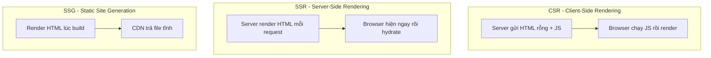
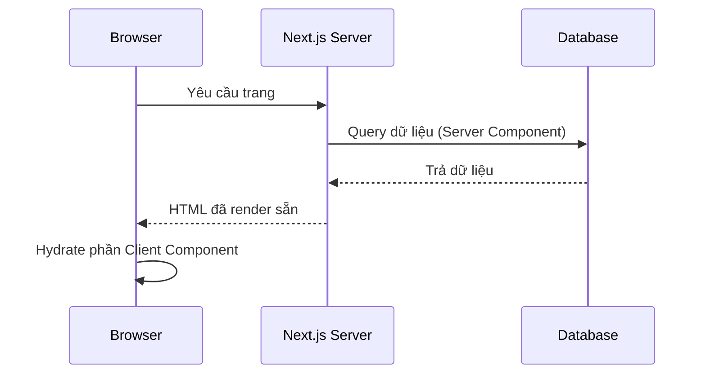

# React Frameworks

**React framework** (bộ khung dựng sẵn xây trên nền React) bổ sung những thứ React thuần không có sẵn như định tuyến trang (routing), kết xuất phía máy chủ và cấu trúc dự án theo quy ước. Nhờ đó người mới không phải tự lắp ghép nhiều công cụ rời rạc mà có ngay nền tảng đầy đủ để làm web hoàn chỉnh. Bài này giới thiệu các framework phổ biến như Next.js, Remix, Astro để bạn biết cách lựa chọn.

---

:::note[Ghi nhớ nhanh]

- ⭐ **React core chỉ là UI library, không phải framework** — framework thêm routing, SSR/SSG, Server Components, data fetching, build optimization, deployment.
- ⭐ **Next.js (App Router) là default** cho app cần routing/SSR/SEO/Server Components — hệ sinh thái lớn (Vercel), nhưng learning curve cao và có phần lock-in.
- **Remix / React Router v7** hợp form-heavy app với pattern loader/action + progressive enhancement (form chạy cả khi no-JS).
- **Astro** cho content site (blog, docs, marketing) — zero JS by default, island architecture, SEO/performance tối đa; không hợp app interactive nặng.
- **TanStack Start** mới, type-safe, đáng theo dõi (còn early stage); **Gatsby** đã lỗi thời, không khuyên dùng cho project mới. SPA đơn giản chỉ cần Vite + React Router, đừng over-engineer.

:::

---

## Mục lục

- [Tổng quan](#tổng-quan)
- [Next.js (khuyến nghị)](#nextjs-khuyến-nghị)
- [Remix / React Router v7](#remix--react-router-v7)
- [Astro](#astro)
- [TanStack Start](#tanstack-start)
- [Gatsby](#gatsby)
- [Cách chọn](#cách-chọn)
- [Câu hỏi phỏng vấn](#câu-hỏi-phỏng-vấn)

---

## Tổng quan

React core **không phải framework** — chỉ là UI library. Framework thêm:

- **Routing**.
- **Server-side rendering (SSR)**.
- **Static site generation (SSG)**.
- **Server Components** (React 19).
- **Data fetching** patterns.
- **Build optimization**.
- **Deployment** integration.

Điểm khác nhau cốt lõi giữa các framework nằm ở chiến lược render — so sánh CSR, SSR và SSG:



| Framework | Strength | Khuyến nghị | Use case |
|-----------|---------|-------------|----------|
| **Next.js** | All-in-one, ecosystem lớn | **Có** | SaaS, dashboard, blog, e-commerce |
| **Remix / RR v7** | Web standards, data loader | Có | Form-heavy app |
| **Astro** | Static + island | Có | Content site, blog, docs |
| **TanStack Start** | Type-safe, modern | Tracking | Project mới TS-heavy |
| **Gatsby** | Static, plugin-rich | Không | Maintain mode |

---

## Next.js (khuyến nghị)

[Next.js](https://nextjs.org) — framework full-stack React của Vercel,
**phổ biến nhất**.

```bash
npx create-next-app@latest my-app
```

Đặc điểm:

- **App Router** (mới) — Server Components, layout nested, streaming.
- **Pages Router** (legacy) — pattern getServerSideProps.
- **Server Actions** — form submit không API route.
- **Edge Runtime** — chạy Cloudflare-style edge.
- **Image Optimization** — `<Image>` với LCP optimization.
- **Font Optimization** — `next/font` zero CLS.
- **Turbopack** — bundler bằng Rust (bê đậu Webpack).

Structure App Router:

```
app/
├── layout.tsx       # root layout
├── page.tsx         # /
├── about/
│   └── page.tsx     # /about
├── blog/
│   ├── layout.tsx   # layout cho /blog/*
│   ├── page.tsx     # /blog
│   └── [slug]/
│       └── page.tsx # /blog/:slug
└── api/
    └── users/
        └── route.ts # API route
```

Server Component (mặc định):

```tsx
// app/users/page.tsx
async function UsersPage() {
  const users = await db.user.findMany(); // chạy trên server
  return (
    <ul>
      {users.map(u => <li key={u.id}>{u.name}</li>)}
    </ul>
  );
}
```

Với Server Component, dữ liệu được lấy ngay trên server trước khi trả HTML về cho browser:



:::info[Phân tích]

**Tại sao Next.js dominate?**

1. **Vercel backing** — đầu tư mạnh, ecosystem rộng (Vercel hosting,
   analytics, edge).
2. **React 19 first-class** — App Router là test bed của Server Components,
   Actions, Suspense.
3. **SEO + Performance built-in** — image, font, script optimization mặc định.
4. **Documentation** chất lượng cao.
5. **Adoption** — Linear, Vercel, Notion, GitHub, Twitch, TikTok đều dùng.

Trade-off:

- **Learning curve cao** — Server vs Client component, caching layers.
- **Vercel lock-in** một số feature (Edge Functions, ISR cache).
- **Build time** lớn với app to.
- **Bundle size** thường lớn hơn Vite SPA.

Nhưng nếu cần SSR/SEO/Server Components — Next.js là lựa chọn an toàn nhất.

:::

---

## Remix / React Router v7

[Remix](https://remix.run) đã merge thành **React Router v7** (2024).
Framework full-stack hoặc client-only.

```bash
npx create-remix@latest my-app
```

Đặc điểm:

- **Loader / Action** — data fetching gắn với route.
- **Nested routes + nested data** — load song song.
- **Form action native** — không cần JS để form work (progressive enhancement).
- **Web standards** — Request/Response, FormData, không React-specific.

```tsx
// app/routes/users.$id.tsx
import { useLoaderData, Form } from "react-router";

export async function loader({ params }) {
  return await db.user.findUnique({ where: { id: params.id } });
}

export async function action({ request }) {
  const formData = await request.formData();
  await db.user.update({ ... });
  return redirect(`/users/${params.id}`);
}

export default function UserPage() {
  const user = useLoaderData();
  return (
    <Form method="post">
      <input name="name" defaultValue={user.name} />
      <button type="submit">Save</button>
    </Form>
  );
}
```

Phù hợp:

- Form-heavy app (CRM, admin).
- Cần progressive enhancement.
- Team đã quen React Router.

---

## Astro

[Astro](https://astro.build) — **content-focused** framework, "island
architecture" — JS chỉ load cho component cần interactive.

```bash
npm create astro@latest my-site
```

```astro
---
// Astro component — chạy build time
const posts = await fetchPosts();
---

<Layout>
  <h1>Blog</h1>
  <ul>
    {posts.map(p => <li><a href={`/blog/${p.slug}`}>{p.title}</a></li>)}
  </ul>

  <!-- React component, chỉ hydrate khi cần -->
  <SearchBox client:visible />
</Astro>
```

Đặc điểm:

- **Zero JS by default** — HTML/CSS tĩnh, JS opt-in.
- **Multi-framework** — React, Vue, Svelte, Solid trong cùng project.
- **Markdown/MDX** first-class.
- **Image optimization**, sitemap, RSS built-in.

Phù hợp:

- Blog, docs, marketing site, portfolio.
- Performance critical (Lighthouse 100).
- SEO ưu tiên.

Không phù hợp:

- App interactive nặng (SaaS, dashboard).
- Real-time, WebSocket-heavy.

---

## TanStack Start

[TanStack Start](https://tanstack.com/start) — framework mới, type-safe,
file-based router (TanStack Router).

```bash
npm create @tanstack/start@latest my-app
```

Đặc điểm:

- **Type-safe end-to-end** (route, search params, loader).
- **Server functions** type-safe.
- **TanStack Query + Router** tích hợp deeply.
- **SSR + streaming**.

Vẫn early stage (alpha-beta 2025+). Đáng theo dõi nếu thích TanStack ecosystem.

---

## Gatsby

[Gatsby](https://www.gatsbyjs.com) — static site generator, plugin
ecosystem khổng lồ.

Năm 2026, **Gatsby đã giảm phổ biến mạnh**:

- Astro thay thế cho static site.
- Next.js thay thế cho app + static.
- Plugin ecosystem ít update.
- Netlify mua Gatsby → product roadmap mơ hồ.

→ **Không khuyên dùng** Gatsby cho project mới. Maintain dự án cũ thì OK.

---

## Cách chọn

```
Project type?

├─ Blog, docs, marketing?
│  └─ Astro (tĩnh, SEO max)
│
├─ Dashboard, SaaS, app interactive?
│  ├─ Cần SSR/Server Components? → Next.js
│  └─ SPA thuần? → Vite + React Router
│
├─ Form-heavy, multi-step workflow?
│  └─ Remix / React Router v7 (loader/action pattern)
│
├─ Project mới, TS-first, modern?
│  └─ TanStack Start (experimental, đầu tư cho 2026+)
│
└─ Existing Gatsby project?
   └─ Cân nhắc migrate sang Astro hoặc Next.js
```

:::tip[Mẹo]

**Quy tắc thực dụng 2026:**

- **Default**: Next.js (App Router) cho mọi React app cần routing/SSR.
- **Static content**: Astro.
- **SPA đơn giản**: Vite + React + React Router.
- **Experimental**: TanStack Start theo dõi cho 2027+.

Đừng over-engineer — SPA đơn giản không cần Next.js. Nhưng khi đã cần
SSR/SEO/Server Components → đi thẳng Next.js, không nhảy lib khác.

:::

---

## Câu hỏi phỏng vấn

Những câu thường gặp về chủ đề này. Tự trả lời trước, rồi đối chiếu lại với nội dung phía trên.

1. React core khác một framework ở những điểm nào? Framework bổ sung thêm những gì?
2. So sánh `CSR`, `SSR` và `SSG` về thời điểm render, tốc độ hiển thị lần đầu và khả năng SEO.
3. `ISR` (Incremental Static Regeneration) giải quyết bài toán nào mà `SSG` thuần không làm được?
4. **Hydration** là gì? 'Hydration mismatch' xảy ra khi nào và cách phòng tránh?
5. **React Server Components** khác `SSR` truyền thống ở đâu? RSC giảm JavaScript gửi xuống client bằng cách nào?
6. Chỉ thị `"use client"` đánh dấu điều gì? Ranh giới server/client được xác định như thế nào trong cây component?
7. So sánh Pages Router và App Router của Next.js về routing, layout và cách fetch dữ liệu.
8. **Streaming SSR** kết hợp `Suspense` boundary mang lại lợi ích gì cho chỉ số TTFB và LCP?
9. Pattern `loader`/`action` của Remix / React Router v7 khác `getServerSideProps` ở điểm nào?
10. **Progressive enhancement** là gì? Vì sao form trong Remix vẫn hoạt động khi trình duyệt tắt JavaScript?
11. **Island architecture** của Astro hoạt động ra sao? Phân biệt `client:load`, `client:idle` và `client:visible`.
12. Khi nào Astro KHÔNG phải lựa chọn tốt? Cho ví dụ loại ứng dụng cụ thể.
13. Vì sao một SPA thuần (chỉ CSR) thường gặp khó khăn về SEO và chia sẻ link trên mạng xã hội?
14. Tiêu chí nào giúp bạn quyết định giữa `Vite + React Router` và `Next.js` cho một dự án mới?
15. **Vendor lock-in** với Next.js/Vercel là rủi ro như thế nào và có thể giảm thiểu bằng cách nào?
16. So sánh Edge runtime và Node runtime: giới hạn API, độ trễ và trường hợp sử dụng phù hợp.
17. `TanStack Start` có gì khác biệt so với Next.js? Vì sao nó vẫn được xem là early stage?
18. Vì sao Gatsby không còn được khuyến nghị cho dự án mới, dù trước đây rất phổ biến?
19. Bạn đang có SPA Vite chạy tốt nhưng team muốn chuyển sang Next.js vì SEO. Bạn đánh giá và lên kế hoạch migrate ra sao?
