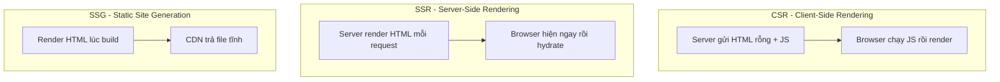
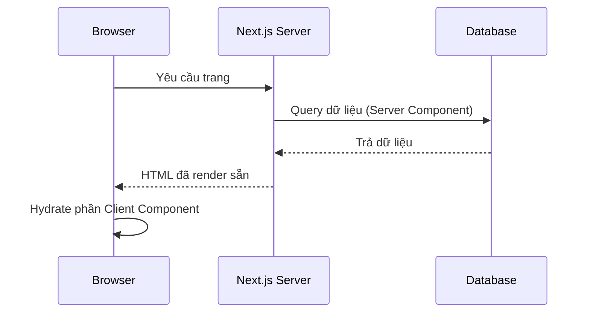

# React Frameworks

**React framework** (bộ khung dựng sẵn xây trên nền React) bổ sung những thứ React thuần không có sẵn như định tuyến trang (routing), kết xuất phía máy chủ và cấu trúc dự án theo quy ước. Nhờ đó người mới không phải tự lắp ghép nhiều công cụ rời rạc mà có ngay nền tảng đầy đủ để làm web hoàn chỉnh. Bài này giới thiệu các framework phổ biến như Next.js, Remix, Astro để bạn biết cách lựa chọn.

[](pathname:///img/react/frameworks.webp)

---

:::note[Ghi nhớ nhanh]

- ⭐ **React core chỉ là UI library, không phải framework** — framework thêm routing, SSR/SSG, Server Components, data fetching, build optimization, deployment.
- ⭐ **Next.js (App Router) là default** cho app cần routing/SSR/SEO/Server Components — hệ sinh thái lớn (Vercel), nhưng learning curve cao và có phần lock-in.
- **Remix / React Router v7** hợp form-heavy app với pattern loader/action + progressive enhancement (form chạy cả khi no-JS).
- **Astro** cho content site (blog, docs, marketing) — zero JS by default, island architecture, SEO/performance tối đa; không hợp app interactive nặng.
- **TanStack Start** mới, type-safe, đáng theo dõi (còn early stage); **Gatsby** đã lỗi thời, không khuyên dùng cho project mới. SPA đơn giản chỉ cần Vite + React Router, đừng over-engineer.

:::

---

## Mục lục

- [Tổng quan](#tổng-quan)
- [Next.js (khuyến nghị)](#nextjs-khuyến-nghị)
- [Remix / React Router v7](#remix--react-router-v7)
- [Astro](#astro)
- [TanStack Start](#tanstack-start)
- [Gatsby](#gatsby)
- [Cách chọn](#cách-chọn)
- [Câu hỏi phỏng vấn](#câu-hỏi-phỏng-vấn)

---

## Tổng quan

React core **không phải framework** — chỉ là UI library. Framework thêm:

- **Routing**.
- **Server-side rendering (SSR)**.
- **Static site generation (SSG)**.
- **Server Components** (React 19).
- **Data fetching** patterns.
- **Build optimization**.
- **Deployment** integration.

Điểm khác nhau cốt lõi giữa các framework nằm ở chiến lược render — so sánh CSR, SSR và SSG:



| Framework | Strength | Khuyến nghị | Use case |
|-----------|---------|-------------|----------|
| **Next.js** | All-in-one, ecosystem lớn | **Có** | SaaS, dashboard, blog, e-commerce |
| **Remix / RR v7** | Web standards, data loader | Có | Form-heavy app |
| **Astro** | Static + island | Có | Content site, blog, docs |
| **TanStack Start** | Type-safe, modern | Tracking | Project mới TS-heavy |
| **Gatsby** | Static, plugin-rich | Không | Maintain mode |

---

## Next.js (khuyến nghị)

[Next.js](https://nextjs.org) — framework full-stack React của Vercel,
**phổ biến nhất**.

```bash
npx create-next-app@latest my-app
```

Đặc điểm:

- **App Router** (mới) — Server Components, layout nested, streaming.
- **Pages Router** (legacy) — pattern getServerSideProps.
- **Server Actions** — form submit không API route.
- **Edge Runtime** — chạy Cloudflare-style edge.
- **Image Optimization** — `<Image>` với LCP optimization.
- **Font Optimization** — `next/font` zero CLS.
- **Turbopack** — bundler bằng Rust (bê đậu Webpack).

Structure App Router:

```
app/
├── layout.tsx       # root layout
├── page.tsx         # /
├── about/
│   └── page.tsx     # /about
├── blog/
│   ├── layout.tsx   # layout cho /blog/*
│   ├── page.tsx     # /blog
│   └── [slug]/
│       └── page.tsx # /blog/:slug
└── api/
    └── users/
        └── route.ts # API route
```

Server Component (mặc định):

```tsx
// app/users/page.tsx
async function UsersPage() {
  const users = await db.user.findMany(); // chạy trên server
  return (
    <ul>
      {users.map(u => <li key={u.id}>{u.name}</li>)}
    </ul>
  );
}
```

Với Server Component, dữ liệu được lấy ngay trên server trước khi trả HTML về cho browser:



:::info[Phân tích]

**Tại sao Next.js dominate?**

1. **Vercel backing** — đầu tư mạnh, ecosystem rộng (Vercel hosting,
   analytics, edge).
2. **React 19 first-class** — App Router là test bed của Server Components,
   Actions, Suspense.
3. **SEO + Performance built-in** — image, font, script optimization mặc định.
4. **Documentation** chất lượng cao.
5. **Adoption** — Linear, Vercel, Notion, GitHub, Twitch, TikTok đều dùng.

Trade-off:

- **Learning curve cao** — Server vs Client component, caching layers.
- **Vercel lock-in** một số feature (Edge Functions, ISR cache).
- **Build time** lớn với app to.
- **Bundle size** thường lớn hơn Vite SPA.

Nhưng nếu cần SSR/SEO/Server Components — Next.js là lựa chọn an toàn nhất.

:::

---

## Remix / React Router v7

[Remix](https://remix.run) đã merge thành **React Router v7** (2024).
Framework full-stack hoặc client-only.

```bash
npx create-remix@latest my-app
```

Đặc điểm:

- **Loader / Action** — data fetching gắn với route.
- **Nested routes + nested data** — load song song.
- **Form action native** — không cần JS để form work (progressive enhancement).
- **Web standards** — Request/Response, FormData, không React-specific.

```tsx
// app/routes/users.$id.tsx
import { useLoaderData, Form } from "react-router";

export async function loader({ params }) {
  return await db.user.findUnique({ where: { id: params.id } });
}

export async function action({ request }) {
  const formData = await request.formData();
  await db.user.update({ ... });
  return redirect(`/users/${params.id}`);
}

export default function UserPage() {
  const user = useLoaderData();
  return (
    <Form method="post">
      <input name="name" defaultValue={user.name} />
      <button type="submit">Save</button>
    </Form>
  );
}
```

Phù hợp:

- Form-heavy app (CRM, admin).
- Cần progressive enhancement.
- Team đã quen React Router.

---

## Astro

[Astro](https://astro.build) — **content-focused** framework, "island
architecture" — JS chỉ load cho component cần interactive.

```bash
npm create astro@latest my-site
```

```astro
---
// Astro component — chạy build time
const posts = await fetchPosts();
---

<Layout>
  <h1>Blog</h1>
  <ul>
    {posts.map(p => <li><a href={`/blog/${p.slug}`}>{p.title}</a></li>)}
  </ul>

  <!-- React component, chỉ hydrate khi cần -->
  <SearchBox client:visible />
</Astro>
```

Đặc điểm:

- **Zero JS by default** — HTML/CSS tĩnh, JS opt-in.
- **Multi-framework** — React, Vue, Svelte, Solid trong cùng project.
- **Markdown/MDX** first-class.
- **Image optimization**, sitemap, RSS built-in.

Phù hợp:

- Blog, docs, marketing site, portfolio.
- Performance critical (Lighthouse 100).
- SEO ưu tiên.

Không phù hợp:

- App interactive nặng (SaaS, dashboard).
- Real-time, WebSocket-heavy.

---

## TanStack Start

[TanStack Start](https://tanstack.com/start) — framework mới, type-safe,
file-based router (TanStack Router).

```bash
npm create @tanstack/start@latest my-app
```

Đặc điểm:

- **Type-safe end-to-end** (route, search params, loader).
- **Server functions** type-safe.
- **TanStack Query + Router** tích hợp deeply.
- **SSR + streaming**.

Vẫn early stage (alpha-beta 2025+). Đáng theo dõi nếu thích TanStack ecosystem.

---

## Gatsby

[Gatsby](https://www.gatsbyjs.com) — static site generator, plugin
ecosystem khổng lồ.

Năm 2026, **Gatsby đã giảm phổ biến mạnh**:

- Astro thay thế cho static site.
- Next.js thay thế cho app + static.
- Plugin ecosystem ít update.
- Netlify mua Gatsby → product roadmap mơ hồ.

→ **Không khuyên dùng** Gatsby cho project mới. Maintain dự án cũ thì OK.

---

## Cách chọn

```
Project type?

├─ Blog, docs, marketing?
│  └─ Astro (tĩnh, SEO max)
│
├─ Dashboard, SaaS, app interactive?
│  ├─ Cần SSR/Server Components? → Next.js
│  └─ SPA thuần? → Vite + React Router
│
├─ Form-heavy, multi-step workflow?
│  └─ Remix / React Router v7 (loader/action pattern)
│
├─ Project mới, TS-first, modern?
│  └─ TanStack Start (experimental, đầu tư cho 2026+)
│
└─ Existing Gatsby project?
   └─ Cân nhắc migrate sang Astro hoặc Next.js
```

:::tip[Mẹo]

**Quy tắc thực dụng 2026:**

- **Default**: Next.js (App Router) cho mọi React app cần routing/SSR.
- **Static content**: Astro.
- **SPA đơn giản**: Vite + React + React Router.
- **Experimental**: TanStack Start theo dõi cho 2027+.

Đừng over-engineer — SPA đơn giản không cần Next.js. Nhưng khi đã cần
SSR/SEO/Server Components → đi thẳng Next.js, không nhảy lib khác.

:::

---

## Câu hỏi phỏng vấn

Những câu thường gặp về chủ đề này. Tự trả lời trước, rồi bấm **Xem đáp án** để đối chiếu.

**1. React core khác một framework ở những điểm nào? Framework bổ sung thêm những gì?**

<details className="qa">
<summary>Xem đáp án</summary>

React core chỉ là một **UI library**: nó lo việc mô tả giao diện theo state và cập nhật DOM hiệu quả. Nó **không** trả lời các câu hỏi của một ứng dụng web hoàn chỉnh — URL nào render gì, data lấy ở đâu, build và deploy ra sao.

Framework dựng trên React bổ sung:

- **Routing** — ánh xạ URL sang component, layout lồng nhau, route động.
- **SSR / SSG** — render HTML trên server theo request, hoặc dựng sẵn lúc build.
- **Server Components** (React 19) — component chạy hẳn trên server.
- **Data fetching pattern** — `loader`/`action`, fetch trực tiếp trong Server Component, cùng cơ chế cache và revalidate.
- **Build optimization** — code splitting, tối ưu ảnh và font, bundler.
- **Deployment integration** — adapter cho các nền tảng hosting.

Hệ quả thực tế: với React thuần bạn phải tự lắp ghép và tự bảo trì từng mảnh; framework đưa ra **quy ước** để cả team làm giống nhau. Đổi lại là phải theo cách làm của framework và chịu một phần ràng buộc với nó.

</details>

**2. So sánh `CSR`, `SSR` và `SSG` về thời điểm render, tốc độ hiển thị lần đầu và khả năng SEO.**

<details className="qa">
<summary>Xem đáp án</summary>

| | CSR | SSR | SSG |
|---|---|---|---|
| Render ở đâu, khi nào | Trình duyệt, sau khi tải JS | Server, **mỗi request** | Lúc **build**, rồi phục vụ file tĩnh |
| HTML server gửi về | Gần như rỗng | HTML đã có nội dung | HTML đã có nội dung |
| Hiển thị lần đầu | Chậm nhất — phải tải và chạy JS xong mới có gì để xem | Nhanh, nhưng phụ thuộc thời gian server xử lý | Nhanh nhất — CDN trả file tĩnh |
| SEO | Yếu nhất, phụ thuộc bot có chạy JS hay không | Tốt | Tốt |
| Độ tươi của dữ liệu | Luôn mới (fetch lúc chạy) | Luôn mới theo từng request | Cũ tới lần build kế tiếp |
| Tải cho server | Rất nhẹ | Nặng nhất | Gần như không |

Cách chọn: nội dung ít đổi và giống nhau với mọi người (blog, docs, landing) → SSG. Nội dung phụ thuộc người dùng hoặc thay đổi liên tục (dashboard, giá, tồn kho) → SSR. Phần sau đăng nhập, tương tác nhiều, không cần SEO → CSR là đủ. Thực tế các framework cho **trộn cả ba trong cùng một app**, quyết định theo từng route.

</details>

**3. `ISR` (Incremental Static Regeneration) giải quyết bài toán nào mà `SSG` thuần không làm được?**

<details className="qa">
<summary>Xem đáp án</summary>

SSG thuần có hai điểm nghẽn:

- **Dữ liệu đóng băng tại thời điểm build** — muốn cập nhật một bài viết phải build lại và deploy lại toàn site.
- **Build không mở rộng được** — site 50.000 trang sản phẩm thì mỗi lần build mất hàng chục phút, và mọi thay đổi nhỏ đều trả giá đó.

**ISR** cho phép trang tĩnh được **tái sinh dần dần sau khi đã deploy**: mỗi trang có thời hạn "tươi"; hết hạn thì request tiếp theo vẫn được phục vụ bản cũ ngay lập tức, trong khi server dựng lại bản mới ở nền và thay vào cache. Ngoài ra có thể **render lần đầu theo yêu cầu** — trang chưa từng được build sẽ được dựng lúc có người truy cập rồi lưu lại, nên build ban đầu chỉ cần lo vài trang quan trọng.

Kết quả là cân bằng tốt: tốc độ và chi phí của tĩnh, độ tươi gần với SSR mà không phải render lại mỗi request. Đánh đổi: có một khoảng thời gian người dùng thấy nội dung cũ, và cơ chế cache này phụ thuộc khá nhiều vào hạ tầng nơi bạn deploy.

</details>

**4. Hydration là gì? 'Hydration mismatch' xảy ra khi nào và cách phòng tránh?**

<details className="qa">
<summary>Xem đáp án</summary>

**Hydration** là bước React ở phía trình duyệt "tiếp quản" phần HTML do server render sẵn: nó dựng lại cây component, gắn event handler và state vào đúng các DOM node đã có, thay vì vẽ lại từ đầu. Nhờ vậy người dùng thấy nội dung sớm (từ HTML), rồi trang trở nên tương tác được khi JS chạy xong.

**Hydration mismatch** xảy ra khi HTML mà client render ra **khác** với HTML server đã gửi. Nguyên nhân phổ biến:

- Dùng giá trị **không tất định** khi render: `Date.now()`, `new Date()`, `Math.random()`, `crypto.randomUUID()`.
- Đọc thứ **chỉ có ở trình duyệt** trong lúc render: `window`, `localStorage`, kích thước màn hình, theme sáng/tối.
- Nội dung phụ thuộc **locale/múi giờ** khác nhau giữa server và client.
- HTML **không hợp lệ** khiến trình duyệt tự sửa cấu trúc thẻ, ví dụ lồng `div` trong `p`.

Phòng tránh: đưa phần phụ thuộc trình duyệt vào `useEffect` để chỉ chạy sau khi hydrate; render giá trị mặc định ổn định cho lần đầu; truyền thời gian/ID từ server xuống thay vì sinh ở hai nơi; cố định locale và timezone khi format; và giữ markup hợp lệ.

</details>

**5. React Server Components khác `SSR` truyền thống ở đâu? RSC giảm JavaScript gửi xuống client bằng cách nào?**

<details className="qa">
<summary>Xem đáp án</summary>

| | SSR truyền thống | React Server Components |
|---|---|---|
| Đơn vị | Cả **trang** được render trên server | Từng **component** chạy trên server hay client |
| Sau khi HTML về | Toàn bộ cây component được hydrate ở client | Chỉ phần client component mới hydrate |
| JS gửi xuống | Gồm cả component và các thư viện chúng dùng | Component server **không** gửi code xuống |
| Truy cập tài nguyên server | Qua bước fetch data riêng rồi truyền props | Component đọc thẳng database, file, secret |

**Cách RSC giảm JavaScript:** component server được thực thi trên server và React gửi xuống **kết quả đã render** (một dạng mô tả UI được serialize), chứ không gửi mã nguồn của component đó. Mọi thư viện mà nó dùng — thư viện markdown, thư viện định dạng ngày tháng nặng nề, ORM — nằm lại trên server và **không vào bundle** của trình duyệt. Chỉ những component được đánh dấu là client mới đi kèm JS.

Hệ quả: bundle của một trang chủ yếu là nội dung tĩnh có thể gần bằng không, trong khi vẫn viết bằng React. Đổi lại, component server không có state, không dùng hook và không xử lý sự kiện.

</details>

**6. Chỉ thị `"use client"` đánh dấu điều gì? Ranh giới server/client được xác định như thế nào trong cây component?**

<details className="qa">
<summary>Xem đáp án</summary>

Trong App Router, component **mặc định là Server Component**. Đặt `"use client"` ở đầu file nghĩa là: từ đây trở đi là **client** — file này và mọi module nó import sẽ được đóng gói gửi xuống trình duyệt, hydrate và chạy ở đó.

Cách ranh giới hình thành:

- `"use client"` đánh dấu một **điểm vào** của vùng client, không phải chỉ một component. Mọi component được import **từ bên trong** vùng đó cũng thành client, kể cả khi bản thân chúng không có chỉ thị.
- Ngược lại, một client component **không thể import** server component để dùng như con trực tiếp. Cách hợp lệ là truyền server component xuống qua `children` hoặc prop — khi đó nó vẫn được render trên server rồi chèn vào chỗ trống.
- Dữ liệu truyền từ server xuống client phải **serialize được**: không truyền hàm, class instance hay giá trị không tuần tự hóa được.

Khi nào cần `"use client"`: có state, effect, event handler, dùng context, hoặc gọi API trình duyệt. Thực hành tốt là **đẩy ranh giới xuống càng sâu càng tốt** — đánh dấu đúng nút bấm hay widget tương tác, thay vì cả trang.

</details>

**7. So sánh Pages Router và App Router của Next.js về routing, layout và cách fetch dữ liệu.**

<details className="qa">
<summary>Xem đáp án</summary>

| | Pages Router (cũ) | App Router (mới) |
|---|---|---|
| Khai báo route | Mỗi file trong `pages/` là một route | Thư mục trong `app/` với file quy ước `page.tsx`, `route.ts` |
| Layout | Một `_app.tsx` toàn cục, layout lồng nhau phải tự dựng | `layout.tsx` theo từng cấp thư mục, **lồng nhau tự nhiên**, giữ state khi điều hướng trong cùng layout |
| Trạng thái đặc biệt | Tự xử lý loading/error | File quy ước cho loading và error ở từng cấp |
| Loại component | Tất cả là client component | Mặc định **Server Component**, chọn client bằng `"use client"` |
| Fetch dữ liệu | Hàm chuyên dụng ở cấp trang (kiểu `getServerSideProps`, `getStaticProps`) | `await` thẳng trong Server Component, ở **bất kỳ cấp nào** của cây |
| Ghi dữ liệu | Gọi API route | Server Actions, gọi được từ form |
| Streaming | Hạn chế | Hỗ trợ với `Suspense` |

Khác biệt tư duy quan trọng nhất: Pages Router buộc fetch ở **cấp trang** rồi truyền props xuống; App Router cho mỗi component **tự lấy data của mình**, ghép với layout lồng nhau và streaming. Đổi lại là phải nắm mô hình server/client và các tầng cache — lý do App Router có learning curve cao hơn hẳn.

</details>

**8. Streaming SSR kết hợp `Suspense` boundary mang lại lợi ích gì cho chỉ số TTFB và LCP?**

<details className="qa">
<summary>Xem đáp án</summary>

SSR truyền thống phải chờ **toàn bộ** dữ liệu của trang xong mới gửi được byte HTML đầu tiên — phần chậm nhất quyết định tất cả. **Streaming SSR** cho phép server gửi HTML **theo từng mảnh**: phần vỏ trang (header, nav, layout) đi ngay, các vùng bọc trong `Suspense` gửi fallback trước, và khi dữ liệu của vùng đó sẵn sàng thì nội dung thật được đẩy xuống và thay vào chỗ fallback.

Tác động lên chỉ số:

- **TTFB giảm rõ rệt** — byte đầu tiên không còn bị khóa bởi truy vấn chậm nhất; server phản hồi gần như ngay.
- **LCP thường cải thiện** nếu phần tử lớn nhất (ảnh hero, tiêu đề chính) nằm **ngoài** vùng chờ: nó nằm trong mảnh đầu tiên nên hiển thị sớm. Ngược lại, nếu bọc chính phần đó trong `Suspense`, LCP có thể **xấu đi** vì người dùng thấy skeleton trước.
- Trình duyệt cũng bắt đầu tải CSS/JS sớm hơn nhờ nhận HTML sớm.

Nguyên tắc đặt boundary: giữ nội dung quan trọng nhất ở luồng đầu, chỉ bọc những khối thật sự chậm và phụ (gợi ý, bình luận, bảng thống kê), và cho fallback kích thước ổn định để tránh layout nhảy.

</details>

**9. Pattern `loader`/`action` của Remix / React Router v7 khác `getServerSideProps` ở điểm nào?**

<details className="qa">
<summary>Xem đáp án</summary>

Điểm khác cốt lõi là **cấp độ gắn kết** và **chiều ghi dữ liệu**.

- **Gắn với route lồng nhau, không phải trang.** `getServerSideProps` chỉ tồn tại ở cấp trang; mỗi route con trong Remix có `loader` riêng, và các loader của những route đang hiển thị **chạy song song**. Điều hướng sang route con chỉ nạp lại data của phần thay đổi, không nạp lại cả trang.
- **Có chiều ghi.** `getServerSideProps` chỉ đọc; muốn ghi phải tự viết API route và tự fetch. Remix có `action` — nơi xử lý POST/PUT/DELETE ngay tại route, và sau khi action chạy xong các loader liên quan **tự revalidate**, nên UI luôn khớp dữ liệu mới mà không cần quản lý cache thủ công.
- **Dựa trên web standard.** Loader/action làm việc trực tiếp với `Request`, `Response`, `FormData`, `redirect` — kiến thức mang đi được, không phụ thuộc React.
- **Gắn với form HTML thật**, nên có sẵn progressive enhancement.

Nói ngắn: `getServerSideProps` là một hook lấy props cho trang; `loader`/`action` là một **mô hình dữ liệu đầy đủ** cho route, gồm cả đọc lẫn ghi và cơ chế làm mới.

</details>

**10. Progressive enhancement là gì? Vì sao form trong Remix vẫn hoạt động khi trình duyệt tắt JavaScript?**

<details className="qa">
<summary>Xem đáp án</summary>

**Progressive enhancement** là nguyên tắc: xây nền bằng HTML/CSS để chức năng cơ bản **luôn dùng được**, rồi JavaScript chỉ *nâng cấp* trải nghiệm. Trang không được sống chết phụ thuộc JS — vì JS có thể chưa tải xong, lỗi mạng, bị chặn, hoặc thiết bị quá yếu.

**Vì sao form Remix vẫn chạy khi tắt JS:** component `Form` render ra đúng một thẻ `form` HTML thật với `method="post"`, trỏ tới chính route đó.

- **Không có JS:** trình duyệt làm việc nó vốn biết làm — gửi POST kèm `FormData` lên server, `action` của route xử lý rồi trả về redirect, trình duyệt tải trang mới. Toàn bộ luồng hoàn tất, chỉ là có một lần tải lại trang.
- **Có JS:** Remix chặn lần submit đó, gửi request bằng fetch, chạy `action`, revalidate loader và cập nhật UI tại chỗ — mượt hơn, kèm trạng thái đang gửi và optimistic UI.

Điểm hay là **cùng một đoạn code** phục vụ cả hai kịch bản, nhờ dựa trên chuẩn web thay vì tự phát minh cơ chế submit riêng. So sánh: form chỉ có `onSubmit` gọi fetch thì không có JS là bấm nút chẳng có gì xảy ra.

</details>

**11. Island architecture của Astro hoạt động ra sao? Phân biệt `client:load`, `client:idle` và `client:visible`.**

<details className="qa">
<summary>Xem đáp án</summary>

Astro render toàn bộ trang thành **HTML tĩnh, không kèm JS**. Những component thật sự cần tương tác được đánh dấu riêng và trở thành các **"đảo"** — mỗi đảo là một vùng nhỏ được hydrate độc lập, có bundle JS riêng, nằm giữa "biển" HTML tĩnh. Khác với SPA nơi cả trang là một ứng dụng phải hydrate toàn bộ, ở đây một trang blog có thể chỉ tải JS cho đúng ô tìm kiếm.

Các chỉ thị quyết định **khi nào** một đảo được hydrate:

- **`client:load`** — hydrate ngay khi trang tải xong. Dành cho thứ phải tương tác được lập tức và nằm ngay đầu trang, ví dụ nút menu chính.
- **`client:idle`** — chờ trình duyệt rảnh rồi mới hydrate. Hợp với thứ quan trọng vừa phải, không cần ngay trong mili giây đầu.
- **`client:visible`** — chỉ hydrate khi component **cuộn vào tầm nhìn**. Tốt nhất cho widget nằm dưới màn hình đầu: carousel, khối bình luận, biểu đồ. Nếu người dùng không cuộn tới, JS đó không bao giờ được tải.

Ngoài ra còn các chỉ thị theo media query hoặc chỉ render phía client. Mặc định không có chỉ thị nào thì component là **tĩnh hoàn toàn**.

</details>

**12. Khi nào Astro KHÔNG phải lựa chọn tốt? Cho ví dụ loại ứng dụng cụ thể.**

<details className="qa">
<summary>Xem đáp án</summary>

Astro tối ưu cho trang **thiên về nội dung**: mỗi trang chủ yếu là HTML tĩnh, tương tác chỉ rải rác thành vài đảo. Thế mạnh đó trở thành điểm yếu khi ứng dụng gần như **toàn bộ là tương tác**.

Không hợp khi:

- **App interactive nặng** — dashboard quản trị, SaaS, công cụ chỉnh sửa (thiết kế, bảng tính, editor). Khi hầu hết màn hình phải hydrate thì lợi thế "zero JS by default" biến mất, còn mô hình đảo lại gây vướng.
- **Nhiều trạng thái chia sẻ giữa các phần trang** — các đảo bị cô lập với nhau, muốn dùng chung store phải dựng thêm lớp cầu nối; trong SPA việc này là mặc định.
- **Real-time / WebSocket nặng** — chat, bảng giá chứng khoán, dashboard theo dõi trực tiếp, cộng tác nhiều người.
- **Điều hướng kiểu ứng dụng**, giữ nguyên state khi chuyển màn hình, luồng nhiều bước có state phức tạp.
- **Phần sau đăng nhập**, cá nhân hóa sâu, nơi SEO chẳng có ý nghĩa.

Với các trường hợp trên: Next.js (cần SSR/SEO) hoặc Vite + React Router (SPA thuần) phù hợp hơn. Nhiều team dùng **cả hai**: Astro cho marketing site và docs, Next.js hoặc SPA cho phần ứng dụng.

</details>

**13. Vì sao một SPA thuần (chỉ CSR) thường gặp khó khăn về SEO và chia sẻ link trên mạng xã hội?**

<details className="qa">
<summary>Xem đáp án</summary>

SPA thuần trả về một file HTML gần như **rỗng** — chỉ có một thẻ gốc và thẻ script. Nội dung chỉ xuất hiện sau khi trình duyệt tải bundle, chạy JS và fetch dữ liệu.

**Về SEO:** công cụ tìm kiếm phải chạy JS mới thấy nội dung. Một số bot làm được nhưng đưa vào hàng đợi render riêng, nên nội dung được index **chậm** và không chắc chắn; bot khác thì hầu như không chạy JS. Thêm nữa, thẻ `title` và `meta description` thường bị đặt bằng JS **sau** khi trang load, nên thứ bot thấy ban đầu giống hệt nhau ở mọi URL. Trang load chậm hay lỗi một request API là bot thấy trang trống.

**Về chia sẻ link:** đây là vấn đề nặng hơn. Bot preview của các nền tảng mạng xã hội và ứng dụng nhắn tin **chỉ đọc HTML thô, không chạy JS**. Thẻ Open Graph và Twitter Card đặt động bằng JS sẽ không được nhìn thấy, nên link chia sẻ ra hiện tiêu đề chung chung, không ảnh, không mô tả — dù trang thực tế rất đẹp.

Cách giải: SSR/SSG cho những route cần được tìm thấy và chia sẻ (Next.js, Astro, Remix), hoặc tối thiểu là prerender các trang công khai.

</details>

**14. Tiêu chí nào giúp bạn quyết định giữa `Vite + React Router` và `Next.js` cho một dự án mới?**

<details className="qa">
<summary>Xem đáp án</summary>

Câu hỏi quyết định đầu tiên: **có cần server render không?**

Chọn **Next.js** khi:

- Cần **SEO** hoặc link chia sẻ có preview đẹp — trang công khai, marketing, blog, sản phẩm.
- Muốn dùng **Server Components / Server Actions**, giảm JS gửi xuống client.
- Cần một **backend nhẹ đi kèm** (API route) mà không muốn dựng service riêng.
- Nội dung cần SSG/ISR, tối ưu ảnh và font sẵn có.
- Team đủ người để hấp thụ learning curve của ranh giới server/client và các tầng cache.

Chọn **Vite + React Router** khi:

- App **sau đăng nhập**, nội bộ, dashboard — SEO không có ý nghĩa.
- Đã có **backend riêng** và frontend chỉ cần là client.
- Ưu tiên **đơn giản và tốc độ dev**: cấu hình ít, dev server rất nhanh, deploy chỉ là file tĩnh lên CDN.
- Muốn tránh ràng buộc với một nền tảng hosting cụ thể.
- Ứng dụng có thể đóng gói thành desktop/mobile hoặc nhúng vào nơi khác.

Lời khuyên trong bài rất thẳng: **đừng over-engineer** — SPA đơn giản không cần Next.js. Nhưng khi đã xác định cần SSR/SEO thì đi thẳng Next.js, đừng chắp vá prerender vào SPA.

</details>

**15. Vendor lock-in với Next.js/Vercel là rủi ro như thế nào và có thể giảm thiểu bằng cách nào?**

<details className="qa">
<summary>Xem đáp án</summary>

Rủi ro nằm ở chỗ một số khả năng của Next.js **chạy trọn vẹn nhất trên Vercel**: cơ chế ISR và cache trên biên, Edge Functions, tối ưu ảnh, analytics. Tự host được, nhưng phải tự dựng lớp hạ tầng tương đương và không phải tính năng nào cũng ngang bằng. Hệ quả có thể là chi phí tăng nhanh khi traffic lớn, và chuyển nhà cung cấp trở thành một dự án chứ không phải một thao tác.

Cách giảm thiểu:

- **Tách logic nghiệp vụ khỏi framework** — đặt trong module thuần TypeScript, để route chỉ là lớp mỏng gọi xuống. Đây là biện pháp hiệu quả nhất.
- **Dùng tính năng chuẩn trước**: `fetch`, `Request`/`Response`, Node runtime thay vì API riêng của nền tảng khi không thật cần.
- **Thử self-host sớm** (container Node) ngay từ đầu dự án, để biết cái gì gãy khi rời nền tảng, thay vì phát hiện lúc đã muộn.
- Với thứ dễ khóa chặt — tối ưu ảnh, cache trên biên, cron — **đặt sau một lớp abstraction mỏng** để thay thế được.
- Đánh giá tỉnh táo: lock-in luôn tồn tại ở mọi lựa chọn hạ tầng. Câu hỏi đúng không phải "có lock-in không" mà là **"chi phí rời đi là bao nhiêu, và ta đổi lại được gì"**.

</details>

**16. So sánh Edge runtime và Node runtime: giới hạn API, độ trễ và trường hợp sử dụng phù hợp.**

<details className="qa">
<summary>Xem đáp án</summary>

| | Edge runtime | Node runtime |
|---|---|---|
| Chạy ở đâu | Nhiều điểm hiện diện gần người dùng trên toàn cầu | Một (hoặc vài) vùng máy chủ cố định |
| Môi trường | Dựa trên Web API, không phải Node đầy đủ | Node.js đầy đủ |
| API khả dụng | `fetch`, `Request`/`Response`, Web Crypto; **không có** phần lớn module Node như `fs`, nhiều thư viện native/driver DB không chạy | Toàn bộ hệ sinh thái npm, driver database, xử lý file |
| Khởi động | Rất nhanh, gần như không có cold start | Có cold start ở mô hình serverless |
| Giới hạn | Bộ nhớ và thời gian chạy chặt hơn, kích thước bundle nhỏ | Thoải mái hơn nhiều |

**Về độ trễ — điểm dễ hiểu sai:** edge chỉ nhanh khi công việc **không cần về gốc**. Nếu hàm edge ở Singapore vẫn phải query database đặt ở Mỹ, tổng độ trễ có thể **tệ hơn** chạy Node ngay cạnh database. Edge thắng khi dữ liệu cũng ở gần hoặc không cần dữ liệu.

**Hợp với edge:** middleware xác thực, A/B test, redirect theo địa lý, cá nhân hóa nhẹ, chặn bot, đọc dữ liệu từ store phân tán trên biên.

**Hợp với Node:** truy vấn database, xử lý file và ảnh, tích hợp SDK nặng, tác vụ chạy lâu, bất cứ thứ gì cần thư viện Node.

</details>

**17. `TanStack Start` có gì khác biệt so với Next.js? Vì sao nó vẫn được xem là early stage?**

<details className="qa">
<summary>Xem đáp án</summary>

Điểm khác biệt chính là đặt **type-safety làm trung tâm**, dựa trên TanStack Router:

- **Route type-safe end-to-end** — đường dẫn, tham số động và cả **search params** đều có kiểu; đổi route là nơi nào link sai sẽ báo lỗi ngay lúc compile. Next.js chủ yếu làm việc với route dưới dạng chuỗi.
- **Search params là công dân hạng nhất** — validate, parse và đồng bộ với state, thay vì tự xử lý chuỗi query.
- **Server function type-safe**, loader gắn với route.
- **Tích hợp sâu với TanStack Query** — router và lớp cache dữ liệu thiết kế để làm việc cùng nhau, thay vì ghép hai thư viện rời.
- Hỗ trợ SSR và streaming, nhưng mô hình đơn giản hơn hệ thống cache nhiều tầng của Next.js.

**Vì sao còn early stage:** dự án mới, API còn thay đổi giữa các phiên bản, hệ sinh thái và lượng tài liệu/ví dụ/câu trả lời trên mạng nhỏ hơn Next.js rất nhiều, ít trường hợp chạy production quy mô lớn để tham chiếu, và tuyển người quen thuộc cũng khó hơn. Tài liệu bài này xếp nó ở mức **đáng theo dõi** — hợp cho dự án cá nhân hoặc team ưa TanStack, chưa phải lựa chọn an toàn cho hệ thống quan trọng.

</details>

**18. Vì sao Gatsby không còn được khuyến nghị cho dự án mới, dù trước đây rất phổ biến?**

<details className="qa">
<summary>Xem đáp án</summary>

Gatsby từng là lựa chọn mặc định cho static site nhờ hệ sinh thái plugin khổng lồ và lớp GraphQL gom mọi nguồn dữ liệu. Nhưng vị trí đó đã bị xói mòn từ cả hai phía:

- **Astro thay thế ở mảng static** — nhẹ hơn, zero JS by default, hỗ trợ Markdown/MDX rất tốt, không bắt phải học lớp GraphQL chỉ để lấy vài file markdown.
- **Next.js thay thế ở mảng "app kèm static"** — SSG, ISR, SSR và Server Components trong một framework, phù hợp cả site nội dung lẫn ứng dụng.
- **Chi phí học và vận hành cao**: bắt buộc đi qua data layer GraphQL kể cả cho nhu cầu đơn giản; build chậm dần khi site lớn.
- **Hệ sinh thái chững lại** — nhiều plugin ít được cập nhật, dễ vướng khi nâng version.
- **Tương lai sản phẩm không rõ ràng** sau khi Netlify mua lại, roadmap mờ nhạt.

Khuyến nghị thực dụng: **không chọn Gatsby cho dự án mới**. Dự án Gatsby đang chạy ổn thì vẫn maintain được, nhưng nếu phải làm lớn hoặc nâng cấp nặng, nên cân nhắc migrate sang Astro (site nội dung) hoặc Next.js (có phần ứng dụng).

</details>

**19. Bạn đang có SPA Vite chạy tốt nhưng team muốn chuyển sang Next.js vì SEO. Bạn đánh giá và lên kế hoạch migrate ra sao?**

<details className="qa">
<summary>Xem đáp án</summary>

**Bước 0 — chất vấn nhu cầu.** SEO cần cho **route nào**? Nếu chỉ là landing page, blog và vài trang sản phẩm, migrate cả app là quá đắt. Phương án rẻ hơn: dựng site nội dung riêng bằng Astro/Next.js đặt ở cùng domain (ví dụ `/blog`, `/`), giữ nguyên SPA cho phần sau đăng nhập. Phần lớn trường hợp dừng ở đây là hợp lý.

**Nếu vẫn quyết migrate**, làm dần chứ không viết lại:

1. **Đo trước** — ghi lại chỉ số hiện tại (LCP, TTFB, trang được index, thứ hạng) để sau này chứng minh được kết quả.
2. **Kiểm kê rủi ro** — code phụ thuộc `window`/`localStorage` lúc render, thư viện chỉ chạy ở client, cách xử lý auth token, CSS-in-JS không hỗ trợ RSC.
3. **Dựng bộ khung Next.js** và chuyển **các trang công khai trước** (landing, blog, chi tiết sản phẩm) sang SSR/SSG kèm metadata và Open Graph đầy đủ — đây là phần mang lại toàn bộ giá trị SEO.
4. **Chạy song song** hai ứng dụng qua rewrite/proxy theo đường dẫn, chuyển từng nhóm route, giữ nguyên URL cũ; chỗ nào buộc đổi thì redirect 301.
5. Phần app phía sau đăng nhập chuyển sau cùng, chủ yếu là client component, tối ưu dần ranh giới server/client.
6. **Theo dõi sau mỗi đợt** — chỉ số web, lỗi hydration, sitemap, Search Console.

Quan trọng: nêu rõ chi phí (learning curve, thời gian, rủi ro regression) để quyết định dựa trên đánh đổi, không dựa trên xu hướng.

</details>
