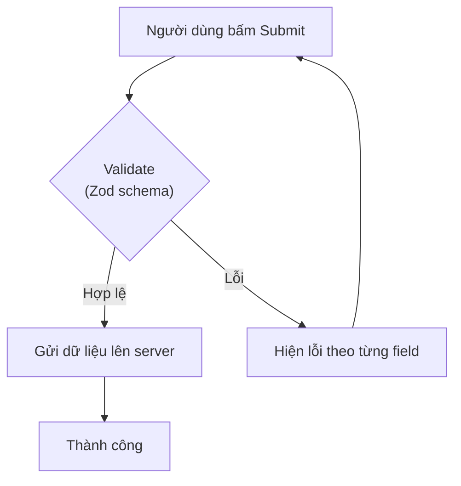
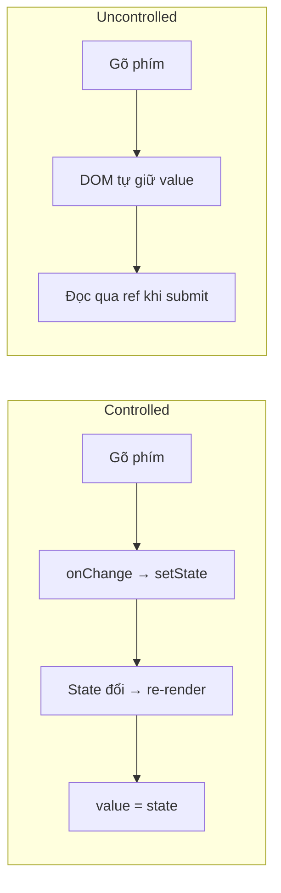

# Forms trong React

**Form** (biểu mẫu để người dùng nhập liệu, như đăng nhập hay đăng ký) là phần quan trọng của hầu hết ứng dụng web. Trong React, bạn cần quản lý giá trị các ô nhập, xử lý khi gửi và **validation** (kiểm tra dữ liệu hợp lệ trước khi gửi đi). Bài này giới thiệu các cách làm form từ cơ bản (controlled/uncontrolled) đến các thư viện mạnh như React Hook Form, cùng cách kiểm tra dữ liệu với Zod.

---

:::note[Ghi nhớ nhanh]

- ⭐ **Tự quản mỗi field bằng `useState` rất nhanh rối** — mỗi lần gõ re-render toàn form (form lớn chậm), validate/lỗi phải tự viết cho từng field.
- ⭐ **`react-hook-form` (RHF) là lựa chọn tốt nhất 2026** — dùng uncontrolled + ref nên ít re-render, form 50+ field vẫn smooth, bundle nhỏ (~9KB), TypeScript tốt.
- **Controlled** (React giữ state qua `value`/`onChange`) dễ validate khi gõ nhưng chậm form lớn; **Uncontrolled** (DOM giữ state, đọc qua ref) nhanh hơn — RHF theo hướng uncontrolled.
- **RHF + Zod là pattern chuẩn** — `zodResolver` + `z.infer` cho một schema vừa validate vừa suy ra type (single source of truth). **Formik** đã giảm phổ biến, không khuyến nghị cho project mới.
- **React 19 Server Actions** (Next.js/Remix) cho form không cần API route + progressive enhancement (`useFormStatus`, `useActionState`); kết hợp validate cả client (RHF) lẫn server (Zod) theo "defense in depth".

:::

---

## Mục lục

- [Vì sao cần thư viện form?](#vì-sao-cần-thư-viện-form)
- [Controlled vs Uncontrolled](#controlled-vs-uncontrolled)
- [React Hook Form (khuyến nghị)](#react-hook-form-khuyến-nghị)
- [Formik](#formik)
- [TanStack Form](#tanstack-form)
- [React 19 Actions](#react-19-actions)
- [Validation với Zod](#validation-với-zod)
- [Câu hỏi phỏng vấn](#câu-hỏi-phỏng-vấn)

---

## Vì sao cần thư viện form?

Với form phức tạp, tự quản mọi thứ bằng `useState` cho từng field rất nhanh rối.

**Vấn đề:**

```jsx
function SignupForm() {
  // Mỗi field một state riêng
  const [email, setEmail] = useState("");
  const [password, setPassword] = useState("");
  const [confirm, setConfirm] = useState("");
  // Lỗi cũng phải tự giữ state
  const [emailError, setEmailError] = useState("");
  const [passwordError, setPasswordError] = useState("");

  const handleSubmit = (e) => {
    e.preventDefault();
    // Validate thủ công từng field
    if (!email.includes("@")) setEmailError("Email không hợp lệ");
    if (password.length < 8) setPasswordError("Mật khẩu quá ngắn");
    if (password !== confirm) {
      /* ... thêm logic so khớp ... */
    }
    // ... còn submit, reset, hiện lỗi từng field
  };

  // Mỗi lần gõ → toàn bộ form re-render → form lớn chậm
  return (
    <form onSubmit={handleSubmit}>
      <input value={email} onChange={(e) => setEmail(e.target.value)} />
      {emailError && <p>{emailError}</p>}
      <input value={password} onChange={(e) => setPassword(e.target.value)} />
      {passwordError && <p>{passwordError}</p>}
      <input value={confirm} onChange={(e) => setConfirm(e.target.value)} />
    </form>
  );
}
```

**Giải pháp:**

```tsx
import { useForm } from "react-hook-form";
import { zodResolver } from "@hookform/resolvers/zod";
import { z } from "zod";

const schema = z
  .object({
    email: z.string().email("Email không hợp lệ"),
    password: z.string().min(8, "Mật khẩu tối thiểu 8 ký tự"),
    confirm: z.string(),
  })
  .refine((d) => d.password === d.confirm, {
    message: "Mật khẩu không khớp",
    path: ["confirm"],
  });

type FormData = z.infer<typeof schema>;

function SignupForm() {
  // Giá trị + validation + lỗi quản lý tập trung
  const {
    register,
    handleSubmit,
    formState: { errors },
  } = useForm<FormData>({ resolver: zodResolver(schema) });

  // RHF dùng uncontrolled + ref → ÍT re-render → form lớn vẫn nhanh
  return (
    <form onSubmit={handleSubmit(save)}>
      <input {...register("email")} />
      {errors.email && <p>{errors.email.message}</p>}
      <input type="password" {...register("password")} />
      {errors.password && <p>{errors.password.message}</p>}
      <input type="password" {...register("confirm")} />
      {errors.confirm && <p>{errors.confirm.message}</p>}
    </form>
  );
}
```

Dù làm form kiểu nào, luồng xử lý khi gửi đều theo trình tự submit → validate → gửi:



:::tip[Dùng thực tế]

- **Form đăng ký nhiều field + validate** — email, mật khẩu, xác nhận mật khẩu; thư viện gom giá trị, validation và lỗi vào một chỗ thay vì hàng chục `useState`.
- **Hiển thị lỗi theo từng field** — báo lỗi đúng ô đang sai (`errors.email`, `errors.password`) mà không tự viết logic state lỗi cho mỗi field.
- **Form động (thêm/bớt field)** — danh sách kỹ năng, danh sách sản phẩm; RHF có field array sẵn để thêm/xóa dòng dễ dàng.
- **Tích hợp validation schema** — dùng chung schema Zod/Yup cho cả client và server (defense in depth), một nguồn sự thật cho kiểu dữ liệu và luật kiểm tra.

:::

---

## Controlled vs Uncontrolled

**Controlled** — React giữ state, value qua state:

```jsx
function ControlledForm() {
  const [email, setEmail] = useState("");

  return (
    <input
      value={email}
      onChange={(e) => setEmail(e.target.value)}
    />
  );
}
```

**Uncontrolled** — DOM giữ state, đọc qua ref:

```jsx
function UncontrolledForm() {
  const emailRef = useRef(null);

  const submit = () => {
    console.log(emailRef.current.value);
  };

  return <input ref={emailRef} defaultValue="" />;
}
```

Hai cách quản lý giá trị input khác nhau ở chỗ ai giữ state:



| | Controlled | Uncontrolled |
|--|-----------|--------------|
| Validate khi gõ | Dễ | Khó |
| Disable submit | Dễ | Cần state |
| Performance form lớn | **Kém** (re-render mỗi gõ) | Tốt |
| Re-render | Mỗi keystroke | Không |

---

## React Hook Form (khuyến nghị)

[RHF](https://react-hook-form.com) — uncontrolled, performant, tốt nhất 2026.

```bash
npm install react-hook-form
```

```tsx
import { useForm } from "react-hook-form";

function ContactForm() {
  const {
    register,
    handleSubmit,
    formState: { errors, isSubmitting },
  } = useForm();

  const onSubmit = async (data) => {
    await api.send(data);
  };

  return (
    <form onSubmit={handleSubmit(onSubmit)}>
      <input
        {...register("email", {
          required: "Email bắt buộc",
          pattern: { value: /^[^@]+@[^@]+/, message: "Email không hợp lệ" },
        })}
      />
      {errors.email && <p>{errors.email.message}</p>}

      <textarea {...register("message", { required: true })} />
      {errors.message && <p>Message bắt buộc</p>}

      <button type="submit" disabled={isSubmitting}>
        {isSubmitting ? "Đang gửi..." : "Gửi"}
      </button>
    </form>
  );
}
```

:::info[Phân tích]

**RHF dùng uncontrolled + ref** thay vì state → component không re-render
mỗi keystroke → form lớn (50+ field) vẫn smooth.

Lợi ích:

- **Performance** — chỉ re-render khi error/value cụ thể đổi.
- **Validation built-in** + tích hợp Zod/Yup/Joi qua resolver.
- **TypeScript support** xuất sắc.
- **Bundle nhỏ** (~9KB).
- **Field array, nested form, watch, controlled wrapper** — đầy đủ.

Pattern phổ biến — RHF + Zod:

```tsx
import { useForm } from "react-hook-form";
import { zodResolver } from "@hookform/resolvers/zod";
import { z } from "zod";

const schema = z.object({
  email: z.string().email(),
  age: z.number().min(18),
});

type FormData = z.infer<typeof schema>;

function Form() {
  const { register, handleSubmit } = useForm<FormData>({
    resolver: zodResolver(schema),
  });

  return <form onSubmit={handleSubmit(save)}>...</form>;
}
```

Type FormData auto infer từ schema → single source of truth.

:::

---

## Formik

[Formik](https://formik.org) — truyền thống, **controlled-based**.

```jsx
import { Formik, Form, Field, ErrorMessage } from "formik";

<Formik
  initialValues={{ email: "" }}
  validate={(values) => {
    const errors = {};
    if (!values.email) errors.email = "Required";
    return errors;
  }}
  onSubmit={(values) => save(values)}
>
  <Form>
    <Field name="email" />
    <ErrorMessage name="email" />
    <button type="submit">Submit</button>
  </Form>
</Formik>
```

:::warning[Cần lưu ý]

**Formik đã giảm phổ biến** — RHF thắng vì performance:

- Controlled → re-render mỗi keystroke.
- API verbose hơn RHF.
- TypeScript support kém hơn.
- Maintain mode (commit ít).

→ **Không khuyến nghị** Formik cho project mới. Chỉ giữ cho codebase cũ.

:::

---

## TanStack Form

[TanStack Form](https://tanstack.com/form) — mới, type-safe, framework-agnostic
(React, Vue, Solid, Lit).

```tsx
import { useForm } from "@tanstack/react-form";

function Form() {
  const form = useForm({
    defaultValues: { email: "" },
    onSubmit: async ({ value }) => {
      await api.save(value);
    },
  });

  return (
    <form onSubmit={(e) => {
      e.preventDefault();
      form.handleSubmit();
    }}>
      <form.Field
        name="email"
        validators={{ onChange: ({ value }) => !value && "Required" }}
        children={(field) => (
          <>
            <input
              value={field.state.value}
              onChange={(e) => field.handleChange(e.target.value)}
            />
            {field.state.meta.errors && <p>{field.state.meta.errors[0]}</p>}
          </>
        )}
      />
    </form>
  );
}
```

Đặc điểm:

- Multi-framework.
- Type-safe end-to-end.
- Tích hợp tốt với TanStack Router (data fetching trong loader).

Đang early stage — cộng đồng chưa lớn bằng RHF.

---

## React 19 Actions

React 19 + Next.js App Router có **Server Actions** — form submit không
qua API route.

```tsx
async function createUser(formData: FormData) {
  "use server";
  await db.user.create({
    data: { name: formData.get("name") as string },
  });
}

function Form() {
  return (
    <form action={createUser}>
      <input name="name" />
      <SubmitButton />
    </form>
  );
}
```

**`useFormStatus`** — pending state tự động:

```jsx
"use client";
import { useFormStatus } from "react-dom";

function SubmitButton() {
  const { pending } = useFormStatus();
  return <button disabled={pending}>{pending ? "..." : "Save"}</button>;
}
```

**`useActionState`** — quản lý state + error:

```jsx
const [state, formAction] = useActionState(createUser, { error: null });

return (
  <form action={formAction}>
    <input name="name" />
    {state.error && <p>{state.error}</p>}
    <button>Save</button>
  </form>
);
```

:::info[Phân tích]

**Khi nào dùng React 19 Actions vs RHF?**

| | Server Actions | RHF |
|--|---------------|-----|
| Server framework | Next.js, Remix | Bất kỳ |
| Validation | Server-side (Zod) | Client-side |
| Progressive enhancement | **Có** (form work no-JS) | Không |
| Complex client form | Hạn chế | **Tốt** |
| Field array, dynamic | Cần custom | Built-in |

Kết hợp tốt:

```tsx
// Client validation với RHF + Zod
// Server validation lại với Zod khi submit (defense in depth)
const onSubmit = async (data) => {
  // RHF đã validate client
  const result = await serverAction(data); // server validate again
  if (result.error) {
    setError(result.error);
  }
};
```

Pattern này dùng nhiều trong Next.js App Router 2026.

:::

---

## Validation với Zod

```tsx
import { z } from "zod";

const userSchema = z.object({
  email: z.string().email(),
  age: z.number().int().min(18).max(120),
  password: z.string().min(8),
  confirmPassword: z.string(),
}).refine(data => data.password === data.confirmPassword, {
  message: "Password không khớp",
  path: ["confirmPassword"],
});

type UserInput = z.infer<typeof userSchema>;

// Validate
const result = userSchema.safeParse(input);
if (!result.success) {
  console.log(result.error.errors);
}
```

Zod thắng vì:

- **Type infer** từ schema → single source.
- **Composable** — schema kết hợp dễ.
- **Tích hợp** RHF, tRPC, Drizzle, Astro Content.

Alternatives: **Valibot** (nhẹ hơn, tree-shake tốt), **Yup** (cũ),
**Joi** (Node-focused).

:::tip[Mẹo]

**Stack form tiêu chuẩn 2026:**

- **RHF** + **Zod** + **shadcn/ui Form components** — cho client-side
  validation và UI.
- **Server Actions** + **Zod** — cho server-side validation và mutation.
- **Both** — pattern "defense in depth": validate cả 2 phía.

```tsx
import { useForm } from "react-hook-form";
import { zodResolver } from "@hookform/resolvers/zod";

const schema = z.object({ /* ... */ });
type FormData = z.infer<typeof schema>;

function Form() {
  const form = useForm<FormData>({ resolver: zodResolver(schema) });
  return (
    <form onSubmit={form.handleSubmit(serverAction)}>
      {/* shadcn form components */}
    </form>
  );
}
```

:::

---

## Câu hỏi phỏng vấn

Những câu thường gặp về chủ đề này. Tự trả lời trước, rồi đối chiếu lại với nội dung phía trên.

1. Phân biệt **controlled** và **uncontrolled** component. Đâu là 'single source of truth' trong mỗi trường hợp?
2. Vì sao controlled input gây re-render sau mỗi phím gõ? Ảnh hưởng gì tới form có 50+ field?
3. Khi nào nên chọn uncontrolled thay vì controlled? Cho ba tình huống cụ thể.
4. Vì sao React cảnh báo khi một input chuyển từ uncontrolled sang controlled? Nguyên nhân gốc là gì?
5. Phân biệt `value` và `defaultValue`, `checked` và `defaultChecked`.
6. `react-hook-form` giảm re-render bằng cách nào? Giải thích vai trò của `register` và `ref`.
7. Khi nào phải dùng `Controller` của RHF thay vì `register`? Ví dụ với component UI của thư viện ngoài.
8. `handleSubmit` của RHF thực hiện những việc gì trước khi gọi hàm submit của bạn?
9. So sánh các `mode` validation: `onSubmit`, `onBlur`, `onChange`, `all`. Đánh đổi giữa UX và hiệu năng ra sao?
10. Vì sao truy cập `formState` trong RHF được cài bằng `Proxy`? Việc đọc `isDirty` hay `isValid` ảnh hưởng gì tới re-render?
11. Phân biệt `watch`, `useWatch` và `getValues`. Cái nào gây re-render, cái nào không?
12. `useFieldArray` giải quyết bài toán gì? Vì sao cần `key` ổn định khi render danh sách field động?
13. `zodResolver` kết nối RHF với Zod như thế nào? Lỗi từ schema được ánh xạ về field ra sao?
14. Vì sao vẫn phải validate lại ở server dù client đã validate? Giải thích theo nguyên tắc 'defense in depth'.
15. Sau khi submit, server trả về lỗi nghiệp vụ cho một field cụ thể (ví dụ email đã tồn tại). Bạn hiển thị lỗi đó thế nào?
16. So sánh `Formik` và `react-hook-form`. Vì sao Formik giảm phổ biến trong các dự án mới?
17. `TanStack Form` định vị khác RHF ở điểm nào?
18. React 19 Server Actions thay đổi cách làm form ra sao? Vai trò của `useActionState` và `useFormStatus`?
19. Form nhiều bước (multi-step): bạn giữ dữ liệu giữa các bước và validate từng bước như thế nào?
20. Validate bất đồng bộ (ví dụ kiểm tra trùng email qua API) nên debounce ở đâu để tránh spam request?
21. Field so khớp lẫn nhau (`password` và `confirmPassword`) được validate thế nào trong Zod?
22. Accessibility cho form: `label`, `aria-invalid`, `aria-describedby` và focus vào field lỗi đầu tiên nên xử lý ra sao?
23. Upload file trong form React có làm controlled được không? Vì sao?
