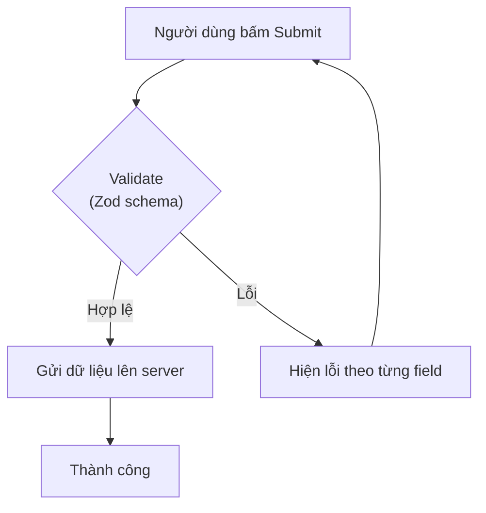
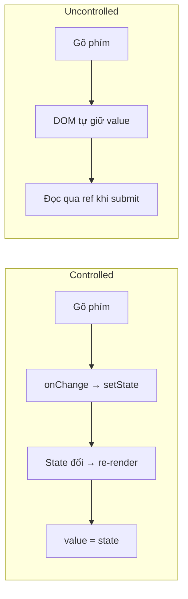

# Forms trong React

**Form** (biểu mẫu để người dùng nhập liệu, như đăng nhập hay đăng ký) là phần quan trọng của hầu hết ứng dụng web. Trong React, bạn cần quản lý giá trị các ô nhập, xử lý khi gửi và **validation** (kiểm tra dữ liệu hợp lệ trước khi gửi đi). Bài này giới thiệu các cách làm form từ cơ bản (controlled/uncontrolled) đến các thư viện mạnh như React Hook Form, cùng cách kiểm tra dữ liệu với Zod.

[](pathname:///img/react/forms.webp)

---

:::note[Ghi nhớ nhanh]

- ⭐ **Tự quản mỗi field bằng `useState` rất nhanh rối** — mỗi lần gõ re-render toàn form (form lớn chậm), validate/lỗi phải tự viết cho từng field.
- ⭐ **`react-hook-form` (RHF) là lựa chọn tốt nhất 2026** — dùng uncontrolled + ref nên ít re-render, form 50+ field vẫn smooth, bundle nhỏ (~9KB), TypeScript tốt.
- **Controlled** (React giữ state qua `value`/`onChange`) dễ validate khi gõ nhưng chậm form lớn; **Uncontrolled** (DOM giữ state, đọc qua ref) nhanh hơn — RHF theo hướng uncontrolled.
- **RHF + Zod là pattern chuẩn** — `zodResolver` + `z.infer` cho một schema vừa validate vừa suy ra type (single source of truth). **Formik** đã giảm phổ biến, không khuyến nghị cho project mới.
- **React 19 Server Actions** (Next.js/Remix) cho form không cần API route + progressive enhancement (`useFormStatus`, `useActionState`); kết hợp validate cả client (RHF) lẫn server (Zod) theo "defense in depth".

:::

---

## Mục lục

- [Vì sao cần thư viện form?](#vì-sao-cần-thư-viện-form)
- [Controlled vs Uncontrolled](#controlled-vs-uncontrolled)
- [React Hook Form (khuyến nghị)](#react-hook-form-khuyến-nghị)
- [Formik](#formik)
- [TanStack Form](#tanstack-form)
- [React 19 Actions](#react-19-actions)
- [Validation với Zod](#validation-với-zod)
- [Câu hỏi phỏng vấn](#câu-hỏi-phỏng-vấn)

---

## Vì sao cần thư viện form?

Với form phức tạp, tự quản mọi thứ bằng `useState` cho từng field rất nhanh rối.

**Vấn đề:**

```jsx
function SignupForm() {
  // Mỗi field một state riêng
  const [email, setEmail] = useState("");
  const [password, setPassword] = useState("");
  const [confirm, setConfirm] = useState("");
  // Lỗi cũng phải tự giữ state
  const [emailError, setEmailError] = useState("");
  const [passwordError, setPasswordError] = useState("");

  const handleSubmit = (e) => {
    e.preventDefault();
    // Validate thủ công từng field
    if (!email.includes("@")) setEmailError("Email không hợp lệ");
    if (password.length < 8) setPasswordError("Mật khẩu quá ngắn");
    if (password !== confirm) {
      /* ... thêm logic so khớp ... */
    }
    // ... còn submit, reset, hiện lỗi từng field
  };

  // Mỗi lần gõ → toàn bộ form re-render → form lớn chậm
  return (
    <form onSubmit={handleSubmit}>
      <input value={email} onChange={(e) => setEmail(e.target.value)} />
      {emailError && <p>{emailError}</p>}
      <input value={password} onChange={(e) => setPassword(e.target.value)} />
      {passwordError && <p>{passwordError}</p>}
      <input value={confirm} onChange={(e) => setConfirm(e.target.value)} />
    </form>
  );
}
```

**Giải pháp:**

```tsx
import { useForm } from "react-hook-form";
import { zodResolver } from "@hookform/resolvers/zod";
import { z } from "zod";

const schema = z
  .object({
    email: z.string().email("Email không hợp lệ"),
    password: z.string().min(8, "Mật khẩu tối thiểu 8 ký tự"),
    confirm: z.string(),
  })
  .refine((d) => d.password === d.confirm, {
    message: "Mật khẩu không khớp",
    path: ["confirm"],
  });

type FormData = z.infer<typeof schema>;

function SignupForm() {
  // Giá trị + validation + lỗi quản lý tập trung
  const {
    register,
    handleSubmit,
    formState: { errors },
  } = useForm<FormData>({ resolver: zodResolver(schema) });

  // RHF dùng uncontrolled + ref → ÍT re-render → form lớn vẫn nhanh
  return (
    <form onSubmit={handleSubmit(save)}>
      <input {...register("email")} />
      {errors.email && <p>{errors.email.message}</p>}
      <input type="password" {...register("password")} />
      {errors.password && <p>{errors.password.message}</p>}
      <input type="password" {...register("confirm")} />
      {errors.confirm && <p>{errors.confirm.message}</p>}
    </form>
  );
}
```

Dù làm form kiểu nào, luồng xử lý khi gửi đều theo trình tự submit → validate → gửi:



:::tip[Dùng thực tế]

- **Form đăng ký nhiều field + validate** — email, mật khẩu, xác nhận mật khẩu; thư viện gom giá trị, validation và lỗi vào một chỗ thay vì hàng chục `useState`.
- **Hiển thị lỗi theo từng field** — báo lỗi đúng ô đang sai (`errors.email`, `errors.password`) mà không tự viết logic state lỗi cho mỗi field.
- **Form động (thêm/bớt field)** — danh sách kỹ năng, danh sách sản phẩm; RHF có field array sẵn để thêm/xóa dòng dễ dàng.
- **Tích hợp validation schema** — dùng chung schema Zod/Yup cho cả client và server (defense in depth), một nguồn sự thật cho kiểu dữ liệu và luật kiểm tra.

:::

---

## Controlled vs Uncontrolled

**Controlled** — React giữ state, value qua state:

```jsx
function ControlledForm() {
  const [email, setEmail] = useState("");

  return (
    <input
      value={email}
      onChange={(e) => setEmail(e.target.value)}
    />
  );
}
```

**Uncontrolled** — DOM giữ state, đọc qua ref:

```jsx
function UncontrolledForm() {
  const emailRef = useRef(null);

  const submit = () => {
    console.log(emailRef.current.value);
  };

  return <input ref={emailRef} defaultValue="" />;
}
```

Hai cách quản lý giá trị input khác nhau ở chỗ ai giữ state:



| | Controlled | Uncontrolled |
|--|-----------|--------------|
| Validate khi gõ | Dễ | Khó |
| Disable submit | Dễ | Cần state |
| Performance form lớn | **Kém** (re-render mỗi gõ) | Tốt |
| Re-render | Mỗi keystroke | Không |

---

## React Hook Form (khuyến nghị)

[RHF](https://react-hook-form.com) — uncontrolled, performant, tốt nhất 2026.

```bash
npm install react-hook-form
```

```tsx
import { useForm } from "react-hook-form";

function ContactForm() {
  const {
    register,
    handleSubmit,
    formState: { errors, isSubmitting },
  } = useForm();

  const onSubmit = async (data) => {
    await api.send(data);
  };

  return (
    <form onSubmit={handleSubmit(onSubmit)}>
      <input
        {...register("email", {
          required: "Email bắt buộc",
          pattern: { value: /^[^@]+@[^@]+/, message: "Email không hợp lệ" },
        })}
      />
      {errors.email && <p>{errors.email.message}</p>}

      <textarea {...register("message", { required: true })} />
      {errors.message && <p>Message bắt buộc</p>}

      <button type="submit" disabled={isSubmitting}>
        {isSubmitting ? "Đang gửi..." : "Gửi"}
      </button>
    </form>
  );
}
```

:::info[Phân tích]

**RHF dùng uncontrolled + ref** thay vì state → component không re-render
mỗi keystroke → form lớn (50+ field) vẫn smooth.

Lợi ích:

- **Performance** — chỉ re-render khi error/value cụ thể đổi.
- **Validation built-in** + tích hợp Zod/Yup/Joi qua resolver.
- **TypeScript support** xuất sắc.
- **Bundle nhỏ** (~9KB).
- **Field array, nested form, watch, controlled wrapper** — đầy đủ.

Pattern phổ biến — RHF + Zod:

```tsx
import { useForm } from "react-hook-form";
import { zodResolver } from "@hookform/resolvers/zod";
import { z } from "zod";

const schema = z.object({
  email: z.string().email(),
  age: z.number().min(18),
});

type FormData = z.infer<typeof schema>;

function Form() {
  const { register, handleSubmit } = useForm<FormData>({
    resolver: zodResolver(schema),
  });

  return <form onSubmit={handleSubmit(save)}>...</form>;
}
```

Type FormData auto infer từ schema → single source of truth.

:::

---

## Formik

[Formik](https://formik.org) — truyền thống, **controlled-based**.

```jsx
import { Formik, Form, Field, ErrorMessage } from "formik";

<Formik
  initialValues={{ email: "" }}
  validate={(values) => {
    const errors = {};
    if (!values.email) errors.email = "Required";
    return errors;
  }}
  onSubmit={(values) => save(values)}
>
  <Form>
    <Field name="email" />
    <ErrorMessage name="email" />
    <button type="submit">Submit</button>
  </Form>
</Formik>
```

:::warning[Cần lưu ý]

**Formik đã giảm phổ biến** — RHF thắng vì performance:

- Controlled → re-render mỗi keystroke.
- API verbose hơn RHF.
- TypeScript support kém hơn.
- Maintain mode (commit ít).

→ **Không khuyến nghị** Formik cho project mới. Chỉ giữ cho codebase cũ.

:::

---

## TanStack Form

[TanStack Form](https://tanstack.com/form) — mới, type-safe, framework-agnostic
(React, Vue, Solid, Lit).

```tsx
import { useForm } from "@tanstack/react-form";

function Form() {
  const form = useForm({
    defaultValues: { email: "" },
    onSubmit: async ({ value }) => {
      await api.save(value);
    },
  });

  return (
    <form onSubmit={(e) => {
      e.preventDefault();
      form.handleSubmit();
    }}>
      <form.Field
        name="email"
        validators={{ onChange: ({ value }) => !value && "Required" }}
        children={(field) => (
          <>
            <input
              value={field.state.value}
              onChange={(e) => field.handleChange(e.target.value)}
            />
            {field.state.meta.errors && <p>{field.state.meta.errors[0]}</p>}
          </>
        )}
      />
    </form>
  );
}
```

Đặc điểm:

- Multi-framework.
- Type-safe end-to-end.
- Tích hợp tốt với TanStack Router (data fetching trong loader).

Đang early stage — cộng đồng chưa lớn bằng RHF.

---

## React 19 Actions

React 19 + Next.js App Router có **Server Actions** — form submit không
qua API route.

```tsx
async function createUser(formData: FormData) {
  "use server";
  await db.user.create({
    data: { name: formData.get("name") as string },
  });
}

function Form() {
  return (
    <form action={createUser}>
      <input name="name" />
      <SubmitButton />
    </form>
  );
}
```

**`useFormStatus`** — pending state tự động:

```jsx
"use client";
import { useFormStatus } from "react-dom";

function SubmitButton() {
  const { pending } = useFormStatus();
  return <button disabled={pending}>{pending ? "..." : "Save"}</button>;
}
```

**`useActionState`** — quản lý state + error:

```jsx
const [state, formAction] = useActionState(createUser, { error: null });

return (
  <form action={formAction}>
    <input name="name" />
    {state.error && <p>{state.error}</p>}
    <button>Save</button>
  </form>
);
```

:::info[Phân tích]

**Khi nào dùng React 19 Actions vs RHF?**

| | Server Actions | RHF |
|--|---------------|-----|
| Server framework | Next.js, Remix | Bất kỳ |
| Validation | Server-side (Zod) | Client-side |
| Progressive enhancement | **Có** (form work no-JS) | Không |
| Complex client form | Hạn chế | **Tốt** |
| Field array, dynamic | Cần custom | Built-in |

Kết hợp tốt:

```tsx
// Client validation với RHF + Zod
// Server validation lại với Zod khi submit (defense in depth)
const onSubmit = async (data) => {
  // RHF đã validate client
  const result = await serverAction(data); // server validate again
  if (result.error) {
    setError(result.error);
  }
};
```

Pattern này dùng nhiều trong Next.js App Router 2026.

:::

---

## Validation với Zod

```tsx
import { z } from "zod";

const userSchema = z.object({
  email: z.string().email(),
  age: z.number().int().min(18).max(120),
  password: z.string().min(8),
  confirmPassword: z.string(),
}).refine(data => data.password === data.confirmPassword, {
  message: "Password không khớp",
  path: ["confirmPassword"],
});

type UserInput = z.infer<typeof userSchema>;

// Validate
const result = userSchema.safeParse(input);
if (!result.success) {
  console.log(result.error.errors);
}
```

Zod thắng vì:

- **Type infer** từ schema → single source.
- **Composable** — schema kết hợp dễ.
- **Tích hợp** RHF, tRPC, Drizzle, Astro Content.

Alternatives: **Valibot** (nhẹ hơn, tree-shake tốt), **Yup** (cũ),
**Joi** (Node-focused).

:::tip[Mẹo]

**Stack form tiêu chuẩn 2026:**

- **RHF** + **Zod** + **shadcn/ui Form components** — cho client-side
  validation và UI.
- **Server Actions** + **Zod** — cho server-side validation và mutation.
- **Both** — pattern "defense in depth": validate cả 2 phía.

```tsx
import { useForm } from "react-hook-form";
import { zodResolver } from "@hookform/resolvers/zod";

const schema = z.object({ /* ... */ });
type FormData = z.infer<typeof schema>;

function Form() {
  const form = useForm<FormData>({ resolver: zodResolver(schema) });
  return (
    <form onSubmit={form.handleSubmit(serverAction)}>
      {/* shadcn form components */}
    </form>
  );
}
```

:::

---

## Câu hỏi phỏng vấn

Những câu thường gặp về chủ đề này. Tự trả lời trước, rồi bấm **Xem đáp án** để đối chiếu.

**1. Phân biệt controlled và uncontrolled component. Đâu là 'single source of truth' trong mỗi trường hợp?**

<details className="qa">
<summary>Xem đáp án</summary>

- **Controlled**: React giữ giá trị trong state, truyền xuống qua `value` và cập nhật qua `onChange`. **Nguồn sự thật là React state** — DOM chỉ phản chiếu lại state.
- **Uncontrolled**: DOM tự giữ giá trị, React chỉ đặt giá trị khởi tạo bằng `defaultValue` và đọc lại qua `ref` khi cần. **Nguồn sự thật là chính DOM node**.

```jsx
// Controlled — state là nguồn sự thật
<input value={email} onChange={(e) => setEmail(e.target.value)} />

// Uncontrolled — DOM là nguồn sự thật
<input ref={emailRef} defaultValue="" />
```

| | Controlled | Uncontrolled |
|--|---|---|
| Validate khi gõ | Dễ | Khó |
| Disable nút submit theo giá trị | Dễ | Cần thêm state |
| Re-render | Mỗi lần gõ phím | Không |
| Form lớn | Chậm | Nhanh |

Thực tế: form nhỏ cần phản hồi tức thời thì controlled tiện; form lớn thì uncontrolled thắng về hiệu năng — và đó chính là hướng `react-hook-form` chọn.

</details>

**2. Vì sao controlled input gây re-render sau mỗi phím gõ? Ảnh hưởng gì tới form có 50+ field?**

<details className="qa">
<summary>Xem đáp án</summary>

Vì vòng lặp của controlled input là: gõ một ký tự → `onChange` chạy → `setState` → state đổi → **component chứa state re-render** → React tính lại JSX và gán `value` mới cho input. Mỗi ký tự là một chu kỳ như vậy. Nếu state nằm ở component form, thì re-render đó là **cả form**, không chỉ ô đang gõ.

Với form 50+ field:

- Mỗi phím gõ khiến React dựng lại 50+ element, so sánh cây và chạy lại mọi tính toán trong thân component.
- Component con không được memo hóa cũng render theo, kể cả những ô hoàn toàn không liên quan.
- Nếu trong form còn có validate toàn bộ, tính toán dẫn xuất, hoặc component nặng (select tìm kiếm, date picker, editor) thì chi phí nhân lên.
- Hệ quả người dùng cảm nhận được: **gõ bị trễ**, ký tự hiện chậm hơn tay — lỗi rất khó chịu và khó tối ưu về sau.

Cách giảm nhẹ: tách state xuống từng field component, memo hóa, hoặc debounce. Nhưng cách gọn nhất là dùng RHF theo hướng uncontrolled — giá trị nằm ở DOM nên gõ không kích hoạt re-render.

</details>

**3. Khi nào nên chọn uncontrolled thay vì controlled? Cho ba tình huống cụ thể.**

<details className="qa">
<summary>Xem đáp án</summary>

Nguyên tắc: chọn uncontrolled khi bạn **chỉ cần giá trị lúc submit**, không cần phản ứng theo từng phím gõ.

Ba tình huống cụ thể:

1. **Form lớn, nhiều field** — trang hồ sơ, form khai báo, đơn hàng với 30-50 ô. Không cần theo dõi từng ký tự, chỉ cần dữ liệu khi bấm "Lưu". Uncontrolled giữ cho việc gõ luôn mượt.
2. **Input file** — `<input type="file">` **bắt buộc** là uncontrolled, vì giá trị của nó do trình duyệt quản lý và code không được phép gán (lý do bảo mật). Luôn đọc qua `ref` hoặc từ `event`.
3. **Form đơn giản chỉ có submit** — ô tìm kiếm gửi khi nhấn Enter, form liên hệ, form đăng nhập gọn. Dựng ba `useState` cho một form ba ô là thừa; đọc qua `ref` hoặc `FormData` của thẻ form là đủ.

Thêm một trường hợp hay gặp: **tích hợp thư viện bên ngoài** tự quản lý DOM của nó (một số editor, mask input) — để nó tự giữ giá trị rồi đọc ra khi cần thường đơn giản hơn ép vào mô hình controlled.

Ngược lại, vẫn nên controlled khi cần validate ngay lúc gõ, đồng bộ hai field với nhau, format khi nhập, hoặc bật/tắt nút theo giá trị hiện tại.

</details>

**4. Vì sao React cảnh báo khi một input chuyển từ uncontrolled sang controlled? Nguyên nhân gốc là gì?**

<details className="qa">
<summary>Xem đáp án</summary>

React quyết định một input là controlled hay uncontrolled **ở lần render đầu tiên**, dựa vào việc prop `value` có phải `undefined` hay không. Đổi giữa chừng khiến React không biết ai đang giữ nguồn sự thật, nên nó cảnh báo.

**Nguyên nhân gốc gần như luôn là: giá trị khởi tạo là `undefined` hoặc `null`**, rồi sau đó mới có giá trị thật:

```jsx
const [name, setName] = useState();            // undefined → uncontrolled
<input value={name} onChange={...} />

// Sau khi fetch xong: setName("An") → value có giá trị → thành controlled → cảnh báo
```

Các biến thể thường gặp: khởi tạo state rỗng rồi đổ dữ liệu từ API vào, `value={user?.name}` khi `user` chưa tải xong, hoặc lấy một field không tồn tại trong object.

Cách sửa:

- **Luôn khởi tạo bằng chuỗi rỗng**: `useState("")`, và với checkbox thì `useState(false)`.
- Phòng thủ tại chỗ render: `value={name ?? ""}`.
- Với dữ liệu tải về sau, dùng `defaultValues` của RHF kết hợp `reset(data)` khi có dữ liệu, hoặc gắn `key` để mount lại form khi dữ liệu đổi.

Cảnh báo này đáng xử lý chứ không nên bỏ qua: nó thường đi kèm hiện tượng mất chữ đang gõ hoặc con trỏ nhảy.

</details>

**5. Phân biệt `value` và `defaultValue`, `checked` và `defaultChecked`.**

<details className="qa">
<summary>Xem đáp án</summary>

| Prop | Kiểu | Ý nghĩa |
|---|---|---|
| `value` | Controlled | Giá trị **bị điều khiển liên tục** bởi React. Thiếu `onChange` thì ô nhập thành chỉ đọc |
| `defaultValue` | Uncontrolled | Chỉ là **giá trị khởi tạo** ở lần mount đầu; sau đó DOM tự giữ, đổi prop này không cập nhật ô nhập |
| `checked` | Controlled | Tương tự `value` nhưng cho `checkbox` / `radio` |
| `defaultChecked` | Uncontrolled | Trạng thái tích ban đầu cho `checkbox` / `radio` |

```jsx
<input value={email} onChange={e => setEmail(e.target.value)} />   {/* controlled */}
<input defaultValue="an@example.com" ref={emailRef} />             {/* uncontrolled */}

<input type="checkbox" checked={agreed} onChange={e => setAgreed(e.target.checked)} />
<input type="checkbox" defaultChecked />
```

Hai lỗi kinh điển:

- Truyền `value` mà quên `onChange` → gõ không ăn, React cảnh báo; nếu cố ý thì thêm `readOnly`.
- Dùng `defaultValue` rồi mong nó cập nhật khi dữ liệu từ API về → không có tác dụng. Phải `reset()` form (RHF) hoặc đổi `key` để mount lại.

Với `textarea` và `select`, React cũng dùng `value`/`defaultValue` thay cho cách viết HTML gốc.

</details>

**6. `react-hook-form` giảm re-render bằng cách nào? Giải thích vai trò của `register` và `ref`.**

<details className="qa">
<summary>Xem đáp án</summary>

RHF đi theo hướng **uncontrolled**: giá trị nằm trong DOM, không nằm trong React state. Gõ phím chỉ làm đổi DOM node, **không gọi `setState`**, nên component không re-render — đó là nguồn gốc của hiệu năng, kể cả với form 50+ field.

Vai trò của `register`:

```tsx
<input {...register("email")} />
```

`register("email")` trả về một bộ prop gồm `name`, `onChange`, `onBlur` và quan trọng nhất là **`ref`**. Khi input mount, RHF nhận `ref` đó và **giữ tham chiếu trực tiếp tới DOM node**, lưu vào kho nội bộ của form theo tên field. Từ đó:

- Đọc giá trị lúc submit hoặc khi cần: đọc thẳng từ node, không cần state.
- Gán giá trị, focus vào field lỗi, reset form: thao tác trực tiếp lên node.
- Chạy validate theo `mode` đã cấu hình qua `onChange`/`onBlur` mà nó gắn vào.

Việc re-render chỉ xảy ra khi có **thứ ảnh hưởng tới UI** thật sự đổi — ví dụ một thông báo lỗi xuất hiện — và RHF còn dùng `Proxy` trên `formState` để chỉ theo dõi những cờ mà component thực sự đọc.

</details>

**7. Khi nào phải dùng `Controller` của RHF thay vì `register`? Ví dụ với component UI của thư viện ngoài.**

<details className="qa">
<summary>Xem đáp án</summary>

`register` chỉ hoạt động khi nó gắn được `ref` vào một **DOM input thật** và nghe được sự kiện `onChange` chuẩn. Component của thư viện UI thường không thỏa điều kiện đó: chúng là controlled, nhận `value`/`onChange` với chữ ký riêng, không forward ref tới input bên trong, và có khi chẳng có input nào cả.

Dùng `Controller` khi component:

- Là **controlled** và không nhận `ref` — select tùy biến, combobox, date picker, rich text editor, slider, upload có preview.
- Có **giá trị không phải chuỗi** — object, mảng, đối tượng ngày tháng.
- Có **chữ ký `onChange` khác chuẩn** — trả thẳng giá trị thay vì một event.

```tsx
<Controller
  name="country"
  control={control}
  render={({ field }) => (
    <SelectCuaThuVien value={field.value} onChange={field.onChange} onBlur={field.onBlur} />
  )}
/>
```

`Controller` đứng giữa làm cầu nối: nó giữ giá trị trong state của riêng nó, đồng bộ với form và vẫn cho bạn dùng validation/`formState` như thường. Đánh đổi là field đó **quay lại mô hình controlled**, nên có re-render — vì vậy chỉ dùng cho những field thật sự cần, còn input thường vẫn nên dùng `register`.

</details>

**8. `handleSubmit` của RHF thực hiện những việc gì trước khi gọi hàm submit của bạn?**

<details className="qa">
<summary>Xem đáp án</summary>

`handleSubmit(onValid, onInvalid)` trả về một event handler để gắn vào `onSubmit` của thẻ form. Khi form được gửi, nó lần lượt:

1. **Chặn hành vi mặc định** của trình duyệt (`preventDefault`), tránh trang tải lại.
2. **Thu thập toàn bộ giá trị** các field đã đăng ký, đọc từ DOM node qua ref.
3. **Chạy validation** — luật khai báo trong `register` hoặc toàn bộ schema qua resolver (ví dụ `zodResolver`).
4. **Cập nhật `formState`** — điền `errors`, bật `isSubmitting`, tăng `submitCount`.
5. Nếu **có lỗi**: không gọi hàm của bạn, hiển thị lỗi theo từng field, thường focus vào field lỗi đầu tiên; gọi `onInvalid` nếu bạn truyền vào.
6. Nếu **hợp lệ**: gọi `onValid(data, event)` với dữ liệu **đã được validate và ép kiểu** theo schema.
7. **Chờ** nếu hàm của bạn là async, và tắt `isSubmitting` khi xong — kể cả khi hàm ném lỗi.

Nhờ vậy trong hàm submit bạn chỉ còn logic nghiệp vụ, và dùng được `isSubmitting` để khóa nút gửi, tránh double submit.

</details>

**9. So sánh các `mode` validation: `onSubmit`, `onBlur`, `onChange`, `all`. Đánh đổi giữa UX và hiệu năng ra sao?**

<details className="qa">
<summary>Xem đáp án</summary>

| `mode` | Validate khi nào | UX | Chi phí |
|---|---|---|---|
| `onSubmit` (mặc định) | Chỉ khi bấm gửi | Không làm phiền lúc gõ, nhưng lỗi đến muộn — thấy hết lỗi một lúc | Thấp nhất |
| `onBlur` | Khi rời khỏi field | Cân bằng tốt: báo lỗi ngay sau khi người dùng viết xong một ô | Thấp |
| `onChange` | Mỗi lần giá trị đổi | Phản hồi tức thì, nhưng dễ "mắng" người dùng khi họ mới gõ được hai ký tự | Cao — validate và re-render theo từng phím |
| `all` | Cả khi đổi và khi blur | Phản hồi dày nhất | Cao nhất |

Đánh đổi cốt lõi: validate càng sớm thì phản hồi càng nhanh nhưng càng nhiều lần chạy schema và càng nhiều re-render — đặc biệt tốn với schema lớn hoặc form nhiều field.

Cấu hình thực dụng được dùng nhiều: `mode: "onBlur"` cho lần đầu, kết hợp `reValidateMode: "onChange"` để sau khi một field **đã có lỗi** thì lỗi biến mất ngay khi người dùng sửa đúng. Đây là hành vi người dùng thấy tự nhiên nhất: không bị làm phiền sớm, nhưng được xác nhận ngay khi đã sửa.

</details>

**10. Vì sao truy cập `formState` trong RHF được cài bằng `Proxy`? Việc đọc `isDirty` hay `isValid` ảnh hưởng gì tới re-render?**

<details className="qa">
<summary>Xem đáp án</summary>

`formState` chứa nhiều cờ: `errors`, `isDirty`, `isValid`, `isSubmitting`, `touchedFields`, `dirtyFields`… Nếu component re-render mỗi khi **bất kỳ** cờ nào đổi, lợi thế "ít re-render" của RHF sẽ mất sạch, vì `isDirty` và `dirtyFields` thay đổi ngay từ ký tự đầu tiên.

`Proxy` giải quyết bằng cách **theo dõi cờ nào thực sự được đọc**: lần render đầu, mỗi lần bạn truy cập một property, Proxy ghi lại là component này "đăng ký" cờ đó. Về sau RHF chỉ báo re-render khi đúng những cờ đã đăng ký thay đổi.

Hệ quả cần nhớ:

- Chỉ đọc `errors` → component re-render khi lỗi đổi, không re-render khi người dùng gõ.
- **Đọc thêm `isDirty` hay `isValid`** → RHF phải theo dõi liên tục, nên form sẽ re-render trong lúc gõ. Đó là cái giá để có nút gửi tự bật/tắt theo trạng thái hợp lệ.
- Phải **destructure ở cấp render**, không đọc lồng sâu trong callback hay điều kiện — nếu không, Proxy không ghi nhận được đăng ký và UI có thể không cập nhật.
- Muốn giới hạn phạm vi ảnh hưởng, tách nút submit thành component riêng dùng `useFormState`.

</details>

**11. Phân biệt `watch`, `useWatch` và `getValues`. Cái nào gây re-render, cái nào không?**

<details className="qa">
<summary>Xem đáp án</summary>

| API | Có re-render không | Phạm vi ảnh hưởng | Dùng khi |
|---|---|---|---|
| `watch("field")` | **Có** | Re-render **cả component** chứa `useForm` | Cần hiển thị giá trị hoặc ẩn/hiện field theo giá trị, form nhỏ |
| `useWatch({ name, control })` | **Có**, nhưng chỉ ở component gọi nó | Cô lập được trong component con | Cùng nhu cầu như trên nhưng muốn giới hạn re-render |
| `getValues("field")` | **Không** | Không đăng ký theo dõi gì | Đọc giá trị **tại một thời điểm** — trong handler, khi submit, trong validate |

```tsx
const type = useWatch({ control, name: "type" });   // chỉ component này render lại
if (getValues("email") === "") return;              // đọc một lần, không re-render
```

Quy tắc chọn: cần **UI phản ứng theo giá trị** thì dùng `useWatch` (đặt trong component con nhỏ nhất có thể) thay vì `watch` ở component cha; chỉ cần **đọc giá trị trong một hàm** thì dùng `getValues`.

Lỗi hay gặp: dùng `watch` ở component cha của một form lớn để làm điều kiện hiện/ẩn, khiến toàn form re-render mỗi phím gõ — đúng thứ mà RHF sinh ra để tránh.

</details>

**12. `useFieldArray` giải quyết bài toán gì? Vì sao cần `key` ổn định khi render danh sách field động?**

<details className="qa">
<summary>Xem đáp án</summary>

`useFieldArray` quản lý các **field lặp lại theo danh sách động** — danh sách kỹ năng, dòng sản phẩm trong hóa đơn, nhiều số điện thoại. Nó cung cấp mảng `fields` để render cùng các thao tác `append`, `remove`, `insert`, `move`, `swap`, đồng thời giữ đúng tên field dạng chỉ số (`items.0.name`, `items.1.name`) để validation và `errors` ánh xạ chính xác vào từng dòng.

```tsx
const { fields, append, remove } = useFieldArray({ control, name: "items" });

{fields.map((field, index) => (
  <div key={field.id}>
    <input {...register(`items.${index}.name`)} />
    <button type="button" onClick={() => remove(index)}>Xóa</button>
  </div>
))}
```

**Vì sao cần `key` ổn định:** nếu dùng `key={index}`, xóa dòng giữa sẽ làm mọi dòng phía sau tụt chỉ số. React coi đó là "nội dung của dòng đổi" chứ không phải "một dòng bị gỡ", nên nó **tái sử dụng DOM node cũ** — giá trị đang nhập, trạng thái focus và thông báo lỗi dính sai dòng.

Vì vậy `useFieldArray` sinh sẵn `field.id` — một id ổn định theo từng phần tử. Luôn dùng `key={field.id}`, nhưng vẫn dùng `index` để đặt tên field khi `register`.

</details>

**13. `zodResolver` kết nối RHF với Zod như thế nào? Lỗi từ schema được ánh xạ về field ra sao?**

<details className="qa">
<summary>Xem đáp án</summary>

`zodResolver(schema)` được truyền vào `useForm` ở tùy chọn `resolver`. Khi RHF cần validate, thay vì chạy luật khai báo trong `register`, nó gọi resolver với toàn bộ giá trị form. Resolver chạy `schema.safeParse(values)` rồi trả về một trong hai dạng: `{ values, errors: {} }` nếu hợp lệ, hoặc `{ values: {}, errors }` nếu sai.

**Ánh xạ lỗi:** mỗi issue của Zod có một mảng `path` chỉ vị trí trong dữ liệu — ví dụ `["email"]` hoặc `["items", 0, "name"]`. Resolver chuyển `path` đó thành tên field theo cú pháp RHF (`email`, `items.0.name`) và đặt `message` của issue vào `errors` tại đúng khóa, nên `errors.email?.message` hiển thị được ngay.

```tsx
const schema = z.object({ email: z.string().email("Email không hợp lệ") });
type FormData = z.infer<typeof schema>;

const { register, handleSubmit, formState: { errors } } =
  useForm<FormData>({ resolver: zodResolver(schema) });
```

Hai lợi ích kèm theo: `z.infer` cho **type suy ra từ chính schema** nên chỉ có một nguồn sự thật; và với luật liên field khai báo bằng `refine`, cần chỉ rõ `path` để lỗi rơi đúng ô thay vì nằm ở cấp gốc.

</details>

**14. Vì sao vẫn phải validate lại ở server dù client đã validate? Giải thích theo nguyên tắc 'defense in depth'.**

<details className="qa">
<summary>Xem đáp án</summary>

Vì validation ở client **không phải là biện pháp bảo mật** — nó là tiện ích trải nghiệm. Người dùng có thể bỏ qua nó hoàn toàn: gửi request thẳng bằng công cụ dòng lệnh, sửa JS trong DevTools, dùng script tự động, hoặc đơn giản là gọi API từ một client khác. Mọi thứ chạy trong trình duyệt đều nằm dưới quyền kiểm soát của người dùng.

Ngoài ý đồ xấu, còn những lý do bình thường: JS chưa tải xong hoặc bị lỗi, client cũ chạy schema phiên bản cũ, một client khác (mobile, đối tác) gọi cùng API.

**Defense in depth** nghĩa là không đặt toàn bộ niềm tin vào một lớp phòng thủ:

- **Client** — phản hồi tức thì, thân thiện, giảm request rác.
- **Server** — ranh giới tin cậy thật sự; ở đây validate là **bắt buộc**.
- **Database** — ràng buộc kiểu, `NOT NULL`, unique, foreign key làm lớp cuối.

Điểm hay của stack RHF + Zod: **dùng chung một schema** cho cả hai phía (`safeParse` ở server, `zodResolver` ở client) — chi phí gần như bằng không mà vẫn giữ luật đồng nhất. Server cũng nên trả lỗi theo từng field để client hiển thị lại đúng chỗ.

</details>

**15. Sau khi submit, server trả về lỗi nghiệp vụ cho một field cụ thể (ví dụ email đã tồn tại). Bạn hiển thị lỗi đó thế nào?**

<details className="qa">
<summary>Xem đáp án</summary>

Dùng `setError` của RHF để đưa lỗi từ server vào đúng field, nhờ đó nó hiển thị y hệt lỗi validate phía client:

```tsx
const onSubmit = async (data: FormData) => {
  const res = await api.signup(data);
  if (!res.ok) {
    if (res.field) {
      setError(res.field, { type: "server", message: res.message },
               { shouldFocus: true });
    } else {
      setError("root.serverError", { message: res.message }); // lỗi chung
    }
  }
};
```

Những điểm cần chú ý:

- **Server nên trả lỗi có cấu trúc** — tên field cộng thông điệp — thay vì một chuỗi chung chung, để client ánh xạ được. Nếu backend dùng Zod, có thể trả thẳng danh sách issue kèm `path`.
- Lỗi không thuộc field nào (hết hạn phiên, lỗi hệ thống) đặt ở cấp `root` và hiển thị ở đầu form.
- `shouldFocus` đưa con trỏ về ô sai — quan trọng với form dài và với người dùng bàn phím.
- Lỗi loại này **tự xóa khi người dùng sửa** theo `reValidateMode`; nếu không, gọi `clearErrors` khi giá trị đổi để tránh lỗi "ma" còn dính lại.
- Giữ nguyên dữ liệu người dùng đã nhập, đừng reset form khi thất bại.

</details>

**16. So sánh `Formik` và `react-hook-form`. Vì sao Formik giảm phổ biến trong các dự án mới?**

<details className="qa">
<summary>Xem đáp án</summary>

| Tiêu chí | Formik | react-hook-form |
|---|---|---|
| Mô hình | **Controlled** — giá trị nằm trong state của Formik | **Uncontrolled** — giá trị nằm ở DOM, truy cập qua ref |
| Re-render | Mỗi phím gõ re-render form | Gần như không re-render khi gõ |
| API | Nhiều component bọc (`Formik`, `Form`, `Field`, `ErrorMessage`), dài dòng | Chủ yếu là hook: `register`, `handleSubmit`, `formState` |
| TypeScript | Hỗ trợ kém hơn | Rất tốt, kết hợp `z.infer` cho type suy ra từ schema |
| Bundle | Lớn hơn | Nhỏ (~9KB) |
| Bảo trì | Gần như ở chế độ maintain, ít commit | Phát triển tích cực, cộng đồng lớn |

**Vì sao giảm phổ biến:** điểm quyết định là **hiệu năng** — mô hình controlled của Formik khiến form lớn chậm thấy rõ, đúng lúc đó RHF giải quyết gọn bằng uncontrolled. Cộng thêm API gọn hơn, TypeScript tốt hơn, bundle nhỏ hơn và dự án được duy trì đều đặn, RHF trở thành mặc định.

Khuyến nghị trong bài rất rõ: **không dùng Formik cho dự án mới**; codebase cũ đang chạy ổn thì giữ, không nhất thiết phải migrate ngay.

</details>

**17. `TanStack Form` định vị khác RHF ở điểm nào?**

<details className="qa">
<summary>Xem đáp án</summary>

Khác biệt về định vị chứ không chỉ về tính năng:

- **Framework-agnostic** — lõi dùng được cho React, Vue, Solid, Lit. RHF chỉ dành cho React. Với team làm nhiều framework, đây là điểm cộng lớn.
- **Type-safe làm trung tâm** — tên field, giá trị và validator đều có kiểu chặt chẽ ngay từ `defaultValues`, không cần khai báo type riêng. RHF cũng hỗ trợ TypeScript tốt nhưng đi qua generic và schema.
- **Validation ở cấp field là công dân hạng nhất** — mỗi field khai báo validator riêng cho từng thời điểm (`onChange`, `onBlur`, async), thay vì gom về một schema hoặc luật trong `register`.
- **Mô hình giá trị** — thiên về controlled có kiểm soát qua `form.Field` với render prop, khác hẳn cách uncontrolled + ref của RHF.
- **Tích hợp hệ TanStack** — làm việc ăn khớp với TanStack Router và Query.

Đổi lại, nó **còn early stage**: cộng đồng nhỏ hơn nhiều, ít ví dụ và câu trả lời sẵn, API còn có thể đổi, và các thư viện UI thường có sẵn tích hợp cho RHF chứ chưa chắc cho nó. Kết luận thực dụng: RHF vẫn là lựa chọn mặc định; TanStack Form đáng cân nhắc khi cần đa framework hoặc đã ở sâu trong hệ TanStack.

</details>

**18. React 19 Server Actions thay đổi cách làm form ra sao? Vai trò của `useActionState` và `useFormStatus`?**

<details className="qa">
<summary>Xem đáp án</summary>

Server Actions cho phép gán **một hàm chạy trên server** thẳng vào `action` của thẻ form. Không cần tạo API route, không cần tự `fetch`, không cần state cho loading — và vì dựa trên form HTML thật nên có **progressive enhancement**: form vẫn gửi được khi JS chưa tải xong hoặc bị tắt.

```tsx
async function createUser(formData: FormData) {
  "use server";
  await db.user.create({ data: { name: formData.get("name") as string } });
}

<form action={createUser}>
  <input name="name" />
  <SubmitButton />
</form>
```

- **`useFormStatus`** — đọc trạng thái của form **cha gần nhất** đang gửi. Nó phải nằm trong một **component con** của form (thường là nút submit), và trả về `pending` để khóa nút, đổi nhãn, hiện spinner mà không cần truyền props.
- **`useActionState`** — bọc action lại, giữ **giá trị trả về giữa các lần submit**. Nhờ đó server trả về lỗi validate hay thông báo thành công và component đọc được từ `state` để hiển thị, đồng thời có cờ pending riêng.

Lưu ý: cách này mạnh cho form dạng CRUD đơn giản, nhưng với form client phức tạp (field array, validate theo từng phím, nhiều bước) thì RHF vẫn tốt hơn — và pattern phổ biến là **kết hợp cả hai**, validate client bằng RHF + Zod rồi validate lại ở server.

</details>

**19. Form nhiều bước (multi-step): bạn giữ dữ liệu giữa các bước và validate từng bước như thế nào?**

<details className="qa">
<summary>Xem đáp án</summary>

**Giữ dữ liệu:** dùng **một form duy nhất** cho tất cả các bước, chỉ thay đổi phần được hiển thị, thay vì mount lại form mới ở mỗi bước. Với RHF, giữ một `useForm` ở component cha và render từng nhóm field theo bước hiện tại — giá trị các bước trước không bị mất khi quay lại. Nếu buộc phải unmount field, bật `shouldUnregister: false` để giá trị không bị xóa khỏi form.

Với luồng dài hoặc dễ mất (thanh toán, khai báo hồ sơ), lưu thêm bản nháp vào `sessionStorage`/`localStorage` hoặc lên server để người dùng làm tiếp sau khi tải lại trang, và đưa bước hiện tại lên URL để nút quay lại của trình duyệt hoạt động đúng.

**Validate từng bước:** tách schema Zod theo từng bước rồi ghép lại cho lần submit cuối. Trước khi cho sang bước kế, gọi `trigger` với đúng danh sách field của bước đó:

```tsx
const ok = await trigger(["email", "password"]);   // chỉ validate field bước này
if (ok) setStep(step + 1);
```

Khi bấm hoàn tất, validate **toàn bộ** một lần nữa trước khi gửi, và luôn validate lại ở server. Nếu server báo lỗi ở field thuộc bước trước, hãy đưa người dùng về đúng bước đó và focus vào ô sai.

</details>

**20. Validate bất đồng bộ (ví dụ kiểm tra trùng email qua API) nên debounce ở đâu để tránh spam request?**

<details className="qa">
<summary>Xem đáp án</summary>

Nguyên tắc: **debounce đặt ở lớp gọi API**, không đặt ở lớp cập nhật giá trị form — giá trị phải luôn tức thì để người dùng thấy chữ mình gõ.

Chiến lược thực dụng, theo thứ tự:

1. **Validate hình thức trước, gọi API sau.** Chỉ hỏi server khi email đã đúng định dạng — cách này một mình đã cắt phần lớn request rác.
2. **Ưu tiên `mode: "onBlur"` cho field này.** Kiểm tra trùng khi người dùng rời ô là đủ tự nhiên, và mỗi lần nhập chỉ tốn một request. Đây là phương án đơn giản và ổn định nhất.
3. Nếu thật sự cần phản hồi trong lúc gõ, **debounce khoảng 300-500ms** bên trong hàm validate async, và **hủy request cũ** bằng `AbortController` khi có lần gõ mới — nếu không sẽ gặp đúng race condition: phản hồi cũ về sau, ghi đè kết quả mới.
4. **Cache kết quả** theo giá trị đã hỏi, để quay lại một email đã kiểm tra thì không gọi lại.
5. Trong lúc chờ, hiển thị trạng thái "đang kiểm tra" và **khóa nút gửi**, tránh việc submit vượt qua kiểm tra chưa xong.

Và luôn nhớ: kiểm tra trùng ở client chỉ là UX. Ràng buộc unique ở database cùng xử lý lỗi khi submit mới là thứ đảm bảo đúng đắn.

</details>

**21. Field so khớp lẫn nhau (`password` và `confirmPassword`) được validate thế nào trong Zod?**

<details className="qa">
<summary>Xem đáp án</summary>

Luật so khớp là **luật ở cấp object**, không thuộc riêng field nào, nên phải khai báo bằng `refine` (hoặc `superRefine`) **sau** `z.object`, và chỉ rõ `path` để lỗi rơi đúng ô:

```tsx
const schema = z
  .object({
    password: z.string().min(8, "Mật khẩu tối thiểu 8 ký tự"),
    confirm: z.string(),
  })
  .refine((d) => d.password === d.confirm, {
    message: "Mật khẩu không khớp",
    path: ["confirm"],        // lỗi hiện ở ô xác nhận
  });
```

Những điểm đáng lưu ý:

- **Thiếu `path`** thì lỗi nằm ở cấp gốc của form, `errors.confirm` sẽ rỗng và không ô nào hiện lỗi — lỗi hay gặp nhất.
- `refine` chỉ chạy khi các field bên trong đã qua validate cơ bản, nên thông báo "mật khẩu quá ngắn" xuất hiện trước, hợp lý.
- Cần **nhiều luật liên field** thì dùng `superRefine` để thêm nhiều issue với `path` khác nhau trong một lần.
- Nhớ đặt `refine` sau khi đã hoàn tất object; nếu còn cần `extend`, `pick`, `omit` thì làm trên object trước rồi mới `refine`.
- Về UX: nên để field xác nhận validate lại khi field mật khẩu đổi, tránh cảnh lỗi cũ còn hiện dù người dùng đã sửa.

</details>

**22. Accessibility cho form: `label`, `aria-invalid`, `aria-describedby` và focus vào field lỗi đầu tiên nên xử lý ra sao?**

<details className="qa">
<summary>Xem đáp án</summary>

Bốn việc cần làm đúng:

- **`label` gắn thật với input** — dùng `htmlFor` trỏ tới `id` của ô nhập, hoặc bọc input trong label. Placeholder **không thay được** label: nó biến mất khi gõ và nhiều screen reader bỏ qua. Label gắn đúng còn giúp click vào chữ là focus vào ô.
- **`aria-invalid`** — đặt thành `true` khi field đang có lỗi, để công nghệ hỗ trợ thông báo trạng thái sai, không chỉ dựa vào viền đỏ (người mù màu không thấy).
- **`aria-describedby`** — trỏ tới `id` của phần tử chứa thông báo lỗi (và cả gợi ý nếu có), để screen reader đọc lỗi ngay sau tên field. Nên đặt vùng lỗi là live region để lỗi mới xuất hiện được đọc lên.

```tsx
<label htmlFor="email">Email</label>
<input id="email" {...register("email")}
       aria-invalid={!!errors.email}
       aria-describedby={errors.email ? "email-error" : undefined} />
{errors.email && <p id="email-error">{errors.email.message}</p>}
```

- **Focus vào field lỗi đầu tiên** sau khi submit thất bại — RHF làm việc này sẵn, và `setError` có tùy chọn `shouldFocus`. Với form dài, nên kèm một vùng tóm tắt lỗi ở đầu form. Đừng chỉ cuộn tới mà không focus.

Thêm: thông báo lỗi phải nói **cách sửa**, không chỉ nói sai.

</details>

**23. Upload file trong form React có làm controlled được không? Vì sao?**

<details className="qa">
<summary>Xem đáp án</summary>

**Không.** `<input type="file">` **luôn là uncontrolled**. Lý do là bảo mật: nếu JavaScript gán được giá trị cho ô chọn file, một trang web độc hại có thể tự điền đường dẫn tới file nhạy cảm trên máy người dùng rồi lừa họ submit. Vì vậy trình duyệt chỉ cho phép **người dùng** đặt giá trị này; code chỉ được đọc, hoặc xóa về rỗng.

Cách làm đúng: đọc file từ `ref` hoặc từ event, và tự giữ **metadata** trong state nếu cần hiển thị.

```jsx
const onChange = (e) => {
  const file = e.target.files?.[0];
  if (file) setPreview({ name: file.name, size: file.size });
};
<input type="file" onChange={onChange} />
```

Những điểm thực tế đi kèm:

- Với RHF, `register("avatar")` vẫn dùng được; giá trị nhận về là một `FileList`, nên schema Zod thường kiểm tra kích thước và kiểu MIME từ phần tử đầu tiên.
- Gửi lên server bằng `FormData`, không phải JSON, và **không đặt thủ công** header `Content-Type` để trình duyệt tự thêm boundary.
- Muốn xóa file đã chọn thì gán chuỗi rỗng cho `input.value` hoặc đổi `key` để mount lại ô nhập.
- Luôn validate lại kích thước và kiểu file ở server — kiểm tra ở client chỉ để báo sớm cho người dùng.

</details>
