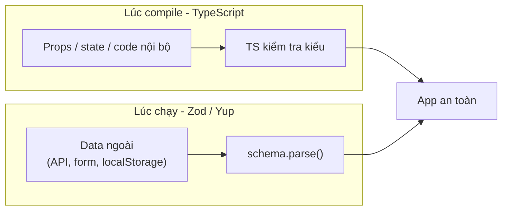
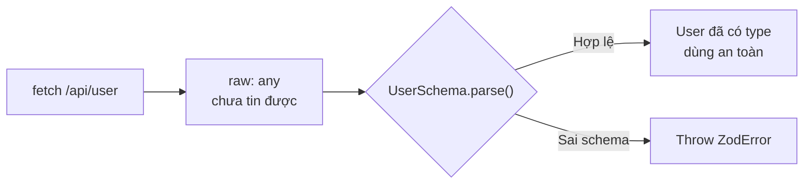

# Types và Validation

Trong React, **Types** (kiểu dữ liệu) giúp bạn khai báo rõ ràng props và state nhận giá trị gì, thường dùng cùng TypeScript để bắt lỗi ngay khi viết code. **Validation** (kiểm tra dữ liệu hợp lệ) đảm bảo dữ liệu truyền vào component đúng định dạng mong đợi, tránh lỗi khi chạy. Bài này giới thiệu cách dùng TypeScript cho component và kiểm tra dữ liệu lúc chạy (runtime).

---

:::note[Ghi nhớ nhanh]

- ⭐ **Hai lớp bảo vệ khác thời điểm** — TypeScript bắt lỗi lúc compile (props, state, code nội bộ); Zod/Yup kiểm tra lúc runtime cho mọi dữ liệu từ ngoài (API, form, `localStorage`).
- ⭐ **`z.infer<typeof Schema>` cho một schema = một type + N điểm validation** — không phải khai báo type và luật kiểm tra hai lần; đây là productivity boost lớn nhất khi TS gặp Zod.
- **TypeScript là default 2026, `PropTypes` đã bỏ khỏi React core từ v19** — đừng dùng PropTypes trong code mới (chỉ check runtime, verbose).
- **Định kiểu component**: dùng `interface Props`, `ReactNode` cho children, extend `React.ButtonHTMLAttributes`; **tránh `React.FC`** (ngầm thêm `children`, khó generic).
- **Zod phổ biến nhất (#1)** — TypeScript-first, hệ sinh thái rộng (RHF, tRPC, Drizzle); **Valibot** nhẹ hơn (~3KB, tree-shakeable) khi cần tối ưu bundle. Dùng `parse` ở server (để error bubble), `safeParse` ở form (hiện lỗi đẹp).

:::

---

## Mục lục

- [Vì sao cần types & validation?](#vì-sao-cần-types--validation)
- [TypeScript với React](#typescript-với-react)
- [PropTypes (legacy)](#proptypes-legacy)
- [Type cho component](#type-cho-component)
- [Validation runtime](#validation-runtime)
- [Zod vs Yup vs Valibot](#zod-vs-yup-vs-valibot)
- [Câu hỏi phỏng vấn](#câu-hỏi-phỏng-vấn)

---

## Vì sao cần types & validation?

**Vấn đề:**

```tsx
// 1. Truyền sai props mà không ai báo lúc viết code
function Greeting({ name, age }) {
  return <p>Hi {name}, {age + 1}</p>;
}

<Greeting name="An" />;        // quên age → age là undefined
<Greeting name="An" age="20" />; // sai kiểu → "201" thay vì 21
// Không lỗi compile, chỉ crash/sai khi chạy → rất khó truy vết

// 2. Dữ liệu từ API/form là "không tin được"
const user = await fetch("/api/user").then(r => r.json());
user.profile.avatar; // thiếu field → crash; sai kiểu → bug ngầm
```

**Giải pháp:**

```tsx
// (1) Compile-time: TypeScript định kiểu props (thay PropTypes runtime cũ)
interface GreetingProps {
  name: string;
  age: number;
}

function Greeting({ name, age }: GreetingProps) {
  return <p>Hi {name}, {age + 1}</p>;
}

<Greeting name="An" />;          // ❌ IDE báo ngay: thiếu 'age'
<Greeting name="An" age="20" />; // ❌ IDE báo ngay: 'age' phải là number
// → bắt lỗi khi viết + autocomplete

// (2) Runtime: Zod parse dữ liệu ngoài tại boundary, đồng thời suy ra type
import { z } from "zod";

const UserSchema = z.object({
  name: z.string(),
  age: z.number(),
});
type User = z.infer<typeof UserSchema>; // type suy ra từ schema

async function fetchUser(): Promise<User> {
  const raw = await fetch("/api/user").then(r => r.json());
  return UserSchema.parse(raw); // báo lỗi rõ nếu thiếu field/sai kiểu
}
```

**Hai lớp bảo vệ:** TypeScript bắt lỗi lúc compile (props, code nội bộ), Zod/Yup kiểm tra lúc runtime cho mọi dữ liệu đến từ bên ngoài.

Có thể hình dung hai lớp bảo vệ này hoạt động ở hai thời điểm khác nhau:



:::tip[Dùng thực tế]

- **Định kiểu props component**: TypeScript báo ngay khi quên prop hoặc truyền sai kiểu, kèm autocomplete.
- **Validate form**: Zod parse dữ liệu nhập trước khi submit, hiển thị lỗi rõ ràng cho người dùng.
- **Parse response API**: gọi `UserSchema.parse(...)` ngay sau `fetch`, chặn dữ liệu rác trước khi nó lan vào app.
- **Suy type từ schema**: `z.infer<typeof Schema>` cho ra type duy nhất — không phải khai báo type và validation hai lần.

:::

---

## TypeScript với React

TypeScript là **default 2026** cho mọi project React mới. Lợi ích:

- Autocomplete props, hook.
- Catch bug compile-time (typo, undefined, sai type).
- Refactor an toàn.
- Documentation từ type.

(Tham khảo [TypeScript roadmap](/docs/typescript/01-gioi-thieu/1_typescript-la-gi)
cho cơ bản.)

---

## PropTypes (legacy)

Trước TS, React có **PropTypes** để runtime check props:

```jsx
import PropTypes from "prop-types";

function Greeting({ name, age }) {
  return <p>Hi {name}, {age}</p>;
}

Greeting.propTypes = {
  name: PropTypes.string.isRequired,
  age: PropTypes.number,
};
```

:::warning[Cần lưu ý]

**PropTypes đã được tách khỏi React core từ v19**:

- Check **runtime only** — đến lúc chạy mới biết sai.
- Verbose hơn TS interface.
- TS bắt lỗi **compile-time** — sớm hơn nhiều.

Năm 2026, **đừng dùng PropTypes** trong code mới. Migrate sang TypeScript.

:::

---

## Type cho component

**Functional component**:

```tsx
interface ButtonProps {
  label: string;
  onClick: () => void;
  variant?: "primary" | "secondary";
  disabled?: boolean;
}

function Button({ label, onClick, variant = "primary", disabled }: ButtonProps) {
  return <button onClick={onClick} disabled={disabled}>{label}</button>;
}
```

**Children type**:

```tsx
import { ReactNode } from "react";

interface CardProps {
  children: ReactNode;
}

function Card({ children }: CardProps) {
  return <div>{children}</div>;
}
```

**Event handler**:

```tsx
function Form() {
  const handleSubmit = (e: React.FormEvent<HTMLFormElement>) => {
    e.preventDefault();
  };

  const handleChange = (e: React.ChangeEvent<HTMLInputElement>) => {
    console.log(e.target.value);
  };

  return (
    <form onSubmit={handleSubmit}>
      <input onChange={handleChange} />
    </form>
  );
}
```

**Extend HTML attribute**:

```tsx
interface ButtonProps extends React.ButtonHTMLAttributes<HTMLButtonElement> {
  variant?: "primary" | "secondary";
}

function Button({ variant = "primary", ...rest }: ButtonProps) {
  return <button data-variant={variant} {...rest} />;
}

// Nhận mọi prop của <button>: type, disabled, aria-*, data-*, etc.
<Button type="submit" aria-label="Save">Save</Button>
```

:::info[Phân tích]

**Tránh `React.FC`**:

```tsx
// Không khuyến nghị
const Button: React.FC<ButtonProps> = ({ label }) => <button>{label}</button>;

// Khuyến nghị
function Button({ label }: ButtonProps) {
  return <button>{label}</button>;
}
```

Lý do:

- `React.FC` ngầm thêm `children?: ReactNode` → component không nhận
  children vẫn pass type-check.
- Generic component khó hơn.
- React docs đã bỏ khỏi example.

:::

**Generic component**:

```tsx
interface SelectProps<T> {
  options: T[];
  value: T;
  onChange: (value: T) => void;
  renderOption: (option: T) => string;
}

function Select<T>({ options, value, onChange, renderOption }: SelectProps<T>) {
  return (
    <select value={JSON.stringify(value)} onChange={(e) => onChange(JSON.parse(e.target.value))}>
      {options.map((opt, i) => (
        <option key={i} value={JSON.stringify(opt)}>{renderOption(opt)}</option>
      ))}
    </select>
  );
}

// Dùng
<Select<User>
  options={users}
  value={selectedUser}
  onChange={setSelectedUser}
  renderOption={u => u.name}
/>
```

---

## Validation runtime

TypeScript chỉ check **compile-time**. Data từ ngoài (API, user, localStorage)
**không type-safe runtime**:

```tsx
const user = await fetch("/api/user").then(r => r.json());
// user có type 'any' — TS không biết đúng hay sai

user.name; // TS không complain, runtime có thể crash
```

→ Cần **runtime validation** tại boundary:

```tsx
import { z } from "zod";

const UserSchema = z.object({
  id: z.number(),
  name: z.string(),
  email: z.string().email(),
});

type User = z.infer<typeof UserSchema>;

async function fetchUser() {
  const raw = await fetch("/api/user").then(r => r.json());
  return UserSchema.parse(raw); // throw nếu sai schema
  // Trả về User (typed)
}
```

Luồng dữ liệu ngoài đi qua cửa kiểm tra schema trước khi vào app:



---

## Zod vs Yup vs Valibot

[**Zod**](https://zod.dev) — phổ biến nhất, TypeScript-first:

```tsx
const schema = z.object({
  email: z.string().email(),
  age: z.number().int().min(18),
});

type Input = z.infer<typeof schema>;

const result = schema.safeParse(input);
if (!result.success) {
  console.log(result.error.flatten());
}
```

[**Valibot**](https://valibot.dev) — alternative gọn hơn, tree-shakeable:

```tsx
import * as v from "valibot";

const schema = v.object({
  email: v.pipe(v.string(), v.email()),
  age: v.pipe(v.number(), v.integer(), v.minValue(18)),
});

const result = v.safeParse(schema, input);
```

[**Yup**](https://github.com/jquense/yup) — cũ, vẫn maintain:

```tsx
import * as yup from "yup";

const schema = yup.object({
  email: yup.string().email().required(),
  age: yup.number().integer().min(18).required(),
});

await schema.validate(input);
```

[**Joi**](https://joi.dev) — Node.js focused, ít dùng frontend.

:::info[Phân tích]

**So sánh nhanh:**

| | Zod | Valibot | Yup |
|--|-----|---------|-----|
| Bundle size | ~14KB | **~3KB** | ~12KB |
| Tree-shakeable | Khá | **Tốt** | Khá |
| TypeScript infer | **Xuất sắc** | Xuất sắc | Tốt |
| Adoption | **#1** | Tăng | Giảm |
| Ecosystem (resolver, plugins) | **Phong phú** | Đang xây | Có |

**Quy tắc:**

- Default project mới → **Zod**.
- Quan tâm bundle size critical → **Valibot**.
- Legacy đã dùng Yup → giữ, migrate nếu cần.

Stack tích hợp Zod:

- **RHF**: `@hookform/resolvers/zod`.
- **tRPC**: input schema.
- **Drizzle ORM**: type inference.
- **Next.js Server Actions**: input parse.

Có thể nói Zod là **lingua franca** của TypeScript ecosystem 2026.

:::

:::tip[Mẹo]

**Pattern "schema everywhere":**

```ts
// schemas/user.ts
import { z } from "zod";

export const userSchema = z.object({
  id: z.string().uuid(),
  name: z.string().min(1).max(100),
  email: z.string().email(),
});

export type User = z.infer<typeof userSchema>;
```

Dùng schema này khắp nơi:

```ts
// API client
const user = userSchema.parse(await fetch("/api/user").then(r => r.json()));

// Form validation
const form = useForm<User>({ resolver: zodResolver(userSchema) });

// Local storage
const stored = userSchema.parse(JSON.parse(localStorage.getItem("user")));

// Server route
export async function POST(req: Request) {
  const data = userSchema.parse(await req.json());
}
```

**1 schema = 1 type + N validation point**. Đây là productivity boost
lớn nhất khi TS gặp Zod.

:::

:::warning[Cần lưu ý]

**`parse` vs `safeParse`:**

```ts
// parse — throw nếu sai
const user = userSchema.parse(input); // crash app nếu input sai

// safeParse — trả result object
const result = userSchema.safeParse(input);
if (result.success) {
  console.log(result.data); // typed
} else {
  console.log(result.error); // ZodError
}
```

Trong API/server: dùng `parse`, để error bubble lên error handler.
Trong form: dùng `safeParse` để hiển thị error đẹp.

:::

---

## Câu hỏi phỏng vấn

Những câu thường gặp về chủ đề này. Tự trả lời trước, rồi đối chiếu lại với nội dung phía trên.

1. TypeScript và Zod bảo vệ ứng dụng ở hai thời điểm khác nhau. Giải thích sự khác biệt đó.
2. Vì sao chỉ có TypeScript là chưa đủ khi nhận dữ liệu từ API, form hay `localStorage`?
3. `z.infer<typeof Schema>` mang lại lợi ích gì? Vì sao gọi đây là 'single source of truth'?
4. Phân biệt `parse` và `safeParse`. Dùng cái nào ở tầng API server, cái nào ở form? Vì sao?
5. Vì sao `PropTypes` bị loại khỏi React core từ v19? Nó có hạn chế gì so với TypeScript?
6. Vì sao nên tránh `React.FC` khi khai báo component? Nêu ít nhất hai lý do.
7. So sánh `type` và `interface` khi định nghĩa props. Khi nào bắt buộc phải dùng một trong hai?
8. Phân biệt `ReactNode`, `ReactElement` và `JSX.Element`. Kiểu nào phù hợp cho `children`?
9. Vì sao nên extend `React.ButtonHTMLAttributes` khi làm component `Button` tái sử dụng?
10. Cách khai báo một **generic component** trong React + TypeScript? Cho ví dụ với component `List`.
11. So sánh `unknown` và `any`. Vì sao `unknown` an toàn hơn khi nhận dữ liệu bên ngoài?
12. **Discriminated union** giúp mô hình hoá các bộ props loại trừ lẫn nhau như thế nào?
13. Xử lý `ZodError` ra sao để hiển thị lỗi theo từng field? `error.flatten()` hay `error.issues` phù hợp hơn?
14. `.refine()` và `.superRefine()` khác nhau ở đâu? Khi nào bắt buộc dùng `.superRefine()`?
15. `z.coerce` giải quyết vấn đề gì khi dữ liệu form luôn về dưới dạng chuỗi?
16. So sánh Zod, Yup và Valibot theo tiêu chí type inference, hệ sinh thái và bundle size.
17. Vì sao Valibot nhẹ hơn Zod đáng kể? Giải thích khái niệm tree-shakeable trong ngữ cảnh này.
18. Validate biến môi trường bằng Zod ngay lúc khởi động ứng dụng mang lại lợi ích gì?
19. Một API đổi schema mà không báo trước. Việc validate runtime giúp bạn phát hiện và xử lý sự cố này thế nào?
20. Type assertion (`as`) và validate bằng Zod đều 'ép' được kiểu. Vì sao `as` là con dao hai lưỡi?
